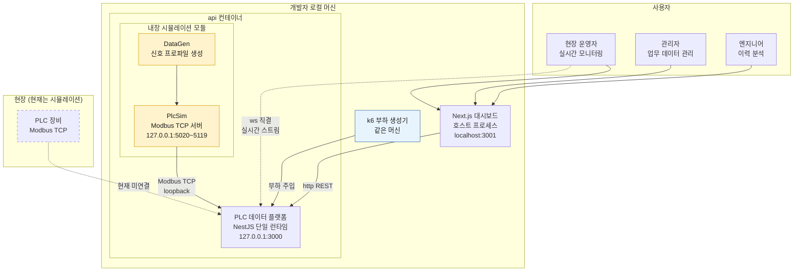
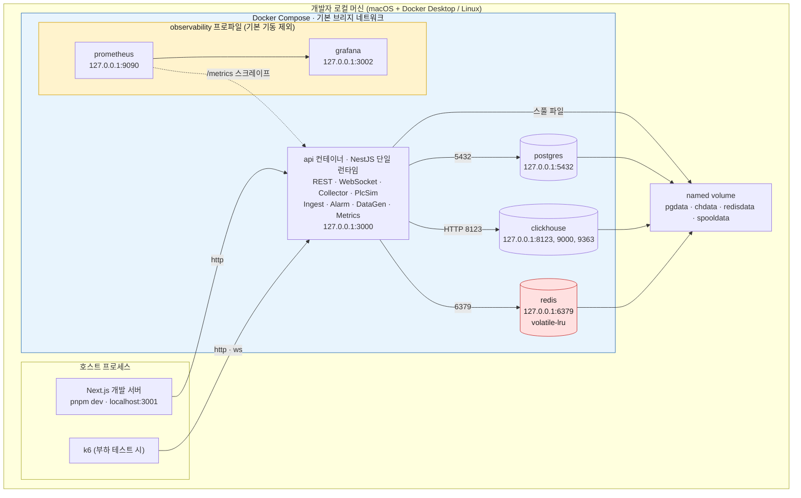
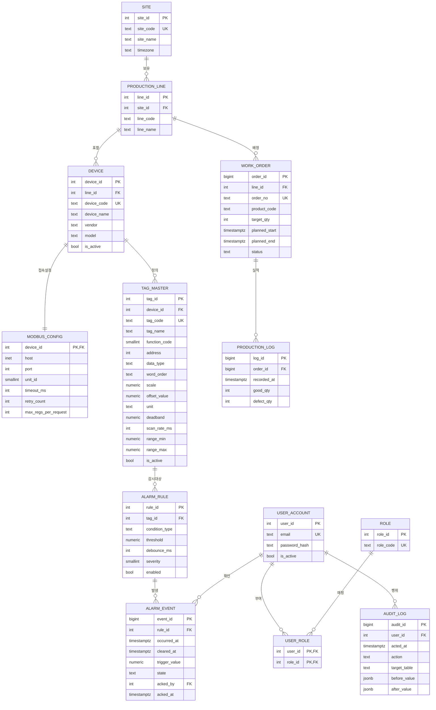
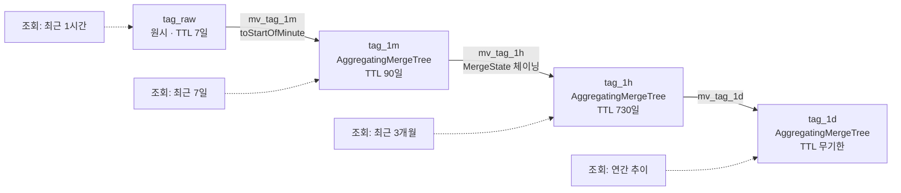
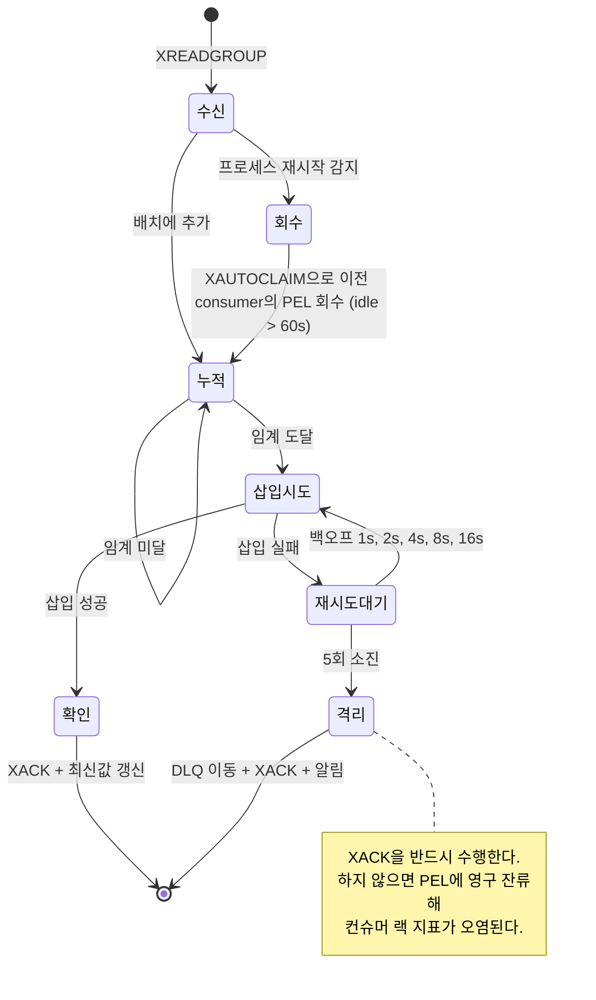
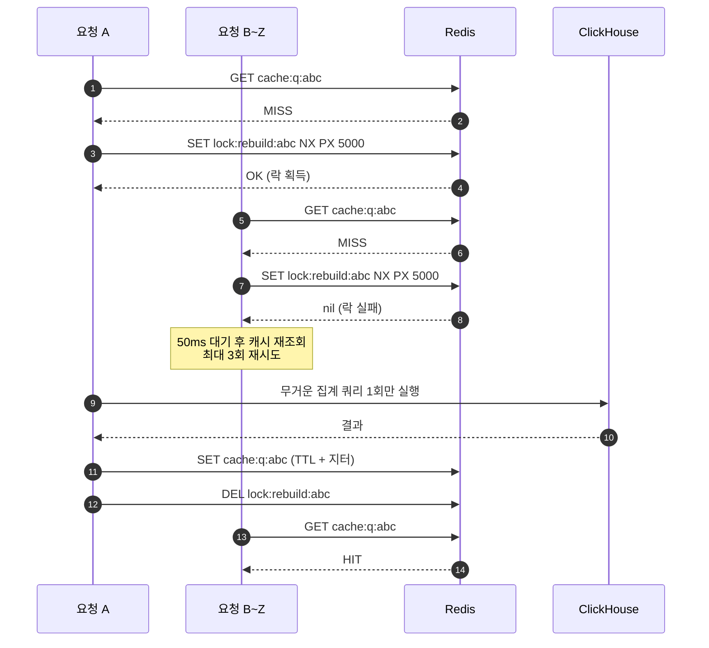
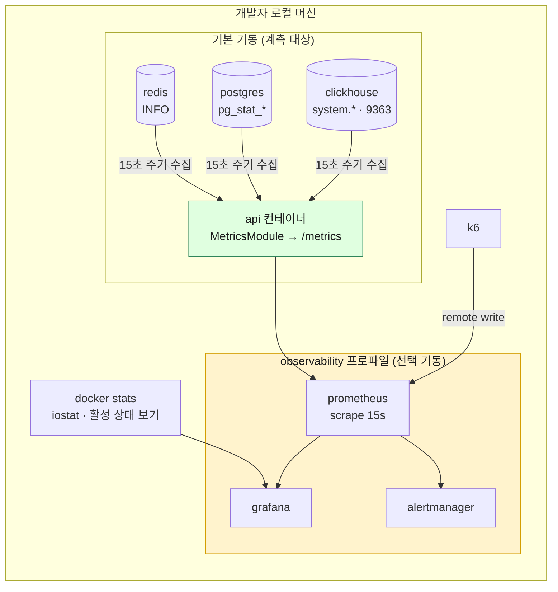
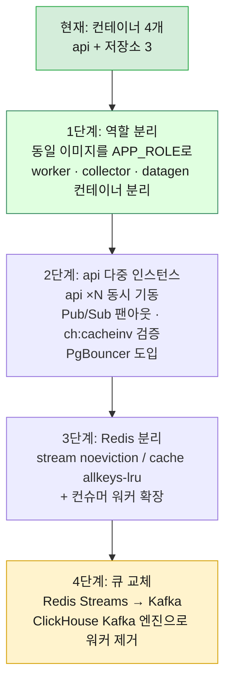

# 아키텍처 설계서

> 프로젝트: PLC 대용량 시계열 + 업무 데이터 분리 처리 웹 시스템
> 관련 문서: tech_stack.md (기술 선정), data_flow.md (데이터 흐름)
> 작성일: 2026-09-09
> 개정일: 2026-09-12 (로컬 전용 전환: 배포 구성 제거, Docker Compose 컨테이너 4개 + 호스트 Next.js)

---

## 1. 설계 원칙

| 원칙 | 구체적 규칙 | 위반 시 발생하는 문제 |
|---|---|---|
| 쓰기 경로와 읽기 경로 분리 | 수집 파이프라인과 조회 API는 모듈 경계와 Redis Stream 큐로 분리하고, CPU 바운드 작업은 worker_threads로 격리한다. 프로세스·컨테이너 분리는 이벤트 루프 지연이 실측될 때 확장 로드맵 1단계(APP_ROLE 분리)로 수행한다 | 수집 폭주가 이벤트 루프를 점유해 대시보드 응답이 느려진다 |
| 저장소 책임 단일화 | 업무 데이터는 PostgreSQL, 시계열은 ClickHouse. 중복 저장 금지 | 두 곳의 값이 달라지고 어느 쪽이 진실인지 모르게 된다 |
| 비동기 경계 삽입 | 수집기와 DB 사이에 반드시 Redis Stream을 둔다. **같은 프로세스 안이어도 예외가 아니다.** 근거 네 가지: ① 백프레셔 흡수(수집 속도와 적재 속도를 분리) ② at-least-once 재시도·DLQ 보장 ③ 이벤트 루프 격리(폴링 루프와 배치 삽입을 큐로 디커플링) ④ 재처리·역할 분리 대비(APP_ROLE 분리 시 코드 변경 없음) | DB 지연이 즉시 현장 수집 지연으로 전파되고, 재시도·재처리를 걸 지점 자체가 사라진다 |
| 멱등성 확보 | 모든 적재는 재시도해도 중복이 생기지 않아야 한다 | at-least-once 재시도가 데이터를 오염시킨다 |
| 백프레셔 명시화 | 버퍼가 차면 조용히 버리지 말고 실패시키고 계측한다 | 유실을 인지하지 못한 채 잘못된 성능 수치를 얻는다 |
| 계측 우선 | 새 컴포넌트는 메트릭 노출과 함께 추가한다 | 병목을 추측으로 찾게 된다 |

---

## 2. 시스템 컨텍스트



사용자 세 종류는 모두 브라우저로 `http://localhost:3001`에 접속한다. 원격 접속자도, 외부 망도 없다.

경계에서 주의할 점:

| 경계 | 프로토콜 | 설계 결정 |
|---|---|---|
| 브라우저 → Next.js (localhost:3001) | http | 화면 렌더링과 정적 자산. 개발 서버이므로 HMR을 쓴다 |
| Next.js Route Handler → api (127.0.0.1:3000) | http | 저빈도 업무 데이터 조회의 BFF 프록시. **httpOnly 리프레시 쿠키를 서버에서만 다루는 것이 이 경로가 존재하는 가장 중요한 이유다** |
| Next.js 서버사이드 fetch → api | http | RSC와 Route Handler의 서버 측 fetch. 응답은 Next.js 서버 fetch 캐시(revalidate 30초)로 짧게 흡수한다 |
| 브라우저 → api 직결 | http + ws | **고빈도 실시간 데이터는 BFF를 경유하지 않는다.** 최신값 폴링·시계열 조회·WebSocket에 중계를 한 홉 더할 이유가 없다 |
| 웹 → DB 직접 접속 | **금지** | 커넥션 관리를 api 한 곳으로 일원화하고, 인가 검사를 우회하는 경로를 만들지 않기 위해서다 |

---

## 3. 실행 구성



Docker Compose 서비스 목록:

| 서비스 | 이미지 | 호스트 포트 | 재시작 정책 | 역할 |
|---|---|---|---|---|
| api | 로컬 빌드 (node:22-alpine, 멀티스테이지) | 127.0.0.1:3000 | unless-stopped | REST + WebSocket + Collector + PlcSim + Ingest + Alarm + DataGen + Metrics |
| postgres | postgres:18-alpine | 127.0.0.1:5432 | unless-stopped | OLTP |
| clickhouse | clickhouse/clickhouse-server:25.8 | 127.0.0.1:8123(HTTP), 127.0.0.1:9000(네이티브 CLI), 127.0.0.1:9363(메트릭) | unless-stopped | OLAP |
| redis | redis:8-alpine | 127.0.0.1:6379 | unless-stopped | Stream 버퍼 + 캐시 + Pub/Sub + 세션 |

**애플리케이션 컨테이너 1개(api) + 저장소 컨테이너 3개(postgres, clickhouse, redis).** 데이터 평면은 별도 컨테이너가 아니라 api 컨테이너 안의 NestJS 모듈이다. PlcSim이 여는 5020~5119 포트는 컨테이너 내부 loopback(127.0.0.1) 전용이므로 Compose의 ports에 기재하지 않는다. 기동 역할은 APP_ROLE 환경변수로 정하고 기본값은 all이다. 네트워크는 Docker 기본 브리지 하나이고, 서비스명 DNS(postgres, clickhouse, redis)로 서로를 찾는다.

**웹은 컨테이너가 아니다.** Next.js는 호스트에서 `pnpm dev`(`next dev -p 3001`)로 띄운다. HMR이 컨테이너 안에서는 느리고 불안정하기 때문이다. 5번째 컨테이너로 넣을 수도 있지만 기본 구성은 호스트 프로세스다.

**호스트 포트는 전부 127.0.0.1에 바인드한다.** 저장소 포트를 호스트에 여는 판단이 바뀌었다. 공개 호스트에서는 금지였지만, 로컬에서는 psql·clickhouse-client·redis-cli·DBeaver로 직접 붙어 상태를 확인하는 것이 학습에 필요하다. `0.0.0.0`이 아닌 `127.0.0.1` 바인드가 그 안전장치이고, 이것 하나로 LAN 노출을 막는다. 호스트에 이미 같은 포트를 쓰는 서비스가 있으면 **호스트 쪽 포트만** 바꾸고 컨테이너 내부 포트와 서비스명 DNS는 그대로 둔다.

**ClickHouse 포트 용도:** 애플리케이션은 **HTTP 8123만** 쓴다(@clickhouse/client는 HTTP 전용). 네이티브 9000은 clickhouse-client CLI와 clickhouse-benchmark 전용이고, 9363은 내장 Prometheus 엔드포인트다. 앱이 쓰는 포트와 사람이 쓰는 포트를 구분해 두면 커넥션 수를 해석할 때 혼동이 없다.

**기동 순서:** 저장소 컨테이너 3개에 healthcheck를 정의하고, api는 depends_on의 condition: service_healthy로 묶는다.

| 서비스 | healthcheck | 대기 대상 |
|---|---|---|
| postgres | pg_isready -U plc -d plcdb | - |
| clickhouse | wget -qO- localhost:8123/ping | - |
| redis | redis-cli ping | - |
| api | wget -qO- localhost:3000/api/v1/health | postgres, clickhouse, redis 전부 healthy |

컨테이너가 떴다는 사실과 접속을 받을 준비가 됐다는 사실은 다르다. 이 구분이 없으면 api가 먼저 올라와 커넥션 오류로 재시작 루프를 돌고, 그 사이 CollectorModule이 불필요한 스풀 파일을 만들기 시작한다. 학습 로드맵 Phase 0의 성공 기준도 "모든 컨테이너 healthy"로 잡는다.

볼륨은 전부 **named volume**을 쓴다.

| 볼륨 | 마운트 | 용도 |
|---|---|---|
| pgdata | postgres:/var/lib/postgresql/data | PGDATA |
| chdata | clickhouse:/var/lib/clickhouse | 파트·머지 |
| redisdata | redis:/data | AOF |
| spooldata | api:/app/spool | 백프레셔 시 로컬 디스크 스풀 |

**호스트 디렉터리를 마운트하지 않는 이유:** macOS와 Windows의 Docker Desktop에서 호스트 디렉터리 마운트는 파일 공유 계층(VirtioFS)을 거치므로 DB의 랜덤 I/O가 눈에 띄게 느려진다. named volume은 VM 내부 파일시스템에 있어 이 계층을 타지 않는다. Linux에서는 차이가 작지만 구성을 하나로 유지한다. 대신 호스트에서 파일을 직접 들여다볼 수 없으므로, 스풀 확인은 `docker compose exec api ls -l /app/spool`로 한다.

**실험 롤백은 반드시 유지한다.** 부하 테스트는 같은 초기 상태에서 반복해야 비교가 성립하는데, TTL과 머지가 진행된 데이터 위에 다시 부하를 걸면 직전 실험의 잔재가 결과에 섞인다. Taskfile에 스냅샷과 복원을 넣는다.

| 명령 | 동작 |
|---|---|
| task snapshot | 컨테이너 정지 → 볼륨별로 `docker run --rm -v <volume>:/from -v $PWD/snapshots:/to alpine tar czf /to/<name>.tgz -C /from .` |
| task restore | 컨테이너 정지 → 볼륨 비우기 → tar 역방향 전개 → 재기동 |

Redis AOF는 별도로 백업하지 않는다. Stream은 재생 가능한 버퍼이고 캐시·세션은 휘발성이며 최신값은 ClickHouse에서 재구성할 수 있다. AOF의 목적은 백업이 아니라 재기동 시 미소비 Stream 엔트리를 잃지 않는 것이고, 전체 롤백이 필요하면 `task snapshot`이 그 역할을 대신한다.

---

## 4. 컴포넌트 책임

모든 컴포넌트가 TypeScript다. Next.js Web만 호스트 프로세스로 돌고, 나머지는 전부 api 컨테이너 안에서 기동하는 NestJS 모듈이다. 표기 규칙: 코드 식별자는 CollectorModule처럼 쓰고, 본문과 다른 문서에서는 "Collector 모듈"로 쓴다. 둘은 같은 것을 가리킨다.

| 컴포넌트 | 배치 | 책임 | 하지 않는 일 | 확장 방식 |
|---|---|---|---|---|
| Next.js Web | 호스트 프로세스 (localhost:3001) | 화면 렌더링, 차트, 사용자 상호작용, 저빈도 조회 BFF 프록시 | DB 직접 접근, 고빈도 데이터 중계 | 해당 없음 (단일 개발 서버) |
| NestJS API (제어 평면) | api 컨테이너 | 인증·인가, 업무 CRUD, 시계열 조회 오케스트레이션, WebSocket 팬아웃, 캐시 제어 | 모듈 간 직접 호출로 Stream 경계를 건너뛰는 일, CPU 바운드 작업을 이벤트 루프에서 처리하는 일 | APP_ROLE 분리 후 인스턴스 수평 증설 |
| CollectorModule | api 컨테이너 | Modbus 폴링(modbus-serial), 레지스터 디코딩, 공학 단위 변환, 품질 판정, 데드밴드, Stream 발행 | DB 직접 쓰기, Ingest 직접 호출 | 설비 그룹별 폴링 루프 분할(동일 프로세스) → APP_ROLE 분리 시 설비 샤딩 |
| PlcSimModule | api 컨테이너 | Modbus TCP 서버 응답(jsmodbus), holding/input 레지스터 Buffer 런타임 갱신, 지연·오류 주입 | 데이터 생성 로직, 컨테이너 외부 노출 | 설비당 포트(127.0.0.1:5020~5119) |
| IngestModule | api 컨테이너 | Stream 소비(ioredis XREADGROUP), 배치 축적, ClickHouse 삽입(@clickhouse/client HTTP 8123), XACK, 재시도, DLQ, 최신값 갱신·부팅 시 복원 | 비즈니스 로직 | 동일 프로세스 내 컨슈머 3개(consumer name ingest-{pid}-{n}, 각자 독립 XREADGROUP 루프, 디코딩은 piscina 워커) → 역할 분리 후 컨테이너 단위 워커로 확장 |
| AlarmModule | api 컨테이너 | alarm:state Hash 갱신(디바운스 상태 머신), ClickHouse alarm_eval 전수 기록, PostgreSQL ALARM_EVENT 확정 기록, ch:alarm 발행 | 임계값 정의(원천은 PostgreSQL ALARM_RULE) | Ingest 후처리로 함께 확장 |
| DataGenModule | api 컨테이너 | 신호 프로파일 기반 테스트 데이터 생성(worker_threads + TypedArray), PlcSim 레지스터 갱신, 고부하 직접 주입, 과거 데이터 백필 | 정상 수집 경로 참여 | piscina 워커 증설 → 병목 시 APP_ROLE=datagen 컨테이너를 따로 띄워 주입 |
| MetricsModule | api 컨테이너 | 앱·HTTP·WS·파이프라인 메트릭에 Redis INFO, pg_stat_*, ClickHouse system.* 를 더해 15초 주기로 수집하고 /metrics 하나로 노출 | 메트릭 저장·시각화(observability 프로파일의 Prometheus/Grafana 담당) | 수집 주기·카디널리티 조정 |

**모듈 경계 규칙:** 한 프로세스 안에 있어도 Collector와 Ingest는 서로를 직접 호출하지 않고 Redis Stream을 통해서만 연결한다. CPU 바운드 작업(대량 데이터 생성, 대량 MessagePack 인코딩, LTTB 다운샘플)은 worker_threads(piscina)로 오프로드해 이벤트 루프를 비워 둔다. 이 두 규칙 덕분에 동일 이미지를 APP_ROLE=api|worker|collector|datagen으로 나눠 기동하는 것만으로 역할 분리가 끝난다(확장 로드맵 1단계).

---

## 5. 저장소 분리 전략

| 데이터 | 저장소 | 근거 | 예상 규모 | 접근 패턴 |
|---|---|---|---|---|
| 사용자·권한 | PostgreSQL | 강한 정합성, 관계 제약 | 수백 행 | 읽기 위주, 캐시 대상 |
| 사이트·라인·설비 마스터 | PostgreSQL | 참조 무결성 | 수백 행 | 읽기 위주, 캐시 대상 |
| 태그 마스터 | PostgreSQL | 시스템 전체의 메타 원천 | 수천~수만 행 | 읽기 매우 빈번 → Redis + ClickHouse Dictionary 이중 캐시 |
| Modbus 접속 설정 | PostgreSQL | 설비 마스터에 종속 | 수백 행 | CollectorModule 기동 시 로드 |
| 작업지시·생산 실적 | PostgreSQL | 트랜잭션, 갱신 빈번 | 수만~수십만 행 | CRUD |
| 알람 규칙 | PostgreSQL | 갱신 필요 | 수백 행 | 캐시 대상 |
| 알람 이벤트 | PostgreSQL (월 파티션) | 확인·해제 상태 갱신 필요 | 월 수만 행 | 조회 + 상태 갱신 |
| **PLC 태그 원시값** | **ClickHouse** | 추가 전용, 초당 수만 행, 범위 집계 | **일 수억~수십억 행** | 시간 범위 스캔 |
| 태그 1분/1시간/1일 롤업 | ClickHouse (MV) | 원시 스캔 회피 | 원시의 1/60, 1/3600 | 대시보드 기본 조회원 |
| 알람 판정 이력(전수) | ClickHouse | 고빈도, 갱신 없음 | 원시와 유사 | 분석용 |
| 태그 최신값 | Redis Hash | 마이크로초 응답 필요 | 태그 수만큼 | 초당 수천 회 읽기 |
| 조회 결과 캐시 | Redis String | 반복 조회 흡수 | 가변 | TTL 기반 |
| 수집 버퍼 | Redis Stream | 백프레셔 흡수 | 수만~수백만 엔트리 | FIFO 소비 |
| 세션·토큰 | Redis String | 즉시 무효화 | 동시 사용자 수 | TTL 기반 |

**중복 저장을 허용하는 유일한 예외:** 태그 최신값. Redis Hash와 ClickHouse 양쪽에 존재한다. Redis 쪽은 휘발성 사본으로 취급하고, IngestModule이 기동할 때 ClickHouse tag_raw에서 태그별 마지막 값을 argMax 쿼리 1회로 조회해 rt:latest 계열 Hash를 재구성한다. 불일치가 발생해도 ClickHouse가 진실이다.

---

## 6. PostgreSQL 스키마



주요 설계 결정:

| 항목 | 결정 | 이유 |
|---|---|---|
| 시각 타입 | 전부 timestamptz | 시간대 혼동은 시계열 시스템의 최대 버그 원인 |
| tag_id 타입 | int (4바이트) | ClickHouse에 매 행 저장되므로 폭을 최소화. UUID는 16바이트로 저장량이 4배 |
| ALARM_EVENT 파티셔닝 | occurred_at 기준 월 RANGE 파티션, pg_partman 자동 생성 | 조회 범위 제한과 오래된 파티션 DETACH 용이 |
| AUDIT_LOG | jsonb before/after | 스키마 변경에 유연 |
| 인덱스 | tag_master(device_id, is_active), alarm_event(rule_id, occurred_at DESC), work_order(line_id, status) | 실제 조회 패턴 기반. 무분별한 인덱스는 삽입 성능을 해친다 |
| 커넥션 | api 프로세스의 in-process 풀(pg Pool, max 20) | 접속 주체가 단일 프로세스 하나뿐이라 커넥션 폭발이 구조적으로 발생하지 않는다. 세션 모드와 동등하므로 prepared statement를 제약 없이 쓸 수 있다 |

주요 튜닝 파라미터 (부하 실험 프로파일에서 PostgreSQL 컨테이너에 2 GB 할당 기준, 13절):

| 파라미터 | 값 | 설명 |
|---|---|---|
| shared_buffers | 512MB | 컨테이너 할당 메모리의 약 25% |
| effective_cache_size | 1536MB | 플래너 힌트 |
| work_mem | 16MB | 동시 정렬 연산 수를 고려해 보수적으로 |
| maintenance_work_mem | 256MB | VACUUM, 인덱스 생성 |
| max_connections | 100 | 접속자는 api 풀(최대 20) + ClickHouse Dictionary 소스(최대 2) + 호스트에서 직접 붙는 psql·DBeaver뿐이라 여유가 충분 |
| wal_compression | zstd | 디스크 쓰기량 절약 |
| checkpoint_timeout | 15min | 체크포인트 스파이크 완화 |
| random_page_cost | 1.1 | 로컬 SSD 기준 |

---

## 7. ClickHouse 스키마

### 7.1 원시 테이블

```sql
CREATE DATABASE IF NOT EXISTS plc;

CREATE TABLE plc.tag_raw
(
    ts          DateTime64(3, 'Asia/Seoul') CODEC(Delta(8), ZSTD(1)),
    device_id   UInt32                      CODEC(Delta(4), ZSTD(1)),
    tag_id      UInt32                      CODEC(Delta(4), ZSTD(1)),
    value       Float64                     CODEC(Gorilla, ZSTD(1)),
    quality     UInt8                       CODEC(ZSTD(1)),
    scan_seq    UInt64                      CODEC(Delta(8), ZSTD(1)),
    ingested_at DateTime64(3) DEFAULT now64(3) CODEC(Delta(8), ZSTD(1))
)
ENGINE = MergeTree
PARTITION BY toYYYYMMDD(ts)
ORDER BY (device_id, tag_id, ts)
TTL toDateTime(ts) + INTERVAL 7 DAY DELETE
SETTINGS
    index_granularity = 8192,
    non_replicated_deduplication_window = 1000;
```

설계 근거:

| 요소 | 선택 | 이유 |
|---|---|---|
| 롱 포맷(태그당 1행) | 채택 | 설비마다 태그 구성이 다르고 태그 추가가 빈번. 와이드 포맷은 스키마 변경 지옥 |
| PARTITION BY 일자 | toYYYYMMDD | TTL 삭제가 파티션 DROP으로 처리되어 즉시 완료. 월 단위는 파티션이 너무 커지고, 시간 단위는 파티션 수가 폭증 |
| ORDER BY (device_id, tag_id, ts) | 채택 | 실제 조회는 "특정 설비의 특정 태그를 시간 범위로" 형태. 카디널리티 낮은 컬럼을 앞에 두어 압축률과 스킵 인덱스 효율 확보 |
| ts 코덱 Delta + ZSTD | 채택 | 등간격 타임스탬프는 델타 후 거의 상수가 되어 압축률이 극대화 |
| value 코덱 Gorilla | 채택 | 부동소수 시계열 전용 코덱. Facebook Gorilla 논문 기반, XOR 방식 |
| TTL 7일 | 채택 | 학습 환경 디스크 보호. 롤업 테이블이 장기 데이터를 담당 |
| index_granularity | 8192(기본) | 좁은 시간 범위 조회가 많으면 4096으로 낮추는 실험 대상 |
| 중복 제거 | non_replicated_deduplication_window + insert_deduplication_token | at-least-once 재시도로 인한 중복 차단 |

**멱등성 구현:** IngestModule은 배치마다 안정적인 토큰(예: 스트림 시작 ID + 끝 ID의 해시)을 만들어 @clickhouse/client의 insert({ clickhouse_settings: { insert_deduplication_token } })로 전달한다. 동일 배치가 재삽입되면 ClickHouse가 파트 단위로 무시한다. ReplacingMergeTree 대비 조회 시 FINAL 비용이 없다는 것이 장점이다.

### 7.2 롤업 캐스케이드



```sql
CREATE TABLE plc.tag_1m
(
    bucket    DateTime CODEC(Delta(4), ZSTD(1)),
    device_id UInt32,
    tag_id    UInt32,
    cnt       AggregateFunction(count),
    avg_v     AggregateFunction(avg, Float64),
    min_v     AggregateFunction(min, Float64),
    max_v     AggregateFunction(max, Float64),
    last_v    AggregateFunction(argMax, Float64, DateTime64(3)),
    p95_v     AggregateFunction(quantilesTDigest(0.95), Float64),
    bad_cnt   AggregateFunction(countIf, UInt8)
)
ENGINE = AggregatingMergeTree
PARTITION BY toYYYYMM(bucket)
ORDER BY (device_id, tag_id, bucket)
TTL bucket + INTERVAL 90 DAY DELETE;

CREATE MATERIALIZED VIEW plc.mv_tag_1m TO plc.tag_1m AS
SELECT
    toStartOfMinute(ts)                AS bucket,
    device_id,
    tag_id,
    countState()                       AS cnt,
    avgState(value)                    AS avg_v,
    minState(value)                    AS min_v,
    maxState(value)                    AS max_v,
    argMaxState(value, ts)             AS last_v,
    quantilesTDigestState(0.95)(value) AS p95_v,
    countIfState(quality > 0)          AS bad_cnt
FROM plc.tag_raw
GROUP BY bucket, device_id, tag_id;

CREATE MATERIALIZED VIEW plc.mv_tag_1h TO plc.tag_1h AS
SELECT
    toStartOfHour(bucket) AS bucket,
    device_id,
    tag_id,
    countMergeState(cnt)               AS cnt,
    avgMergeState(avg_v)               AS avg_v,
    minMergeState(min_v)               AS min_v,
    maxMergeState(max_v)               AS max_v,
    argMaxMergeState(last_v)           AS last_v,
    quantilesTDigestMergeState(0.95)(p95_v) AS p95_v,
    countIfMergeState(bad_cnt)         AS bad_cnt
FROM plc.tag_1m
GROUP BY bucket, device_id, tag_id;
```

조회 시에는 -Merge 조합자를 사용한다:

```sql
SELECT
    bucket,
    avgMerge(avg_v)  AS avg_value,
    minMerge(min_v)  AS min_value,
    maxMerge(max_v)  AS max_value,
    countMerge(cnt)  AS sample_count
FROM plc.tag_1m
WHERE device_id = 12 AND tag_id = 3401
  AND bucket BETWEEN {from:DateTime} AND {to:DateTime}
GROUP BY bucket
ORDER BY bucket;
```

**핵심 개념:** MV의 타깃 테이블에 삽입이 일어나면 그 테이블에 붙은 MV도 연쇄적으로 발동한다. 이 성질을 이용해 원시 → 분 → 시간 → 일 롤업을 별도 배치 잡 없이 삽입 시점에 완성한다. 단, MV는 **삽입되는 블록만** 보므로 과거 데이터를 나중에 넣으면 그 시점 기준으로 집계된다. 백필 시에는 MV를 잠시 분리하고 INSERT SELECT로 직접 채우는 절차가 필요하다.

### 7.3 알람 판정 이력 테이블

```sql
CREATE TABLE plc.alarm_eval
(
    ts        DateTime64(3) CODEC(Delta(8), ZSTD(1)),
    rule_id   UInt32,
    tag_id    UInt32,
    value     Float64 CODEC(Gorilla, ZSTD(1)),
    breached  UInt8,
    severity  UInt8
)
ENGINE = MergeTree
PARTITION BY toYYYYMMDD(ts)
ORDER BY (rule_id, ts)
TTL toDateTime(ts) + INTERVAL 30 DAY DELETE;
```

확정된 알람 이벤트(발생/해제/확인 상태 관리 필요)는 PostgreSQL의 ALARM_EVENT에 기록하고, 여기에는 매 판정 결과 전수를 남긴다. 임계값 튜닝과 오탐 분석에 쓴다.

### 7.4 PostgreSQL 마스터 데이터 연동 (Dictionary)

```sql
CREATE DICTIONARY plc.dict_tag
(
    tag_id      UInt32,
    device_id   UInt32,
    tag_code    String,
    tag_name    String,
    unit        String,
    range_min   Float64,
    range_max   Float64
)
PRIMARY KEY tag_id
SOURCE(POSTGRESQL(
    host 'postgres' port 5432
    user 'ch_reader' password '<secret>'
    db 'plcdb'
    query 'SELECT tag_id, device_id, tag_code, tag_name, unit, range_min, range_max FROM tag_master WHERE is_active'
))
LAYOUT(HASHED())
LIFETIME(MIN 300 MAX 600);
```

사용:

```sql
SELECT
    dictGet('plc.dict_tag', 'tag_name', toUInt64(tag_id)) AS tag_name,
    dictGet('plc.dict_tag', 'unit',     toUInt64(tag_id)) AS unit,
    avgMerge(avg_v) AS avg_value
FROM plc.tag_1m
WHERE device_id = 12 AND bucket >= now() - INTERVAL 1 DAY
GROUP BY tag_id;
```

이 구조의 이점:

| 항목 | 효과 |
|---|---|
| 저장량 | ClickHouse에는 tag_id(4바이트)만 저장. 태그명 문자열을 매 행 저장하지 않는다 |
| 정합성 | 태그명이 바뀌어도 과거 데이터를 수정할 필요가 없다. 마스터는 PostgreSQL 하나뿐 |
| 성능 | HASHED 레이아웃은 메모리 상주. dictGet은 해시 조회 수준의 비용 |
| 갱신 | LIFETIME 설정으로 5~10분마다 자동 재적재. 태그 마스터 변경 커밋 직후에는 api가 SYSTEM RELOAD DICTIONARY plc.dict_tag를 호출해 즉시 반영한다(12절) |

주의: Dictionary가 PostgreSQL을 주기적으로 조회하므로 전용 읽기 전용 계정을 쓰고, tag_master가 수만 행을 넘으면 LIFETIME을 늘리거나 CACHE 레이아웃으로 전환한다.

### 7.5 ClickHouse 설정

| 설정 | 값 | 이유 |
|---|---|---|
| max_server_memory_usage_to_ram_ratio | 0.8 | 컨테이너 메모리 제한 5GB 기준(부하 실험 프로파일) |
| max_concurrent_queries | 32 | 소형 호스트에서 쿼리 폭주 방지 |
| background_pool_size | 8 | 머지 병렬도. vCPU 수에 맞춤 |
| parts_to_delay_insert / parts_to_throw_insert | 150 / 300 | 기본값보다 낮춰 파트 폭증을 조기에 감지 |
| async_insert / wait_for_async_insert | 0 / - | IngestModule이 이미 대량 배치를 만들므로 불필요. 소량 다중 클라이언트 실험 시에만 활성화 |
| max_insert_block_size | 1048576 | 대량 배치 삽입 |
| merge_tree.merge_max_block_size | 8192 | 기본 |

---

## 8. Redis 키 설계

Redis는 **단일 인스턴스**다(redis 컨테이너, maxmemory 2.0 GB, **volatile-lru**, appendonly yes). 인스턴스를 stream용과 cache용으로 나누지 않는 대신, **TTL 유무로 eviction 대상을 가른다.**

| 키 계열 | TTL | volatile-lru에서의 운명 | 실패 전략 |
|---|---|---|---|
| Stream, DLQ, 알람 상태, 최신값 | 없음 | **절대 evict되지 않는다** | 명시적으로 실패시켜 백프레셔 발동 |
| 캐시, 세션, 락, 레이트 리밋, 리프레시 토큰 | 필수 | 메모리 압박 시 LRU로 밀려난다 | 조용히 degrade해 DB 직접 조회 |

TTL 키를 전부 밀어내고도 메모리가 부족하면 쓰기 명령이 OOM 오류를 반환한다. 그 시점에 XADD가 실패하고 백프레셔가 발동하므로, Stream에 대해서는 noeviction과 동일한 안전성을 유지하면서 캐시만 유연하게 관리한다. 인스턴스를 나누는 대신 정책 하나로 두 성격을 공존시키는 구조다.

### 8.1 Stream 계열 키 (TTL 없음 · evict 대상 아님)

| 키 | 자료구조 | 값 | 크기 제어 | 용도 |
|---|---|---|---|---|
| stream:plc:raw | Stream | 스캔 사이클 배치(MessagePack) | XADD MAXLEN ~ 200000 | 수집 버퍼 |
| stream:plc:dlq | Stream | 실패 배치 + 오류 사유 | MAXLEN ~ 10000 | 재시도 소진분 |
| stream:plc:raw 컨슈머 그룹 | Consumer Group | grp:ingest | - | 컨슈머 다중화 |
| rt:latest:{device_id} | Hash | field=tag_id, value="ts,value,quality" | 없음(덮어쓰기) | 태그 최신값 |
| rt:seq:{device_id} | String | 최근 스캔 시퀀스 | 없음 | 갱신 확인 |
| alarm:state:{rule_id} | Hash | 상태·연속 위반 횟수·최초 위반 시각 | 없음 | 알람 디바운스 상태 머신 |

이 계열에 TTL을 붙이지 않는 것 자체가 안전장치다. 실수로 TTL을 부여하면 그 키는 곧바로 volatile-lru의 eviction 후보가 되어, 메모리 압박 시 스트림 엔트리나 알람 상태가 조용히 사라진다. 린트 규칙으로 금지한다.

### 8.2 캐시 계열 키 (TTL 필수 · LRU 대상)

| 키 패턴 | 자료구조 | 값 | TTL | 용도 |
|---|---|---|---|---|
| cache:q:{sha1(정규화 쿼리)} | String | gzip 압축 JSON | 30~300s + 지터 | 시계열 조회 캐시 |
| cache:tagmeta:{tag_id} | Hash | 태그 메타 사본 | 600s | 마스터 캐시 |
| cache:devlist:{site_id} | String | 설비 목록 JSON | 600s | 업무 조회 캐시 |
| cache:alarmrules | String | 활성 알람 규칙 JSON | 300s, 규칙 변경 시 즉시 DEL | 알람 규칙 캐시(AlarmModule) |
| lock:rebuild:{cache_key} | String (SET NX PX) | 소유자 UUID | 5s | 캐시 스탬피드 방지 |
| lock:job:rollup | String (SET NX PX) | 소유자 UUID | 60s | 배치 잡 단일 실행 |
| rl:{user_id}:{unix_minute} | String (INCR) | 요청 수 | 90s | 레이트 리밋 |
| sess:{session_id} | String | 세션 JSON | 1800s | 세션 |
| auth:refresh:{refresh_token_id} | String | 사용자 ID | 14d | 리프레시 토큰(즉시 폐기 가능) |

**리프레시 토큰 키 이름을 바꾼 이유:** 기존의 rt:{refresh_token_id}는 최신값 계열의 rt: 접두사와 이름 공간이 겹친다. 두 인스턴스로 나뉘어 있을 때는 문제가 없었지만, 단일 인스턴스에서는 접두사 하나가 곧 TTL 정책의 경계선이다. rt는 realtime(TTL 없음), auth는 인증(TTL 필수)으로 갈라 auth:refresh:{refresh_token_id}로 쓴다.

Pub/Sub 채널:

| 채널 | 발행자 | 구독자 | 페이로드 |
|---|---|---|---|
| ch:rt:{device_id} | IngestModule | WebSocket 게이트웨이 | 변경된 태그 값 배열 |
| ch:alarm | AlarmModule | WebSocket 게이트웨이 | 알람 발생·해제 이벤트 |
| ch:cacheinv | API | 다른 api 인스턴스 | 로컬 인메모리 캐시 무효화 신호 |

**단일 프로세스인데도 Pub/Sub을 거치는 이유:** 지금은 발행자와 구독자가 같은 프로세스에 있어 loopback 1홉이 순수한 낭비처럼 보인다. 그러나 이 경계를 없애면 역할 분리나 API 수평 확장 시 팬아웃 코드를 새로 써야 한다. 1홉의 비용으로 그 재작성을 면제받는다.

### 8.3 키 네이밍 규칙

| 규칙 | 예 |
|---|---|
| 콜론 계층 구조, 앞부분이 넓은 범주 | 영역:용도:식별자 |
| 영역 접두사 | stream, rt(realtime), alarm, cache, lock, rl, sess, auth, ch |
| 스캔 금지 | KEYS 명령 사용 금지. 필요 시 SCAN + COUNT |
| TTL 필수 | cache, sess, lock, rl, auth 계열은 TTL 없이 생성 금지 (린트 규칙으로 강제) |
| TTL 금지 | stream, rt, alarm 계열에는 TTL을 붙이지 않는다. 붙는 순간 eviction 후보가 되어 조용한 유실이 생긴다 |
| 지터 | TTL에 ±20% 무작위 가산. 동시 만료로 인한 스탬피드 방지 |

### 8.4 메모리 산정

Stream 엔트리를 **포인트 단위가 아니라 스캔 사이클 단위**로 만든다. 설비 1대의 태그 500개를 한 엔트리에 컬럼 배열로 담으면:

| 방식 | 엔트리 수(500 태그) | 엔트리당 크기 | 총 크기 | Redis 오버헤드 |
|---|---|---|---|---|
| 포인트 단위 | 500개 | 약 120 B (필드 이름 포함) | 약 60 KB | 매우 큼 |
| **배치 단위 (채택)** | **1개** | **약 7 KB (MessagePack 컬럼 배열)** | **약 7 KB** | 무시 가능 |

약 9배 절감이다. Redis Stream은 엔트리당 필드 이름을 반복 저장하므로 소량 다필드 엔트리가 매우 비효율적이다. 이 최적화 없이는 10만 pps에서 Redis 메모리가 수 분 만에 고갈된다.

단일 인스턴스의 maxmemory는 두 계열을 합산해 산정한다(부하 실험 프로파일 기준, 13절).

| 항목 | 산정 | 크기 |
|---|---|---|
| Stream | MAXLEN 200000 × 약 7 KB | 약 1.4 GB |
| 캐시·세션·최신값 | 조회 캐시 + 마스터 캐시 + 태그 수만큼의 Hash | 약 0.4 GB |
| 여유 | 버퍼, 단편화 | 약 0.2 GB |
| **합계 (maxmemory)** | | **2.0 GB** |

컨테이너 상한은 2.5 GB로 두어 maxmemory 초과분과 Redis 자체 오버헤드를 흡수한다. 개발 프로파일에서는 maxmemory 1.0 GB, MAXLEN 50000(약 0.35 GB), 캐시 0.3 GB, 스풀 전환 임계 45000으로 줄여 잡는다.

**단일 인스턴스가 새로 만드는 학습 포인트:** 정상 구성에서는 Stream 상한(1.4 GB)과 캐시 예산(0.4 GB)의 합이 maxmemory에 못 미치므로 축출이 일어나지 않는다. 실험에서 maxmemory를 1.6 GB로 낮추면 Stream 계열이 메모리를 잠식하고 volatile-lru가 TTL 키부터 밀어내 **캐시 히트율이 먼저 떨어지는** 연쇄를 관찰할 수 있다. 수집 폭주가 조회 성능 저하로 번지는 이 연쇄는 인스턴스가 나뉘어 있을 때는 볼 수 없다. 운영 중 히트율과 스트림 길이의 역상관이 실제로 나타나면 그것이 Redis 인스턴스 분리(확장 로드맵 3단계)의 진입 근거가 된다.

---

## 9. 수집 파이프라인

```mermaid
flowchart LR
    subgraph APIC["api 컨테이너 · NestJS 단일 프로세스"]
        subgraph SRC["시뮬레이션 모듈"]
            SIM["PlcSimModule<br/>Modbus TCP 서버"]
            GEN["DataGenModule<br/>worker_threads"]
        end

        subgraph COLLECT["CollectorModule"]
            POLL["스캔 그룹 폴링 루프"]
            DEC["레지스터 디코딩<br/>워드 순서 · 스케일링"]
            QC["품질 판정<br/>범위 · 타임아웃 · 결측"]
            DB["데드밴드 필터"]
            PACK["MessagePack 배치 인코딩"]
        end

        subgraph WORKER["IngestModule"]
            READ["XREADGROUP<br/>BLOCK 1000 COUNT 100"]
            ACC["배치 누적<br/>50000행 또는 1000ms"]
            INS["ClickHouse 삽입<br/>멱등 토큰 부여"]
            ACK["XACK"]
            LAT["최신값 HSET + PUBLISH"]
            RETRY["지수 백오프 재시도"]
        end
    end

    subgraph BUFFER["Redis (단일 인스턴스)"]
        ST["stream:plc:raw"]
        DLQ["stream:plc:dlq"]
        RTL["rt:latest 최신값 Hash"]
    end

    CH[("ClickHouse")]
    SPOOL["spooldata 볼륨 · /app/spool<br/>MessagePack 프레임 파일"]

    GEN --> SIM
    SIM -->|"FC03 응답<br/>127.0.0.1 loopback"| POLL
    POLL --> DEC --> QC --> DB --> PACK --> ST
    PACK -.->|"XADD 실패 시"| SPOOL
    SPOOL -.->|"복구 후 순차 재발행"| ST
    GEN -.->|"고부하 우회 경로"| ST
    ST --> READ --> ACC --> INS
    INS -->|"성공"| ACK
    INS -->|"실패"| RETRY
    RETRY -->|"재시도"| INS
    RETRY -->|"소진"| DLQ
    ACK --> LAT
    INS --> CH
    LAT --> RTL

    style BUFFER fill:#e8f4fd,stroke:#2b6cb0,color:#1a1a1a
    style SRC fill:#fff3cd,stroke:#d39e00,color:#1a1a1a
```



**같은 프로세스인데도 Redis Stream을 거치는 이유:** CollectorModule이 IngestModule의 메서드를 직접 호출하면 코드는 한 줄로 끝난다. 런타임이 둘로 나뉘어 있던 시절의 명분("언어 간 결합도를 0으로")은 이제 없다. 그래도 경계를 유지하는 이유는 네 가지다.

| 근거 | 직접 호출로 바꾸면 |
|---|---|
| 백프레셔 흡수 | 수집 속도와 적재 속도가 한 몸이 되어, ClickHouse 삽입 지연이 Modbus 폴링 주기로 곧장 역류한다 |
| at-least-once 재시도·DLQ | 실패한 배치를 다시 읽을 지점이 없어진다. 재시도는 메모리 안의 임시 상태가 되고 프로세스가 죽으면 함께 사라진다 |
| 이벤트 루프 격리 | 폴링 루프와 배치 삽입이 같은 호출 스택을 공유해, 한쪽의 지연이 다른 쪽의 스케줄링을 밀어낸다 |
| 재처리·역할 분리 대비 | APP_ROLE로 모듈을 떼어내는 순간 호출부를 전부 다시 써야 한다 |

loopback 1홉이 이 네 가지의 대가다.

### 9.1 배치 트리거

| 트리거 | 임계값 | 이유 |
|---|---|---|
| 행 수 | 50,000행 | ClickHouse는 파트당 최소 수만 행이 이상적. 너무 작으면 파트 폭증 |
| 경과 시간 | 1,000 ms | 저부하 시에도 데이터가 무한정 대기하지 않도록 |
| 페이로드 크기 | 32 MB | 메모리 보호 |

셋 중 먼저 도달한 조건에서 플러시한다. 고부하 시에는 행 수 조건이, 저부하 시에는 시간 조건이 지배한다.

### 9.2 재시도와 DLQ 상태 전이



**at-least-once 보장:** XACK은 ClickHouse 삽입이 성공한 뒤에만 수행한다. 컨슈머가 삽입 직후 ACK 직전에 죽으면 같은 배치를 다시 읽게 되는데, 이때 insert_deduplication_token이 중복을 막는다. 결과적으로 exactly-once에 준하는 효과를 얻는다.

### 9.3 백프레셔 단계

| 단계 | 조건 | 시스템 반응 | 계측 지표 |
|---|---|---|---|
| 정상 | 스트림 길이 < 20,000 | 그대로 진행 | consumer_lag |
| 주의 | 20,000 ~ 100,000 | 경고 알림, IngestModule의 컨슈머 동시성 자동 증가 | stream_length |
| 경고 | 100,000 ~ 180,000 | CollectorModule이 데드밴드를 임시 강화해 발행량 감축 | deadband_boost_active |
| 위험 | 180,000 초과 (MAXLEN 근접) | CollectorModule이 XLEN 검사로 **로컬 디스크 스풀(MessagePack 프레임 파일)** 로 선제 전환. /api/v1/ingest/bulk는 503 반환. XADD OOM이 먼저 오면 같은 전환 | spool_active, spool_bytes, stream_trimmed_unacked |
| 복구 | 스트림 길이 < 20,000 회복 | 스풀 파일을 순차 재발행 후 스풀 종료 | spool_drain_rate |

이 5단계를 실제로 재현하는 것이 Phase 5의 핵심 실험이다.

**위 임계값은 부하 실험 프로파일(MAXLEN 200000) 기준이다.** 개발 프로파일은 MAXLEN이 50000이므로 네 구간을 그대로 쓰면 경고 이상이 도달할 수 없는 값이 된다. 같은 비율로 축소해 정상 5,000 미만 / 주의 5,000~25,000 / 경고 25,000~45,000 / 위험 45,000 초과로 잡는다(13절).

**MAXLEN과 maxmemory의 관계:** MAXLEN 200000(약 1.4 GB)은 maxmemory 2.0 GB 안쪽이다. Stream이 캐시·세션 예산(약 0.4 GB)을 침범해 사용자를 로그아웃시키지 않도록 상한을 Stream 쪽에 두었기 때문에, 명시적 백프레셔 신호는 Redis OOM이 아니라 CollectorModule의 스트림 길이 검사가 만든다. CollectorModule은 매 스캔 사이클의 XADD에 XLEN을 파이프라인으로 함께 보내 길이를 확인한다. MAXLEN 트리밍은 이 검사를 우회한 발행자를 막는 최후 안전장치이며, 미소비 엔트리가 잘린 것이 감지되면 stream_trimmed_unacked 카운터로 결함으로 계측한다(data_flow.md 12.1절).

**스풀 파일 포맷:** 4바이트 길이 접두사와 MessagePack 본문을 번갈아 이어 붙인 .msgpack.spool 파일을 api 컨테이너의 /app/spool(spooldata 볼륨)에 기록한다. 호스트에서 직접 보이지 않으므로 확인은 docker compose exec api ls -l /app/spool로 한다. Stream에 넣으려던 엔트리를 그대로 직렬화하므로 인코더가 하나뿐이고, 복구 시 디코딩 없이 XADD 페이로드로 바로 넘길 수 있다. 컬럼 지향 분석 포맷을 쓰지 않는 이유는 스풀의 목적이 분석이 아니라 순차 재생이기 때문이다.

---

## 10. 캐시 전략

### 10.1 패턴별 적용

| 데이터 | 패턴 | TTL | 무효화 방식 |
|---|---|---|---|
| 태그 최신값 | write-through (IngestModule이 갱신) | 없음 | 항상 덮어쓰기 |
| 시계열 조회 결과 | cache-aside | 30~300s + 지터 | TTL 만료만. 과거 데이터는 불변이므로 무효화 불필요 |
| 태그·설비 마스터 | cache-aside | 600s | 쓰기 시 명시적 DEL + Pub/Sub 전파 |
| 사용자 권한 | cache-aside | 300s | 권한 변경 시 즉시 DEL |
| 알람 규칙 | cache-aside | 300s | 규칙 변경 시 즉시 DEL |

### 10.2 캐시 키 정규화

시계열 조회 캐시 키는 파라미터를 정규화한 뒤 해싱한다.

| 단계 | 처리 |
|---|---|
| 1 | 시간 범위를 버킷 경계로 스냅. 예: 1분 롤업 조회는 from/to를 분 단위로 내림 |
| 2 | tag_id 배열 정렬 |
| 3 | 기본값 파라미터 제거 |
| 4 | 정규화 문자열을 SHA-1 해싱 |
| 5 | cache:q:{hash} 형태로 사용 |

시간 스냅이 핵심이다. 스냅 없이 초 단위 now()를 그대로 쓰면 매 요청이 다른 키가 되어 히트율이 0에 수렴한다.

**"최근 N분" 조회의 캐시 가능성:** 끝 시각이 현재라 캐시가 어렵다. 해결책은 조회를 두 구간으로 쪼개는 것이다. 확정된 과거 구간(버킷 경계까지)은 긴 TTL로 캐시하고, 현재 진행 중인 마지막 버킷만 Redis 최신값 또는 짧은 TTL로 처리한 뒤 클라이언트에서 합친다.

### 10.3 캐시 스탬피드 방지



락 해제는 소유자 토큰을 검증하는 Lua 스크립트로 수행한다. 단순 DEL은 자신의 락이 만료된 뒤 남의 락을 지울 수 있다.

---

## 11. API 설계

| 메서드 | 경로 | 저장소 | 캐시 | 설명 |
|---|---|---|---|---|
| POST | /api/v1/auth/login | PostgreSQL + Redis | - | 액세스 토큰 발급, 리프레시 토큰을 Redis에 저장 |
| POST | /api/v1/auth/refresh | Redis | - | 토큰 갱신 |
| POST | /api/v1/auth/logout | Redis | - | 리프레시 토큰 즉시 폐기 |
| GET | /api/v1/sites | PostgreSQL | 600s | 사이트 목록 |
| GET | /api/v1/devices | PostgreSQL | 600s | 설비 목록 |
| GET/POST/PATCH | /api/v1/tags | PostgreSQL | 600s, 쓰기 시 무효화 | 태그 마스터 CRUD |
| GET/POST/PATCH | /api/v1/work-orders | PostgreSQL | 60s | 작업지시 |
| **GET** | **/api/v1/realtime/devices/{id}/tags** | **Redis** | - | 설비의 전체 태그 최신값. HGETALL 1회 |
| GET | /api/v1/realtime/tags/{id} | Redis | - | 단일 태그 최신값 |
| **POST** | **/api/v1/timeseries/query** | **ClickHouse** | 30~300s | 시간 범위 + 태그 배열 + 집계 단위 조회 |
| GET | /api/v1/timeseries/export | ClickHouse | - | CSV/Parquet 스트리밍 다운로드. ClickHouse가 FORMAT으로 직접 직렬화한 응답을 그대로 중계하므로 애플리케이션에 별도 직렬화 라이브러리가 필요 없다 |
| GET | /api/v1/alarms/events | PostgreSQL | 30s | 알람 이벤트 목록 |
| POST | /api/v1/alarms/events/{id}/ack | PostgreSQL | 무효화 | 알람 확인 |
| **POST** | **/api/v1/ingest/bulk** | **Redis Stream** | - | **부하 테스트용 직접 주입.** 기본값은 비활성이고 환경변수로만 켠다 |
| GET | /api/v1/health | 전체 | - | 각 저장소 헬스체크 |
| GET | /metrics | - | - | MetricsModule이 앱·Redis·PostgreSQL·ClickHouse 지표를 통합해 노출하는 단일 스크레이프 엔드포인트 |
| **WS** | **/ws/realtime?devices=1,2,3** | **Redis Pub/Sub** | - | 실시간 태그 값 푸시 |

### 11.1 시계열 조회 요청 스키마

| 필드 | 타입 | 설명 |
|---|---|---|
| tagIds | int[] | 최대 50개 제한 |
| from, to | ISO 8601 | 시간 범위 |
| interval | raw / 1m / 1h / 1d | 미지정 시 **범위 길이에 따라 서버가 자동 선택** |
| aggregations | avg / min / max / last / p95 | 복수 선택 |
| maxPoints | int | 기본 2000. 초과 시 서버가 interval을 자동 상향 |

**자동 해상도 선택 규칙:**

| 조회 범위 | 선택 테이블 | 예상 반환 포인트 수 |
|---|---|---|
| 1시간 이하 | tag_raw | 최대 3600 |
| 1시간 ~ 7일 | tag_1m | 최대 10080 |
| 7일 ~ 90일 | tag_1h | 최대 2160 |
| 90일 초과 | tag_1d | 가변 |

클라이언트가 원시 데이터로 1년치를 요청해 ClickHouse를 마비시키는 사고를 서버가 구조적으로 차단한다. 원시 데이터가 꼭 필요하면 export 엔드포인트로 스트리밍 다운로드를 유도한다.

### 11.2 인증과 CORS

프록시나 로드 밸런서가 없으므로 아래 항목은 전부 NestJS가 직접 처리한다. 앞단에 무언가를 끼워 넣었다가 나중에 걷어낼 일이 없다는 뜻이기도 하다.

| 항목 | 설정 |
|---|---|
| 액세스 토큰 | JWT, 15분, Authorization 헤더 |
| 리프레시 토큰 | 불투명 토큰, 14일, httpOnly 쿠키, Redis에 저장해 즉시 폐기 가능 |
| 쿠키 SameSite | localhost:3001과 localhost:3000은 **포트가 달라도 same-site**다(SameSite는 포트를 보지 않는다). 따라서 Lax가 그대로 동작하고 CSRF 방어가 단순해진다 |
| 쿠키 Secure | 로컬 http에서는 끈다. httpOnly는 유지한다. 일부 브라우저는 http://localhost를 보안 컨텍스트로 취급해 Secure 쿠키를 허용하지만 전부가 그렇지는 않다 |
| CORS 허용 오리진 | `http://localhost:3001` 하나. 포트가 다르면 오리진이 다르므로 CORS는 로컬에서도 필요하다. 와일드카드 금지 |
| 레이트 리밋 | 사용자·토큰 기준 분당 요청 수를 Redis INCR로 제한. 모든 요청이 127.0.0.1에서 오므로 IP 기반 제한은 여전히 무의미하다 |
| WebSocket 인증 | 연결 시 쿼리 파라미터가 아닌 첫 메시지로 토큰 전달. URL에 토큰을 남기지 않는다 |
| WebSocket Origin 검증 | 핸드셰이크의 Origin 헤더를 CORS 허용 목록과 같은 규칙으로 검증한다 |
| 보안 헤더 | X-Content-Type-Options, Referrer-Policy 등을 @fastify/helmet으로 부여. HSTS는 TLS를 전제하므로 로컬에서는 비활성 |

---

## 12. PostgreSQL과 ClickHouse의 정합성

| 문제 | 해결 |
|---|---|
| 시계열 조회 결과에 태그명을 붙여야 한다 | ClickHouse Dictionary(PostgreSQL 소스)로 dictGet 조인 |
| 태그가 삭제되면 과거 데이터의 tag_id가 고아가 된다 | **태그를 물리 삭제하지 않는다.** is_active 플래그로 논리 삭제. tag_id는 영구 보존 |
| tag_id 재사용 | 시퀀스만 사용하고 절대 재사용하지 않는다 |
| 태그 스케일 계수가 변경되면 과거 값의 의미가 달라진다 | 스케일 변경 시 **새 tag_id를 발급**하고 이전 태그는 비활성화. 태그 마스터에 변경 이력 테이블 유지 |
| 마스터와 시계열의 시간 정렬 | 모든 시각은 UTC로 저장하고 표시 시점에만 변환 |
| 태그 마스터를 고쳐도 시계열 조회에는 최대 10분간 옛 이름이 붙는다 | 태그 마스터 변경 트랜잭션이 커밋된 직후 api가 ClickHouse에 SYSTEM RELOAD DICTIONARY plc.dict_tag를 호출한다. LIFETIME(MIN 300 MAX 600)의 자동 재적재를 기다리지 않고 즉시 반영된다 |

**교훈으로 삼을 원칙:** 두 DB를 트랜잭션으로 묶으려 하지 말 것. 대신 시계열 쪽을 **불변(immutable) 사실 기록**으로 두고, 해석에 필요한 메타는 마스터에서 조회 시점에 붙인다. 이것이 이벤트 소싱의 기본 사고방식이며 폴리글랏 저장소 설계의 핵심이다.

---

## 13. 리소스 배분 (Docker 메모리 프로파일)

기준은 **Docker에 할당한 메모리**이지 머신 RAM이 아니다. macOS와 Windows는 Docker Desktop의 VM 메모리 설정값이고, Linux는 호스트 RAM에서 컨테이너가 차감해 가는 몫이다. **머신 RAM이 전부 Docker로 가지 않는다.** OS, 브라우저, IDE, 그리고 호스트에서 따로 도는 Next.js 개발 서버가 바깥에서 별도로 먹는다. 아래 합계에 그 몫이 포함되어 있지 않다는 점을 염두에 두고 머신 사양을 잡아야 한다.

**부하 실험 프로파일 (Docker 12 GB 할당, 머신 RAM 32 GB 권장) — 이 문서의 기본값**

| 컨테이너 | 메모리 상한 | CPU 가중 | 내부 설정 |
|---|---|---|---|
| clickhouse | 5.0 GB | 2.0 | max_server_memory_usage_to_ram_ratio 0.8 |
| postgres | 2.0 GB | 1.0 | shared_buffers 512MB, effective_cache_size 1536MB |
| redis | 2.5 GB | 0.5 | maxmemory 2.0GB, volatile-lru, appendonly yes |
| api | 2.0 GB | 1.5 | NODE_OPTIONS=--max-old-space-size=1536, UV_THREADPOOL_SIZE 8, piscina 워커 2개 |
| **합계** | **11.5 GB** | | Docker VM 여유 약 0.5 GB |

**개발 프로파일 (Docker 8 GB 할당, 머신 RAM 16 GB) — 기능 검증용**

| 컨테이너 | 메모리 상한 | 내부 설정 |
|---|---|---|
| clickhouse | 3.0 GB | 동일 |
| postgres | 1.5 GB | shared_buffers 256MB, effective_cache_size 768MB |
| redis | 1.5 GB | maxmemory 1.0GB, Stream MAXLEN 50000, 스풀 전환 임계 45000 |
| api | 1.5 GB | piscina 워커 1개 |
| **합계** | **7.5 GB** | 여유 약 0.5 GB |

개발 프로파일은 용량 티어 S 전용이다. **이 프로파일의 목적은 파이프라인이 끝까지 연결되는지 확인하는 것이지 성능을 측정하는 것이 아니다.** 여기서 나온 수치를 성능 목표와 비교하면 안 된다. CPU 가중은 절대량이 아니라 상대 배분이므로 두 프로파일이 같다.

api가 2.0 GB를 받는 이유는 한 프로세스가 조회 API와 수집 파이프라인, worker_threads 풀까지 모두 떠안기 때문이다. V8 힙 상한을 컨테이너 상한보다 낮게(1536MB) 잡아, OOM Killer가 프로세스를 죽이기 전에 Node가 먼저 GC 압박과 이벤트 루프 지연으로 신호를 보내게 한다.

**CPU 가중을 api에 1.5로 준 이유:** 수집과 조회가 같은 이벤트 루프를 쓰므로 CPU 경합이 곧바로 조회 p95에 나타난다. 이 값이 부족해지는 시점이 역할 분리(확장 로드맵 1단계)의 실측 근거다.

메모리 상한을 명시하지 않으면 ClickHouse가 페이지 캐시를 최대한 점유하다가 PostgreSQL의 OOM을 유발한다. Compose의 deploy.resources.limits로 반드시 고정한다.

---

## 14. 관측성 아키텍처



Prometheus와 Grafana는 Compose의 **observability 프로파일**로 띄운다: `docker compose --profile observability up -d`. 기본 기동에는 포함되지 않는다.

스크레이프 대상은 api 컨테이너의 /metrics **하나뿐이다.** exporter 컨테이너를 따로 두는 대신 MetricsModule이 아래를 15초 주기로 모아 단일 엔드포인트로 노출한다.

| 계열 | 수집 내용 | 수집 방법 |
|---|---|---|
| 앱 기본 | 이벤트 루프 지연, 힙, GC, 핸들 수 | prom-client 기본 메트릭 |
| HTTP·WebSocket | RPS, 상태 코드, 지연 히스토그램, 연결 수 | 인터셉터·게이트웨이 계측 |
| 파이프라인 | 초당 포인트, 컨슈머 랙, 배치 크기, DLQ 건수, 스풀 상태 | 모듈 내부 카운터 |
| Redis | 메모리, ops/s, keyspace_hits/misses, evicted_keys, 스트림 길이 | INFO + XLEN 주기 조회 |
| PostgreSQL | TPS, 커넥션 수, 버퍼 히트율, 느린 쿼리 | pg_stat_database, pg_stat_statements |
| ClickHouse | 삽입 행수, 활성 파트, 머지 큐, 쿼리 지연, 압축률 | system.metrics, system.events, system.parts |

ClickHouse 내장 Prometheus 엔드포인트(9363)는 호스트에 publish되어 있으므로 직접 스크레이프할 수도 있다. 다만 메트릭 창구를 하나로 유지하는 편이 대시보드 구성이 단순하므로 MetricsModule 통합 노출을 기본으로 둔다. 호스트와 디스크 지표(CPU, 디스크 처리량·대기시간)는 `docker stats`와 호스트 OS 도구(macOS는 활성 상태 보기와 iostat, Linux는 iostat 또는 선택적 node_exporter)로 본다. 컨테이너별 자원 사용량은 `docker stats`와 Compose 리소스 제한값을 함께 읽는다.

**관측 스택이 같은 머신에 있다는 한계:** 측정 대상과 측정 도구가 같은 CPU를 나눠 쓴다. 머신이 하나뿐이므로 피할 방법이 없고, 따라서 감추지 않고 규칙으로 다룬다.

| 상황 | 규칙 |
|---|---|
| 탐색·디버깅 | observability 프로파일을 켜고 대시보드를 본다. 이때 얻은 수치는 **절대값이 아니라 상대 비교용**이다 |
| 정밀 측정 세션 | 프로파일을 끄고 `/metrics`를 낮은 주기로 직접 덤프한다. k6 자신의 CPU 사용률도 함께 기록한다 |
| 수치 신뢰 범위 | k6가 포화되지 않는 구간(목표 RPS의 3배 여유가 확인된 범위)에서만 결과를 신뢰한다 |

"부하 생성기는 대상 호스트에서 실행하지 않는다"는 측정 원칙은 로컬에서 지킬 수 없다. 원칙을 지우는 대신 지킬 수 없다는 사실을 적어 두고, 위 완화책으로 해석의 폭을 좁힌다.

대시보드 구성:

| 대시보드 | 주요 패널 | 데이터 출처 |
|---|---|---|
| 파이프라인 전경 | 초당 포인트, 컨슈머 랙, 배치 크기 분포, DLQ 건수, E2E 지연 | api /metrics |
| ClickHouse | 초당 삽입 행수, 활성 파트 수, 머지 큐 길이, 압축률, 쿼리 p95, 메모리 | api /metrics (system.*) |
| PostgreSQL | TPS, 커넥션 수, 버퍼 히트율, 락 대기, 느린 쿼리 Top-10, 데드 튜플 | api /metrics (pg_stat_*) |
| Redis | 키 계열별(stream/cache 접두사) 메모리, ops/s, 스트림 길이, 캐시 히트율, evicted_keys | api /metrics (INFO + MEMORY USAGE 샘플링) |
| API | RPS, p50/p95/p99, 5xx, 이벤트 루프 지연, WebSocket 연결 수 | api /metrics |
| 호스트 | CPU, 메모리, 디스크 처리량·대기시간 | docker stats + 호스트 OS 도구 |

Redis 패널에서는 인스턴스별 메모리 대신 **키 계열별 메모리**를 본다. 인스턴스가 하나이므로 stream 접두사와 cache 접두사의 점유량 추이를 나란히 봐야 "스트림 적체가 캐시를 밀어냈는지"를 판별할 수 있다. 전수 계산은 비싸므로 접두사별 샘플 키에 MEMORY USAGE를 돌려 추정한다.

핵심 알림 규칙:

| 알림 | 조건 | 심각도 |
|---|---|---|
| 컨슈머 랙 증가 | 5분간 지속 증가 | 경고 |
| 스트림 길이 위험 | MAXLEN의 80% 초과 | 위험 |
| DLQ 발생 | 5분간 1건 이상 | 위험 |
| ClickHouse 파트 과다 | 활성 파트 > 200 | 경고 |
| 디스크 잔여 | 20% 미만 | 위험 |
| 캐시 히트율 저하 | 50% 미만 10분 지속 | 정보 |

---

## 15. 용량 산정

압축 후 행당 크기를 4바이트로 가정한다(신호 프로파일 구성에 따라 2~8바이트로 변동).

| 티어 | 설비 수 | 태그/설비 | 주기 | 초당 포인트 | 일 행수 | 일 원시 용량 | 롤업 포함 | 용도 |
|---|---|---|---|---|---|---|---|---|
| **S (개발)** | 5 | 50 | 1 Hz | 250 | 2,160만 | 약 86 MB | 약 95 MB | 로컬 개발, 기능 검증 |
| **M (기본)** | 50 | 200 | 1 Hz | 10,000 | 8.64억 | 약 3.5 GB | 약 3.8 GB | Phase 2~4 상시 부하 |
| **M+ (고빈도)** | 50 | 200 | 10 Hz | 100,000 | 86.4억 | 약 35 GB | 약 37 GB | 지속 시 여유 디스크 500GB 필요 |
| **L (버스트)** | 100 | 500 | 10 Hz | 500,000 | (지속 불가) | 10분 버스트 시 약 1.2 GB | - | Breakpoint 테스트 전용 |

TTL 7일 기준 정상 상태 디스크 사용량:

| 티어 | 원시 7일 | 1분 롤업 90일 | 1시간 롤업 730일 | 합계 | 권장 여유 디스크 |
|---|---|---|---|---|---|
| S | 0.6 GB | 0.3 GB | 0.05 GB | 약 1 GB | 100 GB |
| M | 25 GB | 12 GB | 2 GB | 약 39 GB | 200 GB |
| M+ | 245 GB | 12 GB | 2 GB | 약 259 GB | 500 GB |

파생 지표:

| 항목 | M 티어 | M+ 티어 |
|---|---|---|
| Modbus 요청 수 | 초당 약 100회(설비 50 × 스캔그룹 2) | 초당 약 1,000회 |
| Stream 엔트리 발행 | 초당 50개 | 초당 500개 |
| Stream 네트워크 | 약 0.15 MB/s | 약 1.5 MB/s |
| ClickHouse 삽입 | 배치 50,000행 기준 초당 0.2회 | 초당 2회 |
| 필요 컨슈머 수 | 1 | 2 |
| 디스크 쓰기 처리량 | 약 0.05 MB/s | 약 0.5 MB/s (머지 증폭 포함 시 3~5배) |

**M+ 티어에서 주의할 점:** 초당 2회 삽입은 ClickHouse 권장 상한(테이블당 초당 1회)을 넘는다. 배치 크기를 100,000행으로 키우거나 async_insert를 활성화한다. 이 경계를 직접 넘겨보고 "too many parts" 오류를 재현하는 것이 좋은 학습이 된다.

---

## 16. 성능 목표

| 지표 | 목표 (M 티어) | 측정 방법 |
|---|---|---|
| 수집 무손실 | 100% | 생성 포인트 수 대 ClickHouse 행 수 대조 |
| E2E 지연 (PLC 시점 → 조회 가능) p95 | 1.5초 이하 | ingested_at − ts |
| 컨슈머 랙 | 정상 상태 5,000 엔트리 이하 | Redis XLEN − PEL 처리량 |
| 최신값 조회 p95 | 10 ms 이하 | k6 |
| 시계열 조회 p95 (캐시 히트) | 20 ms 이하 | k6 |
| 시계열 조회 p95 (1일 범위, 캐시 미스) | 300 ms 이하 | k6 |
| 업무 데이터 CRUD p95 | 100 ms 이하 | k6 |
| 캐시 히트율 | 80% 이상 | api /metrics의 Redis keyspace_hits/misses |
| API 오류율 | 0.1% 미만 | k6 + Prometheus |
| WebSocket 동시 연결 | 500 이상 | k6 ws 시나리오 |
| ClickHouse 활성 파트 수 | 100 이하 유지 | system.parts |
| 디스크 압축률 | 8배 이상 | system.parts의 data_uncompressed_bytes 대비 |

이 목표치는 4 vCPU급 호스트를 기준으로 잡은 값이다. 로컬 머신에서는 첫 실행 결과를 기준선으로 다시 잡는다.

---

## 17. 장애 시나리오

| 시나리오 | 감지 | 시스템 반응 | 검증 방법 | 복구 목표 |
|---|---|---|---|---|
| ClickHouse 중단 | 삽입 예외 | IngestModule이 XACK 보류 → 스트림 적체 → 백프레셔 단계 상승 | docker stop clickhouse 5분 | 재기동 후 무손실 소진 |
| ClickHouse 느려짐 (머지 폭주) | 삽입 지연 상승, 파트 수 증가 | 배치 크기 자동 확대, 삽입 주기 감소 | 소량 배치 다중 삽입으로 파트 유발 | 파트 수 자연 감소 |
| **Redis 중단** | XADD·XREADGROUP·GET 동시 실패 | **두 degrade 경로가 한꺼번에 발동한다.** IngestModule은 XREADGROUP 실패로 대기, CollectorModule은 로컬 디스크 스풀로 전환, 조회 API는 캐시를 우회해 DB 직접 조회, 최신값 API는 503 반환(Redis 접속 불가 시. 키만 비어 있을 때의 ClickHouse 복원 폴백은 타지 않는다, data_flow.md 5절), WebSocket 푸시 중단 | docker stop redis 3분 | AOF 복원 → 스풀 재발행 → 최신값은 ClickHouse에서 재구성 |
| Redis 메모리 초과 | evicted_keys 급증 후 XADD OOM 오류 | TTL 키(캐시·세션)가 먼저 전부 evict되어 히트율이 0으로 떨어지고, 그래도 부족하면 XADD가 OOM으로 실패해 스풀 전환. Stream 엔트리의 조용한 유실은 없다. 정상 구성(Stream 1.4 GB + 캐시 0.4 GB < 2.0 GB)에서는 발생하지 않는 실험 전용 시나리오 | maxmemory를 1.6 GB로 낮춰 강제 유발 | 소진 후 정상화 |
| PostgreSQL 중단 | 커넥션 오류 | 시계열 조회는 계속 동작(Dictionary는 마지막 값 유지). 업무 CRUD만 실패 | docker stop postgres | 재기동 후 정상 |
| IngestModule 예외 | 컨슈머 랙 급증 | NestJS가 모듈을 재시도 루프로 재기동. 동일 프로세스의 다른 컨슈머가 XAUTOCLAIM으로 PEL 회수 | 컨슈머 1개에 예외 강제 주입 | 60초 내 회수 |
| CollectorModule 예외 | 수집 포인트 0 | 해당 설비 태그가 STALE 품질로 전환. 폴링 루프만 재기동하고 조회 API는 영향받지 않는다 | 폴링 루프에 예외 강제 주입 | 재기동 시 결측 구간 남음(정상 동작) |
| Modbus 타임아웃 | 폴링 실패율 상승 | 해당 스캔 그룹 스킵, 품질 BAD_TIMEOUT 기록 | PlcSimModule에 지연 주입 | 다음 주기 자동 복구 |
| **api 컨테이너 중단·재시작** | 웹과 k6의 요청이 전부 실패 | 인스턴스가 하나뿐이라 중단 시간이 그대로 다운타임이다. PlcSim까지 함께 멈추므로 수십 초의 결측 구간이 남는데, 이는 장애가 아니라 정상 동작이다. 미소비 Stream 엔트리와 PEL은 Redis AOF에 보존된다 | docker stop api / docker compose up -d --build | Compose restart 정책으로 자동 재기동. 재기동 후 XAUTOCLAIM으로 이전 consumer의 PEL을 회수해 적체분을 소진 |
| 디스크 포화 | 잔여 20% 미만 알림 | TTL 축소 또는 파티션 수동 DROP | 대량 백필로 유발 | - |

**degrade 원칙:** 캐시 계층 장애는 절대 서비스 실패로 이어지지 않아야 한다. 캐시 계열 키 호출은 모두 짧은 타임아웃(50ms)과 예외 무시 래퍼로 감싼다. 반대로 Stream 계열 호출 실패는 명시적으로 실패시켜 백프레셔를 발동시킨다. **같은 Redis 인스턴스 안에서도 키 계열에 따라 실패 전략이 정반대**라는 점이 이 아키텍처의 중요한 학습 포인트다. 인스턴스를 둘로 나누지 않았기 때문에, 인프라가 대신 지켜 주던 이 구분을 이제 코드가 지켜야 한다.

**단일 컨테이너의 대가:** api 컨테이너가 죽으면 조회뿐 아니라 수집까지 함께 멈춘다. 컨테이너 4개라는 구성이 만든 명백한 단일 실패점이며, 이것이 역할 분리(확장 로드맵 1단계)의 가장 직접적인 진입 근거다. **코드를 고쳐 재빌드할 때마다 같은 중단이 일어난다.** `docker compose up -d --build`가 도는 동안 수집이 멈추므로, 부하 실험 중에는 재빌드를 하지 않고, 실험 밖에서 생긴 결측 구간은 장애가 아니라 재빌드 흔적임을 기록에 남긴다. 지금 단계에서는 재기동 시간과 결측 구간 길이를 실제로 측정해 두는 것으로 대신한다.

---

## 18. 보안

로컬 전용이므로 네트워크 경계 방어는 이 문서의 범위 밖이고, 애플리케이션 계층 방어만 다룬다. 외부에서 도달할 수 없다는 사실이 인가 검사나 입력 검증을 생략할 이유는 되지 않는다. 이 계층은 어디에 올리든 그대로 필요하다.

| 영역 | 조치 |
|---|---|
| 시크릿 | .env 파일을 Git에 커밋하지 않는다 |
| 인증 | JWT 액세스 토큰 15분, 리프레시 토큰 Redis 저장으로 즉시 폐기 가능 |
| 인가 | 역할 기반. NestJS Guard로 엔드포인트별 검사 |
| 애플리케이션 계층 방어 | CORS, 보안 헤더, 레이트 리밋, WebSocket Origin 검증을 **전부 NestJS가 수행한다.** 앞단에 프록시가 없으므로 애초에 다른 선택지가 없고, 그래서 방어 지점이 코드 한 곳에 모인다 |
| CORS | `http://localhost:3001` 하나만 허용. 와일드카드 금지 |
| 레이트 리밋 | 사용자별 + 엔드포인트별. 특히 timeseries/query와 export에 엄격히 |
| SQL 인젝션 | ClickHouse 쿼리는 반드시 파라미터 바인딩. 태그 ID 배열은 정수 검증 후 사용 |
| 부하 테스트 엔드포인트 | /api/v1/ingest/bulk는 환경변수로 끌 수 있게 만든다. 기본값은 비활성 |
| 감사 | 업무 데이터 변경은 AUDIT_LOG에 before/after 기록 |
| 백업 | PostgreSQL은 pg_dump를 로컬 snapshots/ 디렉터리에 받는다(스키마와 시드 보존이 목적). ClickHouse 원시 데이터는 백업하지 않고 생성기로 재생성한다. **Redis도 백업하지 않는다**(Stream은 재생 가능한 버퍼, 캐시·세션은 휘발, 최신값은 ClickHouse에서 재구성). 전체 롤백은 실험 전 `task snapshot`(3절) |

---

## 19. 확장 로드맵



각 단계 진입 조건:

| 단계 | 진입 조건 (실측 기반) |
|---|---|
| 역할 분리 | api 이벤트 루프 지연 p95가 100ms를 넘거나, 수집 pps 상승에 비례해 조회 p95가 악화되는 것이 확인됨 |
| api 다중 인스턴스 | APP_ROLE=api 컨테이너의 CPU 사용률 80% 지속 |
| Redis 분리 | 캐시 히트율이 스트림 길이와 역상관을 보이며 50% 미만으로 내려감 |
| 큐 교체(Kafka 전환) | Redis 메모리로 필요한 보존 기간을 감당할 수 없음, 또는 재처리 요구 발생 |

**2단계에 로드 밸런서는 두지 않는다.** 각 인스턴스에 직접 접속해 팬아웃과 캐시 무효화 전파를 확인하는 것으로 충분하다. 검증 대상은 부하 분산이 아니라 Pub/Sub이 인스턴스 경계를 넘어 동작하느냐이기 때문이다. 머신이 하나이므로 인스턴스를 늘려도 같은 CPU를 나눠 쓸 뿐이고, 목표는 처리량 향상이 아니라 **동작 검증**이다.

**삭제한 단계:** "저장소 분리(DB 전용 인스턴스·PostgreSQL 읽기 복제본)"와 "ClickHouse 클러스터(샤딩·복제)"는 로드맵에서 뺐다. 머신이 하나이므로 검증할 방법이 없고, 검증할 수 없는 단계를 로드맵에 남겨 두면 진입 조건이 영영 충족되지 않는 장식이 된다. "관측 분리" 단계도 같은 이유로 없다. Prometheus와 Grafana는 처음부터 선택 프로파일이다.

**1단계가 가장 싸다.** 데이터 평면 모듈들이 처음부터 Redis Stream 경계로만 연결되어 있으므로, 동일 이미지를 APP_ROLE 환경변수만 바꿔 여러 컨테이너로 띄우면 코드 변경 없이 분리가 끝난다. 이 경계를 미리 지불해 둔 값이 여기서 회수된다.

**추측으로 단계를 앞당기지 않는다.** 각 단계는 반드시 대시보드의 수치를 근거로 진입하고, 진입 전후 성능 차이를 기록한다.

---

## 관련 문서

- tech_stack.md — 기술 선정 근거, 버전, 로컬 실행 환경, 학습 로드맵
- data_flow.md — 흐름 시나리오 10종, 지연 예산, 데이터 계약, 수명 주기
