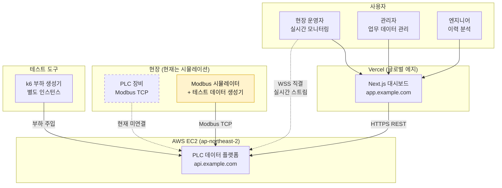
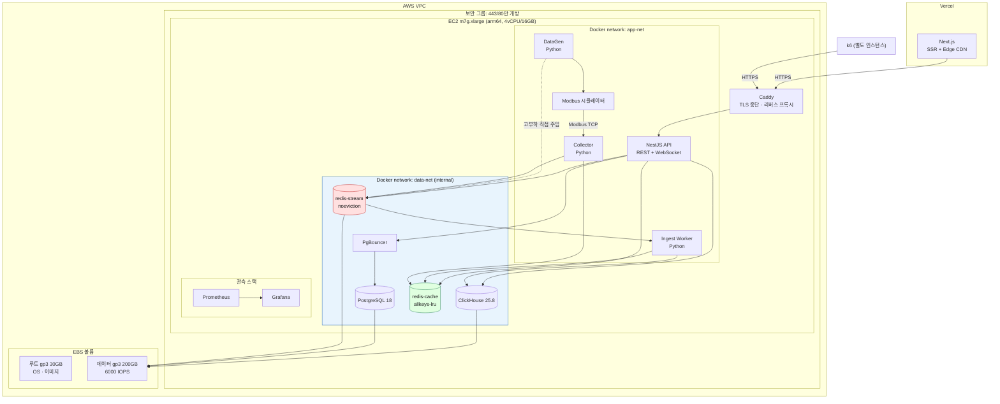
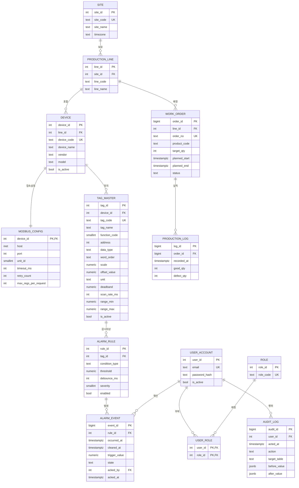
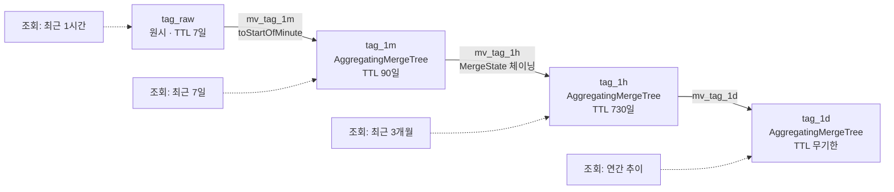
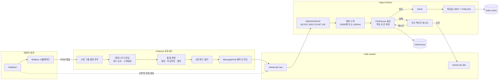
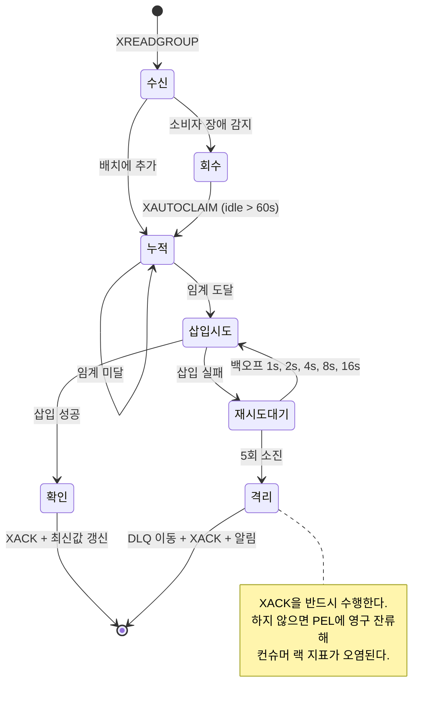
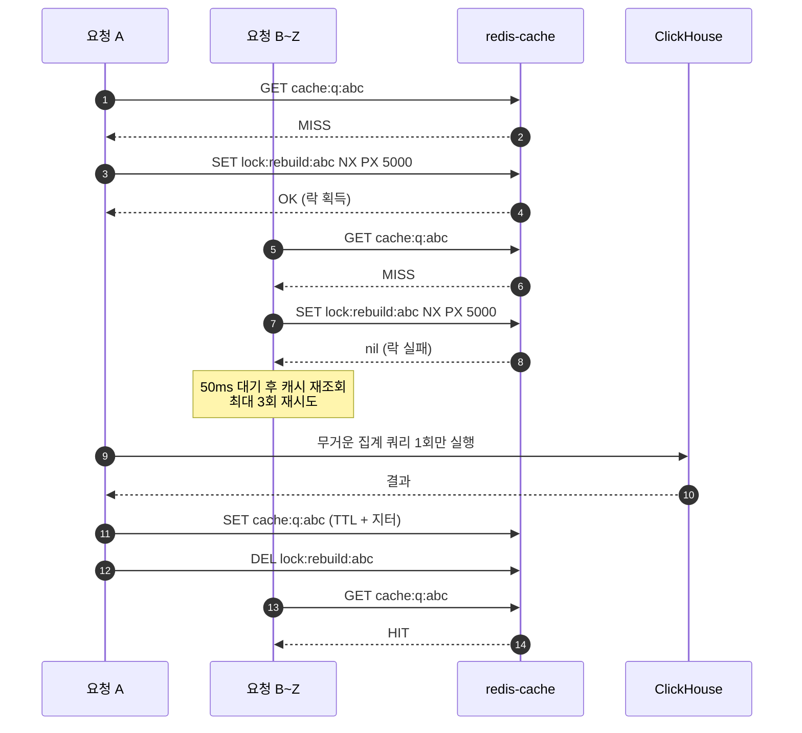
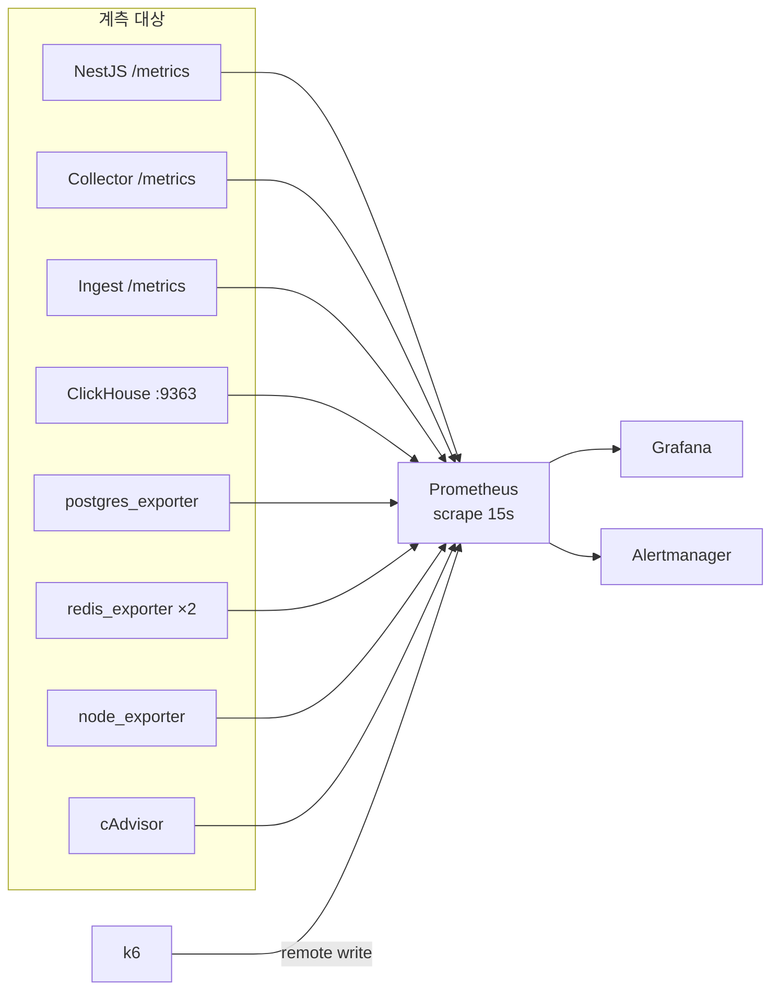
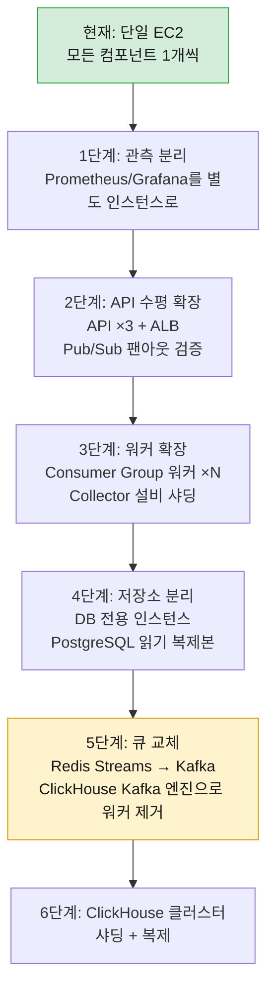

# 아키텍처 설계서

> 프로젝트: PLC 대용량 시계열 + 업무 데이터 분리 처리 웹 시스템
> 관련 문서: tech_stack.md (기술 선정), data_flow.md (데이터 흐름)
> 작성일: 2026-09-09

---

## 1. 설계 원칙

| 원칙 | 구체적 규칙 | 위반 시 발생하는 문제 |
|---|---|---|
| 쓰기 경로와 읽기 경로 분리 | 수집 파이프라인과 조회 API는 프로세스·자원을 공유하지 않는다 | 수집 폭주가 대시보드를 마비시킨다 |
| 저장소 책임 단일화 | 업무 데이터는 PostgreSQL, 시계열은 ClickHouse. 중복 저장 금지 | 두 곳의 값이 달라지고 어느 쪽이 진실인지 모르게 된다 |
| 비동기 경계 삽입 | 수집기와 DB 사이에 반드시 Redis Stream을 둔다 | DB 지연이 즉시 현장 수집 지연으로 전파된다 |
| 멱등성 확보 | 모든 적재는 재시도해도 중복이 생기지 않아야 한다 | at-least-once 재시도가 데이터를 오염시킨다 |
| 백프레셔 명시화 | 버퍼가 차면 조용히 버리지 말고 실패시키고 계측한다 | 유실을 인지하지 못한 채 잘못된 성능 수치를 얻는다 |
| 계측 우선 | 새 컴포넌트는 메트릭 노출과 함께 배포한다 | 병목을 추측으로 찾게 된다 |

---

## 2. 시스템 컨텍스트



경계에서 주의할 점:

| 경계 | 프로토콜 | 설계 결정 |
|---|---|---|
| 브라우저 → Vercel | HTTPS | 정적 자산·SSR 페이지. 에지 CDN 캐시 |
| Vercel Route Handler → EC2 API | HTTPS | 저빈도 업무 데이터 조회의 BFF 프록시. 리프레시 토큰 은닉 |
| 브라우저 → EC2 API | HTTPS + WSS | **고빈도 실시간 데이터는 Vercel을 경유하지 않는다.** 서버리스 함수를 매 초 호출하면 비용과 지연이 모두 나빠진다 |
| Vercel → EC2 DB | **금지** | 서버리스 스케일아웃 시 커넥션 폭발 |

---

## 3. 배포 토폴로지



Docker Compose 서비스 목록:

| 서비스 | 이미지 | 노출 포트 | 네트워크 | 재시작 정책 | 역할 |
|---|---|---|---|---|---|
| caddy | caddy:2.8-alpine | 80, 443 | app-net | unless-stopped | TLS 종단, 리버스 프록시 |
| api | 로컬 빌드 (node:22-alpine) | 내부 3000 | app-net, data-net | unless-stopped | REST + WebSocket |
| collector | 로컬 빌드 (python:3.13-slim) | 내부 9101 (메트릭) | app-net, data-net | unless-stopped | Modbus 폴링 |
| ingest | 로컬 빌드 | 내부 9102 (메트릭) | data-net | unless-stopped | Stream → ClickHouse |
| datagen | 로컬 빌드 | 내부 9103 | app-net, data-net | no (수동 실행) | 테스트 데이터 생성 |
| modbus-sim | 로컬 빌드 | 내부 5020~5119 | app-net | unless-stopped | PLC 시뮬레이터 |
| postgres | postgres:18-alpine | 내부 5432 | data-net | unless-stopped | OLTP |
| pgbouncer | edoburu/pgbouncer | 내부 6432 | data-net | unless-stopped | 커넥션 풀 |
| clickhouse | clickhouse/clickhouse-server:25.8 | 내부 8123, 9000, 9363 | data-net | unless-stopped | OLAP |
| redis-stream | redis:8-alpine | 내부 6379 | data-net | unless-stopped | 수집 버퍼 |
| redis-cache | redis:8-alpine | 내부 6379 | data-net | unless-stopped | 캐시·세션·최신값 |
| prometheus | prom/prometheus:v3 | 내부 9090 | app-net, data-net | unless-stopped | 메트릭 수집 |
| grafana | grafana/grafana:12 | 내부 3001 | app-net | unless-stopped | 대시보드 |
| exporters | postgres_exporter, redis_exporter, node_exporter, cAdvisor | 내부 | data-net | unless-stopped | 메트릭 노출 |

**두 네트워크로 분리하는 이유:** data-net을 internal로 선언하면 컨테이너가 외부 인터넷과 통신할 수 없다. DB 컨테이너가 실수로 공개 포트를 열어도 외부에서 도달할 수 없게 하는 이중 방어다. Caddy와 API만 app-net을 통해 외부와 연결된다.

---

## 4. 컴포넌트 책임

| 컴포넌트 | 언어 | 책임 | 하지 않는 일 | 확장 방식 |
|---|---|---|---|---|
| Next.js Web | TypeScript | 화면 렌더링, 차트, 사용자 상호작용, 저빈도 조회 BFF 프록시 | DB 직접 접근, 고빈도 데이터 중계 | Vercel 자동 |
| NestJS API | TypeScript | 인증·인가, 업무 CRUD, 시계열 조회 오케스트레이션, WebSocket 팬아웃, 캐시 제어 | Modbus 통신, 배치 적재 | 인스턴스 수평 증설 |
| Collector | Python | Modbus 폴링, 레지스터 디코딩, 공학 단위 변환, 품질 판정, Stream 발행 | DB 직접 쓰기 | 설비 그룹별 샤딩 |
| Ingest Worker | Python | Stream 소비, 배치 축적, ClickHouse 삽입, XACK, 재시도, DLQ, 최신값 갱신 | 비즈니스 로직 | Consumer Group 워커 증설 |
| DataGen | Python | 신호 프로파일 기반 테스트 데이터 생성, 시뮬레이터 레지스터 갱신, 고부하 직접 주입, 과거 데이터 백필 | 프로덕션 경로 참여 | 프로세스 병렬 |
| Modbus Sim | Python | Modbus TCP 서버 응답, 지연·오류 주입 | 데이터 생성 로직 | 설비당 포트 |

---

## 5. 저장소 분리 전략

| 데이터 | 저장소 | 근거 | 예상 규모 | 접근 패턴 |
|---|---|---|---|---|
| 사용자·권한 | PostgreSQL | 강한 정합성, 관계 제약 | 수백 행 | 읽기 위주, 캐시 대상 |
| 사이트·라인·설비 마스터 | PostgreSQL | 참조 무결성 | 수백 행 | 읽기 위주, 캐시 대상 |
| 태그 마스터 | PostgreSQL | 시스템 전체의 메타 원천 | 수천~수만 행 | 읽기 매우 빈번 → Redis + ClickHouse Dictionary 이중 캐시 |
| Modbus 접속 설정 | PostgreSQL | 설비 마스터에 종속 | 수백 행 | Collector 기동 시 로드 |
| 작업지시·생산 실적 | PostgreSQL | 트랜잭션, 갱신 빈번 | 수만~수십만 행 | CRUD |
| 알람 규칙 | PostgreSQL | 갱신 필요 | 수백 행 | 캐시 대상 |
| 알람 이벤트 | PostgreSQL (월 파티션) | 확인·해제 상태 갱신 필요 | 월 수만 행 | 조회 + 상태 갱신 |
| **PLC 태그 원시값** | **ClickHouse** | 추가 전용, 초당 수만 행, 범위 집계 | **일 수억~수십억 행** | 시간 범위 스캔 |
| 태그 1분/1시간/1일 롤업 | ClickHouse (MV) | 원시 스캔 회피 | 원시의 1/60, 1/3600 | 대시보드 기본 조회원 |
| 알람 판정 이력(전수) | ClickHouse | 고빈도, 갱신 없음 | 원시와 유사 | 분석용 |
| 태그 최신값 | Redis Hash | 마이크로초 응답 필요 | 태그 수만큼 | 초당 수천 회 읽기 |
| 조회 결과 캐시 | Redis String | 반복 조회 흡수 | 가변 | TTL 기반 |
| 수집 버퍼 | Redis Stream | 백프레셔 흡수 | 수만~수백만 엔트리 | FIFO 소비 |
| 세션·토큰 | Redis String | 즉시 무효화 | 동시 사용자 수 | TTL 기반 |

**중복 저장을 허용하는 유일한 예외:** 태그 최신값. Redis Hash와 ClickHouse 양쪽에 존재한다. Redis 쪽은 휘발성 캐시로 취급하고, 부팅 시 ClickHouse에서 복원한다. 불일치가 발생해도 ClickHouse가 진실이다.

---

## 6. PostgreSQL 스키마



주요 설계 결정:

| 항목 | 결정 | 이유 |
|---|---|---|
| 시각 타입 | 전부 timestamptz | 시간대 혼동은 시계열 시스템의 최대 버그 원인 |
| tag_id 타입 | int (4바이트) | ClickHouse에 매 행 저장되므로 폭을 최소화. UUID는 16바이트로 저장량이 4배 |
| ALARM_EVENT 파티셔닝 | occurred_at 기준 월 RANGE 파티션, pg_partman 자동 생성 | 조회 범위 제한과 오래된 파티션 DETACH 용이 |
| AUDIT_LOG | jsonb before/after | 스키마 변경에 유연 |
| 인덱스 | tag_master(device_id, is_active), alarm_event(rule_id, occurred_at DESC), work_order(line_id, status) | 실제 조회 패턴 기반. 무분별한 인덱스는 삽입 성능을 해친다 |
| 커넥션 | PgBouncer transaction 모드 | prepared statement 사용 시 주의 필요(드라이버 설정 확인) |

주요 튜닝 파라미터 (16GB 호스트에서 PostgreSQL에 3GB 할당 기준):

| 파라미터 | 값 | 설명 |
|---|---|---|
| shared_buffers | 768MB | 컨테이너 할당 메모리의 약 25% |
| effective_cache_size | 2GB | 플래너 힌트 |
| work_mem | 16MB | 동시 정렬 연산 수를 고려해 보수적으로 |
| maintenance_work_mem | 256MB | VACUUM, 인덱스 생성 |
| max_connections | 100 | PgBouncer가 앞단에서 흡수 |
| wal_compression | zstd | EBS IOPS 절약 |
| checkpoint_timeout | 15min | 체크포인트 스파이크 완화 |
| random_page_cost | 1.1 | SSD(gp3) 기준 |

---

## 7. ClickHouse 스키마

### 7.1 원시 테이블

```sql
CREATE DATABASE IF NOT EXISTS plc;

CREATE TABLE plc.tag_raw
(
    ts          DateTime64(3, 'Asia/Seoul') CODEC(Delta(8), ZSTD(1)),
    device_id   UInt32                      CODEC(Delta(4), ZSTD(1)),
    tag_id      UInt32                      CODEC(Delta(4), ZSTD(1)),
    value       Float64                     CODEC(Gorilla, ZSTD(1)),
    quality     UInt8                       CODEC(ZSTD(1)),
    scan_seq    UInt64                      CODEC(Delta(8), ZSTD(1)),
    ingested_at DateTime64(3) DEFAULT now64(3) CODEC(Delta(8), ZSTD(1))
)
ENGINE = MergeTree
PARTITION BY toYYYYMMDD(ts)
ORDER BY (device_id, tag_id, ts)
TTL toDateTime(ts) + INTERVAL 7 DAY DELETE
SETTINGS
    index_granularity = 8192,
    non_replicated_deduplication_window = 1000;
```

설계 근거:

| 요소 | 선택 | 이유 |
|---|---|---|
| 롱 포맷(태그당 1행) | 채택 | 설비마다 태그 구성이 다르고 태그 추가가 빈번. 와이드 포맷은 스키마 변경 지옥 |
| PARTITION BY 일자 | toYYYYMMDD | TTL 삭제가 파티션 DROP으로 처리되어 즉시 완료. 월 단위는 파티션이 너무 커지고, 시간 단위는 파티션 수가 폭증 |
| ORDER BY (device_id, tag_id, ts) | 채택 | 실제 조회는 "특정 설비의 특정 태그를 시간 범위로" 형태. 카디널리티 낮은 컬럼을 앞에 두어 압축률과 스킵 인덱스 효율 확보 |
| ts 코덱 Delta + ZSTD | 채택 | 등간격 타임스탬프는 델타 후 거의 상수가 되어 압축률이 극대화 |
| value 코덱 Gorilla | 채택 | 부동소수 시계열 전용 코덱. Facebook Gorilla 논문 기반, XOR 방식 |
| TTL 7일 | 채택 | 학습 환경 디스크 보호. 롤업 테이블이 장기 데이터를 담당 |
| index_granularity | 8192(기본) | 좁은 시간 범위 조회가 많으면 4096으로 낮추는 실험 대상 |
| 중복 제거 | non_replicated_deduplication_window + insert_deduplication_token | at-least-once 재시도로 인한 중복 차단 |

**멱등성 구현:** Ingest Worker는 배치마다 안정적인 토큰(예: 스트림 시작 ID + 끝 ID의 해시)을 만들어 삽입 설정 insert_deduplication_token으로 전달한다. 동일 배치가 재삽입되면 ClickHouse가 파트 단위로 무시한다. ReplacingMergeTree 대비 조회 시 FINAL 비용이 없다는 것이 장점이다.

### 7.2 롤업 캐스케이드



```sql
CREATE TABLE plc.tag_1m
(
    bucket    DateTime CODEC(Delta(4), ZSTD(1)),
    device_id UInt32,
    tag_id    UInt32,
    cnt       AggregateFunction(count),
    avg_v     AggregateFunction(avg, Float64),
    min_v     AggregateFunction(min, Float64),
    max_v     AggregateFunction(max, Float64),
    last_v    AggregateFunction(argMax, Float64, DateTime64(3)),
    p95_v     AggregateFunction(quantilesTDigest(0.95), Float64),
    bad_cnt   AggregateFunction(countIf, UInt8)
)
ENGINE = AggregatingMergeTree
PARTITION BY toYYYYMM(bucket)
ORDER BY (device_id, tag_id, bucket)
TTL bucket + INTERVAL 90 DAY DELETE;

CREATE MATERIALIZED VIEW plc.mv_tag_1m TO plc.tag_1m AS
SELECT
    toStartOfMinute(ts)                AS bucket,
    device_id,
    tag_id,
    countState()                       AS cnt,
    avgState(value)                    AS avg_v,
    minState(value)                    AS min_v,
    maxState(value)                    AS max_v,
    argMaxState(value, ts)             AS last_v,
    quantilesTDigestState(0.95)(value) AS p95_v,
    countIfState(quality > 0)          AS bad_cnt
FROM plc.tag_raw
GROUP BY bucket, device_id, tag_id;

CREATE MATERIALIZED VIEW plc.mv_tag_1h TO plc.tag_1h AS
SELECT
    toStartOfHour(bucket) AS bucket,
    device_id,
    tag_id,
    countMergeState(cnt)               AS cnt,
    avgMergeState(avg_v)               AS avg_v,
    minMergeState(min_v)               AS min_v,
    maxMergeState(max_v)               AS max_v,
    argMaxMergeState(last_v)           AS last_v,
    quantilesTDigestMergeState(0.95)(p95_v) AS p95_v,
    countIfMergeState(bad_cnt)         AS bad_cnt
FROM plc.tag_1m
GROUP BY bucket, device_id, tag_id;
```

조회 시에는 -Merge 조합자를 사용한다:

```sql
SELECT
    bucket,
    avgMerge(avg_v)  AS avg_value,
    minMerge(min_v)  AS min_value,
    maxMerge(max_v)  AS max_value,
    countMerge(cnt)  AS sample_count
FROM plc.tag_1m
WHERE device_id = 12 AND tag_id = 3401
  AND bucket BETWEEN {from:DateTime} AND {to:DateTime}
GROUP BY bucket
ORDER BY bucket;
```

**핵심 개념:** MV의 타깃 테이블에 삽입이 일어나면 그 테이블에 붙은 MV도 연쇄적으로 발동한다. 이 성질을 이용해 원시 → 분 → 시간 → 일 롤업을 별도 배치 잡 없이 삽입 시점에 완성한다. 단, MV는 **삽입되는 블록만** 보므로 과거 데이터를 나중에 넣으면 그 시점 기준으로 집계된다. 백필 시에는 MV를 잠시 분리하고 INSERT SELECT로 직접 채우는 절차가 필요하다.

### 7.3 알람 판정 이력 테이블

```sql
CREATE TABLE plc.alarm_eval
(
    ts        DateTime64(3) CODEC(Delta(8), ZSTD(1)),
    rule_id   UInt32,
    tag_id    UInt32,
    value     Float64 CODEC(Gorilla, ZSTD(1)),
    breached  UInt8,
    severity  UInt8
)
ENGINE = MergeTree
PARTITION BY toYYYYMMDD(ts)
ORDER BY (rule_id, ts)
TTL toDateTime(ts) + INTERVAL 30 DAY DELETE;
```

확정된 알람 이벤트(발생/해제/확인 상태 관리 필요)는 PostgreSQL의 ALARM_EVENT에 기록하고, 여기에는 매 판정 결과 전수를 남긴다. 임계값 튜닝과 오탐 분석에 쓴다.

### 7.4 PostgreSQL 마스터 데이터 연동 (Dictionary)

```sql
CREATE DICTIONARY plc.dict_tag
(
    tag_id      UInt32,
    device_id   UInt32,
    tag_code    String,
    tag_name    String,
    unit        String,
    range_min   Float64,
    range_max   Float64
)
PRIMARY KEY tag_id
SOURCE(POSTGRESQL(
    host 'pgbouncer' port 6432
    user 'ch_reader' password '<secret>'
    db 'plcdb'
    query 'SELECT tag_id, device_id, tag_code, tag_name, unit, range_min, range_max FROM tag_master WHERE is_active'
))
LAYOUT(HASHED())
LIFETIME(MIN 300 MAX 600);
```

사용:

```sql
SELECT
    dictGet('plc.dict_tag', 'tag_name', toUInt64(tag_id)) AS tag_name,
    dictGet('plc.dict_tag', 'unit',     toUInt64(tag_id)) AS unit,
    avgMerge(avg_v) AS avg_value
FROM plc.tag_1m
WHERE device_id = 12 AND bucket >= now() - INTERVAL 1 DAY
GROUP BY tag_id;
```

이 구조의 이점:

| 항목 | 효과 |
|---|---|
| 저장량 | ClickHouse에는 tag_id(4바이트)만 저장. 태그명 문자열을 매 행 저장하지 않는다 |
| 정합성 | 태그명이 바뀌어도 과거 데이터를 수정할 필요가 없다. 마스터는 PostgreSQL 하나뿐 |
| 성능 | HASHED 레이아웃은 메모리 상주. dictGet은 해시 조회 수준의 비용 |
| 갱신 | LIFETIME 설정으로 5~10분마다 자동 재적재. 즉시 반영이 필요하면 SYSTEM RELOAD DICTIONARY |

주의: Dictionary가 PostgreSQL을 주기적으로 조회하므로 전용 읽기 전용 계정을 쓰고, tag_master가 수만 행을 넘으면 LIFETIME을 늘리거나 CACHE 레이아웃으로 전환한다.

### 7.5 ClickHouse 설정

| 설정 | 값 | 이유 |
|---|---|---|
| max_server_memory_usage_to_ram_ratio | 0.8 | 컨테이너 메모리 제한 6GB 기준 |
| max_concurrent_queries | 32 | 소형 호스트에서 쿼리 폭주 방지 |
| background_pool_size | 8 | 머지 병렬도. vCPU 수에 맞춤 |
| parts_to_delay_insert / parts_to_throw_insert | 150 / 300 | 기본값보다 낮춰 파트 폭증을 조기에 감지 |
| async_insert / wait_for_async_insert | 0 / - | 워커가 이미 대량 배치를 만들므로 불필요. 소량 다중 클라이언트 실험 시에만 활성화 |
| max_insert_block_size | 1048576 | 대량 배치 삽입 |
| merge_tree.merge_max_block_size | 8192 | 기본 |

---

## 8. Redis 키 설계

### 8.1 redis-stream 인스턴스 (noeviction)

| 키 | 자료구조 | 값 | 크기 제어 | 용도 |
|---|---|---|---|---|
| stream:plc:raw | Stream | 스캔 사이클 배치(MessagePack) | XADD MAXLEN ~ 200000 | 수집 버퍼 |
| stream:plc:dlq | Stream | 실패 배치 + 오류 사유 | MAXLEN ~ 10000 | 재시도 소진분 |
| stream:plc:raw 컨슈머 그룹 | Consumer Group | grp:ingest | - | 워커 다중화 |

### 8.2 redis-cache 인스턴스 (allkeys-lru)

| 키 패턴 | 자료구조 | 값 | TTL | 용도 |
|---|---|---|---|---|
| rt:latest:{device_id} | Hash | field=tag_id, value="ts,value,quality" | 없음(덮어쓰기) | 태그 최신값 |
| rt:seq:{device_id} | String | 최근 스캔 시퀀스 | 없음 | 갱신 확인 |
| cache:q:{sha1(정규화 쿼리)} | String | gzip 압축 JSON | 30~300s + 지터 | 시계열 조회 캐시 |
| cache:tagmeta:{tag_id} | Hash | 태그 메타 사본 | 600s | 마스터 캐시 |
| cache:devlist:{site_id} | String | 설비 목록 JSON | 600s | 업무 조회 캐시 |
| lock:rebuild:{cache_key} | String (SET NX PX) | 소유자 UUID | 5s | 캐시 스탬피드 방지 |
| lock:job:rollup | String (SET NX PX) | 소유자 UUID | 60s | 배치 잡 단일 실행 |
| rl:{user_id}:{unix_minute} | String (INCR) | 요청 수 | 90s | 레이트 리밋 |
| sess:{session_id} | String | 세션 JSON | 1800s | 세션 |
| rt:{refresh_token_id} | String | 사용자 ID | 14d | 리프레시 토큰(즉시 폐기 가능) |
| alarm:state:{rule_id} | Hash | 상태·연속 위반 횟수·최초 위반 시각 | 없음 | 알람 디바운스 상태 머신 |

Pub/Sub 채널:

| 채널 | 발행자 | 구독자 | 페이로드 |
|---|---|---|---|
| ch:rt:{device_id} | Ingest Worker | API 인스턴스(WebSocket 게이트웨이) | 변경된 태그 값 배열 |
| ch:alarm | Alarm Evaluator | API 인스턴스 | 알람 발생·해제 이벤트 |
| ch:cacheinv | API | 다른 API 인스턴스 | 로컬 인메모리 캐시 무효화 신호 |

### 8.3 키 네이밍 규칙

| 규칙 | 예 |
|---|---|
| 콜론 계층 구조, 앞부분이 넓은 범주 | 영역:용도:식별자 |
| 영역 접두사 | stream, rt(realtime), cache, lock, rl, sess, ch |
| 스캔 금지 | KEYS 명령 사용 금지. 필요 시 SCAN + COUNT |
| TTL 필수 | cache와 sess 계열은 TTL 없이 생성 금지 (린트 규칙으로 강제) |
| 지터 | TTL에 ±20% 무작위 가산. 동시 만료로 인한 스탬피드 방지 |

### 8.4 메모리 산정

Stream 엔트리를 **포인트 단위가 아니라 스캔 사이클 단위**로 만든다. 설비 1대의 태그 500개를 한 엔트리에 컬럼 배열로 담으면:

| 방식 | 엔트리 수(500 태그) | 엔트리당 크기 | 총 크기 | Redis 오버헤드 |
|---|---|---|---|---|
| 포인트 단위 | 500개 | 약 120 B (필드 이름 포함) | 약 60 KB | 매우 큼 |
| **배치 단위 (채택)** | **1개** | **약 7 KB (MessagePack 컬럼 배열)** | **약 7 KB** | 무시 가능 |

약 9배 절감이다. Redis Stream은 엔트리당 필드 이름을 반복 저장하므로 소량 다필드 엔트리가 매우 비효율적이다. 이 최적화 없이는 10만 pps에서 Redis 메모리가 수 분 만에 고갈된다.

MAXLEN 200000 엔트리 기준 예상 메모리: 200000 × 7 KB ≈ 1.4 GB. redis-stream 컨테이너에 2 GB를 할당하고 maxmemory를 1.5 GB로 설정한다.

---

## 9. 수집 파이프라인



### 9.1 배치 트리거

| 트리거 | 임계값 | 이유 |
|---|---|---|
| 행 수 | 50,000행 | ClickHouse는 파트당 최소 수만 행이 이상적. 너무 작으면 파트 폭증 |
| 경과 시간 | 1,000 ms | 저부하 시에도 데이터가 무한정 대기하지 않도록 |
| 페이로드 크기 | 32 MB | 메모리 보호 |

셋 중 먼저 도달한 조건에서 플러시한다. 고부하 시에는 행 수 조건이, 저부하 시에는 시간 조건이 지배한다.

### 9.2 재시도와 DLQ 상태 전이



**at-least-once 보장:** XACK은 ClickHouse 삽입이 성공한 뒤에만 수행한다. 워커가 삽입 직후 ACK 직전에 죽으면 같은 배치를 다시 읽게 되는데, 이때 insert_deduplication_token이 중복을 막는다. 결과적으로 exactly-once에 준하는 효과를 얻는다.

### 9.3 백프레셔 단계

| 단계 | 조건 | 시스템 반응 | 계측 지표 |
|---|---|---|---|
| 정상 | 스트림 길이 < 20,000 | 그대로 진행 | consumer_lag |
| 주의 | 20,000 ~ 100,000 | 경고 알림, 워커 동시성 자동 증가 | stream_length |
| 경고 | 100,000 ~ 180,000 | Collector가 데드밴드를 임시 강화해 발행량 감축 | deadband_boost_active |
| 위험 | 180,000 초과 (MAXLEN 근접) | XADD 실패 발생 → Collector가 **로컬 디스크 스풀(Parquet)** 로 전환 | spool_active, spool_bytes |
| 복구 | 스트림 길이 < 20,000 회복 | 스풀 파일을 순차 재발행 후 스풀 종료 | spool_drain_rate |

이 5단계를 실제로 재현하는 것이 Phase 5의 핵심 실험이다.

---

## 10. 캐시 전략

### 10.1 패턴별 적용

| 데이터 | 패턴 | TTL | 무효화 방식 |
|---|---|---|---|
| 태그 최신값 | write-through (Ingest Worker가 갱신) | 없음 | 항상 덮어쓰기 |
| 시계열 조회 결과 | cache-aside | 30~300s + 지터 | TTL 만료만. 과거 데이터는 불변이므로 무효화 불필요 |
| 태그·설비 마스터 | cache-aside | 600s | 쓰기 시 명시적 DEL + Pub/Sub 전파 |
| 사용자 권한 | cache-aside | 300s | 권한 변경 시 즉시 DEL |
| 알람 규칙 | cache-aside | 300s | 규칙 변경 시 즉시 DEL |

### 10.2 캐시 키 정규화

시계열 조회 캐시 키는 파라미터를 정규화한 뒤 해싱한다.

| 단계 | 처리 |
|---|---|
| 1 | 시간 범위를 버킷 경계로 스냅. 예: 1분 롤업 조회는 from/to를 분 단위로 내림 |
| 2 | tag_id 배열 정렬 |
| 3 | 기본값 파라미터 제거 |
| 4 | 정규화 문자열을 SHA-1 해싱 |
| 5 | cache:q:{hash} 형태로 사용 |

시간 스냅이 핵심이다. 스냅 없이 초 단위 now()를 그대로 쓰면 매 요청이 다른 키가 되어 히트율이 0에 수렴한다.

**"최근 N분" 조회의 캐시 가능성:** 끝 시각이 현재라 캐시가 어렵다. 해결책은 조회를 두 구간으로 쪼개는 것이다. 확정된 과거 구간(버킷 경계까지)은 긴 TTL로 캐시하고, 현재 진행 중인 마지막 버킷만 Redis 최신값 또는 짧은 TTL로 처리한 뒤 클라이언트에서 합친다.

### 10.3 캐시 스탬피드 방지



락 해제는 소유자 토큰을 검증하는 Lua 스크립트로 수행한다. 단순 DEL은 자신의 락이 만료된 뒤 남의 락을 지울 수 있다.

---

## 11. API 설계

| 메서드 | 경로 | 저장소 | 캐시 | 설명 |
|---|---|---|---|---|
| POST | /api/v1/auth/login | PostgreSQL + redis-cache | - | 액세스 토큰 발급, 리프레시 토큰을 Redis에 저장 |
| POST | /api/v1/auth/refresh | redis-cache | - | 토큰 갱신 |
| POST | /api/v1/auth/logout | redis-cache | - | 리프레시 토큰 즉시 폐기 |
| GET | /api/v1/sites | PostgreSQL | 600s | 사이트 목록 |
| GET | /api/v1/devices | PostgreSQL | 600s | 설비 목록 |
| GET/POST/PATCH | /api/v1/tags | PostgreSQL | 600s, 쓰기 시 무효화 | 태그 마스터 CRUD |
| GET/POST/PATCH | /api/v1/work-orders | PostgreSQL | 60s | 작업지시 |
| **GET** | **/api/v1/realtime/devices/{id}/tags** | **redis-cache** | - | 설비의 전체 태그 최신값. HGETALL 1회 |
| GET | /api/v1/realtime/tags/{id} | redis-cache | - | 단일 태그 최신값 |
| **POST** | **/api/v1/timeseries/query** | **ClickHouse** | 30~300s | 시간 범위 + 태그 배열 + 집계 단위 조회 |
| GET | /api/v1/timeseries/export | ClickHouse | - | CSV/Parquet 스트리밍 다운로드 |
| GET | /api/v1/alarms/events | PostgreSQL | 30s | 알람 이벤트 목록 |
| POST | /api/v1/alarms/events/{id}/ack | PostgreSQL | 무효화 | 알람 확인 |
| **POST** | **/api/v1/ingest/bulk** | **redis-stream** | - | **부하 테스트용 직접 주입.** 프로덕션에서는 비활성화 |
| GET | /api/v1/health | 전체 | - | 각 저장소 헬스체크 |
| GET | /metrics | - | - | Prometheus 메트릭 |
| **WS** | **/ws/realtime?devices=1,2,3** | **redis-cache Pub/Sub** | - | 실시간 태그 값 푸시 |

### 11.1 시계열 조회 요청 스키마

| 필드 | 타입 | 설명 |
|---|---|---|
| tagIds | int[] | 최대 50개 제한 |
| from, to | ISO 8601 | 시간 범위 |
| interval | raw / 1m / 1h / 1d | 미지정 시 **범위 길이에 따라 서버가 자동 선택** |
| aggregations | avg / min / max / last / p95 | 복수 선택 |
| maxPoints | int | 기본 2000. 초과 시 서버가 interval을 자동 상향 |

**자동 해상도 선택 규칙:**

| 조회 범위 | 선택 테이블 | 예상 반환 포인트 수 |
|---|---|---|
| 1시간 이하 | tag_raw | 최대 3600 |
| 1시간 ~ 7일 | tag_1m | 최대 10080 |
| 7일 ~ 90일 | tag_1h | 최대 2160 |
| 90일 초과 | tag_1d | 가변 |

클라이언트가 원시 데이터로 1년치를 요청해 ClickHouse를 마비시키는 사고를 서버가 구조적으로 차단한다. 원시 데이터가 꼭 필요하면 export 엔드포인트로 스트리밍 다운로드를 유도한다.

### 11.2 인증과 CORS

| 항목 | 설정 |
|---|---|
| 액세스 토큰 | JWT, 15분, Authorization 헤더 |
| 리프레시 토큰 | 불투명 토큰, 14일, httpOnly + Secure 쿠키, Redis에 저장해 즉시 폐기 가능 |
| 쿠키 SameSite | 도메인을 app.example.com / api.example.com으로 정렬하면 Lax 사용 가능. 다른 도메인이면 None + Secure 강제 |
| CORS 허용 오리진 | 프로덕션 도메인 + Vercel 프리뷰 도메인 정규식. 와일드카드 금지 |
| 레이트 리밋 | 사용자별 분당 요청 수를 Redis INCR로 제한. Vercel은 고정 IP가 없어 IP 기반 제한이 무의미 |
| WebSocket 인증 | 연결 시 쿼리 파라미터가 아닌 첫 메시지로 토큰 전달. URL에 토큰을 남기지 않는다 |

---

## 12. PostgreSQL과 ClickHouse의 정합성

| 문제 | 해결 |
|---|---|
| 시계열 조회 결과에 태그명을 붙여야 한다 | ClickHouse Dictionary(PostgreSQL 소스)로 dictGet 조인 |
| 태그가 삭제되면 과거 데이터의 tag_id가 고아가 된다 | **태그를 물리 삭제하지 않는다.** is_active 플래그로 논리 삭제. tag_id는 영구 보존 |
| tag_id 재사용 | 시퀀스만 사용하고 절대 재사용하지 않는다 |
| 태그 스케일 계수가 변경되면 과거 값의 의미가 달라진다 | 스케일 변경 시 **새 tag_id를 발급**하고 이전 태그는 비활성화. 태그 마스터에 변경 이력 테이블 유지 |
| 마스터와 시계열의 시간 정렬 | 모든 시각은 UTC로 저장하고 표시 시점에만 변환 |

**교훈으로 삼을 원칙:** 두 DB를 트랜잭션으로 묶으려 하지 말 것. 대신 시계열 쪽을 **불변(immutable) 사실 기록**으로 두고, 해석에 필요한 메타는 마스터에서 조회 시점에 붙인다. 이것이 이벤트 소싱의 기본 사고방식이며 폴리글랏 저장소 설계의 핵심이다.

---

## 13. 리소스 배분 (16GB 호스트)

| 컨테이너 | 메모리 상한 | CPU 가중 | 내부 설정 |
|---|---|---|---|
| clickhouse | 6.0 GB | 2.0 | max_server_memory_usage_to_ram_ratio 0.8 |
| postgres | 3.0 GB | 1.0 | shared_buffers 768MB, effective_cache_size 2GB |
| redis-stream | 2.0 GB | 0.5 | maxmemory 1.5GB, noeviction, appendonly yes |
| redis-cache | 1.0 GB | 0.5 | maxmemory 768MB, allkeys-lru, appendonly no |
| api (NestJS) | 1.0 GB | 1.0 | UV_THREADPOOL_SIZE 8 |
| collector | 0.7 GB | 0.5 | - |
| ingest | 0.7 GB | 0.5 | - |
| datagen | 0.5 GB | 0.5 | 부하 테스트 시에만 기동 |
| modbus-sim | 0.4 GB | 0.3 | - |
| caddy | 0.2 GB | 0.2 | - |
| prometheus + grafana + exporters | 1.0 GB | 0.5 | retention 7일로 축소 |
| **합계** | **약 16.5 GB (오버커밋)** | | OS·페이지 캐시 여유를 위해 실제로는 Phase 3에서 관측 스택 분리 권장 |

메모리 상한을 명시하지 않으면 ClickHouse가 페이지 캐시를 최대한 점유하다가 PostgreSQL의 OOM을 유발한다. Compose의 deploy.resources.limits로 반드시 고정한다.

---

## 14. 관측성 아키텍처



대시보드 구성:

| 대시보드 | 주요 패널 |
|---|---|
| 파이프라인 전경 | 초당 포인트, 컨슈머 랙, 배치 크기 분포, DLQ 건수, E2E 지연 |
| ClickHouse | 초당 삽입 행수, 활성 파트 수, 머지 큐 길이, 압축률, 쿼리 p95, 메모리 |
| PostgreSQL | TPS, 커넥션 수, 버퍼 히트율, 락 대기, 느린 쿼리 Top-10, 데드 튜플 |
| Redis | 인스턴스별 메모리, ops/s, 스트림 길이, 캐시 히트율, evicted_keys |
| API | RPS, p50/p95/p99, 5xx, 이벤트 루프 지연, WebSocket 연결 수 |
| 호스트 | CPU, 메모리, 디스크 IOPS·처리량·대기시간, 네트워크 |

핵심 알림 규칙:

| 알림 | 조건 | 심각도 |
|---|---|---|
| 컨슈머 랙 증가 | 5분간 지속 증가 | 경고 |
| 스트림 길이 위험 | MAXLEN의 80% 초과 | 위험 |
| DLQ 발생 | 5분간 1건 이상 | 위험 |
| ClickHouse 파트 과다 | 활성 파트 > 200 | 경고 |
| 디스크 잔여 | 20% 미만 | 위험 |
| 캐시 히트율 저하 | 50% 미만 10분 지속 | 정보 |

---

## 15. 용량 산정

압축 후 행당 크기를 4바이트로 가정한다(신호 프로파일 구성에 따라 2~8바이트로 변동).

| 티어 | 설비 수 | 태그/설비 | 주기 | 초당 포인트 | 일 행수 | 일 원시 용량 | 롤업 포함 | 용도 |
|---|---|---|---|---|---|---|---|---|
| **S (개발)** | 5 | 50 | 1 Hz | 250 | 2,160만 | 약 86 MB | 약 95 MB | 로컬 개발, 기능 검증 |
| **M (기본)** | 50 | 200 | 1 Hz | 10,000 | 8.64억 | 약 3.5 GB | 약 3.8 GB | Phase 2~4 상시 부하 |
| **M+ (고빈도)** | 50 | 200 | 10 Hz | 100,000 | 86.4억 | 약 35 GB | 약 37 GB | 지속 시 EBS 500GB 필요 |
| **L (버스트)** | 100 | 500 | 10 Hz | 500,000 | (지속 불가) | 10분 버스트 시 약 1.2 GB | - | Breakpoint 테스트 전용 |

TTL 7일 기준 정상 상태 디스크 사용량:

| 티어 | 원시 7일 | 1분 롤업 90일 | 1시간 롤업 730일 | 합계 | 권장 EBS |
|---|---|---|---|---|---|
| S | 0.6 GB | 0.3 GB | 0.05 GB | 약 1 GB | 100 GB |
| M | 25 GB | 12 GB | 2 GB | 약 39 GB | 200 GB |
| M+ | 245 GB | 12 GB | 2 GB | 약 259 GB | 500 GB |

파생 지표:

| 항목 | M 티어 | M+ 티어 |
|---|---|---|
| Modbus 요청 수 | 초당 약 100회(설비 50 × 스캔그룹 2) | 초당 약 1,000회 |
| Stream 엔트리 발행 | 초당 50개 | 초당 500개 |
| Stream 네트워크 | 약 0.15 MB/s | 약 1.5 MB/s |
| ClickHouse 삽입 | 배치 50,000행 기준 초당 0.2회 | 초당 2회 |
| 필요 워커 수 | 1 | 2 |
| EBS 쓰기 처리량 | 약 0.05 MB/s | 약 0.5 MB/s (머지 증폭 포함 시 3~5배) |

**M+ 티어에서 주의할 점:** 초당 2회 삽입은 ClickHouse 권장 상한(테이블당 초당 1회)을 넘는다. 배치 크기를 100,000행으로 키우거나 async_insert를 활성화한다. 이 경계를 직접 넘겨보고 "too many parts" 오류를 재현하는 것이 좋은 학습이 된다.

---

## 16. 성능 목표

| 지표 | 목표 (M 티어) | 측정 방법 |
|---|---|---|
| 수집 무손실 | 100% | 생성 포인트 수 대 ClickHouse 행 수 대조 |
| E2E 지연 (PLC 시점 → 조회 가능) p95 | 1.5초 이하 | ingested_at − ts |
| 컨슈머 랙 | 정상 상태 5,000 엔트리 이하 | Redis XLEN − PEL 처리량 |
| 최신값 조회 p95 | 10 ms 이하 | k6 |
| 시계열 조회 p95 (캐시 히트) | 20 ms 이하 | k6 |
| 시계열 조회 p95 (1일 범위, 캐시 미스) | 300 ms 이하 | k6 |
| 업무 데이터 CRUD p95 | 100 ms 이하 | k6 |
| 캐시 히트율 | 80% 이상 | redis_exporter |
| API 오류율 | 0.1% 미만 | k6 + Prometheus |
| WebSocket 동시 연결 | 500 이상 | k6 ws 시나리오 |
| ClickHouse 활성 파트 수 | 100 이하 유지 | system.parts |
| 디스크 압축률 | 8배 이상 | system.parts의 data_uncompressed_bytes 대비 |

---

## 17. 장애 시나리오

| 시나리오 | 감지 | 시스템 반응 | 검증 방법 | 복구 목표 |
|---|---|---|---|---|
| ClickHouse 중단 | 삽입 예외 | 워커가 XACK 보류 → 스트림 적체 → 백프레셔 단계 상승 | docker stop clickhouse 5분 | 재기동 후 무손실 소진 |
| ClickHouse 느려짐 (머지 폭주) | 삽입 지연 상승, 파트 수 증가 | 배치 크기 자동 확대, 삽입 주기 감소 | 소량 배치 다중 삽입으로 파트 유발 | 파트 수 자연 감소 |
| redis-stream 중단 | XADD 실패 | Collector가 로컬 디스크 스풀로 전환 | docker stop redis-stream 3분 | 복구 후 스풀 재발행 |
| redis-stream 메모리 초과 | XADD OOM 오류 | 동일. noeviction이라 조용한 유실 없음 | maxmemory를 낮춰 강제 유발 | 소진 후 정상화 |
| redis-cache 중단 | 캐시 조회 예외 | **캐시 우회하고 DB 직접 조회로 degrade.** 실패시키지 않는다 | docker stop redis-cache | 지연 상승하되 서비스 지속 |
| PostgreSQL 중단 | 커넥션 오류 | 시계열 조회는 계속 동작(Dictionary는 마지막 값 유지). 업무 CRUD만 실패 | docker stop postgres | 재기동 후 정상 |
| Ingest Worker 중단 | 컨슈머 랙 급증 | 다른 워커가 XAUTOCLAIM으로 PEL 회수 | 워커 1개 kill | 60초 내 회수 |
| Collector 중단 | 수집 포인트 0 | 해당 설비 태그가 STALE 품질로 전환 | docker stop collector | 재기동 시 결측 구간 남음(정상 동작) |
| Modbus 타임아웃 | 폴링 실패율 상승 | 해당 스캔 그룹 스킵, 품질 BAD_TIMEOUT 기록 | 시뮬레이터에 지연 주입 | 다음 주기 자동 복구 |
| API 인스턴스 중단 | 헬스체크 실패 | Caddy가 다음 요청 실패. 단일 인스턴스라 다운타임 발생 | docker stop api | Compose restart 정책으로 자동 재기동 |
| 디스크 포화 | 잔여 20% 미만 알림 | TTL 축소 또는 파티션 수동 DROP | 대량 백필로 유발 | - |

**degrade 원칙:** 캐시 계층 장애는 절대 서비스 실패로 이어지지 않아야 한다. redis-cache 호출은 모두 짧은 타임아웃(50ms)과 예외 무시 래퍼로 감싼다. 반대로 redis-stream 장애는 명시적으로 실패시켜 백프레셔를 발동시킨다. **같은 Redis라도 역할에 따라 실패 전략이 정반대**라는 점이 이 아키텍처의 중요한 학습 포인트다.

---

## 18. 보안

| 영역 | 조치 |
|---|---|
| 네트워크 | 보안 그룹은 443/80만 개방. DB 포트는 Docker internal 네트워크에만 바인딩(호스트 포트 매핑 금지) |
| 관리 접속 | SSH 22번 포트를 닫고 SSM Session Manager 사용. DB 접속은 SSM 포트 포워딩 |
| 시크릿 | .env 파일을 Git에 커밋하지 않는다. AWS SSM Parameter Store 또는 Secrets Manager에서 기동 시 주입 |
| 전송 암호화 | Caddy가 Let's Encrypt로 TLS 1.3 종단. HSTS 활성화 |
| 저장 암호화 | EBS 볼륨 암호화 활성화 |
| 인증 | JWT 액세스 토큰 15분, 리프레시 토큰 Redis 저장으로 즉시 폐기 가능 |
| 인가 | 역할 기반. NestJS Guard로 엔드포인트별 검사 |
| CORS | 허용 오리진 명시. Vercel 프리뷰 도메인은 정규식으로 제한적 허용 |
| 레이트 리밋 | 사용자별 + 엔드포인트별. 특히 timeseries/query와 export에 엄격히 |
| SQL 인젝션 | ClickHouse 쿼리는 반드시 파라미터 바인딩. 태그 ID 배열은 정수 검증 후 사용 |
| 부하 테스트 엔드포인트 | /api/v1/ingest/bulk는 환경변수로 프로덕션에서 완전 비활성화 |
| 감사 | 업무 데이터 변경은 AUDIT_LOG에 before/after 기록 |
| 백업 | EBS 스냅샷 일 1회 + PostgreSQL pg_dump를 S3로. ClickHouse는 롤업 테이블만 백업(원시는 재생성 가능) |

---

## 19. 확장 로드맵



각 단계 진입 조건:

| 단계 | 진입 조건 (실측 기반) |
|---|---|
| 관측 분리 | 부하 테스트 중 Prometheus가 CPU 10% 이상 점유 |
| API 수평 확장 | API 컨테이너 CPU 사용률 80% 지속 또는 이벤트 루프 지연 100ms 초과 |
| 워커 확장 | 단일 워커로 컨슈머 랙이 회복되지 않음 |
| 저장소 분리 | 애플리케이션과 DB의 CPU 경합이 p95 지연에 영향을 주는 것이 확인됨 |
| Kafka 전환 | Redis 메모리로 필요한 보존 기간을 감당할 수 없음, 또는 재처리 요구 발생 |
| ClickHouse 클러스터 | 단일 노드 삽입 처리량 또는 디스크 한계 도달 |

**추측으로 단계를 앞당기지 않는다.** 각 단계는 반드시 Grafana 대시보드의 수치를 근거로 진입하고, 진입 전후 성능 차이를 기록한다.

---

## 관련 문서

- tech_stack.md — 기술 선정 근거, 버전, 비용, 학습 로드맵
- data_flow.md — 흐름 시나리오 10종, 지연 예산, 데이터 계약, 수명 주기
