# 데이터 흐름 설계서

> 프로젝트: PLC 대용량 시계열 + 업무 데이터 분리 처리 웹 시스템
> 관련 문서: tech_stack.md (기술 선정), architecture.md (시스템 구조)
> 작성일: 2026-09-09

---

## 1. 흐름 목록

| 번호 | 흐름 | 방향 | 주 경로 | 성격 | 목표 지연 |
|---|---|---|---|---|---|
| F1 | PLC 수집 | 쓰기 | 시뮬레이터 → Collector → Stream | 비동기, 고빈도 | 주기 내 완료 |
| F2 | 배치 적재 | 쓰기 | Stream → Ingest Worker → ClickHouse | 비동기, 배치 | 1초 이내 |
| F3 | 최신값 조회 | 읽기 | 브라우저 → API → redis-cache | 동기, 초고빈도 | 10 ms |
| F4 | 시계열 이력 조회 | 읽기 | 브라우저 → API → redis-cache → ClickHouse | 동기, 무거움 | 300 ms |
| F5 | 업무 데이터 CRUD | 읽기·쓰기 | 브라우저 → Vercel BFF → API → PostgreSQL | 동기, 트랜잭션 | 100 ms |
| F6 | 알람 판정 | 쓰기 | Ingest Worker → 판정 → PostgreSQL + ClickHouse | 비동기 | 2초 |
| F7 | 실시간 푸시 | 읽기 | Pub/Sub → WebSocket → 브라우저 | 비동기 스트리밍 | 500 ms |
| F8 | 롤업 집계 | 내부 | ClickHouse MV 캐스케이드 | 삽입 시 자동 | 즉시 |
| F9 | 테스트 데이터 주입 | 쓰기 | DataGen → 시뮬레이터 또는 Stream 직결 | 부하 생성 | - |
| F10 | 백프레셔·장애 | 예외 | 각 계층의 degrade 경로 | 복구 | 시나리오별 |

---

## 2. 전체 데이터 흐름도

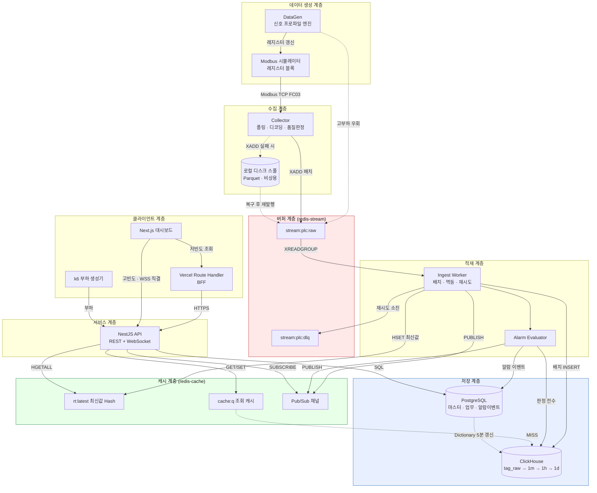
```mermaid
flowchart TB
    subgraph GEN["데이터 생성 계층"]
        DG["DataGen<br/>신호 프로파일 엔진"]
        MS["Modbus 시뮬레이터<br/>레지스터 블록"]
    end

    subgraph COL["수집 계층"]
        CL["Collector<br/>폴링 · 디코딩 · 품질판정"]
        SP[("로컬 디스크 스풀<br/>Parquet · 비상용")]
    end

    subgraph BUF["버퍼 계층 (redis-stream)"]
        SR["stream:plc:raw"]
        DQ["stream:plc:dlq"]
    end

    subgraph ADT["적재 계층"]
        IW["Ingest Worker<br/>배치 · 멱등 · 재시도"]
        AE["Alarm Evaluator"]
    end

    subgraph STORE["저장 계층"]
        CH[("ClickHouse<br/>tag_raw → 1m → 1h → 1d")]
        PG[("PostgreSQL<br/>마스터 · 업무 · 알람이벤트")]
    end

    subgraph CACHE["캐시 계층 (redis-cache)"]
        LV["rt:latest 최신값 Hash"]
        QC["cache:q 조회 캐시"]
        PS["Pub/Sub 채널"]
    end

    subgraph SRV["서비스 계층"]
        API["NestJS API<br/>REST + WebSocket"]
    end

    subgraph CLIENT["클라이언트 계층"]
        BFF["Vercel Route Handler<br/>BFF"]
        WEB["Next.js 대시보드"]
        K6["k6 부하 생성기"]
    end

    DG -->|"레지스터 갱신"| MS
    DG -.->|"고부하 우회"| SR
    MS -->|"Modbus TCP FC03"| CL
    CL -->|"XADD 배치"| SR
    CL -.->|"XADD 실패 시"| SP
    SP -.->|"복구 후 재발행"| SR

    SR -->|"XREADGROUP"| IW
    IW -->|"배치 INSERT"| CH
    IW -->|"HSET 최신값"| LV
    IW -->|"PUBLISH"| PS
    IW -->|"재시도 소진"| DQ
    IW --> AE
    AE -->|"알람 이벤트"| PG
    AE -->|"판정 전수"| CH
    AE -->|"PUBLISH"| PS

    API -->|"HGETALL"| LV
    API -->|"GET/SET"| QC
    QC -.->|"MISS"| CH
    API -->|"SQL"| PG
    API -->|"SUBSCRIBE"| PS
    PG -.->|"Dictionary 5분 갱신"| CH

    WEB -->|"저빈도 조회"| BFF
    BFF -->|"HTTPS"| API
    WEB -->|"고빈도 · WSS 직결"| API
    K6 -->|"부하"| API

    style BUF fill:#ffe8e8,stroke:#c53030,color:#1a1a1a
    style CACHE fill:#e8ffe8,stroke:#2f855a,color:#1a1a1a
    style STORE fill:#e8f0ff,stroke:#2b6cb0,color:#1a1a1a
```

---

## 3. F1 — PLC 수집 흐름

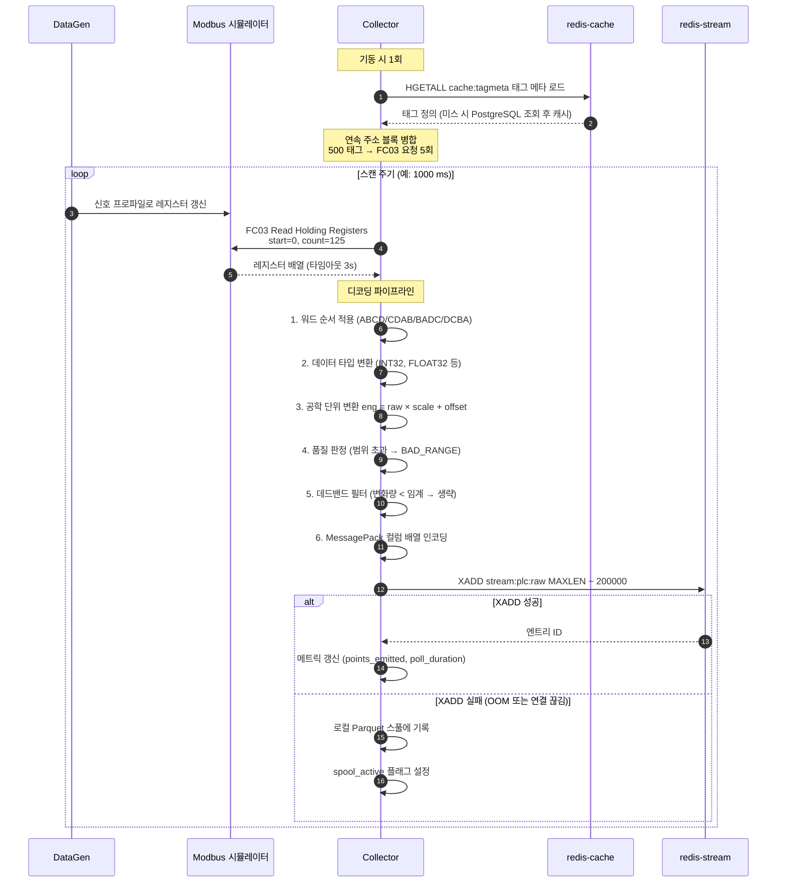
```mermaid
sequenceDiagram
    autonumber
    participant DG as DataGen
    participant MS as Modbus 시뮬레이터
    participant CL as Collector
    participant RC as redis-cache
    participant SR as redis-stream

    Note over CL: 기동 시 1회
    CL->>RC: HGETALL cache:tagmeta 태그 메타 로드
    RC-->>CL: 태그 정의 (미스 시 PostgreSQL 조회 후 캐시)
    Note over CL: 연속 주소 블록 병합<br/>500 태그 → FC03 요청 5회

    loop 스캔 주기 (예: 1000 ms)
        DG->>MS: 신호 프로파일로 레지스터 갱신
        CL->>MS: FC03 Read Holding Registers<br/>start=0, count=125
        MS-->>CL: 레지스터 배열 (타임아웃 3s)

        Note over CL: 디코딩 파이프라인
        CL->>CL: 1. 워드 순서 적용 (ABCD/CDAB/BADC/DCBA)
        CL->>CL: 2. 데이터 타입 변환 (INT32, FLOAT32 등)
        CL->>CL: 3. 공학 단위 변환 eng = raw × scale + offset
        CL->>CL: 4. 품질 판정 (범위 초과 → BAD_RANGE)
        CL->>CL: 5. 데드밴드 필터 (변화량 < 임계 → 생략)
        CL->>CL: 6. MessagePack 컬럼 배열 인코딩

        CL->>SR: XADD stream:plc:raw MAXLEN ~ 200000
        alt XADD 성공
            SR-->>CL: 엔트리 ID
            CL->>CL: 메트릭 갱신 (points_emitted, poll_duration)
        else XADD 실패 (OOM 또는 연결 끊김)
            CL->>CL: 로컬 Parquet 스풀에 기록
            CL->>CL: spool_active 플래그 설정
        end
    end
```

### 3.1 Modbus 요청 최적화

태그 주소가 흩어져 있으면 요청 수가 폭증한다. 연속 블록으로 병합한다.

| 상황 | 요청 수 | 설비 50대 · 1초 주기 |
|---|---|---|
| 태그 1개당 1요청 | 500회/설비 | 초당 25,000 요청 (불가능) |
| 단순 연속 병합 | 약 10회/설비 | 초당 500 요청 |
| **갭 허용 병합** (사용 안 하는 레지스터 최대 20개까지 포함해 병합) | **약 5회/설비** | **초당 250 요청** |

갭 허용 병합은 불필요한 레지스터를 함께 읽는 낭비를 감수하고 요청 수를 줄이는 트레이드오프다. 네트워크 왕복 지연이 지배적인 Modbus TCP에서는 거의 항상 이득이다.

### 3.2 품질 코드 체계

| 코드 | 이름 | 조건 | 후속 처리 |
|---|---|---|---|
| 0 | GOOD | 정상 수신, 범위 내 | 정상 저장 |
| 1 | UNCERTAIN | 보간·추정값 | 저장하되 집계에서 가중치 낮춤 |
| 2 | BAD_COMM | Modbus 예외 응답 | 저장, 알람 판정 제외 |
| 3 | BAD_TIMEOUT | 응답 타임아웃 | 저장하지 않고 결측 처리 |
| 4 | BAD_RANGE | range_min/max 벗어남 | 저장, 알람 판정 제외 |
| 5 | STALE | 지정 주기 내 갱신 없음 | 최신값 조회 시 경고 표시 |
| 9 | SIMULATED | 테스트 데이터 생성기 산출 | **실데이터와 반드시 구분** |

품질 코드 9는 이 프로젝트에서 특히 중요하다. 나중에 실장비가 연결되어 실데이터가 섞이기 시작할 때, 과거 데이터가 시뮬레이션이었음을 구분할 수 없으면 모든 분석 결과의 신뢰성이 무너진다.

### 3.3 데드밴드 필터의 효과

| 데드밴드 | 전송률 (RANDOM_WALK 프로파일) | 전송률 (STEP 프로파일) |
|---|---|---|
| 0 (비활성) | 100% | 100% |
| 측정범위의 0.1% | 약 85% | 약 3% |
| 측정범위의 0.5% | 약 40% | 약 1% |
| 측정범위의 1.0% | 약 20% | 약 1% |

데드밴드는 대역폭과 저장량을 극적으로 줄이지만 **원본 파형을 잃는다.** 성능 테스트에서는 반드시 데드밴드 0으로 측정한 뒤, 별도 실험으로 데드밴드 효과를 관찰한다. 두 조건을 섞으면 처리량 수치가 의미를 잃는다.

---

## 4. F2 — 배치 적재 흐름

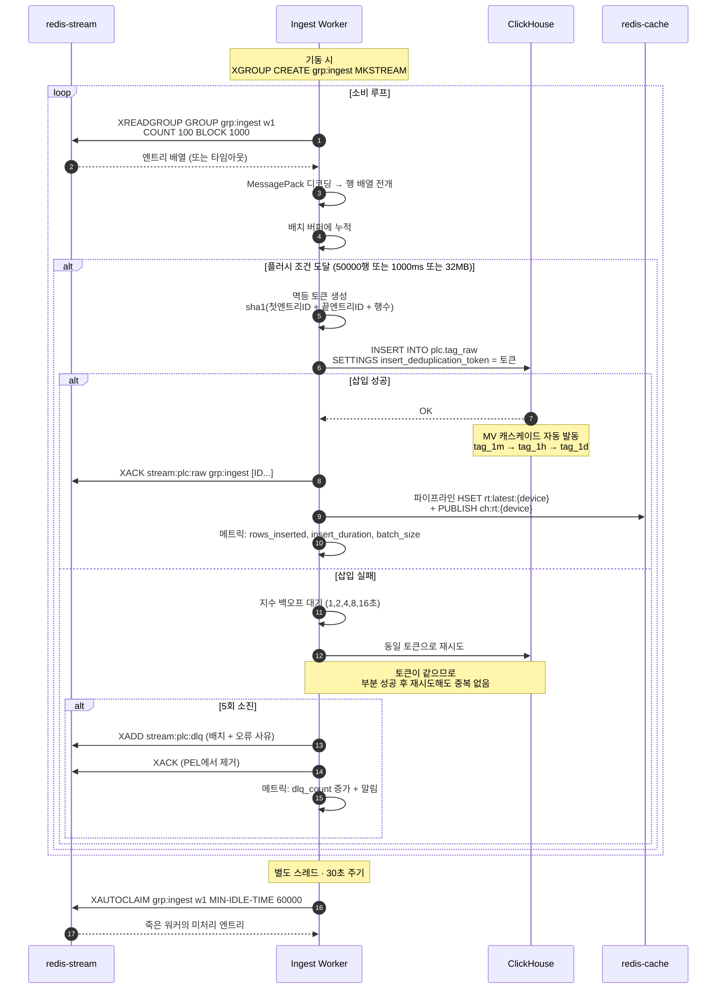
```mermaid
sequenceDiagram
    autonumber
    participant SR as redis-stream
    participant IW as Ingest Worker
    participant CH as ClickHouse
    participant RC as redis-cache

    Note over IW: 기동 시<br/>XGROUP CREATE grp:ingest MKSTREAM

    loop 소비 루프
        IW->>SR: XREADGROUP GROUP grp:ingest w1<br/>COUNT 100 BLOCK 1000
        SR-->>IW: 엔트리 배열 (또는 타임아웃)

        IW->>IW: MessagePack 디코딩 → 행 배열 전개
        IW->>IW: 배치 버퍼에 누적

        alt 플러시 조건 도달 (50000행 또는 1000ms 또는 32MB)
            IW->>IW: 멱등 토큰 생성<br/>sha1(첫엔트리ID + 끝엔트리ID + 행수)
            IW->>CH: INSERT INTO plc.tag_raw<br/>SETTINGS insert_deduplication_token = 토큰

            alt 삽입 성공
                CH-->>IW: OK
                Note over CH: MV 캐스케이드 자동 발동<br/>tag_1m → tag_1h → tag_1d
                IW->>SR: XACK stream:plc:raw grp:ingest [ID...]
                IW->>RC: 파이프라인 HSET rt:latest:{device}<br/>+ PUBLISH ch:rt:{device}
                IW->>IW: 메트릭: rows_inserted, insert_duration, batch_size
            else 삽입 실패
                IW->>IW: 지수 백오프 대기 (1,2,4,8,16초)
                IW->>CH: 동일 토큰으로 재시도
                Note over IW,CH: 토큰이 같으므로<br/>부분 성공 후 재시도해도 중복 없음
                alt 5회 소진
                    IW->>SR: XADD stream:plc:dlq (배치 + 오류 사유)
                    IW->>SR: XACK (PEL에서 제거)
                    IW->>IW: 메트릭: dlq_count 증가 + 알림
                end
            end
        end
    end

    Note over IW: 별도 스레드 · 30초 주기
    IW->>SR: XAUTOCLAIM grp:ingest w1 MIN-IDLE-TIME 60000
    SR-->>IW: 죽은 워커의 미처리 엔트리
```

### 4.1 배치 크기와 성능의 관계

| 배치 크기 | 초당 삽입 횟수 (10,000 pps 기준) | 파트 생성률 | 지연 | 판정 |
|---|---|---|---|---|
| 1,000행 | 10회/s | 매우 높음 | 낮음 | 파트 폭증 위험 |
| 10,000행 | 1회/s | 적정 | 1초 | 양호 |
| **50,000행** | **0.2회/s** | **낮음** | **최대 5초 (시간 트리거로 1초 제한)** | **권장** |
| 500,000행 | 0.02회/s | 매우 낮음 | 최대 50초 | 지연 과다, 메모리 부담 |

행 수 트리거와 시간 트리거를 함께 두는 이유가 여기 있다. 고부하에서는 행 수가, 저부하에서는 시간이 지배해 어느 조건에서도 적정 파트 크기와 허용 지연을 동시에 만족시킨다.

### 4.2 컨슈머 그룹 다중화

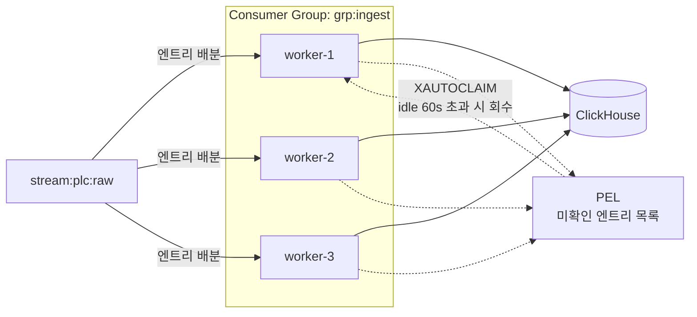
```mermaid
flowchart LR
    SR["stream:plc:raw"]
    subgraph G["Consumer Group: grp:ingest"]
        W1["worker-1"]
        W2["worker-2"]
        W3["worker-3"]
    end
    CH[("ClickHouse")]

    SR -->|"엔트리 배분"| W1
    SR -->|"엔트리 배분"| W2
    SR -->|"엔트리 배분"| W3
    W1 --> CH
    W2 --> CH
    W3 --> CH

    PEL["PEL<br/>미확인 엔트리 목록"]
    W1 -.-> PEL
    W2 -.-> PEL
    W3 -.-> PEL
    PEL -.->|"XAUTOCLAIM<br/>idle 60s 초과 시 회수"| W1
```

| 항목 | 설명 |
|---|---|
| 배분 방식 | Redis가 엔트리를 워커에게 라운드로빈으로 분배. 같은 엔트리는 한 워커만 받는다 |
| 순서 보장 | 워커 간 순서는 보장되지 않는다. **시계열 데이터는 ts를 자체 보유하므로 무관** |
| 워커 수 상한 | ClickHouse 테이블당 초당 삽입 횟수 제약이 상한. 워커 3개 × 초당 0.5회 = 초당 1.5회 정도가 실질 한계 |
| 장애 회수 | XAUTOCLAIM으로 idle 60초 초과 엔트리를 살아있는 워커가 인수 |

### 4.3 멱등성 보장 상세

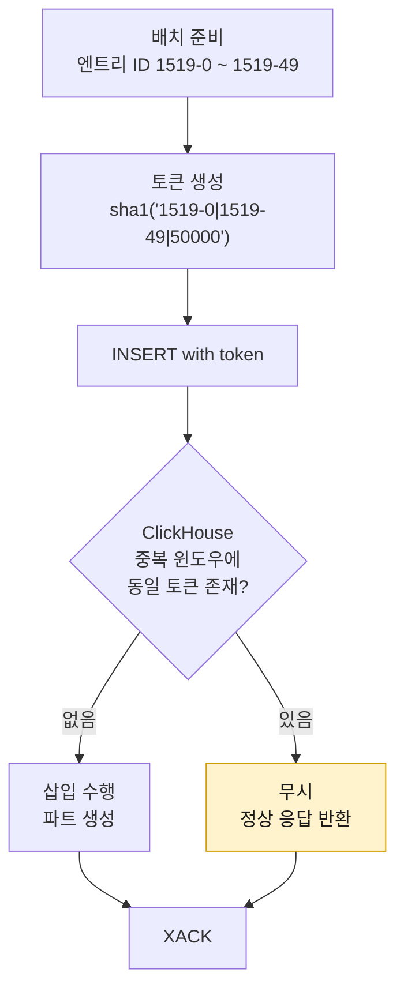
```mermaid
flowchart TB
    A["배치 준비<br/>엔트리 ID 1519-0 ~ 1519-49"]
    B["토큰 생성<br/>sha1('1519-0|1519-49|50000')"]
    C["INSERT with token"]
    D{"ClickHouse<br/>중복 윈도우에<br/>동일 토큰 존재?"}
    E["삽입 수행<br/>파트 생성"]
    F["무시<br/>정상 응답 반환"]
    G["XACK"]

    A --> B --> C --> D
    D -->|"없음"| E --> G
    D -->|"있음"| F --> G

    style F fill:#fff3cd,stroke:#d39e00,color:#1a1a1a
```

이 방식이 성립하려면 **토큰이 배치 내용에 대해 결정적(deterministic)** 이어야 한다. 워커가 재시작한 뒤 같은 엔트리들을 다시 읽었을 때 동일한 토큰이 나와야 한다. 그래서 무작위 UUID가 아니라 엔트리 ID 범위와 행 수의 해시를 쓴다.

주의: non_replicated_deduplication_window 설정값(1000)만큼의 최근 파트만 기억한다. 재시도 간격이 이 윈도우를 벗어날 만큼 길면 중복이 발생할 수 있으므로, 백오프 최대치를 16초로 제한한다.

---

## 5. F3 — 최신값 조회 흐름

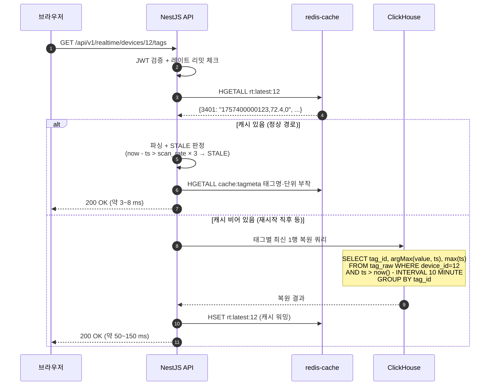
```mermaid
sequenceDiagram
    autonumber
    participant B as 브라우저
    participant API as NestJS API
    participant RC as redis-cache
    participant CH as ClickHouse

    B->>API: GET /api/v1/realtime/devices/12/tags
    API->>API: JWT 검증 + 레이트 리밋 체크
    API->>RC: HGETALL rt:latest:12
    RC-->>API: {3401: "1757400000123,72.4,0", ...}

    alt 캐시 있음 (정상 경로)
        API->>API: 파싱 + STALE 판정<br/>(now - ts > scan_rate × 3 → STALE)
        API->>RC: HGETALL cache:tagmeta 태그명·단위 부착
        API-->>B: 200 OK (약 3~8 ms)
    else 캐시 비어 있음 (재시작 직후 등)
        API->>CH: 태그별 최신 1행 복원 쿼리
        Note over CH: SELECT tag_id, argMax(value, ts), max(ts)<br/>FROM tag_raw WHERE device_id=12<br/>AND ts > now() - INTERVAL 10 MINUTE<br/>GROUP BY tag_id
        CH-->>API: 복원 결과
        API->>RC: HSET rt:latest:12 (캐시 워밍)
        API-->>B: 200 OK (약 50~150 ms)
    end
```

**설계 의도:** 최신값 조회는 대시보드에서 초당 수십~수백 회 발생한다. 이 요청이 ClickHouse에 도달하면 안 된다. ClickHouse는 대량 스캔에 최적화되어 있고, "특정 태그의 마지막 1행" 같은 점 조회는 오히려 비효율적이다. 이 지점이 Redis를 중간에 두는 가장 직접적인 이유다.

| 방식 | 응답 시간 | 초당 처리 가능량 |
|---|---|---|
| ClickHouse 직접 점 조회 | 30~150 ms | 수십 회 |
| **Redis HGETALL** | **0.3~1 ms** | **수만 회** |

---

## 6. F4 — 시계열 이력 조회 흐름

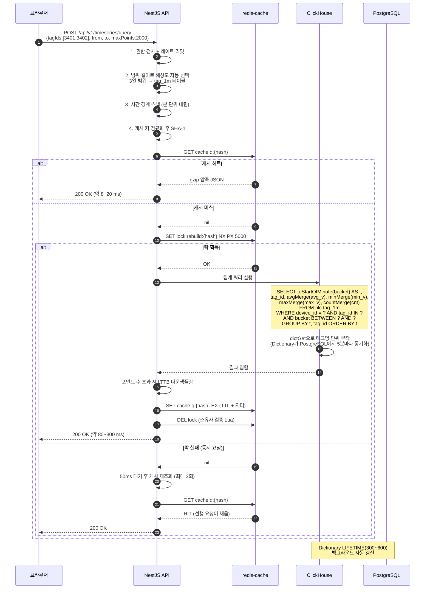
```mermaid
sequenceDiagram
    autonumber
    participant B as 브라우저
    participant API as NestJS API
    participant RC as redis-cache
    participant CH as ClickHouse
    participant PG as PostgreSQL

    B->>API: POST /api/v1/timeseries/query<br/>{tagIds:[3401,3402], from, to, maxPoints:2000}
    API->>API: 1. 권한 검사 + 레이트 리밋
    API->>API: 2. 범위 길이로 해상도 자동 선택<br/>3일 범위 → tag_1m 테이블
    API->>API: 3. 시간 경계 스냅 (분 단위 내림)
    API->>API: 4. 캐시 키 정규화 후 SHA-1

    API->>RC: GET cache:q:{hash}
    alt 캐시 히트
        RC-->>API: gzip 압축 JSON
        API-->>B: 200 OK (약 8~20 ms)
    else 캐시 미스
        RC-->>API: nil
        API->>RC: SET lock:rebuild:{hash} NX PX 5000
        alt 락 획득
            RC-->>API: OK
            API->>CH: 집계 쿼리 실행
            Note over CH: SELECT toStartOfMinute(bucket) AS t,<br/>tag_id, avgMerge(avg_v), minMerge(min_v),<br/>maxMerge(max_v), countMerge(cnt)<br/>FROM plc.tag_1m<br/>WHERE device_id = ? AND tag_id IN ?<br/>AND bucket BETWEEN ? AND ?<br/>GROUP BY t, tag_id ORDER BY t
            CH->>CH: dictGet으로 태그명·단위 부착<br/>(Dictionary가 PostgreSQL에서 5분마다 동기화)
            CH-->>API: 결과 집합
            API->>API: 포인트 수 초과 시 LTTB 다운샘플링
            API->>RC: SET cache:q:{hash} EX (TTL + 지터)
            API->>RC: DEL lock (소유자 검증 Lua)
            API-->>B: 200 OK (약 80~300 ms)
        else 락 실패 (동시 요청)
            RC-->>API: nil
            API->>API: 50ms 대기 후 캐시 재조회 (최대 3회)
            API->>RC: GET cache:q:{hash}
            RC-->>API: HIT (선행 요청이 채움)
            API-->>B: 200 OK
        end
    end

    Note over PG,CH: Dictionary LIFETIME(300~600)<br/>백그라운드 자동 갱신
```

### 6.1 해상도 자동 선택

| 조회 범위 | 선택 테이블 | 원시 대비 스캔량 | 예상 응답 (M 티어) |
|---|---|---|---|
| 1시간 이하 | tag_raw | 1배 | 30~80 ms |
| 1시간 ~ 7일 | tag_1m | 1/60 | 40~150 ms |
| 7일 ~ 90일 | tag_1h | 1/3600 | 30~100 ms |
| 90일 초과 | tag_1d | 1/86400 | 20~60 ms |

**이 규칙이 없으면:** 사용자가 1년 범위를 원시 테이블로 조회하는 순간 3,000억 행 스캔이 발생해 ClickHouse가 메모리 한계로 죽는다. 서버가 해상도를 강제 선택하는 것은 편의 기능이 아니라 **보호 장치**다.

### 6.2 캐시 TTL 설계

| 조회 유형 | TTL | 근거 |
|---|---|---|
| 완전 과거 구간 (to < 현재 버킷 시작) | 300초 + 지터 | 데이터가 불변. 더 길게 잡아도 되지만 메모리 절약 |
| 현재 버킷 포함 | 30초 + 지터 | 계속 갱신되는 구간 |
| 최근 5분 이내 | 캐시하지 않음 | 최신값 API 또는 WebSocket으로 유도 |

**지터의 필요성:** 대시보드가 30초마다 자동 새로고침하면 여러 사용자의 캐시가 정확히 동시에 만료되어 ClickHouse에 동시 쿼리가 몰린다. TTL에 ±20% 무작위를 더해 만료를 분산시킨다.

### 6.3 다운샘플링

차트 폭이 1,200 픽셀이면 2,000 포인트 이상은 시각적으로 무의미하다. 서버가 줄인다.

| 방법 | 특징 | 사용처 |
|---|---|---|
| 단순 추출 (n번째마다) | 빠름, 스파이크 소실 | 사용 안 함 |
| 시간 버킷 평균 | ClickHouse 롤업이 이미 수행 | 1차 축소 |
| **LTTB (Largest Triangle Three Buckets)** | 시각적 형태 보존, 스파이크 유지 | 2차 축소 |
| min/max 쌍 유지 | 극값 보존 보장 | 알람 분석 화면 |

권장 조합: ClickHouse에서 롤업 테이블로 1차 축소 → 여전히 많으면 API에서 LTTB로 2차 축소 → 브라우저에서 uPlot 렌더링.

---

## 7. F5 — 업무 데이터 CRUD 흐름

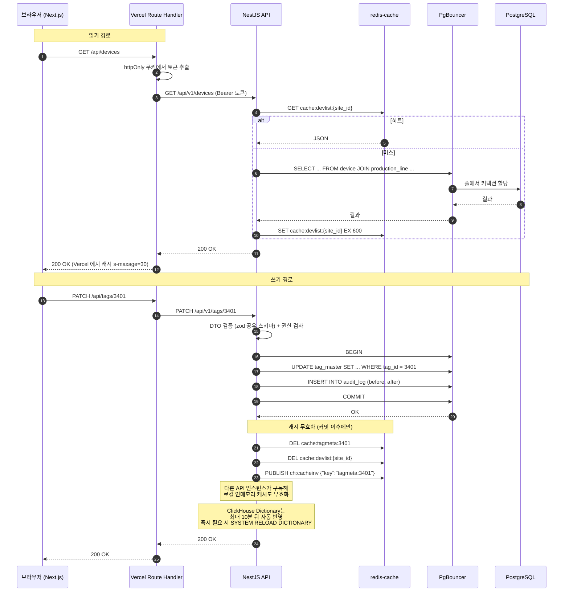
```mermaid
sequenceDiagram
    autonumber
    participant B as 브라우저 (Next.js)
    participant BFF as Vercel Route Handler
    participant API as NestJS API
    participant RC as redis-cache
    participant PGB as PgBouncer
    participant PG as PostgreSQL

    Note over B,BFF: 읽기 경로
    B->>BFF: GET /api/devices
    BFF->>BFF: httpOnly 쿠키에서 토큰 추출
    BFF->>API: GET /api/v1/devices (Bearer 토큰)
    API->>RC: GET cache:devlist:{site_id}
    alt 히트
        RC-->>API: JSON
    else 미스
        API->>PGB: SELECT ... FROM device JOIN production_line ...
        PGB->>PG: 풀에서 커넥션 할당
        PG-->>PGB: 결과
        PGB-->>API: 결과
        API->>RC: SET cache:devlist:{site_id} EX 600
    end
    API-->>BFF: 200 OK
    BFF-->>B: 200 OK (Vercel 에지 캐시 s-maxage=30)

    Note over B,PG: 쓰기 경로
    B->>BFF: PATCH /api/tags/3401
    BFF->>API: PATCH /api/v1/tags/3401
    API->>API: DTO 검증 (zod 공유 스키마) + 권한 검사
    API->>PGB: BEGIN
    API->>PGB: UPDATE tag_master SET ... WHERE tag_id = 3401
    API->>PGB: INSERT INTO audit_log (before, after)
    API->>PGB: COMMIT
    PGB-->>API: OK

    Note over API,RC: 캐시 무효화 (커밋 이후에만)
    API->>RC: DEL cache:tagmeta:3401
    API->>RC: DEL cache:devlist:{site_id}
    API->>RC: PUBLISH ch:cacheinv {"key":"tagmeta:3401"}
    Note over API: 다른 API 인스턴스가 구독해<br/>로컬 인메모리 캐시도 무효화
    Note over API: ClickHouse Dictionary는<br/>최대 10분 뒤 자동 반영<br/>즉시 필요 시 SYSTEM RELOAD DICTIONARY
    API-->>BFF: 200 OK
    BFF-->>B: 200 OK
```

### 7.1 캐시 무효화 순서 규칙

| 순서 | 동작 | 이유 |
|---|---|---|
| 1 | DB 트랜잭션 커밋 | - |
| 2 | Redis 캐시 DEL | 커밋 전에 지우면 롤백 시 낡은 값이 다시 채워질 수 있다 |
| 3 | Pub/Sub 전파 | 다른 인스턴스의 로컬 캐시 무효화 |

**흔한 실수:** 커밋 전에 캐시를 지우면, 다른 요청이 그 사이에 옛 값을 읽어 캐시를 다시 채운다. 그 뒤 커밋이 되면 캐시에는 영구히 낡은 값이 남는다. 반드시 커밋 후에 지운다.

**갱신이 아니라 삭제하는 이유:** 캐시를 새 값으로 갱신(write-through)하면 동시 갱신 시 순서가 뒤집혀 낡은 값이 최종적으로 남을 수 있다. 삭제 후 다음 조회에서 다시 채우는 편이 안전하다.

### 7.2 Vercel BFF를 쓰는 요청과 쓰지 않는 요청

| 요청 유형 | 경로 | 이유 |
|---|---|---|
| 설비·태그 목록 조회 | 브라우저 → Vercel BFF → API | 저빈도, 에지 캐시 이득, 토큰 은닉 |
| 작업지시 CRUD | 브라우저 → Vercel BFF → API | 동일 |
| 로그인·토큰 갱신 | 브라우저 → Vercel BFF → API | httpOnly 쿠키를 서버에서만 다뤄야 함 |
| **최신값 폴링** | **브라우저 → API 직결** | 초당 수 회. 서버리스 호출 비용과 왕복 지연 추가가 부담 |
| **시계열 조회** | **브라우저 → API 직결** | 응답이 크고(수백 KB) 사용자별로 달라 에지 캐시 이득 없음 |
| **WebSocket** | **브라우저 → API 직결** | Vercel 서버리스는 장기 연결 호스팅 불가 |

---

## 8. F6 — 알람 판정 흐름

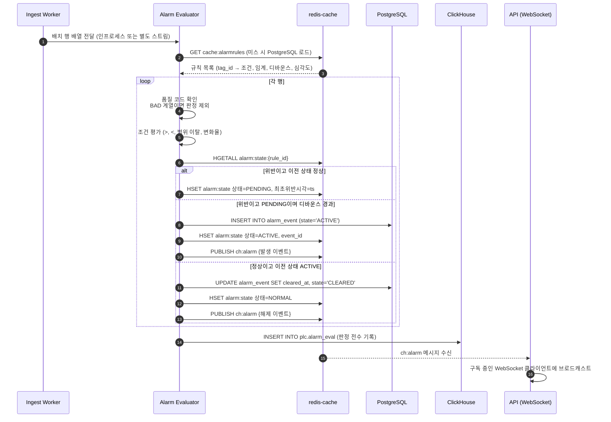
```mermaid
sequenceDiagram
    autonumber
    participant IW as Ingest Worker
    participant AE as Alarm Evaluator
    participant RC as redis-cache
    participant PG as PostgreSQL
    participant CH as ClickHouse
    participant API as API (WebSocket)

    IW->>AE: 배치 행 배열 전달 (인프로세스 또는 별도 스트림)
    AE->>RC: GET cache:alarmrules (미스 시 PostgreSQL 로드)
    RC-->>AE: 규칙 목록 (tag_id → 조건, 임계, 디바운스, 심각도)

    loop 각 행
        AE->>AE: 품질 코드 확인<br/>BAD 계열이면 판정 제외
        AE->>AE: 조건 평가 (>, <, 범위 이탈, 변화율)
        AE->>RC: HGETALL alarm:state:{rule_id}

        alt 위반이고 이전 상태 정상
            AE->>RC: HSET alarm:state 상태=PENDING, 최초위반시각=ts
        else 위반이고 PENDING이며 디바운스 경과
            AE->>PG: INSERT INTO alarm_event (state='ACTIVE')
            AE->>RC: HSET alarm:state 상태=ACTIVE, event_id
            AE->>RC: PUBLISH ch:alarm {발생 이벤트}
        else 정상이고 이전 상태 ACTIVE
            AE->>PG: UPDATE alarm_event SET cleared_at, state='CLEARED'
            AE->>RC: HSET alarm:state 상태=NORMAL
            AE->>RC: PUBLISH ch:alarm {해제 이벤트}
        end
    end

    AE->>CH: INSERT INTO plc.alarm_eval (판정 전수 기록)
    RC-->>API: ch:alarm 메시지 수신
    API->>API: 구독 중인 WebSocket 클라이언트에 브로드캐스트
```

### 8.1 디바운스 상태 머신

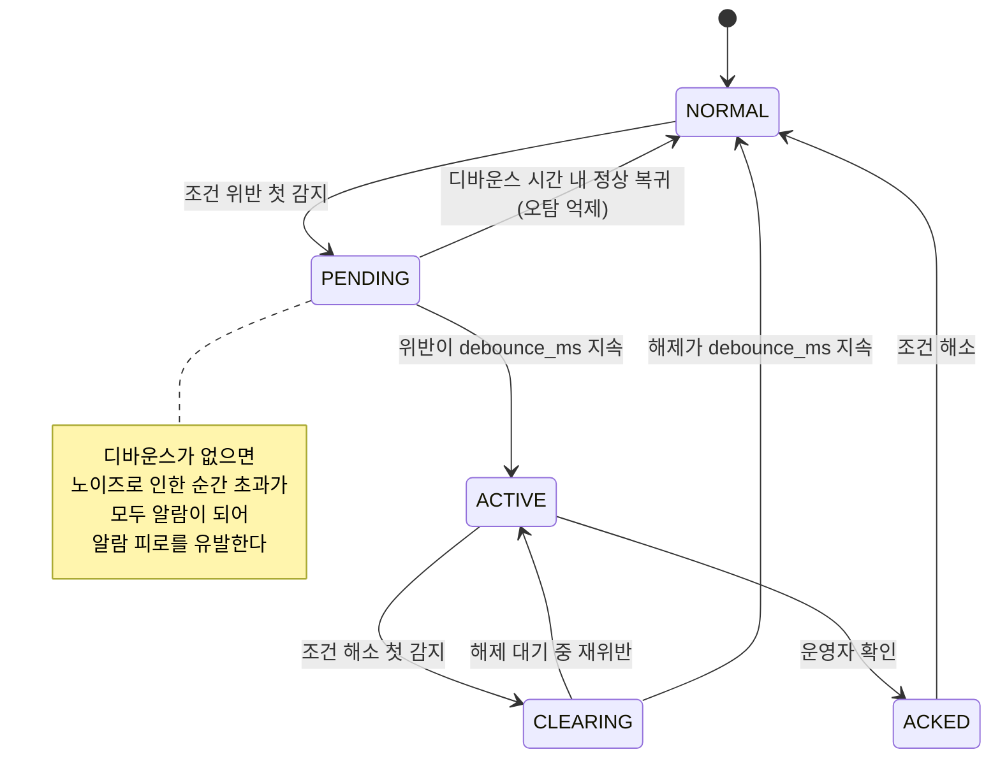
```mermaid
stateDiagram-v2
    [*] --> NORMAL
    NORMAL --> PENDING: 조건 위반 첫 감지
    PENDING --> NORMAL: 디바운스 시간 내 정상 복귀 (오탐 억제)
    PENDING --> ACTIVE: 위반이 debounce_ms 지속
    ACTIVE --> CLEARING: 조건 해소 첫 감지
    CLEARING --> ACTIVE: 해제 대기 중 재위반
    CLEARING --> NORMAL: 해제가 debounce_ms 지속
    ACTIVE --> ACKED: 운영자 확인
    ACKED --> NORMAL: 조건 해소

    note right of PENDING
        디바운스가 없으면
        노이즈로 인한 순간 초과가
        모두 알람이 되어
        알람 피로를 유발한다
    end note
```

### 8.2 알람 데이터를 두 DB에 나누는 이유

| 데이터 | 저장소 | 이유 |
|---|---|---|
| 확정 알람 이벤트 | PostgreSQL | 확인·해제·담당자 배정 등 **상태 갱신이 필요**. ClickHouse는 UPDATE에 부적합 |
| 매 판정 결과 전수 | ClickHouse | 초당 수천 건, 갱신 없음, 임계값 튜닝 분석용 대량 스캔 |
| 알람 상태 머신 | Redis Hash | 매 포인트마다 읽고 쓰므로 DB 왕복 불가 |

---

## 9. F7 — 실시간 푸시 흐름

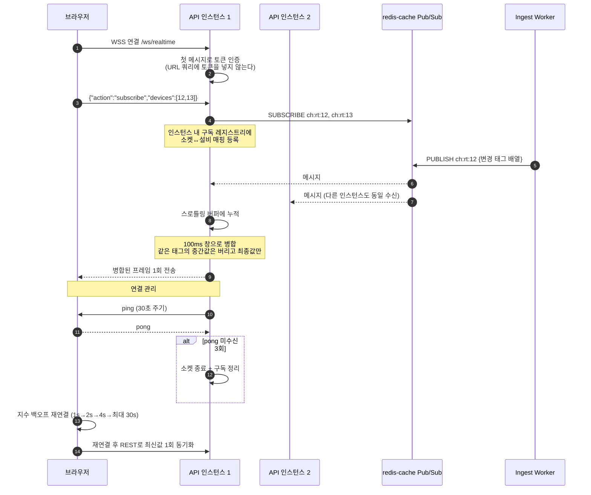
```mermaid
sequenceDiagram
    autonumber
    participant B as 브라우저
    participant API1 as API 인스턴스 1
    participant API2 as API 인스턴스 2
    participant RC as redis-cache Pub/Sub
    participant IW as Ingest Worker

    B->>API1: WSS 연결 /ws/realtime
    API1->>API1: 첫 메시지로 토큰 인증<br/>(URL 쿼리에 토큰을 넣지 않는다)
    B->>API1: {"action":"subscribe","devices":[12,13]}
    API1->>RC: SUBSCRIBE ch:rt:12, ch:rt:13
    Note over API1: 인스턴스 내 구독 레지스트리에<br/>소켓↔설비 매핑 등록

    IW->>RC: PUBLISH ch:rt:12 {변경 태그 배열}
    RC-->>API1: 메시지
    RC-->>API2: 메시지 (다른 인스턴스도 동일 수신)

    API1->>API1: 스로틀링 버퍼에 누적
    Note over API1: 100ms 창으로 병합<br/>같은 태그의 중간값은 버리고 최종값만
    API1-->>B: 병합된 프레임 1회 전송

    Note over B,API1: 연결 관리
    API1->>B: ping (30초 주기)
    B-->>API1: pong
    alt pong 미수신 3회
        API1->>API1: 소켓 종료 + 구독 정리
    end
    B->>B: 지수 백오프 재연결 (1s→2s→4s→최대 30s)
    B->>API1: 재연결 후 REST로 최신값 1회 동기화
```

### 9.1 스로틀링이 필수인 이유

| 조건 | 스로틀링 없음 | 100ms 병합 |
|---|---|---|
| 태그 500개 · 10 Hz 갱신 | 초당 5,000 프레임 | 초당 10 프레임 |
| 클라이언트 100개 | 초당 500,000 메시지 | 초당 1,000 메시지 |
| 브라우저 렌더링 | 프레임 드롭, 탭 멈춤 | 부드러움 |

사람 눈은 초당 10회 이상의 숫자 변화를 인지하지 못한다. 그 이상을 보내는 것은 순수한 낭비다.

### 9.2 Pub/Sub의 특성과 한계

| 특성 | 의미 | 대응 |
|---|---|---|
| 전달 보장 없음 (fire-and-forget) | 구독자가 없으면 메시지가 사라진다 | 실시간 표시 전용. **저장은 반드시 별도 경로(ClickHouse)로** |
| 구독자 전원에게 전달 | API 인스턴스가 늘어도 코드 변경 불필요 | 수평 확장에 유리 |
| 느린 구독자 문제 | 클라이언트가 느리면 Redis 출력 버퍼가 누적 | client-output-buffer-limit pubsub 설정으로 강제 절단 |
| 재연결 시 공백 | 끊긴 동안의 값을 못 받는다 | 재연결 직후 REST 최신값 조회로 동기화 |

---

## 10. F8 — 롤업 집계 흐름

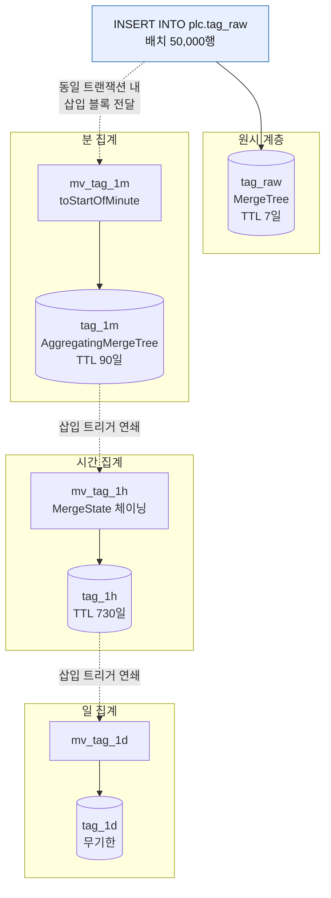
```mermaid
flowchart TB
    INS["INSERT INTO plc.tag_raw<br/>배치 50,000행"]

    subgraph L0["원시 계층"]
        RAW[("tag_raw<br/>MergeTree<br/>TTL 7일")]
    end

    subgraph L1["분 집계"]
        MV1["mv_tag_1m<br/>toStartOfMinute"]
        T1[("tag_1m<br/>AggregatingMergeTree<br/>TTL 90일")]
    end

    subgraph L2["시간 집계"]
        MV2["mv_tag_1h<br/>MergeState 체이닝"]
        T2[("tag_1h<br/>TTL 730일")]
    end

    subgraph L3["일 집계"]
        MV3["mv_tag_1d"]
        T3[("tag_1d<br/>무기한")]
    end

    INS --> RAW
    INS -.->|"동일 트랜잭션 내<br/>삽입 블록 전달"| MV1
    MV1 --> T1
    T1 -.->|"삽입 트리거 연쇄"| MV2
    MV2 --> T2
    T2 -.->|"삽입 트리거 연쇄"| MV3
    MV3 --> T3

    style INS fill:#e8f0ff,stroke:#2b6cb0,color:#1a1a1a
```

### 10.1 저장 계층별 특성

| 계층 | 보존 기간 | 행 수 (M 티어) | 용량 | 담당 조회 |
|---|---|---|---|---|
| tag_raw | 7일 | 60.5억 | 약 25 GB | 1시간 이내 상세 |
| tag_1m | 90일 | 12.9억 | 약 12 GB | 최근 1주일 트렌드 |
| tag_1h | 730일 | 1.75억 | 약 2 GB | 분기·연간 추이 |
| tag_1d | 무기한 | 730만/년 | 약 0.1 GB/년 | 장기 비교 |

원시 데이터를 7일만 보관하고도 장기 분석이 가능한 이유가 이 계층 구조다. 원시 25 GB를 버려도 롤업 14 GB가 남아 2년치 분석을 지원한다.

### 10.2 MV 사용 시 반드시 알아야 할 제약

| 제약 | 내용 | 대응 |
|---|---|---|
| 삽입 블록만 본다 | MV는 INSERT되는 블록에 대해서만 실행된다. 기존 테이블의 데이터는 보지 않는다 | 백필 시 MV를 DETACH하고 INSERT SELECT로 직접 채운 뒤 재연결 |
| 원자성 없음 | 원본 테이블 삽입은 성공하고 MV 삽입이 실패할 수 있다 | materialized_views_ignore_errors 설정을 끄고 실패를 감지. 불일치 시 해당 시간대 재계산 |
| 늦게 도착한 데이터 | 과거 시각 데이터를 나중에 넣으면 그 시점 기준으로 집계된다 | AggregatingMergeTree가 같은 키로 병합하므로 최종적으로는 정확해진다 |
| ALTER 취약 | 원본 테이블 컬럼 변경 시 MV가 깨진다 | 스키마 변경 절차를 문서화하고 순서를 지킨다 |
| 체이닝 깊이 | MV의 MV의 MV는 디버깅이 어렵다 | 3단계까지만 허용하고 그 이상은 배치 잡으로 |

### 10.3 백필 절차

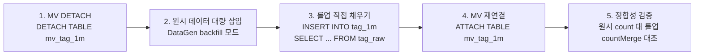
```mermaid
flowchart LR
    S1["1. MV DETACH<br/>DETACH TABLE mv_tag_1m"]
    S2["2. 원시 데이터 대량 삽입<br/>DataGen backfill 모드"]
    S3["3. 롤업 직접 채우기<br/>INSERT INTO tag_1m<br/>SELECT ... FROM tag_raw"]
    S4["4. MV 재연결<br/>ATTACH TABLE mv_tag_1m"]
    S5["5. 정합성 검증<br/>원시 count 대 롤업 countMerge 대조"]

    S1 --> S2 --> S3 --> S4 --> S5
```

MV를 붙인 채로 백필하면 원시 삽입과 MV 집계가 동시에 일어나 삽입 속도가 크게 떨어지고, 중간에 실패하면 롤업이 부분적으로만 채워져 정합성 판단이 불가능해진다.

---

## 11. F9 — 테스트 데이터 주입 흐름

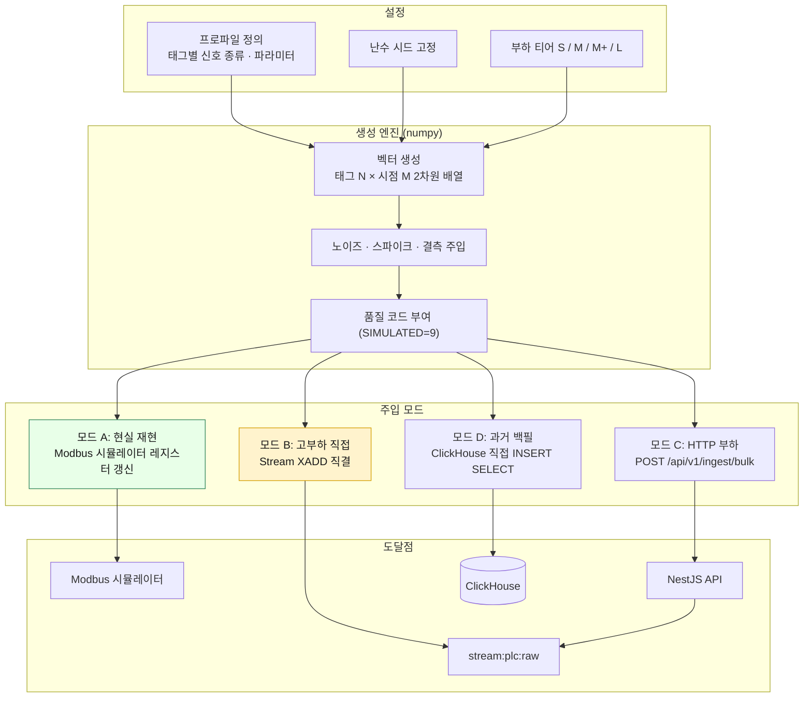
```mermaid
flowchart TB
    subgraph CFG["설정"]
        PROF["프로파일 정의<br/>태그별 신호 종류 · 파라미터"]
        SEED["난수 시드 고정"]
        TIER["부하 티어 S / M / M+ / L"]
    end

    subgraph ENGINE["생성 엔진 (numpy)"]
        VEC["벡터 생성<br/>태그 N × 시점 M 2차원 배열"]
        NOISE["노이즈 · 스파이크 · 결측 주입"]
        QUAL["품질 코드 부여 (SIMULATED=9)"]
    end

    subgraph MODE["주입 모드"]
        M1["모드 A: 현실 재현<br/>Modbus 시뮬레이터 레지스터 갱신"]
        M2["모드 B: 고부하 직접<br/>Stream XADD 직결"]
        M3["모드 C: HTTP 부하<br/>POST /api/v1/ingest/bulk"]
        M4["모드 D: 과거 백필<br/>ClickHouse 직접 INSERT SELECT"]
    end

    subgraph TARGET["도달점"]
        SIM["Modbus 시뮬레이터"]
        SR["stream:plc:raw"]
        API["NestJS API"]
        CH[("ClickHouse")]
    end

    PROF --> VEC
    SEED --> VEC
    TIER --> VEC
    VEC --> NOISE --> QUAL
    QUAL --> M1 --> SIM
    QUAL --> M2 --> SR
    QUAL --> M3 --> API --> SR
    QUAL --> M4 --> CH

    style M1 fill:#e8ffe8,stroke:#2f855a,color:#1a1a1a
    style M2 fill:#fff3cd,stroke:#d39e00,color:#1a1a1a
```

### 11.1 주입 모드별 측정 대상

| 모드 | 경유 계층 | 측정할 수 있는 것 | 측정할 수 없는 것 |
|---|---|---|---|
| A. Modbus 경유 | 전 계층 | 진짜 E2E 지연, Modbus 병목 | DB 상한 (Modbus가 먼저 막힘) |
| B. Stream 직결 | Redis 이후 | Redis·Worker·ClickHouse 상한 | Modbus·Collector 성능 |
| C. HTTP 경유 | API 이후 | API 처리량, 인증·직렬화 비용 | 수집 계층 성능 |
| D. ClickHouse 직접 | DB만 | 순수 삽입 성능, 압축률 | 파이프라인 전체 |

**측정 원칙: 한 번에 하나의 계층만 부하를 준다.** 모드 A와 B를 동시에 돌리면 어느 계층이 병목인지 판별할 수 없다.

### 11.2 신호 프로파일과 압축률 실험

| 프로파일 | 예상 압축률 | 실험 목적 |
|---|---|---|
| STEP / BINARY / COUNTER | 20~50배 | Delta 코덱의 최적 조건 확인 |
| SINE | 5~12배 | 일반적 아날로그 신호의 현실적 기준 |
| RANDOM_WALK | 2~4배 | **최악의 경우.** 용량 산정은 이 값 기준으로 해야 안전 |
| 혼합 (실무 유사: STEP 40% + SINE 40% + WALK 20%) | 8~15배 | 실제 예상치 |

용량 계획은 반드시 **혼합 프로파일과 RANDOM_WALK 두 가지로 각각 측정**한 뒤 보수적인 쪽을 채택한다.

### 11.3 부하 테스트 실행 절차

| 단계 | 동작 | 확인 사항 |
|---|---|---|
| 1 | EBS 스냅샷 생성 | 실험 전 상태로 되돌릴 수 있는가 |
| 2 | 모든 컨테이너 재시작, 캐시 비우기 | 이전 실험의 캐시가 남아 결과를 왜곡하지 않는가 |
| 3 | Grafana 대시보드 열고 기준선 5분 관측 | 유휴 상태 자원 사용률 기록 |
| 4 | 부하 주입 시작 (별도 인스턴스에서) | 부하 생성기 자체가 포화되지 않았는가 |
| 5 | 목표 지속 시간 유지 | 컨슈머 랙이 안정 상태인가 증가 추세인가 |
| 6 | 부하 중단 후 회복 관측 | 랙 소진 시간, 파트 병합 완료 시간 |
| 7 | 데이터 정합성 검증 | 생성 포인트 수 대 ClickHouse 행 수 일치 여부 |
| 8 | 수치 기록 후 스냅샷 복원 | 다음 실험의 조건을 동일하게 |

---

## 12. F10 — 백프레셔와 장애 흐름

### 12.1 백프레셔 전파

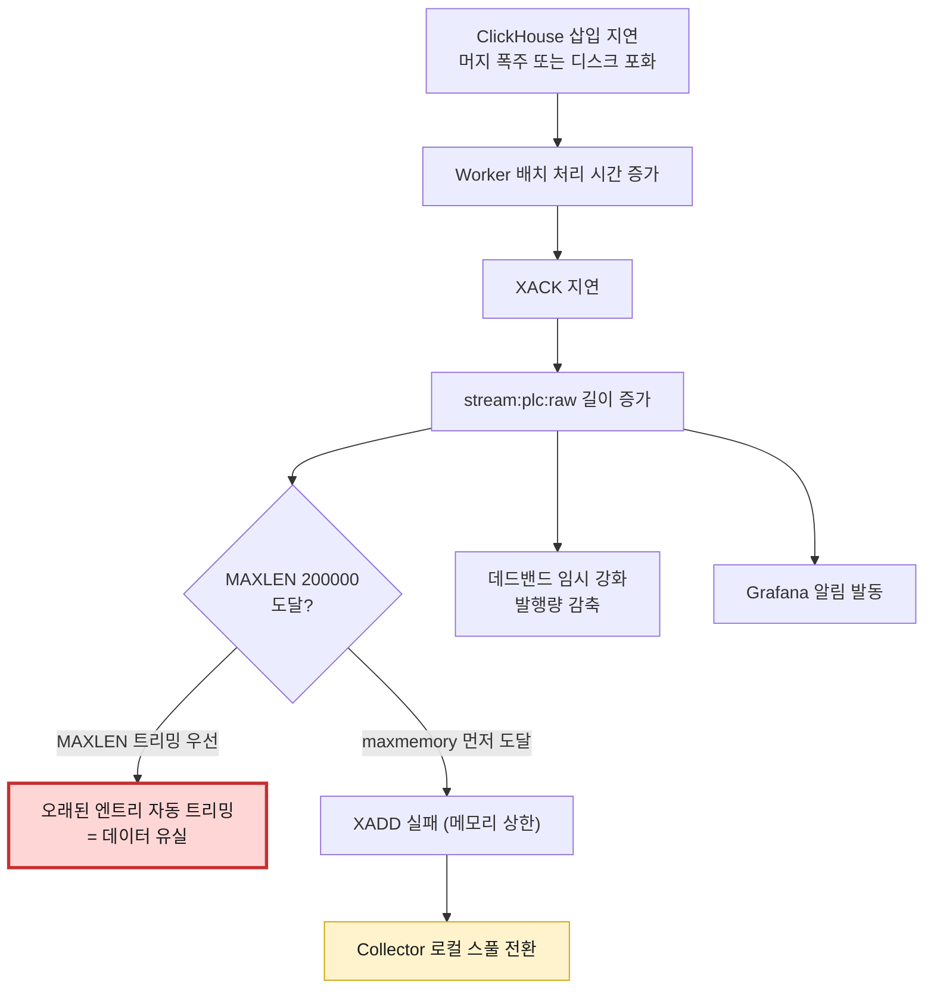
```mermaid
flowchart TB
    SLOW["ClickHouse 삽입 지연<br/>머지 폭주 또는 디스크 포화"]
    W1["Worker 배치 처리 시간 증가"]
    W2["XACK 지연"]
    S1["stream:plc:raw 길이 증가"]
    S2{"MAXLEN 200000<br/>도달?"}
    D1["오래된 엔트리 자동 트리밍<br/>= 데이터 유실"]
    D2["XADD 실패 (메모리 상한)"]
    C1["Collector 로컬 스풀 전환"]
    C2["데드밴드 임시 강화<br/>발행량 감축"]
    ALERT["Grafana 알림 발동"]

    SLOW --> W1 --> W2 --> S1 --> S2
    S2 -->|"MAXLEN 트리밍 우선"| D1
    S2 -->|"maxmemory 먼저 도달"| D2
    D2 --> C1
    S1 --> C2
    S1 --> ALERT

    style D1 fill:#ffd6d6,stroke:#c53030,stroke-width:3px,color:#1a1a1a
    style C1 fill:#fff3cd,stroke:#d39e00,color:#1a1a1a
```

**중요한 함정:** MAXLEN 트리밍은 **조용히 오래된 데이터를 버린다.** 아무 오류도 발생하지 않으므로 유실을 인지하지 못한다. 이를 막으려면 MAXLEN을 maxmemory보다 크게 잡아 메모리 상한에 먼저 도달하게 하고, XADD 실패를 명시적 신호로 받는 편이 낫다. 어느 쪽을 택하든 **스트림 길이를 반드시 모니터링**하고 80% 도달 시 알림을 띄운다.

### 12.2 계층별 장애 대응

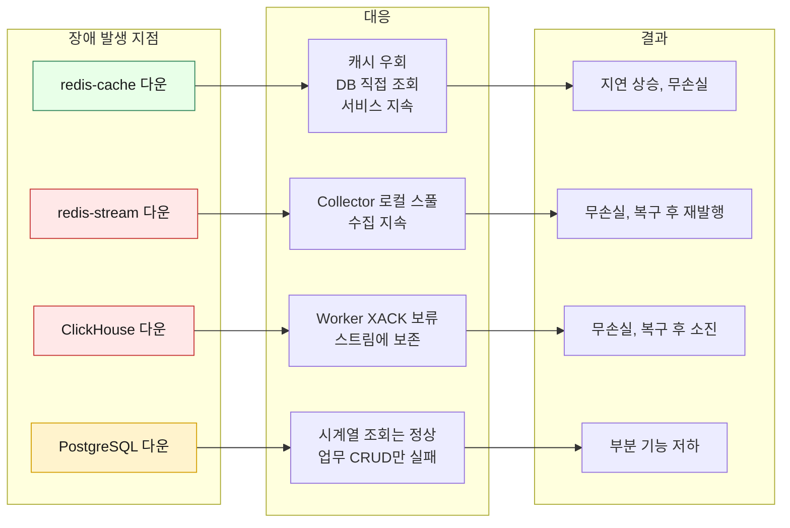
```mermaid
flowchart LR
    subgraph FAIL["장애 발생 지점"]
        F1["redis-cache 다운"]
        F2["redis-stream 다운"]
        F3["ClickHouse 다운"]
        F4["PostgreSQL 다운"]
    end

    subgraph RESP["대응"]
        R1["캐시 우회<br/>DB 직접 조회<br/>서비스 지속"]
        R2["Collector 로컬 스풀<br/>수집 지속"]
        R3["Worker XACK 보류<br/>스트림에 보존"]
        R4["시계열 조회는 정상<br/>업무 CRUD만 실패"]
    end

    subgraph RESULT["결과"]
        O1["지연 상승, 무손실"]
        O2["무손실, 복구 후 재발행"]
        O3["무손실, 복구 후 소진"]
        O4["부분 기능 저하"]
    end

    F1 --> R1 --> O1
    F2 --> R2 --> O2
    F3 --> R3 --> O3
    F4 --> R4 --> O4

    style F1 fill:#e8ffe8,stroke:#2f855a,color:#1a1a1a
    style F2 fill:#ffe8e8,stroke:#c53030,color:#1a1a1a
    style F3 fill:#ffe8e8,stroke:#c53030,color:#1a1a1a
    style F4 fill:#fff3cd,stroke:#d39e00,color:#1a1a1a
```

### 12.3 ClickHouse 중단 복구 시나리오 상세

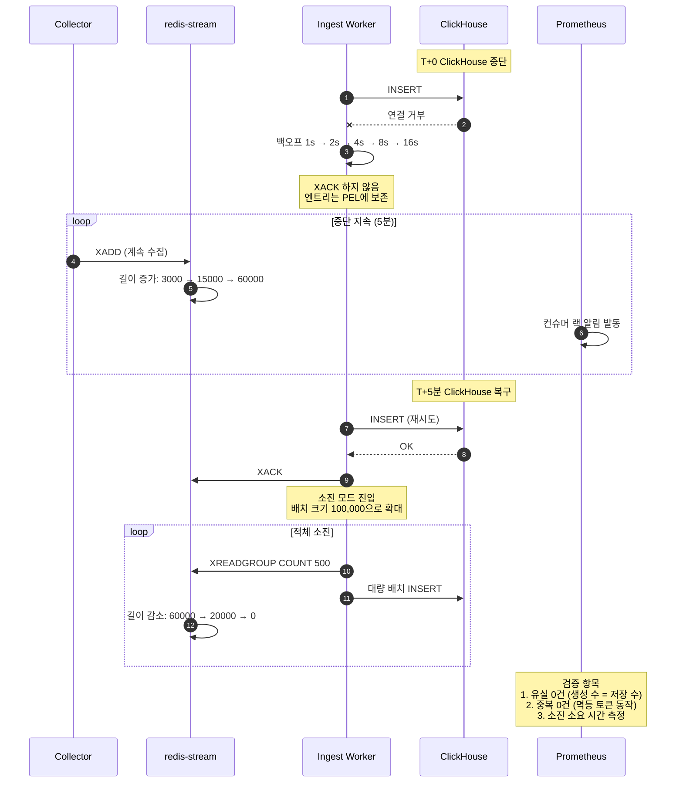
```mermaid
sequenceDiagram
    autonumber
    participant CL as Collector
    participant SR as redis-stream
    participant IW as Ingest Worker
    participant CH as ClickHouse
    participant MON as Prometheus

    Note over CH: T+0 ClickHouse 중단
    IW->>CH: INSERT
    CH--xIW: 연결 거부
    IW->>IW: 백오프 1s → 2s → 4s → 8s → 16s
    Note over IW: XACK 하지 않음<br/>엔트리는 PEL에 보존

    loop 중단 지속 (5분)
        CL->>SR: XADD (계속 수집)
        SR->>SR: 길이 증가: 3000 → 15000 → 60000
        MON->>MON: 컨슈머 랙 알림 발동
    end

    Note over CH: T+5분 ClickHouse 복구
    IW->>CH: INSERT (재시도)
    CH-->>IW: OK
    IW->>SR: XACK
    Note over IW: 소진 모드 진입<br/>배치 크기 100,000으로 확대

    loop 적체 소진
        IW->>SR: XREADGROUP COUNT 500
        IW->>CH: 대량 배치 INSERT
        SR->>SR: 길이 감소: 60000 → 20000 → 0
    end

    Note over MON: 검증 항목<br/>1. 유실 0건 (생성 수 = 저장 수)<br/>2. 중복 0건 (멱등 토큰 동작)<br/>3. 소진 소요 시간 측정
```

| 검증 항목 | 확인 방법 | 합격 기준 |
|---|---|---|
| 무손실 | DataGen 생성 카운트 대 ClickHouse count() | 완전 일치 |
| 무중복 | tag_id + ts 조합의 중복 행 수 | 0건 |
| 소진 시간 | 랙이 0으로 돌아오는 데 걸린 시간 | 중단 시간의 30% 이내 |
| 데이터 순서 | ts 기준 정렬 시 공백 없음 | 결측 구간 없음 |

---

## 13. 데이터 수명 주기

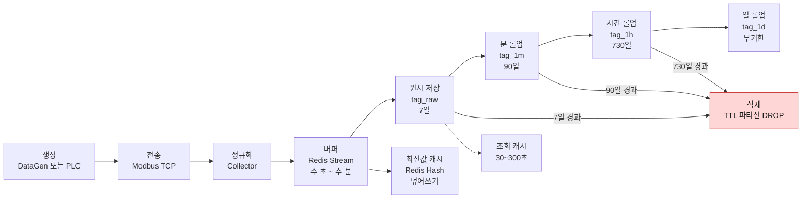
```mermaid
flowchart LR
    A["생성<br/>DataGen 또는 PLC"]
    B["전송<br/>Modbus TCP"]
    C["정규화<br/>Collector"]
    D["버퍼<br/>Redis Stream<br/>수 초 ~ 수 분"]
    E["원시 저장<br/>tag_raw<br/>7일"]
    F["분 롤업<br/>tag_1m<br/>90일"]
    G["시간 롤업<br/>tag_1h<br/>730일"]
    H["일 롤업<br/>tag_1d<br/>무기한"]
    I["삭제<br/>TTL 파티션 DROP"]

    A --> B --> C --> D --> E
    E --> F --> G --> H
    E -->|"7일 경과"| I
    F -->|"90일 경과"| I
    G -->|"730일 경과"| I

    LV["최신값 캐시<br/>Redis Hash<br/>덮어쓰기"]
    QC["조회 캐시<br/>30~300초"]
    D --> LV
    E -.-> QC

    style I fill:#ffd6d6,stroke:#c53030,color:#1a1a1a
```

| 단계 | 저장 위치 | 보존 | 삭제 방식 | 복구 가능성 |
|---|---|---|---|---|
| 버퍼 | Redis Stream | 소비 후 MAXLEN 범위 내 | 자동 트리밍 | 불가 (소비 완료분은 ClickHouse에 존재) |
| 원시 | ClickHouse tag_raw | 7일 | TTL DELETE (파티션 DROP) | 불가. 필요 시 보존 기간 연장 |
| 분 롤업 | ClickHouse tag_1m | 90일 | TTL DELETE | 원시가 남아 있으면 재생성 가능 |
| 시간 롤업 | ClickHouse tag_1h | 730일 | TTL DELETE | 분 롤업에서 재생성 가능 |
| 일 롤업 | ClickHouse tag_1d | 무기한 | 수동 | 시간 롤업에서 재생성 가능 |
| 최신값 | Redis Hash | 덮어쓰기 | - | ClickHouse에서 복원 가능 |
| 조회 캐시 | Redis String | TTL | 자동 만료 + LRU | 재조회로 복원 |
| 업무 데이터 | PostgreSQL | 무기한 | 논리 삭제 | 백업에서 복원 |
| 알람 이벤트 | PostgreSQL 월 파티션 | 2년 후 DETACH | 파티션 분리 후 아카이브 | S3 아카이브에서 |

**보존 정책 변경은 파티션 단위로만 한다.** ClickHouse에서 행 단위 DELETE는 비동기 mutation이라 매우 비싸다. PARTITION BY를 일자로 잡은 이유가 여기 있다.

---

## 14. 데이터 계약

한 측정값이 계층을 통과하며 어떻게 변형되는지 추적한다.


```mermaid
flowchart LR
    A["Modbus 레지스터<br/>2바이트 워드 배열"]
    B["디코딩 값<br/>raw: int/float"]
    C["정규화 포인트<br/>tag_id, ts, value, quality"]
    D["Stream 엔트리<br/>MessagePack 컬럼 배열"]
    E["ClickHouse 행<br/>7 컬럼"]
    F["API 응답<br/>JSON"]
    G["차트 데이터<br/>uPlot 배열"]

    A -->|"워드순서 + 타입변환"| B
    B -->|"scale/offset + 품질판정"| C
    C -->|"배치 묶음 + 직렬화"| D
    D -->|"전개 + 컬럼 정렬"| E
    E -->|"집계 + dictGet + 다운샘플"| F
    F -->|"열 지향 변환"| G
```

### 14.1 단계별 스키마

**1단계 — Modbus 응답 (와이어)**

| 항목 | 값 |
|---|---|
| 형식 | 16비트 빅엔디안 워드 배열 |
| 예 | [0x4291, 0x999A] (FLOAT32 ABCD 순서) |
| 크기 | 태그당 1~4 워드 |

**2단계 — 디코딩 결과 (Collector 메모리)**

| 필드 | 타입 | 예 |
|---|---|---|
| tag_id | int | 3401 |
| raw_value | float | 72.8 |
| eng_value | float | 72.8 × 1.0 + 0.0 = 72.8 |
| ts | epoch ms | 1757400000123 |
| quality | int | 9 (SIMULATED) |

**3단계 — Stream 엔트리 (MessagePack 컬럼 배열)**

| 필드 | 타입 | 설명 |
|---|---|---|
| v | uint8 | 스키마 버전. **호환성 관리의 핵심** |
| d | uint32 | device_id |
| s | uint64 | scan_seq (스캔 사이클 일련번호) |
| t0 | uint64 | 기준 타임스탬프 (epoch ms) |
| tg | uint32[] | tag_id 배열 |
| dt | int32[] | t0 기준 오프셋 밀리초 배열 |
| va | float64[] | 값 배열 |
| q | uint8[] | 품질 코드 배열 |

컬럼 배열 방식의 이점: 필드 이름을 배열 요소마다 반복하지 않아 크기가 약 1/9로 줄고, ClickHouse 삽입 시 컬럼 지향 포맷으로 바로 전달할 수 있다. 타임스탬프를 기준값 + 오프셋으로 분리하면 정수 폭이 8바이트에서 4바이트로 줄어든다.

**스키마 버전 필드(v)의 역할:** Collector와 Worker는 서로 다른 시점에 배포된다. 배포 중에는 구버전 Collector가 만든 엔트리와 신버전 Worker가 공존한다. Worker는 v 필드를 보고 해당 버전의 디코더를 선택해야 한다. 이 필드가 없으면 무중단 배포가 불가능하다.

**4단계 — ClickHouse 행**

| 컬럼 | 타입 | 출처 |
|---|---|---|
| ts | DateTime64(3) | t0 + dt[i] |
| device_id | UInt32 | d |
| tag_id | UInt32 | tg[i] |
| value | Float64 | va[i] |
| quality | UInt8 | q[i] |
| scan_seq | UInt64 | s |
| ingested_at | DateTime64(3) | 삽입 시각 (지연 계산용) |

**5단계 — API 응답 (JSON)**

| 필드 | 설명 |
|---|---|
| meta.interval | 서버가 실제로 선택한 해상도 |
| meta.pointCount | 반환 포인트 수 |
| meta.downsampled | LTTB 적용 여부 |
| meta.cached | 캐시 히트 여부 (성능 디버깅용) |
| series[].tagId, tagName, unit | Dictionary에서 부착된 메타 |
| series[].points | [timestamp, avg, min, max] 배열의 배열 |

포인트를 객체 배열이 아니라 **배열의 배열**로 내리는 이유: 2,000 포인트 기준 JSON 크기가 약 1/3로 줄고, uPlot이 요구하는 열 지향 형식으로 변환하기도 쉽다.

### 14.2 계약 변경 규칙

| 변경 유형 | 허용 여부 | 절차 |
|---|---|---|
| Stream 엔트리에 선택 필드 추가 | 허용 | v 유지, Worker가 존재 여부 확인 |
| Stream 엔트리 필드 삭제·의미 변경 | 주의 | v 증가, Worker에 양쪽 디코더 배포 → Collector 배포 → 구 디코더 제거 |
| ClickHouse 컬럼 추가 | 허용 | DEFAULT 값 지정하면 기존 파트에 영향 없음 |
| ClickHouse ORDER BY 변경 | 불가 | 새 테이블 생성 후 데이터 이관 |
| API 응답 필드 추가 | 허용 | 프론트는 미지의 필드를 무시 |
| API 응답 필드 삭제 | 주의 | 버전 경로(v2) 신설 후 단계적 폐기 |

---

## 15. 지연 예산

M 티어(초당 10,000 포인트) 정상 상태 기준, 각 구간의 p95 목표치.

| 구간 | 목표 p95 | 누적 | 지배 요인 | 초과 시 조치 |
|---|---|---|---|---|
| 신호 생성 → 시뮬레이터 레지스터 반영 | 2 ms | 2 ms | numpy 연산 | 배치 생성 주기 조정 |
| Modbus 요청 왕복 | 30 ms | 32 ms | 네트워크 왕복 × 요청 수 | 레지스터 블록 병합 강화 |
| 디코딩 + 품질 판정 | 5 ms | 37 ms | 태그 수 | 벡터화 |
| MessagePack 인코딩 | 3 ms | 40 ms | 페이로드 크기 | - |
| XADD (파이프라인) | 3 ms | 43 ms | Redis 왕복 | 파이프라인 크기 조정 |
| **Stream 대기 시간** | **400 ms** | **443 ms** | **배치 플러시 주기** | **워커 증설, 배치 시간 트리거 단축** |
| ClickHouse INSERT | 250 ms | 693 ms | 배치 크기, 디스크 IOPS | EBS IOPS 상향, 배치 조정 |
| MV 캐스케이드 | 100 ms | 793 ms | 롤업 단계 수 | 체이닝 깊이 축소 |
| 파트 가시성 | 즉시 | 793 ms | - | - |
| **E2E (생성 → 조회 가능)** | **1,500 ms** | - | 위 합계 + 여유 | - |
| | | | | |
| 최신값 조회 (Redis) | 5 ms | - | 네트워크 + HGETALL | 파이프라인화 |
| 시계열 조회 (캐시 히트) | 15 ms | - | gzip 해제 + 직렬화 | 압축 레벨 조정 |
| 시계열 조회 (1일, 캐시 미스) | 250 ms | - | ClickHouse 스캔 | 롤업 해상도 상향 |
| Pub/Sub → WebSocket 도달 | 150 ms | - | 스로틀 창 100 ms | 스로틀 창 조정 |
| 업무 데이터 CRUD | 80 ms | - | PostgreSQL + 커밋 | 인덱스 점검 |

**지연 예산의 지배 구간은 Stream 대기 시간(400 ms)이다.** 이는 배치 플러시 주기(1,000 ms)의 절반 근처이며, 처리량과 지연의 트레이드오프를 조절하는 유일한 손잡이다. E2E 지연을 500 ms로 줄이고 싶다면 플러시 주기를 200 ms로 낮춰야 하는데, 그러면 파트 생성률이 5배 늘어 ClickHouse 머지 부담이 커진다. **이 트레이드오프를 수치로 직접 확인하는 것이 이 프로젝트의 가장 중요한 학습 목표다.**

측정 방법:

| 지표 | 계산식 | 수집 위치 |
|---|---|---|
| Modbus 왕복 | 요청 직전·직후 타임스탬프 차 | Collector 히스토그램 |
| Stream 대기 | XREADGROUP 수신 시각 − 엔트리 t0 | Worker 히스토그램 |
| 삽입 지연 | INSERT 전후 시각 차 | Worker 히스토그램 |
| **E2E 지연** | **ClickHouse에서 ingested_at − ts** | **주기적 쿼리로 게이지 노출** |
| API 지연 | 미들웨어 히스토그램 | API |

E2E 지연을 ClickHouse 컬럼 두 개의 차이로 계산할 수 있게 설계한 것이 핵심이다. 별도 추적 시스템 없이 SQL 한 줄로 전체 파이프라인의 건강 상태를 알 수 있다.

```sql
SELECT
    quantile(0.50)(dateDiff('millisecond', ts, ingested_at)) AS p50_ms,
    quantile(0.95)(dateDiff('millisecond', ts, ingested_at)) AS p95_ms,
    quantile(0.99)(dateDiff('millisecond', ts, ingested_at)) AS p99_ms,
    count() AS rows
FROM plc.tag_raw
WHERE ts > now() - INTERVAL 5 MINUTE;
```

---

## 16. 흐름별 병목 예상 지점

| 흐름 | 1차 병목 후보 | 증상 | 확인 지표 | 대응 |
|---|---|---|---|---|
| F1 수집 | Modbus 요청 수 | 폴링 주기 초과 | poll_duration > scan_rate | 레지스터 블록 병합, 스캔 그룹 분리 |
| F2 적재 | ClickHouse 파트 생성률 | too many parts 오류 | system.parts 활성 파트 수 | 배치 크기 확대, async_insert |
| F2 적재 | EBS IOPS | 삽입 지연 급증 | 디스크 대기시간 | gp3 IOPS 상향, 머지 설정 조정 |
| F3 최신값 | Redis 단일 스레드 | ops/s 포화 | redis instantaneous_ops | 파이프라인화, 읽기 복제본 |
| F4 이력 조회 | ClickHouse 스캔량 | 쿼리 시간 급증 | query_duration_ms | 롤업 해상도 상향, 캐시 히트율 개선 |
| F4 이력 조회 | 캐시 키 파편화 | 히트율 저조 | 캐시 히트율 | 시간 경계 스냅 확인 |
| F5 업무 CRUD | PostgreSQL 커넥션 | 커넥션 고갈 | pg active connections | PgBouncer 풀 크기 조정 |
| F7 실시간 푸시 | WebSocket 팬아웃 | 이벤트 루프 지연 | nodejs_eventloop_lag | 스로틀 창 확대, API 인스턴스 증설 |
| F8 롤업 | MV 체이닝 오버헤드 | 삽입 지연 증가 | 삽입 전후 시간 차 | 체이닝 깊이 축소 |
| 전체 | 호스트 CPU | 모든 지표 동시 악화 | node CPU | 인스턴스 업그레이드, 컴포넌트 분리 |

---

## 17. 흐름 검증 체크리스트

각 Phase 완료 시 아래를 실제로 실행하고 수치를 기록한다.

| 항목 | 검증 방법 | 합격 기준 |
|---|---|---|
| 수집 무손실 | DataGen 생성 카운트 대 ClickHouse count() | 완전 일치 |
| 중복 없음 | tag_id + ts 조합 중복 행 수 | 0건 |
| E2E 지연 | ingested_at − ts 분위수 쿼리 | p95 ≤ 1.5초 |
| 시간대 정확성 | 저장 시각과 UI 표시 시각 대조 | 오차 없음 |
| 롤업 정합성 | 원시 avg 대 tag_1m의 avgMerge | 부동소수 오차 범위 내 |
| 캐시 정합성 | 마스터 수정 후 API 응답 | 무효화 후 즉시 반영 |
| 최신값 정확성 | Redis Hash 대 ClickHouse argMax | 일치 |
| 품질 코드 전파 | 시뮬레이터 오류 주입 후 조회 | 해당 품질 코드로 저장됨 |
| 알람 디바운스 | 순간 스파이크 주입 | 디바운스 미만이면 알람 미발생 |
| WebSocket 재연결 | 네트워크 강제 차단 후 복구 | 재연결 + 최신값 동기화 완료 |
| 백프레셔 | ClickHouse 5분 중단 | 무손실 복구, 소진 시간 측정 |
| DLQ | 잘못된 데이터 주입 | DLQ 이동 + 알림 발동 |
| TTL 삭제 | 보존 기간 초과 데이터 | 파티션 자동 DROP 확인 |

---

## 관련 문서

- tech_stack.md — 기술 선정 근거, 버전, 비용, 학습 로드맵
- architecture.md — 시스템 구조, 스키마, 배포 토폴로지, 용량 산정
