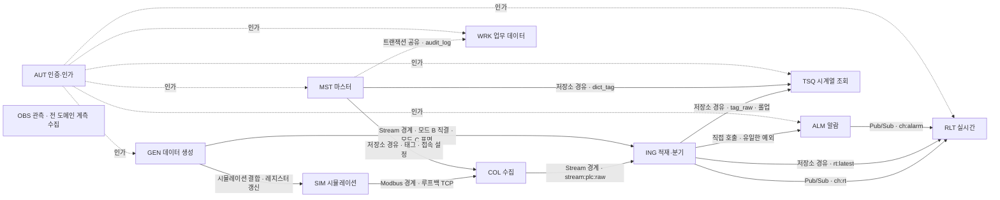

# 도메인 지도

> **대상**: 전 설계자 · 신규 합류자 — 11도메인이 어느 NestJS 모듈 · 평면 · 위치에 앉고, 서로 어떤 경계로 이어지며, 각 폴더에서 어디가 비는가
> **작성일**: 2026-09-24
> **개정일**: 2026-09-24 — W2 판정 반영 — 인가 간선 AUT → GEN 추가(부하 주입 표면은 환경변수 게이트 + 인증) · 인가 5 → **6** · 간선 17 → **18** · GEN · OBS 인가 미정 불릿을 판정 결과로 교체
> **원천**: 원본 architecture.md §4 · §5 · §6 · §8.2 · §11(커밋 ff66a37) · 원본 tech_stack.md §3.1 · §3.3 · §10.1 · §11(커밋 ff66a37) · 원본 data_flow.md §1 · §2 · §7 · §7.2 · §8 · §11(커밋 ff66a37) · 원본 implementation_plan.md §6 · §7.3(커밋 ff66a37) · 저장소 루트 docs_plan.md(도메인 벡터 · 보정 #11 · #12 · #13) · [../README.md](../README.md) 고정 기준(도메인 · 도메인 공백)

이 문서는 **도메인 ↔ NestJS 모듈 ↔ 평면 매핑의 정본**이다. 도메인은 NestJS 모듈과 1:1이며, **도메인 경계가 곧 문서 소유권 경계**다 — 기능 ID는 [../02_features](../02_features/README.md)의 도메인 파일에서, 요구사항 ID는 [../03_requirements](../03_requirements/README.md)의 도메인 파일에서만 채번한다.

모든 도메인은 **api 컨테이너 하나의 NestJS 단일 프로세스 안**에 모듈로 산다(원본 architecture.md §4). 컨테이너가 하나라도 모듈 사이의 경계는 호출 스택이 아니라 Redis Stream · Pub/Sub · Modbus 소켓이며, 이 경계가 APP_ROLE로 모듈을 떼어낼 때 코드 변경을 없앤다. 경계의 유일한 의도된 예외가 알람 판정의 직접 호출이다.

## 11도메인

| # | 접두 | 도메인 | NestJS 모듈 | 평면 | 컨테이너 내 위치 | APP_ROLE 분리 시 | 핵심 책임 |
|------|------|------|------|------|------|------|------|
| 1 | AUT | 인증·인가 | auth | 제어 | api 컨테이너 · apps/api/src/modules/auth | api | 로그인 · 토큰 갱신 · 로그아웃 · 역할 기반 인가 · 레이트 리밋 |
| 2 | MST | 마스터 데이터 | master | 제어 | 상동 · modules/master | api | 사이트 · 라인 · 설비 · Modbus 접속 설정 · 태그 마스터 · 캐시 무효화 체인 |
| 3 | COL | 수집 | collector | 데이터 | 상동 · modules/collector | collector | Modbus 폴링 · 디코딩 · 품질 판정 · 데드밴드 · Stream 발행 · 스풀 |
| 4 | SIM | 시뮬레이션 | plc-sim | 데이터 | 상동 · modules/plc-sim · 루프백 포트 대역 | **원본 미지정** — W3 확정 | Modbus TCP 서버 응답 · 레지스터 Buffer · 지연 · 오류 주입 |
| 5 | GEN | 데이터 생성 | datagen | 데이터 | 상동 · modules/datagen · worker_threads | datagen | 신호 프로파일 생성 · 주입 모드 A~D · 백필 · 부하 주입 표면 |
| 6 | ING | 적재·분기 | ingest | 데이터 | 상동 · modules/ingest · 컨슈머 N개 | worker | Stream 소비 · 배치 적재 · 멱등 · 재시도 · DLQ · 최신값 갱신 · 분기 실행 · 대조군 동시 적재 |
| 7 | TSQ | 시계열 조회 | timeseries | 제어 | 상동 · modules/timeseries | api | 시계열 조회 · 해상도 자동 선택 · 캐시 · 스탬피드 방지 · 다운샘플 · 내보내기 |
| 8 | RLT | 실시간 | realtime | 제어 | 상동 · modules/realtime | api | 최신값 조회 · WebSocket 게이트웨이 · 스로틀 병합 |
| 9 | ALM | 알람 | alarms | 제어 | 상동 · modules/alarms | **worker**(판정은 Ingest 후처리로 함께 확장) | 규칙 · 디바운스 판정 · 세 저장소 쓰기 · 확인 |
| 10 | WRK | 업무 데이터 | work-orders | 제어 | 상동 · modules/work-orders | api | 작업지시 · 생산 실적 · 감사 로그 |
| 11 | OBS | 관측 | metrics | 관측 | 상동 · modules/metrics | **원본 미지정** — W3 확정 | /metrics 통합 노출 · 저장소 메트릭 수집 · 헬스체크 |

### 검산

- 평면별: 제어 6(AUT · MST · TSQ · RLT · ALM · WRK) + 데이터 4(COL · SIM · GEN · ING) + 관측 1(OBS) = **11**
- APP_ROLE 값은 all(기본) · api · worker · collector · datagen이다. 도메인 → 역할 배정은 원본 architecture.md §4의 확장 방식 열에서 읽었고, SIM · OBS는 원본이 배정하지 않았다 — 배정의 정본은 [../04_architecture/02_module_boundaries.md](../04_architecture/02_module_boundaries.md)(W3)다.
- **웹(Next.js)은 도메인이 아니다.** 호스트 프로세스이며 모듈이 아니라 표면의 소비자다. BFF 경로는 [../07_api/01_conventions.md](../07_api/01_conventions.md)가 소유한다.

## 평면 분류와 실행 위치가 어긋나는 도메인

평면은 **코드가 어느 관심사에 속하는가**(원본 tech_stack.md §3.1 · §11 모듈 트리)로 가른다. 실행 위치(어느 호출 경로에서 도는가)와 늘 같지는 않다. 아래는 독자가 분류 오류로 신고하기 쉬운 네 경우다.

| 도메인 | 평면 | 실제로 도는 자리 | 어긋남이 맞는 이유 | 어긋남이 만드는 규칙 |
|------|------|------|------|------|
| ALM | 제어 | 판정은 **ING 배치의 후처리**로 데이터 경로에서 돈다 | 규칙 관리 · 이벤트 확인 · 조회 표면이 제어 평면이고, 판정은 규칙의 소비일 뿐이다 | 판정의 처리량 상한이 수집 경로의 상한이 된다 — 행당 상태 조회 왕복을 배치당으로 줄인다(원본 implementation_plan.md §7.3) |
| GEN | 데이터 | 정상 수집 경로에 **참여하지 않는다** | 데이터를 만들어 경로 입구에 넣을 뿐 경로의 단계가 아니다 | 데이터 평면이지만 API 표면(/api/v1/ingest/bulk)을 소유한다(docs_plan 보정 #11) |
| RLT | 제어 | 자기 저장 객체 없이 ING가 쓴 rt:latest · ch:rt만 읽는다 | 표면(최신값 API · WebSocket)이 제어 평면이다 | RLT의 신선도는 ING의 갱신 주기에 묶인다 — ClickHouse 중단이 최신값 정지로 번지는 결합(원본 implementation_plan.md §7.2) |
| OBS | 관측 | 전 도메인의 카운터와 세 저장소의 통계를 15초 주기로 모은다 | 측정 대상과 측정 도구를 가르는 별도 평면이다 | 의존 그래프 밖에 둔다 — 모든 도메인이 계측을 노출할 책임을 지고 OBS는 모으기만 한다 |

## 도메인 간 의존 그래프

도메인 사이의 연결을 경계 유형별로 그린다. 실선은 데이터가 흐르는 경계, 점선은 인가와 트랜잭션 공유다.

- **수집 → 적재의 경계는 반드시 Stream이다.** COL과 GEN 모드 B · C가 ING로 가는 길은 모두 stream:plc:raw를 지난다. 같은 프로세스 안이어도 예외가 아니며, 우회는 실험 전용 SW-01 off뿐이다(전역 불변식 "비동기 경계").
- **GEN → SIM은 Stream 경계 규칙의 대상이 아니다.** 레지스터 Buffer 갱신은 수집 **이전**의 모사 구간이고, 진짜 경계인 Modbus 소켓(SIM → COL)이 뒤에 온다. 같은 프로세스라는 이유로 Modbus 구간을 생략하지 않는다 — 생략하면 모드 A의 E2E 지연에서 Modbus 계층이 빠진다.
- **GEN 모드 D는 도메인 간 의존이 아니다.** ClickHouse에 직접 삽입하므로 그래프에 없는 대신 ING를 우회한다 — 그 행은 멱등 토큰 · 대조군 동시 적재를 타지 않는다. 모드 D로 채운 구간을 목표 ① 대조에 쓸 때는 대조군 쪽도 같은 행 집합을 따로 채운다([01_purpose_learning_goals.md](./01_purpose_learning_goals.md)).
- **MST → WRK의 트랜잭션 공유**는 마스터 변경이 같은 트랜잭션에서 감사 로그를 쓰는 경로다(원본 data_flow.md §7). 감사 로그 테이블의 소유는 WRK(02_features/10)인데 쓰는 주체는 여러 도메인이다 — 소유와 쓰기의 분리를 [../05_data_stores/02_postgresql_constraints.md](../05_data_stores/02_postgresql_constraints.md)가 한계 등재로 받는다(W3).
- **OBS는 그래프 밖이다.** 모든 도메인이 메트릭을 노출하고 OBS가 모은다. 계측 없는 스위치는 장식이므로 새 모듈은 메트릭과 함께 들어온다(전역 불변식 "계측 우선").

## 경계 유형

그래프의 간선을 경계 유형으로 센다. 유형은 닫힌 어휘다 — 새 간선이 어느 유형에도 들지 않으면 유형을 늘리기 전에 분류 축을 다시 본다.

| 경계 유형 | 매체 | 간선 | 경계가 보장하는 것 | 경계를 없애면 |
|------|------|------|------|------|
| Stream 경계 | Redis Stream + 컨슈머 그룹 | COL → ING · GEN → ING | 백프레셔 흡수 · at-least-once · 이벤트 루프 격리 · 역할 분리 시 코드 불변 | ClickHouse 삽입 지연이 Modbus 폴링 주기로 역류하고, 재시작 시 미처리 배치가 사라진다 |
| Pub/Sub 경계 | Redis Pub/Sub | ING → RLT · ALM → RLT | 발행자와 WebSocket 게이트웨이의 분리 · 수평 확장 시 코드 불변 | api 다중 인스턴스에서 팬아웃 코드를 새로 써야 한다 |
| Modbus 경계 | 루프백 TCP 소켓 | SIM → COL | 요청 인코딩 · 블록 병합 · 디코딩을 포함한 실제 수집 경로 | 모드 A E2E 지연에서 Modbus 계층이 빠진다 |
| 직접 호출(예외) | 같은 프로세스 내 호출 | ING → ALM | 배치와 판정의 재처리 단위 일치 — 별도 큐 불필요 | 근거가 없으면 경계 원칙의 무근거 예외가 된다(근거 정본 04_architecture/02 · W3) |
| 저장소 경유 | 한 도메인이 쓰고 다른 도메인이 읽는 저장 객체 | ING → RLT(rt:latest) · ING → TSQ · MST → COL · MST → TSQ | 쓰는 쪽과 읽는 쪽의 수명 분리 | 호출 결합으로 바뀌어 한쪽 장애가 다른 쪽 응답으로 번진다 |
| 트랜잭션 공유 | 같은 PostgreSQL 트랜잭션 | MST → WRK | 업무 변경과 감사 기록의 원자성 | 변경은 커밋됐는데 감사가 빠지는 창이 생긴다 |
| 인가 | 엔드포인트별 Guard | AUT → MST · TSQ · RLT · ALM · WRK · GEN | 표면마다 역할 검사 | 127.0.0.1 바인드만 남아 같은 머신의 모든 프로세스가 전 권한을 갖는다 |
| 시뮬레이션 결합 | 프로세스 내 Buffer 갱신 | GEN → SIM | 모드 A의 현실 재현 | 해당 없음 — 수집 이전 구간이라 경계 규칙 밖이다 |

- 검산: Stream 2 + Pub/Sub 2 + Modbus 1 + 직접 호출 1 + 저장소 경유 4 + 트랜잭션 공유 1 + 인가 6 + 시뮬레이션 결합 1 = **18**(그래프 간선 수와 같다)
- **W2 판정 — GEN · OBS 표면 인가.** /api/v1/ingest/bulk는 환경변수 게이트 + 인증(역할 무관)이라 AUT → GEN 인가 간선을 둔다. /api/v1/health · /metrics는 **공개**다 — Compose healthcheck가 토큰 없이 부르고, 토큰 만료가 측정 공백을 만들지 않게 하기 위해서다. 그래서 OBS로는 인가 간선이 없다. 정본 [../02_features/12_permission_matrix.md](../02_features/12_permission_matrix.md).

## 도메인 × 저장 객체

각 도메인이 **소유**(스키마를 정의하고 쓰기 책임을 지는)하는 저장 객체다. 읽기만 하는 객체는 소유로 세지 않는다. **귀속은 잠정이며 정본은 [../05_data_stores](../05_data_stores/README.md)(W3)다** — 특히 롤업 테이블 · MV의 귀속은 원본이 명시하지 않았다.

| 도메인 | PostgreSQL | ClickHouse | Redis |
|------|------|------|------|
| AUT | user_account · role · user_role | 없음 | sess · auth 계열 · rl 계열 |
| MST | site · production_line · device · modbus_config · tag_master · tag_master_history | dict_tag(Dictionary — PostgreSQL 소스) | cache 계열(태그 메타 · 설비 목록) |
| COL | 없음 | 없음 | stream:plc:raw 발행 · 스풀 파일(저장소 밖) |
| SIM | 없음 | 없음 | 없음 |
| GEN | 없음 | 없음(모드 D는 tag_raw에 쓰지만 소유하지 않는다) | 없음 |
| ING | plc_tag_raw_control(대조군) | tag_raw · tag_1m · tag_1h · tag_1d · MV 3(잠정) | rt:latest · stream:plc:dlq · 컨슈머 그룹 |
| TSQ | 없음 | 없음 | cache:q · lock:rebuild |
| RLT | 없음 | 없음 | 없음(ch:rt 구독 · rt:latest 읽기) |
| ALM | alarm_rule · alarm_event | alarm_eval | alarm:state · cache:alarmrules |
| WRK | work_order · production_log · audit_log | 없음 | 없음 |
| OBS | 없음 | 없음 | 없음 |

- 검산(루트 README 고정 기준과의 대조): PostgreSQL AUT 3 + MST 6 + ING 1 + ALM 2 + WRK 3 = **15** · ClickHouse 테이블 ING 4 + ALM 1 = **5**. 두 값이 고정 기준(15 · 5)과 일치하므로 이 귀속표에 빠진 테이블은 없다.
- **소유 PostgreSQL · ClickHouse 테이블이 없는 도메인이 여섯이다** — COL · SIM · GEN · TSQ · RLT · OBS. 검산: 11 − 테이블 소유 5(AUT · MST · ING · ALM · WRK) = **6**. 폴더 README가 선언한 공백은 이 중 SIM · GEN뿐이다(§폴더별 도메인 공백).

## 도메인별 문서 좌표

한 도메인을 따라 폴더를 가로질러 읽을 때의 좌표다. 공백 칸은 닫힌 어휘로 적는다.

| 도메인 | 기능 | 요구사항 | API | 화면 |
|------|------|------|------|------|
| AUT | [../02_features/01_auth.md](../02_features/01_auth.md) | [../03_requirements/02_auth.md](../03_requirements/02_auth.md) | [../07_api/03_auth.md](../07_api/03_auth.md) | [../08_screen/06_master_admin.md](../08_screen/06_master_admin.md)(로그인) |
| MST | [../02_features/02_master.md](../02_features/02_master.md) | [../03_requirements/03_master.md](../03_requirements/03_master.md) | [../07_api/04_master.md](../07_api/04_master.md) | [../08_screen/06_master_admin.md](../08_screen/06_master_admin.md) |
| COL | [../02_features/03_collector.md](../02_features/03_collector.md) | [../03_requirements/04_collector.md](../03_requirements/04_collector.md) | 표면 없음 — 내부 모듈 | 화면 없음 |
| SIM | [../02_features/04_plc_sim.md](../02_features/04_plc_sim.md) | [../03_requirements/05_plc_sim.md](../03_requirements/05_plc_sim.md) | 표면 없음 — 내부 모듈 | 화면 없음 |
| GEN | [../02_features/05_datagen.md](../02_features/05_datagen.md) | [../03_requirements/06_datagen.md](../03_requirements/06_datagen.md) | [../07_api/09_datagen.md](../07_api/09_datagen.md) | [../08_screen/07_experiment_console.md](../08_screen/07_experiment_console.md)(잠정 — W5) |
| ING | [../02_features/06_ingest.md](../02_features/06_ingest.md) | [../03_requirements/07_ingest.md](../03_requirements/07_ingest.md) | 표면 없음 — 내부 모듈 | 화면 없음 |
| TSQ | [../02_features/07_timeseries.md](../02_features/07_timeseries.md) | [../03_requirements/08_timeseries.md](../03_requirements/08_timeseries.md) | [../07_api/05_timeseries.md](../07_api/05_timeseries.md) | [../08_screen/04_trend_analysis.md](../08_screen/04_trend_analysis.md) |
| RLT | [../02_features/08_realtime.md](../02_features/08_realtime.md) | [../03_requirements/09_realtime.md](../03_requirements/09_realtime.md) | [../07_api/06_realtime.md](../07_api/06_realtime.md) · [../07_api/11_websocket.md](../07_api/11_websocket.md) | [../08_screen/03_realtime_dashboard.md](../08_screen/03_realtime_dashboard.md) |
| ALM | [../02_features/09_alarms.md](../02_features/09_alarms.md) | [../03_requirements/10_alarms.md](../03_requirements/10_alarms.md) | [../07_api/07_alarms.md](../07_api/07_alarms.md) | [../08_screen/05_alarm_console.md](../08_screen/05_alarm_console.md) |
| WRK | [../02_features/10_work_orders.md](../02_features/10_work_orders.md) | [../03_requirements/11_work_orders.md](../03_requirements/11_work_orders.md) | [../07_api/08_work_orders.md](../07_api/08_work_orders.md) | [../08_screen/06_master_admin.md](../08_screen/06_master_admin.md) |
| OBS | [../02_features/11_metrics.md](../02_features/11_metrics.md) | [../03_requirements/12_metrics.md](../03_requirements/12_metrics.md) | [../07_api/10_metrics.md](../07_api/10_metrics.md) | [../08_screen/07_experiment_console.md](../08_screen/07_experiment_console.md)(잠정 — W5) |

- **/api/v1/ingest/bulk는 이름과 달리 ING 표면이 아니다.** 호출 주체가 부하 주입(GEN 모드 C)이고 ING는 Stream 뒤에서만 데이터를 받는다(docs_plan 보정 #11). /api/v1/health · /metrics는 OBS 소유다(보정 #12).

## 폴더별 도메인 공백

**도메인이 특정 폴더에서 비는 것은 설계 진술이다.** 12폴더 × 11도메인의 각 칸을 아래 닫힌 어휘로 채운다. 빈 칸은 두지 않는다.

| 어휘 | 뜻 |
|------|------|
| 파일 | 그 폴더에 도메인 전용 파일이 있다 |
| 행 | 도메인 전용 파일은 없고 공용 파일 안에 도메인의 행(테이블 · 흐름 · 화면)이 있다 |
| 횡단 | 폴더가 도메인으로 나뉘지 않는다 — 도메인은 횡단 서술 안에 등장한다 |
| 공백(선언) | 도메인이 비며 그 폴더 README가 공백을 명시한다 |
| 공백(미선언) | 도메인이 비는데 폴더 README가 아직 명시하지 않았다 — 리드 확인 대상 |

| 폴더 | AUT | MST | COL | SIM | GEN | ING | TSQ | RLT | ALM | WRK | OBS |
|------|------|------|------|------|------|------|------|------|------|------|------|
| 01_overview | 횡단 | 횡단 | 횡단 | 횡단 | 횡단 | 횡단 | 횡단 | 횡단 | 횡단 | 횡단 | 횡단 |
| 02_features | 파일 | 파일 | 파일 | 파일 | 파일 | 파일 | 파일 | 파일 | 파일 | 파일 | 파일 |
| 03_requirements | 파일 | 파일 | 파일 | 파일 | 파일 | 파일 | 파일 | 파일 | 파일 | 파일 | 파일 |
| 04_architecture | 횡단 | 횡단 | 횡단 | 횡단 | 횡단 | 횡단 | 횡단 | 횡단 | 횡단 | 횡단 | 횡단 |
| 05_data_stores | 행 | 행 | 공백(미선언) | 공백(선언) | 공백(선언) | 행 | 공백(미선언) | 공백(미선언) | 행 | 행 | 공백(미선언) |
| 06_pipeline | 행 | 행 | 행 | 행 | 행 | 행 | 행 | 행 | 행 | 행 | 공백(미선언) |
| 07_api | 파일 | 파일 | 공백(선언) | 공백(선언) | 파일 | 공백(선언) | 파일 | 파일 | 파일 | 파일 | 파일 |
| 08_screen | 행 | 행 | 공백(선언) | 공백(선언) | 행 | 공백(선언) | 행 | 행 | 행 | 행 | 행 |
| 09_tech_stack | 횡단 | 횡단 | 횡단 | 횡단 | 횡단 | 횡단 | 횡단 | 횡단 | 횡단 | 횡단 | 횡단 |
| 10_observability | 횡단 | 횡단 | 횡단 | 횡단 | 횡단 | 횡단 | 횡단 | 횡단 | 횡단 | 횡단 | 횡단 |
| 11_glossary | 횡단 | 횡단 | 횡단 | 횡단 | 횡단 | 횡단 | 횡단 | 횡단 | 횡단 | 횡단 | 횡단 |
| 12_security | 파일 | 횡단 | 횡단 | 횡단 | 횡단 | 횡단 | 횡단 | 횡단 | 횡단 | 횡단 | 횡단 |

세는 기준은 칸이다. 05_data_stores 행의 기준은 **소유 PostgreSQL · ClickHouse 테이블**(§도메인 × 저장 객체)이고 Redis 키만 소유한 도메인은 행으로 세지 않는다. 06_pipeline 행의 기준은 흐름 F-01~F-10의 주 경로 참여이며, AUT는 F-05의 BFF 경유 요청(로그인 · 토큰 갱신)으로 참여한다(원본 data_flow.md §7.2). 08_screen의 GEN · OBS 행은 실험 콘솔 귀속이 잠정이다(W5).

### 검산

- 파일 = 02_features 11 + 03_requirements 11 + 07_api 8 + 12_security 1 = **31**
- 행 = 05_data_stores 5 + 06_pipeline 10 + 08_screen 8 = **23**
- 횡단 = 01_overview 11 + 04_architecture 11 + 09_tech_stack 11 + 10_observability 11 + 11_glossary 11 + 12_security 10 = **65**
- 공백(선언) = 05_data_stores 2 + 07_api 3 + 08_screen 3 = **8**
- 공백(미선언) = 05_data_stores 4 + 06_pipeline 1 = **5**
- 합계 31 + 23 + 65 + 8 + 5 = **132** = 12폴더 × 11도메인

### 미선언 공백

루트 README 고정 기준의 도메인 공백 행은 "COL · SIM · ING은 07_api에 표면이 없다 · SIM · GEN은 05_data_stores에 테이블이 없다"를 선언한다. 매트릭스를 채우면 선언되지 않은 공백이 더 나온다.

| 폴더 | 도메인 | 비는 이유 | 선언이 필요한 자리 |
|------|------|------|------|
| 05_data_stores | COL | 소유 테이블 없음 — stream:plc:raw 발행과 스풀 파일뿐 | [../05_data_stores/README.md](../05_data_stores/README.md) 도메인 공백 행 |
| 05_data_stores | TSQ | 소유 테이블 없음 — 롤업은 읽기만 하고 cache:q · lock:rebuild 키만 소유 | 상동 |
| 05_data_stores | RLT | 소유 저장 객체 없음 — ING가 쓴 rt:latest와 ch:rt를 읽는다 | 상동 |
| 05_data_stores | OBS | 소유 저장 객체 없음 — 메트릭은 /metrics로 노출될 뿐 앱 저장소에 앉지 않는다 | 상동 |
| 06_pipeline | OBS | 흐름 F-01~F-10 어디에도 주 경로로 참여하지 않는다 — 계측은 흐름이 아니라 관측 | [../06_pipeline/README.md](../06_pipeline/README.md) |

- **05_data_stores의 공백 선언은 세는 기준을 먼저 밝혀야 한다.** "테이블이 없다"를 소유 기준으로 읽으면 여섯 도메인이 비고(§도메인 × 저장 객체), 읽기 · 쓰기 기준으로 읽으면 GEN(모드 D가 tag_raw에 쓴다)은 비지 않는다. 어느 기준으로도 SIM · GEN 둘만 비는 결과는 나오지 않는다.

## 도메인 추가 · 변경 절차

| 변경 | 같은 변경 단위에서 고치는 곳 | 어기면 |
|------|------|------|
| 도메인 추가 | 이 문서 11도메인 표와 검산 · 루트 README 고정 기준 · 02_features · 03_requirements 도메인 파일 · 공백 매트릭스 열 | 모듈과 문서 도메인의 1:1이 깨져 기능 ID의 채번 자리가 사라진다 |
| 새 모듈 간 연결 | 의존 그래프 · 경계 유형 표와 검산 | 경계 유형 없이 들어온 연결이 직접 호출이 되어 역할 분리 때 코드를 다시 쓴다 |
| 직접 호출 예외 추가 | 경계 근거를 [../04_architecture/02_module_boundaries.md](../04_architecture/02_module_boundaries.md)에 먼저 적는다 | 예외가 늘 때마다 APP_ROLE 분리의 "코드 변경 없음"이 거짓이 된다 |
| 저장 객체 귀속 변경 | 도메인 × 저장 객체 표와 검산 · 05_data_stores 정본 · 공백 매트릭스 05 행 | 소유와 쓰기가 갈린 객체가 한계 등재 없이 남는다 |
| 폴더 공백 선언 | 해당 폴더 README · 이 문서 공백 매트릭스 | 매트릭스와 README가 서로 다른 공백을 말한다 |

## 관련 문서

- [../README.md](../README.md) — 고정 기준(도메인 · 도메인 공백)
- [../04_architecture/02_module_boundaries.md](../04_architecture/02_module_boundaries.md) — Stream 경계 원칙 · 직접 호출 예외 · APP_ROLE 배정 정본
- [../05_data_stores/README.md](../05_data_stores/README.md) — 저장 객체 귀속의 정본
- [../06_pipeline/01_flow_inventory.md](../06_pipeline/01_flow_inventory.md) — 흐름 F-NN 정본
- [../02_features/README.md](../02_features/README.md) — 도메인 파일 11본 목차
- [../11_glossary/04_id_conventions.md](../11_glossary/04_id_conventions.md) — 접두 규약
