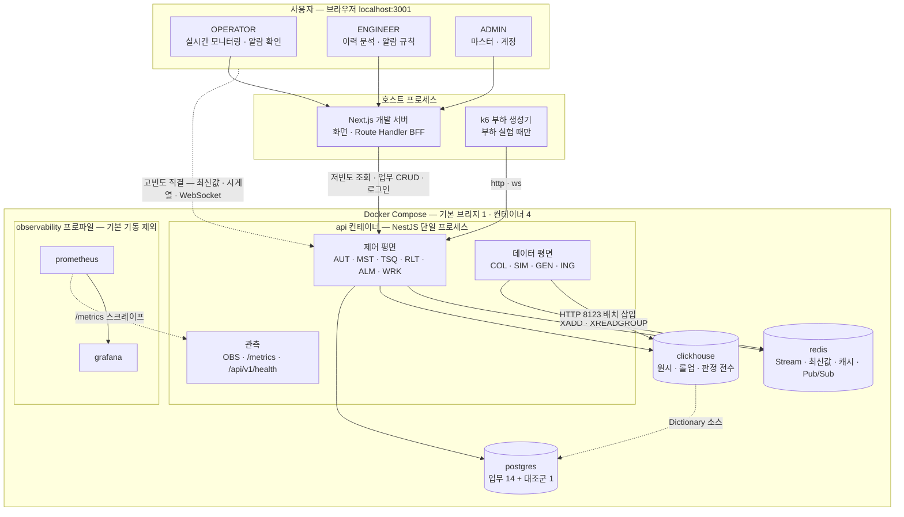

# 시스템 아키텍처

> **대상**: db_study 전체 구조 — 조감도 · 시스템 컨텍스트 · 경계별 프로토콜 · 컨테이너 4 · 모듈 배치 요약 · **아키텍처 불변식 표** · 범위 경계
> **작성일**: 2026-09-24
> **원천**: 원본 architecture.md §1 · §2 · §3 · §4 · §11.2 · §14 · §18(커밋 ff66a37) · 원본 tech_stack.md §1 · §2 · §3.3 · §4.1 · §10.1 · §10.4(커밋 ff66a37) · 원본 data_flow.md §2 · §7.2(커밋 ff66a37) · D-01 · D-02 · D-04 · D-06 · ADR-01 · ADR-02 · ADR-06 · ADR-07 · ADR-08 · ADR-18 · ADR-20 · [../README.md](../README.md) 고정 기준 · 전역 불변식 · [../03_requirements/01_global_rules.md](../03_requirements/01_global_rules.md)

db_study는 **로컬 머신 1대**에서 도는 학습 시스템이다. Next.js 웹이 호스트 프로세스로 돌고, NestJS 단일 애플리케이션(api 컨테이너)이 제어 평면과 데이터 평면 모듈을 한 프로세스에 담으며, PostgreSQL 18 · ClickHouse 25.8 · Redis 8이 각자 컨테이너로 선다(D-02 · ADR-01). 스택의 정확 버전은 [../09_tech_stack](../09_tech_stack/README.md)이 갖고 이 문서는 구조만 담는다.

이 구조의 성격은 두 문장이다. **모듈은 한 프로세스에 있어도 호출 스택이 아니라 Redis 경계로 이어진다**(ADR-06 · ADR-07). **데이터는 성격을 보고 목적지를 고르며, 목적지를 고르지 않는 것도 판정이다**(D-04 · 정책 정본 [04_storage_split.md](./04_storage_split.md)). 전자가 확장 로드맵 1단계를 코드 변경 없는 기동 변경으로 만들고, 후자가 학습 목표 ②를 구조로 드러낸다.

이 문서는 구조가 **무엇을 참으로 만드는가**를 아키텍처 불변식 표 하나로 고정한다. 각 불변식은 전역 계약 REQ-GLB-NN과 대응하며, 계약이 "무엇이 참이어야 하는가"라면 불변식 행은 "어느 구조 요소가 그것을 참으로 만드는가"다.

## 시스템 조감도

사용자 셋 · 호스트 프로세스 둘 · 컨테이너 넷 · 선택 프로파일 하나의 연결을 한 장에 그린다.

- **점선 하나가 BFF를 건너뛴다.** 고빈도 요청(최신값 폴링 · 시계열 조회 · WebSocket)은 브라우저가 api에 직결한다 — 중계 1홉을 더할 이유가 없다(ADR-02).
- **웹은 컨테이너가 아니다.** HMR이 컨테이너 안에서 느리고 불안정해 호스트 프로세스로 띄운다. 컨테이너 수 4에 웹은 들지 않는다(루트 README 고정 기준 실행 구성).
- **데이터 평면은 컨테이너가 아니라 모듈이다.** 컨테이너 경계가 없는 대신 모듈 경계가 Redis Stream이다 — 세부 규칙은 [02_module_boundaries.md](./02_module_boundaries.md).
- **ClickHouse → PostgreSQL 점선은 Dictionary 소스다.** 두 DB를 트랜잭션으로 묶지 않고 해석 메타만 조회 시점에 당긴다(ADR-16).

## 시스템 컨텍스트

시스템 밖과 안의 경계를 가른다. 원격 사용자 · 외부 망 · 외부 서비스는 없다(D-02).

| 행위자 | 위치 | 들어오는 경로 | 이 시스템에서 하는 일 | 경계 밖에 남는 것 |
|------|------|------|------|------|
| OPERATOR · ENGINEER · ADMIN | 같은 머신의 브라우저 | localhost:3001(웹) · 127.0.0.1:3000(직결) | 역할별 화면 사용 — 정본 [../02_features/12_permission_matrix.md](../02_features/12_permission_matrix.md) | 원격 접속 · 다중 사용자 동시 운영 |
| 실험 수행자 | 같은 머신의 셸 | docker compose · task · k6 · psql · clickhouse-client · redis-cli | 기동 · 스냅샷 · 부하 주입 · 직접 조회 — **역할이 아니라 머신 접근이다** | 없음 — 머신 접근 자체가 전 권한이다 |
| k6 | 호스트 프로세스 | 127.0.0.1:3000 | 조회 · 쓰기 · WebSocket 부하 | 부하 생성기 격리(같은 CPU) — [../10_observability/07_measurement_limits.md](../10_observability/07_measurement_limits.md) |
| PLC 장비 | 현장 | 현재 **미연결** | 해당 없음 — PlcSim이 대신 Modbus TCP 서버가 된다 | 실장비 연결은 범위 밖 |
| 관측 스택 | 선택 프로파일 컨테이너 | /metrics 스크레이프 | 저장 · 시각화 · 알림 | 기본 기동에서 제외 — 측정 대상과 CPU를 다투지 않게 한다(ADR-20) |

- 검산: 행위자 = **5**
- **외부에서 도달할 수 없다는 사실이 인가 · 입력 검증을 생략할 이유가 되지 않는다.** 같은 머신의 잘못된 스크립트 하나가 원시 1년치 조회로 ClickHouse를 마비시킬 수 있다(REQ-GLB-19).

## 경계별 프로토콜

| # | 경계 | 프로토콜 | 경로가 존재하는 이유 | 없애거나 바꾸면 |
|------|------|------|------|------|
| 1 | 브라우저 → Next.js | http | 화면 렌더링 · 정적 자산 · 개발 서버 HMR | 해당 없음 — 화면의 유일한 진입점이다 |
| 2 | Next.js Route Handler → api | http | 저빈도 업무 조회의 BFF 프록시. **httpOnly 리프레시 쿠키를 서버에서만 다루는 것이 이 경로가 존재하는 가장 중요한 이유다** | BFF를 빼면 리프레시 토큰이 브라우저 JS에 노출되거나 쿠키 교환 자리가 사라진다 |
| 3 | Next.js 서버 측 fetch → api | http | RSC · Route Handler의 서버 fetch. 서버 fetch 캐시로 짧게 흡수한다(현행 참고 revalidate 30초 · 무효화 체인 ④단 — ADR-12) | 무효화 체인에서 빠지면 마스터 수정이 캐시 수명만큼 늦게 보인다 |
| 4 | 브라우저 → api 직결 | http · ws | **고빈도 실시간 데이터는 BFF를 경유하지 않는다** — 최신값 폴링 · 시계열 조회 · WebSocket | BFF를 끼우면 고빈도 요청마다 1홉과 Node 이벤트 루프 하나를 더 다툰다 |
| 5 | api → PostgreSQL | PostgreSQL 와이어 · in-process 풀 | 커넥션 주체를 api 하나로 모은다(ADR-19) | 다중 주체가 각자 풀을 들면 커넥션 폭발 조건이 생긴다 |
| 6 | api → ClickHouse | **HTTP 8123만** | 앱 클라이언트가 HTTP 전용이다. 9000은 CLI · 벤치마크, 9363은 메트릭 전용 | 앱이 9000을 쓰면 커넥션 수를 해석할 때 사람과 앱을 가를 수 없다 |
| 7 | api → Redis | RESP · 단일 인스턴스 | Stream · 최신값 · 캐시 · Pub/Sub · 세션을 한 인스턴스에 둔다(ADR-05) | 해당 없음 — 키 계열이 생존 정책을 가른다 |
| 8 | ClickHouse → PostgreSQL | Dictionary 소스 · 전용 읽기 계정 | 태그 메타를 조회 시점에 붙인다(ADR-16) | 태그명을 매 행 저장하면 이름 변경이 과거 행 수정이 된다 |
| 9 | Collector → PlcSim | Modbus TCP · 컨테이너 루프백 | 같은 프로세스여도 Modbus 계층을 생략하지 않는다 — 모드 A E2E 지연에 Modbus가 들어간다 | 모드 A가 Stream 직결과 다를 것이 없어진다 |
| 10 | 웹 → DB 직접 접속 | **금지** | 커넥션 관리를 api 한 곳으로 모으고 인가 검사를 우회하는 경로를 만들지 않는다 | 인가 없는 두 번째 쓰기 경로가 생기고 커넥션 주체가 둘이 된다 |

- 검산: 경계 = **10** — 허용 9 + 금지 1
- **BFF와 직결을 가르는 기준은 빈도와 쿠키다.** 쿠키가 필요한 요청(로그인 · 갱신)과 저빈도 조회는 BFF, 고빈도 조회와 장기 연결은 직결이다. 요청 종류별 배정의 정본은 [../07_api/01_conventions.md](../07_api/01_conventions.md)다(ADR-02).
- 직결 경로의 보호는 CORS 허용 오리진 하나 · Bearer 액세스 토큰 · WebSocket Origin 검증이다. 방어 지점의 정본은 [../12_security/03_api_surface_defense.md](../12_security/03_api_surface_defense.md)다.

## 컨테이너 4

| 서비스 | 역할 | 담는 것 | 호스트 publish | 쓰는 named volume |
|------|------|------|------|------|
| api | 애플리케이션 1 | NestJS 단일 프로세스 — 제어 평면 6 · 데이터 평면 4 · 관측 1 모듈 · PlcSim 루프백 포트 대역 | 127.0.0.1:3000 | spooldata |
| postgres | 저장소 — OLTP | 업무 테이블 14 · 대조군 1 | 127.0.0.1:5432 | pgdata |
| clickhouse | 저장소 — OLAP | 테이블 5 · MV 3 · Dictionary 1 | 127.0.0.1:8123 · 9000 · 9363 | chdata |
| redis | 저장소 — 중간 계층 | Stream 버퍼 · 최신값 · 알람 상태 · 캐시 · 세션 · Pub/Sub | 127.0.0.1:6379 | redisdata |

- 검산: 애플리케이션 1 + 저장소 3 = **4** · 모듈 제어 6 + 데이터 4 + 관측 1 = **11**
- **컨테이너가 넷인 대가는 단일 실패점이다.** api가 멈추면 조회 · 수집 · 적재 · 판정이 함께 멈추고 PlcSim까지 멈춰 결측 구간이 남는다. 이것이 확장 로드맵 1단계의 가장 직접적인 진입 근거다 — [06_backpressure_failure.md](./06_backpressure_failure.md) · [08_scaling_roadmap.md](./08_scaling_roadmap.md).
- Compose 구성 · healthcheck · 기동 순서 · 메모리 상한 · cpuset의 정본은 [03_execution_topology.md](./03_execution_topology.md)다.

## 모듈 배치 요약

모듈 11개가 api 프로세스 안에서 어느 경계로 이어지는지 요약한다. 경계 원칙 · 예외 근거 · APP_ROLE 배정의 정본은 [02_module_boundaries.md](./02_module_boundaries.md), 도메인 ↔ 모듈 매핑의 정본은 [../01_overview/04_domain_map.md](../01_overview/04_domain_map.md)다.

| 평면 | 모듈 | 들어오는 경계 | 나가는 경계 | 하지 않는 일 |
|------|------|------|------|------|
| 데이터 | collector · plc-sim · datagen | Modbus 소켓(SIM → COL) · 프로세스 안 레지스터 갱신(GEN → SIM) | Stream stream:plc:raw | DB 직접 쓰기 · Ingest 호출 |
| 데이터 | ingest | Stream(컨슈머 그룹) | ClickHouse 배치 삽입 · 최신값 Hash · Pub/Sub · 알람 판정 직접 호출(유일한 예외) | 비즈니스 규칙 판정 |
| 제어 | auth · master · work-orders | HTTP(BFF 경유) | PostgreSQL 트랜잭션 · 캐시 무효화 체인 | Stream 발행 — ③계층은 Stream을 타지 않는다 |
| 제어 | timeseries · realtime · alarms | HTTP · WebSocket(직결) · Pub/Sub 구독 | ClickHouse 조회 · Redis 조회 | 수집 경로 참여(알람 판정만 ingest 후처리로 돈다) |
| 관측 | metrics | 전 모듈의 카운터 · 세 저장소의 통계 | /metrics · /api/v1/health | 메트릭 저장 · 시각화 · 스위치 전환 |

- 검산: 모듈 3 + 1 + 3 + 3 + 1 = **11**
- **평면은 코드의 관심사로, 실행 위치는 호출 경로로 가른다.** 알람 판정은 제어 평면 모듈이지만 ingest 배치의 후처리로 데이터 경로에서 돈다 — 이 어긋남이 경계 예외의 근거다(ADR-11).

## 아키텍처 불변식

구조가 강제하는 규칙이다. 한 행은 불변식 · 그것을 참으로 만드는 구조 요소 · 깨지면 생기는 구체적 실패 · 대응 계약 · 결정을 함께 담는다. 대응 REQ-GLB가 없는 행은 "구조 전용"으로 적는다 — 계약이 아니라 계약을 강제하는 수단 자체가 불변식인 경우다.

| # | 불변식 | 강제하는 구조 요소 | 깨지면 | 대응 계약 | 결정 |
|------|------|------|------|------|------|
| 1 | 수집과 적재 사이에 Stream이 있다 — 같은 프로세스여도 | COL은 Ingest · ClickHouse 클라이언트를 의존하지 않는다 · 발행은 봉인 계열 래퍼로만 | ClickHouse 삽입 지연이 Modbus 폴링 주기로 역류하고, 재시작 시 미처리 배치가 사라진다 | REQ-GLB-03 | ADR-06 |
| 2 | Stream 경계를 건너는 경로는 둘뿐이다 — SW-01 off · 알람 판정 직접 호출 | 모듈 간 import 그래프의 경계 횡단 = ING → ALM 1 · SW-01 off는 부팅 경고 | 예외가 사례별 판단으로 늘어 역할 분리 때 끊기는 호출을 사전에 셀 수 없다 | REQ-GLB-04 | ADR-06 · ADR-11 |
| 3 | 실시간 팬아웃은 Pub/Sub을 지난다 — 발행자와 게이트웨이가 같은 프로세스여도 | ch:rt · ch:alarm 발행 · 게이트웨이 구독 | api 다중 인스턴스에서 팬아웃 코드를 새로 써야 한다 | 구조 전용 | ADR-07 |
| 4 | 스위치는 DI 포트의 구현 교체다 — 경로 안 분기가 없다 | 포트 하나 · 구현 둘 · 모듈 초기화 때 선택 | 분기가 측정 대상 코드에 섞여 비교가 오염되고 스위치 수만큼 경로가 조합 폭발한다 | 구조 전용 — REQ-GLB-16이 계측을 요구 | ADR-08 |
| 5 | XACK은 삽입 성공 뒤에만 · 격리 뒤에는 반드시 | Ingest 배치 상태 머신 | 삽입 전 XACK은 조용한 유실, 격리 뒤 XACK 누락은 영구 랙 | REQ-GLB-05 | ADR-09 · ADR-14 |
| 6 | 배치 토큰은 배치 내용에 결정적이다 | 단일 flusher가 토큰을 만든다 | 재시작 뒤 같은 배치가 다른 토큰을 받아 중복 행이 롤업을 부풀린다 | REQ-GLB-06 | ADR-14 · ADR-09 |
| 7 | 키 접두가 생존 정책의 경계다 · 실패 전략은 계열마다 정반대다 | 캐시 래퍼(TTL 필수 · 타임아웃 degrade) · 봉인 래퍼(TTL 명령 비노출 · 실패 전파) | Stream 엔트리 · 알람 상태가 축출되거나, 캐시 장애가 조회 실패가 된다 | REQ-GLB-08 · 09 | ADR-05 · ADR-13 |
| 8 | 버퍼가 차면 실패시키고 계측한다 — 1차 신호는 발행자의 적체 검사 | 발행 경로 셋(Collector · 모드 B · 모드 C)의 길이 검사 · MAXLEN은 최후 안전장치 | 트리밍이 오류 없이 미소비 엔트리를 잘라 틀린 처리량 수치를 얻는다 | REQ-GLB-10 | ADR-21 |
| 9 | 업무는 PostgreSQL · 시계열은 ClickHouse · 중복 저장 예외는 최신값 하나 | 분기 3계층 · 대조군은 SW-09 on에서만 | 두 곳의 값이 갈라질 때 진실을 정할 수 없다 | REQ-GLB-11 | ADR-03 · ADR-17 |
| 10 | 분기는 성격 판정이다 · 업무 쓰기는 Stream을 타지 않는다 | 제어 평면 쓰기 모듈이 Stream 발행 수단을 갖지 않는다 | read-your-writes가 깨지고 재시도가 트랜잭션 밖에서 중복을 만든다 | REQ-GLB-12 · 13 | ADR-11 · D-04 |
| 11 | 두 DB를 트랜잭션으로 묶지 않는다 | Dictionary 조회 시점 결합 · tag_id 영구 보존 | 한쪽 장애가 다른 쪽 쓰기를 막고, 과거 행의 의미가 조용히 바뀐다 | REQ-GLB-14 | ADR-16 |
| 12 | CPU 바운드 작업은 이벤트 루프 밖에서 돈다 | piscina worker_threads 풀 | 수집 pps에 비례해 조회 p95가 악화된다 | REQ-GLB-20 | ADR-25 |
| 13 | 모듈은 데이터 계약으로만 결합한다 | Stream 페이로드 스키마 버전 v · 공유 패키지의 스키마 하나 | 역할 분리 뒤 두 버전이 공존하는 순간 적체 엔트리가 DLQ로 쏟아진다 | REQ-GLB-21 | ADR-01 |
| 14 | 호스트 포트는 127.0.0.1에만 · PlcSim 포트는 publish하지 않는다 | Compose 포트 표기 | 같은 네트워크의 기기에 DB가 열린다 | REQ-GLB-19 | ADR-18 |
| 15 | 계측 창구는 프로세스당 /metrics 하나다 | OBS 모듈의 통합 노출 · exporter 컨테이너 없음 | 창구가 흩어져 한 실험의 수치를 한 시점으로 모을 수 없다 | REQ-GLB-16 | ADR-20 |
| 16 | 분리는 실측 뒤에만 한다 | 확장 단계마다 실측 진입 조건 | 무엇이 병목이었는지 배우지 못하고 분리 효과를 잴 기준선이 없다 | REQ-GLB-22 | ADR-22 · D-02 |

### 검산

- 불변식 = **16** — REQ-GLB 대응 14 + 구조 전용 2(#3 · #4) = **16**
- 대응에 쓰인 REQ-GLB(중복 제거): 03 · 04 · 05 · 06 · 08 · 09 · 10 · 11 · 12 · 13 · 14 · 16 · 19 · 20 · 21 · 22 = **16**. 불변식 표에 걸리지 않은 REQ-GLB는 01 · 02 · 07 · 15 · 17 · 18 · 23 = **7** — 시각 의미론 · 순서 무관성 · 부동소수 비교 · 측정 기록 · 생성 데이터 구분 · 실험 초기 상태로, 구조 요소가 아니라 스키마 · 절차 · 설계 전제가 강제한다. 16 + 7 = **23**(REQ-GLB 채번 합과 일치)
- **구조 전용 두 행은 계약이 아니라 수단이 불변식이다.** Pub/Sub 경계와 DI 포트는 "무엇이 참이어야 하는가"가 아니라 "확장 · 비교가 코드 변경 없이 되게 하는 모양"이다. 이 두 행이 깨져도 당장의 기능은 동작한다 — 깨진 사실이 드러나는 것은 역할 분리나 스위치 비교를 시도하는 순간이다.

## 학습 목표를 받치는 구조

학습 목표 2축(D-01)이 구조의 어느 요소에 앉는지 가른다. 목표의 정본은 [../01_overview/01_purpose_learning_goals.md](../01_overview/01_purpose_learning_goals.md)다.

| 축 | 구조 요소 | 비교 방향 | 이 요소가 없으면 |
|------|------|------|------|
| ① 컬럼형 대 RDB | ClickHouse tag_raw와 동형인 PostgreSQL 대조군 · SW-09 동시 적재 | 데이터를 고정하고 저장소를 바꾼다 | 역전 지점을 외부 벤치마크로만 말하게 된다 — 이 머신 · 이 스키마에서 재현되지 않는다 |
| ② 성격별 분기 | Stream 뒤 3계층 분기 · 목적이 다른 세 쓰기 · Stream을 타지 않는 업무 쓰기 | 저장소를 고정하고 경로를 본다 | 분기가 "Stream 뒤의 라우팅"으로 오해되어 ③의 반례가 비고 ②가 dual-write로 읽힌다 |
| 두 축의 손잡이 | 스위치마다 DI 포트 하나 · 구현 둘 | 역할을 하나씩 끄고 켠다 | Redis 기여분을 전후 비교로만 말하게 되어 "코드가 달라져서"가 붙는다 |

- 검산: 행 = **3** — 축 2 + 손잡이 1
- **두 축의 비교 방향은 반대라 한 측정에 섞지 않는다.** 섞으면 대조군 적재 비용이 목표 ②의 처리량에 들어간다(ADR-17).

## 구조 영역별 결정

| 영역 | 결정 | 정본 문서 |
|------|------|------|
| 런타임 · 표면 | ADR-01 · ADR-02 | [02_module_boundaries.md](./02_module_boundaries.md) · [../07_api/01_conventions.md](../07_api/01_conventions.md) |
| 모듈 경계 · 역할 배정 | ADR-06 · ADR-07 · ADR-08 · ADR-11 · ADR-22 · ADR-25 | [02_module_boundaries.md](./02_module_boundaries.md) |
| 실행 구성 | ADR-18 · ADR-19 · ADR-20 | [03_execution_topology.md](./03_execution_topology.md) |
| 저장소 분리 · 분기 정책 | ADR-03 · ADR-05 · ADR-16 · ADR-17 | [04_storage_split.md](./04_storage_split.md) |
| 적재 · 지연 | ADR-04 · ADR-09 · ADR-14 · ADR-15 | [05_latency_budget.md](./05_latency_budget.md) · [../06_pipeline/03_ingest_batch.md](../06_pipeline/03_ingest_batch.md) |
| 백프레셔 · 장애 | ADR-10 · ADR-21 · ADR-23 · ADR-24 | [06_backpressure_failure.md](./06_backpressure_failure.md) |
| 정합성 강제 수단 | ADR-12 · ADR-13 | [../06_pipeline/07_business_crud.md](../06_pipeline/07_business_crud.md) · [../05_data_stores/05_redis_keyspace.md](../05_data_stores/05_redis_keyspace.md) |

- 검산: 2 + 6 + 3 + 4 + 4 + 4 + 2 = **25** = ADR 총수(정본 [09_decision_records.md](./09_decision_records.md) §결정 색인) · 영역이 둘인 ADR 0
- 이 표는 읽는 자리를 안내할 뿐이다 — 분류의 정본은 [09_decision_records.md](./09_decision_records.md) §분류다.

## 범위 경계

| 항목 | 현행 | 범위 밖 서술 방식 |
|------|------|------|
| 실행 위치 | 로컬 머신 1대 | 배포 · 원격 접속 · TLS · 클러스터는 두지 않는다(D-02) |
| 프록시 · 로드 밸런서 | 없음 — CORS · 보안 헤더 · 레이트 리밋 · Origin 검증을 NestJS가 직접 한다 | 확장 2단계에도 로드 밸런서를 두지 않는다 — [08_scaling_roadmap.md](./08_scaling_roadmap.md) |
| 현장 PLC | 미연결 — PlcSim이 대신한다 | 실장비 연결은 설계 범위 밖이다 |
| 관측 스택 | 선택 프로파일 | 상시 기동하지 않는다(ADR-20) |
| 모듈 간 RPC | 없음 — 경계는 Stream · Pub/Sub · Modbus 소켓 | gRPC 등 RPC 계층을 두지 않는다 |

- 검산: 범위 경계 = **5**행

## 관련 문서

- [02_module_boundaries.md](./02_module_boundaries.md) — Stream 경계 원칙 · 경계 예외 · APP_ROLE 배정 · 스위치 포트 확정 표
- [03_execution_topology.md](./03_execution_topology.md) — Compose 구성 · 메모리 프로파일 · cpuset
- [04_storage_split.md](./04_storage_split.md) — 3계층 분기 정책 정본
- [09_decision_records.md](./09_decision_records.md) — ADR 채번 정본
- [../01_overview/04_domain_map.md](../01_overview/04_domain_map.md) — 도메인 ↔ 모듈 ↔ 평면 매핑
- [../03_requirements/01_global_rules.md](../03_requirements/01_global_rules.md) — REQ-GLB 전역 계약
- [../07_api/01_conventions.md](../07_api/01_conventions.md) — BFF · 직결 요청 배정
- [../12_security/05_local_exposure.md](../12_security/05_local_exposure.md) — 127.0.0.1 바인드의 함의
