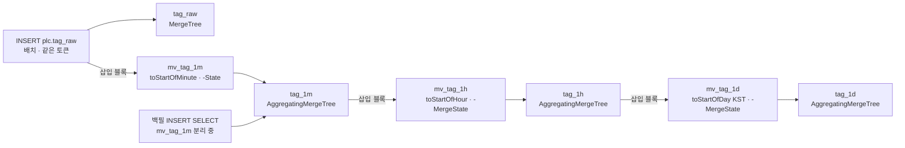

# ClickHouse 롤업 (04_clickhouse_rollup)

> **대상**: 롤업 테이블 tag_1m · tag_1h · tag_1d와 MV 3(mv_tag_1m · mv_tag_1h · mv_tag_1d)의 DDL · -State/-Merge 조합자 · bad_cnt 조건식 · 일 경계 시간대 판정 · MV 제약 · 백필 절차 · 정합 검증 · 롤업 객체 도메인 귀속 판정
> **작성일**: 2026-09-24
> **개정일**: 2026-09-25 — S3 통합 확인 반영 — 백필 ④ 설정에 deduplicate_insert_select 'disable' 병기(26.8에서 insert_deduplicate를 대체 · 앞 설정만 주면 무시)
> **개정일**: 2026-09-24 — ClickHouse 26.8 LTS 전환(사용자 결정 · 25.x 보안 지원 종료) — 롤업 윈도우 근거에 26.8(기록 004) · 백필 ④의 insert_deduplicate 0 근거를 버전 종속으로 교정(25.8 버림 · 26.8 버리지 않음)
> **개정일**: 2026-09-24 — S0 실측 반영(EXP-32 · 기록 001) — ADR-14 보강(사용자 결정) — 롤업 3테이블 DDL에 non_replicated_deduplication_window 1000 신설 · MV 제약 #8 대응 미확인 → 한 쌍 설정 · 미확인 표 1행 닫힘 · 백필 ④에 insert_deduplicate 0(롤업 윈도우가 같은 내용 재삽입을 버림 — 실측)
> **개정일**: 2026-09-24 — 최종 정밀 검수 — 빈 표 칸을 닫힌 어휘 해당 없음으로 채움(표 열 규약) · 롤업 귀속 README 반영 대기 표기 → 반영 완료
> **개정일**: 2026-09-24 — W7 검수 반영 — 미확인 1행 닫힘(롤업 공백 재계산 절차)
> **원천**: 원본 architecture.md §7.2 · §11.1 · §15(커밋 ff66a37) · 원본 data_flow.md §6.1 · §10 · §10.1 · §10.2 · §10.3 · §13 · §17(커밋 ff66a37) · docs_plan.md 웨이브 인계 W3 05_data_stores/04 행 · W3 05_data_stores 행(롤업 · MV 도메인 귀속) · ADR-15 · [../11_glossary/03_enums_state_machines.md](../11_glossary/03_enums_state_machines.md) 품질 코드 · [../11_glossary/05_units_and_time.md](../11_glossary/05_units_and_time.md) 버킷 경계

롤업은 **원시 스캔을 피하려고 삽입 시점에 미리 접어 두는 집계**다. tag_raw 삽입이 MV를 발동하고, MV의 타깃 테이블 삽입이 다음 MV를 발동하는 연쇄로 분 → 시간 → 일 롤업이 별도 배치 잡 없이 완성된다(원본 architecture.md §7.2). 원시를 7일만 보관하고도 장기 추이를 볼 수 있는 이유가 이 계층이다.

**원본에는 tag_1h · tag_1d DDL과 mv_tag_1d 정의가 없다.** 이 문서가 셋을 설계하고, 원본 tag_1m · mv_tag_1m · mv_tag_1h에서 bad_cnt 조건식과 버킷 시간대를 고친다. 조회 해상도 자동 선택(1시간 · 7일 · 90일 경계)은 1계층 구조값이며 정본은 [../11_glossary/03_enums_state_machines.md](../11_glossary/03_enums_state_machines.md) 조회 해상도다. 롤업 흐름(F-08)의 기전은 [../06_pipeline/09_rollup.md](../06_pipeline/09_rollup.md)가 갖는다.

## 롤업 계층

| 계층 | 테이블 | 버킷 함수 | 파티션 | 보존(현행 참고) | 조회 해상도 | 원본 예상 규모(M 티어) |
|------|------|------|------|------|:------:|------|
| 원시 | tag_raw | 없음 | toYYYYMMDD(ts) | 7일 | raw | 60.5억 행 · 약 25 GB |
| 분 | tag_1m | toStartOfMinute(ts) | toYYYYMM(bucket) | 90일 | 1m | 12.9억 행 · 약 12 GB |
| 시간 | tag_1h | toStartOfHour(bucket) | toYYYYMM(bucket) | 730일 | 1h | 1.75억 행 · 약 2 GB |
| 일 | tag_1d | toStartOfDay(bucket, 'Asia/Seoul') | toYear(bucket) | 무기한 | 1d | 연 730만 행 · 약 0.1 GB |

- 검산: 롤업 테이블 = tag_1m · tag_1h · tag_1d = **3** · 원시 포함 계층 **4** = 조회 해상도 4
- **보존 값은 2계층 조정값이며 정본은 [08_retention_lifecycle.md](./08_retention_lifecycle.md)다.** 규모 열은 원본 예상치(압축 후 행당 4바이트 가정)이며 3계층 미확인이다.
- **tag_1d의 파티션을 년으로 둔 이유** — 무기한 보존 테이블을 월로 자르면 파티션 수가 끝없이 늘고, 행 수가 작아(설비 × 태그 × 일) 파티션당 파트가 너무 작아진다.

아래 흐름도는 삽입 한 번이 발동하는 연쇄와 조회 해상도의 대응이다.



- **MV는 테이블이 아니라 삽입 블록을 본다.** 연쇄의 입력은 늘 "방금 들어온 블록"이다 — 기존 행을 다시 읽지 않으므로 과거 데이터는 MV가 채우지 않는다.
- **백필은 mv_tag_1m 하나만 분리한다.** tag_1m에 직접 INSERT SELECT하면 붙어 있는 mv_tag_1h · mv_tag_1d가 그대로 발동해 상위 롤업까지 채운다 — §백필 절차.
- **체이닝 깊이는 3에서 멈춘다.** MV의 MV의 MV를 넘는 단계는 배치 잡으로 옮긴다(원본 data_flow.md §10.2) — 그때가 폐지된 lock:job:rollup의 재도입 조건이다([05_redis_keyspace.md](./05_redis_keyspace.md)).

## tag_1m · mv_tag_1m

원본 DDL에서 **bucket 시간대 · last_v 상태 타입의 시간대 · bad_cnt 조건식 · TTL 파트 삭제** 네 곳을 바꿨다. 아래 DDL은 설계 계약이다.

```sql
CREATE TABLE IF NOT EXISTS plc.tag_1m
(
    bucket    DateTime('Asia/Seoul') CODEC(Delta(4), ZSTD(1)),
    device_id UInt32,
    tag_id    UInt32,
    cnt       AggregateFunction(count),
    avg_v     AggregateFunction(avg, Float64),
    min_v     AggregateFunction(min, Float64),
    max_v     AggregateFunction(max, Float64),
    last_v    AggregateFunction(argMax, Float64, DateTime64(3, 'Asia/Seoul')),
    p95_v     AggregateFunction(quantilesTDigest(0.95), Float64),
    bad_cnt   AggregateFunction(countIf, UInt8)
)
ENGINE = AggregatingMergeTree
PARTITION BY toYYYYMM(bucket)
ORDER BY (device_id, tag_id, bucket)
TTL bucket + INTERVAL 90 DAY DELETE
SETTINGS ttl_only_drop_parts = 1,
         non_replicated_deduplication_window = 1000;

CREATE MATERIALIZED VIEW IF NOT EXISTS plc.mv_tag_1m TO plc.tag_1m AS
SELECT
    toStartOfMinute(ts)                AS bucket,
    device_id,
    tag_id,
    countState()                       AS cnt,
    avgState(value)                    AS avg_v,
    minState(value)                    AS min_v,
    maxState(value)                    AS max_v,
    argMaxState(value, ts)             AS last_v,
    quantilesTDigestState(0.95)(value) AS p95_v,
    countIfState(quality IN (2, 4))    AS bad_cnt
FROM plc.tag_raw
GROUP BY bucket, device_id, tag_id;
```

- **last_v 상태 타입에 ts와 같은 시간대를 적는다.** 상태 타입의 인자 타입은 원천 컬럼 타입과 시간대까지 같아야 MV 삽입이 타입 변환 없이 맞물린다 — 원본은 DateTime64(3)로 적어 원천 ts(Asia/Seoul)와 어긋났다.
- **toStartOfMinute(ts)는 ts의 시간대를 물려받아 DateTime('Asia/Seoul')을 낸다.** 분 경계는 정수 시간 오프셋에서 시간대와 무관하지만, 이 bucket이 월 파티션 · 상위 롤업의 달력 함수 입력이 되므로 시간대가 필요하다.
- **TTL 90일은 하한이다.** ttl_only_drop_parts = 1은 파트 전체가 만료돼야 지우므로 월 파티션의 마지막 날이 90일을 넘길 때 그 달 전체가 떨어진다 — 실제 보존은 최대 한 달 더 길다([08_retention_lifecycle.md](./08_retention_lifecycle.md)).
- **롤업 3테이블에도 중복 제거 윈도우를 둔다(ADR-14 보강 · S0 실측).** 25.8 · 26.8 모두 원시가 토큰으로 중복 제거돼도 종속 MV를 다시 돌린다 — 롤업에 윈도우가 없으면 응답 유실 뒤 같은 토큰 재시도가 세 롤업의 count를 두 배로 만든다(EXP-32 · 기록 001 · 004). 윈도우는 삽입 설정 deduplicate_blocks_in_dependent_materialized_views 1과 한 쌍이며 설정의 정본은 [03_clickhouse_schema.md](./03_clickhouse_schema.md) §서버 설정 계약이다.

## tag_1h · tag_1d · 상위 MV

원본에 없던 세 객체(tag_1h DDL · tag_1d DDL · mv_tag_1d)와 원본 mv_tag_1h다. 상위 롤업은 원시가 아니라 **하위 롤업의 상태를 병합한 상태**를 쌓는다.

```sql
CREATE TABLE IF NOT EXISTS plc.tag_1h AS plc.tag_1m
ENGINE = AggregatingMergeTree
PARTITION BY toYYYYMM(bucket)
ORDER BY (device_id, tag_id, bucket)
TTL bucket + INTERVAL 730 DAY DELETE
SETTINGS ttl_only_drop_parts = 1,
         non_replicated_deduplication_window = 1000;

CREATE TABLE IF NOT EXISTS plc.tag_1d AS plc.tag_1m
ENGINE = AggregatingMergeTree
PARTITION BY toYear(bucket)
ORDER BY (device_id, tag_id, bucket)
SETTINGS non_replicated_deduplication_window = 1000;

CREATE MATERIALIZED VIEW IF NOT EXISTS plc.mv_tag_1h TO plc.tag_1h AS
SELECT toStartOfHour(bucket) AS bucket, device_id, tag_id,
       countMergeState(cnt) AS cnt, avgMergeState(avg_v) AS avg_v,
       minMergeState(min_v) AS min_v, maxMergeState(max_v) AS max_v,
       argMaxMergeState(last_v) AS last_v,
       quantilesTDigestMergeState(0.95)(p95_v) AS p95_v,
       countIfMergeState(bad_cnt) AS bad_cnt
FROM plc.tag_1m
GROUP BY bucket, device_id, tag_id;

CREATE MATERIALIZED VIEW IF NOT EXISTS plc.mv_tag_1d TO plc.tag_1d AS
SELECT toStartOfDay(bucket, 'Asia/Seoul') AS bucket, device_id, tag_id,
       countMergeState(cnt) AS cnt, avgMergeState(avg_v) AS avg_v,
       minMergeState(min_v) AS min_v, maxMergeState(max_v) AS max_v,
       argMaxMergeState(last_v) AS last_v,
       quantilesTDigestMergeState(0.95)(p95_v) AS p95_v,
       countIfMergeState(bad_cnt) AS bad_cnt
FROM plc.tag_1h
GROUP BY bucket, device_id, tag_id;
```

- **세 롤업 테이블은 컬럼 구조가 같다(AS plc.tag_1m).** 같은 구조라야 조회 코드가 해상도만 바꿔 같은 -Merge 쿼리를 쓴다. 한 테이블만 컬럼을 더하면 해상도 자동 선택이 컬럼 유무에 따라 깨진다.
- **mv_tag_1d가 시간대 인자를 명시한다.** bucket이 이미 Asia/Seoul이라 결과는 같지만, 일 경계는 시간대마다 다른 유일한 버킷이라 정의만 읽고 KST 자정임을 알 수 있게 한다 — §일 경계 시간대 판정.
- **tag_1d에는 TTL이 없다.** 무기한 보존이며 삭제는 수동 파티션 DROP뿐이다([08_retention_lifecycle.md](./08_retention_lifecycle.md)).

## 집계 컬럼과 조합자

-State는 부분 상태를 만들고, -MergeState는 부분 상태를 합친 상태를 만들고, -Merge는 상태를 최종 값으로 푼다. **조회는 반드시 -Merge + GROUP BY다** — AggregatingMergeTree는 머지 전까지 같은 키의 행이 파트마다 따로 있다.

| 컬럼 | tag_1m 상태(원시에서) | 상위 병합 상태 | 조회 병합 | 원시 대비 정확성 |
|------|------|------|------|------|
| cnt | countState() | countMergeState | countMerge | **정확 일치** — 어긋나면 적재 누락 · 중복 |
| avg_v | avgState(value) | avgMergeState | avgMerge | 허용 오차 — 상계식 2·γ(n)·S/n |
| min_v · max_v | minState · maxState | minMergeState · maxMergeState | minMerge · maxMerge | 정확 일치 |
| last_v | argMaxState(value, ts) | argMaxMergeState | argMaxMerge | 정확 일치 — 같은 ts가 둘이면 미정 |
| p95_v | quantilesTDigestState(0.95)(value) | quantilesTDigestMergeState(0.95) | quantilesTDigestMerge(0.95) — 배열 첫 원소 | **근사** — 허용 범위 미확인 |
| bad_cnt | countIfState(quality IN (2, 4)) | countIfMergeState | countIfMerge | 정확 일치 |

- 검산: 집계 컬럼 = cnt · avg_v · min_v · max_v · last_v · p95_v · bad_cnt = **7**(min · max를 한 행으로 셈 · 표 6행)
- 비교 규칙의 정본은 [../11_glossary/05_units_and_time.md](../11_glossary/05_units_and_time.md) §부동소수와 오차 허용 비교 · [../03_requirements/14_acceptance_criteria.md](../03_requirements/14_acceptance_criteria.md)다. avg 상계식의 기호(γ(n) · S)도 그 정본을 따른다.
- **p95는 복수형 quantiles 상태라 배열을 낸다.** 조회는 quantilesTDigestMerge(0.95)(p95_v)[1]이다. 원본 선택을 유지한다 — 분위수를 더하려면 상태 타입이 바뀌어 세 테이블과 세 MV를 함께 다시 만들어야 하므로 지금 단수형으로 바꿀 이득이 없다.

## bad_cnt 조건식 판정

웨이브 인계 "bad_cnt 조건식(판정: 2 · 4만 센다)"을 닫는다. 원본 mv_tag_1m은 countIfState(quality > 0)였다.

| 품질 코드 | 원본 quality > 0 | **판정 quality IN (2, 4)** | 이유 |
|------|:------:|:------:|------|
| 0 GOOD | 제외 | 제외 | 해당 없음 |
| 1 UNCERTAIN | 셈 | **제외** | 추정값이지 불량이 아니다 — 부여 주체도 미확인 |
| 2 BAD_COMM | 셈 | 셈 | 저장되는 BAD |
| 3 BAD_TIMEOUT | 해당 없음 | 해당 없음 | tag_raw에 저장하지 않는다 — 결측으로 처리 |
| 4 BAD_RANGE | 셈 | 셈 | 저장되는 BAD |
| 5 STALE | 해당 없음 | 해당 없음 | 조회 시점 판정 — 저장 경로가 쓰지 않는다 |
| 9 SIMULATED | 셈 | **제외** | 출처 표지다. 생성 데이터만 있는 이 시스템에서 세면 bad_cnt = cnt가 되어 지표가 무의미하다 |

- 검산: 품질 코드 = **7** · 판정 셈 2(2 · 4) + 제외 3(0 · 1 · 9) + 저장 안 됨 2(3 · 5) = **7**
- **bad_cnt는 "저장된 BAD 행 수"이지 "통신 불량 시간"이 아니다(A형).** 통념은 "bad_cnt가 0이면 통신이 멀쩡했다"이다. 그러나 BAD_TIMEOUT(3)은 행을 남기지 않으므로 타임아웃 구간은 bad_cnt가 아니라 cnt의 감소로 드러난다. 진짜 축은 기대 행 수(태그 주기 × 버킷 폭) 대비 cnt다. 대체 경로 — 결측 비율은 1 − cnt ÷ 기대 행 수로 조회 시점에 계산한다.
- **UNCERTAIN의 가중치는 구현하지 않는다(판정).** 원본 "집계에서 가중치를 낮춘다"(원본 data_flow.md §3.2)는 avgState(value)에 반영된 적이 없고 1을 부여하는 주체도 없다. 가중 평균을 넣으면 상태 타입이 바뀌어 세 롤업을 다시 만들어야 한다 — 부여 주체가 생기는 시점([../06_pipeline/02_collect.md](../06_pipeline/02_collect.md) W4)에 다시 판정한다. 확정 전 롤업 avg는 UNCERTAIN을 GOOD과 같은 무게로 센다.

## 일 경계 시간대 판정

웨이브 인계 "일 경계 시간대 · tag_1m · alarm_eval 파티션 시간대"를 닫는다. **판정: 달력 경계(일 · 월 · 년)는 전부 Asia/Seoul이다.** 저장값(epoch)은 바뀌지 않고 "어느 순간에서 버킷 · 파티션이 갈리는가"만 정한다.

| 대상 | 함수 | 원본 기준 시간대 | 판정 | 판정이 없을 때의 실패 |
|------|------|------|------|------|
| tag_1d 버킷 | toStartOfDay(bucket, 'Asia/Seoul') | 정의 없음 | **KST 자정** | UTC 자정이면 일별 생산 추이 화면의 하루가 오전 9시에 시작한다 |
| tag_1m 월 파티션 | toYYYYMM(bucket) | 서버 시간대 | KST 월 | 서버가 UTC면 월 파티션이 KST 1일 09:00에 넘어가 TTL 경계가 화면의 달과 어긋난다 |
| tag_1h 월 파티션 | toYYYYMM(bucket) | 정의 없음 | KST 월 | 상동 |
| tag_1d 년 파티션 | toYear(bucket) | 정의 없음 | KST 년 | 1월 1일 00:00~09:00 KST 행이 전년 파티션에 들어간다 |
| alarm_eval 일 파티션 | toYYYYMMDD(ts) | 서버 시간대 | KST 날짜 | 원시와 판정 전수가 서로 다른 날짜로 잘려 같은 날 비교가 어긋난다 |
| tag_1m · tag_1h 버킷 | toStartOfMinute · toStartOfHour | 무관 | 무관 — Asia/Seoul은 +09:00 정수 시간 | 없음 |

- 검산: 대상 = **6** · 시간대에 따라 경계가 움직이는 것 5 + 무관 1
- **강제 수단은 서버 설정이 아니라 컬럼 타입이다.** bucket을 DateTime('Asia/Seoul')로 선언하면 달력 함수가 서버 timezone과 무관하게 KST로 자른다 — 서버 timezone(미확인 · W6)에 스키마가 의존하지 않는다([03_clickhouse_schema.md](./03_clickhouse_schema.md) §시각 컬럼 시간대 표기).
- **1d 캐시 키 스냅도 같은 자정을 써야 한다.** 시계열 조회 캐시가 1d 요청을 UTC 자정으로 내림하면 같은 조회가 두 키로 갈린다 — 스냅 규칙의 정본은 [../11_glossary/05_units_and_time.md](../11_glossary/05_units_and_time.md) · [../06_pipeline/06_timeseries_read.md](../06_pipeline/06_timeseries_read.md)다.

## MV 제약

원본 data_flow.md §10.2의 다섯 제약에 이 설계가 더한 셋이다. 대응 열이 강제 수단이다.

| # | 제약 | 증상 | 대응 |
|:-:|------|------|------|
| 1 | 삽입 블록만 본다 | 과거 데이터를 나중에 넣어도 롤업이 채워지지 않는다 | 백필은 mv_tag_1m 분리 후 INSERT SELECT(§백필 절차) |
| 2 | 원자성 없음 | 원시 삽입은 성공하고 MV 삽입이 실패할 수 있다 | materialized_views_ignore_errors 끔 · 구간 count 대조 · 해당 시간대 재계산 |
| 3 | 늦게 도착한 데이터 | 과거 ts 행이 나중에 오면 그 버킷에 새 부분 상태가 생긴다 | 같은 키로 병합되어 결국 정확해진다 — 조회는 -Merge + GROUP BY라 머지 전에도 정확하다 |
| 4 | ALTER 취약 | 원본 테이블 컬럼 변경 시 MV가 깨진다 | 변경 절차 — MV 분리 → 테이블 변경 → MV 재생성 순번 파일([09_migrations_seed.md](./09_migrations_seed.md)) |
| 5 | 체이닝 깊이 | MV의 MV의 MV는 디버깅이 어렵다 | 3단계까지 · 넘으면 배치 잡 |
| 6 | **상태 타입 일치** | 상태 인자 타입(시간대 포함)이 원천과 다르면 MV 생성 · 삽입이 실패한다 | 세 롤업을 AS plc.tag_1m 한 구조로 · ts 시간대를 상태 타입에 명시 |
| 7 | **보존은 테이블별 독립** | 원시 TTL이 롤업을 지우지 않고 롤업 TTL이 원시를 지우지 않는다 | 의도된 성질 — 원시를 버려도 장기 분석이 남는다. 역으로 원시가 남은 구간의 롤업 재계산은 원시 보존 기간 안에서만 된다 |
| 8 | **중복 제거와 종속 MV** | 원시가 중복 제거돼도 같은 토큰 재시도가 종속 MV를 다시 돌린다(S0 실측) — 빠진 롤업은 메워지지만 이미 쓰인 롤업은 두 배가 된다 | 롤업 3테이블 윈도우 + 종속 MV 중복 제거 설정 한 쌍(ADR-14 보강) — #2의 대조 · 재계산은 DLQ · 설정을 내린 실험의 안전망으로 남는다 |

- 검산: 원본 5(#1~#5) + 신설 3(#6~#8) = **8**
- **#3은 버그가 아니다(B형).** 결론 — 버킷 하나에 여러 부분 상태 행이 있는 것이 정상이다. 반대 시나리오 — 조회가 -Merge 없이 컬럼을 그대로 읽으면 같은 분이 여러 행으로 보여 "중복"으로 신고된다. 파생 지침 — 롤업 조회는 언제나 GROUP BY 버킷 · -Merge다.

## 백필 절차

모드 D(GEN-08)가 과거 구간을 채울 때의 순서다. MV를 붙인 채 백필하면 원시 삽입과 MV 집계가 동시에 일어나 삽입이 느려지고, 중간 실패 시 롤업이 부분만 채워져 정합 판단이 불가능해진다(원본 data_flow.md §10.3).

```plain
① 주입 정지 확인        다른 주입 모드 · 수집이 멈췄는가     분리 중 들어온 행은 롤업되지 않는다
② DETACH mv_tag_1m      mv_tag_1h · mv_tag_1d는 붙여 둔다     상위 연쇄는 ④가 발동한다
③ 원시 대량 삽입        날짜 단위 INSERT · ts는 보존 창 안     보존 창 밖 ts는 TTL 머지에서 곧 사라진다
④ tag_1m 직접 채우기    INSERT SELECT -State FROM tag_raw     백필 구간만 · tag_1h · tag_1d가 연쇄로 채워진다 · insert_deduplicate 0 · deduplicate_insert_select 'disable'
⑤ ATTACH mv_tag_1m      정상 연쇄 복귀
⑥ 정합 검증             count(tag_raw) = countMerge(tag_1m)   = countMerge(tag_1h) = countMerge(tag_1d)
```

- **④는 insert_deduplicate 0 · deduplicate_insert_select 'disable'로 넣는다(S0 실측 · 기록 001 · S3 통합 확인).** 26.8은 deduplicate_insert_select(기본 enable_when_possible)가 insert_deduplicate를 대체해 앞 설정만 주면 무시된다 — 26.8의 INSERT SELECT는 기본값에서도 같은 내용을 버리지 않았지만(S3 확인) 동작이 버전 · 설정 기본값마다 달라 둘 다 명시한다. 롤업 3테이블의 윈도우(ADR-14 보강)는 토큰 없는 삽입을 내용 해시로 가르는데 롤업에는 매번 다른 컬럼(원시의 ingested_at 같은)이 없다 — 25.8에서는 같은 구간을 비운 뒤 다시 채우는 두 번째 삽입이 오류 없이 0행이 됐다(기록 001). 26.8은 버리지 않았지만(기록 004) 동작이 버전마다 달라 절차로 고정한다.

- **분리하는 MV는 mv_tag_1m 하나다.** 원본 절차는 분리 대상을 mv_tag_1m으로만 적었고 이유는 적지 않았다 — ④가 tag_1m에 넣는 삽입이 상위 두 MV를 발동하므로 상위를 분리하면 상위 롤업을 따로 두 번 더 채워야 한다.
- **③의 ts는 원시 보존 창 안이어야 한다(A형).** 통념은 "백필은 먼 과거를 채운다"이다. 그러나 tag_raw TTL은 ts 기준 7일이라 창 밖 ts의 파트는 다음 TTL 머지에서 통째로 떨어지고, 롤업만 남는다. 진짜 축은 ts 기준 보존이다. 대체 경로 — 용량 단계를 채우는 백필은 창 안에서 태그 · 설비 수로 행 수를 늘린다([10_olap_vs_rdb_control.md](./10_olap_vs_rdb_control.md) §역전 지점 탐색 설계).
- **①이 빠지면 조용한 공백이 남는다.** ② ~ ⑤ 사이에 적재된 행은 원시에는 있고 롤업에는 없다. 주입 모드는 한 번에 하나(REQ-GEN-05)라는 규칙이 이 절차의 전제다.
- 날짜 단위로 쪼개는 이유는 한 INSERT가 여러 파티션에 걸칠 때의 서버 한도다([03_clickhouse_schema.md](./03_clickhouse_schema.md)). 실행 주체와 명령의 정본은 [../06_pipeline/10_datagen_inject.md](../06_pipeline/10_datagen_inject.md)다.

## 도메인 귀속 판정

웨이브 인계 "롤업 테이블 · MV 도메인 귀속(잠정 ING)"을 닫는다. 소유의 기준은 **쓰기 표면과 수명 주기를 누가 결정하는가**다.

| 후보 | 롤업과의 관계 | 소유 판정 | 이유 |
|------|------|:------:|------|
| ING | tag_raw 삽입이 연쇄를 발동한다(ING-12) · MV 실패 감지와 재계산이 적재 경로에 있다 | **소유 — 확정** | 롤업의 쓰기는 모두 적재의 부산물이다. 원시 확정 · 롤업 공백 판정 · 재계산이 한 모듈에 있어야 정합 대조(원시 count 대 롤업 countMerge)의 주인이 하나다 |
| TSQ | 해상도를 골라 읽는다 | 소유 아님 | 읽기만 한다 — 읽는 쪽이 DDL을 소유하면 조회 요구가 적재 경로의 스키마를 바꾼다 |
| GEN | 모드 D 백필이 쓴다 | 소유 아님 | 실험 도구의 쓰기다 — 절차만 실행하고 정의는 소유하지 않는다(GEN-08) |

- 검산: 후보 = **3** · 소유 1(ING)
- **도메인 공백은 바뀌지 않는다.** ING는 이미 tag_raw · 대조군을 소유하므로 소유 테이블 없음 도메인은 COL · SIM · GEN · TSQ · RLT · OBS 여섯 그대로다 — 폴더 README와 도메인 지도(01_overview/04)의 귀속 표기도 "ING 확정"으로 맞췄다.

## 정합 검증

| 대조 | 쿼리 모양 | 합격 | 실패가 가리키는 것 |
|------|------|------|------|
| 원시 대 분 | 구간별 count(tag_raw) 대 countMerge(cnt) FROM tag_1m | 정확 일치 | MV 삽입 실패 · 백필 공백 |
| 분 대 시간 · 일 | countMerge 계층 간 | 정확 일치 | 상위 MV 분리 상태 · 체인 실패 |
| avg | avg(value) 대 avgMerge(avg_v) | 상계식 이내 | 병합 순서가 아닌 실제 누락 |
| min · max · last | 원시 대 -Merge | 정확 일치 | 해당 없음 |
| p95 | quantile 계열 대 quantilesTDigestMerge | 근사 허용 범위(미확인) | 해당 없음 |

- 검산: 대조 = **5**
- 대조의 실행 자리는 S3 합격 판정 · 백필 ⑥이며 인수 기준 정본은 [../03_requirements/14_acceptance_criteria.md](../03_requirements/14_acceptance_criteria.md)다.

## 미확인 · 미설계 등재

| 항목 | 상태 | 확정 자리 |
|------|------|------|
| p95 원시 대 롤업 허용 범위 | 3계층 미확인 — 확정 수단은 원시 안 순위 오차 3회 측정(W2 판정) | [../03_requirements/14_acceptance_criteria.md](../03_requirements/14_acceptance_criteria.md) |
| MV 캐스케이드 지연 · MV가 삽입 처리량에 더하는 비용 | 3계층 미확인 — 원본 예상치 MV 캐스케이드 100 ms | [../03_requirements/13_nonfunctional.md](../03_requirements/13_nonfunctional.md) REQ-NFR-04 |
| 중복 제거된 재시도와 종속 MV | **닫힘(S0 실측 · EXP-32 · 기록 001)** — 다시 돈다 · MV 제약 #8 대응으로 막는다 | [../06_pipeline/09_rollup.md](../06_pipeline/09_rollup.md) |
| UNCERTAIN(1) 부여 주체 · 가중치 | 판정 — 가중치 미구현 · 주체 생기면 재판정 | [../06_pipeline/02_collect.md](../06_pipeline/02_collect.md)(W4) |
| 롤업 공백 구간 재계산 명령 | 닫힘 — 빠진 기여분만 넣기 · 버킷 비우고 다시 만들기 두 절차(부분 상태 버킷 이중 계수 방지) — [../06_pipeline/09_rollup.md](../06_pipeline/09_rollup.md) | [../06_pipeline/09_rollup.md](../06_pipeline/09_rollup.md)(W4) |

## 관련 문서

- [03_clickhouse_schema.md](./03_clickhouse_schema.md) — tag_raw · 시각 컬럼 시간대 · 서버 설정
- [08_retention_lifecycle.md](./08_retention_lifecycle.md) — 계층별 보존 정본
- [10_olap_vs_rdb_control.md](./10_olap_vs_rdb_control.md) — 분 단위 롤업 재계산 쿼리(대조군)
- [../06_pipeline/09_rollup.md](../06_pipeline/09_rollup.md) — F-08 롤업 기전
- [../06_pipeline/10_datagen_inject.md](../06_pipeline/10_datagen_inject.md) — 모드 D 백필 실행
- [../11_glossary/05_units_and_time.md](../11_glossary/05_units_and_time.md) — 버킷 경계 · 부동소수 비교
