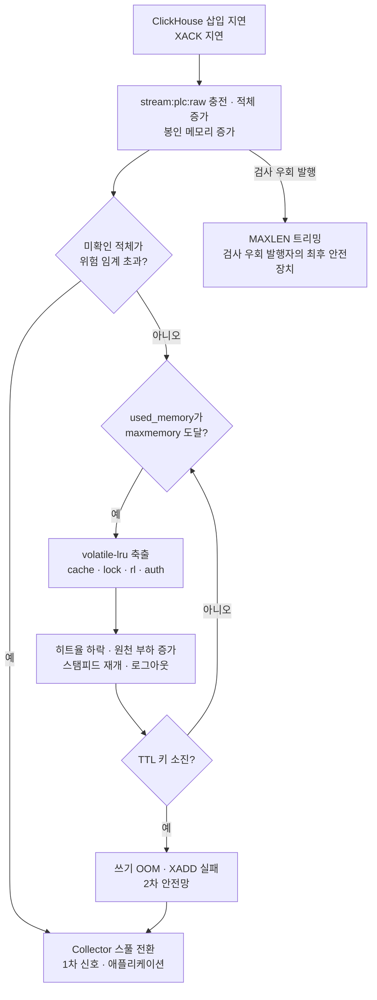

# Redis 메모리 (06_redis_memory)

> **대상**: Redis 단일 인스턴스의 Stream 엔트리 단위 설계 · 엔트리 크기와 용량 티어 · maxmemory 산정 · 프로파일별 산정(부하 실험 · 개발 · 중간) · volatile-lru 축출 대상 · **축출 연쇄** · MAXLEN과 maxmemory의 관계(ADR-21) · 컨테이너 상한 여유 · 메모리 측정 계약 — MAXLEN · maxmemory 조정값 정본
> **작성일**: 2026-09-24
> **개정일**: 2026-09-24 — 최종 정밀 검수 — 합계 행 빈 칸 채움 · 빈 표 칸을 닫힌 어휘 해당 없음으로 · 백프레셔 하강 히스테리시스 행 닫힘(ADR-23)
> **개정일**: 2026-09-24 — W6 실험 채번 반영 — S6 스풀 도달 문구 정정 · Pub/Sub 한도 소유 · EXP 번호(정본 10_observability/01 · 06)
> **원천**: 원본 architecture.md §8 · §8.4 · §9.3 · §13 · §15 · §17 · §19(커밋 ff66a37) · 원본 tech_stack.md §5.3 · §10.2(커밋 ff66a37) · 원본 data_flow.md §12.1 · §14.1(커밋 ff66a37) · 원본 implementation_plan.md §2.1 · §2.3(커밋 ff66a37) · ADR-05 · ADR-21 · [05_redis_keyspace.md](./05_redis_keyspace.md) 키 패턴 · [../04_architecture/06_backpressure_failure.md](../04_architecture/06_backpressure_failure.md) 백프레셔 임계

단일 인스턴스의 메모리는 **봉인 계열(축출 불가)과 캐시 계열(축출 가능)의 합**으로 산정한다. 봉인 계열의 상한을 캐시 예산 바깥에 먼저 떼어 두면 수집이 폭주해도 세션 · 조회 캐시가 밀려나지 않고, 그 상한을 넘기 전에 애플리케이션이 백프레셔를 건다(ADR-21). 이 문서는 그 산정과, 산정이 깨졌을 때 한 인스턴스 안에서 벌어지는 **축출 연쇄**를 고정한다.

**아래 수치는 전부 원본 산정이다.** 엔트리 크기 · 캐시 예산은 원본의 어림값이고 실측 전 3계층 미확인이다. MAXLEN · maxmemory는 2계층 조정값이며 **이 문서가 값의 정본**이다. 백프레셔 임계 · 판정량의 정본은 [../04_architecture/06_backpressure_failure.md](../04_architecture/06_backpressure_failure.md), 컨테이너 메모리 상한의 정본은 [../09_tech_stack/04_local_environment.md](../09_tech_stack/04_local_environment.md)다(현행 인용 [../04_architecture/03_execution_topology.md](../04_architecture/03_execution_topology.md)).

**이 머신에서는 메모리가 먼저 걸린다.** 실측 머신은 CPU 20스레드 · 가용 RAM 15 GB로, 원본이 가정한 "CPU 부족 · 메모리 여유"와 반대다(원본 implementation_plan.md §2.1). 병목이 Redis maxmemory 쪽으로 쏠리므로 이 문서의 산정이 학습 목표 ②의 관찰 자리가 된다.

## 엔트리 단위 설계

Stream 엔트리를 포인트 단위가 아니라 **스캔 사이클 단위**로 만든다 — 설비 1대의 한 스캔 결과가 엔트리 하나다.

| 방식 | 엔트리 수(태그 500) | 엔트리당 크기 | 총 크기 | Redis 오버헤드 |
|------|:------:|------|------|------|
| 포인트 단위 | 500 | 약 120 B(필드 이름 포함) | 약 60 KB | 엔트리마다 필드 이름 · ID 반복 |
| **스캔 사이클 단위(채택)** | **1** | **약 7 KB(MessagePack 컬럼 배열)** | **약 7 KB** | 무시 가능 |

- 검산: 방식 = **2** · 원본 예상치 절감 약 9배(60 KB ÷ 7 KB)
- **Redis Stream은 엔트리마다 필드 이름을 반복 저장한다.** 소량 다필드 엔트리가 가장 비효율적이며, 이 설계 없이는 10만 pps에서 메모리가 수 분 만에 고갈된다(원본 architecture.md §8.4).
- 컬럼 배열(tg · dt · va · q)은 필드 이름을 배열 요소마다 반복하지 않고, 기준값 + 오프셋 인코딩이 시각을 8바이트에서 4바이트로 줄인다([../11_glossary/05_units_and_time.md](../11_glossary/05_units_and_time.md)). 페이로드 계약의 정본은 [../06_pipeline/12_data_contract.md](../06_pipeline/12_data_contract.md)다.

## 엔트리 크기와 용량 티어

**7 KB는 태그 500 설비의 값이다.** 원본 산정(태그 500 · 약 7 KB)에서 태그당 약 14 B를 도출하면 엔트리 크기는 설비당 태그 수에 비례한다. 아래 "도출" 열은 그 비례로 계산한 원본 산정 도출값이며 실측이 아니다.

| 티어 | 설비 × 태그 · 주기 | 엔트리 크기(도출) | 엔트리 발행(원본 산정) | MAXLEN 200000의 메모리(도출) | 소비 정지 시 위험 임계 도달(도출) |
|------|------|------|------|------|------|
| S | 5 × 50 · 1 Hz | 약 0.7 KB | 초당 5 | 약 0.14 GB | 약 10시간(180,000 ÷ 5) |
| M | 50 × 200 · 1 Hz | 약 2.8 KB | 초당 50 | 약 0.56 GB | 약 1시간(180,000 ÷ 50) |
| M+ | 50 × 200 · 10 Hz | 약 2.8 KB | 초당 500 | 약 0.56 GB | 약 6분(180,000 ÷ 500) |
| L | 100 × 500 · 10 Hz | 약 7 KB | 초당 1,000 | 약 1.4 GB | 약 3분(180,000 ÷ 1,000) |

- 검산: 티어 = **4**(S · M · M+ · L) · 용량 티어 정본 [../04_architecture/07_capacity_planning.md](../04_architecture/07_capacity_planning.md)
- **A형 — M 티어에서는 Stream이 1.4 GB에 닿지 않는다.** 통념은 "MAXLEN 200000 = 1.4 GB"이다. 그러나 1.4 GB는 태그 500 엔트리(L 구성)의 값이고, M 티어의 엔트리는 약 2.8 KB라 MAXLEN에 닿아도 약 0.56 GB다. 진짜 축은 엔트리 수가 아니라 **엔트리 수 × 설비당 태그 수**다. 대체 경로 — 축출 연쇄 실험(§축출 연쇄)은 태그 500 설비로 생성하거나 maxmemory를 엔트리 크기에 맞춰 낮춰야 재현된다.
- **마지막 열이 "ClickHouse가 몇 분 멈춰도 되는가"다.** 소비가 멈추면 미확인 적체(그룹 lag + pending)가 발행 속도로 늘고, 위험 임계(현행 180,000 · 부하 실험 프로파일)까지의 시간이 스풀 전환 전 흡수 창이다. S6의 "ClickHouse 5분 중단" 실험은 **L에서만** 스풀 전환까지 간다 — M+는 5분에 150,000(500 × 300)이라 위험 임계 180,000에 닿지 않고 6분이 필요하며, M은 약 1시간이 걸린다(W6 정정). 스풀 경로 관찰은 삽입 지연 유발 실험(EXP-20)이 맡는다.
- **정상 운전에서도 Stream은 MAXLEN까지 찬다.** XACK는 엔트리를 PEL에서 뺄 뿐 Stream에서 지우지 않아, 확인된 엔트리가 트리밍 전까지 남는다(판정 정본 [../04_architecture/06_backpressure_failure.md](../04_architecture/06_backpressure_failure.md) §판정량). 그래서 발행 누적이 MAXLEN에 닿은 뒤(M 티어 약 67분 · 200,000 ÷ 50)로는 Stream 점유 메모리가 **상시 MAXLEN × 엔트리 크기**다 — 이 표의 메모리 열은 최악이 아니라 정상 상태 값이다.

## maxmemory 산정 — 부하 실험 프로파일

두 계열을 합산한다(원본 architecture.md §8.4). **원본 산정에 DLQ 항이 없다** — 이 문서가 더한다.

| 항목 | 산정 | 크기(원본 산정) | 계열 |
|------|------|------|------|
| Stream 본체 | MAXLEN 200000 × 약 7 KB | 약 1.4 GB | 봉인 |
| **DLQ** | **DLQ MAXLEN 10000 × 원 엔트리 약 7 KB** | **약 0.07 GB** | 봉인 — **신설 항** |
| 최신값 · 알람 상태 | rt:latest 태그 수만큼 · alarm:state 규칙 수만큼 | 캐시 예산에 포함(수 MB) | 봉인 |
| 캐시 · 세션 · 락 · 계수 | cache · lock · rl · auth | 약 0.4 GB(최신값 포함) | 캐시 |
| 여유 | 단편화 · 버퍼 | 약 0.2 GB → DLQ 뒤 약 0.13 GB | 없음 |
| **합계 = maxmemory** | 위 다섯 행의 합 | **2.0 GB** | 해당 없음 |

- 검산: 1.4 + 0.07 + 0.4 + 0.13 = **2.0 GB** · 정상 구성 봉인 + 캐시 = 1.4 + 0.07 + 0.4 = 1.87 GB < 2.0 GB → 축출 없음
- **DLQ 항이 없던 이유는 DLQ 엔트리가 배치 통째였기 때문이다.** 배치 하나(최대 수만 행)를 엔트리 하나로 두면 MAXLEN 10000이 수 GB가 되어 산정 자체가 불가능했다 — 원 엔트리 단위 판정([05_redis_keyspace.md](./05_redis_keyspace.md))이 이 항을 닫는다.
- **봉인 계열의 합이 먼저 떼어진다.** 캐시 예산 0.4 GB는 봉인 합 1.47 GB를 뺀 나머지에서 잡혔다 — Stream 상한을 maxmemory 안쪽에 두어 Stream이 캐시 · 세션 예산을 침범하지 않는다(ADR-21). Stream은 정상 운전에서 상한까지 차므로 이 산정은 여유가 아니라 **상시 점유의 산정**이다.

## 프로파일별 산정

메모리 프로파일은 2종(부하 실험 · 개발)이고 중간 프로파일은 조건부 대안이다(루트 고정 기준 실험 축). 컨테이너 상한은 [../09_tech_stack/04_local_environment.md](../09_tech_stack/04_local_environment.md), 백프레셔 임계 현행 값은 [../04_architecture/06_backpressure_failure.md](../04_architecture/06_backpressure_failure.md)가 정본이다.

| 항목 | 부하 실험 | 개발 | 중간(조건부 대안) |
|------|------|------|------|
| 컨테이너 상한 | 2.5 GB | 1.5 GB | 2.0 GB |
| maxmemory | **2.0 GB** | **1.0 GB** | **1.5 GB** |
| Stream MAXLEN | **200000** | **50000** | **150000** |
| Stream 상한 메모리(태그 500 기준) | 약 1.4 GB | 약 0.35 GB | 약 1.05 GB |
| DLQ(원 엔트리 × 10000) | 약 0.07 GB | 상동 | 상동 |
| 캐시 · 세션 · 최신값 예산 | 약 0.4 GB | 약 0.3 GB | 약 0.35 GB |
| 여유 | 약 0.13 GB | 약 0.28 GB | **약 0.03 GB** |
| 위험 임계(스풀 전환 · 참고) | 180,000 | 45,000 | 135,000 |
| 정상 구성에서 축출 | 없음 | 없음 | **태그 500 기준 자연 발생 가능** |
| 수치 비교 대상 | 성능 목표 | **비교 금지** — 파이프라인 연결 확인용 | 목표와 비교 금지 |

- 검산: 프로파일 = **3**(부하 실험 · 개발 + 조건부 중간) · 비율 규칙 — MAXLEN과 백프레셔 임계는 세 프로파일에서 같은 비율(주의 진입 10% · 경고 진입 50% · 위험 진입 90%)이다
- **중간 프로파일은 축출 연쇄가 기본 구성에서 일어난다.** 원본이 "maxmemory를 1.6 GB로 낮춰 강제 유발하는 실험 전용 시나리오"라 부른 연쇄가 이 프로파일에서는 조작 없이 관찰된다(원본 implementation_plan.md §2.3). 원본 산정에 없던 DLQ 항을 넣으면 여유가 약 0.03 GB로 줄어 DLQ가 차는 것만으로도 축출이 시작된다.
- 원본 판단은 WSL2 할당을 올려 부하 실험 프로파일을 쓰는 것이다. 중간 프로파일을 채택하면 이 표의 값을 컨테이너 상한 정본에 정식 프로파일로 올린다.

## volatile-lru와 축출 대상

maxmemory-policy는 **volatile-lru**다(ADR-05). TTL이 있는 키 가운데 최근 사용이 오래된 것부터 표본 추출로 밀어낸다. 축출된 키가 어떤 증상을 내는지가 계열마다 다르다.

| 키 | 축출 후보 | 축출되면 | 복구 경로 | 누가 먼저 알아채나 |
|------|:------:|------|------|------|
| stream:plc:raw · dlq | 아니다 | 해당 없음 | 해당 없음 | 해당 없음 |
| rt:latest · alarm:state | 아니다 | 해당 없음 | 해당 없음 | 해당 없음 |
| cache:q | 후보 | 조회 캐시 미스 → ClickHouse 집계 증가 | 다음 조회가 다시 채움 | 조회 p95 · 히트율 |
| cache:tagmeta · devlist · alarmrules · perm | 후보 | PostgreSQL 조회 증가 | 다음 조회가 다시 채움 | pg_stat_statements 호출 수 |
| cache:alarmevents · workorders | 후보 | 목록 조회가 PostgreSQL로 | 상동 | 상동 |
| lock:rebuild:* | 후보 | **락이 풀려 스탬피드가 다시 열린다** | 없음 — 만료와 같다 | ClickHouse 동일 쿼리 동시 수 |
| rl:* | 후보 | **계수가 0부터 다시 센다 — 레이트 리밋이 느슨해진다** | 다음 분 창 | 레이트 리밋 거절 계수의 급감 |
| auth:refresh:* | 후보 | **사용자가 로그아웃된다** — 원천이 없다 | 재로그인 | 사용자 |

- 검산: 행 = **8** · 축출 후보 아님 2행(봉인 4 패턴) + 후보 6행(캐시 11 패턴)
- **B형 — 사용자가 로그아웃되는 것이 Stream 적체의 증상일 수 있다.** 결론 — auth:refresh는 TTL 키라 메모리 압박에서 밀려난다. 반대 시나리오 — MAXLEN을 maxmemory보다 먼저 걸리게 산정하지 않으면 수집 폭주가 전원을 로그아웃시킨다. 파생 지침 — 로그아웃 신고가 들어오면 evicted_keys와 Stream 점유 메모리를 먼저 본다([../02_features/01_auth.md](../02_features/01_auth.md)).
- **rl 축출은 보안 잔여다.** 메모리 압박 중에는 레이트 리밋이 약해진다 — 로컬 전용이라 외부 공격 경로는 없지만, 부하 실험에서 "레이트 리밋이 동작했다"는 측정이 메모리 상태에 따라 달라진다([../12_security/03_api_surface_defense.md](../12_security/03_api_surface_defense.md)).

## 축출 연쇄

정상 구성에서는 일어나지 않는다. maxmemory를 낮추거나(부하 실험 프로파일 1.6 GB) 중간 프로파일을 쓰면 한 인스턴스 안에서 **수집 적체가 조회 성능 저하로 번지는 연쇄**가 관찰된다 — 인스턴스를 나눴다면 볼 수 없는 연쇄다(원본 architecture.md §8.4).

- **정상 구성에서는 E가 참이 되지 않는다.** Stream이 MAXLEN까지 차도 봉인 + 캐시 합이 maxmemory 안쪽이고, 적체는 발행자의 적체 검사(C)가 먼저 막는다(ADR-21). C의 판정량은 XLEN이 아니라 **미확인 적체(그룹 lag + pending)**다 — XLEN은 정상 운전에서도 MAXLEN 근처라 판정량이 되지 못한다(정본 [../04_architecture/06_backpressure_failure.md](../04_architecture/06_backpressure_failure.md)). E가 참이 되는 것은 캐시가 예산을 넘어 팽창했거나 maxmemory를 낮춘 실험뿐이다.
- **G의 증상 순서가 선행 지표다.** 조회 지연 상승 · 히트율 하락이 수집 적체보다 먼저 화면에 드러난다. 운영 중 히트율과 **Stream 점유 메모리**의 역상관이 나타나면 Redis 인스턴스 분리(확장 로드맵 3단계)의 진입 근거다([../04_architecture/08_scaling_roadmap.md](../04_architecture/08_scaling_roadmap.md)) — 연쇄를 모는 것은 적체가 아니라 Stream 충전량이다.
- **I까지 가도 Stream 엔트리의 조용한 유실은 없다.** OOM은 새 쓰기를 거절할 뿐 기존 봉인 키를 지우지 않는다 — XADD 실패가 스풀 전환으로 이어져 명시적 실패가 된다. 조용한 유실 경로는 J(MAXLEN 트리밍)뿐이며 그것이 결함 계수를 두는 이유다.
- 실험 재현 조건 — 부하 실험 프로파일에서 maxmemory 1.6 GB로 낮추고 **태그 500 설비로 생성**한다(§엔트리 크기와 용량 티어). 태그 200 설비면 Stream이 MAXLEN에 닿아도 약 0.56 GB라 연쇄가 시작되지 않는다. 관찰은 스냅샷 복원 직후(Stream이 빈 상태)부터 충전 곡선을 따라 한다.

## MAXLEN과 maxmemory의 관계

ADR-21의 메모리 쪽 계약이다. 세 장치가 서로 다른 순서로 걸리도록 산정한다.

| 순서 | 장치 | 걸리는 조건 | 성격 | 조용한가 | 계측 |
|:-:|------|------|------|:------:|------|
| 1 | 적체 검사(발행자) | 미확인 적체(그룹 lag + pending) > 위험 임계 | **1차 신호** — 발행자가 XADD와 같은 파이프라인에 그룹 상태 조회를 싣는다 | 아니다 — 스풀 전환 · 503 | spool_active · 적체 게이지 |
| 2 | MAXLEN 트리밍 | XLEN > MAXLEN — 정상 운전에서 상시 | 확인분 정리 · 검사를 우회한 발행자의 **최후 안전장치** | **조용하다** — 오래된 엔트리를 버린다 | stream_trimmed_unacked(미확인분이 잘리면 결함) |
| 3 | maxmemory OOM | used_memory ≥ maxmemory이고 TTL 키 소진 | **2차 안전망** — 캐시가 함께 팽창했을 때 | 아니다 — XADD 오류 | evicted_keys · XADD 오류 |

- 검산: 장치 = **3** · 조용한 장치 1(MAXLEN)
- **순서 계약** — 위험 임계 < MAXLEN이고, MAXLEN × 엔트리 크기 + DLQ + 캐시 예산 < maxmemory다(관계의 정본 [../04_architecture/06_backpressure_failure.md](../04_architecture/06_backpressure_failure.md) §MAXLEN과 maxmemory · 이 문서는 값을 갖는다). 한쪽 조정값을 바꾸면 두 부등식을 다시 검산한다.
- **MAXLEN ~ 는 근사 트리밍이다.** 정확한 길이가 아니라 노드 단위로 잘라 비용이 낮다. 결함 판정은 "잘렸다"가 아니라 "미확인(PEL에 남은) 엔트리가 잘렸다"로 한다 — 이미 소비된 엔트리의 트리밍은 정상이다.
- DLQ의 MAXLEN도 같은 성격이다. DLQ 트리밍은 재처리 전 실패 엔트리를 조용히 버린다 — 한계 등재 [02_postgresql_constraints.md](./02_postgresql_constraints.md) #12.

## 컨테이너 상한과 maxmemory의 차

컨테이너 상한을 maxmemory보다 크게 둔다(부하 실험 2.5 GB 대 2.0 GB). 그 차이가 흡수하는 것이다.

| 항목 | maxmemory 계산에 드는가 | 커지는 때 | 차이가 없으면 |
|------|:------:|------|------|
| 할당자 단편화 | 아니다 — RSS에만 | 큰 엔트리 생성 · 삭제 반복 | RSS가 컨테이너 상한을 넘어 OOM Killer가 Redis를 죽인다 |
| AOF 재작성(fork · 쓰기 시 복사) | 아니다 | BGREWRITEAOF 중 쓰기가 많을 때 | 재작성 중 수집 부하가 겹치면 컨테이너가 죽고 AOF가 불완전해진다 |
| AOF 버퍼 | 아니다 | 쓰기 폭주 | 상동 |
| 클라이언트 출력 버퍼(Pub/Sub 포함) | 든다 | 느린 구독자 · 큰 응답 | 느린 WebSocket 게이트웨이의 출력 버퍼가 캐시 키를 밀어낸다 |

- 검산: 항목 = **4** · maxmemory 밖 3 + 안 1
- **appendonly yes(fsync everysec)는 Stream 내구성 우선의 선택이다.** 캐시 키까지 AOF에 쓰이는 비용은 감수한다 — 재기동 뒤 미소비 엔트리와 PEL이 남아야 at-least-once가 성립한다(원본 tech_stack.md §5.3 · REQ-TEC-06).
- **Pub/Sub 출력 버퍼는 maxmemory 안의 숨은 소비자다.** 구독자가 게이트웨이 하나뿐이라 그 소켓이 막히면 버퍼 한도까지 쌓인다 — 한도 값의 소유는 [../09_tech_stack/03_data_infra.md](../09_tech_stack/03_data_infra.md)(W6)이고 한도 접근 메트릭(redis_client_output_buffer_bytes · rlt_subscriber_disconnects_total)은 [../10_observability/01_metrics_catalog.md](../10_observability/01_metrics_catalog.md)다.

## 메모리 측정 계약

수치는 전부 3계층 미확인이다 — 아래는 무엇을 어떻게 재는지의 계약이며, 결과는 4요소(커밋 해시 · 메모리 프로파일 · 용량 티어 · 스위치 상태)와 함께 기록한다.

| 측정 | 수단 | 확정하는 것 |
|------|------|------|
| 엔트리 실제 크기 | MEMORY USAGE stream:plc:raw ÷ XLEN · 태그 수별 | 태그당 약 14 B 도출값의 실측 교체 |
| 계열별 점유 | 접두별 표본 MEMORY USAGE 합 | 캐시 예산 0.4 GB의 실측 교체 |
| 축출 | evicted_keys · 접두별 키 수 변화 | 연쇄의 순서와 시작 시점 |
| 히트율 | 접두별 히트 · 미스 계수(cache:q 단독) | keyspace 전체 히트율은 rl · auth 조회가 섞여 쓰지 않는다(REQ-NFR-10) |
| 트리밍 결함 | stream_trimmed_unacked | 0이어야 한다 |
| 단편화 | mem_fragmentation_ratio · RSS | 컨테이너 상한 여유의 실측 |

- 검산: 측정 = **6**
- 측정 조건의 정본은 [../10_observability/04_experiment_protocol.md](../10_observability/04_experiment_protocol.md) · 메트릭 이름의 정본은 [../10_observability/01_metrics_catalog.md](../10_observability/01_metrics_catalog.md)다.

## 미확인 · 미설계 등재

| 항목 | 상태 | 확정 자리 |
|------|------|------|
| 엔트리 실제 크기 · 태그당 바이트 | 3계층 미확인 — 원본 산정 약 7 KB(태그 500) · 도출 약 14 B/태그. 7 KB 엔트리는 Stream 노드 기본 크기를 넘어 노드당 엔트리 1이 될 수 있다 — 오버헤드 미확인 | S1 · S5 실측 · EXP-39 · [../10_observability/06_experiment_catalog.md](../10_observability/06_experiment_catalog.md) |
| 캐시 계열 실제 점유 | 원본 산정 약 0.4 GB | 상동 |
| DLQ MAXLEN의 프로파일별 값 | 원본 한 값(10000)뿐 | 이 문서 — S3 DLQ 실험 뒤 |
| Pub/Sub 출력 버퍼 한도 | 값 소유 이전(W6) — S4 확정 | [../09_tech_stack/03_data_infra.md](../09_tech_stack/03_data_infra.md) · 메트릭 [../10_observability/01_metrics_catalog.md](../10_observability/01_metrics_catalog.md) |
| 축출 시작 시점 · 히트율 하락 곡선 | 3계층 미확인 — 확정 전 임의 값 고정 금지 | 축출 연쇄 실험 EXP-18 |
| 백프레셔 하강 히스테리시스 | 닫힘 — ADR-23 · 메모리 쪽 영향 없음 | [../04_architecture/06_backpressure_failure.md](../04_architecture/06_backpressure_failure.md) |

## 관련 문서

- [05_redis_keyspace.md](./05_redis_keyspace.md) — 키 패턴 · 봉인 표 · 래퍼
- [../04_architecture/06_backpressure_failure.md](../04_architecture/06_backpressure_failure.md) — 백프레셔 5단계 임계 정본
- [../04_architecture/03_execution_topology.md](../04_architecture/03_execution_topology.md) — 메모리 프로파일 · 현행 인용
- [../09_tech_stack/04_local_environment.md](../09_tech_stack/04_local_environment.md) — 컨테이너 메모리 상한 정본
- [../04_architecture/07_capacity_planning.md](../04_architecture/07_capacity_planning.md) — 용량 티어
- [../04_architecture/09_decision_records.md](../04_architecture/09_decision_records.md) — ADR-05 · ADR-21
- [../10_observability/04_experiment_protocol.md](../10_observability/04_experiment_protocol.md) — 측정 기록 4요소
