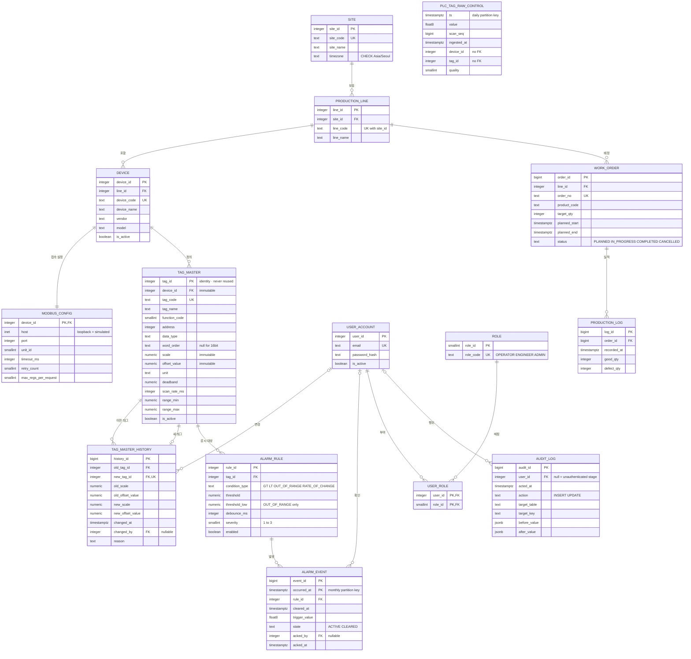
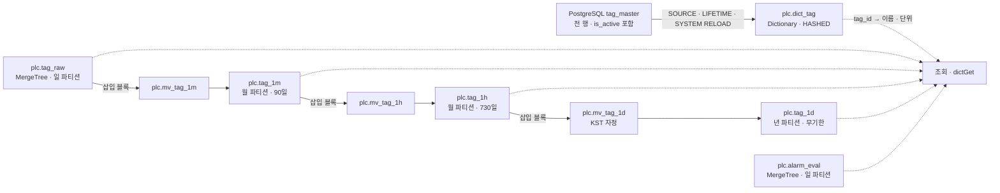
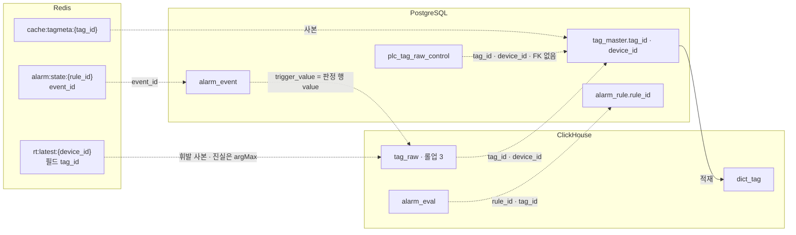

# 전역 ERD (erd)

> **대상**: db_study 저장소 전역의 관계도 — PostgreSQL 업무 14 + 대조군 1의 erDiagram · ClickHouse 객체 9의 관계 · 저장소를 넘는 논리 참조
> **작성일**: 2026-09-24
> **원천**: 원본 architecture.md §6 · §7.1 · §7.2 · §7.3 · §7.4 · §8.1 · §12(커밋 ff66a37) · docs_plan.md 보정 #15(tag_master_history) · [01_postgresql_schema.md](./01_postgresql_schema.md) · [02_postgresql_constraints.md](./02_postgresql_constraints.md) · [03_clickhouse_schema.md](./03_clickhouse_schema.md) · [04_clickhouse_rollup.md](./04_clickhouse_rollup.md) · [07_cross_store_consistency.md](./07_cross_store_consistency.md) · [10_olap_vs_rdb_control.md](./10_olap_vs_rdb_control.md)

이 문서는 **그림의 자리**다. 컬럼 · 타입 · 제약의 정본은 [01_postgresql_schema.md](./01_postgresql_schema.md) · [02_postgresql_constraints.md](./02_postgresql_constraints.md) · [03_clickhouse_schema.md](./03_clickhouse_schema.md) · [04_clickhouse_rollup.md](./04_clickhouse_rollup.md)가 갖고, 이 문서는 관계만 그린다. 그림과 정본이 어긋나면 정본이 이긴다.

다이어그램 예산의 예외 문서다([../CLAUDE.md](../CLAUDE.md)) — mermaid를 셋 둔다. PostgreSQL은 FK가 있는 관계형이라 erDiagram으로, ClickHouse는 FK가 없고 삽입 연쇄 · 사전 적재가 관계라 flowchart로, 저장소를 넘는 참조는 FK로 표현할 수 없어 flowchart로 그린다.

## 표기 규약

| 표기 | 뜻 |
|------|------|
| 엔터티 이름 대문자 | PostgreSQL 테이블 — 실제 이름은 소문자 snake_case |
| PK · FK · UK | 기본 키 · 외래 키 · 유일 제약 |
| 속성 옆 따옴표 | 컬럼 제약 · 뜻의 요약 |
| \|\|--o{ | 하나 대 여럿(필수 → 선택) |
| \|o--o{ | 선택적 하나 대 여럿 — 참조 컬럼이 NULL 허용 |
| \|\|--\|\| | 하나 대 하나 |
| \|\|--o\| | 하나 대 선택적 하나 |
| 실선 화살표(flowchart) | 삽입이 발동하는 연쇄 · 적재 |
| 점선 화살표(flowchart) | 조회 시점 참조 · FK 없는 논리 참조 |

- 검산: 표기 = **9**

## PostgreSQL ERD

업무 14 테이블과 대조군 1이다. 대조군은 관계가 없다 — FK를 두지 않는 것이 설계다([10_olap_vs_rdb_control.md](./10_olap_vs_rdb_control.md)).

- **tag_master_history는 tag_master를 두 번 가리킨다.** 이전 태그(여럿이 될 수 있다 — 한 태그의 스케일을 여러 번 바꾸면 매번 새 태그가 이전 태그가 된다)와 새 태그(UNIQUE — 한 새 태그의 계보는 한 행)다.
- **alarm_event의 PK에 occurred_at이 들어간다.** 파티션 테이블의 PK는 파티션 키를 포함해야 한다 — 규칙당 열린 이벤트 하나를 DB가 강제할 수 없는 이유다(한계 등재 [02_postgresql_constraints.md](./02_postgresql_constraints.md) #9).
- **USER_ACCOUNT에서 나가는 선택적 관계 셋(|o--o{)은 NULL의 뜻이 다르다.** 확인(acked_by NULL = 미확인) · 감사(user_id NULL = 무인증 기간) · 계보(changed_by NULL = 무인증 기간)다.
- **PLC_TAG_RAW_CONTROL에 선이 없는 것은 누락이 아니다.** 대조군은 tag_raw와 동형인 실험 계측물이라 ClickHouse처럼 참조 검사를 하지 않는다.

### 관계 검산

| 관계 | FK 컬럼 | 카디널리티 | 소유 도메인 |
|------|------|------|------|
| 보유 · 포함 · 접속 설정 · 정의 | production_line.site_id · device.line_id · modbus_config.device_id · tag_master.device_id | 1:N · 1:N · 1:1 · 1:N | MST |
| 이전 태그 · 새 태그 · 변경 | tag_master_history.old_tag_id · new_tag_id · changed_by | 1:N · 1:0..1 · 0..1:N | MST |
| 감시 대상 · 발생 · 확인 | alarm_rule.tag_id · alarm_event.rule_id · alarm_event.acked_by | 1:N · 1:N · 0..1:N | ALM |
| 부여 · 매핑 | user_role.user_id · role_id | 1:N · 1:N | AUT |
| 배정 · 실적 · 행위 | work_order.line_id · production_log.order_id · audit_log.user_id | 1:N · 1:N · 0..1:N | WRK |

- 검산: 관계 = 4 + 3 + 3 + 2 + 3 = **15** = FK 전수([02_postgresql_constraints.md](./02_postgresql_constraints.md))
- 엔터티 = 업무 14 + 대조군 1 = **15** — 루트 고정 기준과 같다

## ClickHouse 객체 관계

ClickHouse에는 FK가 없다. 객체 사이의 관계는 **삽입이 발동하는 MV 연쇄**와 **Dictionary의 원천 적재**뿐이다.

- 검산: 객체 = 테이블 5(tag_raw · tag_1m · tag_1h · tag_1d · alarm_eval) + MV 3 + Dictionary 1 = **9** — 루트 고정 기준과 같다
- **alarm_eval은 연쇄에 없다.** 판정 경로(ALM)가 따로 쓰고 롤업이 붙지 않는다 — 판정 전수는 분석 로그라 집계 계층을 두지 않는다.
- **Dictionary는 행을 잇지 않는다.** dictGet은 조회 시점에 tag_id를 해석으로 바꿀 뿐이며, 시계열 행은 이름을 갖지 않는다(ADR-16).

## 저장소를 넘는 논리 참조

세 저장소의 키가 서로를 가리키는 자리다. 어느 선도 FK가 아니며, 끊어지는 조건과 드러나는 자리는 [07_cross_store_consistency.md](./07_cross_store_consistency.md) §교차 저장소 참조 전수가 정본이다.

- **점선은 전부 FK 없는 참조다.** 시계열 · 대조군 → PostgreSQL 마스터 3(RAW · AE · CTL) + 확정 이벤트 → 원시 1(AEV) + Redis → 원천 3(RTL · AST · TMC). 실선 하나(tag_master → dict_tag)는 주기 적재다.
- 검산: 논리 참조 = 점선 3 + 1 + 3 = 7 + 적재 실선 1 = **8**
- **AST → AEV는 사본 관계가 아니다.** 핫 상태가 확정 이벤트의 번호를 들고 있을 뿐이며, 알람 세 쓰기가 같은 사실의 사본이 아니라는 판정은 [07_cross_store_consistency.md](./07_cross_store_consistency.md) §불일치 시 진실이 정한다.
- **Redis 키 전수는 이 그림에 없다.** 저장소를 넘는 참조를 가진 키만 그렸다 — 키 패턴 전수와 봉인 표의 정본은 [05_redis_keyspace.md](./05_redis_keyspace.md)다.

## 관련 문서

- [01_postgresql_schema.md](./01_postgresql_schema.md) — PostgreSQL 컬럼 정본
- [02_postgresql_constraints.md](./02_postgresql_constraints.md) — FK · 제약 · 한계 등재
- [03_clickhouse_schema.md](./03_clickhouse_schema.md) — ClickHouse 객체 목록 · DDL
- [04_clickhouse_rollup.md](./04_clickhouse_rollup.md) — MV 연쇄
- [05_redis_keyspace.md](./05_redis_keyspace.md) — Redis 키 패턴 정본
- [07_cross_store_consistency.md](./07_cross_store_consistency.md) — 교차 저장소 참조 · 진실의 자리
- [10_olap_vs_rdb_control.md](./10_olap_vs_rdb_control.md) — 대조군 명세
