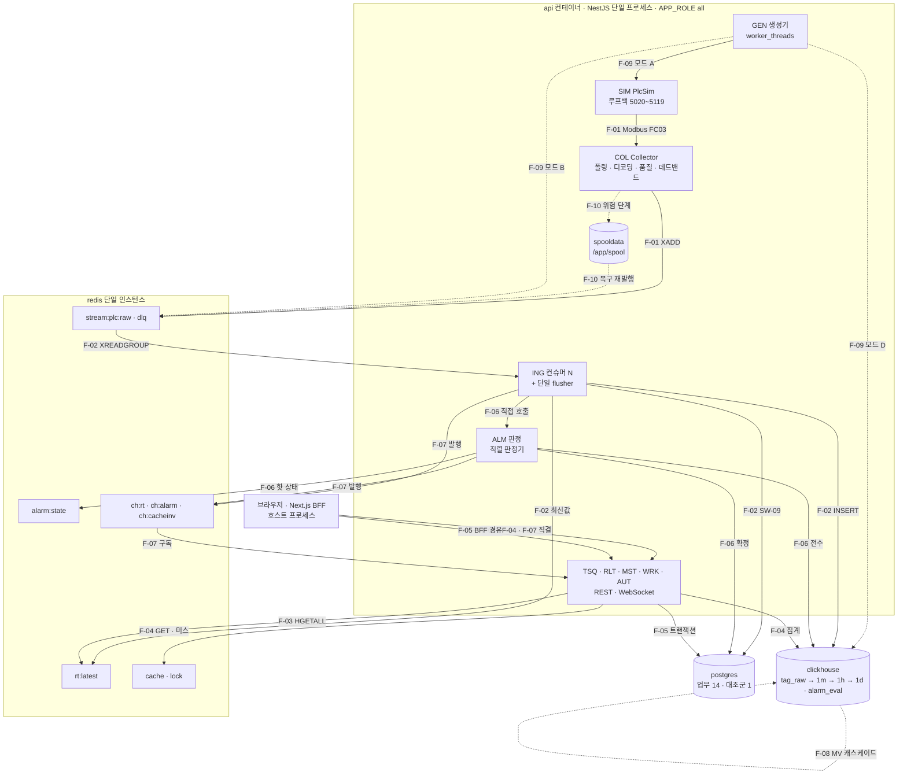

# 흐름 목록 (01_flow_inventory)

> **대상**: 데이터 흐름 10종의 채번 정본(F-01~F-10) — 원본 대응 · 방향 · 주 경로 · 성격 · 목표 지연 · 참여 도메인 · 관련 기능 · 스위치 · 요구사항 파일 · 기전 문서 · 전체 흐름도 · 흐름별 병목 후보 · 흐름 검증 항목 · 검산
> **작성일**: 2026-09-24
> **개정일**: 2026-09-24 — W6 실험 채번 반영 — 메트릭 이름 · EXP 번호 반영(정본 10_observability/01 · 06)
> **원천**: 원본 data_flow.md §1 · §2 · §16 · §17(커밋 ff66a37) · 원본 architecture.md §9(커밋 ff66a37) · docs_plan.md 실행 계획 보정 #6 · #19 · ADR-06 · ADR-07 · ADR-09 · ADR-11 · [../README.md](../README.md) 고정 기준(데이터 흐름 · 도메인 공백) · [../11_glossary/04_id_conventions.md](../11_glossary/04_id_conventions.md) 원본 흐름 표기 대응 · [../02_features/13_switch_matrix.md](../02_features/13_switch_matrix.md) 관련 흐름 열 · [../02_features](../02_features/README.md) 도메인 파일 흐름 열

이 문서는 **F-NN을 새로 만들 수 있는 유일한 자리**다. 다른 문서는 흐름을 번호로 인용만 하고, 흐름을 더하거나 폐지하면 이 표와 [../README.md](../README.md) 고정 기준을 같은 변경 단위에서 고친다. 번호는 식별자이지 순서가 아니다 — 새 흐름은 F-11부터 말미에 채번하고 결번을 재사용하지 않는다.

흐름은 **데이터가 한 저장소 · 모듈 경계를 넘어 목적지에 닿기까지의 경로 하나**다. 경로가 같아도 지연 목표와 병목 지표가 다르면 흐름을 가른다 — F-03과 F-07은 같은 Redis 사본을 읽지만 하나는 요청 · 응답이고 하나는 발행 · 구독이라 흐름이 둘이다. 반대로 분기(3계층)는 흐름이 아니라 **흐름 안에서 일어나는 판정**이라 번호를 받지 않는다 — 기전 정본은 [04_routing.md](./04_routing.md)다.

**경계 — 이 문서는 흐름의 목록과 대응만 갖는다.** 각 흐름의 단계 · 판정 · 실패 처리는 기전 문서가, 지연 예산의 구간값은 [../04_architecture/05_latency_budget.md](../04_architecture/05_latency_budget.md)가, 성능 목표치는 [../03_requirements/13_nonfunctional.md](../03_requirements/13_nonfunctional.md)가 갖는다. 아래 목표 지연은 전부 **원본 목표(4 vCPU 가정)**이며 현행 목표는 미확인이다.

## 흐름 정본 표

| ID | 원본 절 | 흐름 | 방향 | 주 경로 | 성격 | 원본 목표 지연 | 현행 |
|------|------|------|------|------|------|------|------|
| **F-01** | 원본 data_flow.md §3 | PLC 수집 | 쓰기 | PlcSim 레지스터 → Modbus 루프백 → Collector 디코딩 · 품질 · 데드밴드 → stream:plc:raw | 비동기 · 고빈도 · 스캔 주기 구동 | 스캔 주기 안 완료 | 미확인 |
| **F-02** | 원본 data_flow.md §4 | 배치 적재 | 쓰기 | stream:plc:raw → 컨슈머 N(읽기 · 디코딩) → 단일 flusher → ClickHouse tag_raw → XACK | 비동기 · 배치 · at-least-once | 1초 이내 | 미확인 |
| **F-03** | 원본 data_flow.md §5 | 최신값 조회 | 읽기 | 브라우저 → api 직결 → Redis rt:latest(빈 키면 ClickHouse 복원) | 동기 · 초고빈도 · 점조회 | 10 ms | 미확인 |
| **F-04** | 원본 data_flow.md §6 | 시계열 이력 조회 | 읽기 | 브라우저 → api 직결 → Redis cache:q → 미스면 ClickHouse 롤업 · 원시 | 동기 · 무거움 · 범위 집계 | 300 ms | 미확인 |
| **F-05** | 원본 data_flow.md §7 | 업무 데이터 CRUD | 읽기 · 쓰기 | 브라우저 → Next.js BFF → api → PostgreSQL 트랜잭션 → 무효화 체인 6단 | 동기 · 트랜잭션 · Stream 비경유 | 100 ms | 미확인 |
| **F-06** | 원본 data_flow.md §8 | 알람 판정 | 쓰기 | 확정 배치 → 직접 호출 → Alarm 판정 → alarm:state · alarm_event · alarm_eval · ch:alarm | 비동기 · 배치 후처리 · 세 쓰기 | 2초 | 미확인 |
| **F-07** | 원본 data_flow.md §9 | 실시간 푸시 | 읽기 | ch:rt · ch:alarm → WebSocket 게이트웨이 → 스로틀 병합 → 브라우저 | 비동기 스트리밍 · 전달 보장 없음 | 500 ms | 미확인 |
| **F-08** | 원본 data_flow.md §10 | 롤업 집계 | 내부 | tag_raw 삽입 블록 → mv_tag_1m → tag_1m → mv_tag_1h → tag_1h → mv_tag_1d → tag_1d | 삽입 시 자동 · 원자성 없음 | 즉시 | 미확인 |
| **F-09** | 원본 data_flow.md §11 | 테스트 데이터 주입 | 쓰기 | 생성기 → 모드 A PlcSim · B Stream · C HTTP 표면 · D ClickHouse 직접 | 부하 생성 · 한 번에 한 모드 | 해당 없음(원본 "-") | 해당 없음 |
| **F-10** | 원본 data_flow.md §12 | 백프레셔와 장애 | 예외 | 적체 → 발행자 단계 반응(스풀 · 거절) · 저장소별 degrade · 복구 소진 | 복구 · 명시적 실패 | 시나리오별 | 미확인 |

- 검산: 흐름 = 쓰기 4(F-01 · F-02 · F-06 · F-09) + 읽기 3(F-03 · F-04 · F-07) + 읽기 · 쓰기 1(F-05) + 내부 1(F-08) + 예외 1(F-10) = **10** — 루트 고정 기준과 같다
- **원본 흐름 표기는 이 문서에 쓰지 않는다.** 원본 표기와 F-NN의 대응은 [../11_glossary/04_id_conventions.md](../11_glossary/04_id_conventions.md) 대응표 한 자리에만 있고, 이 표는 원본 절 번호로 추적한다(보정 #6). 흐름 번호와 원본 절 번호는 2만큼 어긋난다(F-01 = §3).
- 원본 목표 지연 열은 원본 data_flow.md §1의 값이다. 구간 분해와 원본 누적은 [../04_architecture/05_latency_budget.md](../04_architecture/05_latency_budget.md), 합격 판정은 REQ-NFR-03 · 07 · 08 · 09가 갖는다.

### 흐름 경계 판정

원본 흐름 목록은 경로만 적었다. 번호를 매기며 두 흐름 사이에 끼는 동작이 어느 흐름에 속하는지를 고정한다.

| 동작 | 속한 흐름 | 이유 | 다른 흐름에 두면 |
|------|------|------|------|
| 최신값 Hash 덮어쓰기 · ch:rt 발행 | **F-02**(SW-11 ingest) · **F-01**(SW-11 collector) | 쓰기 주체가 곧 흐름이다 — 갱신은 적재 확정 또는 발행 파이프라인의 한 단계다 | F-03에 두면 "읽기 흐름이 쓴다"가 되어 SW-02 off가 갱신까지 끈다는 오독이 생긴다 |
| 빈 키 복원(ClickHouse argMax → rt:latest 워밍) | **F-03** | 조회 요청이 시작하고 요청 안에서 끝난다 | F-02에 두면 기동 복원(Ingest)과 요청 복원(RLT)의 락 · 실패 처리가 한 기전으로 섞인다 |
| 확정 배치의 알람 판정 인계 | **F-06** | 인계 이후의 쓰기 셋이 전부 판정의 산출이다 | F-02에 두면 판정 실패가 적재 실패로 계측된다 |
| 대조군 동시 적재(SW-09) | **F-02** | 같은 배치 · 같은 flusher 안의 한 단계다 | 별도 흐름이면 "대조군은 목적지"라는 오독이 생긴다(대조군은 계측물 — [../04_architecture/04_storage_split.md](../04_architecture/04_storage_split.md)) |
| 캐시 무효화 체인 · ch:cacheinv | **F-05** | 업무 쓰기 커밋 뒤에만 걸린다 | F-07에 두면 SW-06 대상으로 오독된다 — ch:cacheinv는 SW-06 밖이다 |
| 모드 D 백필 · 대조군 동일 행 채우기 | **F-09** | 적재 경로(F-02)를 우회하는 실험 도구의 쓰기다 | F-08에 두면 롤업 흐름이 MV 분리를 소유하게 된다 |
| 스풀 전환 · 재발행 · 적체 소진 | **F-10** | 정상 흐름이 아니라 단계 반응이다 | F-01에 두면 정상 운전 지연 예산에 스풀이 섞인다 |

- 검산: 경계 판정 = **7**
- **경계 판정의 기준은 하나다 — "그 동작의 실패가 어느 흐름의 계측에 잡혀야 하는가".** 빈 키 복원의 실패는 최신값 API 지연으로 드러나야 하므로 F-03이고, 판정 실패는 판정 구간 계측으로 드러나야 하므로 F-06이다.

## 참여 도메인 · 기능 · 스위치 · 문서

| ID | 참여 도메인 | 관련 기능(02_features 흐름 열) | 기능 수 | 스위치 | 요구사항 파일 | 기전 문서 |
|------|------|------|:------:|------|------|------|
| F-01 | COL · SIM · GEN · MST | COL-01~07 · SIM-01~05 · GEN-05 · MST-03 · MST-07 | 15 | SW-01 · SW-10 · SW-11(collector) | [../03_requirements/04_collector.md](../03_requirements/04_collector.md) · [../03_requirements/05_plc_sim.md](../03_requirements/05_plc_sim.md) | [02_collect.md](./02_collect.md) |
| F-02 | COL · GEN · ING | COL-07 · GEN-06 · ING-01~08 · ING-10 · ING-11 | 12 | SW-01 · SW-08 · SW-09 · SW-11 | [../03_requirements/07_ingest.md](../03_requirements/07_ingest.md) | [03_ingest_batch.md](./03_ingest_batch.md) · [04_routing.md](./04_routing.md) |
| F-03 | RLT · AUT · MST · ING · TSQ | RLT-01~04 · RLT-07 · AUT-04~07 · MST-07 · ING-08 · TSQ-08 | 12 | SW-02 · SW-11 | [../03_requirements/09_realtime.md](../03_requirements/09_realtime.md) | [05_realtime_read.md](./05_realtime_read.md) |
| F-04 | TSQ · AUT · MST | TSQ-01~09 · AUT-04~07 · MST-09 | 14 | SW-03 · SW-04 · SW-05 | [../03_requirements/08_timeseries.md](../03_requirements/08_timeseries.md) | [06_timeseries_read.md](./06_timeseries_read.md) |
| F-05 | AUT · MST · WRK · ALM · RLT | AUT-01~06 · MST-01~06 · MST-08 · WRK-01~05 · ALM-01 · RLT-09 | 20 | 없음 — 정합성 계약 | [../03_requirements/02_auth.md](../03_requirements/02_auth.md) · [../03_requirements/03_master.md](../03_requirements/03_master.md) · [../03_requirements/11_work_orders.md](../03_requirements/11_work_orders.md) | [07_business_crud.md](./07_business_crud.md) |
| F-06 | ING · ALM · RLT · AUT | ING-09 · ING-10 · ALM-02~09 · RLT-08 · AUT-05 | 12 | SW-06 | [../03_requirements/10_alarms.md](../03_requirements/10_alarms.md) | [08_alarm.md](./08_alarm.md) · [04_routing.md](./04_routing.md) |
| F-07 | RLT · ING · ALM · AUT | RLT-05~08 · ING-08 · ALM-06 · AUT-04 · AUT-05 · AUT-07 | 9 | SW-06 · SW-07 | [../03_requirements/09_realtime.md](../03_requirements/09_realtime.md) | [05_realtime_read.md](./05_realtime_read.md) |
| F-08 | ING · GEN · MST | ING-12 · GEN-08 · MST-09 | 3 | 없음 — 정합성 계약 | [../03_requirements/07_ingest.md](../03_requirements/07_ingest.md) REQ-ING-16 | [09_rollup.md](./09_rollup.md) |
| F-09 | GEN · SIM · AUT | GEN-01~10 · SIM-03 · AUT-05 | 12 | SW-09(모드 D 구간은 GEN-10) | [../03_requirements/06_datagen.md](../03_requirements/06_datagen.md) | [10_datagen_inject.md](./10_datagen_inject.md) |
| F-10 | COL · SIM · GEN · ING · RLT | COL-08 · COL-09 · SIM-04 · GEN-07 · ING-05 · ING-06 · ING-13 · RLT-04 | 8 | SW-01 · SW-11 | [../03_requirements/01_global_rules.md](../03_requirements/01_global_rules.md) REQ-GLB-10 · [../03_requirements/13_nonfunctional.md](../03_requirements/13_nonfunctional.md) | [11_backpressure_failure.md](./11_backpressure_failure.md) |

- 검산(기능 — 중복 허용 · 02_features 11본의 흐름 열을 다시 셈): 15 + 12 + 12 + 14 + 20 + 12 + 9 + 3 + 12 + 8 = **117** · 흐름 열이 "해당 없음 — 관측"인 기능 OBS-01~06 = **6**
- 검산(참여 도메인): 합집합 = AUT · MST · COL · SIM · GEN · ING · TSQ · RLT · ALM · WRK = **10** · 불참 OBS **1** · 10 + 1 = **11** — 루트 고정 기준 "06_pipeline 흐름 불참 1 — OBS"와 같다
- 검산(스위치 참여 — 중복 허용): F-01 3 · F-02 4 · F-03 2 · F-04 3 · F-06 1 · F-07 2 · F-09 1 · F-10 2 = **18** · 스위치 없는 흐름 F-05 · F-08 = **2**. [../02_features/13_switch_matrix.md](../02_features/13_switch_matrix.md)의 참여 합과 같다 — SW-11 collector는 발행 파이프라인(F-01)에서 실행되므로 F-01에 센다
- **OBS가 흐름에 불참하는 것은 설계 진술이다.** OBS는 흐름 구간마다 카운터를 등록할 뿐 데이터를 한 저장소에서 다른 저장소로 옮기지 않는다 — E2E 게이지(OBS-04)가 ClickHouse를 읽는 것도 계측이지 흐름이 아니다.

## 전체 흐름도

아래는 10흐름이 모듈 · 저장소를 지나는 자리다. 간선 라벨의 F-NN이 그 간선을 소유하는 흐름이며, 분기 3계층이 갈라지는 자리는 [04_routing.md](./04_routing.md)가 확대한다.

- **Collector에서 ClickHouse로 가는 간선이 없다.** 수집과 적재 사이에는 반드시 Stream이 있고 예외는 실험 전용 SW-01 off뿐이다(ADR-06 · REQ-GLB-03) — 그림의 유일한 Stream 우회 간선은 ING → ALM 직접 호출(F-06)이며 그것이 의도된 유일한 예외다(ADR-11).
- **F-05는 Redis Stream에 닿는 간선이 하나도 없다.** 업무 쓰기가 Stream을 타지 않는 것은 분기의 누락이 아니라 분기의 판정이다(REQ-GLB-12).
- **F-08은 자기 자신으로 도는 간선이다.** 롤업은 애플리케이션이 아니라 ClickHouse 안 MV 연쇄가 수행하고, 애플리케이션이 개입하는 것은 백필 · 재계산 때뿐이다([09_rollup.md](./09_rollup.md)).
- F-10은 정상 간선이 아니라 점선(단계 반응)으로만 나타난다. 저장소별 degrade 경로는 그림에 넣지 않았다 — [11_backpressure_failure.md](./11_backpressure_failure.md).

## 흐름 간 의존

한 흐름의 산출이 다른 흐름의 입력이 되는 관계다. 앞 흐름이 멈추면 뒤 흐름이 무엇을 보는지가 장애 해석의 첫 질문이다.

| 앞 흐름 | 뒤 흐름 | 넘기는 것 | 앞이 멈추면 뒤가 보는 것 | 드러나는 자리 |
|------|------|------|------|------|
| F-01 | F-02 | Stream 엔트리 | 소비할 엔트리가 없다 — 적재는 정상 · 행 증가 0 | points_emitted 0 · 조회 STALE |
| F-09(A) | F-01 | 레지스터 Buffer 값 | 같은 값이 반복 수집된다 — 데드밴드 off면 행은 계속 쌓인다 | 값 평탄 · 행 수는 정상 |
| F-02 | F-06 | 확정 배치의 행 배열 | 판정이 멈춘다 — 알람 상태가 마지막 값에 머문다 | 판정 구간 계측 0 |
| F-02 | F-08 | tag_raw 삽입 블록 | 롤업도 멈춘다 — 이미 있는 버킷은 그대로 | 롤업 최신 버킷 정지 |
| F-02(SW-11 ingest) | F-03 · F-07 | rt:latest · ch:rt | 최신값이 멈춘다 — **ClickHouse 중단이 대시보드 정지로 번진다** | STALE 전환(ADR-10) |
| F-05 | F-01 · F-04 · F-06 | 마스터 · 규칙 변경(무효화 신호) | 옛 메타 · 옛 규칙이 TTL 동안 쓰인다 | 캐시 삭제 실패 계수 |
| F-06 | F-07 | ch:alarm 이벤트 | 알람 푸시가 없다 — 목록은 조회로 보인다 | 판정 구간 계측 |

- 검산: 의존 = **7**
- **F-03이 F-02에 묶이는 것은 SW-11 기본값(ingest) 때문이다.** 갱신 주체를 collector로 바꾸면 이 행이 F-01 → F-03으로 옮겨 가고 ClickHouse 중단이 대시보드에 번지지 않는다 — 두 구현의 비교가 S6 실험이다([11_backpressure_failure.md](./11_backpressure_failure.md)).

## 흐름별 병목 후보

원본 data_flow.md §16의 11행에 이 문서군이 더한 3행이다. 확인 지표의 메트릭 이름 정본은 [../10_observability/01_metrics_catalog.md](../10_observability/01_metrics_catalog.md)이며 아래 이름은 원본 표기다 — 카탈로그 이름 대응은 그 문서 §인계 메트릭 대응 검산의 끝 불릿(W6).

| # | 흐름 | 1차 병목 후보 | 증상 | 확인 지표 | 대응 |
|:-:|------|------|------|------|------|
| 1 | F-01 | Modbus 요청 수 | 폴링 주기 초과 | poll_duration > scan_rate | 레지스터 블록 병합 · 스캔 그룹 분리 |
| 2 | F-02 | ClickHouse 파트 생성률 | too many parts | system.parts 활성 파트 수 | 배치 확대 · B · C안 비교(ADR-09) |
| 3 | F-02 | 디스크 IOPS | 삽입 지연 급증 | 디스크 대기 시간 | 배치 크기 · 머지 설정 |
| 4 | F-02 | **단일 flusher 직렬성** | 6c fan-in 대기 증가 · 판정 인계 대기 | fan-in 버퍼 대기 · 인계 대기 히스토그램 | 시간 트리거 조정 · 판정 구간 단축 — **신설**(ADR-09 · [03_ingest_batch.md](./03_ingest_batch.md)) |
| 5 | F-03 | Redis 단일 스레드 | ops/s 포화 | redis instantaneous_ops | 파이프라인화 · 요청 병합 |
| 6 | F-04 | ClickHouse 스캔량 | 쿼리 시간 급증 | query_duration_ms | 해상도 상향 · 캐시 히트율 |
| 7 | F-04 | 캐시 키 파편화 | 히트율 저조 | 캐시 히트율 | 시간 경계 스냅(SW-04) 확인 |
| 8 | F-05 | PostgreSQL 커넥션 | 커넥션 고갈 | pg active connections | in-process 풀 크기(ADR-19) |
| 9 | F-06 | **판정 상태 왕복** | 판정 구간이 플러시 주기를 넘는다 | 알람 판정 히스토그램 A2 | 배치당 파이프라인 1회(ADR-11) — **신설** |
| 10 | F-07 | WebSocket 팬아웃 | 이벤트 루프 지연 | nodejs_eventloop_lag | 스로틀 창 확대 · 역할 분리 후 증설 |
| 11 | F-08 | MV 체이닝 오버헤드 | 삽입 지연 증가 | 삽입 전후 시간 차 | 체이닝 깊이 축소 |
| 12 | F-09 | **생성기 포화** | 목표 부하 미달 · 측정 무의미 | 생성기 CPU · 발행 중단 계수 | APP_ROLE datagen 분리 — **신설**(REQ-GEN-13) |
| 13 | 전체 | api 이벤트 루프 포화 | 수집 부하에 비례해 조회 p95 악화 | nodejs_eventloop_lag p95 | 워커 격리(ADR-25) → 역할 분리 |
| 14 | 전체 | 호스트 CPU | 모든 지표 동시 악화 | node CPU | 역할 분리 → 자원 상향 |

- 검산: 원본 11(#1~#3 · #5~#8 · #10 · #11 · #13 · #14) + 신설 3(#4 · #9 · #12) = **14**
- **#4는 ADR-09가 만든 새 병목이다.** 컨슈머를 늘리면 읽기 · 디코딩은 빨라지지만 삽입은 여전히 한 곳이라, 적체의 원인이 삽입이면 컨슈머 증설이 효과가 없다([../04_architecture/05_latency_budget.md](../04_architecture/05_latency_budget.md) §ADR-09 반영 시 구간 변화).
- **#9는 원본 병목표에 없던 행이다.** 원본 판정 시퀀스는 행마다 상태를 조회해 판정 처리량이 곧 Redis 왕복 상한이었다(원본 implementation_plan.md §7.3).
- 병목 판정은 한 번에 한 주입 모드로만 한다 — 모드 A와 B를 섞으면 #1과 #2를 가를 수 없다(REQ-GEN-05).

## 흐름 검증 항목

원본 data_flow.md §17의 13항목이 어느 흐름을 검증하는지와 인수 기준 대응이다. 합격 기준 정본은 [../03_requirements/14_acceptance_criteria.md](../03_requirements/14_acceptance_criteria.md)다.

| 항목 | 검증 흐름 | 인수 기준 | 기전 자리 |
|------|------|------|------|
| 수집 무손실 | F-01 · F-02 | AC-01 | [03_ingest_batch.md](./03_ingest_batch.md) |
| 중복 없음 | F-02 | AC-02 · AC-20 | [03_ingest_batch.md](./03_ingest_batch.md) §멱등 토큰 |
| E2E 지연 | F-01 · F-02 | AC-03 | [12_data_contract.md](./12_data_contract.md) · 지연 예산 |
| 시간대 정확성 | F-02 · F-04 | AC-04 | [12_data_contract.md](./12_data_contract.md) |
| 롤업 정합성 | F-08 | AC-05 | [09_rollup.md](./09_rollup.md) |
| 캐시 정합성 | F-05 | AC-06 | [07_business_crud.md](./07_business_crud.md) |
| 최신값 정확성 | F-02 · F-03 | AC-07 | [05_realtime_read.md](./05_realtime_read.md) |
| 품질 코드 전파 | F-01 | AC-08 | [02_collect.md](./02_collect.md) |
| 알람 디바운스 | F-06 | AC-09 | [08_alarm.md](./08_alarm.md) |
| WebSocket 재연결 | F-07 | AC-10 | [05_realtime_read.md](./05_realtime_read.md) |
| 백프레셔 | F-10 | AC-11 · AC-30 | [11_backpressure_failure.md](./11_backpressure_failure.md) |
| DLQ | F-02 · F-10 | AC-12 | [11_backpressure_failure.md](./11_backpressure_failure.md) §DLQ 재처리 |
| TTL 삭제 | F-09 · F-08 | AC-13 | [09_rollup.md](./09_rollup.md) · [10_datagen_inject.md](./10_datagen_inject.md) |

- 검산: 항목 = **13** · 검증 흐름 열에 나오는 흐름 = F-01 · F-02 · F-03 · F-04 · F-05 · F-06 · F-07 · F-08 · F-09 · F-10 = **10** — 단 F-09는 TTL 삭제의 주입 수단으로만 나오고 자체 합격 항목이 없다. 생성기 자체의 판정은 AC-16(단독 처리량)이다.
- **원본 검증표의 "캐시 정합성 — 무효화 후 즉시 반영"은 원본 설계대로면 반드시 실패한다.** BFF 캐시와 브라우저 캐시가 체인에 없었기 때문이며, 6단 체인(ADR-12)이 이 항목을 성립시킨다.

## 채번 규칙

| 규칙 | 내용 | 어기면 |
|------|------|------|
| 채번 자리 | 이 문서 §흐름 정본 표에서만 · 같은 변경 단위에서 루트 README 고정 기준(리드) | 흐름 수가 두 자리에서 다르게 세어진다 |
| 신설 기준 | 지연 목표 또는 병목 지표가 기존 흐름과 다를 때만 | 같은 경로를 두 번호로 세어 흐름별 계측이 중복된다 |
| 분기 · 판정 | 번호를 주지 않는다 — 흐름 안의 판정이다 | 분기가 흐름이 되면 "분기 경로가 목적지"라는 오독이 생긴다 |
| 폐지 | 결번으로 영구 보존 · 재사용 금지 | 옛 측정 기록의 F-NN이 다른 흐름을 가리킨다 |
| 원본 표기 | 원본 흐름 표기는 11_glossary/04 대응표에만 둔다 | 두 표기가 섞여 grep 추적이 끊긴다 |

- 검산: 규칙 = **5**

## 미확인 · 미설계 등재

| 항목 | 상태 | 확정 자리 |
|------|------|------|
| 흐름별 현행 목표 지연 전 행 | 3계층 미확인 — 미확인 · 확정 전 임의 값 고정 금지 | [../03_requirements/13_nonfunctional.md](../03_requirements/13_nonfunctional.md) · EXP-30 · 22~26 · [../10_observability/06_experiment_catalog.md](../10_observability/06_experiment_catalog.md) |
| F-06 · F-08의 흐름 목표 | 원본 목표만(2초 · 즉시) — 판정 구간 · MV 캐스케이드 예산은 미확인 | [../04_architecture/05_latency_budget.md](../04_architecture/05_latency_budget.md) |
| 병목 확인 지표의 메트릭 이름 | **W6 판정** — 원본 표기는 유지하고 카탈로그 이름 대응을 정본이 갖는다(신설 3행 = ing_fanin_wait_seconds · alm_handoff_wait_seconds · alm_eval_duration_seconds · gen_worker_utilization) | [../10_observability/01_metrics_catalog.md](../10_observability/01_metrics_catalog.md) |
| 스위치 참여 합 | 해소 — 스위치 매트릭스가 SW-11 collector의 F-01 참여를 세어 18로 맞췄다 | [../02_features/13_switch_matrix.md](../02_features/13_switch_matrix.md) |

## 관련 문서

- [../README.md](../README.md) — 흐름 10 · 분기 3계층 고정 기준
- [../11_glossary/04_id_conventions.md](../11_glossary/04_id_conventions.md) — 원본 흐름 표기와 F-NN의 대응
- [04_routing.md](./04_routing.md) — 흐름 안의 3계층 분기 기전
- [../04_architecture/05_latency_budget.md](../04_architecture/05_latency_budget.md) — 흐름 구간별 지연 예산
- [../02_features/13_switch_matrix.md](../02_features/13_switch_matrix.md) — 스위치별 관련 흐름
- [../03_requirements/14_acceptance_criteria.md](../03_requirements/14_acceptance_criteria.md) — 흐름 검증 항목의 합격 기준
