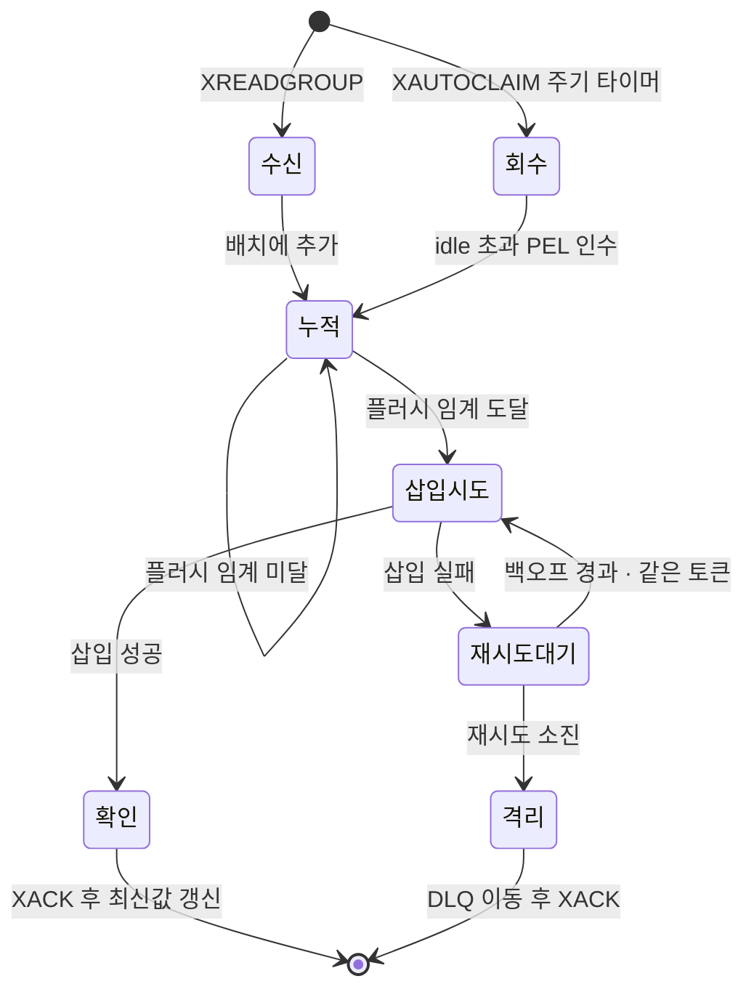
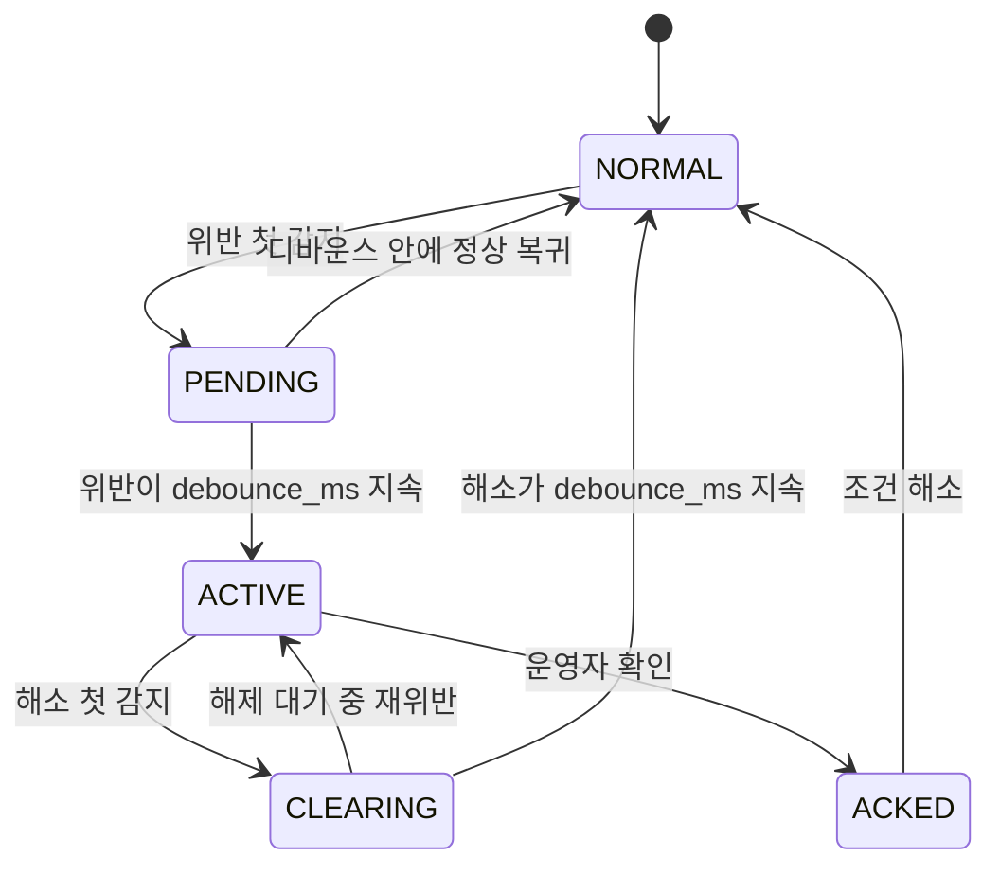
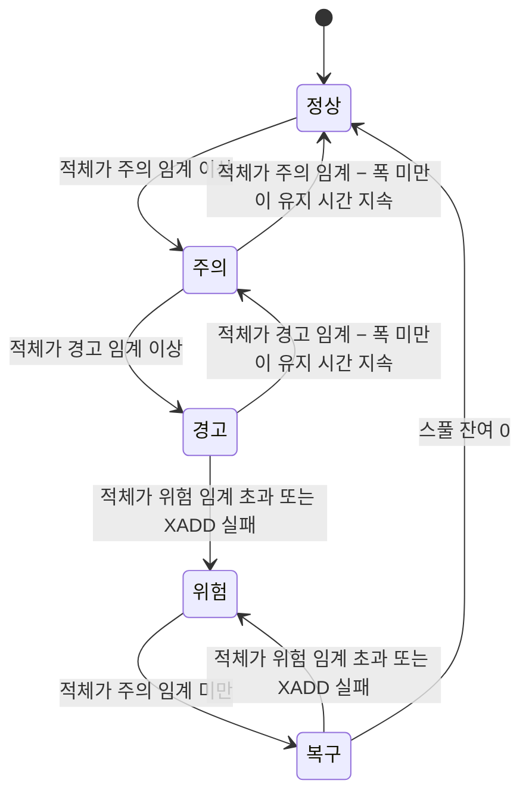
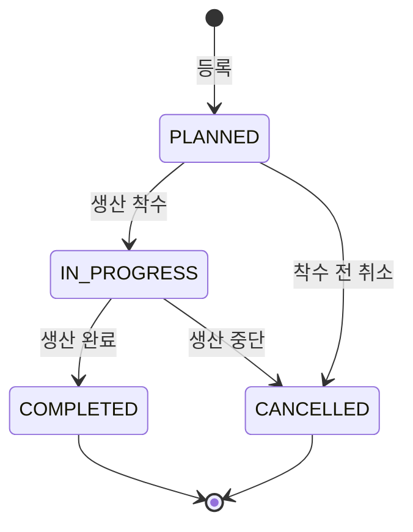

# enum과 상태 머신 (03_enums_state_machines)

> **대상**: db_study가 저장 · 전송 · 설정에 쓰는 닫힌 값 집합(enum) 전수와 상태 머신 4종(배치 재시도 · 알람 · 백프레셔 · 작업지시) — enum 값 정본
> **작성일**: 2026-09-24
> **개정일**: 2026-09-24 — W4 판정 반영 — ACKED는 alarm:state에 저장하지 않는 파생 상태 — 저장 state 값 **4** · ACK의 Redis 주체 미확인 → **판정기 단독** · CLEARING 중 ACK 전이 판정 · BAD_TIMEOUT 기록 자리 · FLOAT64 4워드 순서 · 레지스터 비트 BOOL W4 판정 — enum 수 · 값 수 불변
> **개정일**: 2026-09-24 — W3 판정 반영 — 미설계 3 → **확정**(condition_type 4 · severity 3 · work_order.status 4 · 정본 05_data_stores/01) · 전수 검산 15 + 3 → **18 + 0** · 상태 머신 3 → **4**(작업지시 · 허용 전이 4쌍) · alarm:state 필드 **7** · bad_cnt 조건식 **W3 확정 quality IN (2, 4)**
> **개정일**: 2026-09-24 — W3 판정 반영 — 백프레셔 판정량 XLEN → **미확인 적체(그룹 lag + pending)**(ADR-21) · 하강 전이 잠정 표기 → **히스테리시스 확정**(ADR-23)
> **개정일**: 2026-09-24 — W2 판정 반영 — CLEARING · CLEARED 이벤트 ACK 허용 조건 링크
> **개정일**: 2026-09-24 — W2 확정 반영 — role.role_code 미설계 → **확정 3값**(OPERATOR · ENGINEER · ADMIN) · 전수 검산 14 + 4 → **15 + 3** · 모드 A SIMULATED 표지 미확인 → 판정 완료(정본 02_features/03)
> **원천**: 원본 data_flow.md §3.2 · §4 · §8 · §8.1 · §8.2 · §11 · §11.1(커밋 ff66a37) · 원본 architecture.md §6 · §7.1 · §7.2 · §7.3 · §9.2 · §9.3 · §11.1(커밋 ff66a37) · 원본 tech_stack.md §6 · §7 · §10.1(커밋 ff66a37) · docs_plan.md 실행 계획 보정 #20

이 문서는 **값의 목록과 그 값이 무엇을 일으키는가**를 고정한다. 컬럼의 타입 · 제약은 [../05_data_stores](../05_data_stores/README.md)가, 전이를 실행하는 기전은 [../06_pipeline](../06_pipeline/README.md)이 갖는다. 값을 더하거나 빼면 여기서 먼저 고치고, 값을 인용하는 컬럼 · 메트릭 · 화면이 뒤따른다.

**원본에 값이 없는 enum은 이 문서가 임의로 만들지 않는다.** 컬럼만 있고 값 집합이 없는 것은 "미설계 — {결정 문서}가 확정"으로 등재하고, 결정 문서가 확정한 뒤에 값을 올린다. 임의 값을 적으면 구현이 그 값을 정본으로 읽어 스키마 확정 전에 데이터가 쌓인다.

## enum 전수

| # | enum | 저장 · 사용 위치 | 값 수 | 상세 |
|:-:|------|---------------|:-----:|------|
| 1 | 품질 코드 | tag_raw.quality · Stream q · rt:latest 값의 셋째 필드 | 7 | 품질 코드 |
| 2 | 신호 프로파일 | 생성기 설정(GEN) — **저장 컬럼 없음** | 8 | 신호 프로파일 |
| 3 | data_type | tag_master.data_type | 7 | Modbus 매핑 enum |
| 4 | word_order | tag_master.word_order | 4 | Modbus 매핑 enum |
| 5 | function_code | tag_master.function_code | 4 | Modbus 매핑 enum |
| 6 | 주입 모드 | 실험 조건 — 측정 기록 머리 | 4 | 실험 · 조회 축 enum |
| 7 | 조회 해상도 | 조회 요청 interval · 응답 meta.interval | 4 | 실험 · 조회 축 enum |
| 8 | 집계 함수 | 조회 요청 aggregations | 5 | 실험 · 조회 축 enum |
| 9 | 백프레셔 단계 | 메트릭 — **저장 컬럼 없음** | 5 | 상태 머신 3 |
| 10 | 배치 재시도 상태 | Ingest 모듈 메모리 — **저장 컬럼 없음** | 7 | 상태 머신 1 |
| 11 | 알람 상태 | 상태 머신 5 — alarm:state:{rule_id}의 state 필드에 저장되는 값은 4(ACKED는 alarm_event.acked_at에서 파생 · W4) | 5 | 상태 머신 2 |
| 12 | alarm_event.state | alarm_event.state | 2 | 상태 머신 2 |
| 13 | APP_ROLE | 환경변수 | 5 | 기타 enum |
| 14 | alarm_eval.breached | alarm_eval.breached | 2 | 기타 enum |
| 15 | alarm_rule.condition_type | alarm_rule.condition_type | 4 | 저장 enum(W3 확정) |
| 16 | alarm_rule.severity | alarm_rule.severity · alarm_eval.severity | 3 | 저장 enum(W3 확정) |
| 17 | work_order.status | work_order.status | 4 | 저장 enum(W3 확정) · 상태 머신 4 |
| 18 | role.role_code | role.role_code | 3 | 저장 enum(W2 확정) |

검산: 값 확정 18(#1~#18) + 미설계 0 = **18**

- **실험 축 중 용량 티어 · 메모리 프로파일 · 부하 시나리오는 enum이 아니다.** 코드가 분기하는 값이 아니라 측정 조건이며, 정본은 [../04_architecture/07_capacity_planning.md](../04_architecture/07_capacity_planning.md) · [../04_architecture/03_execution_topology.md](../04_architecture/03_execution_topology.md) · [../10_observability/05_load_scenarios.md](../10_observability/05_load_scenarios.md)다. 역할 스위치 SW-NN도 여기 두지 않는다 — 정본 [../02_features/13_switch_matrix.md](../02_features/13_switch_matrix.md).

## 품질 코드

값은 UInt8로 저장한다. **BAD 계열은 이름이 BAD_로 시작하는 2 · 3 · 4다** — 알람 판정 제외 규칙이 이 계열을 가리킨다(원본 data_flow.md §8).

| 코드 | 이름 | 부여 조건 | tag_raw 행 | 알람 판정 | 후속 처리 |
|:----:|------|----------|:----------:|:--------:|----------|
| 0 | GOOD | 정상 수신 · 범위 안 | 저장 | 대상 | 정상 저장 |
| 1 | UNCERTAIN | 보간 · 추정값 | 저장 | 대상 | 집계에서 가중치를 낮춘다 — **롤업 MV에 구현이 없다**(아래 불일치) |
| 2 | BAD_COMM | Modbus 예외 응답 | 저장 | 제외 | 롤업 bad_cnt에 든다 |
| 3 | BAD_TIMEOUT | 응답 타임아웃 | **저장하지 않음** | 해당 없음 | 결측으로 처리한다. 해당 스캔 그룹은 그 주기를 건너뛴다 |
| 4 | BAD_RANGE | range_min · range_max 밖 | 저장 | 제외 | 롤업 bad_cnt에 든다 |
| 5 | STALE | 지정 주기 안에 갱신 없음 | **조회 시점 판정** | 해당 없음 | 최신값 응답에 경고로 표시한다. 판정식은 [05_units_and_time.md](./05_units_and_time.md) |
| 9 | SIMULATED | 테스트 데이터 생성기 산출 | 저장 | **대상** | 실데이터와 반드시 구분한다 |

검산: 0~5의 6 + 9의 1 = **7** · 결번 6 · 7 · 8

- **6~8은 결번이다.** 원본은 5 다음을 9로 건너뛰고 사유를 적지 않았다(사유 미확인). 이 문서는 [04_id_conventions.md](./04_id_conventions.md)의 말미 채번 규칙을 적용해 6~8을 영구 결번으로 고정한다 — 새 품질 코드는 10부터 채번한다. 빈 번호를 메우면 "quality가 9 미만이면 실데이터 품질"이라는 조건식이 새 코드의 뜻에 따라 조용히 달라진다.
- **SIMULATED는 BAD 계열이 아니므로 알람 판정 대상이다.** 이 프로젝트의 데이터는 전부 생성기 산출이라, 9를 판정에서 빼면 알람이 한 건도 발생하지 않는다.
- **STALE은 저장 경로가 쓰지 않는다(판정).** 원본의 조건이 "지정 주기 안에 갱신 없음"이라 새 행이 오지 않는 상황에서만 참이고, 행이 오지 않으면 쓸 행도 없다. Collector 예외 시 "해당 설비 태그가 STALE로 전환"(원본 architecture.md §17)도 조회 시점 판정의 결과로 읽는다.
- **W3 확정 — bad_cnt는 quality IN (2, 4)만 센다.** 원본 mv_tag_1m은 countIf(quality > 0)으로 bad_cnt를 만들므로(원본 architecture.md §7.2) UNCERTAIN · STALE · SIMULATED가 모두 불량으로 집계된다. 생성 데이터만 있는 이 시스템에서는 bad_cnt = cnt가 되어 지표가 무의미하다. 조건식은 [../05_data_stores/04_clickhouse_rollup.md](../05_data_stores/04_clickhouse_rollup.md) §bad_cnt 조건식 판정이 **BAD 계열 중 tag_raw에 저장되는 2 · 4**로 확정했다. UNCERTAIN 가중치는 구현하지 않는다(같은 문서).
- **불일치 등재 — UNCERTAIN의 가중치.** 원본은 "집계에서 가중치를 낮춘다"인데 mv_tag_1m은 avgState(value)로 품질과 무관하게 평균한다. 확정 전 롤업 avg는 UNCERTAIN을 GOOD과 같은 무게로 센다. 또한 Collector 디코딩 파이프라인(원본 data_flow.md §3)에 보간 · 추정 단계가 없어 1을 부여하는 주체가 미확인이다. 확정 자리는 [../05_data_stores/04_clickhouse_rollup.md](../05_data_stores/04_clickhouse_rollup.md) · [../06_pipeline/02_collect.md](../06_pipeline/02_collect.md)다.
- **W4 판정 — BAD_TIMEOUT의 기록 자리.** 원본 data_flow.md §3.2는 "저장하지 않고 결측 처리", 원본 architecture.md §17은 "품질 BAD_TIMEOUT 기록"이다. "기록"은 **메트릭**이다 — 타임아웃 계수와 Modbus 왕복 히스토그램의 타임아웃 칸. tag_raw 행 · rt:latest 갱신 · Stream 엔트리를 만들지 않는다. 정본 [../06_pipeline/02_collect.md](../06_pipeline/02_collect.md).

## 신호 프로파일

생성기(GEN)가 태그별로 고르는 값 생성 규칙이다. 압축 특성 열은 **원본 예상치**이며 실측은 EXP-NN이 한다(3계층 — 미확인 · 확정 전 임의 값 고정 금지).

| 프로파일 | 생성 규칙 | 모사 대상 | 압축 특성(원본 예상치) | 결측 표현 |
|---------|----------|----------|--------------------|----------|
| SINE | A·sin(2πt/T) + B + 노이즈 | 온도 · 압력의 주기 변동 | 중간 | 해당 없음 |
| RANDOM_WALK | v(t) = v(t−1) + N(0, σ) | 유량 · 탱크 레벨 | 낮음 — 용량 산정의 최악 기준 | 해당 없음 |
| RAMP | 선형 증가 후 리셋 | 누적 카운터 | 매우 높음(Delta 코덱) | 해당 없음 |
| STEP | 구간별 상수 | 설정값 · 운전 모드 | 매우 높음 | 해당 없음 |
| BINARY | 베르누이 토글 | 가동/정지 · 알람 비트 | 매우 높음 | 해당 없음 |
| COUNTER | 단조 증가 · UInt32 랩어라운드 | 생산 수량 | 매우 높음 | 해당 없음 |
| SPIKE | 기저값 + 확률적 이상치 | 알람 트리거 유발 | 중간 | 해당 없음 |
| DROPOUT | 확률적 결측 | 통신 장애 | 해당 없음 | **행 생략(판정)** |

검산: 아날로그 3(SINE · RANDOM_WALK · RAMP) + 이산 3(STEP · BINARY · COUNTER) + 이상 2(SPIKE · DROPOUT) = **8**

- **불일치 판정 — DROPOUT의 품질 코드.** 원본은 DROPOUT을 "확률적 결측 + 품질 코드 BAD"로, 생성 데이터 전체를 "항상 SIMULATED(9)"로 적었다. 품질 컬럼은 하나라 한 행이 둘을 동시에 가질 수 없다. 이 문서는 **모드 B · C · D에서 결측을 행 생략으로 표현하고 산출 행은 전부 9**로 판정한다 — BAD를 달면 생성 데이터 표지가 지워져 전역 불변식(생성 데이터 구분)이 깨진다. 모드 A에서 통신 장애를 재현하려면 PlcSim이 Modbus 예외 · 지연을 내고 Collector가 2 · 3을 판정한다.
- **판정 완료 — 모드 A의 SIMULATED 표지.** 레지스터에는 품질 필드가 없으므로 Collector가 **설비 단위 규칙**으로 9를 단다 — modbus_config.host가 컨테이너 루프백이면 시뮬레이션 설비다. 건강 코드 2 · 4가 출처 코드 9보다 우선하며, 출처는 설비 규칙으로 복원된다. 정본 [../02_features/03_collector.md](../02_features/03_collector.md). 잔여 — PlcSim을 별도 프로세스로 분리하면 루프백 규칙을 다시 판정한다.
- **품질 코드가 출처 축과 건강 축을 한 칸에 겹친다.** 9는 "누가 만들었나", 0~5는 "얼마나 믿을 수 있나"다. 두 축을 가를지(컬럼 신설)는 [../05_data_stores/03_clickhouse_schema.md](../05_data_stores/03_clickhouse_schema.md)(W3)의 결정이며, 이 문서는 고정 기준의 7값을 유지한다.

## Modbus 매핑 enum

태그 마스터에 저장되는 디코딩 규칙이다. 디코딩 순서는 워드 순서 적용 → 타입 변환 → 공학 단위 변환이다(원본 data_flow.md §3).

| data_type | 워드 수 | 워드 순서 적용 | 허용 function_code |
|-----------|:------:|:-------------:|-------------------|
| UINT16 | 1 | 없음 | 3 · 4 |
| INT16 | 1 | 없음 | 3 · 4 |
| UINT32 | 2 | 적용 | 3 · 4 |
| INT32 | 2 | 적용 | 3 · 4 |
| FLOAT32 | 2 | 적용 | 3 · 4 |
| FLOAT64 | 4 | 적용 — 두 축 조합 · 하위 워드 먼저는 4워드 완전 역순(W4) | 3 · 4 |
| BOOL | 비트 | 없음 | 1 · 2 — 레지스터 비트 BOOL은 지원하지 않는다(W4) · FC01 · FC02 시드 금지 유지 |

검산: 16비트 2 + 32비트 3 + 64비트 1 + 비트 1 = **7**

| word_order | 뜻(A가 최상위 바이트) | 흔한 출처 |
|-----------|--------------------|----------|
| ABCD | 상위 워드 먼저 · 워드 안 빅엔디안 | Modbus 표준 순서 |
| CDAB | 하위 워드 먼저 · 워드 안 빅엔디안(워드 스왑) | 32비트 값을 하위 워드부터 싣는 장비 |
| BADC | 상위 워드 먼저 · 워드 안 바이트 스왑 | 바이트 스왑 장비 |
| DCBA | 하위 워드 먼저 · 워드 안 바이트 스왑(완전 리틀엔디안) | 리틀엔디안 메모리를 그대로 싣는 장비 |

| function_code | 대상 | 단위 | 읽기/쓰기 | 요청당 상한 |
|:-------------:|------|------|:--------:|------------|
| 1 | Coil | 비트 | 읽기/쓰기 | 원본 미기재 |
| 2 | Discrete Input | 비트 | 읽기 전용 | 원본 미기재 |
| 3 | Holding Register | 16비트 워드 | 읽기/쓰기 | **125 레지스터** |
| 4 | Input Register | 16비트 워드 | 읽기 전용 | 원본 미기재 |

- **A형 — word_order가 틀려도 오류가 나지 않는다.** 통념은 "디코딩이 틀리면 예외가 난다"이지만, 워드 순서가 틀린 FLOAT32는 예외 없이 엉뚱한 유한값이나 비정상 부동소수로 풀린다. 진짜 축은 값의 범위이며, 범위 밖 값은 BAD_RANGE(4)로 드러난다. 대체 경로는 태그 등록 시 알려진 값으로 디코딩을 대조하는 것이다(원본 tech_stack.md §6이 "실무 최대 함정"으로 적었다).
- **W4 판정 — FLOAT64의 워드 순서 표기.** word_order 4값을 워드 순서 축(상위 먼저 · 하위 먼저)과 워드 안 바이트 순서 축의 조합으로 읽고 64비트에도 그대로 적용한다 — 하위 워드 먼저는 4워드 완전 역순이다. 32비트 반쪽 교환(W1 W0 W3 W2)은 현 값 집합으로 표현하지 않는 잔여이며 필요해지면 이 문서에서 값을 채번한다. 레지스터 비트 BOOL은 지원하지 않는다(비트 인덱스 컬럼 없음). 정본 [../06_pipeline/02_collect.md](../06_pipeline/02_collect.md).
- Collector는 읽기만 한다. function_code의 쓰기 가능 여부는 대상 영역의 성질이며 이 시스템이 쓰기를 쓴다는 뜻이 아니다.

## 실험 · 조회 축 enum

| 주입 모드 | 경로 | 측정할 수 있는 것 | 측정할 수 없는 것 |
|:--------:|------|-----------------|-----------------|
| A | 생성기 → PlcSim 레지스터 → Collector 폴링 → Stream | 진짜 E2E 지연 · Modbus 병목 | DB 상한(Modbus가 먼저 막힌다) |
| B | 생성기 → Stream 직접 XADD | Redis · Ingest · ClickHouse 상한 | Modbus · Collector 성능 |
| C | 생성기 → /api/v1/ingest/bulk → Stream | API 처리량 · 인증 · 직렬화 비용 | 수집 계층 성능 |
| D | 생성기 → ClickHouse 직접 INSERT SELECT(과거 백필) | 순수 삽입 성능 · 압축률 | 파이프라인 전체 |

| interval | 대상 테이블 | 자동 선택 범위 | 원시 대비 스캔량 |
|:--------:|-----------|--------------|:--------------:|
| raw | tag_raw | 1시간 이하 | 1 |
| 1m | tag_1m | 1시간 초과 ~ 7일 | 1/60 |
| 1h | tag_1h | 7일 초과 ~ 90일 | 1/3600 |
| 1d | tag_1d | 90일 초과 | 1/86400 |

| 집계 함수 | 원시 계산 | 롤업 컬럼 · 병합 | 정확성 |
|----------|---------|----------------|--------|
| avg | avg(value) | avg_v · avgMerge | 부동소수 오차 범위 안에서 원시와 같다 |
| min | min(value) | min_v · minMerge | 정확 |
| max | max(value) | max_v · maxMerge | 정확 |
| last | argMax(value, ts) | last_v · argMaxMerge | 정확 — 같은 ts가 둘이면 어느 값인지 정하지 않는다 |
| p95 | quantile 계열 | p95_v · quantilesTDigestMerge(0.95) | **근사** — 원시 정확 분위수와 다르다 |

- **주입 모드는 한 번에 하나만 쓴다.** A와 B를 동시에 돌리면 어느 계층이 병목인지 가를 수 없다(원본 data_flow.md §11.1). 주입 경로의 기전 정본은 [../06_pipeline/10_datagen_inject.md](../06_pipeline/10_datagen_inject.md)다.
- **interval 경계값(1시간 · 7일 · 90일)은 1계층 구조값이다.** 경계가 바뀌면 캐시 키 정규화와 롤업 보존 기간이 함께 움직인다. 미지정 시 서버가 선택하고, maxPoints를 넘으면 서버가 한 단계 올린다 — 에러가 아니다([02_error_codes.md](./02_error_codes.md) "에러 코드가 아닌 것").
- **p95를 원시와 롤업에서 대조할 때 부동소수 허용 오차를 쓰지 않는다.** TDigest의 근사 오차는 부동소수 오차보다 크다 — 비교 규칙은 [05_units_and_time.md](./05_units_and_time.md).

## 상태 머신 1 — 배치 재시도 (Ingest)

한 배치가 Stream에서 읽혀 ClickHouse에 확정되거나 DLQ로 격리되기까지의 전이다(원본 architecture.md §9.2). **XACK는 확인 · 격리 두 상태에서만 일어난다.**

| 상태 | 진입 | 엔트리 위치 | XACK | 나가는 조건 |
|------|------|-----------|:----:|-----------|
| 수신 | XREADGROUP이 엔트리를 돌려준다 | PEL(이 컨슈머) | 안 함 | 즉시 누적 |
| 누적 | 배치 버퍼에 행을 더한다 | PEL | 안 함 | 행 수 · 경과 시간 · 페이로드 크기 중 먼저 도달한 임계 |
| 삽입시도 | 결정적 토큰으로 INSERT | PEL | 안 함 | 성공 → 확인 · 실패 → 재시도대기 |
| 재시도대기 | 지수 백오프 대기 | PEL | 안 함 | 경과 → 삽입시도 · 소진 → 격리 |
| 확인 | 삽입 성공 | PEL → 제거 | **함** | 종료. 최신값 Hash 갱신 · Pub/Sub 발행이 뒤따른다 |
| 격리 | 재시도 소진 | DLQ Stream에 복사 → PEL 제거 | **함** | 종료. dlq_count 증가 |
| 회수 | 주기 타이머의 XAUTOCLAIM이 idle 초과 엔트리를 인수 | PEL(새 컨슈머로 이전) | 안 함 | 누적 |

검산: 정상 경로 4(수신 · 누적 · 삽입시도 · 확인) + 실패 경로 2(재시도대기 · 격리) + 회수 1 = **7**

- **B형 — 격리에서 XACK를 하는 것은 데이터를 버리는 것이 아니다.** XACK를 생략하면 배치가 PEL에 영구히 남아 컨슈머 랙이 영원히 0으로 돌아오지 않고, 이후 모든 랙 알림이 거짓이 된다. 배치는 DLQ에 사본으로 남아 있으므로 XACK는 "이 컨슈머의 책임이 끝났다"는 뜻일 뿐이다.
- **재시도 토큰은 첫 시도와 같아야 한다.** 재시도대기 → 삽입시도는 같은 insert_deduplication_token을 쓴다. 백오프 합계는 ClickHouse 중복 제거 윈도우 안에 머물러야 하며, 백오프 · 재시도 횟수 · 윈도우는 2계층 조정값으로 [../06_pipeline/03_ingest_batch.md](../06_pipeline/03_ingest_batch.md)가 소유한다(현행 참고 — 백오프 1 · 2 · 4 · 8 · 16초 · 재시도 5회).
- **불일치 판정 — 회수의 진입.** 원본 상태도는 회수를 "프로세스 재시작 감지"로 적고, 원본 data_flow.md §4는 "30초 주기 XAUTOCLAIM"으로 적었다. 이 문서는 **주기 타이머**로 판정한다 — 재시작은 idle PEL이 생기는 흔한 원인일 뿐 감지 신호가 아니며, 같은 프로세스 안의 컨슈머 하나가 죽는 경우(원본 architecture.md §17 IngestModule 예외)는 재시작 없이도 회수가 필요하다.

## 상태 머신 2 — 알람 디바운스

알람 규칙 하나(rule_id)의 상태다. 핫 상태는 Redis alarm:state:{rule_id}가 갖고, 확정 이벤트는 PostgreSQL alarm_event가 갖는다(원본 data_flow.md §8.1 · §8.2).

| 상태 | 뜻 | alarm:state 기록 | 판정 전수(alarm_eval) |
|------|----|----------------|--------------------|
| NORMAL | 위반 없음 | 상태만 | breached 0 |
| PENDING | 위반했으나 디바운스 미경과 — 오탐 억제 구간 | 상태 · 최초 위반 시각 · 연속 위반 횟수 | breached 1 |
| ACTIVE | 확정된 알람 | 상태 · event_id | breached 1 |
| CLEARING | 해소했으나 디바운스 미경과 | 상태 · event_id | breached 0 |
| ACKED | 운영자가 확인한 확정 알람 | **기록하지 않는다** — state는 ACTIVE로 남고 확인은 alarm_event.acked_at이 갖는다(W4) | breached 1 |

- **ACKED는 alarm:state에 저장되지 않는 파생 상태다(W4 판정).** alarm:state의 쓰기 주체는 판정기 하나이고 확인 표면은 Redis를 쓰지 않는다 — 판정기가 ACTIVE · CLEARING 규칙의 해소를 처음 감지할 때 alarm_event.acked_at을 한 번 읽어, 확인됐으면 디바운스 없이 닫는다(ACKED → NORMAL). 검산: 저장 state 값 = NORMAL · PENDING · ACTIVE · CLEARING = **4** · 상태 머신 5 = 저장 4 + 파생 1(ACKED). 기전 정본 [../06_pipeline/08_alarm.md](../06_pipeline/08_alarm.md) §ACK와 alarm:state.
- **alarm:state Hash 필드는 7이다(W3 확정)** — state · first_breach_ts · breach_count · event_id · first_clear_ts · last_value · last_ts. 시각 필드는 epoch ms 정수다. first_clear_ts는 CLEARING 디바운스의 시작, last_value · last_ts는 RATE_OF_CHANGE의 직전 값이다. 정본 [../05_data_stores/05_redis_keyspace.md](../05_data_stores/05_redis_keyspace.md).

### alarm_event.state 대응 (docs_plan #20 판정)

원본에서 상태 머신은 5상태이고 alarm_event.state에 쓰이는 값은 **ACTIVE · CLEARED 둘뿐**이다(원본 data_flow.md §8 시퀀스). 이 문서는 두 값 집합을 **다른 축**으로 판정한다 — alarm_event.state는 이벤트의 **생애(열림 · 닫힘)**, 상태 머신은 **판정 진행**이다. 확인(ACK)은 생애 값이 아니라 acked_by · acked_at 컬럼이 기록한다.

| 상태 머신 | alarm_event 행 | state | cleared_at | acked_by · acked_at | 쓰기 시점 |
|----------|---------------|:-----:|:----------:|:------------------:|----------|
| NORMAL | 열린 행 없음(직전 행은 CLEARED) | 해당 없음 | 해당 없음 | 해당 없음 | 없음 |
| PENDING | **행 없음** | 해당 없음 | 해당 없음 | 해당 없음 | 없음 — PostgreSQL에 흔적을 남기지 않는다 |
| ACTIVE | 열린 행 1 | ACTIVE | NULL | NULL | PENDING → ACTIVE에서 INSERT |
| CLEARING | 열린 행 1 | ACTIVE | NULL | 상동(ACK 전이면 NULL) | 없음 — 해제가 확정되지 않았다 |
| ACKED | 열린 행 1 | ACTIVE | NULL | **채움** | ACTIVE → ACKED에서 UPDATE |
| → NORMAL(CLEARING · ACKED에서) | 행을 닫는다 | **CLEARED** | 채움 | 유지 | 해제 확정에서 UPDATE |

검산: alarm_event.state 값 = ACTIVE · CLEARED = **2** · 상태 머신 5 중 행을 여는 상태 3(ACTIVE · CLEARING · ACKED) + 행 없는 상태 2(NORMAL · PENDING) = **5**

- **ACKED를 state 값으로 두지 않는 이유** — state에 ACKED를 쓰면 "확인 후 해제"와 "확인 없이 해제"가 둘 다 CLEARED로 덮이는 순간 확인 여부가 state에서 사라지고, 반대로 확인된 열린 알람과 확인 안 된 열린 알람을 가르려고 state와 acked_at을 함께 읽어야 한다. 축을 가르면 "열린 알람"은 state = ACTIVE 하나로, "미확인 알람"은 acked_at IS NULL 하나로 조회된다.
- **불일치 판정 — 해제 경로.** 원본 data_flow.md §8 시퀀스는 "정상이고 이전 상태 ACTIVE → CLEARED UPDATE · 상태 NORMAL"로 CLEARING을 건너뛰고, 원본 §8.1 상태도는 CLEARING 디바운스를 둔다. 이 문서는 **§8.1을 따른다** — CLEARING이 없으면 경계값 근처 노이즈마다 이벤트가 닫히고 다시 열려 alarm_event 행이 폭증한다. 시퀀스가 ACKED 상태의 해소를 다루지 않는 누락도 위 표의 마지막 행으로 닫는다.
- **W4 판정 — ACK가 Redis 상태를 바꾸는 주체.** ACK는 API가 PostgreSQL에 쓰고(/api/v1/alarms/events/{id}/ack) alarm:state는 쓰지 않는다. 판정기가 해소 첫 감지 때 acked_at을 읽어 ACKED 경로(디바운스 없는 닫기)를 실행한다 — 두 프로세스가 같은 봉인 키를 쓰는 경합이 없다. **CLEARING 중 확인은 Redis 전이를 일으키지 않는다** — 해제는 디바운스 완료에서 닫히고(확인 유지), 그 사이 재위반하면 ACTIVE로 돌아간 뒤 다음 해소에서 즉시 닫힌다. 정본 [../06_pipeline/08_alarm.md](../06_pipeline/08_alarm.md).
- **원본 사실 — 해제 디바운스의 비대칭.** ACKED → NORMAL은 디바운스 없이 첫 해소에서 전이하고 ACTIVE → NORMAL은 CLEARING을 거친다. CLEARING · CLEARED 상태 이벤트의 ACK 허용 여부는 원본에 없어 W2가 판정했다 — 행 state ACTIVE · acked_at NULL일 때만 허용(CLEARING 허용 · CLEARED 거절 alarms.ack_not_allowed/409). 정본 [../03_requirements/10_alarms.md](../03_requirements/10_alarms.md).
- **PostgreSQL 쓰기 실패 시 alarm:state를 되돌린다.** INSERT가 실패하면 상태를 PENDING으로 두고 다음 판정 주기에 다시 시도한다 — 진실은 alarm_event다(원본 data_flow.md §8.2). alarm_eval 삽입 실패는 알람 기능을 막지 않는다.

## 상태 머신 3 — 백프레셔 5단계

**미확인 적체(컨슈머 그룹 lag + pending)**가 단계를 정한다 — **XLEN이 아니다.** XACK은 엔트리를 지우지 않아 확인된 엔트리가 MAXLEN 트리밍까지 남으므로, XLEN은 정상 운전에서도 MAXLEN까지 차오르는 충전량이다(ADR-21). 임계는 2계층 조정값이라 **정본은 [../04_architecture/06_backpressure_failure.md](../04_architecture/06_backpressure_failure.md)**이며, 아래 현행 값은 원본 수치를 적체 기준으로 옮긴 참고다(원본 architecture.md §9.3).

| 단계 | 진입 계약 | 시스템 반응 | 계측 지표 | 현행 임계(부하 · 개발 프로파일) |
|------|---------|-----------|---------|---------------------------|
| 정상 | 적체 < 주의 임계 | 그대로 진행 | consumer_lag | 20,000 미만 · 5,000 미만 |
| 주의 | 주의 임계 ≤ 적체 < 경고 임계 | 경고 알림 · Ingest 컨슈머 동시성 자동 증가 | stream_length | 20,000~100,000 · 5,000~25,000 |
| 경고 | 경고 임계 ≤ 적체 ≤ 위험 임계 | Collector가 데드밴드를 임시 강화해 발행량 감축 | deadband_boost_active | 100,000~180,000 · 25,000~45,000 |
| 위험 | 적체 > 위험 임계 또는 XADD 실패 | Collector 스풀 전환 · datagen.stream_full/503 | spool_active · spool_bytes · stream_trimmed_unacked | 180,000 초과 · 45,000 초과 |
| 복구 | 위험을 지난 뒤 적체 < 주의 임계 | 스풀 파일 순차 재발행 후 스풀 종료 · 적체가 주의 임계 이상이면 재발행만 일시 정지 | spool_drain_rate | 상동(정상 임계) |

검산: 적체 대역 4(정상 · 주의 · 경고 · 위험) + 이력 상태 1(복구) = **5**

- **복구는 길이 대역이 아니라 이력 상태다.** 진입 적체는 정상과 같지만 스풀에 재발행할 프레임이 남아 있다는 점이 다르다. 복구를 정상으로 합치면 재발행 중 늘어나는 적체가 "정상 중 급증"으로 계측되어 원인이 가려진다.
- **개발 프로파일 임계는 MAXLEN에 비례해 줄인다.** 부하 실험 임계를 그대로 쓰면 개발 프로파일(MAXLEN 50000)에서 경고 이상에 도달할 수 없다.
- **하강 전이는 히스테리시스를 따른다(ADR-23 — W3 판정).** 상승은 즉시, 주의 · 경고의 하강은 "진입 임계 − 폭" 미만이 유지 시간 동안 이어질 때만 한 단계씩 한다. 위험은 경고 · 주의 대역으로 내려와도 **주의 임계 미만까지 스풀을 유지**하고, 복구 중 적체가 다시 주의 임계를 넘으면 재발행만 멈춘다. 폭 · 유지 시간은 2계층 조정값이며 S6에서 정한다(정본 [../04_architecture/06_backpressure_failure.md](../04_architecture/06_backpressure_failure.md)).

## 기타 enum

| enum | 값 | 뜻 | 후속 처리 |
|------|----|----|----------|
| APP_ROLE | all(기본) · api · worker · collector · datagen | 한 이미지에서 기동할 모듈 범위 | 역할 분리는 확장 로드맵 1단계이며 코드 변경이 없다. 역할별 모듈 배정의 정본은 [../04_architecture/02_module_boundaries.md](../04_architecture/02_module_boundaries.md) |
| alarm_eval.breached | 0 · 1 | 이번 판정에서 조건 위반 여부 | 판정 전수 분석(임계값 튜닝 · 오탐 분석)에 쓴다. 상태 머신 상태가 아니라 한 행의 판정 결과다 |

검산: APP_ROLE 1 + 4 = **5** · breached **2**

## 저장 enum(W3 확정)

원본 ERD에 컬럼만 있던 값 집합을 W3이 확정했다. 저장 형식은 text + CHECK(severity는 smallint CHECK)이며 컬럼 정본은 [../05_data_stores/01_postgresql_schema.md](../05_data_stores/01_postgresql_schema.md)다. 이 표가 값의 정본이고 CHECK는 사본이다.

| enum | 값 | 뜻 | 확정 근거 |
|------|------|------|------|
| alarm_rule.condition_type | GT · LT · OUT_OF_RANGE · RATE_OF_CHANGE | 초과(value > threshold) · 미만(value < threshold) · 범위 이탈(value < threshold_low 또는 > threshold) · 변화율(abs(Δvalue) ÷ Δts초 > threshold) | 원본 조건 종류 넷(원본 data_flow.md §8) · 판정 기전은 [../06_pipeline/08_alarm.md](../06_pipeline/08_alarm.md) |
| alarm_rule.severity | 1 LOW · 2 MEDIUM · 3 HIGH | 클수록 심각 · alarm_eval.severity UInt8로 복사 | 알림 채널이 없어 정렬 · 필터만 바뀐다 — 숫자는 두 저장소에서 변환 없이 정렬된다 |
| work_order.status | PLANNED · IN_PROGRESS · COMPLETED · CANCELLED | 등록 · 생산 중 · 완료 · 취소 | 상태 머신 4 |
| role.role_code | OPERATOR · ENGINEER · ADMIN | 누적 아님 · 합집합 판정 | W2 확정 — [../02_features/12_permission_matrix.md](../02_features/12_permission_matrix.md) |

검산: condition_type 4 + severity 3 + status 4 + role_code 3 = **14**값

- **OUT_OF_RANGE는 태그 범위(range_min · range_max)를 쓰지 않는다.** 태그 범위 밖 값은 BAD_RANGE(4)라 판정에서 빠지므로, 규칙이 자기 경계(threshold_low · threshold)를 갖는다.

## 상태 머신 4 — 작업지시

work_order.status의 전이다(W3 확정 · 정본 [../05_data_stores/01_postgresql_schema.md](../05_data_stores/01_postgresql_schema.md) §work_order.status 허용 전이). 표 밖 전이는 work_orders.invalid_status_transition/409로 거절한다(REQ-WRK-04).

| 상태 | 초기 · 종결 | 나가는 전이 |
|------|------|------|
| PLANNED | 초기 | IN_PROGRESS · CANCELLED |
| IN_PROGRESS | 중간 | COMPLETED · CANCELLED |
| COMPLETED | 종결 | 없음 |
| CANCELLED | 종결 | 없음 |

검산: 허용 전이 2 + 2 = **4** · 초기 1 + 중간 1 + 종결 2 = **4**상태

- **종결에서 나가는 전이가 없다.** 잘못 종결한 지시는 새 작업지시로 다시 등록한다 — 되돌리면 production_log 실적이 재개분인지 추가분인지 가를 수 없다.
- 현재 상태 확인과 쓰기는 조건부 갱신 하나로 묶는다(REQ-WRK-04). DB CHECK는 값 집합만 막고 전이 쌍은 서비스가 막는다 — 한계 등재 [../05_data_stores/02_postgresql_constraints.md](../05_data_stores/02_postgresql_constraints.md) #8.

## 관련 문서

- [../README.md](../README.md) — 열거 집합 고정 기준
- [02_error_codes.md](./02_error_codes.md) — 전이 위반 · 백프레셔 거절 코드
- [05_units_and_time.md](./05_units_and_time.md) — STALE 판정 · 부동소수 비교
- [../05_data_stores/03_clickhouse_schema.md](../05_data_stores/03_clickhouse_schema.md) — 품질 코드 컬럼
- [../06_pipeline/03_ingest_batch.md](../06_pipeline/03_ingest_batch.md) — 배치 재시도 기전
- [../06_pipeline/08_alarm.md](../06_pipeline/08_alarm.md) — 알람 판정 기전
- [../04_architecture/06_backpressure_failure.md](../04_architecture/06_backpressure_failure.md) — 백프레셔 임계 정본
