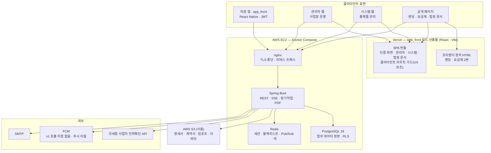

# 01 시스템 아키텍처

> **대상**: insadesk 전체 구조 · 컴포넌트 구성 · 계층 책임 · 핵심 설계 원칙 · 횡단 관심사 · 범위 경계
> **작성일**: 2026-08-03
> **개정일**: 2026-09-07 — 인용 갱신 — **V0711**(idempotency_records 신설)로 테이블 60 → **61종** · RLS 정책 169 → **172**(SELECT·INSERT 각 61 · UPDATE **46** · **DELETE 4는 불변**) · 유일성 강제 59 → **60** · PK 60 → **61**. 정본 [../05_database/README.md](../05_database/README.md). 나머지 수치는 전건 불변
> **개정일**: 2026-09-06 — 백엔드 스택 전환(D-21 · ADR-25~29) 반영 — 조감도 API 노드와 애플리케이션 컴포넌트 행을 common · core · modules **3축**으로 재작성(검산 core 9 + modules 13 = **22** 유지) · 컨테이너 검산의 nestjs → **backend** · 계층 책임과 횡단 관심사의 가드·인터셉터·클라이언트 확장 어휘를 Spring Security 필터 체인 · AOP 어드바이스 · **DataSource 프록시**로 치환 · 범위 경계의 패키지 문장을 **빌드 축이 표면별로 갈린다**로 재작성
> **개정일**: 2026-08-09 — 전역 수치 정합 — 테이블 58 → **60종** · enum 32 → **33종** 인용 갱신
> **개정일**: 2026-08-08 — 외부 의존을 v1 호출 지점 기준 3 → **2종**(국세청 진위확인 · SMTP)으로 정정하고 FCM은 v1 미사용 이월로 부정형 표기
> **개정일**: 2026-08-08 — 웹 프론트엔드 전환(D-20 · ADR-24) 반영. 조감도·컴포넌트·계층 책임에서 미들웨어·서버 컴포넌트 셸·증분 재생성 노드를 제거하고 web_front를 프리렌더 정적 2본 + Vite SPA로 재기술, 범위 경계 3항을 웹 호스팅 계층 1항으로 통합, 공통 인프라 모듈 10 → **9**(푸시 모듈 제외)
> **원천**: docs_ref2/features.md(전 기능 공통 제약 · 정기작업 · 권한 모델) · docs_ref2/requirements_p0.md(REQ-GLB 전역 규칙) · docs_ref2/schema_p0.md(RLS 2단 방어 · 롤 분리) · 확정 결정 D-03 · D-06 · **D-20** · **D-21**(D-05는 D-21로 대체됨)([../01_overview/06_design_decisions.md](../01_overview/06_design_decisions.md)) · [09_decision_records.md](./09_decision_records.md) ADR-24 · **ADR-25~29**

insadesk는 **클라이언트 3표면 + 공개 웹**이 하나의 REST 표면을 공유하고, **판정·계산·확정은 전부 서버가 수행**하는 구조다. 웹(web_front)은 **React + Vite 단일 애플리케이션**이며 Vercel이 그 빌드 산출물(프리렌더 정적 HTML 2본 + SPA 번들)을 배달한다(D-20). API·데이터베이스·캐시(backend)는 AWS EC2 단일 인스턴스의 Docker Compose에서 실행되며, 브라우저와 앱이 API 서브도메인을 직접 호출한다(D-03). 파일은 서울 리전 S3에 두고, 외부 의존은 **국세청 사업자 진위확인 API · SMTP(메일)** 둘이다 — 푸시(FCM)는 v1에 호출 지점을 두지 않는다(NTF-02 이월).

이 구조의 성격은 두 문장으로 요약된다 — **판정은 서버가 하고 데이터베이스가 마지막으로 막는다.** 사업장 격리는 서비스 레이어 1차 검증과 PostgreSQL RLS 2차 심층방어의 **2단 방어**가, 금액의 정확성은 순수 함수로 격리된 급여 계산 계층과 확정 시 값 동결이, 법정 의무의 이행은 정기작업과 보존 기산일 관리가 담당한다. 클라이언트 가드는 전부 사용성 보조이며 신뢰 경계가 아니다.

스택의 정확한 버전 정본은 [../08_tech_stack/README.md](../08_tech_stack/README.md)이고, 본 문서는 구조 관점만 담는다. 기술 선택의 채번·논증은 [09_decision_records.md](./09_decision_records.md)가 정본이다.

---

## 시스템 조감도

브라우저와 앱은 업무 데이터를 **API 서브도메인에서 직접** 받는다(D-03 · D-20). Vercel이 담당하는 것은 **빌드 산출물의 배달**뿐이다 — 프리렌더 정적 HTML 2본과 SPA 번들을 내려주고 프리렌더되지 않은 경로는 fallback 리라이트로 SPA 진입점을 돌려준다. **요청 시점에 실행되는 웹 서버 코드가 없고 업무 데이터가 Vercel을 경유하는 경로도 두지 않는다.** 법정 문서와 요금제 수치도 브라우저가 API에서 직접 조회한다.

---

## 컴포넌트 구성

| 계층 | 구성 요소 | 근거 결정 |
|------|-----------|----------|
| 직원 앱 | app_front — React Native. 출퇴근 체크인 · 근태 · 휴가 · 명세서 열람 · 계약 서명 · 알림. 인증은 JWT(기기 보안 저장소) | D-06 저장소 3분할 |
| 웹 단일 앱 | web_front — React + Vite + React Router 하나가 공개 페이지 · 관리자 웹 · 시스템 웹을 담는다. 랜딩·요금제는 빌드 시점 프리렌더 정적 HTML이고 나머지 전 경로는 SPA다. **산출물 한 벌 · Vercel 프로젝트 1개 · 웹 오리진 하나** | D-20 · ADR-24 |
| 클라이언트 라우트 가드 | 부팅 시 진입 컨텍스트 조회 결과로 보호 라우트 진입을 분기한다. **신뢰 계층이 아니라 UX 보조**이며 권한·역할·사업장을 판정하지 않는다 | D-20 · REQ-AUT-12 |
| API 진입 | nginx — TLS 종단 · api 서브도메인 리버스 프록시 · SSE 버퍼링 해제 · 업로드 크기 제한. 외부 진입점은 이것 하나다 | D-03 |
| 애플리케이션 | Spring Boot — 패키지는 **common · core · modules 3축**이다. common은 응답 봉투·값 객체 같은 횡단 공통을 담고 도메인 지식과 인프라 의존을 갖지 않으며, core는 인프라 관심사 **9**종, modules는 문서 도메인 **13**과 1:1이고 각 모듈이 controller · dto · service · repository **4계층**을 갖는다. 검산: core 9 + modules 13 = **22**. REST · SSE · 정기작업 8건 · PDF 렌더링을 한 프로세스가 담당한다. 모듈 구성 정본은 [../08_tech_stack/03_backend.md](../08_tech_stack/03_backend.md)다 | D-06 · D-21 |
| 데이터 | PostgreSQL 18 — 업무 데이터의 유일한 정본. 테이블 **61종** · enum **33종** · 전 업무 테이블 RLS ENABLE + FORCE | D-21 |
| 캐시·중계 | Redis — 웹 세션 스토어 · JWT 블랙리스트 · 재인증 토큰 · SSE Pub/Sub · 정기작업 분산락 | ADR-11 |
| 파일 | AWS S3 ap-northeast-2(서울) — 명세서 PDF · 근로계약서 교부본 · 직원 문서함 · 임포트 원본 · 익스포트 산출물 · 아바타 · 데이터베이스 백업 | ADR-16 |
| 외부 연동 | 국세청 사업자 진위확인 API(WRK-01 게이트) · FCM(앱 푸시 채널 — **v1 알림 배달은 인앱 단일 채널**이며 푸시 알림 기능은 v1에 두지 않는다) · SMTP(명세서 교부·계약 교부·재설정 메일) | D-11 |

컨테이너는 **4종**이다. 검산: nginx 1 + backend 1 + postgres 1 + redis 1 = **4**. 구성·포트·볼륨의 정본은 [08_deployment_topology.md](./08_deployment_topology.md)다.

---

## 계층 책임

| 계층 | 책임 | 하지 않는 것 |
|------|------|--------------|
| 직원 앱 · 관리자 웹 · 시스템 웹 | 표시 · 입력 수집 · 클라이언트 검증(사용성 보조) · 역할별 요소 노출 · 에러 코드의 한국어 문안 매핑 | **권한 판정 · 금액 계산 · 집계 · 지오펜스 판정.** 화면에서 합계를 다시 더하지 않는다 |
| 공개 페이지 | 정적 콘텐츠 표시 · 검색 노출 · 약관 활성 버전 게시(클라이언트 조회) | 업무 데이터 조회 · 인증 상태 분기 |
| 클라이언트 라우트 가드 | 보호 라우트 진입 분기 · 공개 경로 통과 · 복귀 대상 전달 | **권한·역할·사업장 판정.** 진입을 허용해도 자격 판정은 서버가 다시 한다 |
| 레이아웃 셸 | 레이아웃 · 내비게이션 · 스켈레톤 렌더 | **사업장·사용자 정보 선렌더.** 셸이 그린 값과 API 응답이 갈리는 자리를 만들지 않는다 |
| nginx | TLS 종단 · 프록시 · SSE 버퍼링 해제 · 요청 크기 제한 | 인증·인가 판정 · 업무 라우팅 |
| Spring Security 필터 체인 · AOP 어드바이스 | 인증 컨텍스트 수립 · 멤버십·역할 1차 검증 · 활성 사업장 스코프 주입 · 감사 기록 | 계산 규칙 정의 · 격리의 최종 보증(RLS가 진다) |
| 도메인 서비스 | 업무 규칙 판정 · 상태 전이 · 차단 조건 · 트랜잭션 경계 · 멱등키 소비 | 표시 서식 · 타 도메인 리포지토리 직접 조회 |
| 급여 계산 계층 | 값 객체 입출력의 순수 함수로 항목·시간·공제를 산출한다 | **데이터베이스 접근 · 현재 시각 조회 · 난수.** 접근 자체가 불가능하게 격리한다 |
| PostgreSQL | 행 접근(RLS) · 무결성(제약 · EXCLUDE · 부분 UNIQUE) · 상태 전이 가드(트리거) · 기준값 기간 겹침 차단 | 표시 서식 · 외부 호출 |
| Redis | 세션·토큰 수명 관리 · 이벤트 팬아웃 · 정기작업 락 | **업무 데이터 보관.** Redis가 비어도 데이터는 잃지 않는다 |
| S3 | 파일 원본 보관 · 서버 측 암호화 | 접근 인가 판정(서버가 검증 후 스트리밍한다) |

---

## 핵심 설계 원칙

1. **판정은 서버가 한다.** 클라이언트 검증은 사용성 보조이고 최종 판정은 서버다(REQ-GLB-19 · REQ-AUT-12). 지오펜스 반경 판정 · 마감 잠금 판정 · 인원 한도 판정 · 최저임금 미달 판정을 클라이언트가 내리면, 그 판정을 우회한 요청을 서버가 검증할 방법이 없다.
2. **조용히 틀린 값이 오류보다 나쁘다.** 기준값이 하나라도 없으면 계산을 차단한다(REQ-GLB-09). 임의 기본값·직전 연도 값·0 대체는 오류를 오류로 드러내지 않고 **틀린 금액을 정상 결과처럼 만들어** 명세서로 교부한다. 계산 차단은 실패가 아니라 정상 동작이다.
3. **계산 결정론을 구조로 강제한다.** 급여 계산은 값 객체만 받는 순수 함수 계층에 격리한다(REQ-GLB-01). 규칙으로만 두면 새 함수 하나가 현재 시각을 읽는 순간 재현성이 깨지고, 그 사실은 이듬해 과거 명세서를 재출력할 때 드러난다.
4. **부동소수점을 어떤 경로로도 쓰지 않는다.** 금액은 정수 원 · 시간은 정수 분 · 비율은 고정소수점 십진이다(REQ-GLB-02). 데이터베이스 타입이 맞아도 드라이버가 값을 부동소수점으로 역직렬화하면 원칙은 ORM 계층에서 조용히 깨진다.
5. **격리는 2단 방어다.** 서비스 레이어가 멤버십·역할·사업장 스코프를 1차 검증하고, RLS가 행 단위로 2차 강제한다. 어느 한쪽만 두면 새 엔드포인트 하나의 누락이 곧 타 사업장 데이터 유출이거나, "권한 없음"과 "데이터 없음"이 구분되지 않아 잘못된 안내가 나간다.
6. **확정 결과는 덮어쓰지 않는다.** 정정은 원본 무효화 후 정정본 신규 생성 체인으로만 한다(REQ-GLB-13). 명세서는 지급일 기준 3년 보존·교부 대상이라 재출력 불일치가 그대로 분쟁이 된다.
7. **인가 축을 두 개로 나눈다.** 사업장 업무 데이터는 멤버십·역할로, 명세서·근로계약·급여이력은 **본인 소유권**으로 인가한다(REQ-SLP-09 · CMP-07). 멤버십으로만 인가하면 퇴사 순간 본인 명세서 접근이 끊기는데 그 자체가 위반 소지다.
8. **좁은 표면이 1차 통제다.** 외부 진입점은 nginx 하나 · 데이터베이스와 캐시는 호스트 포트로 노출하지 않고 · 파일은 공개 URL을 만들지 않으며 · 실시간은 서버에서 클라이언트로 가는 단방향뿐이다. 넓히지 않는 것 자체가 방어다.

---

## 횡단 관심사

| 관심사 | 구현 위치 | 정본 |
|--------|-----------|------|
| 인증·세션 | 웹은 Redis 세션 스토어 + HttpOnly 쿠키 + CSRF 토큰 · 앱은 JWT 회전 + Redis 블랙리스트 | [02_authn_session.md](./02_authn_session.md) |
| 인가·격리 | Spring Security 필터 체인·서비스 계층 1차 · PostgreSQL RLS 2차 · **DataSource 프록시**의 사용자 컨텍스트 주입(나머지 세션 변수는 서버 전용 경로가 켠다) | [03_multitenancy_rls.md](./03_multitenancy_rls.md) |
| 데이터 흐름·캐시 | TanStack Query 쿼리 키에 활성 사업장·역할 포함 · 낙관적 갱신 금지 목록 | [04_request_data_flow.md](./04_request_data_flow.md) |
| 렌더링·검색 노출 | 표면별 렌더링 모드 표(프리렌더 정적 · CSR) · 메타데이터 · sitemap · robots | [05_rendering_seo.md](./05_rendering_seo.md) |
| 계산 결정론 | 순수 함수 계층 · 기준값 조회 계약 · 항목별 1회 반올림 · 확정 시 값 동결 | [06_payroll_engine.md](./06_payroll_engine.md) · [../03_requirements/01_global_rules.md](../03_requirements/01_global_rules.md) |
| 정기작업 | Spring @Scheduled 시각 트리거 + ShedLock 기반 Redis 분산락 + 멱등키. v1 **8건** | [07_batch_scheduling.md](./07_batch_scheduling.md) · [../02_features/15_scheduled_jobs.md](../02_features/15_scheduled_jobs.md) |
| 실시간·파일 | SSE + Redis Pub/Sub 팬아웃 · S3 비공개 버킷 + 1회용 토큰 서버 스트리밍 | [10_realtime_files.md](./10_realtime_files.md) |
| 에러 규약 | {domain}.{snake_case} + HTTP 상태. 403(적용 대상 아님)과 422(전제 미충족)를 구분한다 | [../09_glossary/02_error_codes.md](../09_glossary/02_error_codes.md) |
| 시각·시간대 | 저장은 UTC · 일 경계 판정과 표시는 KST · date는 문자열 · 프로세스 시간대 고정 | [../09_glossary/05_units_and_time.md](../09_glossary/05_units_and_time.md) |
| 감사 | audit_logs INSERT 전용 · 사유 필수 액션 집합 · 전후값에 개인정보 원문 금지 | [../10_security/04_pii_protection.md](../10_security/04_pii_protection.md) |
| 배포·운영 | GitHub Actions 품질 게이트 · Vercel 자동 배포 · 이미지 레지스트리 경유 Compose 재기동 | [08_deployment_topology.md](./08_deployment_topology.md) |
| 기술결정 | ADR 채번·논증 | [09_decision_records.md](./09_decision_records.md) |

---

## 범위 경계

- **웹 호스팅 계층에 업무 데이터 경로·프록시를 두지 않는다.** 서버 변이 경로도 API 중계 경로도 BFF 계층도 만들지 않으며, 인증 후 데이터 경로는 API 서브도메인 직접 호출 하나뿐이다(D-03 · D-20). 경로를 하나 더 열면 앱이 쓸 수 없는 경로가 생겨 같은 업무 로직이 두 벌이 되고 인가 판정 지점이 갈라진다.
- **웹에 서버 실행 계층을 두지 않는다.** 서버 렌더·서버 미들웨어·요청 시점 실행 코드가 없고 웹 산출물은 정적 HTML과 번들뿐이다(ADR-24).
- **모노레포로 묶지 않는다.** backend · web_front · app_front는 각각 독립 패키지이고 **빌드 축이 표면별로 갈린다** — backend는 Gradle 단일 프로젝트이고 web_front · app_front는 npm이며 npm workspaces를 쓰지 않는다(D-06 · D-21). 스키마 정본 db_migration/은 저장소 루트에 있으나 빌드·배포 단위가 아니라 네 번째 패키지가 아니다.
- **마이크로서비스로 나누지 않는다.** 단일 프로세스 모놀리식이고 도메인 경계는 모듈로만 표현한다.
- **WebSocket을 쓰지 않는다.** 실시간 요구가 서버에서 클라이언트로 가는 단방향뿐이라 SSE로 충분하다.
- **별도 작업 큐 인프라를 두지 않는다.** 정기작업 8건은 시각 트리거 + 분산락 + 멱등키로 처리한다.
- **PG 결제 연동을 v1에 두지 않는다.** 요금제 변경은 수동 요청·플랫폼 조정 경로로만 처리한다.
- **홈택스·4대보험 포털로 직접 전송하지 않는다.** TAX 범위는 신고자료 생성과 기한 안내까지이며 제출은 사업주가 수행한다.
- **관리형 데이터베이스·컨테이너 오케스트레이터·수평 확장을 v1에 두지 않는다.** 단일 EC2 Compose 구성이며 확장 판단 시점은 [../01_overview/05_priorities_roadmap.md](../01_overview/05_priorities_roadmap.md)에 둔다.
- **스테이징 환경을 상시 운영하지 않는다.** v1 환경은 운영 단일 + 로컬 개발이다.
- **다국어를 v1에 두지 않는다.** 표시 언어는 ko-KR 단일이고 통화는 원, 시간대는 KST 고정이다.

---

## 관련 문서

- 인증·세션 → [02_authn_session.md](./02_authn_session.md)
- 멀티테넌시·RLS → [03_multitenancy_rls.md](./03_multitenancy_rls.md)
- 요청·데이터 흐름 → [04_request_data_flow.md](./04_request_data_flow.md)
- 렌더링·SEO → [05_rendering_seo.md](./05_rendering_seo.md)
- 급여 계산 엔진 → [06_payroll_engine.md](./06_payroll_engine.md)
- 배포 토폴로지 → [08_deployment_topology.md](./08_deployment_topology.md)
- 기술결정 정본 → [09_decision_records.md](./09_decision_records.md)
- 제품 결정 정본 → [../01_overview/06_design_decisions.md](../01_overview/06_design_decisions.md)
- 기술 스택·버전 정본 → [../08_tech_stack/README.md](../08_tech_stack/README.md)
