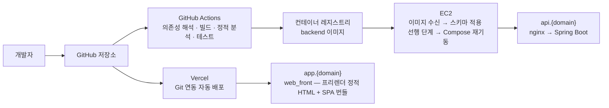

# 08 배포 토폴로지

> **대상**: 배포 흐름 · EC2 Compose 구성 · 도메인과 TLS · 마이그레이션 실행 순서 · 백업과 복구 · 환경 분리 · 모니터링과 로그
> **작성일**: 2026-08-03
> **개정일**: 2026-09-07 — 인용 갱신 — **V0711**(idempotency_records 신설)로 테이블 60 → **61종** · RLS 정책 169 → **172**(SELECT·INSERT 각 61 · UPDATE **46** · **DELETE 4는 불변**) · 유일성 강제 59 → **60** · PK 60 → **61**. 정본 [../05_database/README.md](../05_database/README.md). 나머지 수치는 전건 불변
> **개정일**: 2026-09-07 — 배포 이미지 실측 반영 — backend 컨테이너 실행 조건에 **cap-add=SYS_ADMIN** 등재(Chromium 샌드박스를 켠 채 돌리기 위한 것이며 기본 seccomp 아래에서는 브라우저가 기동을 거부한다) · 이미지의 한글 폰트 서술에 **매칭 규칙까지 포함**을 명시(폰트만 담으면 브라우저 설치가 끌고 온 중문 서체가 앞서 PDF가 생성에 성공하면서 중문 자형으로 렌더된다). 구성 확정값 정본은 [../08_tech_stack/03_backend.md](../08_tech_stack/03_backend.md) 배포 이미지 구성 절이다. **컨테이너 검산 4는 불변**
> **개정일**: 2026-09-06 — 백엔드 스택 전환(D-21 · ADR-25~29) 반영 — 배포 흐름 mermaid와 Compose 표의 nestjs → **backend**(이미지 축을 Java 런타임 베이스로) · 품질 게이트를 표면별 수단 분기로 재작성 · **마이그레이션 실행 순서 절 전면 개정**(back/db/migration/ → 루트 **db_migration/** · 자체 러너 → **Flyway** · 적용은 **애플리케이션 프로세스 밖의 선행 실행 단계**이고 프레임워크의 기동 시 자동 적용에 맡기지 않으며 **소유자 자격 증명을 애플리케이션에 두지 않는다** · 적용 실패면 애플리케이션이 시작되지 않고 그것이 배포 중단 · 이력 테이블을 업무 스키마 밖으로 · 적용 대상 경계 행 신설) · 복구 절차의 적용 단계 정합. 컨테이너 검산 **4**는 불변 — 적용 단계는 같은 이미지의 1회성 실행이지 상시 컨테이너가 아니다
> **개정일**: 2026-08-08 — 웹 프론트엔드 전환(D-20 · ADR-24) 반영. 웹 배포 산출물을 프리렌더 정적 + SPA 한 벌로 기술하고 빌드 명령·SPA fallback 리라이트 실측 단서 추가, 프리뷰를 고정 픽스처 렌더로 확정, 마이그레이션 절에 보정 번호·적용 이력 키·07xx 게이트 범위 행 추가
> **원천**: 확정 결정 D-03(서브도메인) · D-06(저장소 3분할) · **D-20**(웹 프론트엔드 전환) · **D-21**(백엔드 스택 전환)([../01_overview/06_design_decisions.md](../01_overview/06_design_decisions.md)) · [09_decision_records.md](./09_decision_records.md) ADR-20 · ADR-24 · **ADR-25 · ADR-27** · [../08_tech_stack/04_data_infra.md](../08_tech_stack/04_data_infra.md) · [../08_tech_stack/05_tooling_devops.md](../08_tech_stack/05_tooling_devops.md) · docs_ref2/schema_p0.md(마이그레이션 파일 배치 · 롤 분리)

배포 대상은 둘이다 — **web_front는 Vercel**, **backend는 AWS EC2 단일 인스턴스의 Docker Compose**다. app_front는 스토어 배포이며 자동화를 v1에 두지 않는다. 갈라 둔 이유는 워크로드가 다르기 때문이다. 정적 산출물 배달·프리뷰는 Vercel이 잘하고, SSE 장기 연결·정기작업·PDF 렌더링처럼 수명이 긴 작업은 서버리스 실행 모델과 맞지 않는다.

**웹 산출물은 한 벌이다** — 한 번의 빌드가 프리렌더 정적 HTML 2본과 SPA 번들을 함께 만들고, 하나의 Vercel 프로젝트가 그것을 배달한다(D-20 · ADR-24). 요청 시점에 실행되는 웹 서버 코드가 없으므로 배포 대상에 서버 런타임 설정이 없다.

운영 규모는 **상시 근로자 1~30인 사업장**을 대상으로 하는 v1이다. 컨테이너 오케스트레이터·관리형 데이터베이스·수평 확장을 두지 않으며, 이 선택의 대가(단일 인스턴스 가용성 · 논리 백업 기준 복구 목표)를 감추지 않고 문서에 남긴다.

---

## 배포 흐름



| 대상 | 트리거 | 수행 |
|------|--------|------|
| 공통 품질 게이트 | 푸시 · 풀 리퀘스트 | **단계 이름은 표면 공통이고 수단만 갈린다** — backend는 의존성 해석 → 컴파일 → 정적 분석 → 테스트, web_front · app_front는 락 파일 그대로 설치 → 타입 검사 → 정적 분석 → 테스트다. 클라이언트 축은 OpenAPI 타입 재생성 후 차이 검사를 뒤에 둔다(ADR-20 · ADR-29) |
| web_front | 기본 브랜치 반영 | Vercel Git 연동이 배포한다. 빌드는 **react-router build 한 번**이며 산출물은 프리렌더 정적 HTML 2본 + SPA 번들 한 벌이다. Actions는 배포 명령을 갖지 않는다(ADR-20) |
| backend | 기본 브랜치 반영 | Actions가 컨테이너 이미지를 빌드해 레지스트리에 푸시하고, EC2가 이미지를 받아 **같은 이미지로 스키마 적용 선행 단계를 돌린 뒤** Compose를 재기동한다. **적용은 애플리케이션 프로세스 밖이다**(ADR-27) |
| app_front | 푸시 · 풀 리퀘스트 | 타입 검사 · 정적 분석 · 단위 테스트까지만 한다. 스토어 배포 자동화를 v1에 두지 않는다 |

- **품질 게이트가 실패하면 이미지를 만들지 않는다.** 실패한 커밋이 레지스트리에 올라가면 어떤 태그가 배포 가능한지 알 수 없다.
- backend 재기동은 순간 중단을 동반한다. **무중단 배포를 v1에 두지 않으며** 배포 창을 업무 시간 밖으로 잡는다.
- **약관 활성 버전 전환은 배포를 개시하지 않는다.** 법정 문서 본문은 클라이언트가 조회하므로 재빌드·재검증 트리거가 필요 없다(D-20). 저장소 연동이 web_front의 유일한 배포 개시 경로다.

---

## EC2 Compose 구성

컨테이너 **4종**을 단일 인스턴스에서 실행한다. 검산: nginx 1 + backend 1 + postgres 1 + redis 1 = **4**.

| 컨테이너 | 이미지 | 역할 | 포트·의존 |
|---------|--------|------|----------|
| nginx | nginx 안정 계열 | TLS 종단 · api 서브도메인 리버스 프록시 · SSE 버퍼링 해제 · 업로드 크기 제한 · Let's Encrypt 인증서 사용 | 443 공개 · 80은 리다이렉트 전용. backend에 의존 |
| backend | Java 런타임 베이스 위의 backend 빌드 이미지 | REST API · SSE · 정기작업 · PDF 렌더링 | 내부 네트워크만. postgres · redis에 의존 |
| postgres | PostgreSQL 18 | 업무 데이터 정본 | **호스트 포트 미노출**. 데이터 디렉터리는 호스트 볼륨 |
| redis | Redis 안정 계열 | 세션 · 블랙리스트 · 재인증 토큰 · Pub/Sub · 정기작업 분산락 | **호스트 포트 미노출**. AOF 파일 볼륨 |

- **외부 진입점은 nginx 하나다.** 데이터베이스와 캐시를 호스트 포트로 노출하지 않는다 — 보안 그룹 규칙 하나가 데이터베이스를 인터넷에 여는 사고 경로가 된다.
- backend 이미지에는 PDF 렌더링용 헤드리스 브라우저와 한글 폰트, 그리고 스키마 정본 db_migration/을 포함한다. 렌더 시점에 외부에서 폰트를 내려받지 않는다. **폰트는 담는 것만으로 부족하고 매칭 규칙까지 이미지가 갖는다** — 브라우저 설치가 끌고 온 중문 서체가 앞서면 PDF가 생성에 성공하면서 중문 자형으로 나온다(구성 정본 [../08_tech_stack/03_backend.md](../08_tech_stack/03_backend.md) 배포 이미지 구성 절).
- **backend 컨테이너는 cap-add=SYS_ADMIN 으로 띄운다.** Chromium 샌드박스를 켠 채로 돌리기 위한 것이다 — 기본 seccomp 아래에서는 샌드박스가 서지 못해 브라우저가 기동을 거부하고, 그 자리에서 샌드박스를 끄는 선택은 렌더 대상 HTML이 컨테이너 안에서 임의 코드로 이어질 표면을 연다.
- 컨테이너에는 헬스체크를 걸고, backend는 데이터베이스·캐시 연결이 성립해야 준비 상태가 되게 한다. **스키마 적용은 기동 전에 이미 끝나 있으므로 준비 판정 조건이 아니다.** 준비되지 않은 컨테이너로 트래픽을 넘기지 않는다.
- **스키마 적용 선행 단계를 컨테이너로 세지 않는다.** 같은 backend 이미지를 1회성으로 실행하고 끝나면 종료하는 단계이며 상시 컨테이너가 아니다 — **검산 4종은 그대로다**(ADR-27 · 순서 정본은 아래 마이그레이션 실행 순서 절).
- 프로세스 시간대는 **Asia/Seoul 고정**이다(정본 [07_batch_scheduling.md](./07_batch_scheduling.md)).
- 정확한 버전 표기의 정본은 [../08_tech_stack/04_data_infra.md](../08_tech_stack/04_data_infra.md)다.

---

## 도메인·TLS

| 항목 | 구성 |
|------|------|
| 웹 | app.{domain} — Vercel 프로젝트 1개. 커스텀 도메인 전제이며 **공개 페이지와 인증 후 화면이 같은 오리진**이다(D-20). 웹 오리진을 둘로 나누지 않으므로 쿠키 스코프와 교차 출처 허용 목록이 전환의 영향을 받지 않는다 |
| API | api.{domain} — EC2의 nginx가 받는다 |
| SPA 딥링크 | 프리렌더되지 않은 경로는 호스팅 계층의 **fallback 리라이트**가 SPA 진입점을 돌려준다. **프리렌더 HTML과 fallback의 우선순위, 후행 슬래시 정규화 설정과의 상호작용은 프리뷰 배포에서 실측 확인한다**(착수 시 단서) |
| 인증서 | **Let's Encrypt**. nginx가 TLS를 종단하고 갱신 작업을 호스트에서 정기 실행한 뒤 설정을 다시 읽게 한다 |
| 쿠키 스코프 | Domain=.{domain} · SameSite=Lax(D-03). 두 서브도메인이 세션을 공유하는 근거다 |
| 리다이렉트 | 80은 443으로 영구 리다이렉트한다. 평문 접근 경로를 남기지 않는다 |
| 전송 보안 | HSTS를 적용한다. 서브도메인 포함 여부는 두 서브도메인 모두 TLS 전용이므로 포함으로 둔다 |
| CORS | app.{domain} 오리진만 허용하고 자격 증명 포함을 허용한다. 와일드카드 오리진을 쓰지 않는다 |
| SSE 경로 | 버퍼링을 끄고 읽기 타임아웃을 길게 잡는다. 프록시 기본값으로 두면 이벤트가 묶여 지연되거나 연결이 끊긴다 |
| 업로드 | 요청 본문 크기 상한을 nginx와 애플리케이션 양쪽에 걸되 **nginx 상한을 애플리케이션 상한보다 1MB 크게** 잡는다(문서함 10MB 기준 nginx 11MB). 같게 두면 경계 요청을 nginx가 먼저 끊어 응답이 애플리케이션 에러 규격이 아닌 프록시 오류로 나간다 — **413은 애플리케이션에서 나가야 한다**. 대상별 상한의 정본은 [10_realtime_files.md](./10_realtime_files.md) 크기 상한 절이다 |

**인증서 갱신 실패는 서비스 중단으로 직결된다.** 갱신 결과를 확인하는 절차를 운영 점검에 포함하고, 만료 임박을 알림 대상으로 둔다.

---

## 마이그레이션 실행 순서

스키마 정본은 **저장소 루트 db_migration/의 raw SQL 파일**이고 적용은 **Flyway가 애플리케이션 프로세스 밖의 선행 실행 단계**에서 수행한다(D-21 · ADR-27) — 같은 이미지·같은 런타임을 쓰되 **프레임워크의 기동 시 자동 적용에 맡기지 않는다.** ORM이 스키마를 소유하지 않는 축은 그대로이며 엔티티는 수기로 작성하고 스키마는 검증만 한다. 파일은 db_migration/V{NNNN}__{name}.sql이며 번호 구간 배치의 정본은 [../05_database/10_migrations_seed.md](../05_database/10_migrations_seed.md)다. **db_migration/은 backend/ 밖이라 클래스패스가 아니므로 파일 시스템 위치로 지정**하고 배포 이미지가 그 경로를 담는다.

```plain
① 새 이미지 수신
② 스키마 적용 선행 단계 (Flyway · 새 이미지의 1회성 실행 · 마이그레이션 롤로 접속)
   ├─ 적용 이력 테이블 조회 → 미적용 파일만 번호 오름차순으로 선별
   ├─ 파일 단위 트랜잭션으로 적용 → 적용 이력 기록
   ├─ 실패 → 그 파일에서 중단하고 단계가 실패로 끝난다
   └─ 성공 → 마이그레이션 롤 연결을 닫고 단계가 종료된다
③ 적용 실패? ── 예 → 애플리케이션을 시작하지 않는다 = 배포 중단. 기존 컨테이너를 그대로 유지한다
└─ 아니오 → ④ Compose 재기동 → ⑤ 헬스체크 통과 확인 → ⑥ 배포 완료

※ 애플리케이션은 ④에서야 뜨고, 그때 마이그레이션 자격 증명을 갖지 않는다
※ 최초 배포에 한해 ④ 안에 한 단계가 더 있다 — ②와 다른 단계다
   ④-1 SUPER_ADMIN 부트스트랩 (애플리케이션 기동 절차 안 · 애플리케이션 롤 경로 · 마이그레이션이 아니다)
       환경변수로 주입한 자격 증명으로 SUPER_ADMIN 계정을 1회 원자 생성한다
       이미 존재하면 건너뛰고 · 환경변수가 없으면 경고 로그만 남기고 기동을 계속한다
       정본: ../05_database/10_migrations_seed.md 초기 SUPER_ADMIN 부트스트랩 절
```

| 항목 | 계약 |
|------|------|
| 실행 시점 | **애플리케이션 프로세스 밖의 선행 실행 단계**이며 애플리케이션보다 앞선다. 적용이 끝나야 애플리케이션이 시작되므로 새 코드가 옛 스키마에 붙는 창이 생기지 않는다. **프레임워크의 기동 시 자동 적용에 맡기지 않는다**(ADR-27 버린 대안 ⑤) |
| 실행 롤 | 마이그레이션 롤과 애플리케이션 롤을 분리하고 애플리케이션 롤은 DDL 권한을 갖지 않는다. **소유자 자격 증명을 애플리케이션 프로세스에 두지 않는다** — 선행 단계만 마이그레이션 롤로 접속하고 끝나면 종료하며, 애플리케이션은 애플리케이션 롤 자격만 갖고 기동한다(ADR-27 ④). 합치면 애플리케이션 결함 하나가 정책을 지우거나 강제 옵션을 끌 수 있어 **2단 방어의 두 번째 층이 애플리케이션 결함에 종속된다**(시크릿 인벤토리 정본 [../10_security/03_secrets_keys.md](../10_security/03_secrets_keys.md)) |
| 실패 처리 | **배포를 중단한다.** 적용에 실패하면 애플리케이션을 시작하지 않으므로 실패한 마이그레이션 위에 애플리케이션이 올라오지 않으며, 기존 컨테이너를 그대로 유지한다 |
| 재적용 방지 | 적용 이력 테이블이 이미 적용된 파일을 건너뛴다. **이력 테이블은 업무 스키마 밖에 둔다** — 업무 스키마에 두면 도구가 만든 테이블 하나 때문에 테이블 **61종** 검수 기준이 즉시 어긋난다(ADR-27) |
| 적용 이력 키 | **번호(버전)다.** 파일명은 이력 행에 함께 기록되지만 동일성 판정의 축은 번호이며, **번호는 유일하고 오름차순이어야 한다.** 그래서 **같은 번호를 가진 파일이 둘 이상이면 적용을 시작하지 않고 단계를 실패시킨다** — 그러면 애플리케이션도 시작되지 않는다. 같은 번호가 둘이면 적용 순서가 미정의가 되어 환경마다 달라지기 때문이며, **이 검사는 도구의 기본 동작이라 따로 구현하지 않는다**(ADR-27). **번호가 동일성의 축이라는 사실이 번호 재사용 금지와 보정을 다음 미사용 번호로 두는 규약의 근거다** — 번호를 재사용하면 도구가 이미 적용된 것으로 보고 새 파일을 건너뛴다 |
| 수정 금지 | 이미 적용한 파일을 고치지 않는다 |
| 보정 | **다음 미사용 번호로 새 파일**을 만든다. 번호를 재사용하지 않으며 같은 번호에 접미를 붙인 파일을 만들지 않는다(ADR-27 · 배치 정본 [../05_database/10_migrations_seed.md](../05_database/10_migrations_seed.md)) |
| 적용 대상 경계 | db_migration/ 바로 아래의 V{NNNN}__ 파일만 적용한다. **하위 폴더 provisioning/ 과 seed/ 는 적용 대상이 아니다** — 롤 생성은 환경 준비 절차이고 기준값 시드는 확인 절차를 동반하므로 기동 경로에 두지 않는다(ADR-27) |
| 무결성 검증 게이트 | 07xx 구간은 **구조 무결성만** 검증한다 — 제약 · 정책 · 트리거 · 인덱스의 존재와 형태다. **필수 기준값 커버리지를 게이트에 넣지 않는다**: 요율·세액표는 확인 전 시드 금지 대상이고 SUPER_ADMIN 부트스트랩은 마이그레이션 뒤에 오므로, 커버리지를 게이트로 두면 최초 배포가 구조적으로 통과할 수 없다. 기준값 충족은 **배포 전 수동 확인 절차**([../02_features/12_system.md](../02_features/12_system.md))와 **계산 시점 차단**(REQ-GLB-09)이 담당한다 |
| 파괴적 변경 | 열 삭제·타입 축소는 배포 단위를 나눈다 — 먼저 코드가 그 열을 쓰지 않게 배포하고, 다음 배포에서 스키마를 좁힌다 |
| 롤백 | 자동 스키마 롤백을 두지 않는다. 되돌림이 필요하면 되돌리는 마이그레이션을 새 번호로 작성한다 — 자동 역방향 적용은 데이터 손실을 조용히 만든다 |
| 시드 | 기준값 시드는 **확인된 값만** 넣는다. 미확인 값을 임의로 채우지 않는다 — 계산이 차단되는 것이 정상 동작이다 |
| 최초 부트스트랩 | 최초 기동 시 **환경변수로 주입한 자격 증명으로 SUPER_ADMIN 계정을 1회 원자 생성**한다. **SUPER_ADMIN이 하나도 없으면 시스템 웹에 아무도 들어갈 수 없어** 기준값·약관·요금제를 등록할 경로가 없다. **마이그레이션이 아니라 애플리케이션 기동 절차**이며 자격 증명을 마이그레이션 파일에 담지 않는다 — 담으면 해시든 평문이든 형상관리에 영구히 남고 전 환경이 같은 계정으로 열린다. 절차·차단 조건의 정본은 [../05_database/10_migrations_seed.md](../05_database/10_migrations_seed.md)다 |

---

## 백업

| 항목 | 계약 |
|------|------|
| 방식 | **논리 백업 일 1회** → 서울 리전 S3 업로드 |
| 실행 위치 | 애플리케이션이 아니라 **호스트 스케줄**에서 실행한다. 애플리케이션 장애와 백업을 독립시킨다 |
| 대상 | 업무 데이터베이스 전체. Redis는 백업 대상이 아니다 — 세션·토큰은 유실돼도 재로그인으로 복구되고 업무 데이터가 아니다 |
| 암호화 | 백업 객체도 서버 측 암호화 대상이다. **백업에는 마스킹되지 않은 원본이 담긴다** |
| 시점 복구 | **WAL 아카이빙 기반 시점 복구를 v1에 두지 않는다**(ADR-22). 베이스 백업·아카이브 보존·복구 리허설을 함께 운영해야 하고, 타깃 규모에서 하루치 재입력이 감당 가능하다고 판단한다 |
| 복구 목표 | 논리 백업 단독이므로 **RPO는 최대 24시간 · RTO는 4시간**이다. 이 값을 그대로 인정하고 문서화한다 |
| 보존 주기 | 일일 백업과 월 단위 장기 보관으로 나눈다. **정확한 보존 일수는 미확인 — 운영 비용 확정 전 임의 값 고정 금지** |
| 복구 검증 | 백업 파일이 실제로 복원되는지 정기적으로 확인한다. **업로드 성공을 백업 성공으로 간주하지 않는다.** 실행 자리는 저장소의 docker/backup/ 이고 복원 검증이 **테이블 수와 RLS 정책 수를 함께** 센다 — 정책이 빠진 복원은 데이터가 다 있어도 실패로 판정한다 |

---

## 복구 절차 개요

```plain
① 장애 판정 (데이터 손상 · 인스턴스 상실 · 잘못된 마이그레이션)
② 서비스 차단 — nginx를 점검 응답으로 전환해 추가 쓰기를 막는다
③ 복구 대상 시점 선택 — 가장 최근 검증된 백업
④ 데이터베이스 복원 — **롤 프로비저닝이 복원보다 앞선다**
   ├─ 인스턴스 생존 → 새 데이터베이스로 복원 후 전환
   └─ 인스턴스 상실 → 인스턴스 재생성 → 롤 프로비저닝 → 복원 → Compose 기동
⑤ 정합 확인 — 최근 급여 확정 · 명세서 발행 · 근태 마감 상태를 표본 검증한다
⑥ 손실 구간 파악 — 백업 시점 이후 입력분을 목록화해 재입력 안내를 준비한다
⑦ 서비스 재개 → 사용자 공지 (손실 구간과 재입력 대상을 명시한다)
⑧ 사후 기록 — 원인 · 조치 · 재발 방지 항목을 남긴다
```

- **④의 롤 프로비저닝을 건너뛰면 RLS 가 통째로 사라진 데이터베이스가 선다.** 정책은 `TO insadesk_app` 으로 롤을 지목하므로 롤이 없는 대상에 복원하면 **정책 생성이 전건 실패하고 테이블과 데이터만 남는다** — 복원은 "성공"으로 끝나고 테넌트 격리만 없어지므로 **드러나지 않는다.** 실측(2026-09-12 · 복원 검증 실행) — 롤 없이 복원한 결과 정책 173 중 3개만 살아남았고 테이블 61 · 데이터는 전부 정상이었다. 덤프에서 권한을 빼지 않는 것(`--no-privileges` 금지)도 같은 이유다: GRANT 가 없으면 앱 롤이 아무 테이블도 읽지 못하고, 그것을 우회하려 슈퍼유저로 붙는 순간 2단 방어가 사라진다.
- **⑥을 건너뛰지 않는다.** 복구가 끝났다고 알리고 손실 구간을 알리지 않으면, 근로자가 이미 찍은 출퇴근이 사라진 채로 급여가 마감된다.
- 파일(S3)은 데이터베이스와 독립적으로 남는다. 데이터베이스 복원 후 **파일 메타 행과 실제 객체의 불일치**를 점검 대상으로 둔다.

---

## 환경 분리

| 환경 | 구성 | 데이터 |
|------|------|--------|
| 운영 | Vercel 프로젝트 1개 + EC2 인스턴스 1대 | 실데이터 |
| 로컬 개발 | 컨테이너로 데이터베이스·캐시를 띄우고 애플리케이션은 로컬에서 실행한다 | 시드 데이터만. **운영 데이터를 로컬에 내려받지 않는다** |
| Vercel 프리뷰 | 공개 페이지·화면 확인용 | **실데이터에 접근하지 않는다.** 업무 API 주소를 운영으로 지정하지 않으며, **프리뷰 빌드는 고정 픽스처(요금제·약관 샘플)로 렌더하고 운영 API를 호출하지 않는다** — 상시 스테이징이 없어 프리뷰가 읽을 비운영 원천이 달리 없다 |

- **상시 스테이징 환경을 v1에 두지 않는다.** 인스턴스·데이터베이스·시크릿·기준값 시드를 한 벌 더 운영해야 하고, 실데이터가 아닌 스테이징은 급여 계산 검증에 큰 도움이 되지 않는다. 계산 검증은 골든 케이스가, 격리 검증은 통합 테스트가 담당한다.
- **주민번호·계좌가 담긴 데이터를 개발 환경에 두지 않는다.** 개발 환경은 접근 통제·감사·암호화가 운영 수준이 아니라 그 자체가 유출 경로가 된다.
- 환경변수는 운영이 EC2 호스트 환경 파일, web_front가 Vercel 대시보드다. **웹 클라이언트에 노출되는 값은 VITE_ 접두 변수뿐**이며 그 접두가 없는 변수를 클라이언트 코드가 참조하면 정적 분석 규칙이 차단한다(ADR-18). 저장소에는 키 이름만 담은 예시 파일을 둔다. 기동 시 스키마를 검증해 필수 값 누락이면 부팅을 실패시킨다.
- 시크릿 종류·회전 주기의 정본은 [../10_security/03_secrets_keys.md](../10_security/03_secrets_keys.md)다.

---

## 모니터링·로그

소규모 단일 인스턴스 운영이 전제다. **관측을 위한 별도 인프라를 세우지 않는다** — 지표 수집기·시계열 데이터베이스·대시보드를 운영하는 비용이 얻는 정보보다 크다.

| 축 | 채택 | 내용 |
|----|------|------|
| 애플리케이션 로그 | 구조화 JSON을 표준 출력으로 | 요청 식별자 · 사용자 식별자 · 사업장 식별자 · 에러 코드 · 소요 시간을 필드로 남긴다. **개인정보 원문·금액·토큰을 로그에 남기지 않는다** |
| 로그 보관 | 컨테이너 로그 드라이버 로테이션 | 호스트 디스크에 **30일** 보관하고 크기 상한으로 회전시킨다. 디스크가 차서 데이터베이스가 멈추는 경로를 막는다 |
| 에러 추적 | **Sentry 채택** | 스택 트레이스와 에러 코드만 전송한다. 요청 본문 · 주민번호 · 계좌 · 금액 · 개인 식별 정보를 전송하지 않으며, 사용자 식별은 내부 식별자로만 한다 |
| 감사 로그 | 데이터베이스 audit_logs | 운영 로그와 분리된 축이다. 법정 보존 대상이며 로테이션 대상이 아니다 |
| 인프라 지표 | 인스턴스 기본 지표 알람 | CPU · 디스크 사용률 · 상태 검사에 임계값 알람을 건다 |
| 헬스체크 | 컨테이너 헬스체크 + 외부 가동 확인 | api 서브도메인의 상태 경로를 외부에서 주기 확인한다. 내부 헬스체크만 두면 인스턴스가 통째로 죽었을 때 아무도 모른다 |
| 정기작업 관측 | 실행 이력 테이블 | 마지막 성공 시각을 조회할 수 있게 하고 실패는 운영 알림으로 통보한다 |
| APM·메트릭 대시보드 | **미채택** | 분산 추적·지표 수집 스택을 v1에 두지 않는다. 단일 프로세스라 추적할 서비스 경계가 없다 |
| 로그 집계 SaaS | **미채택** | 로그에 개인정보를 남기지 않더라도 외부 전송 표면을 하나 더 만든다. 필요해지는 시점에 도입한다 |

---

## 관련 문서

- 시스템 구조 → [01_system_architecture.md](./01_system_architecture.md)
- 정기작업 실행 구조 → [07_batch_scheduling.md](./07_batch_scheduling.md)
- 실시간·파일 → [10_realtime_files.md](./10_realtime_files.md)
- 데이터·인프라 스택 정본 → [../08_tech_stack/04_data_infra.md](../08_tech_stack/04_data_infra.md)
- 툴링·CI/CD·환경변수 정본 → [../08_tech_stack/05_tooling_devops.md](../08_tech_stack/05_tooling_devops.md)
- 마이그레이션·시드 정본 → [../05_database/10_migrations_seed.md](../05_database/10_migrations_seed.md)
- 시크릿·키 관리 정본 → [../10_security/03_secrets_keys.md](../10_security/03_secrets_keys.md)
- 비기능·기술 운영 요구사항 → [../03_requirements/15_nonfunctional.md](../03_requirements/15_nonfunctional.md)
- 기술결정 → [09_decision_records.md](./09_decision_records.md)
