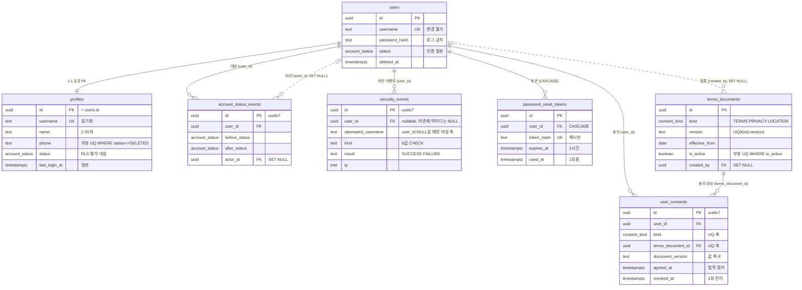

# 01_auth — 인증·계정

> **대상**: insadesk — 계정 도메인 7테이블(users · profiles · terms_documents · user_consents · account_status_events · security_events · password_reset_tokens)
> **작성일**: 2026-08-03
> **개정일**: 2026-09-16 — **V0739** 반영 — security_events.kind CHECK 6 → **8값**(PROFILE_CHANGE · RECOVERY_EMAIL_CHANGE — 프로필 수정 AUT-05 · [../06_api/03_auth.md](../06_api/03_auth.md) #17). **text + CHECK라 enum 종수 · 테이블 · 컬럼 · 정책 수는 움직이지 않는다**
> **개정일**: 2026-09-06 — 백엔드 스택 전환(D-21 · ADR-25~29) 반영 — password_hash 비고를 라이브러리 열거(bcrypt 또는 argon2) → **argon2id 적응형 해시**로 알고리즘 고정. 원문·해시 미보존 계약과 컬럼 구성은 불변
> **개정일**: 2026-08-08 — DB 커버리지 감사 반영 — security_events 6 → **8컬럼**(user_id nullable · attempted_username · result 신설 · kind 5 → **6값**) · users 상태-부수컬럼 CHECK **2종** 신설 · profiles phone·recovery_email 형식 CHECK 신설 · guard_consent_mutation의 철회 대상 kind 한정 · password_reset_tokens 소비 가드 등재 · sync_account_status 부착 정정 · AUT-05 지칭 정정
> **원천**: docs_ref2/schema_p0.md 테이블 — auth(7) · docs_ref2/requirements_p0.md REQ-AUT · REQ-PRV · REQ-SYS-15·16 · 2026-08-08 DB 커버리지 감사(AUT 발견 5·7·9·10·11·13·15·16·17)

계정은 사업장과 무관한 **전역 도메인**이다. workplace_id 스코프를 갖지 않는 유일한 업무 영역이며, 사업장 권한은 계정이 아니라 멤버십([02_workplace.md](./02_workplace.md))에서 분리 부여한다.

**인증 정본은 users이고 표시·RLS 평가 정본은 profiles다.** users.status를 바꾸면 sync_account_status() 트리거가 profiles.status로 전파하며, RLS 헬퍼가 profiles.status를 평가하므로 정지·탈퇴가 즉시 행 가시성에 반영된다. 두 테이블은 PK를 공유하는 1:1이다.

**동의는 문서 1건당 1행이다.** 위치정보 동의(consent_kind = LOCATION)를 약관·개인정보와 같은 축에 두되 버전별·개별 철회가 가능해야 하므로, 한 행에 여러 문서 버전을 담는 구조를 쓰지 않는다.

---

## 테이블 목록

| # | 테이블 | 보관 내용 | PK 타입 |
|---|--------|----------|---------|
| 1 | users | 로그인 자격증명 정본 — 아이디·비밀번호 해시·계정 상태·정지·탈퇴 | uuid |
| 2 | profiles | 사용자 프로필 — 성명·연락처·복구 이메일·아바타·최근 로그인 | uuid(공유 PK) |
| 3 | terms_documents | 약관·개인정보·위치정보 문서 버전 마스터(전역) | uuid |
| 4 | user_consents | 동의 이력(append-only) — 문서 1건당 1행·철회 시각 | uuid(uuidv7) |
| 5 | account_status_events | 계정 상태전이 감사(append-only) | uuid(uuidv7) |
| 6 | security_events | 보안 이벤트(append-only) — 비밀번호·재인증·로그인 실패 | uuid(uuidv7) |
| 7 | password_reset_tokens | 재설정 토큰 — 해시 저장·1회용 | uuid |

전역 테이블 번호는 본 폴더가 배정하며 **1~60이 연속한다**. 계정 도메인이 1~7을 받는다.

---

## 테이블 명세

### 1. users — 로그인 자격증명

기능ID **AUT-01·02·08·09** · 요구사항 REQ-AUT-01·02·17·20·21·22.

| 컬럼명 | 타입 | NULL | 키 | 설명 |
|--------|------|:--:|----|------|
| id | uuid | N | PK | 식별자. DEFAULT gen_random_uuid(). profiles와 공유한다 |
| username | text | N | UQ | 로그인 아이디. 4~20자 · 첫 글자 영소문자. CHECK 정규식 ^[a-z][a-z0-9]{3,19}$. **변경 불가** |
| password_hash | text | N | | **argon2id 적응형 해시**. **원문·해시를 로그·응답·감사 전후값에 남기지 않는다** |
| status | account_status | N | | 인증 정본. DEFAULT ACTIVE |
| suspended_until | timestamptz | Y | | 정지 만료 예정 시각 |
| suspend_reason | text | Y | | 정지 사유. 제재 시 서버가 필수 강제한다 |
| deleted_at | timestamptz | Y | | 탈퇴·강제삭제 시각 |
| created_at | timestamptz | N | | DEFAULT now() |
| updated_at | timestamptz | N | | DEFAULT now() + set_updated_at 트리거 |

- **9컬럼이다.**
- 제약: PK(id) · UQ(username) · CHECK username 정규식 · **CHECK status <> 'DELETED' OR deleted_at IS NOT NULL** · **CHECK status <> 'SUSPENDED' OR (suspended_until IS NOT NULL AND suspend_reason IS NOT NULL)**.
- 인덱스: users_pkey · UNIQUE(username) · 부분 (status) WHERE status = 'SUSPENDED' — autoUnsuspendAccounts 배치 대상 조회.
- 트리거: sync_account_status() **AFTER UPDATE OF username, status**(profiles에 동기화) · guard_account_status_transition()(ACTIVE↔SUSPENDED · →DELETED만 허용, **DELETED 종단**) · guard_last_super_admin()(마지막 SUPER_ADMIN 보유 계정의 SUSPENDED·DELETED 차단 → system.last_super_admin/409) · **guard_account_deletion_blocked()**(owned_workplace_count(id) > 0이면 DELETED 전이 차단 → auth.owner_must_transfer/409 · 신설) · set_updated_at().
- **상태-부수컬럼 CHECK 2종이 신설이다**(2026-08-08 감사 발견 9). deleted_at이 빈 DELETED 계정은 보존·파기 기산일을 갖지 못하고, 사유·해제 예정일이 빈 SUSPENDED 계정은 REQ-AUT-09가 요구하는 정지 안내를 반환할 수 없다. 같은 형태의 강제가 workplaces(CLOSED → closed_at · retention_until)와 contracts(ARCHIVED → retention_until)에 이미 있으므로 users만 비어 있던 비대칭을 없앤다.
- **sync_account_status()를 INSERT에 부착하지 않는다**(감사 발견 17). 가입 트랜잭션의 순서가 users INSERT → profiles INSERT라 INSERT 시점에는 동기화할 profiles 행이 아직 없다. 최초 값은 profiles INSERT가 직접 싣는다.
- **탈퇴 차단은 서비스와 트리거 두 층이 함께 강제한다**(감사 발견 4). owned_workplace_count(uid)는 이미 CLOSED를 제외한 소유 사업장 수를 반환하므로, 그 헬퍼를 호출하는 가드를 DELETED 전이에 붙여 REQ-AUT-20의 차단이 서비스 결함으로 뚫리지 않게 한다.
- **username 예약어 금지는 서버 검증이 담당한다**(REQ-AUT-01). 예약어 목록이 운영 중 늘어나는 정책값이라 CHECK에 박지 않으며, 이 항목은 제약으로 표현하지 않는 것의 등재 대상이다([07_constraints_integrity.md](./07_constraints_integrity.md) 한계 절).
- **전 명령이 서버 전용이다** — RLS는 app.system_context = 'on' 정책만 두고 앱 롤에 직접 grant를 주지 않는다. DELETE 정책이 없다. **아이디 중복 확인·재설정 요청 같은 미인증 경로는 이 플래그를 켜지 않고 반환 타입이 좁은 SECURITY DEFINER 함수(is_username_available · request_password_reset)로만 users에 닿는다**(감사 발견 3 · 정본 [08_rls_policies.md](./08_rls_policies.md) 헬퍼 절).
- **profiles.status를 동기화하는 이유가 성능이 아니라 정합이다**: RLS 헬퍼가 profiles.status를 평가하므로 동기화가 끊기면 정지된 계정이 계속 행을 본다.

### 2. profiles — 사용자 프로필

기능ID **AUT-01·02·09** · 요구사항 REQ-AUT-02·04·10·21.

| 컬럼명 | 타입 | NULL | 키 | 설명 |
|--------|------|:--:|----|------|
| id | uuid | N | PK · FK → users.id | 공유 PK. 1:1 확장 |
| username | text | N | UQ | users에서 동기화. **표시용이다 — RLS 평가에 쓰지 않는다** |
| name | text | N | | 성명. CHECK 2~50자 |
| phone | text | Y | UQ* | 국내 010 또는 E.164. **CHECK 정규식 ^(01[016789][0-9]{7,8}\|\\+[1-9][0-9]{7,14})$** · **부분 UQ (phone) WHERE status <> 'DELETED'** → auth.phone_taken/409. **NULL은 비식별화된 탈퇴 계정에만 허용한다** |
| recovery_email | text | Y | | 재설정 링크 수신 주소. **CHECK 이메일 형식** |
| avatar_url | text | Y | | 프로필 이미지 경로. **v1에는 값을 채우거나 바꾸는 표면이 없다** — 프로필 관리(AUT-05)가 v1.1 이월이라 가입 시 NULL로 생성되며, 컬럼은 REQ-AUT-02의 생성 계약을 승계해 둔다 |
| status | account_status | N | | users에서 동기화. RLS 헬퍼의 평가 대상 |
| last_login_at | timestamptz | Y | | 최근 로그인. **정본이며 users에 중복 보관하지 않는다** |
| deleted_at | timestamptz | Y | | **비식별화 시각**. users.deleted_at(탈퇴 처리 시각)과 축이 다르다 — 탈퇴 트랜잭션과 비식별화가 같은 시각이어도 이후 재비식별 실행 시각을 이 컬럼이 갱신한다 |
| created_at | timestamptz | N | | DEFAULT now() |
| updated_at | timestamptz | N | | DEFAULT now() + set_updated_at 트리거 |

- **11컬럼이다.**
- 제약: PK(id) · FK id → users.id · UQ(username) · CHECK name 2~50자 · **CHECK phone 정규식** · **CHECK recovery_email 형식** · **CHECK status <> 'DELETED' OR deleted_at IS NOT NULL**.
- 인덱스: profiles_pkey · UNIQUE(username) · 부분 UQ (phone) WHERE status <> 'DELETED'.
- 트리거: profiles_guard()(본인 UPDATE 시 id·username·status 변경 차단) · set_updated_at().
- **형식 CHECK 2종이 신설이다**(감사 발견 10). phone은 auth.phone_taken 판정의 축이고 recovery_email은 재설정 링크의 발송 대상이므로, 형식이 깨진 값이 들어가면 각각 유일성 판정과 구제 경로가 조용히 어긋난다. 같은 성격의 강제가 workplaces.business_no 정규식에 이미 있다.
- **phone이 NULL 허용인 것은 비식별화 때문이다.** 가입 시점에는 필수 입력이며 서버가 강제하고, NULL이 되는 유일한 경로는 탈퇴 트랜잭션의 프로필 비식별화다.
- **username은 표시용이다**(감사 역방향 점검). **RLS 정책과 헬퍼 어느 것도 이 컬럼을 평가하지 않으며** RLS가 보는 profiles 컬럼은 status 하나다(전수와 개수의 정본은 [08_rls_policies.md](./08_rls_policies.md)다). UNIQUE를 두는 이유는 users.username과의 1:1 동기화가 깨진 상태를 조회 없이 발견하기 위해서다.
- **탈퇴 계정의 전화번호는 재사용 가능하다** — 부분 UQ가 DELETED를 제외하므로 비식별화된 옛 행이 신규 가입을 막지 않는다.
- **서버 전용 UPDATE 경로가 필요하다**(감사 발견 1). 플랫폼 제재·강제 삭제·정지 만료 배치는 처리자와 대상이 다르므로 본인 축(id = current_user_id())만으로는 sync_account_status()의 전파가 성립하지 않는다. UPDATE 정책에 서버 축을 더하는 변경은 [08_rls_policies.md](./08_rls_policies.md)가 정본이다.
- **동료 공개정보는 정책이 아니라 함수로 연다**: SELECT 정책은 본인(id = current_user_id())만 허용하고, 같은 사업장 동료의 이름·아바타·역할은 list_workplace_members() SECURITY DEFINER 함수가 반환한다. 연락처·민감정보는 반환 타입에 없다.

### 3. terms_documents — 약관·문서 버전 마스터 (전역)

기능ID **SYS-11** · 요구사항 REQ-SYS-15·16.

| 컬럼명 | 타입 | NULL | 키 | 설명 |
|--------|------|:--:|----|------|
| id | uuid | N | PK | 식별자 |
| kind | consent_kind | N | UQ* | TERMS · PRIVACY · **LOCATION**. 위치정보법 §18의 별도 동의를 독립 kind로 둔다 |
| version | text | N | UQ* | 버전 문자열. (kind, version) UQ → system.terms_version_conflict/409 |
| title | text | N | | 문서 제목 |
| body | text | N | | 문서 본문 |
| effective_from | date | N | | 발효일 |
| is_active | boolean | N | | DEFAULT false. kind별 활성 정확히 1개 |
| created_by | uuid | Y | FK → users.id (**SET NULL**) | 등록자 |
| created_at | timestamptz | N | | DEFAULT now() |
| updated_at | timestamptz | N | | DEFAULT now() + set_updated_at 트리거 |

- **10컬럼이다.**
- 제약: PK(id) · UNIQUE(kind, version) · **부분 UQ (kind) WHERE is_active** · FK created_by SET NULL.
- 인덱스: terms_documents_pkey · UNIQUE(kind, version) · 부분 UQ (kind) WHERE is_active.
- 트리거: set_updated_at().
- **DELETE가 없다** — 동의에 참조된 버전은 삭제하지 않고 비활성화만 한다. 파괴적 시도는 system.terms_in_use/409다.
- **활성 문서 부재는 404다**: 부분 UQ가 활성 2건을 막지만 0건을 막지는 않으므로, 조회 시 활성 부재는 system.terms_not_found/404로 표면화한다(REQ-SYS-15).
- 전역 마스터라 workplace_id를 갖지 않는다.

### 4. user_consents — 동의 이력 (append-only)

기능ID **PRV-02** · 요구사항 REQ-PRV-02·03 · REQ-SYS-16.

| 컬럼명 | 타입 | NULL | 키 | 설명 |
|--------|------|:--:|----|------|
| id | uuid | N | PK | 식별자. **uuidv7()** |
| user_id | uuid | N | FK → users.id | 정보주체 |
| kind | consent_kind | N | UQ* | TERMS · PRIVACY · LOCATION |
| terms_document_id | uuid | N | FK → terms_documents.id · UQ* | 동의 대상 문서 |
| document_version | text | N | | 동의 당시 버전 **값 복사**. 문서 정정과 무관하게 증거를 고정한다 |
| agreed_at | timestamptz | N | | 동의 시각 — 법적 증거의 핵심 |
| revoked_at | timestamptz | Y | | 철회 시각. **행 삭제 금지 · 시각만 기록** |
| ip | inet | Y | | 동의 시점 IP |
| user_agent | text | Y | | 동의 시점 클라이언트 |
| source | text | N | | CHECK IN ('SIGNUP','REAGREE','SETTINGS') |
| created_at | timestamptz | N | | DEFAULT now() |

- **11컬럼이다.** updated_at을 갖지 않는다 — append-only다.
- 제약: PK(id) · UNIQUE(user_id, kind, terms_document_id) → privacy.consent_version_conflict/409(멱등) · FK user_id · FK terms_document_id · CHECK source 3값.
- 인덱스: user_consents_pkey · UNIQUE(user_id, kind, terms_document_id) · (user_id, kind, agreed_at DESC).
- 트리거: guard_consent_mutation() — user_id·kind·terms_document_id·document_version·agreed_at 변경을 차단하고 **kind = 'LOCATION'인 행에 한해** revoked_at의 NULL→값 1회 전이를 허용한다 · **guard_consent_document_active()**(INSERT 시 terms_document_id가 해당 kind의 is_active 행인지와 document_version이 그 행의 version과 일치하는지 재검증 · 신설).
- **철회 대상을 LOCATION으로 한정하는 것이 신설 조건이다**(감사 발견 15). REQ-PRV-03은 선택 동의만 철회 대상으로 두고 필수 2종(TERMS · PRIVACY)의 철회는 탈퇴 경로 안내로 처리한다. 조건이 없으면 본인이 필수 동의를 철회 상태로 만들 수 있고, 그 순간 재동의 게이트(auth.consent_required)의 판정 입력이 오염된다.
- **활성 버전 재검증이 신설이다**(감사 발견 7). UNIQUE와 FK는 문서의 존재만 보장하고 그 문서가 활성 버전인지를 보지 않는다. 비활성 구버전으로 동의한 행이 성립하면 개정 재동의 판정이 통과해 버린다. document_version은 값 복사이므로 부모 행의 version과의 일치도 같은 가드가 함께 본다.
- **legacy의 단일 행 구조(terms_version + privacy_version 동시 보관)를 폐기했다.** 그 형태로는 위치정보 3종 동의를 버전별로 표현할 수 없고 개별 철회도 불가능하다.
- **재동의는 새 행이다** — 기존 이력을 덮어쓰지 않는다. 철회 후 재동의도 새 문서 버전이면 새 행이 생기고, 같은 문서 재동의는 UQ가 멱등으로 처리한다.

### 5. account_status_events — 계정 상태전이 감사 (append-only)

기능ID **AUT-08** · 요구사항 REQ-AUT-19.

| 컬럼명 | 타입 | NULL | 키 | 설명 |
|--------|------|:--:|----|------|
| id | uuid | N | PK | 식별자. **uuidv7()** |
| user_id | uuid | N | FK → users.id | 전이 대상 계정 |
| before_status | account_status | Y | | 이전 상태. 최초 생성은 NULL |
| after_status | account_status | N | | 이후 상태 |
| reason | text | Y | | 사유. 제재는 서버가 필수 강제한다 |
| suspended_until | timestamptz | Y | | 해제 예정일 |
| actor_id | uuid | Y | FK → users.id (**SET NULL**) | 처리자. 시스템 자동 전이는 NULL |
| created_at | timestamptz | N | | DEFAULT now() |

- **8컬럼이다.** updated_at을 갖지 않는다.
- 제약: PK(id) · FK user_id · FK actor_id SET NULL.
- 인덱스: account_status_events_pkey · (user_id, created_at DESC).
- 트리거: prevent_mutation() — UPDATE·DELETE 전면 차단.
- **actor_id가 SET NULL인 이유는 감사 사실의 존속이다** — 처리자 계정이 사라져도 전이 기록은 남는다.

### 6. security_events — 보안 이벤트 (append-only)

기능ID **AUT-02·05·06·07** · 요구사항 REQ-AUT-10·14·16·25·**26**.

| 컬럼명 | 타입 | NULL | 키 | 설명 |
|--------|------|:--:|----|------|
| id | uuid | N | PK | 식별자. **uuidv7()** |
| user_id | uuid | **Y** | FK → users.id | 대상 계정. **미존재 아이디로의 로그인 실패는 NULL이다** |
| attempted_username | text | Y | | **시도된 아이디**. user_id가 NULL인 실패 기록의 대상 축이며 계정이 특정되는 사건에는 담지 않는다 |
| kind | text | N | | CHECK IN ('LOGIN_SUCCESS','LOGIN_FAILED','PASSWORD_CHANGE','PASSWORD_RESET','LOGOUT_ALL','REAUTH','PROFILE_CHANGE','RECOVERY_EMAIL_CHANGE') |
| result | text | N | | **CHECK IN ('SUCCESS','FAILURE')**. 재설정·재인증의 실패를 성공과 가르는 축이다 |
| ip | inet | Y | | 발생 IP |
| user_agent | text | Y | | 발생 클라이언트 |
| created_at | timestamptz | N | | DEFAULT now() |

- **8컬럼이다.** updated_at을 갖지 않는다.
- 제약: PK(id) · FK user_id · CHECK kind **8값** · CHECK result 2값 · **CHECK user_id IS NOT NULL OR (kind = 'LOGIN_FAILED' AND attempted_username IS NOT NULL)** · **CHECK (kind <> 'LOGIN_SUCCESS' OR result = 'SUCCESS') AND (kind <> 'LOGIN_FAILED' OR result = 'FAILURE')**.
- 인덱스: security_events_pkey · 부분 (user_id, created_at DESC) WHERE user_id IS NOT NULL — 본인·관리자 조회 · 부분 (attempted_username, created_at DESC) WHERE user_id IS NULL — 미존재 아이디 시도 조사 · (kind, created_at DESC).
- 트리거: prevent_mutation().
- **user_id를 nullable로 여는 것이 신설이다**(감사 발견 5). 열거 방지를 위해 아이디 미존재와 비밀번호 불일치를 같은 코드로 통일하는데(REQ-AUT-10), user_id가 NOT NULL이면 **바로 그 미존재 아이디 시도만 기록에서 빠진다.** 침해 조사에서 가장 필요한 사건이 남지 않으므로 대상 축을 attempted_username으로 대체한다.
- **result와 LOGIN_SUCCESS가 신설이다.** kind만으로는 PASSWORD_RESET·REAUTH의 성공과 실패가 구분되지 않아 REQ-AUT-16의 "반복 실패는 보안 이벤트 기록 대상"이 표현되지 않았다. 로그인 두 값은 result와 정합해야 하므로 CHECK가 그 쌍을 고정한다.
- **rate limit 판정 자체는 Redis 카운터가 수행한다**([../04_architecture/02_authn_session.md](../04_architecture/02_authn_session.md) rate limit 절). 본 테이블은 사후 감사·침해 조사의 증거이지 실시간 차단의 입력이 아니다.
- **user_id가 NULL인 행은 본인 조회 축에 잡히지 않는다** — SELECT 정책의 본인 축이 user_id = current_user_id()이므로 미존재 아이디 시도는 시스템 관리자만 본다. 열거 방지와 조사 가능성이 이 지점에서 양립한다.
- **비밀번호 원문·해시를 어떤 컬럼에도 남기지 않는다.** 사건의 종류와 맥락만 기록한다.
- kind를 enum이 아니라 text + CHECK로 둔 이유는 보안 이벤트 종류가 운영 중 늘어나기 때문이다. **실제로 늘었다** — 프로필 수정(AUT-05 · [../06_api/03_auth.md](../06_api/03_auth.md) #17)이 두 값을 더했다(V0739 · 같은 제약 이름으로 DROP · ADD). enum이 아니므로 **enum 종수는 움직이지 않는다.**
- **PROFILE_CHANGE와 RECOVERY_EMAIL_CHANGE를 한 값으로 묶지 않는다.** 복구 이메일은 재설정 링크의 수신처라 그 변경은 계정 탈취 경로의 사건이다 — 침해 조사에서 따로 골라낼 수 있어야 한다. **바뀐 값은 담지 않는다** — 종류와 맥락(IP · user agent)만 남긴다.

### 7. password_reset_tokens — 재설정 토큰

기능ID **AUT-07** · 요구사항 REQ-AUT-15·16·22.

| 컬럼명 | 타입 | NULL | 키 | 설명 |
|--------|------|:--:|----|------|
| id | uuid | N | PK | 식별자 |
| user_id | uuid | N | FK → users.id (**CASCADE**) | 대상 계정. 휘발성 토큰이라 CASCADE를 허용한다 |
| token_hash | text | N | UQ | **해시만 저장**한다. 원문 토큰은 발송 채널에만 존재한다 |
| expires_at | timestamptz | N | | 만료. **DEFAULT now() + interval '1 hour'** |
| used_at | timestamptz | Y | | 사용 시각. 1회용 |
| created_at | timestamptz | N | | DEFAULT now() |

- **6컬럼이다.** updated_at을 갖지 않는다.
- 제약: PK(id) · UNIQUE(token_hash) · FK user_id CASCADE · **CHECK expires_at > created_at**.
- 인덱스: password_reset_tokens_pkey · UNIQUE(token_hash) · 부분 (expires_at) WHERE used_at IS NULL · **(user_id, created_at DESC)** — 발송 빈도 판정의 사후 조회.
- 트리거: **guard_reset_token_consume()**(신설) — token_hash·user_id·expires_at 변경을 차단하고 used_at의 NULL→값 **1회 전이만** 허용한다.
- **1회용을 트리거가 받치는 것이 신설이다**(감사 발견 11). 소비는 서버가 used_at IS NULL 조건부 UPDATE로 수행하지만, 가드가 없으면 이미 소비된 토큰의 used_at을 되돌리거나 만료를 늘리는 UPDATE가 정책만 통과하면 성립한다.
- **DELETED 계정에 대한 발급 차단은 서비스가 판정한다**(REQ-AUT-22). 발급 시점의 계정 상태 조회가 users를 읽는 서버 경로이므로 본 테이블의 제약으로는 표현하지 않는다.
- **전 명령이 서버 전용이다** — RLS는 system_context 정책만 두고 앱 롤에 직접 grant를 주지 않아 클라이언트 접근 경로가 존재하지 않는다.
- **CASCADE가 허용되는 두 테이블 중 하나다**(나머지는 employee_count_snapshot_days). 법정 보존·감사 대상이 아니고 재생성 가능하기 때문이다.

---

## RLS 정책 — 도메인 요약

정책 표현식 전수의 정본은 [08_rls_policies.md](./08_rls_policies.md)다. 본 절은 도메인 축만 요약한다.

| 테이블 | SELECT | INSERT | UPDATE | DELETE |
|--------|--------|--------|--------|--------|
| users | 서버 전용 + **플랫폼 조회 권한**(user:view) | 서버 전용 | 서버 전용 | — |
| profiles | 본인 + **플랫폼 조회 권한**(user:view) | 서버 전용 | 본인(불변 컬럼 제외) + **서버** | — |
| terms_documents | 공개(서버 API 경유) | settings:update | settings:update | — |
| user_consents | 본인 + 서버 감사 | 서버 | revoked_at 1회 세팅만 | — |
| account_status_events | 본인 요약 + 시스템 관리자 | 서버 | — | — |
| security_events | 본인 + 시스템 관리자 | 서버 | — | — |
| password_reset_tokens | 서버 전용 | 서버 전용 | 서버 전용 | — |

대시(—)는 그 명령의 정책이 없다는 뜻이며, RLS는 정책 없는 명령을 기본 거부하므로 **봉인**을 의미한다.

**굵게 표기한 세 축이 2026-08-08 감사로 신설된다**(발견 1 · 8). users·profiles의 플랫폼 조회 축은 REQ-SYS-06의 user:view/search가 정책에 없어 사용자 관리 화면 전체가 system_context 전면 개방에 의존하던 것을 정정하고, profiles UPDATE의 서버 축은 처리자와 대상이 다른 제재·강제삭제·정지 만료 배치에서 profiles.status 동기화가 0행으로 조용히 실패하던 경로를 막는다. 표현식 전수의 확정은 [08_rls_policies.md](./08_rls_policies.md)가 정본이다.

**정지·탈퇴가 본인 소유권 축에는 닿지 않는다**(감사 발견 6). is_workplace_member() 계열은 profiles.status를 평가하지만 명세서·급여 결과·근태·연차의 본인 축은 user_id = current_user_id() 단독이라 계정 상태를 보지 않는다. 퇴사·폐쇄 후 열람권(CMP-07)과 계정 제재는 축이 다르므로, 소유권 축에 상태 조건을 넣을지는 [08_rls_policies.md](./08_rls_policies.md)가 결정할 항목이며 본 문서는 그 축이 계정 상태와 무관함을 사실로 고정한다.

---

## ERD

---

## 관계

| 관계 | cardinality | ON DELETE | 의미 |
|------|:-----------:|:---------:|------|
| users → profiles | 1 : 1 | RESTRICT | 공유 PK. **FK 방향은 profiles.id → users.id라 계정 없는 프로필만 막는다** — 프로필 없는 계정을 막는 것은 제약이 아니라 가입의 단일 트랜잭션이다(REQ-AUT-02) |
| users → user_consents | 1 : N | RESTRICT | 동의 증거는 계정 삭제로 사라지지 않는다 — 탈퇴는 비식별화이지 행 삭제가 아니다 |
| users → account_status_events (user_id) | 1 : N | RESTRICT | 상태전이 감사 |
| users → account_status_events (actor_id) | 0..1 : N | **SET NULL** | 처리자. 행위자 계정과 감사 사실의 존속을 분리한다 |
| users → security_events | **0..1 : N** | RESTRICT | 보안 이벤트. **미존재 아이디로의 로그인 실패는 user_id가 NULL이며 attempted_username이 대상 축을 담는다** |
| users → password_reset_tokens | 1 : N | **CASCADE** | 휘발성 토큰. 법정 보존 대상이 아니다 |
| users → terms_documents (created_by) | 0..1 : N | **SET NULL** | 등록자. 전역 문서는 등록자와 분리 존속한다 |
| terms_documents → user_consents | 1 : N | RESTRICT | 참조된 문서 버전은 삭제 불가 — 비활성화만 한다 |

---

## 특이사항

**계정 도메인만 workplace_id를 갖지 않는다.** 나머지 업무 테이블 전부가 workplace_id NOT NULL 테넌트 스코프인 것과 대비된다. 사업장 권한은 계정 속성이 아니라 workplace_members 멤버십이 부여한다.

- 한 사람이 여러 사업장에 서로 다른 역할로 소속될 수 있고, 사업장 폐쇄·퇴사 후에도 계정은 존속한다.
- 계정 정지·탈퇴가 전 사업장에서 즉시 효력을 갖는 근거가 profiles.status → RLS 헬퍼 경로다.

**탈퇴는 행 삭제가 아니라 상태 전이 + 비식별화다.** users.status = DELETED · deleted_at 세팅으로 처리하고, 동의 이력·보안 이벤트·상태전이 감사는 그대로 남는다. DELETE 정책을 어느 테이블에도 두지 않는다.

- 근거: 동의 시각은 개인정보 처리의 적법성 증거이고, 삭제하면 그 증거가 사라진다.
- 부분 UQ (phone) WHERE status <> 'DELETED'가 재가입 시 전화번호 충돌을 막지 않으면서도 활성 계정의 유일성을 지킨다.

**위치정보 동의를 별도 kind로 분리한 것이 설계 결정이다.** 위치정보법 §18은 개인위치정보 이용·제공에 개인정보 처리방침과 구분되는 별도 동의를 요구하므로, consent_kind에 LOCATION을 두고 terms_documents에 독립 문서 계열을 둔다. GPS 체크인은 kind = LOCATION이고 revoked_at IS NULL인 동의가 없으면 차단된다(privacy.location_consent_required/403).

**재인증 토큰과 refresh token은 DB에 두지 않는다.** REQ-AUT-25의 5분 단기 재인증 토큰과 세션 refresh token은 회전·폐기 빈도가 높고 법정 보존 대상이 아니므로 Redis에 둔다. 본 도메인이 담는 토큰은 password_reset_tokens 하나뿐이다.

**다기기 세션 목록을 v1에 두지 않는다.** 도입 시 user_sessions를 신설하는 확장 지점만 남긴다 — 미사용 테이블·컬럼을 미리 만들지 않는다. **AUT-05는 프로필 관리이며 v1.1 이월 결번이다**([../02_features/01_auth.md](../02_features/01_auth.md)) — 세션 목록을 그 번호로 지칭하지 않는다.

---

## 관련 문서

- 폴더 정본·접근 모델·타입 규약 → [README.md](./README.md)
- 전역 ERD·관계 요약 → [erd.md](./erd.md)
- 제약·enum·인덱스 전수 → [07_constraints_integrity.md](./07_constraints_integrity.md)
- RLS 정책 전수 → [08_rls_policies.md](./08_rls_policies.md)
- 함수·트리거 전수 → [09_functions_triggers.md](./09_functions_triggers.md)
- 마이그레이션 배치(V0010__auth.sql) → [10_migrations_seed.md](./10_migrations_seed.md)
- 멤버십·사업장 권한 → [02_workplace.md](./02_workplace.md)
- 위치정보 확인자료 → [16_privacy.md](./16_privacy.md)
- 기능 명세 → [../02_features/01_auth.md](../02_features/01_auth.md) · [../02_features/13_privacy.md](../02_features/13_privacy.md)
- 요구사항 → [../03_requirements/02_auth.md](../03_requirements/02_auth.md) · [../03_requirements/14_privacy.md](../03_requirements/14_privacy.md)
- API 표면 → [../06_api/03_auth.md](../06_api/03_auth.md) · [../06_api/15_privacy.md](../06_api/15_privacy.md)
