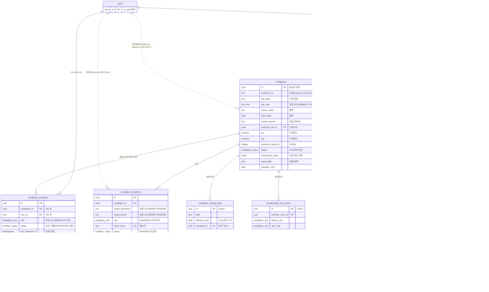

# 02_workplace — 사업장·멤버·상시근로자

> **대상**: insadesk — 사업장 도메인 9테이블(workplaces · business_units · workplace_members · workplace_invitations · workplace_change_logs · membership_role_events · business_verification_logs · workplace_employee_count_snapshots · employee_count_snapshot_days)
> **작성일**: 2026-08-03
> **개정일**: 2026-09-10 — **보험 계열별 관리번호 3열의 쓰기 표면을 등재**한다 — 세 열을 정의하고 REQ-HRM-17 · REQ-TAX-01 이 참조하는데 **어느 표면이 채우는지가 정본에 없어 읽기만 있고 쓰기 경로가 없었다.** 표면은 사업장 정보 수정([../06_api/04_workplace.md](../06_api/04_workplace.md) #4 · MANAGER · 감사 workplace.update)이고 **변경은 workplace_change_logs 에 남는다**(REQ-WRK-09 · REQ-WRK-11). **컬럼 수 · 타입 · 제약 · 인덱스 · 트리거 5종은 전건 불변**이다 — 열이 아니라 그 열을 채우는 자리가 정해진 것이다
> **개정일**: 2026-09-09 — **V0726** 반영 — 강제 폐쇄(close_path = PLATFORM_FORCED)에서 **retention_acknowledged_at 요구를 걷고 열을 NULL로 둔다**. 06_api/14_system #7이 선행조건 5종을 요구하지 않는데 가드가 이 열을 NOT NULL로 요구해 강제 폐쇄 자체가 성립하지 않았다. **#26 workplace_members_select에 플랫폼 축과 서버 배치 축이 결합**됐다(V0726 · V0727 — 정본 [08_rls_policies.md](./08_rls_policies.md)). **테이블 수 · 컬럼 수 · 제약 · 트리거 5종은 전건 불변**이다 — 가드 본문 교체와 ALTER POLICY다
> **개정일**: 2026-08-08 — DB 커버리지 감사 반영(통합) — 보험 계열별 관리번호 2컬럼·원천세 납부 주기 신설(workplaces 33 → **36컬럼**) · 상시근로자 스냅샷에 updated_at 추가(21 → **22컬럼** — 재산정이 같은 행 UPDATE로 바뀐 결과)
> **개정일**: 2026-08-08 — DB 커버리지 감사 반영 — 대표 연락처 컬럼 신설(workplaces 32 → **33컬럼**) · 대표 사업장 부분 UQ 신설(유일성 46 → **47**) · 폐쇄 트랜잭션 컨텍스트 GUC와 잔존 멤버십 차단 가드 등재 · 초대 역할 가드 신설 · 불변 필드 정정 경로 확정 · 스냅샷 재산정 방식 정정(새 행 → **부모 갱신 + 자식 교체**)
> **개정일**: 2026-08-08 — 폐쇄 트랜잭션의 OWNER 멤버십 종료 전이 명문화 · guard_owner_singleton의 0명 허용 조건(CLOSED) 등재 · guard_workplace_readonly 예외 2 → **3**(폐쇄 트랜잭션 내 멤버십 종료 전이)
> **개정일**: 2026-08-03 — pending_verification_until 기한 정책값 14일 확정 반영
> **개정일**: 2026-08-03 — 관계 표에 users → workplace_members (invited_by) SET NULL 행 신설 — 계수 기준(관계 표 ON DELETE 열) 전개 46 완성
> **개정일**: 2026-08-03 — M5 관계 표에 users → workplace_employee_count_snapshots (confirmed_by) SET NULL 행 신설 — SET NULL 전수 누락 보정의 원인 교정
> **원천**: docs_ref2/schema_p0.md 테이블 — workplace(7) · 상시근로자 산정(2) · docs_ref2/requirements_p0.md REQ-WRK · REQ-CMP-01~08 · REQ-GLB-11

**workplaces가 테넌트 루트다.** 계정 도메인([01_auth.md](./01_auth.md))과 전역 마스터를 뺀 모든 업무 테이블이 workplace_id NOT NULL로 이 행에 매달리며, RLS 1차 술어가 그 컬럼이다.

**v1은 사업장당 단일 근무지**이므로 legacy의 worksites를 workplaces가 흡수했다 — 지오펜스 좌표·반경·정확도 한계·보험관리번호·산재 업종코드를 본 테이블이 직접 보유한다.

**상시근로자 스냅샷이 5인·10인 규모 분기의 유일한 근거다.** 규모는 사업장의 고정 속성이 아니라 기준일의 함수이며, 불린 하나가 아니라 **연인원·가동일수·미달일수 정수 원본 + 일자별 시계열 + 임계값별 파생 판정**으로 저장한다. 근거를 정수로 남기지 않으면 시행령 제7조의2 제2항 보정을 재현할 수 없다.

---

## 테이블 목록

| # | 테이블 | 보관 내용 | PK 타입 |
|---|--------|----------|---------|
| 8 | workplaces | 사업장(테넌트 루트) — 사업자정보·지오펜스·보험번호·상태·폐쇄·근태정책 | uuid |
| 9 | business_units | 사업 단위 판정(합산 범위) — 독립성 4항목 선언·근거·유효기간 | uuid |
| 10 | workplace_members | 멤버십 — 역할·상태·가입/이탈·최근 선택 | uuid |
| 11 | workplace_invitations | 직원 초대 — 대상·역할·토큰 해시·만료·응답 | uuid |
| 12 | workplace_change_logs | 사업장 정보 변경 이력(append-only) — 유효 시작일 보유 | uuid(uuidv7) |
| 13 | membership_role_events | 역할 변경 이력(append-only) | uuid(uuidv7) |
| 14 | business_verification_logs | 국세청 진위·상태 확인 로그(append-only) | uuid(uuidv7) |
| 15 | workplace_employee_count_snapshots | 상시근로자 수 산정 스냅샷 — 정수 원본·임계값별 판정 | uuid |
| 16 | employee_count_snapshot_days | 일자별 근로자 수 시계열 | 복합(snapshot_id, count_date) |

business_units와 employee_count_snapshot_days는 **신설 테이블**이다(각각 CMP-08 · REQ-CMP-02).

---

## 테이블 명세

### 8. workplaces — 사업장 (테넌트 루트)

기능ID **WRK-01·02·03·10·11·14** · 요구사항 REQ-WRK-01·06·08·09·10·36.

| 컬럼명 | 타입 | NULL | 키 | 설명 |
|--------|------|:--:|----|------|
| id | uuid | N | PK | 식별자. 전 업무 테이블의 테넌트 스코프 대상 |
| business_no | text | N | UQ* | 사업자등록번호. CHECK 정규식 ^[0-9]{10}$ + 체크섬은 서버 검증. (business_no, site_label) UQ |
| company_name | text | N | | 상호. CHECK 1~100자 |
| owner_name | text | N | | 대표자명. **불변** — 재검증 없이 변경 불가 |
| open_date | date | N | | 개업일. **불변** |
| address | text | Y | | 사업장 주소 |
| industry | text | Y | | 업종 |
| biz_type | text | Y | | 업태 |
| contact_phone | text | Y | | **대표 연락처**(REQ-WRK-09 수정 대상 필드). 사업장 대표 번호이며 개인 연락처가 아니다 |
| site_label | text | N | UQ* | 지점명. DEFAULT '본점'. (business_no, site_label) UQ |
| tax_unit_type | tax_unit_type | N | | DEFAULT GENERAL. BUSINESS_UNIT은 v1 제외이며 값만 예약한다 |
| site_role | site_role | N | | 동일 business_no 그룹 내 PRIMARY 1개 · 나머지 SUB |
| business_unit_id | uuid | Y | FK → business_units.id | **CMP-08 합산 그룹**. 선언이 없으면 NULL |
| lat | numeric(9,6) | Y | | 지오펜스 기준 위도 |
| lng | numeric(10,6) | Y | | 지오펜스 기준 경도 |
| geofence_radius_m | integer | N | | CHECK 50~500. DEFAULT 100 |
| location_accuracy_limit_m | integer | N | | 위치 정확도 한계. DEFAULT 50 |
| insurance_mgmt_no | text | Y | | **고용·산재** 사업장관리번호(REQ-HRM-17 · REQ-TAX-01). **세 열의 쓰기 표면은 사업장 정보 수정 하나**(06_api/04_workplace.md #4 · MANAGER)이며 변경은 workplace_change_logs 에 남는다. **서버가 자릿수·체크 규칙을 판정하지 않아 text 이고 CHECK 를 두지 않는다** — 계열별 형식의 확인된 근거가 없고 틀린 제약은 정당한 번호를 거부한다 |
| pension_mgmt_no | text | Y | | **국민연금** 사업장관리번호. 신고서 4종이 보험 계열마다 다른 식별번호를 요구한다 |
| health_mgmt_no | text | Y | | **건강보험** 사업장관리번호 |
| withholding_payment_cycle | text | N | | 원천세 납부 주기. CHECK IN ('MONTHLY','SEMI_ANNUAL') · DEFAULT 'MONTHLY'. **WITHHOLDING_FILING 기한 파생의 첫째 입력**(REQ-TAX-03) |
| industrial_accident_code | text | Y | | 산재 업종코드. INDUSTRIAL_ACCIDENT_RATE 조회 키 |
| status | workplace_status | N | | DEFAULT PENDING_VERIFICATION |
| pending_verification_until | date | Y | | 미검증 자동 SUSPENDED 기한. 기한 정책값은 **14일**(사용자 확정 2026-08-03 — 기준값 시드) |
| suspend_reason | text | Y | | 정지 사유 |
| suspended_until | timestamptz | Y | | 정지 만료 예정 |
| attendance_policy | jsonb | N | | DEFAULT {}. 자동 휴게 차감 · grace 기본값 · **한도 위반 마감 차단 여부**(REQ-ATT-18) |
| closed_at | timestamptz | Y | | 폐쇄 시각 |
| closed_by | uuid | Y | FK → users.id (**SET NULL**) | 폐쇄 처리자 |
| close_reason | text | Y | | 폐쇄 사유 |
| close_path | text | Y | | CHECK IN ('OWNER_VOLUNTARY','PLATFORM_FORCED') — 자발 폐쇄와 강제 폐쇄를 구분한다 |
| retention_acknowledged_at | timestamptz | Y | | **사업주가** 법정 보존 안내를 확인한 시각. 자발 폐쇄에서 누락이면 workplace.retention_ack_required/422 · **강제 폐쇄에서는 요구하지 않고 NULL로 둔다** |
| retention_until | date | Y | | 보존 만료일 |
| created_by | uuid | Y | FK → users.id (**SET NULL**) | 등록자 |
| created_at | timestamptz | N | | DEFAULT now() |
| updated_at | timestamptz | N | | DEFAULT now() + set_updated_at 트리거 |

- **36컬럼이다.** contact_phone이 REQ-WRK-09의 수정 대상 필드 다섯(상호 · 주소 · 업종 · **대표 연락처** · 기본 근무시간) 중 저장 자리가 없던 하나를 메운다 — 기본 근무시간은 attendance_policy가 담는다.
- **보험 관리번호를 계열별 3컬럼으로 나눈 것은 신고서 양식의 요구다** — 4대보험 취득·상실 신고서는 연금·건강·고용·산재가 서로 다른 사업장 식별번호를 쓰며, 단일 컬럼이면 연금·건강 신고서가 고용·산재 번호로 생성된다. 고용과 산재는 같은 번호를 공유하므로 3컬럼이면 충분하다(REQ-TAX-01).
- **관리번호의 정본은 사업장 행이다** — 직원 행에 복제하면 사업장 값 변경이 직원 수만큼의 갱신을 요구하고 신고자료가 두 출처를 갖는다.
- 제약: PK(id) · UNIQUE(business_no, site_label) → workplace.duplicate_site/409 · **부분 UNIQUE (business_no) WHERE site_role = 'PRIMARY'** → common.conflict/409 · CHECK business_no 정규식 · CHECK company_name 1~100자 · CHECK geofence_radius_m 50~500 · CHECK close_path 2값 · **CHECK (status <> 'CLOSED') OR (closed_at IS NOT NULL AND retention_until IS NOT NULL)** · FK business_unit_id · FK closed_by SET NULL · FK created_by SET NULL.
- 인덱스: workplaces_pkey · UNIQUE(business_no, site_label) · **부분 UNIQUE (business_no) WHERE site_role = 'PRIMARY'** · (status) · 부분 (business_unit_id) WHERE business_unit_id IS NOT NULL · (business_no) — 동일 사업자번호 그룹 조회.
- 트리거 **5종**: guard_workplace_immutable_fields() · guard_workplace_status_transition() · guard_workplace_readonly() · **guard_closed_workplace_members()**(DEFERRABLE CONSTRAINT TRIGGER) · set_updated_at().
- **동일 사업자등록번호의 복수 등록은 합법이다** — 지점을 별도 사업장으로 등록하는 것이 정상 운영이므로 UQ는 business_no 단독이 아니라 (business_no, site_label) 조합이다.
- **대표 사업장은 그룹당 정확히 1개다**(REQ-WRK-06). 부분 UNIQUE가 2개 이상을 막고, 0개는 등록 트랜잭션이 그룹 최초 사업장을 PRIMARY로 세팅해 방지한다 — 제약만으로는 0개를 막지 못하므로 서버가 1차를 맡는다. 이 제약이 없으면 "1개를 PRIMARY로 지정한다"가 강제되지 않는 서술로만 남는다.

#### 상태 전이 가드

guard_workplace_status_transition()이 강제한다.

| 현재 | 허용 전이 |
|------|----------|
| PENDING_VERIFICATION | ACTIVE · SUSPENDED |
| ACTIVE | SUSPENDED · CLOSED |
| SUSPENDED | ACTIVE · CLOSED |
| CLOSED | **없음(종단)** |

- CLOSED 전이 시 close_path · close_reason을 NOT NULL로 강제한다. **retention_acknowledged_at은 close_path가 PLATFORM_FORCED가 아닐 때만 강제**한다(V0726) — 자발 폐쇄에서 보존 안내 확인 없이 잠기면 법정 보존 의무가 고지되지 않은 채 사업장이 닫히기 때문이다.
- **강제 폐쇄에서 그 열을 서버가 대신 채우지 않는다.** 열의 뜻이 "사업주가 확인했다"이고 플랫폼 제재에는 그 확인이 존재하지 않으므로, 채우면 사실이 아닌 값이 남아 **사후에 안내를 받은 사업장과 받지 않은 사업장을 데이터로 분간할 수 없게 된다.** 판정 축을 상태(CLOSED)가 아니라 **경로(close_path)**에 거는 이유도 같다 — 자발 폐쇄의 계약을 흔들지 않는다.
- 표에 없는 전이는 전부 거부한다. CLOSED에서 되돌아오는 경로가 없는 것이 설계다 — 폐쇄는 데이터 잠금이며 되돌리기는 신규 등록이다.

#### 폐쇄 트랜잭션이 멤버십을 함께 종료한다

**CLOSED 전이 트랜잭션은 남은 ACTIVE 멤버십 전부를 종료 상태로 전이시키며, 여기에 OWNER 멤버십이 포함된다**(REQ-WRK-36).

- **OWNER 멤버십을 남겨 두면 계정 탈퇴가 영구히 막힌다.** 탈퇴는 남은 멤버십만 종료하는데, CLOSED 사업장의 OWNER 멤버십을 그때 종료하려 하면 폐쇄 읽기 전용 가드가 그 UPDATE를 차단한다 — 폐쇄가 해소하려던 OWNER 탈퇴 데드락이 그대로 되살아난다.
- 종료 상태는 **LEFT**다. 자발 폐쇄든 강제 폐쇄든 사업장 소멸에 따른 종료이며, CLOSED 사업장은 초대를 만들 수 없으므로 LEFT의 재활성화 여지가 실제로 열리지 않는다.
- 이 전이는 **폐쇄 트랜잭션 안에서만** 성립한다. 폐쇄가 끝난 뒤 CLOSED 사업장의 멤버십을 고치는 경로는 없다.

**서술만으로는 강제되지 않으므로 두 장치를 함께 둔다** — 트랜잭션 컨텍스트 GUC와 잔존 멤버십 차단 가드다.

| 장치 | 내용 |
|------|------|
| **app.workplace_close_context** | 폐쇄 서버 함수가 트랜잭션 안에서만 켜는 GUC. 헬퍼 is_workplace_close_context()가 읽는다. 초대 수락의 app.invitation_accept_context와 **동형**이며 켜는 지점이 서버 함수 한 곳으로 제한된다 |
| **guard_closed_workplace_members()** | workplaces에 부착한 **DEFERRABLE CONSTRAINT TRIGGER**. 트랜잭션 종료 시 status = 'CLOSED'인 사업장에 ACTIVE 멤버십이 남아 있으면 거부한다 → workplace.close_blocked/409 |

- **가드가 DEFERRABLE인 이유는 순서 의존을 만들지 않기 위해서다.** 사업장 상태를 먼저 바꾸든 멤버십을 먼저 종료하든 트랜잭션 종료 시점의 결과만 본다.
- **GUC가 없으면 읽기 전용 가드의 세 번째 예외를 판정할 수단이 없다** — "같은 트랜잭션인가"는 행 값으로 알 수 없다. 컨텍스트가 없으면 예외를 못 만들어 폐쇄가 자기 구성 동작에 막히거나, 조건 없이 열어 CLOSED 이후 멤버십 변경까지 허용된다.
- 두 장치는 **서로를 대체하지 않는다** — GUC는 예외를 여는 열쇠이고 가드는 그 예외를 쓰지 않고 폐쇄를 끝내는 것을 막는 자물쇠다.

#### 폐쇄 후 읽기 전용 강제

guard_workplace_readonly()가 산하 업무 테이블의 INSERT·UPDATE를 차단한다.

- 예외는 셋이다 — **본인 소유권 기반 SELECT** · **payslip_deliveries의 VIEWED·DOWNLOADED INSERT** · **폐쇄 트랜잭션 안에서 일어나는 workplace_members 종료 전이**. 폐쇄 후에도 본인 명세서 열람은 끊기지 않아야 하고 그 열람 기록은 남아야 하며(CMP-07), 멤버십 종료는 폐쇄 자체의 구성 동작이다.
- 세 번째 예외는 **폐쇄 전이와 같은 트랜잭션**으로 한정되며, 그 판정 축은 **app.workplace_close_context GUC**다 — CLOSED 확정 이후의 멤버십 변경은 GUC가 꺼져 있으므로 그대로 차단된다.
- 헬퍼 is_workplace_writable(wid)가 같은 판정을 RLS 정책 쪽에서 수행한다 — status IN ('ACTIVE','PENDING_VERIFICATION')이 아니면 false다.

#### 불변 필드와 재검증 정정 경로

guard_workplace_immutable_fields()가 business_no · owner_name · open_date의 직접 변경을 차단한다 → workplace.immutable_field/422.

- 셋은 국세청 진위 확인의 대조 축이다. 변경을 허용하면 검증된 사업장 신원이 사후에 바뀐다.
- **다만 REQ-WRK-09는 "재검증 없이 변경할 수 없다"이지 "영구 불변"이 아니다.** 무조건 차단만 두면 오탈자 정정 경로가 사라지고, 서술로만 예외를 두면 가드가 그 경로를 식별하지 못한다.
- 정정은 **두 조건을 모두 만족할 때만** 성립한다 — ① 서버 재검증 함수가 켜는 **app.workplace_reverify_context** GUC ② **같은 트랜잭션에서 새로 기록된 business_verification_logs 행**(대상 workplace_id · 변경 후 값 조합 · result = 'MATCH'). 둘 중 하나라도 없으면 가드가 거부한다.
- **로그 조건을 함께 두는 이유는 GUC 단독이면 검증 없이도 열리기 때문이다.** 반대로 로그 조건만 두면 과거 로그를 재활용하는 경로가 열린다 — 시각 기반 유예(직전 N분 내 로그)는 실행 시각 의존이라 쓰지 않는다(REQ-GLB-01).

### 9. business_units — 사업 단위 판정 (신설)

기능ID **CMP-08** · 요구사항 REQ-CMP-08.

**자동 합산은 법적 판단이라 불가하므로 OWNER 선언 + 근거 감사 보존 방식**을 취한다. 사업자등록번호는 판단 기준이 아니므로 workplaces.business_no 그룹과 별개 축이다.

| 컬럼명 | 타입 | NULL | 키 | 설명 |
|--------|------|:--:|----|------|
| id | uuid | N | PK | 식별자 |
| owner_user_id | uuid | N | FK → users.id | 동일 사업주 |
| name | text | N | | 사업 단위 명칭 |
| is_integrated | boolean | N | | **true = 통합 운영 선언 → CMP-01 산정 범위를 합산한다** |
| independence_checklist | jsonb | N | | 4항목 선언값 {hr_independent, budget_independent, has_site_manager, decides_work_conditions} — 전부 boolean |
| rationale | text | N | | 판단 근거 서술. 감사 보존 |
| declared_by | uuid | N | FK → users.id | 선언자(OWNER) |
| declared_at | timestamptz | N | | 선언 시각 |
| effective_from | date | N | | 유효 시작일 |
| effective_to | date | Y | | 유효 종료일. CHECK > effective_from |
| created_at | timestamptz | N | | DEFAULT now() |
| updated_at | timestamptz | N | | DEFAULT now() + set_updated_at 트리거 |

- **12컬럼이다.**
- 제약: PK(id) · CHECK effective_to > effective_from · **EXCLUDE USING gist (owner_user_id WITH =, name WITH =, daterange(effective_from, coalesce(effective_to,'infinity'),'[)') WITH &&)** — 동일 사업주·동일 단위의 기간 겹침 차단 · FK owner_user_id · FK declared_by.
- 인덱스: business_units_pkey · (owner_user_id, effective_from DESC) · EXCLUDE 부수 gist 인덱스.
- 트리거: set_updated_at().
- **선언 변경은 새 행이다** — effective_from을 분할해 기간을 이어 붙인다. 기존 행을 고치면 과거 스냅샷의 산정 범위 근거가 사후에 바뀐다.
- **is_integrated = false인데 산하 사업장이 2개 이상이면 서버가 미판정 위험 경고를 노출한다.** DB로 강제하지 않는다 — 통합 여부는 법적 판단이므로 선언 자체를 막을 근거가 없다.
- workplace_id를 갖지 않는다 — 사업장 위에 놓이는 상위 그룹 축이며 소유자는 사업주 계정이다.

### 10. workplace_members — 멤버십

기능ID **WRK-05·07·08·09** · 요구사항 REQ-WRK-17·21·22·26·27·28.

| 컬럼명 | 타입 | NULL | 키 | 설명 |
|--------|------|:--:|----|------|
| id | uuid | N | PK | 식별자 |
| workplace_id | uuid | N | FK · UQ* | 소속 사업장 |
| user_id | uuid | N | FK → users.id · UQ* | 계정. (workplace_id, user_id) UQ |
| role | workplace_role | N | | OWNER · MANAGER · STAFF |
| status | member_status | N | | **LEFT = 자발 이탈 · REMOVED = 강제 제외** |
| invited_by | uuid | Y | FK → users.id (**SET NULL**) | 초대자 |
| joined_at | timestamptz | Y | | 가입 시각 |
| left_at | timestamptz | Y | | 이탈 시각 |
| leave_reason | text | Y | | 제외 사유. **REMOVED 전이 시 CHECK가 NOT NULL을 강제한다** |
| effective_date | date | Y | | 제외 적용일. **REMOVED 전이 시 CHECK가 NOT NULL을 강제한다**(REQ-WRK-26) |
| last_selected_at | timestamptz | Y | | 사업장 전환 최근순 정렬 축(WRK-06) |
| created_at | timestamptz | N | | DEFAULT now() |
| updated_at | timestamptz | N | | DEFAULT now() + set_updated_at 트리거 |

- **13컬럼이다.**
- 제약: PK(id) · UNIQUE(workplace_id, user_id) · **부분 UQ (workplace_id) WHERE role = 'OWNER' AND status = 'ACTIVE'** → workplace.owner_singleton/409 · **CHECK (status <> 'REMOVED') OR (leave_reason IS NOT NULL AND effective_date IS NOT NULL)** → common.validation_failed/400 · FK workplace_id · FK user_id · FK invited_by SET NULL.
- 인덱스: workplace_members_pkey · UNIQUE(workplace_id, user_id) · 부분 UQ OWNER 활성 · (user_id, status, last_selected_at DESC) — 사업장 전환 목록 · (workplace_id, status, role) — 멤버 목록·한도 카운트.
- 트리거 **5종**: guard_owner_singleton()(DEFERRABLE CONSTRAINT TRIGGER) · guard_member_transition() · guard_member_cap() · guard_role_change() · set_updated_at().
- **DELETE가 없다** — 이탈·제외는 전부 상태 전이다.

#### OWNER 정확히 1명 — 두 방향 강제

- 부분 UQ가 **2명 이상**을 막고, DEFERRABLE CONSTRAINT TRIGGER guard_owner_singleton()이 트랜잭션 종료 시점에 **0명**을 막는다 → workplace.last_owner/409.
- **0명이 허용되는 유일한 조건은 사업장이 CLOSED인 경우다.** 폐쇄 트랜잭션이 OWNER 멤버십을 함께 종료하므로 종료 시점 판정은 workplaces.status = 'CLOSED'인 사업장을 대상에서 제외한다. 이 예외가 없으면 폐쇄가 자기 자신의 구성 동작에 막힌다.
- **한쪽만으로는 "정확히 1명"이 성립하지 않는다.** UQ만 두면 OWNER가 스스로 이탈해 0명이 될 수 있고, 트리거만 두면 동시 승격으로 2명이 될 수 있다.
- DEFERRABLE이라 향후 OWNER 양도의 강등 → 승격(중간 0명 · 최종 1명)과도 양립한다. 양도 자체는 v1 제외다(WRK-10 양도분).

#### 상태 전이 가드

guard_member_transition()이 강제한다.

| 전이 | 허용 |
|------|:----:|
| (신규) → ACTIVE | 허용 |
| LEFT → ACTIVE | **허용**(자발 이탈자의 재초대 수락) |
| ACTIVE → LEFT | 허용 |
| ACTIVE → REMOVED | 허용 |
| REMOVED → ACTIVE | **차단** → workplace.member_state_conflict/409 |

- **표에 없는 전이는 전부 거부한다**(기본 거부). SUSPENDED → ACTIVE가 그 대상이며, 예약값이라 발생하지 않는다는 사실이 차단 근거를 대신하지 않는다 — 사업장 상태 가드와 같은 기본 거부 규율을 멤버십에도 명문화한다(REQ-WRK-17).
- **자발 이탈과 강제 제외를 상태값으로 구분하는 것이 재초대 수락 가능 여부의 유일한 근거다.** 하나의 상태로 합치면 강제 제외된 사람이 재초대 링크로 복귀한다.
- INVITED·SUSPENDED는 v1 미사용 예약값이다 — 초대는 workplace_invitations가 담고 멤버 정지는 계정 정지로 대체한다.
- **제외 선행조건 3종은 이 가드가 판정하지 않는다** — 급여 확정 진행 중 대상자(workplace.payroll_in_progress/409) · 미처리 승인의 필수 승인자(workplace.pending_approver/409) · 필수 인원 미달(workplace.employee_required/409)은 여러 테이블에 걸친 판정이라 서비스 레이어가 강제하며, 어느 층도 맡지 않는 항목이 되지 않도록 한계 등재 대상이다(REQ-WRK-27).

#### 인원 한도 가드

guard_member_cap()이 BEFORE INSERT/UPDATE에서 판정한다.

- ACTIVE 전이 시 active_member_count(wid) >= plan.max_staff_per_workplace이면 subscription.staff_limit_exceeded/402다. 절대 상한은 등급과 무관하게 **30명**이다(plans CHECK).
- 서버가 advisory lock으로 1차 직렬화하고, 트리거는 동시성 우회를 막는 백스톱이다. 초대 수락은 pg_advisory_xact_lock(hashtextextended('wp:'||workplace_id::text, 0)) 획득 후 active_member_count를 재검증하므로 **UQ + 트리거 + advisory lock 3중 방어**가 된다.
- guard_role_change()는 OWNER를 역할 직접 변경으로 만들 수 없게 한다 — OWNER는 사업장 등록 경로 또는 양도 경로(v1 미구현)로만 생긴다.

### 11. workplace_invitations — 직원 초대

기능ID **WRK-04·05** · 요구사항 REQ-WRK-12·13·14·16·18.

| 컬럼명 | 타입 | NULL | 키 | 설명 |
|--------|------|:--:|----|------|
| id | uuid | N | PK | 식별자 |
| workplace_id | uuid | N | FK | 초대 사업장 |
| target_username | text | Y | | 대상 아이디. CHECK target_username IS NOT NULL OR target_phone IS NOT NULL |
| target_phone | text | Y | | 대상 전화번호 |
| role | workplace_role | N | | CHECK IN ('MANAGER','STAFF') — **OWNER 초대는 v1 제외** |
| token_hash | text | N | UQ | **해시만 저장**한다. 재발송 시 직전 토큰을 즉시 무효화한다 |
| status | invitation_status | N | | DEFAULT PENDING |
| message | text | Y | | 초대 메시지 |
| expected_start_date | date | Y | | 고용 시작 예정일 |
| invited_by | uuid | Y | FK → users.id (**SET NULL**) | 초대자 |
| expires_at | timestamptz | N | | 만료. 기본 7일 |
| responded_at | timestamptz | Y | | 응답 시각 |
| created_at | timestamptz | N | | DEFAULT now() |
| updated_at | timestamptz | N | | DEFAULT now() + set_updated_at 트리거 |

- **14컬럼이다.**
- 제약: PK(id) · UNIQUE(token_hash) · CHECK 대상 중 하나 필수 · CHECK role 2값 · FK workplace_id · FK invited_by SET NULL.
- 인덱스: workplace_invitations_pkey · UNIQUE(token_hash) · 부분 UQ (workplace_id, target_username) WHERE status = 'PENDING' · 부분 UQ (workplace_id, target_phone) WHERE status = 'PENDING' — 초대 멱등 · 부분 (expires_at) WHERE status = 'PENDING' — expireInvitations 30분 배치.
- 트리거 **3종**: **guard_invitation_insert_role()** · guard_invitation_transition() · set_updated_at().
- **MANAGER는 STAFF만 초대한다**(REQ-WRK-12). role CHECK는 OWNER 초대만 막을 뿐 MANAGER가 MANAGER를 초대하는 것을 막지 못하고, INSERT 정책의 관리자 축도 두 역할을 구분하지 못한다 — guard_invitation_insert_role()이 role = 'MANAGER'인 초대를 is_workplace_owner(workplace_id)에게만 허용한다 → workplace.invite_role_forbidden/403.
- **역할 변경 축과 같은 이유로 트리거가 필요하다** — guard_role_change()가 MANAGER의 역할 조작을 막는 것과 동형이며, 정책이 표현하지 못하는 "컬럼 값에 따라 역할 요구가 달라지는 조건"을 트리거가 맡는다.
- **클라이언트 직접 ACCEPT를 차단한다** — 수락은 서버 함수 accept_workplace_invitation() 내부에서 켜는 app.invitation_accept_context 플래그가 있을 때만 허용된다. 한도 재검증·멤버십 생성·직원 초안 생성이 한 트랜잭션에 묶여야 하므로 상태만 바꾸는 경로를 열지 않는다.
- **수락 컨텍스트가 사업장 상태 판정을 면제하지 않는다.** SUSPENDED·CLOSED 사업장의 수락은 차단해야 하므로(REQ-WRK-18) 수락 경로의 멤버십 생성도 is_workplace_writable(workplace_id)를 함께 만족해야 한다 — 읽기 전용 가드는 CLOSED만 보므로 컨텍스트만 열면 SUSPENDED가 통과한다.
- **EXPIRED는 배치 전용 전이다.** PENDING 상태에서도 workplace_id·target·role·invited_by의 직접 UPDATE는 불가하다. 종결 상태 재응답은 invitation.already_responded/409다.
- **재발송은 상태 전이가 아니라 새 행 생성이다** — 기존 행의 토큰을 갈아 끼우면 직전 토큰의 무효화 시점이 감사에 남지 않는다.
- **invitation_type 컬럼을 두지 않는다.** v1의 초대 유형은 멤버 초대 하나뿐이라 값이 단일인 컬럼이 되며, 미사용 구조를 미리 만들지 않는다는 규약을 따른다. ADVISOR 초대(WRK-13) 도입 시 되살린다.
- 타인 초대는 RLS가 **행 존재 자체를 노출하지 않는다** — 본인 대상 PENDING만 보인다. **본인 대상 판정 축은 둘이다** — target_username이 본인 계정의 username과 같거나, target_phone이 본인 프로필의 phone과 같은 경우다. 미가입 상태로 받은 초대는 가입 후 phone 축으로 이어지므로 두 축을 모두 두어야 한다.

### 12. workplace_change_logs — 사업장 정보 변경 이력 (append-only)

기능ID **WRK-03** · 요구사항 REQ-WRK-11.

| 컬럼명 | 타입 | NULL | 키 | 설명 |
|--------|------|:--:|----|------|
| id | uuid | N | PK | 식별자. **uuidv7()** |
| workplace_id | uuid | N | FK | 대상 사업장 |
| field | text | N | | 변경 필드 — 지오펜스·주소·상태·근무정책·**보험 계열별 관리번호** 등 |
| before_value | text | Y | | 이전 값. **PII 원문 금지** — 마스킹값·참조 ID·상태값만. **보험 계열별 관리번호는 개인정보가 아니라 사업장 식별번호이므로 원문을 남긴다** — 마스킹하면 "어느 번호에서 어느 번호로 바뀌었나"가 사라져 이력의 목적 자체가 없어진다 |
| after_value | text | Y | | 이후 값. 동일 규율 |
| effective_from | date | Y | | 유효 시작일. **지오펜스 반경 변경은 이 시점 이후 체크인부터 적용되며 과거 판정을 소급하지 않는다** |
| changed_by | uuid | Y | FK → users.id (**SET NULL**) | 변경자 |
| created_at | timestamptz | N | | DEFAULT now() |

- **8컬럼이다.** updated_at을 갖지 않는다.
- 제약: PK(id) · FK workplace_id · FK changed_by SET NULL.
- 인덱스: workplace_change_logs_pkey · (workplace_id, created_at DESC).
- 트리거: prevent_mutation().
- **SELECT는 사업장 관리자 전용이다.** REQ-WRK-11이 열람을 두 축으로 나누고 **STAFF에게 변경 이력과 변경자를 노출하지 않는다**고 명시하기 때문이다.
- **STAFF의 출퇴근 판정 기준은 이 테이블이 아니라 workplaces 현재값으로 충족된다** — 좌표·지오펜스 반경·근태정책은 workplaces 행에 있고 그 SELECT가 멤버 전체에게 열려 있다(정책 #20). 이력을 함께 열면 필요 없는 전후값과 변경자까지 나간다.
- **effective_from이 이 테이블의 존재 이유다.** REQ-WRK-11이 명시 요구하며, 지오펜스 반경 변경의 소급 금지 판정이 attendance_records.applied_geofence_radius_m 동결과 짝을 이룬다.

### 13. membership_role_events — 역할 변경 이력 (append-only)

기능ID **WRK-07** · 요구사항 REQ-WRK-23.

| 컬럼명 | 타입 | NULL | 키 | 설명 |
|--------|------|:--:|----|------|
| id | uuid | N | PK | 식별자. **uuidv7()** |
| workplace_id | uuid | N | FK | 대상 사업장 |
| member_user_id | uuid | N | FK → users.id | 역할 변경 대상 |
| before_role | workplace_role | Y | | 이전 역할. 최초 부여는 NULL |
| after_role | workplace_role | Y | | 이후 역할 |
| reason | text | Y | | 변경 사유 |
| changed_by | uuid | Y | FK → users.id (**SET NULL**) | 변경자 |
| created_at | timestamptz | N | | DEFAULT now() |

- **8컬럼이다.** updated_at을 갖지 않는다.
- 제약: PK(id) · FK workplace_id · FK member_user_id · FK changed_by SET NULL.
- 인덱스: membership_role_events_pkey · (workplace_id, created_at DESC) · (member_user_id, created_at DESC).
- 트리거: prevent_mutation().
- SELECT는 사업장 관리자 + 본인이다 — 자기 역할이 언제 왜 바뀌었는지는 본인이 확인할 수 있어야 한다.

### 14. business_verification_logs — 국세청 진위·상태 확인 로그 (append-only)

기능ID **WRK-02·14** · 요구사항 REQ-WRK-04·05·07.

| 컬럼명 | 타입 | NULL | 키 | 설명 |
|--------|------|:--:|----|------|
| id | uuid | N | PK | 식별자. **uuidv7()** |
| workplace_id | uuid | Y | FK (**SET NULL**) | 등록 전 검증은 NULL |
| business_no | text | N | | 조회 사업자등록번호 |
| owner_name | text | Y | | 조회 대표자명 |
| open_date | date | Y | | 조회 개업일 |
| result | text | N | | CHECK IN ('MATCH','MISMATCH','SUSPENDED','CLOSED','ERROR') |
| tax_type | text | Y | | 과세유형 |
| status_code | text | Y | | 사업 상태 코드 |
| closed_date | date | Y | | 폐업일자 |
| latency_ms | integer | Y | | 외부 호출 지연 |
| ip | inet | Y | | 요청 IP. 동일 IP 대량 시도 탐지 |
| requested_by | uuid | Y | FK → users.id (**SET NULL**) | 요청자 |
| created_at | timestamptz | N | | DEFAULT now() |

- **13컬럼이다.** updated_at을 갖지 않는다.
- 제약: PK(id) · CHECK result 5값 · FK workplace_id SET NULL · FK requested_by SET NULL.
- 인덱스: business_verification_logs_pkey · (business_no, created_at DESC) · 부분 (workplace_id, created_at DESC) WHERE workplace_id IS NOT NULL.
- 트리거: prevent_mutation().
- **CLOSED(폐업)만 등록을 차단하고 SUSPENDED(휴업)는 경고 후 허용한다.** 둘을 한 값으로 합치면 휴업 중 재개 준비를 하는 사업주가 가입할 수 없다.
- **등록 성공 시 기존 로그를 UPDATE하지 않는다** — workplace_id가 연결된 MATCH 로그를 새로 INSERT한다. append-only 원장에서 사후 연결은 새 행이다.
- 원문 민감 데이터는 최소 보관한다.

### 15. workplace_employee_count_snapshots — 상시근로자 수 산정 스냅샷

기능ID **CMP-01** · 요구사항 REQ-CMP-01·04·05·06·07 · REQ-GLB-11.

**단일 is_under_five 불린을 저장하지 않는다.** 취업규칙(10인)·성희롱 예방교육(10인)이 5인과 다른 경계를 쓰므로 임계값별 판정을 각각 보존한다. 경계 판정은 **반올림된 평균이 아니라 정수 비교**이므로 연인원·가동일수·미달일수를 정수 원본으로 남긴다.

| 컬럼명 | 타입 | NULL | 키 | 설명 |
|--------|------|:--:|----|------|
| id | uuid | N | PK | 식별자 |
| workplace_id | uuid | N | FK · UQ* | 대상 사업장 |
| business_unit_id | uuid | Y | FK → business_units.id | 합산 산정 시 근거 그룹(CMP-08) |
| scope | text | N | UQ* | CHECK IN ('WORKPLACE','BUSINESS_UNIT'). (workplace_id, base_date, scope) UQ |
| base_date | date | N | UQ* | **법 적용 사유 발생일** |
| period_start | date | N | | 산정 대상 이전 1개월 시작 |
| period_end | date | N | | 산정 대상 종료. CHECK >= period_start |
| total_worker_days | integer | N | | **연인원 Σworker_count(d). 판정 근거 정수 원본**. CHECK >= 0 |
| operating_days | integer | N | | **가동일수 = 시계열 길이**. CHECK > 0 |
| under_five_days | integer | N | | worker_count(d) < 5인 날 수(제2항 U). CHECK >= 0 |
| under_ten_days | integer | N | | worker_count(d) < 10인 날 수. CHECK >= 0 |
| average_worker_count | numeric(10,4) | N | | total_worker_days ÷ operating_days. **표시·감사용이며 판정에 쓰지 않는다** |
| applies_five | boolean | N | | 제2항 보정 후 최종 판정. true면 5인 이상 규정 적용 |
| applies_ten | boolean | N | | 10인 경계(취업규칙 등) |
| decision_detail | jsonb | N | | 제1항 결과와 제2항 분기 판정 근거. 임계값별 {T, cmp_total, cmp_shortfall, branch} |
| policy_rate_id | uuid | Y | FK → statutory_rates.id | 적용 상시근로자 산정 정책(SIZE_POLICY) 행 |
| policy_rate_value | jsonb | Y | | **정책 값 자체 복사**. 행 정정과 무관한 재현 |
| source | text | N | | CHECK IN ('AUTO','MANUAL') |
| confirmed_by | uuid | Y | FK → users.id (**SET NULL**) | 확정자 |
| confirmed_at | timestamptz | Y | | 확정 시각. 세팅 후 판정 컬럼 변경 차단 |
| created_at | timestamptz | N | | DEFAULT now() |
| updated_at | timestamptz | N | | DEFAULT now() + set_updated_at 트리거. **재산정이 같은 행의 UPDATE이므로 갱신 시각이 의미를 갖는다** |

- **22컬럼이다.** 재산정 방식이 새 행에서 같은 행 교체로 바뀌면서 updated_at이 필요해졌다 — 마지막 재산정 시각과 확정 시각(confirmed_at)은 다른 축이다.
- 제약: PK(id) · UNIQUE(workplace_id, base_date, scope) · CHECK scope 2값 · CHECK period_end >= period_start · CHECK total_worker_days >= 0 · CHECK operating_days > 0 · CHECK under_five_days >= 0 · CHECK under_ten_days >= 0 · CHECK source 2값 · FK workplace_id · FK business_unit_id · FK policy_rate_id · FK confirmed_by SET NULL.
- 인덱스: workplace_employee_count_snapshots_pkey · UNIQUE(workplace_id, base_date, scope) · (workplace_id, base_date DESC) — 귀속 기준일 조회.
- 트리거 **2종**: guard_snapshot_confirmed()(confirmed_at 세팅 후 판정 컬럼 변경 차단) · set_updated_at().
- **INSERT·UPDATE는 서버 시스템 컨텍스트 전용이다** — recomputeEmployeeCountSnapshot 배치(02:20)와 사유 발생 트랜잭션만 쓴다.

#### 재산정은 새 행이 아니라 같은 행의 교체다

**UNIQUE(workplace_id, base_date, scope)가 같은 키의 두 번째 행을 막으므로 "재산정 = 새 스냅샷 행"은 성립하지 않는다.** 정기작업이 요구하는 (사업장, 기준일, 산정 범위) 단위 멱등 UPSERT도 같은 이유로 첫 실행 이후 막힌다.

| 대상 | 재산정 처리 |
|------|------------|
| 부모(workplace_employee_count_snapshots) | 같은 행을 **UPDATE**한다. 판정 정수·평균·decision_detail·정책 값 복사본을 새 산정 결과로 덮는다 |
| 자식(employee_count_snapshot_days) | 기존 시계열을 **DELETE 후 재INSERT**로 통째 교체한다. 행 단위 수정 경로는 열지 않는다 |

- **자식 교체를 위해 서버 시스템 컨텍스트 한정 DELETE를 예외로 연다.** 앱 롤에는 DELETE grant가 없고 사용자 세션에서 닿는 경로도 없다 — 삭제 주체는 재산정 서버 함수뿐이다.
- **부모 CASCADE는 이 경로에서 발동하지 않는다.** 부모는 지워지지 않고 갱신되므로 자식 교체는 명시 DELETE다.
- **확정(confirmed_at) 이후에는 이 경로가 닫힌다** — 판정 컬럼과 시계열이 함께 잠기고, 정정은 급여 원본 VOID + 정정본 발행으로만 반영한다(REQ-CMP-07).
- 합계 불변식(total_worker_days = Σ worker_count · operating_days = count(*))은 DEFERRABLE이라 **교체 중간 상태를 허용하고 트랜잭션 종료 시점에만 본다** — 부모와 자식의 갱신 순서를 고정하지 않는다.

#### 산정식 (REQ-CMP-04 · 전부 정수 비교)

```
제1항:  평균 = total_worker_days / operating_days       -- 표시용, 판정에 쓰지 않는다
임계 T(5 또는 10), D = operating_days, U = under_{five|ten}_days

① total_worker_days <  T*D  AND  2U <  D   →  applies = true    (T 이상으로 본다)
② total_worker_days >= T*D  AND  2U >= D   →  applies = false   (T 미만으로 본다)
③ 그 외                                     →  applies = (total_worker_days >= T*D)
```

- **평균을 반올림해 비교하면 경계에서 판정이 뒤집힌다.** 그래서 average_worker_count는 표시 전용이고 판정은 정수 곱셈 비교(total_worker_days vs T×D)로만 한다.
- 제2항 분기 ①②는 제1항 결과를 뒤집는 보정이며, 미달일수 U가 없으면 계산 자체가 불가능하다 — employee_count_snapshot_days가 필수인 이유다.

#### 스냅샷 부재의 차단 효과

스냅샷이 없으면 아래를 전부 차단한다.

| 대상 | 에러 |
|------|------|
| 급여 확정 | payroll.employee_count_snapshot_required/422 |
| 근태 마감 | attendance.closing_blocked/409 |
| 연차 발생 | leave.employee_count_snapshot_required/422 |

- **확정 후 정정은 자동 소급하지 않는다**(REQ-CMP-07). 급여 원본 VOID + 정정본 발행 경로로만 반영한다 — 확정된 결과를 조용히 바꾸는 경로를 만들지 않는다.

### 16. employee_count_snapshot_days — 일자별 근로자 수 시계열 (신설)

기능ID **CMP-01** · 요구사항 **REQ-CMP-02**.

**제2항 보정은 일자별 시계열 없이는 계산 자체가 불가능하다.** 월 평균값 하나로는 미달일수 U를 구할 수 없다.

| 컬럼명 | 타입 | NULL | 키 | 설명 |
|--------|------|:--:|----|------|
| snapshot_id | uuid | N | PK* · FK → workplace_employee_count_snapshots.id (**CASCADE**) | 복합 PK 축 |
| workplace_id | uuid | N | FK | RLS 스코프. 조인 회피용 비정규화 |
| count_date | date | N | PK* | 산정 일자. (snapshot_id, count_date) 복합 PK |
| worker_count | integer | N | | CHECK >= 0. **worker_type = 'EMPLOYEE'인 자만 집계한다** |
| detail | jsonb | Y | | 제외자 근거 — 비근로자·초단시간 등 |

- **5컬럼이다.** created_at·updated_at을 갖지 않는다 — 부모 스냅샷의 생성 시각이 곧 이 행들의 시각이다.
- 제약: **PK(snapshot_id, count_date)** · CHECK worker_count >= 0 · FK snapshot_id CASCADE · FK workplace_id.
- 인덱스: employee_count_snapshot_days_pkey · (workplace_id, count_date).
- 트리거: **check_snapshot_series_balance()** DEFERRABLE CONSTRAINT TRIGGER — total_worker_days = Σ worker_count · operating_days = count(*) 불변식을 강제한다. 스냅샷 확정(confirmed_at) 후에는 변경을 차단한다.
- **CASCADE가 허용되는 두 테이블 중 하나다.** 부모 스냅샷과 생명주기가 완전히 같고 재계산 가능한 파생 시계열이라 독립 보존 가치가 없다.
- **UPDATE 정책이 없다** — 행 단위 수정 대신 시계열을 통째로 교체한다.
- **DELETE는 서버 시스템 컨텍스트 한정으로 연다** — 미확정 스냅샷의 재산정이 자식 교체를 요구하기 때문이며, 이 예외가 없으면 재산정 경로가 어느 방향으로도 존재하지 않는다. 앱 롤 DELETE grant는 여전히 0건이다.

---

## RLS 정책 — 도메인 요약

정책 표현식 전수의 정본은 [08_rls_policies.md](./08_rls_policies.md)다.

| 테이블 | SELECT | INSERT | UPDATE | DELETE |
|--------|--------|--------|--------|--------|
| workplaces | ACTIVE 멤버 + 시스템 관리자(workplace:view) | 서버 단일 경로 | OWNER·MANAGER(불변 필드 제외) | — |
| business_units | 소유 사업주 또는 소속 사업장 관리자 + 시스템 관리자 | OWNER | OWNER | — |
| workplace_members | 사업장 관리자 + **본인 멤버십** | OWNER·MANAGER + **서버(등록·수락 컨텍스트)** | OWNER·MANAGER + **본인 이탈** + **서버(수락 재활성화·폐쇄 종료)** | — |
| workplace_invitations | 사업장 관리자 + 본인 대상 PENDING | OWNER·MANAGER(**MANAGER는 STAFF만** — 트리거 강제) | 대상자 REJECTED · 초대자 CANCELLED + **서버(만료 배치)** | — |
| workplace_change_logs | **사업장 관리자** | 서버 | — | — |
| membership_role_events | 사업장 관리자 + 본인 | 서버 | — | — |
| business_verification_logs | 사업장 관리자 + 시스템 관리자(verification:view) | 서버 | — | — |
| workplace_employee_count_snapshots | 사업장 관리자 + 시스템 관리자 | 서버(시스템 컨텍스트) | 서버(시스템 컨텍스트) | — |
| employee_count_snapshot_days | 사업장 관리자 | 서버 | — | **서버(시스템 컨텍스트 — 재산정 교체)** |

**비멤버는 workplaces 행의 존재조차 추론할 수 없다** — 0행으로 반환되며 404로 표면화한다.

- **workplace_members의 세 축이 서로 다른 동작을 연다** — 관리자 축은 초대·제외·역할 변경을, 본인 축은 자발 이탈과 자기 소속 확인을, 서버 축은 등록 트랜잭션의 OWNER 멤버십 생성 · 수락 트랜잭션의 재활성화 · 폐쇄 트랜잭션의 일괄 종료 · 플랫폼 강제 폐쇄를 연다. 관리자 축만 두면 넷이 전부 막힌다.
- **SELECT의 동료 축을 관리자 + 본인으로 좁힌다.** 행에 leave_reason(제외 사유) · left_at · invited_by가 실려 있어 동료 STAFF에게 열면 REQ-WRK-24의 "STAFF는 공개 최소 정보만"이 무너진다. 동료 공개정보는 정책이 아니라 list_workplace_members() 헬퍼의 반환 타입이 제한한다 — profiles와 같은 처리다.
- **좁히는 대상은 동료이지 서버와 플랫폼이 아니다.** 여기에 **시스템 콘솔의 조회 축**(V0726)과 **서버 배치 축**(V0727)이 함께 결합돼 있으며 **둘은 서로를 대신하지 않는다** — 콘솔은 행위자가 있는 경로이고 배치는 행위자가 없는 경로다. 표현식 정본은 [08_rls_policies.md](./08_rls_policies.md) #26이다.
- **RLS 헬퍼의 재귀 회피는 정의자 롤이 담당한다**(전역 결정). 헬퍼가 workplace_members·profiles를 읽을 때 그 테이블의 정책이 다시 평가되지 않도록 하는 축이며, 표현식 정본과 롤 규약은 [08_rls_policies.md](./08_rls_policies.md)가 갖는다.

---

## ERD



---

## 관계

| 관계 | cardinality | ON DELETE | 의미 |
|------|:-----------:|:---------:|------|
| workplaces → workplace_members | 1 : N | RESTRICT | 멤버가 있는 사업장은 지워지지 않는다. 정리는 CLOSED 전이다 |
| workplaces → workplace_invitations | 1 : N | RESTRICT | 초대 이력 보존 |
| workplaces → workplace_change_logs · membership_role_events | 1 : N | RESTRICT | 변경 감사 보존 |
| workplaces → business_verification_logs | 0..1 : N | **SET NULL** | 등록 전 검증은 사업장이 없다. 검증 사실은 사업장과 분리 존속한다 |
| workplaces → workplace_employee_count_snapshots | 1 : N | RESTRICT | 규모 판정 근거 보존 |
| business_units → workplaces | 0..1 : N | RESTRICT | 합산 그룹. 선언 없으면 NULL |
| business_units → workplace_employee_count_snapshots | 0..1 : N | RESTRICT | 합산 산정 근거 그룹 |
| workplace_employee_count_snapshots → employee_count_snapshot_days | 1 : N | **CASCADE** | 파생 시계열. 부모와 생명주기가 같다 |
| statutory_rates → workplace_employee_count_snapshots | 0..1 : N | RESTRICT | SIZE_POLICY 버전 추적. 값 자체는 policy_rate_value에 복사한다 |
| users → workplace_members | 1 : N | RESTRICT | 멤버십 |
| users → workplace_members (invited_by) | 0..1 : N | **SET NULL** | 행위자. 초대자 |
| users → business_units (owner_user_id · declared_by) | 1 : N | RESTRICT | 사업 단위 선언 |
| users → workplaces (created_by · closed_by) | 0..1 : N | **SET NULL** | 행위자 |
| users → workplace_invitations (invited_by) | 0..1 : N | **SET NULL** | 행위자 |
| users → workplace_change_logs (changed_by) · membership_role_events (changed_by) · business_verification_logs (requested_by) | 0..1 : N | **SET NULL** | 행위자 |
| users → workplace_employee_count_snapshots (confirmed_by) | 0..1 : N | **SET NULL** | 행위자. 스냅샷 확정자 |

---

## 특이사항

**worksites를 만들지 않는 것이 v1 설계다.** REQ-ATT-01이 worksite_id를 필드로 열거하지만 REQ-WRK-10이 "v1은 사업장당 단일 근무지"로 확정했으므로, 좌표·지오펜스 반경·정확도 한계·보험관리번호·산재 업종코드를 workplaces가 직접 보유한다.

- 다중 근무지(WRK-15)는 v1에 두지 않는다. 도입 시 worksites 신설 + 해당 컬럼 이관 + attendance_records·work_schedules에 nullable worksite_id 추가로 복원되며, **추가만이라 기존 행이 무해하다**.
- 미리 만들지 않는 이유는 미사용 nullable FK가 조인 경로와 인덱스를 오염시키기 때문이다.

**규모는 사업장의 속성이 아니라 기준일의 함수다.** applies_five를 workplaces 컬럼으로 두지 않고 스냅샷 테이블에 둔 것이 그 표현이다.

- 급여 결과·근태 일집계·연차 발생이 각각 count_snapshot_id로 **적용 스냅샷을 동결**하므로, 이후 규모가 바뀌어도 과거 결과의 판정 근거가 유지된다.
- 5인 미만이라도 **실근로분은 그대로 집계한다** — 가산(LB-56)만 미발생이지 근로시간 기록 자체가 사라지지 않는다.

**OWNER 초대를 v1에서 열지 않는다.** workplace_invitations.role의 CHECK가 MANAGER·STAFF로 제한하고, guard_role_change()가 역할 변경으로 OWNER를 만드는 경로도 막는다.

- 근거: OWNER 양도(WRK-10 양도분)가 v1 제외이며, 양도 없이 OWNER를 늘리는 경로를 열면 OWNER 정확히 1명 불변식이 무너진다.
- **관리자 증식 경로도 함께 막는다** — guard_invitation_insert_role()이 MANAGER 초대를 OWNER로 제한하므로, MANAGER가 MANAGER를 초대해 관리자 수를 스스로 늘리는 경로가 없다.
- 도입 시 workplace_invitations.invitation_type을 되살린다.

**ADVISOR 역할은 v1에 두지 않는다**(WRK-13 이월). workplace_role enum은 OWNER·MANAGER·STAFF 3값이며 누적 포함관계(OWNER ⊃ MANAGER ⊃ STAFF)다.

**국세청 검증 결과의 5값 분리가 등록 정책을 결정한다.** MATCH만 통과, CLOSED는 차단, SUSPENDED·MISMATCH·ERROR는 경고 또는 PENDING_VERIFICATION 유지다 — 외부 API 장애(ERROR)로 가입 자체가 막히면 안 되므로 PENDING 상태로 등록시키고 pending_verification_until 기한 내 재검증을 요구한다.

- business_verification_logs.ip는 REQ-WRK-05의 기록 항목이 아니라 **동일 IP 대량 시도 탐지를 위한 보안 축**이다. 사업자번호 조회는 미인증에 가까운 표면이라 남용 탐지 근거가 필요하며, 원문 민감 데이터 최소 보관 원칙과 충돌하지 않는다(IP는 요청 메타이지 사업자 정보가 아니다).

**PENDING_VERIFICATION의 반쪽 차단은 is_workplace_writable()이 담당하지 않는다.** 헬퍼는 PENDING을 writable로 판정하며 그것이 설계다 — 근태·인사 입력을 허용해야 하기 때문이다.

- 차단 대상은 **급여 확정과 명세서 발행 둘뿐**이고(REQ-WRK-08 → workplace.verification_pending/409) 그 판정은 사업장 상태를 보는 급여·명세서 전이 가드가 맡는다. 사업장 도메인이 헬퍼로 막으면 근태·인사까지 함께 막혀 요구가 뒤집힌다.
- 이 축이 서비스 레이어 단독으로 남으면 미검증 사업자 명의로 확정 임금대장이 생성될 수 있다 — 2차 방어의 배치는 급여·명세서 도메인 소관이며 본 파일은 차단 사유와 상태 축만 정본으로 갖는다.

**tax_unit_type은 v1에서 값이 GENERAL 하나뿐이다.** REQ-WRK-06이 개별과세 고정을 명시 요구하므로 컬럼 자체는 근거가 있으나, 판별력이 없는 동안에는 **과세 단위를 명시 선언하는 자리**로만 기능한다.

- 값이 하나라는 이유로 컬럼을 지우지 않는 근거는 사업자단위과세 도입이 **행 추가가 아니라 값 전환**이라는 데 있다 — 컬럼이 없으면 그 전환이 마이그레이션 없이는 불가능하다.
- 반대로 BUSINESS_UNIT 값을 소비하는 구조(과세 단위별 신고 집계)는 v1에 만들지 않는다.

---

## 관련 문서

- 폴더 정본·접근 모델·타입 규약 → [README.md](./README.md)
- 전역 ERD·관계 요약 → [erd.md](./erd.md)
- 제약·enum·EXCLUDE 전수 → [07_constraints_integrity.md](./07_constraints_integrity.md)
- RLS 정책 전수 → [08_rls_policies.md](./08_rls_policies.md)
- 함수·트리거 전수(accept_workplace_invitation · guard_owner_singleton) → [09_functions_triggers.md](./09_functions_triggers.md)
- 마이그레이션 배치(V0020__workplace.sql · V0025__business_unit.sql) → [10_migrations_seed.md](./10_migrations_seed.md)
- 계정·인증 → [01_auth.md](./01_auth.md)
- 직원 인사 레코드 → [03_hr.md](./03_hr.md)
- 법정 기준값(SIZE_POLICY) → [15_system.md](./15_system.md)
- 기능 명세 → [../02_features/02_workplace.md](../02_features/02_workplace.md) · [../02_features/09_compliance.md](../02_features/09_compliance.md)
- 요구사항 → [../03_requirements/03_workplace.md](../03_requirements/03_workplace.md) · [../03_requirements/10_compliance.md](../03_requirements/10_compliance.md)
- API 표면 → [../06_api/04_workplace.md](../06_api/04_workplace.md) · [../06_api/11_compliance.md](../06_api/11_compliance.md)
