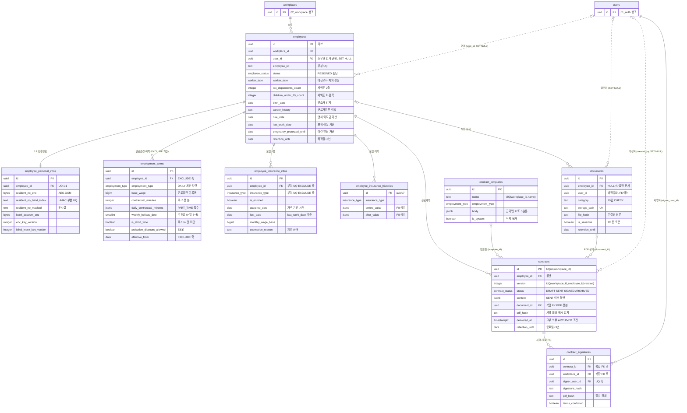

# 03_hr — 인사·근로계약·문서함

> **대상**: insadesk — 인사 도메인 9테이블(employees · employee_personal_infos · employment_terms · employee_insurance_infos · employee_insurance_histories · contract_templates · contracts · contract_signatures · documents)
> **작성일**: 2026-08-03
> **개정일**: 2026-09-10 — 퇴사 확정 트랜잭션의 **다섯 가지 중 셋째를 정정**한다 — 이직확인서 10일 시계가 아니라 **퇴직급여 지급 14일 과제**다. 2026-08-08 개정이 [12_compliance.md](./12_compliance.md)의 과제 수를 4 → 3으로 고치면서 **이 목록을 함께 훑지 않아 남은 자리**이고, 구현이 이 문서를 근거로 삼고 있었다. **수는 다섯 그대로**다. 함께 **입사 확정이 4대보험 취득 과제 1건을 만든다**는 것을 등재한다(종전 미결 해소). **컬럼 · 제약 · 트리거 · 인덱스는 전건 불변**
> **개정일**: 2026-09-09 — employees에 **생산직 선언 축(is_production_worker · boolean · NULL 허용)**을 채번한다(29 → **30컬럼**) — 생산직 야간·연장 비과세 요건(소득세법 시행령 §17①)의 판정 입력이며 **자동 판정하지 않고 사업주가 선언한다**(법적 판단을 자동으로 내리지 않는 **D-18과 같은 형태**). **occupation_major_code로 판정하지 않는다** — 그 열은 수습 감액 요건의 축이라 겹쳐 쓰면 **배달원이 빠지고 사무직 단순노무가 들어온다.** **NULL이 미선언이고 false와 다르다** — DEFAULT false로 접으면 정당한 대상이 비과세를 잃는다. 정본은 [../03_requirements/07_payroll.md](../03_requirements/07_payroll.md)다
> **개정일**: 2026-09-09 — **documents.is_sensitive의 판정 기준을 신설**한다 — 열은 DEFAULT 없이 NOT NULL이고 세 API 문서가 "귀속은 이 분류를 따른다"고 위임하는데 **위임받을 자리가 없었다**(구조적 공백 · 2026-09-09 전수 확인). 기준은 하나다 — **그 파일 하나가 열리면 타인의 주민번호 · 계좌 · 임금이 드러나는가.** **카테고리 목록으로 닫지 않는다**(새 산출물이 생길 때마다 목록이 틀린다). 사업장 단위 산출물 둘(임금대장 · 근로자명부)이 그 기준에 걸리며 **마스킹이 대신하지 못한다** — 마스킹 대상은 주민번호 하나이고 임금은 평문으로 남는다. **컬럼 16 · 제약 · 인덱스 7종 · 트리거 · 정책 표현식은 전건 불변**
> **개정일**: 2026-08-08 — 통합 후속 미러 동기화 — RESIGNED 가드 문안·에러 2종을 09_functions 정본과 일치 · RLS 요약을 08_rls 정본 #43~#67 표현식 미러로 재작성(미러 관계 명시 · **#44 수락 컨텍스트 축 반영**) · guard_employee_workplace_match 부착 전수 16테이블 참조 · 사업장관리번호를 workplaces **계열별 3컬럼**(insurance·pension·health) 참조로 정리
> **개정일**: 2026-08-08 — DB 커버리지 감사 반영 — employees.career_history 신설(28 → **29컬럼**) · employment_terms 단시간 CHECK 추가 · blind index 재색인 원자성 계약 명문화 · contracts 교부 전이 조건·복합 FK 2종·version UQ·미교부 탐지 인덱스 추가 · employee_insurance_infos를 자격 기간 이력 축으로 전환 · contract_signatures terms_confirmed CHECK · guard_employee_workplace_match 부착 전수 명시 · 인덱스 검산 정정(employees·documents 5 → **6종**)
> **개정일**: 2026-08-08 — 자녀 수 컬럼 주석을 간이세액표 조회 축 → **차감 축**으로 정정(2축 조회 확정 반영)
> **개정일**: 2026-08-08 — employees.hire_date NULL = 입사 미확정 계약 명시(초대 수락 생성분 · 판정 축은 enum이 아니라 hire_date 유무)
> **개정일**: 2026-08-03 — 대표자 4대보험 분기 확인 완료 반영
> **개정일**: 2026-08-03 — weekly_holiday_dow 신설(employment_terms 21 → **22컬럼**) · work_days 값 집합 7값·최소 1요일·중복 금지 CHECK 추가와 DEFAULT 제거(REQ-HRM-06) · weekly_holiday_dow 겹침 비강제 근거 3 → **2**로 정리
> **원천**: docs_ref2/schema_p0.md 테이블 — hr(9) · docs_ref2/requirements_p0.md REQ-HRM · REQ-CMP-10 · REQ-GLB-18

**employees가 허브다.** 근태·휴가·급여·명세서가 모두 이 행을 기준으로 연결되며, employees.user_id가 **본인 소유권 인가의 근원**이다. 명세서·급여 결과·근로계약의 본인 열람은 멤버십이 아니라 이 컬럼으로 판정하므로 퇴사·사업장 폐쇄 후에도 보존기간 내 접근이 끊기지 않는다(CMP-07).

**민감정보는 평문 컬럼을 두지 않는다.** 주민등록번호·계좌는 AES-GCM 암호문(bytea) + HMAC blind index + 마스킹 표시값 3축으로 분리 저장하며, 원문은 응답·로그·감사 전후값 어디에도 남기지 않는다.

**급여 계산 임금의 정본은 employment_terms가 아니라 payroll_terms다.** 본 도메인의 base_wage는 근로조건 기록용이며, 이중 정본의 모호함을 제거하기 위해 계산 입력을 [06_payroll.md](./06_payroll.md)로 일원화한다.

---

## 테이블 목록

| # | 테이블 | 보관 내용 | PK 타입 |
|---|--------|----------|---------|
| 17 | employees | 직원 인사 레코드(허브) — 신원·근로자 구분·세액 축·입퇴사·명부 기재사항·보호기간 | uuid |
| 18 | employee_personal_infos | 민감정보 — 주민번호·계좌 암호문·blind index·마스킹·키 버전 | uuid |
| 19 | employment_terms | 근로조건 이력 — 고용형태·임금·소정근로·수습 3요건·기간 | uuid |
| 20 | employee_insurance_infos | 4대보험 적용 정보 — 보험별 자격 기간 이력·가입·취득/상실·보수월액·제외 근거 | uuid |
| 21 | employee_insurance_histories | 보험 변경 이력(append-only) | uuid(uuidv7) |
| 22 | contract_templates | 근로계약서 템플릿 — 고용형태별·법정 명시사항 5슬롯 | uuid |
| 23 | contracts | 근로계약 — 내용·상태·PDF 해시·교부·보존기한 | uuid |
| 24 | contract_signatures | 전자서명 증적 — 서명자·해시·조건 확인 | uuid |
| 25 | documents | 문서함 메타 — 저장 경로·파일 해시·민감 여부·보존 | uuid |

---

## 테이블 명세

### 17. employees — 직원 인사 레코드 (허브)

기능ID **HRM-01·03·04·11·14·16** · 요구사항 REQ-HRM-01·02·09·11·12·25·26·28.

| 컬럼명 | 타입 | NULL | 키 | 설명 |
|--------|------|:--:|----|------|
| id | uuid | N | PK | 식별자. 근태·휴가·급여·명세서의 연결 축 |
| workplace_id | uuid | N | FK | 테넌트 스코프 |
| user_id | uuid | Y | FK → users.id (**SET NULL**) | 멤버십 연계 전 NULL 허용. **본인 소유권 인가의 근원** |
| name | text | N | | 성명 |
| birth_date | date | Y | | 생년월일. **만 18세 미만 연소자 자동 감지 근거**(HRM-14) |
| gender | gender | Y | | 근로자명부 법정 기재사항 |
| address | text | Y | | 주소. 근로자명부 법정 기재사항 |
| phone | text | Y | | 연락처 |
| emergency_contact | text | Y | | 비상 연락처 |
| job_title | text | Y | | 종사 업무. 근로자명부 법정 기재사항. v1은 단일 텍스트 |
| **career_history** | text | Y | | **이력.** 근로자명부 법정 기재사항(근기법 시행령 §20)이며 **근로조건 이력(employment_terms)과 다른 축이다** — 이쪽은 근로자 개인의 경력이다. 담을 컬럼이 없으면 완전성 검증(REQ-HRM-25)이 보완 수단 없는 누락만 반복한다. v1은 단일 텍스트 |
| employee_no | text | Y | UQ* | 사번. 명세서 근로자 특정정보로 성명을 대체할 수 있다 |
| status | employee_status | N | | DEFAULT ACTIVE. ACTIVE · ON_LEAVE · RESIGNED |
| worker_type | worker_type | N | | DEFAULT EMPLOYEE. **비근로자는 상시근로자 산정·법정수당·연차·4대보험 근로자 취급에서 제외**(REQ-HRM-28) |
| tax_dependents_count | integer | N | | DEFAULT 1. CHECK >= 1. **간이세액표 2축**. 비면 소득세 계산이 차단된다 |
| children_under_20_count | integer | N | | DEFAULT 0. CHECK >= 0. **간이세액표 차감 축**(조회 축이 아니다 — REQ-PAY-24) |
| occupation_major_code | text | Y | | 한국표준직업분류 대분류. **수습 감액 3요건 ③(대분류 9 단순노무 제외) 판정 입력**. **생산직 비과세 판정에 쓰지 않는다** — 축이 다르다(아래) |
| **is_production_worker** | **boolean** | **Y** | | **생산직 여부 — 사업주 선언 축**(소득세법 시행령 §17① 생산직 야간·연장 비과세 요건). **NULL은 미선언이며 false(해당 없음)와 다르다** — 미선언은 판정불가이고 판정불가는 비과세를 벗기지 않는다(정본 [../03_requirements/07_payroll.md](../03_requirements/07_payroll.md)) |
| hire_date | date | Y | | **연차·근속(퇴직금) 기산일.** 사업장 개설일보다 이를 수 있어 하한 CHECK를 두지 않는다. **NULL = 입사 미확정**(초대 수락으로 만들어진 행) |
| resignation_date | date | Y | | 퇴사일. CHECK >= hire_date |
| last_work_date | date | Y | | 최종 근무일. CHECK >= hire_date. **4대보험 상실일 기준 — 퇴사일과 구분한다** |
| resignation_reason | text | Y | | CHECK IN ('VOLUNTARY','RECOMMENDED','CONTRACT_END','DISMISSAL') |
| separation_reason_code | text | Y | | 고용보험 이직사유 코드(TAX-02 이직확인서 산출) |
| settlement_required | boolean | N | | DEFAULT false. 퇴사 정산 필요 여부 |
| pregnancy_protected_until | date | Y | | 임신 중 근로자 보호기간 종료일. **연장근로 금지·야간 배치 차단 판정 입력**(REQ-ATT-15 ④ · 전 규모). 파생 불가라 명시 필드가 필요하다 |
| source | text | N | | CHECK IN ('MANUAL','IMPORT') |
| retention_until | date | Y | | **근로자명부 = 퇴직일 + 3년.** 재직 중 NULL(파기 금지) |
| retention_basis | text | Y | | 'RESIGNATION_PLUS_3Y' |
| created_at | timestamptz | N | | DEFAULT now() |
| updated_at | timestamptz | N | | DEFAULT now() + set_updated_at 트리거 |

- **30컬럼이다.** 29 + 생산직 선언 1(is_production_worker)이다.

#### 생산직은 선언 축이지 판정 축이 아니다

**시행령 §17①이 직종을 열거하고 한국표준직업분류와 1:1로 대응하지 않는다** — 공장·광산 근로자 · 어선원 · 운전원 및 관련 종사자 · 배달·수하물 운반원처럼 열거이며 대분류 1자리로 접히지 않는다.

- **occupation_major_code로 판정하지 않는다.** 그 열은 **수습 감액 요건의 축**(대분류 9 단순노무 제외)이라 겹쳐 쓰면 **배달원이 빠지고 사무직 단순노무가 들어온다** — 두 요건이 서로 다른 집합을 가리키는데 같은 코드로 판정하면 **양방향으로 틀린다.**
- **직종 코드 집합을 기준값에 시드하지도 않는다.** 법령 열거를 코드 집합으로 접는 순간 **법령에 없는 매핑을 제품이 만드는 것**이고, 틀리면 부당 비과세이거나 부당 과세다. **미확인 기준값을 만들지 않는다**(REQ-GLB-09).
- **그래서 사업주가 선언한다** — **법적 판단을 자동으로 내리지 않는 D-18과 같은 형태**다(사업 단위 판정도 선언 + 경고 방식이다).
- **NULL을 허용하는 것이 계약의 핵심이다.** NOT NULL DEFAULT false로 두면 **미선언이 조용히 미해당으로 접혀** 정당한 대상이 비과세를 잃는다. 세 상태(선언 해당 · 선언 미해당 · **미선언**)가 각각 다른 처분을 받는다.
- **값 변경은 세액을 바꾸는 행위**라 감사 축이 근거를 담는다.
- 제약: PK(id) · CHECK tax_dependents_count >= 1 · CHECK children_under_20_count >= 0 · CHECK resignation_date >= hire_date · CHECK last_work_date >= hire_date · CHECK resignation_reason 4값 · CHECK source 2값 · FK workplace_id · FK user_id SET NULL.
- 인덱스 **6종**: employees_pkey · 부분 UQ (workplace_id, user_id) WHERE status = 'ACTIVE' → hr.duplicate_active_employee/409 · 부분 UQ (workplace_id, employee_no) WHERE employee_no IS NOT NULL · (workplace_id, status) · 부분 (user_id) WHERE user_id IS NOT NULL — 소유권 인가 조회 · 부분 (workplace_id, birth_date) WHERE birth_date IS NOT NULL — 연소자 감지 배치.
- 트리거: guard_employee_status_transition() · **sync_employee_user_id()** AFTER UPDATE OF user_id · **check_resignation_membership_mapping()**(DEFERRABLE CONSTRAINT TRIGGER) · set_updated_at().
- **STAFF의 SELECT는 is_self_employee(id)이며 멤버십을 보지 않는다** — 퇴사·폐쇄 후에도 본인 인사 레코드를 조회한다.

#### hire_date NULL = 입사 미확정

초대 수락(REQ-WRK-16 ③)이 만드는 행은 **hire_date NULL로 생성**되고, 관리자의 입사 확정이 hire_date를 채워 재직을 확정한다(REQ-HRM-01).

- **enum 값을 늘리지 않는다** — employee_status에 초안 상태를 두는 대신 hire_date 유무를 판정 축으로 쓴다. 상태는 처음부터 ACTIVE이며, 부분 UQ (workplace_id, user_id) WHERE status = 'ACTIVE'가 그대로 중복 생성을 막는다.
- 직원 목록의 입사 확정 대기 분기와 등록 표면의 중복 차단 분기는 모두 **hire_date 유무**로 가른다.
- **hire_date 없이는 연차 발생·퇴직금 기산이 성립하지 않으므로** 그 계산의 진입 자체가 입사 확정을 선행 조건으로 갖는다.

#### 상태 전이와 퇴사 확정

guard_employee_status_transition()이 ACTIVE↔ON_LEAVE와 →RESIGNED만 허용한다. **RESIGNED는 종단**이며 재입사는 새 레코드다. 반환 코드는 둘이다 — 재활성화 시도는 hr.rehire_requires_new_employee/409, 선행조건 미충족은 hr.resignation_blocked/409다(가드 정본 [09_functions_triggers.md](./09_functions_triggers.md)).

- 재입사를 같은 행의 상태 복귀로 처리하면 hire_date가 하나뿐이라 연차·퇴직금 기산이 두 근로관계에 걸쳐 뒤섞인다.
- RESIGNED 전이 시 resignation_date · last_work_date · **hire_date**를 NOT NULL로 강제하고 retention_until = resignation_date + 3년을 자동 세팅한다. **hire_date를 함께 요구하는 이유는 CHECK가 그 자리를 메우지 못하기 때문이다** — CHECK resignation_date >= hire_date는 hire_date가 NULL이면 NULL을 반환해 통과하므로, 입사가 확정된 적 없는 행(초대 수락 초안)이 그대로 퇴사자로 닫히고 근로자명부 보존 대상이 된다.
- **RESIGNED 전이 시 대상자의 ACTIVE OWNER 멤버십 보유를 차단한다** — 같은 사업장 workplace_members에 role = 'OWNER' AND status = 'ACTIVE'인 행이 있으면 거부한다(hr.resignation_blocked/409). guard_owner_singleton()은 멤버십 축에서 0명만 막으므로, 이 조건이 없으면 **인사는 퇴사자인데 멤버십은 OWNER ACTIVE**인 상태가 성립한다.
- 퇴사 선행조건 3종 중 **진행 중 급여 확정과 미처리 휴가·근태 승인은 가드가 맡지 않는다** — 전자는 advisory lock으로 표현되는 트랜잭션 경계 판정이고 후자는 세 테이블의 PENDING 집합 판정이라 상태 전이 트리거의 책임 범위를 넘는다. 서비스가 판정하며 한계로 등재한다([07_constraints_integrity.md](./07_constraints_integrity.md)).
- **퇴사 확정은 서버 트랜잭션이 다섯 가지를 함께 만든다** — 보험 상실 자료(compliance_tasks) · 금품청산 14일 과제 · **퇴직급여 지급 14일 과제** · 퇴직급여 판정(severance_assessments) · 계약 SIGNED→ARCHIVED + 보존기한 확정. **이 다섯은 트랜잭션이 만드는 행·전이의 축**이며 퇴사 후속 **6갈래**(REQ-HRM-13)와 세는 축이 다르다 — 갈래에 있는 마지막 급여·미사용 연차수당 정산은 급여 도메인의 후속 실행이라 이 트랜잭션이 행을 만들지 않고, 계약 ARCHIVED 전이는 갈래 밖 부수효과다.
- **셋째 항목이 이직확인서 10일 시계였던 것을 정정한다**(2026-09-10). **이직확인서 과제는 이 트랜잭션이 만들지 않는다** — 10일 시계의 기산이 근로자의 발급 요청 접수일이라 퇴사 시점에 열면 아직 시작되지 않은 시계에 임의의 기한이 굳고 **trigger_date·due_date가 불변이라 접수 시점에 고칠 수 없다**(2026-08-08 확정 · [12_compliance.md](./12_compliance.md)). 그 자리에 실제로 들어가는 것은 **퇴직급여 지급 14일 과제**(SEVERANCE_PAYMENT — 근퇴법 §9)이고 금품청산(근기법 §36)과 **같은 날 같은 기한이지만 근거 법률이 달라 행을 나눈다**. **다섯이라는 수는 그대로이고 셋째 항목만 바뀐다** — 2026-08-08 개정이 12_compliance의 과제 수를 4 → 3으로 고치면서 이 목록을 함께 훑지 않아 남은 자리다.
- **입사 확정도 과제를 만든다** — 4대보험 취득 1건이다([../06_api/05_hr.md](../06_api/05_hr.md) #11 · 2026-09-10). 기산·멱등키 축은 입사일이며 **퇴사 쪽과 달리 서버 내부 표면을 두지 않는다**(갈래가 하나다).

#### 퇴사 사유와 멤버십 종료 상태의 매핑

**check_resignation_membership_mapping()이 사유와 종료 상태의 짝을 트랜잭션 종료 시점에 검증한다.**

| resignation_reason | 멤버십 종료 상태 |
|--------------------|----------------|
| VOLUNTARY · CONTRACT_END | **LEFT** |
| RECOMMENDED · DISMISSAL | **REMOVED** |

- 근거는 재활성화 가능 여부다 — REQ-WRK-17이 LEFT 이력만 재활성화하므로, 해고자를 LEFT로 종료하면 **강제 제외 설계가 퇴사 경로로 우회**되어 재초대 수락으로 복귀한다.
- **DEFERRABLE인 이유는 삽입 순서다.** 퇴사 트랜잭션이 employees를 먼저 고치든 workplace_members를 먼저 고치든 검증이 성립해야 하며, 즉시 검증이면 순서 자체가 스키마 제약이 된다.
- 퇴사 연동이 아닌 종료(본인 탈퇴 · 관리자 강제 제외 · 폐쇄 일괄 종료)는 대상 employees 행이 RESIGNED가 아니므로 판정 대상이 아니다.

#### user_id 전파

sync_employee_user_id()가 비정규화 user_id를 근태·휴가·급여 결과·명세서에 전파한다.

- **비정규화는 성능이 아니라 인가 축의 이동이다.** 고volume 조회 테이블이 employees를 조인하지 않고도 본인 판정을 하려면 user_id가 그 행에 있어야 하며, employees.user_id가 나중에 연결되는 경우(초대 수락 전 직원 초안)를 위해 전파가 필요하다.
- 이 컬럼들은 FK가 아니다 — FK로 걸면 계정 삭제 시 CASCADE·SET NULL이 업무 원장을 건드린다.

### 18. employee_personal_infos — 민감정보 (암호화)

기능ID **HRM-01** · 요구사항 REQ-HRM-03·04.

**평문 컬럼을 두지 않는다.** 원문은 응답·로그·감사 전후값 어디에도 남기지 않는다.

| 컬럼명 | 타입 | NULL | 키 | 설명 |
|--------|------|:--:|----|------|
| id | uuid | N | PK | 식별자 |
| employee_id | uuid | N | FK · **UQ** | 1:1 |
| workplace_id | uuid | N | FK | 테넌트 스코프 |
| resident_no_enc | bytea | Y | | AES-GCM 암호문. 외국인등록번호 등 대체 식별자를 허용한다 |
| resident_no_blind_index | text | Y | UQ* | HMAC. **복호화 없는 중복 검출**. (workplace_id, resident_no_blind_index) 부분 UQ |
| resident_no_masked | text | Y | | 표시값(예: 901201-1로 시작하는 마스킹 문자열) |
| bank_name | text | Y | | 은행명 |
| bank_account_enc | bytea | Y | | 계좌 암호문 |
| bank_account_masked | text | Y | | 계좌 표시값 |
| enc_key_version | integer | N | | AES-GCM 키 버전. DEFAULT 1 |
| blind_index_key_version | integer | N | | HMAC 키 버전(재색인 지원). DEFAULT 1 |
| updated_by | uuid | Y | FK → users.id (**SET NULL**) | 최종 변경자 |
| created_at | timestamptz | N | | DEFAULT now() |
| updated_at | timestamptz | N | | DEFAULT now() + set_updated_at 트리거 |

- **14컬럼이다.**
- 제약: PK(id) · UNIQUE(employee_id) · **부분 UQ (workplace_id, resident_no_blind_index) WHERE resident_no_blind_index IS NOT NULL** → hr.resident_no_duplicate/409 · FK employee_id · FK workplace_id · FK updated_by SET NULL.
- 인덱스: employee_personal_infos_pkey · UNIQUE(employee_id) · 부분 UQ blind index.
- 트리거: guard_employee_workplace_match() · set_updated_at().
- **부분 저장 시 누락 필드를 NULL로 덮지 않는다** — 기존 값을 보존한다. 키 버전 메타가 깨질 요청은 hr.personal_info_key_version_conflict/409다.
- **RLS는 행 가시성만 담당하고 서비스는 마스킹 컬럼만 투영한다.** 정책이 열려 있어도 암호문 컬럼이 응답에 실리지 않는다.

#### 복호화 4요건 (서버 강제)

| # | 요건 | 위반 |
|:-:|------|------|
| ① | 재인증(5분 단기 · 작업 단위 소비) | hr.decrypt_forbidden/403 |
| ② | 사유 입력 | 〃 |
| ③ | audit_logs 기록(reason 필수) | 〃 |
| ④ | 1회성 응답 envelope | 〃 |

- 넷 중 하나라도 빠지면 복호화하지 않는다. audit_logs의 guard_audit_reason_required()가 PII 복호화 액션의 reason을 NOT NULL로 다시 강제한다.
- **blind index가 있는 이유가 이 4요건이다** — 중복 검출을 위해 복호화하면 4요건을 매 등록마다 통과해야 한다. HMAC 비교는 복호화가 아니다.

#### blind index 재색인 — 원자성 계약

**부분 UQ의 축에 blind_index_key_version을 넣지 않는다.** 넣으면 같은 주민번호가 서로 다른 키 버전으로 공존하는 것을 제약이 **허용**하게 되어 중복 검출이 정의상 무너진다. 대신 혼재 상태 자체를 만들지 않는 것으로 해결한다.

| 축 | 규약 |
|----|------|
| 재색인 단위 | **전 행 단일 트랜잭션 전면 전환**이다. 부분 재색인·점진 전환을 두지 않는다 — 중간 상태에서 같은 주민번호가 v1 HMAC과 v2 HMAC으로 갈려 부분 UQ를 그대로 통과한다 |
| 직렬화 | 재색인 트랜잭션이 **pg_advisory_xact_lock('pii_reindex')** 를 잡고, employee_personal_infos의 INSERT·UPDATE 서버 경로가 같은 키를 획득해 회전 중 등록을 대기시킨다 |
| 실패 처리 | 롤백이 전 행을 이전 버전으로 되돌리므로 **혼재가 남지 않는다** |
| 컬럼의 역할 | blind_index_key_version은 유일성 축이 아니라 **현재 유효 키와의 일치 확인 축**이다. 서버가 자기 키 버전과 다른 행을 만나면 중복 판정을 내리지 않고 재색인 미완으로 처리한다 |

- **enc_key_version과 blind_index_key_version은 회전 단위가 다르다** — 전자는 행 단위로 늦게 따라와도 열람만 영향받지만, 후자는 한 행이라도 뒤처지면 **판정이 조용히 실패**한다. 그래서 후자만 전면 전환을 요구한다.
- 잠금 지점은 [07_constraints_integrity.md](./07_constraints_integrity.md) 동시성 절에 등재한다.

### 19. employment_terms — 근로조건 이력

기능ID **HRM-02·03** · 요구사항 REQ-HRM-06·07·08·09.

| 컬럼명 | 타입 | NULL | 키 | 설명 |
|--------|------|:--:|----|------|
| id | uuid | N | PK | 식별자 |
| employee_id | uuid | N | FK | 대상 직원 |
| workplace_id | uuid | N | FK | 테넌트 스코프 |
| employment_type | employment_type | N | | REGULAR · CONTRACT · PART_TIME · DAILY. **DAILY는 v1 급여 계산 대상에서 차단**(온보딩 사전 고지) |
| pay_type | pay_type | N | | HOURLY · MONTHLY · DAILY |
| base_wage | bigint | N | | CHECK >= 0. HOURLY = 원/시 · MONTHLY = 원/월 · DAILY = 원/일. **근로조건 기록용** — 계산 정본은 payroll_terms.base_wage이며 두 값의 정합은 서비스가 지킨다(아래 정합 절) |
| contractual_minutes | integer | N | | **주 소정근로시간(분)**. CHECK >= 0 |
| daily_contractual_minutes | jsonb | Y | | **단시간 근로일별 근로시간(분)** — 기간제법 §17. **PART_TIME이면 NOT NULL을 CHECK가 강제한다** → hr.contract_missing_field/422 |
| work_days | text[] | N | | **소정근로일 요일 집합.** 값 집합은 MON · TUE · WED · THU · FRI · SAT · SUN **7값**이며 **중복 없이 최소 1요일**이다. **DEFAULT를 두지 않는다** — 빈 배열은 common.validation_failed/400으로 차단한다. **1일 소정근로시간 도출(집합 크기로 나눔)·개근/출근율 판정·주휴 발생의 공통 입력**이다(REQ-HRM-06) |
| **weekly_holiday_dow** | smallint | N | | **주휴일 요일.** DEFAULT 0. CHECK 0~6이며 **0 = 일요일 · 6 = 토요일**(ISO 1~7이 아니다 — work_schedules.day_of_week와 같은 축). 소정근로일 개근 시 유급이며(주 15시간 이상) **휴일 가산 버킷 5~8 · 주휴수당 · 결근 판정의 기준 축**이다 |
| break_policy | jsonb | N | | DEFAULT {}. 자동 차감 정책 |
| is_short_time | boolean | N | | **주 15시간 미만 파생 플래그**. contractual_minutes < 900에서 서버가 산출한다 |
| probation_months | integer | N | | DEFAULT 0 |
| probation_wage_rate | numeric(5,2) | Y | | 수습 임금률(%) |
| probation_discount_allowed | boolean | N | | DEFAULT false. **3요건 전부 충족 시에만 true**. false면 감액 없이 100% 강제 |
| probation_check | jsonb | Y | | 3요건 판정 근거 {term_over_1y, within_3m, not_simple_labor} |
| fixed_term_end_date | date | Y | | 계약기간. 근로자명부 법정 기재 + 수습 3요건 ① 판정 |
| effective_from | date | N | | 유효 시작일 |
| effective_to | date | Y | | 유효 종료일. CHECK > effective_from |
| created_by | uuid | Y | FK → users.id (**SET NULL**) | 작성자 |
| created_at | timestamptz | N | | DEFAULT now() |
| updated_at | timestamptz | N | | DEFAULT now() + set_updated_at 트리거 |

- **22컬럼이다.**
- 제약: PK(id) · CHECK base_wage >= 0 · CHECK contractual_minutes >= 0 · **CHECK cardinality(work_days) >= 1**(빈 배열 금지) · **CHECK work_days <@ ARRAY['MON','TUE','WED','THU','FRI','SAT','SUN']**(값 집합 한정) · **CHECK cardinality(work_days) = cardinality(ARRAY(SELECT DISTINCT unnest(work_days)))**(중복 금지) · **CHECK weekly_holiday_dow BETWEEN 0 AND 6** · **CHECK employment_type <> 'PART_TIME' OR daily_contractual_minutes IS NOT NULL**(단시간 근로일별 시간 필수 — 신설) · CHECK effective_to > effective_from · **CHECK probation_discount_allowed = false OR probation_wage_rate IS NOT NULL** · **EXCLUDE USING gist (employee_id WITH =, daterange(effective_from, coalesce(effective_to,'infinity'),'[)') WITH &&)** → hr.term_overlap/409 · FK employee_id · FK workplace_id · FK created_by SET NULL.
- 인덱스: employment_terms_pkey · EXCLUDE 부수 gist 인덱스 · (workplace_id, employee_id, effective_from DESC).
- 트리거: **guard_employee_workplace_match()** · set_updated_at().
- **단시간 CHECK를 신설한 근거는 강제층의 부재다.** 이전 서술은 "PART_TIME이면 NOT NULL 강제"를 컬럼 설명에만 두었고 CHECK·트리거·한계 등재 어디에도 배치하지 않아, 기간제법 §17의 필수 명시가 어느 층에도 실재하지 않았다. work_days의 값 집합·최소 1요일·중복 금지가 이미 CHECK로 표현된 것과 같은 이유로 이 조건도 표현 가능하다.
- **월 중 변경은 새 행이다** — 기간을 분할한다. EXCLUDE가 겹침을 물리적으로 막으므로 "어느 시점의 근로조건인가"에 답이 하나뿐이다.
- **수습 감액은 3요건 전부 충족일 때만 허용한다** — ① 계약기간 1년 이상 ② 수습 3개월 이내 ③ 단순노무(직업분류 대분류 9) 아님. probation_discount_allowed가 false면 임금률 컬럼이 있어도 감액하지 않는다.
- 포괄임금·고정OT(PAY-14)는 v1에 두지 않는다. 도입 시 comprehensive_wage_terms를 동일 EXCLUDE 패턴으로 신설한다.

#### 두 base_wage의 정합 — 최저임금 사전 차단이 닿는 범위

**hr.below_minimum_wage/422는 본 테이블 등록 시점의 사전 검증이고 계산 입력은 payroll_terms.base_wage다.** 두 값이 갈리면 사전 차단이 계산을 지키지 못한다.

- 강제층은 **서비스**다 — 근로조건 등록·수정 표면이 payroll_terms 초안을 함께 갱신하고, payroll_terms 등록 표면에도 **같은 최저임금 사전 검증을 적용**한다. 두 축 중 한쪽만 검증하면 낮은 단가가 계산 정본으로 들어간다.
- **DB 제약으로 잇지 않는 이유는 두 테이블의 유효기간 축이 독립이기 때문이다** — employment_terms와 payroll_terms는 각자의 EXCLUDE로 기간을 나누며 분할 경계가 일치할 의무가 없다. 특정 시점의 두 값을 대조하려면 기간 교집합을 계산해야 하고 이는 CHECK로 표현되지 않는다.
- 최종 방어는 확정 시점의 payroll.below_minimum_wage/422다(REQ-PAY-26). 사전 차단은 그 앞단의 조기 발견이며 **둘을 하나로 합치지 않는다** — 판정 입력(계약 단가 대 산입범위 환산 결과)이 다르다.
- 한계 등재는 [07_constraints_integrity.md](./07_constraints_integrity.md)에 둔다.

#### 주휴일 지정 — weekly_holiday_dow

**주휴일을 지정하는 필드가 없으면 휴일 버킷(5~8)과 주휴 개근 판정을 산출할 수 없다.** 원천 schema_p0에 이 축이 빠져 있어 신설한다.

| 축 | 규약 |
|----|------|
| 요일 표기 | **0 = 일요일 ~ 6 = 토요일**. ISO 1~7을 쓰지 않는다 — work_schedules.day_of_week가 이미 0-일요일 기준이라 한 스키마에 두 규약을 두지 않는다 |
| 기본값 | 0(일요일). 대다수 사업장의 관행이며 미입력 상태가 판정을 막지 않게 한다 |
| 소비 지점 | 근태 일 집계의 휴일 버킷 판정([04_attendance.md](./04_attendance.md)) · 주휴수당 산출과 주휴 미발생 사유([06_payroll.md](./06_payroll.md)) |
| 이력성 | employment_terms 행이라 **effective_from·effective_to로 기간 분할된다** — 주휴일 변경이 과거 판정을 소급하지 않는다 |

- **work_days와의 겹침은 DB 제약으로 강제하지 않는다.** 근거는 둘이다 — ① work_days가 **text[] 요일 코드**이고 본 컬럼이 **smallint**라 CHECK로 대조하려면 두 표기를 잇는 IMMUTABLE 매핑 함수가 필요하고, 요일 코드 표기가 바뀌면 그 CHECK가 조용히 깨진다 ② 겹침 판정 규칙의 정본이 [../03_requirements/04_hr.md](../03_requirements/04_hr.md)이므로 스키마가 앞서 규칙을 고정하면 충돌한다. **서비스 레이어가 검증**하며 한계 등재는 [07_constraints_integrity.md](./07_constraints_integrity.md)에 둔다.
- **work_days 자체의 값 집합·최소 1요일·중복 금지는 CHECK가 강제한다** — 표기 축이 하나(text[])라 매핑 함수 없이 표현되기 때문이다. 강제하지 않는 것은 **두 컬럼 사이의 관계**뿐이다.
- **약정휴일 필드를 만들지 않는다** — v1은 법정 주휴일 하나만 지정한다. 도입 시 별도 테이블(사업장별 약정휴일 달력)을 신설하며 본 컬럼은 그대로 둔다. 미사용 컬럼을 미리 만들지 않는다.
- 주휴일이 유급이 되려면 **소정근로일 개근 + 주 15시간 이상**이 함께 성립해야 한다. 후자는 is_short_time이 파생 플래그로 보유하므로 두 컬럼이 함께 판정 입력이 된다.

### 20. employee_insurance_infos — 4대보험 적용 정보

기능ID **HRM-05** · 요구사항 REQ-HRM-16·17 · REQ-PAY-21.

| 컬럼명 | 타입 | NULL | 키 | 설명 |
|--------|------|:--:|----|------|
| id | uuid | N | PK | 식별자 |
| employee_id | uuid | N | FK · UQ* | 대상 직원 |
| workplace_id | uuid | N | FK | 테넌트 스코프 |
| insurance_type | insurance_type | N | UQ* | 5종. **(employee_id, insurance_type) 부분 UQ — 상실되지 않은 자격만 종류당 1건** |
| is_enrolled | boolean | N | | 가입 여부 |
| acquired_date | date | Y | | 취득일. **자격 기간의 시작**이며 미가입 판정 행에서는 NULL이다 |
| lost_date | date | Y | | 상실일. CHECK >= acquired_date. **last_work_date 기준(퇴사일과 구분)** |
| monthly_wage_base | bigint | Y | | 보수월액(상·하한 적용 후) |
| exemption_reason | text | Y | | **제외 근거**. 초단시간·연령·계속근로 미달 등 |
| eligibility_detail | jsonb | Y | | 판정 입력 스냅샷 {employment_type, monthly_minutes, continuous_months, age, monthly_wage} |
| created_at | timestamptz | N | | DEFAULT now() |
| updated_at | timestamptz | N | | DEFAULT now() + set_updated_at 트리거 |

- **12컬럼이다.**
- 제약: PK(id) · **부분 UQ (employee_id, insurance_type) WHERE lost_date IS NULL**(현재 유효 자격 1건) · **EXCLUDE USING gist (employee_id WITH =, insurance_type WITH =, daterange(acquired_date, coalesce(lost_date,'infinity'),'[)') WITH &&) WHERE acquired_date IS NOT NULL**(자격 기간 겹침 차단) · CHECK lost_date >= acquired_date · FK employee_id · FK workplace_id.
- 인덱스 **5종**: employee_insurance_infos_pkey · 부분 UQ (employee_id, insurance_type) WHERE lost_date IS NULL · EXCLUDE 부수 gist 인덱스 · (workplace_id, insurance_type, is_enrolled) · (employee_id, insurance_type, acquired_date DESC) — 자격 이력 조회.
- 트리거: guard_employee_workplace_match() · **log_insurance_history()** AFTER INSERT/UPDATE — employee_insurance_histories에 전후값·적용일·변경자를 기록한다 · set_updated_at().
- **확정 급여에 자동 소급하지 않는다**(REQ-HRM-18). 보험 정보 정정이 과거 확정 결과를 조용히 바꾸면 임금대장과 명세서가 어긋난다.
- **사업장관리번호는 본 테이블이 보유하지 않는다.** 보험은 사업장(장소) 단위로 성립하므로 보유처 정본은 **workplaces의 계열별 3컬럼**이다([02_workplace.md](./02_workplace.md)) — **insurance_mgmt_no**(고용·산재) · **pension_mgmt_no**(국민연금) · **health_mgmt_no**(건강보험). 신고서가 보험 계열마다 다른 식별번호를 요구하므로 한 컬럼으로 뭉치지 않는다(REQ-HRM-17 · REQ-TAX-01).
- 직원 단위 행에 복제하지 않는다 — 복제하면 사업장 값 변경이 직원 수만큼의 행 갱신을 요구하고 신고자료가 두 출처를 갖는다. **insurance_type이 어느 계열의 번호를 읽을지 정한다** — NATIONAL_PENSION은 pension_mgmt_no, HEALTH·LONG_TERM_CARE는 health_mgmt_no, EMPLOYMENT·INDUSTRIAL_ACCIDENT는 insurance_mgmt_no다.

#### 자격 기간 이력 축 — 상실 후 재취득

**보험 종류당 1행 고정을 자격 기간 이력으로 바꾼다.** 초단시간에서 소정근로 확대, 고용보험의 3개월 계속근로 충족처럼 **같은 고용기간 안에서 상실 후 재취득**이 실제로 발생하며, 1행 고정이면 기존 행을 덮어써 직전 취득·상실 쌍이 사라진다. 그 쌍은 TAX-01 신고자료의 입력이므로 사라지면 신고 이력이 재구성되지 않는다.

| 축 | 규약 |
|----|------|
| 현재 유효 자격 | **부분 UQ (employee_id, insurance_type) WHERE lost_date IS NULL** — 상실되지 않은 자격은 보험 종류당 1건이다. 미가입 판정 행도 같은 슬롯을 쓴다 |
| 과거 자격 | lost_date가 채워진 행은 그대로 남고 재취득은 **새 행**이다 — employment_terms의 기간 분할과 같은 패턴이다 |
| 기간 겹침 | **EXCLUDE gist**가 같은 직원·같은 보험의 자격 기간 겹침을 막는다. acquired_date가 NULL인 미가입 판정 행은 기간이 없으므로 WHERE 절로 제외한다 |
| 미가입 → 가입 | 같은 행을 UPDATE해 is_enrolled·acquired_date를 채운다. 행을 늘리지 않는다 |

- **employee_insurance_histories가 이 축을 대신하지 못한다** — before_value·after_value jsonb는 감사 이력이라 취득·상실 쌍을 구조화된 컬럼으로 되돌려 주지 않는다. 신고자료는 날짜 컬럼을 직접 읽는다.
- 재입사만 새 employees 행으로 갈라 놓았을 뿐, **고용기간 내 자격 변동은 이 테이블 말고 담을 자리가 없다.**

#### 보험별 판정 규칙 (REQ-HRM-16 §4.2)

**보험마다 제외 요건이 다르다. "초단시간이니 4대보험 전부 제외"는 오구현이다.**

| 보험 | 초단시간(월 60시간 미만) | 근로자 공제 |
|------|------------------------|-----------|
| NATIONAL_PENSION | 제외(18세 이상 60세 미만) | 공제 |
| HEALTH · LONG_TERM_CARE | 제외 | 공제 |
| EMPLOYMENT | **3개월 이상 계속근로면 적용** | 공제 |
| INDUSTRIAL_ACCIDENT | **적용 — 근로시간·고용형태 무관** | **미공제(전액 사업주)** |

- 산재는 공제 라인이 없으므로 급여 결과의 industrial_accident_wage_base 컬럼이 사업주 부담분 재현의 유일한 근거다([06_payroll.md](./06_payroll.md)).
- 대표자의 4대보험 분기는 **확인 완료**됐다(2026-08-03) — 국민연금·건강보험은 **사업장 가입**(무보수 법인 대표는 미가입 신청 가능) · **고용·산재는 원칙 제외**다. worker_type 값 집합·계산 제외 계약의 노무 근거가 채워졌다.

### 21. employee_insurance_histories — 보험 변경 이력 (append-only)

기능ID **HRM-05** · 요구사항 REQ-HRM-18.

| 컬럼명 | 타입 | NULL | 키 | 설명 |
|--------|------|:--:|----|------|
| id | uuid | N | PK | 식별자. **uuidv7()** |
| employee_id | uuid | N | FK | 대상 직원 |
| workplace_id | uuid | N | FK | 테넌트 스코프 |
| insurance_type | insurance_type | N | | 대상 보험 |
| before_value | jsonb | Y | | 이전 값. **PII 원문 금지** |
| after_value | jsonb | Y | | 이후 값. 동일 규율 |
| effective_date | date | Y | | 적용일 |
| changed_by | uuid | Y | FK → users.id (**SET NULL**) | 변경자 |
| created_at | timestamptz | N | | DEFAULT now() |

- **9컬럼이다.** updated_at을 갖지 않는다.
- 제약: PK(id) · FK employee_id · FK workplace_id · FK changed_by SET NULL.
- 인덱스: employee_insurance_histories_pkey · (employee_id, created_at DESC).
- 트리거: **guard_employee_workplace_match()** · prevent_mutation().
- **행을 만드는 주체는 log_insurance_history()다** — employee_insurance_infos의 AFTER INSERT/UPDATE 트리거이며, 이 테이블이 append-only인데 기록 주체가 확정되지 않으면 서비스 누락이 곧 이력 공백이 된다.
- REQ-HRM-18이 테이블명을 명시 요구하므로 v1 최소집합에서 유지한다 — 요구사항이 정본이다.

### 22. contract_templates — 근로계약서 템플릿

기능ID **HRM-06** · 요구사항 REQ-HRM-19.

| 컬럼명 | 타입 | NULL | 키 | 설명 |
|--------|------|:--:|----|------|
| id | uuid | N | PK · UQ* | 식별자. (id, workplace_id) UQ — **contracts 복합 FK 대상 키** |
| workplace_id | uuid | N | FK · UQ* | 테넌트 스코프 |
| name | text | N | | 템플릿 명칭 |
| employment_type | employment_type | N | | 정규·기간제·단시간·일용 |
| body | jsonb | N | | 템플릿 구조. **근기법 §17 명시사항 5개 슬롯** — 임금 구성항목·계산방법·지급방법 / 소정근로시간 / 휴일 / 연차유급휴가 / 취업 장소·종사 업무 |
| is_system | boolean | N | | 시드 표준서식. 삭제 불가 |
| is_active | boolean | N | | 활성 여부 |
| created_at | timestamptz | N | | DEFAULT now() |
| updated_at | timestamptz | N | | DEFAULT now() + set_updated_at 트리거 |

- **9컬럼이다.**
- 제약: PK(id) · UNIQUE(workplace_id, name) · **UNIQUE(id, workplace_id)** — contracts의 복합 FK 대상 키 · FK workplace_id.
- 인덱스: contract_templates_pkey · UNIQUE(workplace_id, name) · UNIQUE(id, workplace_id) · 부분 (workplace_id, employment_type) WHERE is_active.
- 트리거: set_updated_at().
- **DELETE가 없다** — 정리는 is_active = false다. 이미 발행된 계약이 template_id로 참조한다.
- **body의 5슬롯이 계약 유효성의 근거다.** 슬롯이 비면 계약서가 근기법 §17 명시 의무를 충족하지 못하므로 발송 전 서버가 검증한다.

### 23. contracts — 근로계약

기능ID **HRM-06·07** · 요구사항 REQ-HRM-19·20·22 · REQ-CMP-10.

**교부 이력을 별도 테이블로 두지 않고 본 테이블 컬럼으로 흡수한다** — 계약당 교부 대상이 1인이라 명세서(다중 채널·다중 열람)와 성격이 다르다.

| 컬럼명 | 타입 | NULL | 키 | 설명 |
|--------|------|:--:|----|------|
| id | uuid | N | PK · UQ* | 식별자. (id, workplace_id) UQ — contract_signatures 복합 FK 대상 키 |
| workplace_id | uuid | N | FK · UQ* | 테넌트 스코프 |
| employee_id | uuid | N | FK | 대상 직원. **생성 후 불변** |
| template_id | uuid | Y | FK* | (template_id, workplace_id) → contract_templates(id, workplace_id) **복합 FK**. 직접 작성 시 NULL |
| version | integer | N | | DEFAULT 1 |
| status | contract_status | N | | DEFAULT DRAFT |
| content | jsonb | N | | 법정 명시사항. **SENT 이후 불변** |
| document_id | uuid | Y | FK* | (document_id, workplace_id) → documents(id, workplace_id) **복합 FK**. PDF 실체·경로·해시는 documents가 정본이다 |
| pdf_hash | text | Y | | 서명 대상 PDF 해시. **SENT 전이 시 guard_contract_transition()이 documents.file_hash와의 일치를 재검증한다** |
| sent_at | timestamptz | Y | | 발송 시각 |
| signed_at | timestamptz | Y | | 서명 시각 |
| delivered_at | timestamptz | Y | | **교부(발송) 시각.** 서버 보관만으로는 §17② 교부 의무가 미이행이다 |
| delivery_channel | text | Y | | CHECK IN ('IN_APP','EMAIL') |
| delivery_confirmed_at | timestamptz | Y | | 수신 확인 |
| delivery_attempts | jsonb | N | | DEFAULT []. 재시도·대체 채널 이력 |
| archived_at | timestamptz | Y | | 보관 전이 시각 |
| retention_until | date | Y | | **근로관계 종료일 + 3년.** 재직 중 NULL(파기 금지) |
| retention_basis | text | Y | | 'EMPLOYMENT_END_PLUS_3Y' |
| created_by | uuid | Y | FK → users.id (**SET NULL**) | 작성자 |
| created_at | timestamptz | N | | DEFAULT now() |
| updated_at | timestamptz | N | | DEFAULT now() + set_updated_at 트리거 |

- **21컬럼이다.**
- 제약: PK(id) · **UNIQUE(id, workplace_id)** · **UNIQUE(workplace_id, employee_id, version)** — 세대 축의 유일성 · CHECK delivery_channel 2값 · **CHECK (status <> 'ARCHIVED') OR (retention_until IS NOT NULL AND archived_at IS NOT NULL AND delivered_at IS NOT NULL)** · FK workplace_id · FK employee_id · **복합 FK (template_id, workplace_id) → contract_templates(id, workplace_id)** · **복합 FK (document_id, workplace_id) → documents(id, workplace_id)** · FK created_by SET NULL.
- 인덱스 **6종**: contracts_pkey · UNIQUE(id, workplace_id) · UNIQUE(workplace_id, employee_id, version) — 최신 세대 조회를 역방향 스캔이 겸한다 · (employee_id, status) · 부분 (retention_until) WHERE retention_until IS NOT NULL — 파기 배치 · **부분 (workplace_id) WHERE signed_at IS NOT NULL AND delivered_at IS NULL** — 미교부 서명본 탐지.
- 트리거: guard_contract_transition() · **guard_contract_retention()** · set_updated_at().
- **version에 유일성이 없으면 세대 축이 성립하지 않는다** — 같은 직원에게 같은 version이 둘 이상 생기면 "몇 번째 계약본인가"에 답이 둘이 되고, 서명 증적이 어느 본을 가리키는지 사후에 확정되지 않는다.
- **복합 FK 2종은 서명 행에 적용한 원칙을 같은 테이블 안에서 마저 적용한 것이다.** 단일 컬럼 FK였다면 A 사업장의 계약이 B 사업장의 템플릿·문서를 참조하는 조합이 제약상 성립한다.
- **STAFF 본인은 SENT·SIGNED·ARCHIVED만 read-only로 보며 멤버십을 요구하지 않는다** — 퇴사·폐쇄 후 보존기간 내 열람이 CMP-07의 요구다. DRAFT·CANCELLED는 관리자 전용이다.

#### 상태 전이 가드

guard_contract_transition()이 강제한다.

| 전이 | 허용 | 전이 조건 |
|------|:----:|----------|
| DRAFT → SENT | 허용 | document_id NOT NULL · **pdf_hash = documents.file_hash** |
| SENT → SIGNED | 허용 | — |
| SIGNED → ARCHIVED | 허용 | **delivered_at NOT NULL** · retention_until · archived_at NOT NULL |
| SENT → CANCELLED | 허용 | — |
| 그 외 | 차단 | — |

- employee_id·workplace_id는 불변이고 **SENT 이후 content·pdf_hash·document_id 변경을 차단**한다.
- 서명 전 수정은 기존 발송본을 CANCELLED로 두고 새 version DRAFT를 만든다 — 발송된 문서의 내용이 사후에 바뀌면 서명 증적의 대상이 불명확해진다.
- **pdf_hash 일치를 SENT 전이에서 재검증하는 이유는 서명 대상의 특정이다.** 서명 증적은 pdf_hash로 대상을 가리키는데 그 값이 실제 파일 해시와 다르면 증적이 존재하지 않는 문서를 가리킨다. contract_signatures 쪽 guard가 서명 시점에 한 번 더 대조하므로 두 지점이 같은 값을 지킨다.

#### 교부 없는 보관을 막는다

**delivered_at이 NULL인 채로 ARCHIVED가 되지 않는다.** 서명(SIGNED)은 근로자의 의사표시이고 교부는 사업주의 발송 행위라, 서명만 받고 발송하지 않으면 근로기준법 §17② 의무가 미이행 상태로 남는다(REQ-HRM-22).

- 전이 조건과 CHECK 두 곳에서 강제한다 — 전이 조건이 경로를 막고, CHECK가 어떤 경로로 들어온 ARCHIVED 행이든 세 컬럼을 함께 요구한다.
- **부분 인덱스 (workplace_id) WHERE signed_at IS NOT NULL AND delivered_at IS NULL이 미이행 탐지의 조회 경로다.** 조건이 없으면 미교부 계약이 종단으로 닫히고, 인덱스가 없으면 닫히기 전에도 찾을 방법이 없다.
- 계약 만료·근로관계 종료 배치는 미교부 건을 ARCHIVED로 넘기지 못하므로 **교부를 먼저 완료하거나 실패 사유를 남긴다**(delivery_attempts).

#### 보존기한 가드

**guard_contract_retention()이 재직 중 만료를 DB에서 막는다.**

- ARCHIVED 전이 시 retention_until을 NOT NULL로 강제한다.
- **직원이 ACTIVE·ON_LEAVE인 동안 retention_until을 과거 일자로 설정하는 것을 차단한다** — 근로계약서 보존 기산일은 근로관계 종료일이므로 재직 중에는 만료가 성립할 수 없다. 이 가드가 없으면 파기 배치가 재직자의 계약서를 지운다(REQ-GLB-18 · REQ-CMP-10).

### 24. contract_signatures — 전자서명 증적

기능ID **HRM-07** · 요구사항 REQ-HRM-21.

| 컬럼명 | 타입 | NULL | 키 | 설명 |
|--------|------|:--:|----|------|
| id | uuid | N | PK | 식별자 |
| contract_id | uuid | N | FK* · UQ* | (contract_id, workplace_id) → contracts(id, workplace_id) **복합 FK** — 테넌트 오염 차단 |
| workplace_id | uuid | N | FK* | 복합 FK의 나머지 축 |
| signer_user_id | uuid | N | FK → users.id · UQ* | 서명자. (contract_id, signer_user_id) UQ |
| signed_at | timestamptz | N | | 서명 시각 |
| ip | inet | Y | | 서명 IP |
| user_agent | text | Y | | 서명 클라이언트 |
| signature_hash | text | N | | 서명 이미지·동의 해시 |
| pdf_hash | text | N | | **계약 PDF 해시 — contracts.pdf_hash와 일치를 강제한다** |
| terms_confirmed | boolean | N | | 주요 근로조건 확인 체크. **CHECK terms_confirmed** — false 서명을 저장하지 않는다 |
| created_at | timestamptz | N | | DEFAULT now() |

- **11컬럼이다.** updated_at을 갖지 않는다.
- 제약: PK(id) · UNIQUE(contract_id, signer_user_id) — 중복 서명 차단 · **CHECK terms_confirmed** — 확인 체크 없는 서명 차단 · **복합 FK (contract_id, workplace_id) → contracts(id, workplace_id)** · FK signer_user_id.
- 인덱스: contract_signatures_pkey · UNIQUE(contract_id, signer_user_id).
- 트리거: guard_contract_signature_insert() — **계약이 SENT 상태 · 서명자가 해당 employee 본인 · pdf_hash 일치**를 DB가 재검증한다. 위반은 hr.contract_not_signable/409다.
- **복합 FK가 교차 사업장 서명을 막는다.** 단일 컬럼 FK였다면 A 사업장의 서명 행이 B 사업장의 계약을 가리킬 수 있다. workplace_id를 FK에 끼워 넣으면 그 조합이 존재하지 않아 거부된다.
- **terms_confirmed를 CHECK로 못박는 이유는 증적의 값이다.** 컬럼만 두고 값을 열어 두면 확인하지 않은 서명이 그대로 저장되어 "주요 근로조건 확인을 요구한다"(REQ-HRM-21)가 증적으로 아무것도 보증하지 않는다. 컬럼을 남기는 것은 증적 서식에 그 항목이 존재함을 명시하기 위해서다.
- SELECT는 관리자 + signer_user_id = current_user_id()이며 멤버십을 보지 않는다.

### 25. documents — 문서함 메타

기능ID **HRM-09·14** · **SLP-01·04** · **CMP-04** · 요구사항 REQ-HRM-23·24 · REQ-SLP-02·10.

실체 파일은 오브젝트 스토리지에 둔다. **PDF 저장 경로·파일 해시는 본 테이블이 일원 보유**하고 payslips·contracts가 document_id로 참조한다.

| 컬럼명 | 타입 | NULL | 키 | 설명 |
|--------|------|:--:|----|------|
| id | uuid | N | PK · UQ* | 식별자. (id, workplace_id) UQ — **contracts 복합 FK 대상 키** |
| workplace_id | uuid | N | FK · UQ* | 테넌트 스코프 |
| employee_id | uuid | Y | FK | NULL = 사업장 문서 |
| user_id | uuid | Y | | 비정규화(본인 소유권 인가 가속). **FK가 아니다** |
| category | text | N | | CHECK IN ('CONTRACT','PAYSLIP','MINOR_FAMILY_CERT','MINOR_GUARDIAN_CONSENT','INSURANCE','QUALIFICATION','EVIDENCE','LEDGER','EXPORT','ETC') |
| storage_path | text | N | UQ | 저장 경로. 공백 금지 |
| original_name | text | Y | | 원본 파일명 |
| mime_type | text | Y | | MIME. **매직넘버 검증 통과분만** |
| size_bytes | bigint | Y | | CHECK NULL 또는 >= 0 |
| file_hash | text | Y | | **무결성 검증 정본** |
| is_sensitive | boolean | N | | true면 관리자도 권한 + 사유 + 감사 후 1회용 토큰을 받는다(REQ-HRM-24 4요건). **값을 정하는 기준은 아래 판정 절**이며 DEFAULT를 두지 않는다 |
| retention_until | date | Y | | 보존 만료일 |
| retention_basis | text | Y | | 유형별 기산일 코드 |
| uploaded_by | uuid | Y | FK → users.id (**SET NULL**) | 업로더 |
| created_at | timestamptz | N | | DEFAULT now() |
| updated_at | timestamptz | N | | DEFAULT now() + set_updated_at 트리거 |

- **16컬럼이다.**
- 제약: PK(id) · UNIQUE(storage_path) · **UNIQUE(id, workplace_id)** — contracts의 복합 FK 대상 키 · CHECK category 10값 · CHECK size_bytes NULL 또는 >= 0 · FK workplace_id · FK employee_id · FK uploaded_by SET NULL.
- 인덱스 **7종**: documents_pkey · UNIQUE(storage_path) · UNIQUE(id, workplace_id) · (workplace_id, employee_id, category) · 부분 (user_id, created_at DESC) WHERE user_id IS NOT NULL · 부분 (retention_until) WHERE retention_until IS NOT NULL · **부분 (employee_id, category) WHERE category IN ('MINOR_FAMILY_CERT','MINOR_GUARDIAN_CONSENT')** — 연소자 서류 비치 체크(hr.minor_document_missing/422).
- 트리거: **guard_employee_workplace_match()**(employee_id IS NOT NULL인 행만 판정한다 — NULL은 사업장 문서다) · set_updated_at().
- **파일 접근은 DB가 아니라 S3 정책 + 서비스 인가 + 1회용 다운로드 토큰 + 서버 스트리밍으로 통제한다.** RLS는 메타 행 가시성만 담당한다. 버킷은 전부 private다(아바타 제외).
- STAFF는 is_self_employee(employee_id) AND is_sensitive = false만 보되, **명세서 카테고리는 소유권으로 멤버십 무관 허용**한다.

#### is_sensitive를 정하는 기준

**무엇이 민감 분류인가를 정한 자리가 없었다**(2026-09-09 실측 — 열은 DEFAULT 없이 NOT NULL이고, 세 API 문서가 "귀속은 documents.is_sensitive 분류를 따른다"고 위임하는데 **위임받을 자리가 존재하지 않았다**). 분류가 바뀌면 표면을 고치지 않고도 따라가게 하려고 위임한 것이므로, **위임처가 비면 그 설계 전체가 성립하지 않는다.**

판정 기준은 하나다 — **그 파일 하나가 열리면 무엇이 드러나는가.**

| 드러나는 것 | 분류 |
|---|---|
| 그 문서를 소유한 본인의 것뿐이다 | 일반(false) |
| **타인의** 주민번호 · 계좌 · 임금이 드러난다 | **민감(true)** |

- **카테고리 목록으로 닫지 않는다.** 같은 카테고리 안에서도 대상 범위가 다른 문서가 생기며(사업장 단위 산출물과 개인 단위 증빙), 목록을 정본으로 두면 **새 산출물이 생길 때마다 이 표가 틀리는데 드러날 자리가 없다.** 예시로 드는 것은 괜찮다.
- **사업장 단위 산출물(LEDGER)은 이 기준에 걸린다** — 임금대장과 근로자명부는 둘 다 employee_id가 없는 사업장 단위 문서이고 **전 직원의 임금과 인적사항이 한 파일에 모인다.** 마스킹이 그것을 대신하지 못한다 — 대장의 마스킹 대상은 주민번호 하나이고([../06_api/08_payroll.md](../06_api/08_payroll.md) REQ-PAY-31) **임금은 평문으로 남는다.**
- **STAFF 증빙 업로드는 분류를 요청에서 받지 않는다** — category = EVIDENCE · 일반 분류 고정이다([../06_api/05_hr.md](../06_api/05_hr.md) #27). 본인 것만 드러나므로 위 표의 첫 행이다.
- **MANAGER 업로드는 분류를 요청 파라미터로 받는다.** 그 값이 위 기준에 맞는지는 서비스 계층의 판정이며, **기준이 없으면 그 판정이 성립하지 않는다** — 이 절이 그 판정의 근거다.
- **분류가 바꾸는 것의 정본은 REQ-HRM-24다**(재인증 · 사유 · 감사 · 서버 1회성 응답 4요건). 이 절은 **무엇이 그 분류인가**만 정하고 요건을 다시 세지 않는다.

---

## RLS 정책 — 도메인 요약

**정책 표현식의 정본은 [08_rls_policies.md](./08_rls_policies.md)이며 본 절은 인사 9테이블 몫(정책 #43~#67 · 25개)의 미러다.** 표현식이 어긋나면 정본이 우선하고, 미러를 정본보다 먼저 고치지 않는다.

| 테이블 | SELECT | INSERT | UPDATE | DELETE |
|--------|--------|--------|--------|--------|
| employees | #43 admin(workplace_id) OR **self_emp(id)** | #44 **(admin(workplace_id) AND writable(workplace_id)) OR (accept_ctx() AND writable(workplace_id))** | #45 admin(workplace_id) | **—** |
| employee_personal_infos | #46 admin OR self_emp(employee_id) | #47 admin AND **sys()** | #48 admin AND **sys()** | **—** |
| employment_terms | #49 admin OR self_emp(employee_id) | #50 admin AND writable | #51 admin | **—** |
| employee_insurance_infos | #52 admin OR self_emp(employee_id) | #53 admin AND writable | #54 admin | **—** |
| employee_insurance_histories | #55 admin | #56 **sys()** | **—** | **—** |
| contract_templates | #57 member(workplace_id) | #58 admin AND writable | #59 admin | **—** |
| contracts | #60 admin OR (**self_emp(employee_id)** AND status IN ('SENT','SIGNED','ARCHIVED')) | #61 admin AND writable | #62 admin | **—** |
| contract_signatures | #63 admin OR signer_user_id = uid | #64 **signer_user_id = uid** | **—** | **—** |
| documents | #65 admin OR (self_emp(employee_id) AND is_sensitive = false) OR (**category = 'PAYSLIP' AND user_id = uid**) | #66 admin OR **sys()** | #67 admin OR **sys()** | **—** |

- **읽기와 쓰기의 축이 다르다** — #43·#60·#65의 소유권 축은 멤버십·사업장 상태를 보지 않아 퇴사·폐쇄 후에도 본인 열람이 끊기지 않지만(CMP-07), INSERT는 관리자 축이며 대부분 writable(사업장 CLOSED·SUSPENDED 아님)을 함께 요구한다.
- **#44의 수락 컨텍스트 축이 인사 9테이블에서 유일한 비관리자 INSERT 경로다.** 초대 수락은 같은 트랜잭션에서 employees 초안(hire_date NULL)을 만드는데(REQ-WRK-16 ③) 수락자는 피초대자라 admin 축으로 통과하지 못한다. 이 분기가 없으면 수락 트랜잭션 전체가 실패한다. **sys()를 쓰지 않는 이유는 사용자 요청 트랜잭션이기 때문이며**, writable 결합이 SUSPENDED·CLOSED 사업장의 수락을 함께 막는다.
- **#47·#48의 sys() 결합이 서버 암호화 경유를 뜻한다** — 앱 롤이 평문을 직접 넣는 경로가 없다. RLS가 행을 열어도 서비스는 마스킹 컬럼만 투영한다.
- #64가 본인만 INSERT인 것이 전자서명의 성립 요건이며 guard_contract_signature_insert()가 계약 상태·서명자 일치·pdf_hash를 다시 검증한다.
- **UPDATE 봉인 2 · DELETE 봉인 9** — employee_insurance_histories와 contract_signatures는 append-only이고, DELETE는 인사 9테이블 전부에 정책이 없다.

---

## ERD

---

## 관계

| 관계 | cardinality | ON DELETE | 의미 |
|------|:-----------:|:---------:|------|
| workplaces → employees | 1 : N | RESTRICT | 테넌트 스코프. 직원이 있는 사업장은 지워지지 않는다 |
| users → employees | 0..1 : N | **SET NULL** | 계정 연계. 계정이 사라져도 인사 레코드는 법정 보존 대상으로 존속한다 |
| employees → employee_personal_infos | 1 : 1 | RESTRICT | 민감정보. UQ(employee_id)가 1:1을 강제한다 |
| employees → employment_terms | 1 : N | RESTRICT | 근로조건 이력. EXCLUDE가 기간 겹침을 막는다 |
| employees → employee_insurance_infos | 1 : N | RESTRICT | 보험별 자격 기간 이력. **상실되지 않은 자격만 종류당 1행**이며 EXCLUDE가 기간 겹침을 막는다 |
| employees → employee_insurance_histories | 1 : N | RESTRICT | 변경 이력 |
| employees → contracts | 1 : N | RESTRICT | 근로계약. version으로 세대를 구분한다 |
| employees → documents | 0..1 : N | RESTRICT | 직원 문서. NULL이면 사업장 문서다 |
| contract_templates → contracts | 0..1 : N | RESTRICT | 템플릿. 직접 작성 시 NULL. **복합 FK (template_id, workplace_id)** |
| contracts → contract_signatures | 1 : N | RESTRICT | 서명 증적. **복합 FK (contract_id, workplace_id)** |
| documents → contracts (document_id) | 0..1 : N | RESTRICT | PDF 실체. 계약이 참조하는 문서는 지워지지 않는다. **복합 FK (document_id, workplace_id)** |
| users → contract_signatures (signer_user_id) | 1 : N | RESTRICT | 서명자. 증적이라 SET NULL을 쓰지 않는다 |
| users → documents (uploaded_by) · contracts (created_by) · employment_terms (created_by) · employee_personal_infos (updated_by) · employee_insurance_histories (changed_by) | 0..1 : N | **SET NULL** | 행위자 |

---

## 특이사항

**employees.user_id가 본인 소유권 인가의 유일한 근원이다.** 헬퍼 is_self_employee(employee_id)가 이 컬럼만 보고 멤버십·사업장 상태를 보지 않는다.

- 근거: 명세서는 지급일 + 3년 보존·교부 대상이므로 퇴사·폐쇄·구독 만료로 접근이 끊기는 것 자체가 위반 소지다(REQ-SLP-09 · CMP-07).
- workplace_members 조인으로 짜면 멤버십 LEFT·REMOVED 순간 본인 명세서 접근이 끊긴다. 그래서 근태·급여 결과·명세서·교부 이력이 user_id를 비정규화로 들고 있고 sync_employee_user_id()가 그것을 전파한다.

**employee_change_logs를 만들지 않는다.** HRM-10(인사 변경 이력)이 v1 제외이고 REQ-HRM 어디에도 요구가 없다.

- 변경 추적은 audit_logs의 workplace 스코프 정책으로 대체한다 — 그 정책을 여는 근거가 바로 이 폐기다([15_system.md](./15_system.md)).
- 반면 workplace_change_logs · membership_role_events · employee_insurance_histories · contract_templates는 REQ가 테이블명을 명시 요구하므로 유지한다. **같은 이력 계열이라도 요구 근거의 유무로 갈랐다.**

**contract_deliveries를 신설하지 않는다.** 계약당 교부 대상이 1인이라 contracts의 delivered_at · delivery_channel · delivery_confirmed_at · delivery_attempts 4컬럼으로 충분하다. 다중 채널·다중 열람을 다루는 명세서는 payslip_deliveries를 따로 둔다([11_payslip.md](./11_payslip.md)).

**연소자·임신 중 근로자 보호는 규모 무관이다.** 근기법 제5장(§64~74)은 5인 미만에도 적용되므로 birth_date와 pregnancy_protected_until이 규모 분기 없이 판정 입력이 된다.

- 연소자 서류 비치(가족관계증명서·친권자 동의서)는 documents의 부분 인덱스가 조회 경로를 제공하고, 미비치는 hr.minor_document_missing/422다.
- 스케줄 편성(work_schedules INSERT)과 근태 한도 판정(ATT-13) 양쪽에서 강제한다.

**guard_employee_workplace_match()의 인사 도메인 부착은 6테이블이다** — employee_personal_infos · employment_terms · employee_insurance_infos · employee_insurance_histories · contracts · documents. 부착 **전수 16테이블**(인사 6 · 근태 5 · 휴가 5)의 정본은 [09_functions_triggers.md](./09_functions_triggers.md)이며 본 절은 인사 몫의 미러다.

- 이전 서술은 employee_personal_infos · employee_insurance_infos 둘만 등재하고 나머지 넷을 포괄 서술("employee_id 보유 테이블")에 맡겼다. **부착 대상이 어느 문서에도 열거되지 않으면 넷의 방어가 구현자의 독해에 달린다.**
- documents는 employee_id가 NULL이면 사업장 문서이므로 **NULL 행을 판정 대상에서 제외**한다. 나머지 다섯은 employee_id가 NOT NULL이라 예외가 없다.
- employees 자신은 부착 대상이 아니다 — 대조할 상대가 자기 자신이다.
- 급여·명세서·준수 도메인의 employee_id 보유 테이블은 **복합 FK 또는 부모 실행의 workplace_id로 이미 결속**돼 있어 중복 부착하지 않는다.
- **테넌트 오염을 막는 두 수단의 역할이 다르다.** 복합 FK는 참조 조합 자체를 성립시키지 않고(계약·서명·템플릿·문서), 이 가드는 employee_id가 가리키는 행의 workplace_id를 대조한다.

**DAILY 고용형태는 v1 급여 계산 대상이 아니다.** enum 값은 두되 계산 진입을 차단하고 온보딩에서 사전 고지한다 — 일용근로자는 분리과세·근로내용확인신고 등 별도 체계가 필요하다.

---

## 관련 문서

- 폴더 정본·접근 모델·타입 규약 → [README.md](./README.md)
- 전역 ERD·관계 요약 → [erd.md](./erd.md)
- 제약·enum·EXCLUDE·복합 FK 전수 → [07_constraints_integrity.md](./07_constraints_integrity.md)
- RLS 정책 전수(is_self_employee 소유권 인가) → [08_rls_policies.md](./08_rls_policies.md)
- 함수·트리거 전수 → [09_functions_triggers.md](./09_functions_triggers.md)
- 마이그레이션 배치(V0030__hr.sql) → [10_migrations_seed.md](./10_migrations_seed.md)
- 사업장·멤버십 → [02_workplace.md](./02_workplace.md)
- 급여 기준·결과 → [06_payroll.md](./06_payroll.md)
- 명세서·문서 참조 → [11_payslip.md](./11_payslip.md)
- 기능 명세 → [../02_features/03_hr.md](../02_features/03_hr.md)
- 요구사항 → [../03_requirements/04_hr.md](../03_requirements/04_hr.md)
- API 표면 → [../06_api/05_hr.md](../06_api/05_hr.md)
