# 04_attendance — 근태

> **대상**: insadesk — 근태 도메인 6테이블(attendance_records · attendance_breaks · attendance_daily_summaries · attendance_change_requests · attendance_period_closings · work_schedules)
> **작성일**: 2026-08-03
> **개정일**: 2026-09-10 — attendance_records.source 비고에 **MANUAL의 생산 경로**를 등재한다. 종전에는 값 3종만 적어 **어느 표면이 그 값을 만드는지가 어디에도 없었고**, 실제로 생산자가 없는 채 승인이 원본 없는 날을 조용히 지나쳤다(일 집계가 0분으로 남았다). 생산자는 **수정 요청 승인**([../06_api/06_attendance.md](../06_api/06_attendance.md) #14) 하나이며 IMPORT는 v1 미사용 예약값 그대로다. 컬럼·제약·테이블 수는 전건 불변
> **개정일**: 2026-09-08 — review_note 층 불일치를 **판정으로 닫는다**(V0724) — **CHECK가 정본이고 가드가 테이블별로 나뉘었다.** attendance_change_requests는 **승인·반려 양쪽**(대리 승인 경로 · REQ-ATT-16) · leave_requests는 **반려에만**(REQ-LEV-10)이며 **CHECK는 좁히지 않는다.** **두 테이블의 차이가 우연이 아니라 판정임**을 근거와 함께 등재했다. 컬럼·제약·테이블 수는 전건 불변
> **개정일**: 2026-09-08 — 8버킷 도입 단락에 **임계가 대상자에 따라 갈린다는 사실**을 한 줄 등재하고 판정 축·산식의 정본을 [../06_api/06_attendance.md](../06_api/06_attendance.md) 8버킷 계약 절과 REQ-ATT-11로 가리킨다. **여기서 규칙을 다시 쓰지 않는다** — 같은 사실을 두 자리에서 서술하면 다음 개정에서 갈라진다(작성 규약 열거의 정합). 이 문서가 담는 것은 **버킷 열의 의미와 합계 불변식**이다. 컬럼·제약·테이블 수는 전건 불변
> **개정일**: 2026-09-08 — attendance_change_requests의 review_note 강제 층을 정밀화한다 — **CHECK는 승인·반려 양쪽 · 가드는 반려에만**이다(V0721이 가드만 좁혔다). **실질 요구는 CHECK가 정하므로 이 테이블에서는 바뀐 것이 없고**, 같은 가드가 붙은 leave_requests는 CHECK가 없어 완화가 그대로 성립한다 — **두 부착 테이블의 동작이 갈린 상태를 미결로 등재**한다. 아울러 V0720이 attendance_breaks에 **DELETE 정책을 신설**해(자동 차감분 교체 · is_auto AND 서버 컨텍스트) 그 테이블의 접근 요약에 DELETE 축이 생겼다. 컬럼·제약·테이블 수는 전건 불변
> **개정일**: 2026-08-09 — guard_minor_pregnancy_assignment의 반환 코드를 공통 폴백(common.validation_failed/400)에서 **attendance.assignment_forbidden/422**로 교체
> **개정일**: 2026-08-09 — 후속 반영 — GPS 소스의 확인자료 선행을 조건부 CHECK로 등재(source <> 'GPS' OR location_usage_record_id IS NOT NULL) · RLS 요약 미러를 확정 정책 #70 · #73과 동기화(퇴근·휴게 종료의 본인 UPDATE 축)
> **개정일**: 2026-08-09 — 커버리지 감사 반영 — 마감 유일성을 부분 UQ로 전환(오입력 무효화 후 재마감 데드락 해소) · work_schedules 기간 겹침 EXCLUDE와 연소자·임신 배치 차단 가드 신설 · 일 집계에 재실분·판정 근거 동결 4컬럼 추가(30 → **35컬럼**) · 수정 요청 승인·반려 사유 CHECK 신설 · guard_employee_workplace_match 부착 전수 명시 · 인덱스 검산 정정(records 5 → **6종** · summaries 4 → **5종**)
> **개정일**: 2026-08-08 — guard_self_approval의 판정 축 명시(대상 직원 본인 승인만 차단 · 관리자 대리 제출자 승인은 허용 · 대리 사실·사유·감사 필수) · 휴게 자동 차감 정책의 정본·생성 시점 명시 · 원좌표 파기 실행 시점을 근태 마감 확정으로 정정
> **개정일**: 2026-08-03 — 휴게 §54 경계 확정 반영
> **개정일**: 2026-08-03 — PENDING 체크인 승인·반려 2단 방어 반영 — reviewed_by·reviewed_at·review_note 신설(29 → **32컬럼**) · guard_attendance_status_transition() 신설 부착 · guard_self_approval() 부착 확장(REQ-ATT-04)
> **원천**: docs_ref2/schema_p0.md 테이블 — attendance(6) · docs_ref2/requirements_p0.md REQ-ATT · REQ-PRV-05 · REQ-GLB-15

**마감된 근태가 급여 계산의 확정 입력이다.** 원본(attendance_records) → 일 집계(attendance_daily_summaries) → 월 마감(attendance_period_closings) 3계층으로 흐르며, 마감 이후 기간의 변경은 guard_locked_period()가 차단한다.

**일 집계는 8개 상호배타 법정 시간버킷으로 분해 저장한다.** 소정·야간·연장·연장야간·휴일·휴일야간·휴일연장·휴일연장야간이며, 합이 실근로분과 일치하는지를 CHECK가 강제한다 — 겹침·누락이 생기면 가산수당이 이중 지급되거나 누락된다.

**버킷 경계를 정하는 임계는 대상자에 따라 갈린다** — 연소자와 단시간근로자가 성인 8시간·주 40시간보다 낮은 기산을 갖는다. **판정 축과 산식의 정본은 [../06_api/06_attendance.md](../06_api/06_attendance.md) 8버킷 계약 절과 REQ-ATT-11이며 여기서 다시 쓰지 않는다** — 이 문서가 담는 것은 버킷 열의 의미와 합계 불변식이다.

**개인위치정보(원좌표)와 판정 결과의 생명주기를 분리한다.** 목적 달성 시 좌표는 파기하고 지오펜스 판정 결과·적용 반경·확인자료 연결은 남는다. 같은 컬럼에 두면 즉시 파기와 판정 재현이 양립하지 않는다.

---

## 테이블 목록

| # | 테이블 | 보관 내용 | PK 타입 |
|---|--------|----------|---------|
| 26 | attendance_records | 출퇴근 원본 — 시각·원좌표·지오펜스 판정·동결 반경·파기 시각 | uuid(uuidv7) |
| 27 | attendance_breaks | 휴게 기록 — 구간·자동 차감 여부 | uuid(uuidv7) |
| 28 | attendance_daily_summaries | 일 집계 + 8 법정 시간버킷 · 휴게 미달 · 5인 분기 동결 | uuid |
| 29 | attendance_change_requests | 근태 수정 요청 — 요청값·원본 스냅샷·승인 이력 | uuid |
| 30 | attendance_period_closings | 월 마감 잠금 — 차단 조건 증빙·재오픈 사유 | uuid |
| 31 | work_schedules | 근무 스케줄 — 주간·단일 패턴·지각 허용오차 | uuid |

---

## 테이블 명세

### 26. attendance_records — 출퇴근 원본

기능ID **ATT-01·02·03** · **PRV-01** · 요구사항 REQ-ATT-01~05 · REQ-PRV-05.

| 컬럼명 | 타입 | NULL | 키 | 설명 |
|--------|------|:--:|----|------|
| id | uuid | N | PK | 식별자. **uuidv7()** — 고volume append |
| workplace_id | uuid | N | FK | 테넌트 스코프 |
| employee_id | uuid | N | FK | 대상 직원 |
| user_id | uuid | Y | | 비정규화(STAFF RLS 가속). **FK가 아니다** |
| work_date | date | N | | **KST 근무일.** 자정 경과 교대는 출근 일자 기준 1레코드 |
| clock_in_at | timestamptz | Y | | 출근. **서버 시각으로 기록한다** |
| clock_out_at | timestamptz | Y | | 퇴근. CHECK >= clock_in_at |
| device_captured_at | timestamptz | Y | | **기기 시각** — 서버 시각과의 차이를 risk_flags 판정에 쓴다 |
| in_lat | numeric(9,6) | Y | | 출근 원좌표 위도. **목적 달성 시 파기 대상** |
| in_lng | numeric(10,6) | Y | | 출근 원좌표 경도. 파기 대상 |
| in_accuracy_m | numeric(8,2) | Y | | 출근 정확도. 원좌표 계열이라 함께 파기한다 |
| out_lat | numeric(9,6) | Y | | 퇴근 원좌표 위도. 파기 대상 |
| out_lng | numeric(10,6) | Y | | 퇴근 원좌표 경도. 파기 대상 |
| out_accuracy_m | numeric(8,2) | Y | | 퇴근 정확도. 파기 대상 |
| geofence_in_verified | boolean | Y | | 출근 서버 재검증 결과. **파기 후에도 보존한다** |
| geofence_in_distance_m | integer | Y | | 출근 판정 거리 |
| geofence_out_verified | boolean | Y | | 퇴근 서버 재검증 결과 |
| geofence_out_distance_m | integer | Y | | 퇴근 판정 거리 |
| applied_geofence_radius_m | integer | Y | | **판정 시점 반경 동결.** 반경 변경은 소급하지 않으므로(REQ-WRK-10) 판정 재현에 필수다 |
| applied_accuracy_limit_m | integer | Y | | 판정 시점 정확도 한계 동결 |
| coords_purged_at | timestamptz | Y | | **원좌표 파기 시각.** 세팅 시 in_lat · in_lng · out_lat · out_lng · in_accuracy_m · out_accuracy_m **6컬럼이 전부 NULL이다** |
| status | attendance_status | N | | OPEN(미퇴근) · COMPLETED · **PENDING**(정확도 미달 — 차단하지 않고 승인 대상) · CANCELLED |
| source | attendance_source | N | | GPS · MANUAL · IMPORT. **MANUAL의 생산 경로는 수정 요청 승인 하나**다([../06_api/06_attendance.md](../06_api/06_attendance.md) #14) — 출근 체크인 자체를 빠뜨린 날은 고칠 원본이 없어 승인이 요청 출퇴근 시각으로 이 값의 원본을 만든다(REQ-ATT-16 — 관리자 수동 보정도 원본을 직접 고치지 않고 대리 작성 후 승인 경로를 거친다). **IMPORT는 v1 미사용 예약값**이라 생산 경로가 없다 |
| risk_flags | jsonb | N | | DEFAULT []. mock GPS 의심·시각 차이 초과·비정상 이동거리·정확도 미달. **탐지하되 차단하지 않는다** |
| location_usage_record_id | uuid | Y | FK → location_usage_records.id | 확인자료 연결(기록 선행 증빙). **source = 'GPS'이면 NOT NULL을 CHECK가 강제**한다 — MANUAL·IMPORT는 위치 처리가 없어 NULL이 정상이라 컬럼 자체는 nullable이다 |
| client_event_id | text | Y | UQ* | **체크인 재전송 멱등키**(REQ-ATT-01). 같은 요청의 중복 전송만 막는다. 오프라인 기록(ATT-14)은 v1에 두지 않는다 |
| **reviewed_by** | uuid | Y | FK → users.id (**SET NULL**) | **PENDING 레코드 승인·반려 처리자**(MANAGER). 본인 승인은 차단된다 |
| **reviewed_at** | timestamptz | Y | | 승인·반려 처리 시각 |
| **review_note** | text | Y | | 승인·반려 사유. **반려(CANCELLED) 시 필수**이며 가드가 강제한다 |
| retention_until | date | Y | | 보존 만료일. **기산일은 귀속 급여월의 지급일 + 3년**(근로기준법 §42 중요서류)이며 기산 규칙 등재 전까지 NULL을 유지하고 파기 대상으로 삼지 않는다 |
| created_at | timestamptz | N | | DEFAULT now() |
| updated_at | timestamptz | N | | DEFAULT now() + set_updated_at 트리거 |

- **32컬럼이다.**
- 제약: PK(id) · CHECK clock_out_at >= clock_in_at · **CHECK (coords_purged_at IS NULL) OR (in_lat IS NULL AND in_lng IS NULL AND out_lat IS NULL AND out_lng IS NULL AND in_accuracy_m IS NULL AND out_accuracy_m IS NULL)** · **CHECK source <> 'GPS' OR location_usage_record_id IS NOT NULL** · FK workplace_id · FK employee_id · FK location_usage_record_id · **FK reviewed_by SET NULL**.
- 인덱스 **6종**: attendance_records_pkey · **부분 UQ (employee_id) WHERE status = 'OPEN'** — 미퇴근 1건. 중복 출근은 attendance.invalid_sequence/409 · 부분 UQ (client_event_id) WHERE client_event_id IS NOT NULL — **체크인 재전송 멱등**(REQ-ATT-01) · (workplace_id, work_date, employee_id) — 관리자 일자별 조회 · 부분 (user_id, work_date DESC) WHERE user_id IS NOT NULL — STAFF 본인 조회 · 부분 (work_date) WHERE coords_purged_at IS NULL AND (in_lat IS NOT NULL OR out_lat IS NOT NULL) — 원좌표 파기 대상 조회(근태 마감 확정의 후속 처리).
- 트리거 **5종**: **guard_attendance_status_transition()** · **guard_self_approval()** · guard_locked_period() · **guard_employee_workplace_match()** · set_updated_at().
- **INSERT는 본인 쓰기가 ACTIVE 멤버십 + 사업장 CLOSED 아님일 때만 허용된다.** SELECT는 그 제약을 받지 않는다 — 퇴사 후에도 본인 근태 이력을 조회한다.
- **체크인 트랜잭션은 대상 급여월의 마감 advisory lock을 함께 획득한다** — pg_advisory_xact_lock(hashtextextended('att_close:'||workplace_id||':'||pay_period, 0))이며 pay_period는 work_date의 귀속월이다. guard_locked_period()는 **커밋되지 않은 마감 행을 볼 수 없으므로**, 이 잠금이 없으면 마감의 차단 사유 검사 이후·커밋 이전에 들어온 신규 레코드가 그대로 성립해 마감된 기간에 미퇴근 레코드가 남는다(REQ-ATT-18 ①).

#### PENDING 승인·반려 — 출구 전이 가드

정확도 미달로 PENDING 저장된 레코드는 **MANAGER의 승인·반려로만 빠져나간다**(REQ-ATT-04). guard_attendance_status_transition()이 강제한다.

| 전이 | 조건 | 가드·차단 |
|------|------|----------|
| (신규) → OPEN | 출근 기록 | 부분 UQ가 미퇴근 1건을 강제 |
| OPEN → COMPLETED | 퇴근 기록 | clock_out_at >= clock_in_at |
| OPEN → PENDING | 정확도 미달 판정 | 차단하지 않고 승인 대상으로 넘긴다 |
| **PENDING → COMPLETED** | **승인**(MANAGER) | reviewed_by · reviewed_at 필수. **본인 승인 차단** — attendance.self_approval_forbidden/403. 마감 기간은 attendance.period_closed/409 |
| **PENDING → CANCELLED** | **반려**(MANAGER) | 위와 동일 + **review_note 필수**. 일 집계에서 제외한다 |
| 그 외 | — | 차단 |

- **출구가 둘뿐인 것이 요점이다.** PENDING에서 OPEN으로 되돌아가거나 COMPLETED에서 PENDING으로 가는 경로를 두지 않는다 — 승인 이력이 덮이면 판정 근거가 사라진다.
- **승인은 일 집계를 재판정·재집계하고 반려는 집계에서 제외한다.** 어느 쪽이든 **원본 레코드는 보존**한다 — 반려가 행 삭제였다면 근무 사실 자체가 사라진다.
- **본인 승인 차단이 이 도메인에서 두 번째 부착이다.** guard_self_approval()이 attendance_change_requests · leave_requests에 이어 attendance_records에도 붙는다 — 함수를 새로 만들지 않고 판정 논리를 공유한다([09_functions_triggers.md](./09_functions_triggers.md)).
- 처리 결과는 대상 직원 알림 + audit_logs로 남긴다.

#### 체크인 판정 규칙

| 상황 | 처리 | 에러 |
|------|------|------|
| 좌표 미수신 | 차단 | attendance.accuracy_too_low/422 |
| 정확도 미달 | **차단하지 않고 PENDING 저장** | — |
| 반경 밖 | 차단 | attendance.out_of_geofence/422 |
| 위치정보 동의 부재(kind = LOCATION · revoked_at IS NULL) | GPS 체크인 차단 | privacy.location_consent_required/403 |
| 확인자료 INSERT 실패 | 처리 중단 | — |

- **정확도 미달을 차단하지 않는 것이 설계다.** 출근 차단은 근태 누락 → 급여 누락으로 직결되므로 PENDING으로 저장하고 승인 대상으로 돌린다.
- **확인자료 INSERT가 체크인 트랜잭션의 선행 단계다**(REQ-PRV-04). 서버는 location_usage_records INSERT 성공 후에만 좌표를 기록한다 — 기록 없는 위치정보 처리는 위치정보법 §16② 위반이다([16_privacy.md](./16_privacy.md)).
- **nullable FK는 존재를 강제하지 못하므로 조건부 CHECK가 그 자리를 맡는다.** source = 'GPS'인 행은 확인자료 연결 없이 성립할 수 없고, MANUAL·IMPORT는 위치 처리 자체가 없어 대상이 아니다.
- risk_flags는 탐지 결과만 담고 차단하지 않는다. 오탐으로 출근이 막히면 근태 원본이 사라진다.

### 27. attendance_breaks — 휴게 기록

기능ID **ATT-03** · 요구사항 REQ-ATT-06.

| 컬럼명 | 타입 | NULL | 키 | 설명 |
|--------|------|:--:|----|------|
| id | uuid | N | PK | 식별자. **uuidv7()** |
| attendance_record_id | uuid | N | FK | 소속 출퇴근 원본 |
| workplace_id | uuid | N | FK | 테넌트 스코프 |
| employee_id | uuid | N | FK | 대상 직원 |
| user_id | uuid | Y | | 비정규화. FK가 아니다 |
| break_start | timestamptz | N | | 휴게 시작 |
| break_end | timestamptz | Y | | 휴게 종료. CHECK >= break_start |
| is_auto | boolean | N | | 사업장 자동 차감 정책 적용분. **정책 정본은 workplaces.attendance_policy이며 스케줄의 break_minutes는 예정값이다.** 자동 차감분은 **일 집계 롤업 시점**에 이 테이블에 is_auto = true로 생성한다 |
| created_at | timestamptz | N | | DEFAULT now() |
| updated_at | timestamptz | N | | DEFAULT now() + set_updated_at 트리거 |

- **10컬럼이다.**
- 제약: PK(id) · CHECK break_end >= break_start · **EXCLUDE USING gist (attendance_record_id WITH =, tstzrange(break_start, coalesce(break_end,'infinity')) WITH &&)** — 동일 레코드 내 휴게 구간 겹침 차단 · FK attendance_record_id · FK workplace_id · FK employee_id.
- 인덱스: attendance_breaks_pkey · (attendance_record_id, break_start) · (workplace_id, employee_id) · EXCLUDE 부수 gist 인덱스.
- 트리거 **3종**: **guard_break_bounds()** — 출근 전·퇴근 후 휴게와 중복 휴게 시작을 차단한다 · **guard_employee_workplace_match()** · set_updated_at().
- RLS는 attendance_records와 동일 축이다. 휴게 종료(break_end 기록)는 **본인 UPDATE**이므로 UPDATE 정책이 본인 축을 함께 가져야 한다([08_rls_policies.md](./08_rls_policies.md) #73).
- **겹치는 휴게 구간을 허용하면 휴게 시간이 이중 차감되어 실근로분이 줄어든다.** EXCLUDE가 그것을 물리적으로 막는다.

### 28. attendance_daily_summaries — 일 집계 + 8 법정 시간버킷

기능ID **ATT-04·05·12** · 요구사항 REQ-ATT-09·10·13 §2.1.

| 컬럼명 | 타입 | NULL | 키 | 설명 |
|--------|------|:--:|----|------|
| id | uuid | N | PK | 식별자 |
| workplace_id | uuid | N | FK | 테넌트 스코프 |
| employee_id | uuid | N | FK · UQ* | 대상 직원. (employee_id, work_date) UQ |
| user_id | uuid | Y | | 비정규화. FK가 아니다 |
| work_date | date | N | UQ* | KST 근무일 |
| **present_minutes** | integer | N | | **재실분.** 그 일자에 귀속된 출근~퇴근 구간의 합이며 자정 경과 교대는 일자별로 분할해 담는다. **실근로분 = 재실분 − 휴게분**의 좌변 근거다(REQ-ATT-06) |
| total_work_minutes | integer | N | | **raw 실근로분.** 주휴·주연장 ISO 주 재합산의 기준 |
| regular_minutes | integer | N | | 버킷1 — 소정 |
| night_minutes | integer | N | | 버킷2 — 야간(비휴일·비연장 · 22~06시) |
| overtime_minutes | integer | N | | 버킷3 — 연장 |
| overtime_night_minutes | integer | N | | 버킷4 — 연장야간 |
| holiday_minutes | integer | N | | 버킷5 — 휴일 8시간 이내 |
| holiday_night_minutes | integer | N | | 버킷6 — 휴일야간 8시간 이내 |
| holiday_overtime_minutes | integer | N | | 버킷7 — 휴일 8시간 초과 |
| holiday_overtime_night_minutes | integer | N | | 버킷8 — 휴일 8시간 초과 야간 |
| break_minutes | integer | N | | 실제 휴게 |
| required_break_minutes | integer | N | | 법정 최소(ATT-12 판정 결과 동결) |
| break_shortfall_minutes | integer | N | | max(0, required − actual). **> 0이면 마감을 차단한다** |
| scheduled_minutes | integer | Y | | 소정근로(스케줄). 스케줄이 없으면 NULL |
| **applied_schedule_id** | uuid | Y | FK → work_schedules.id | **판정에 적용한 스케줄 동결.** 지각·조퇴 판정의 시작·종료·허용오차 출처이며, 없으면 판정을 생략했다는 뜻이다 |
| late_minutes | integer | N | | max(0, 출근 − 스케줄시작 − grace) |
| early_leave_minutes | integer | N | | max(0, 스케줄종료 − 퇴근) |
| day_status | attendance_day_status | N | | 8값 판정 결과 |
| **holiday_basis** | text | Y | | CHECK IN ('WEEKLY_HOLIDAY','PUBLIC_HOLIDAY'). **휴일 버킷(5~8) 배정의 판정 축 동결.** 휴일이 아니면 NULL이다 |
| decision_reason | text | Y | | 판정 사유 |
| leave_request_id | uuid | Y | FK* | ON_LEAVE 판정 근거. **(leave_request_id, workplace_id) → leave_requests(id, workplace_id) 복합 FK** |
| **leave_is_paid_snapshot** | boolean | Y | | **적용 휴가 유형의 유급 여부 복사.** leave_types.is_paid는 가변이므로 판정 시점 값을 동결한다(REQ-LEV-11) |
| **protected_period_id** | uuid | Y | FK → employee_protected_periods.id | **출근 간주 기간 판정 근거**(REQ-LEV-04). 휴가 신청을 경유하지 않는 출산전후휴가·육아휴직 등이 ON_LEAVE로 판정되는 두 번째 축이다 |
| count_snapshot_id | uuid | Y | FK → workplace_employee_count_snapshots.id | 적용 스냅샷 |
| premium_eligible | boolean | N | | 5인 분기 동결. **false여도 실근로분은 그대로 집계한다**(가산만 미발생) |
| computed_at | timestamptz | N | | 산출 시각 |
| source | text | N | | CHECK IN ('ROLLUP','IMPORT'). **v1이 쓰는 값은 ROLLUP 하나다** — 근태 임포트는 v1에 두지 않으며 import_jobs.import_type에도 근태 유형이 없다 |
| retention_until | date | Y | | 보존 만료일. 기산 규칙은 attendance_records와 같다 |
| created_at | timestamptz | N | | DEFAULT now() |
| updated_at | timestamptz | N | | DEFAULT now() + set_updated_at 트리거 |

- **35컬럼이다.**
- 제약: PK(id) · UNIQUE(employee_id, work_date) · **CHECK total_work_minutes = regular_minutes + night_minutes + overtime_minutes + overtime_night_minutes + holiday_minutes + holiday_night_minutes + holiday_overtime_minutes + holiday_overtime_night_minutes** · **CHECK total_work_minutes = present_minutes − break_minutes** · **CHECK break_minutes <= present_minutes** · 전 분 컬럼 CHECK >= 0 · CHECK source 2값 · **CHECK holiday_basis IN ('WEEKLY_HOLIDAY','PUBLIC_HOLIDAY')** · **CHECK premium_eligible = false OR count_snapshot_id IS NOT NULL** · FK workplace_id · FK employee_id · **복합 FK (leave_request_id, workplace_id) → leave_requests(id, workplace_id)** · FK applied_schedule_id · FK protected_period_id · FK count_snapshot_id.
- 인덱스 **5종**: attendance_daily_summaries_pkey · UNIQUE(employee_id, work_date) · (workplace_id, work_date) · 부분 (user_id, work_date DESC) WHERE user_id IS NOT NULL · 부분 (workplace_id, work_date) WHERE break_shortfall_minutes > 0 — 마감 차단 사유 조회.
- 트리거 **3종**: guard_locked_period() · guard_employee_workplace_match() · set_updated_at().
- **INSERT·UPDATE는 롤업 서비스 전용이다.** 일 롤업 배치(00:20)도 LOCKED 기간을 건너뛴다.

#### 8버킷 상호배타 분해

**합계 CHECK가 이 설계의 핵심이다.** 8버킷이 상호배타이므로 어느 분(minute)도 두 버킷에 동시에 속하지 않으며, 합이 실근로분과 어긋나면 DB가 거부한다.

- 겹침이 생기면 같은 근로시간에 가산이 두 번 붙고, 누락이 생기면 지급되어야 할 가산이 사라진다. 어느 쪽도 애플리케이션 검증만으로는 회귀를 막지 못한다.
- 야간 판정 경계는 22시~06시이고 휴일 8시간 경계가 버킷5·6과 7·8을 가른다.
- **휴일 버킷(5~8)에 들어갈 날인가는 employment_terms.weekly_holiday_dow가 정한다** — 주휴일 지정 컬럼의 정본은 [03_hr.md](./03_hr.md)이며, 그 컬럼이 effective_from 기간으로 분할되므로 주휴일 변경이 과거 판정을 소급하지 않는다. 관공서 공휴일은 기준값 HOLIDAY_CALENDAR가 별도 축으로 담당하며, **어느 축으로 휴일이 됐는지는 holiday_basis가 동결**한다.
- **premium_eligible = false(5인 미만)여도 버킷 분해는 그대로 한다** — 실근로분 1.0은 지급되고 가산율만 0이 되기 때문이다(SIZE_POLICY LB-56).
- **자정 경과 근무의 총 분(minute) 합 일치는 CHECK가 검증하지 않는다.** 합계 CHECK는 하루 안의 8버킷만 보므로, 레코드 총 분과 분할된 일자별 합의 일치(REQ-ATT-05)는 롤업 엔진이 재계산 전후 대조로 보장하고 [07_constraints_integrity.md](./07_constraints_integrity.md)의 한계 등재가 그 책임 소재를 고정한다.

#### 휴게 미달과 마감 차단

- required_break_minutes는 ATT-12 판정 결과를 동결한 값이고 break_shortfall_minutes는 그 미달분이다.
- **미달분이 0보다 크면 월 마감을 차단한다** — 부분 인덱스가 그 조회 경로다. 휴게 §54 경계는 **이상 해석으로 확인 완료**됐다(정확히 4시간 → 30분 · 정확히 8시간 → 60분 · 4시간 미만 의무 없음 — REQ-ATT-07).
- **재실분 항등식이 마감 차단 사유 ⑥을 물리 차단으로 승격시킨다.** total_work_minutes = present_minutes − break_minutes와 break_minutes <= present_minutes 두 CHECK가 함께 서므로 "휴게가 재실을 초과하는 데이터 모순"이 행으로 성립하지 못한다 — 재실분 컬럼이 없으면 롤업이 음수를 0으로 클램프하는 순간 모순 자체가 소실되어 사후 재현이 불가능하다.

#### 판정 근거 동결 4축

**근태는 임금 분쟁의 1차 증거이므로 "무엇을 근거로 그렇게 판정했는가"가 행에 남아야 한다.** attendance_records가 applied_geofence_radius_m·applied_accuracy_limit_m로 판정 시점 기준값을 동결하는 것과 같은 축을 일 집계에도 둔다.

| 축 | 컬럼 | 없으면 |
|----|------|-------|
| 적용 스케줄 | applied_schedule_id | 마감 전 스케줄 변경이 재롤업으로 지각·조퇴 판정을 조용히 바꾼다 |
| 휴일 판정 근거 | holiday_basis | 버킷 5~8 배정이 주휴일에서 왔는지 관공서 공휴일에서 왔는지 설명할 수 없다 |
| 휴가 유급 여부 | leave_is_paid_snapshot | leave_types.is_paid가 가변이라 마감된 날의 유급 판정이 사후에 뒤집힌다 |
| 출근 간주 기간 | protected_period_id | 휴가 신청을 경유하지 않는 출산전후휴가·육아휴직이 결근으로 판정된다 |

- **ON_LEAVE 판정 근거는 leave_request_id와 protected_period_id 둘 중 하나 이상이다** — 전자는 신청·승인을 거친 휴가, 후자는 법정 보호 기간이다. 둘 다 NULL인 ON_LEAVE는 근거 없는 판정이므로 롤업이 만들지 않는다.
- **premium_eligible = true인데 count_snapshot_id가 NULL인 행을 CHECK가 거부한다** — 5인 분기의 유일한 근거가 스냅샷이므로(REQ-ATT-13) 근거 없는 가산 판정이 성립하면 안 된다.

### 29. attendance_change_requests — 근태 수정 요청

기능ID **ATT-06·07** · 요구사항 REQ-ATT-16·17.

| 컬럼명 | 타입 | NULL | 키 | 설명 |
|--------|------|:--:|----|------|
| id | uuid | N | PK | 식별자 |
| workplace_id | uuid | N | FK | 테넌트 스코프 |
| employee_id | uuid | N | FK | 대상 직원 |
| user_id | uuid | Y | | 비정규화. FK가 아니다 |
| requested_by | uuid | Y | FK → users.id (**SET NULL**) | 신청자. **관리자 대리 작성 지원** — 신청자와 대상 직원이 다를 수 있다 |
| attendance_record_id | uuid | Y | FK (**SET NULL**) | 원본 레코드. 정리 후에도 이력을 보존한다 |
| work_date | date | N | | 대상 근무일 |
| requested_clock_in | timestamptz | Y | | 요청 출근 시각(after) |
| requested_clock_out | timestamptz | Y | | 요청 퇴근 시각(after) |
| before_snapshot | jsonb | Y | | **원본 시각 스냅샷(before).** 원본은 삭제하지 않되 승인 후 대조를 위해 요청 시점 값을 동결한다 |
| reason | text | N | | 요청 사유 |
| evidence_document_id | uuid | Y | FK → documents.id (**SET NULL**) | 증빙 문서 |
| status | attendance_change_request_status | N | | DEFAULT PENDING |
| reviewed_by | uuid | Y | FK → users.id (**SET NULL**) | 승인·반려자 |
| reviewed_at | timestamptz | Y | | 처리 시각 |
| review_note | text | Y | | 승인·반려 사유. **승인·반려 어느 쪽이든 필수이며 그것을 강제하는 것은 CHECK다**(REQ-ATT-17) — 가드는 V0721 이후 **반려에만** 요구한다(아래 특이사항) |
| created_at | timestamptz | N | | DEFAULT now() |
| updated_at | timestamptz | N | | DEFAULT now() + set_updated_at 트리거 |

- **18컬럼이다.**
- 제약: PK(id) · **CHECK status NOT IN ('APPROVED','REJECTED') OR (review_note IS NOT NULL AND btrim(review_note) <> '')** · FK workplace_id · FK employee_id · FK requested_by SET NULL · FK attendance_record_id SET NULL · FK evidence_document_id SET NULL · FK reviewed_by SET NULL.
- 인덱스: attendance_change_requests_pkey · **부분 UQ (employee_id, work_date) WHERE status = 'PENDING'** → attendance.change_request_pending/409 · (workplace_id, status, work_date) — 승인 대기 필터.
- 트리거 **5종**: guard_self_approval() · guard_request_status_transition() · guard_locked_period() · **guard_employee_workplace_match()** · set_updated_at().
- **본인 요청 본인 승인을 차단한다** — reviewed_by가 **신청 대상 직원(employee_id)의 user_id**면 attendance.self_approval_forbidden/403이다.
- **판정 축은 대상 직원 본인이며 대리 제출자가 아니다** — requested_by = reviewed_by(관리자가 대리 제출하고 스스로 승인)는 허용한다. 관리자가 1명뿐인 사업장에서 이 경로를 막으면 미퇴근 레코드를 해소할 수 없어 근태 마감과 급여가 데드락된다(REQ-ATT-16). 대신 **대리 사실·사유·감사 기록을 필수**로 한다 — requested_by가 대상 직원과 다르면 reason이 대리 사유를 담고 audit_logs에 행위가 남는다.
- 종결 3상태(APPROVED · REJECTED · CANCELLED)는 불변이고 승인·반려 시 reviewed_by · reviewed_at을 필수로 강제한다. **review_note는 CHECK가 승인·반려 양쪽에, 가드가 반려에만 요구한다** — 두 층의 범위가 갈린다(아래). 마감·급여 확정 기간은 승인 자체가 불가하다.
- **승인 사유를 반려와 똑같이 강제하는 이유가 대리 승인 경로다.** 관리자가 대신 제출하고 스스로 승인하는 길이 열려 있으므로(REQ-ATT-16), 승인 사유가 비면 임금 분쟁의 1차 증거인 근태 보정의 근거가 통째로 사라진다. reason은 요청 사유, review_note는 처리 사유로 역할이 다르다.
- **두 층이 갈렸던 것을 V0724가 닫았다 — CHECK가 정본이다.** V0721이 가드의 review_note 요구를 반려에만으로 좁혔으나 **이 테이블의 CHECK는 승인·반려 양쪽을 그대로 요구했고**, 위 대리 승인 경로 근거가 그 요구를 뒷받침한다. V0724가 가드를 **테이블별로 나눠** CHECK와 같은 것을 말하게 했다 — **attendance_change_requests는 승인·반려 양쪽**(REQ-ATT-16) · **leave_requests는 반려에만**(REQ-LEV-10 · [../06_api/07_leave.md](../06_api/07_leave.md) #6이 처리 의견을 선택으로 둔다).
- **두 테이블이 다른 것은 우연이 아니라 판정이다.** 근태 수정 요청에는 **관리자가 대신 제출하고 스스로 승인하는 경로**가 있어(REQ-ATT-16) 승인 사유가 곧 임금 분쟁의 1차 증거인데, 휴가 승인에는 그 경로가 없고 승인은 신청대로 된 것이라 설명할 것이 없다. **차이의 근거를 여기 적어 두는 이유는 다음 사람이 "왜 한쪽만 다르지"에서 다시 뒤집지 않게 하는 것**이다.
- **CHECK를 좁히지 않는다.** 두 층이 같은 것을 말하되 무결성 층을 남기는 것이 2단 방어이며, 실제로 **가드가 잘못 움직였을 때 그것을 막은 것이 이 CHECK다.**
- **동시성**: 승인은 요청 행 + 대상 일집계 행을 FOR UPDATE로 직렬화한다(REQ-GLB-15 ①). **제출(INSERT)은 대상 급여월의 마감 advisory lock을 함께 획득한다** — guard_locked_period()가 커밋 전 마감 행을 볼 수 없어, 이 잠금이 없으면 마감의 차단 사유 ② 검사 이후 들어온 PENDING 요청이 마감된 기간에 그대로 남는다.
- **attendance_record_id는 복합 FK로 전환하지 않는다** — ON DELETE SET NULL이라 workplace_id(NOT NULL)까지 NULL이 되어 성립하지 않는다. 테넌트 오염은 guard_employee_workplace_match()가 막는다.

### 30. attendance_period_closings — 월 마감 잠금

기능ID **ATT-08** · 요구사항 REQ-ATT-18·19·20.

**마감 단위는 (workplace_id, pay_period)** — 사업장의 급여월이며 직원별 행을 두지 않는다.

| 컬럼명 | 타입 | NULL | 키 | 설명 |
|--------|------|:--:|----|------|
| id | uuid | N | PK | 식별자 |
| workplace_id | uuid | N | FK · UQ* | 테넌트 스코프 |
| pay_period | date | N | UQ* | 급여월(해당월 1일). **부분 UQ (workplace_id, pay_period) WHERE status <> 'CANCELLED'** = 마감 멱등 |
| status | attendance_closing_status | N | | DEFAULT LOCKED |
| count_snapshot_id | uuid | Y | FK → workplace_employee_count_snapshots.id | 마감 시 적용 스냅샷. **부재 시 마감을 차단한다** |
| blocking_checks | jsonb | N | | DEFAULT {}. 마감 시 **6개 차단 조건** 통과 증빙. 감사 대응 근거 |
| warnings | jsonb | N | | 근로시간 한도 위반 경고. 차단 여부는 workplaces.attendance_policy가 정한다 |
| closed_by | uuid | Y | FK → users.id (**SET NULL**) | 마감자 |
| closed_at | timestamptz | N | | 마감 시각 |
| reopened_by | uuid | Y | FK → users.id (**SET NULL**) | 재오픈자 |
| reopened_at | timestamptz | Y | | 재오픈 시각 |
| reopen_reason | text | Y | | REOPENED 전이 시 필수 |
| cancelled_at | timestamptz | Y | | 무효화 시각 |
| cancel_reason | text | Y | | 무효화 사유 |
| retention_until | date | Y | | 보존 만료일. 기산 규칙은 attendance_records와 같다 |
| created_at | timestamptz | N | | DEFAULT now() |
| updated_at | timestamptz | N | | DEFAULT now() + set_updated_at 트리거 |

- **17컬럼이다.**
- 제약: PK(id) · FK workplace_id · FK count_snapshot_id · FK closed_by SET NULL · FK reopened_by SET NULL. **전체 UNIQUE(workplace_id, pay_period)를 두지 않는다** — 아래 부분 UQ가 대신한다.
- 인덱스: attendance_period_closings_pkey · **부분 UQ (workplace_id, pay_period) WHERE status <> 'CANCELLED'** · (workplace_id, status).
- 트리거: guard_closing_transition() · set_updated_at().
- **동시성**: pg_advisory_xact_lock(hashtextextended('att_close:'||workplace_id||':'||pay_period, 0)) + 부분 UQ 2중. **같은 잠금 키를 체크인·휴게·수정 요청 제출 경로도 획득**한다 — 마감 트랜잭션만 잠금을 잡으면 차단 사유 검사와 커밋 사이에 들어온 쓰기를 막지 못한다.

#### 마감 6개 차단 조건

blocking_checks가 통과 증빙을 담는다.

| # | 조건 |
|:-:|------|
| ① | 미퇴근(status = 'OPEN') 레코드 없음 |
| ② | 미승인 수정 요청(status = 'PENDING') 없음 |
| ③ | 스케줄 누락 없음 |
| ④ | 상시근로자 스냅샷 존재 |
| ⑤ | 휴게 미달(break_shortfall_minutes > 0) 없음 |
| ⑥ | 데이터 모순 없음 |

- **증빙을 저장하는 이유가 감사 대응이다.** 마감 시점에 무엇을 검사해 통과시켰는지가 남지 않으면 사후 분쟁에서 근거가 없다.

#### 상태 전이 가드

guard_closing_transition()이 강제한다.

| 전이 | 조건 |
|------|------|
| LOCKED → REOPENED | **급여 미확정일 때만** · 사유 필수 · OWNER |
| REOPENED → LOCKED | 재마감 |
| LOCKED → CANCELLED | 오입력 마감의 무효화. **그 행은 종결이며 재사용하지 않는다** |

- 모든 전이는 audit_logs 기록을 필수로 한다(guard_audit_reason_required 대상).
- 마감 시 count_snapshot_id를 NOT NULL로 강제한다 — 스냅샷 없이 마감하면 급여 확정 시점에 규모 분기 근거가 없다.

#### 무효화 후 재마감 — 유일성을 부분 UQ로 두는 이유

**CANCELLED는 그 행의 종결이지 그 급여월의 종결이 아니다.** 유일성 축이 전체 UNIQUE(workplace_id, pay_period)이면 무효화 이후 새 마감 행을 만들 수 없고 CANCELLED에서 나가는 전이도 없으므로, **그 급여월은 영구히 마감되지 않은 상태로 고정**된다.

- is_period_locked(wid, pay_period)는 status = 'LOCKED'만 true를 반환하고 급여 확정은 대상 마감 행을 FOR SHARE로 잡으므로, 그 달의 급여 확정 자체가 불가능해진다 — 오입력 하나가 임금 지급 경로를 막는다.
- 그래서 유일성을 **WHERE status <> 'CANCELLED'** 부분 UQ로 둔다. 활성 마감(LOCKED · REOPENED)은 여전히 급여월당 1건이고, 무효화된 행은 이력으로만 남아 새 마감을 방해하지 않는다.
- 같은 문제를 payroll_runs가 부분 UQ(status <> 'VOIDED')로 이미 풀었다([06_payroll.md](./06_payroll.md)) — 되돌리기 어려운 확정 행의 유일성은 상태를 조건으로 걸어야 정정 경로가 살아남는다.
- **재마감은 새 행이다.** 무효화된 행의 blocking_checks·closed_by·cancel_reason이 그대로 보존되므로 "왜 무효화했고 무엇을 다시 검사해 마감했는가"가 두 행으로 설명된다.

### 31. work_schedules — 근무 스케줄

기능ID **ATT-09** · 요구사항 REQ-ATT-08.

| 컬럼명 | 타입 | NULL | 키 | 설명 |
|--------|------|:--:|----|------|
| id | uuid | N | PK | 식별자 |
| workplace_id | uuid | N | FK | 테넌트 스코프 |
| employee_id | uuid | N | FK | 대상 직원 |
| pattern_type | text | N | | CHECK IN ('WEEKLY','SINGLE') |
| day_of_week | integer | Y | | CHECK 0(일)~6(토). WEEKLY 필수 |
| specific_date | date | Y | | SINGLE 필수 |
| start_time | time | Y | | 시작 시각 |
| end_time | time | Y | | 종료 시각. CHECK ends_next_day OR end_time > start_time |
| ends_next_day | boolean | N | | 자정 경과 교대 |
| break_minutes | integer | N | | 예정 휴게(분) |
| grace_minutes | integer | N | | 지각 허용오차. 기본값은 workplaces.attendance_policy에서 시드한다 |
| effective_from | date | Y | | 유효 시작일 |
| effective_to | date | Y | | 유효 종료일 |
| is_active | boolean | N | | 활성 여부 |
| created_at | timestamptz | N | | DEFAULT now() |
| updated_at | timestamptz | N | | DEFAULT now() + set_updated_at 트리거 |

- **16컬럼이다.**
- 제약: PK(id) · CHECK pattern_type 2값 · CHECK day_of_week 0~6 · CHECK end_time 조건 · **CHECK (pattern_type = 'WEEKLY' AND day_of_week IS NOT NULL) OR (pattern_type = 'SINGLE' AND specific_date IS NOT NULL)** · **EXCLUDE USING gist (employee_id WITH =, day_of_week WITH =, daterange(effective_from, coalesce(effective_to,'infinity'),'[)') WITH &&) WHERE (pattern_type = 'WEEKLY' AND is_active)** — 주간 패턴 기간 겹침 차단 · FK workplace_id · FK employee_id.
- 인덱스: work_schedules_pkey · (workplace_id, employee_id, is_active) · **부분 UQ (employee_id, specific_date) WHERE pattern_type = 'SINGLE'** — 같은 날 단일 편성 1건 · EXCLUDE 부수 gist 인덱스.
- 트리거 **4종**: guard_work_schedule_locked_period() · **guard_minor_pregnancy_assignment()** · **guard_employee_workplace_match()** · set_updated_at().
- **DELETE가 없다** — 정리는 is_active = false다.
- **스케줄이 없으면 실측만 기록하고 지각·결근 판정을 생략한다.** 판정 기준이 없는데 지각을 판정하면 근거 없는 불이익이 발생한다. scheduled_minutes가 NULL인 것이 그 표현이다.
- guard_work_schedule_locked_period()는 신규 기간 또는 UPDATE 전 기존 기간이 LOCKED 근태월과 겹치면 차단한다 — **마감된 달의 판정 기준을 사후에 바꾸는 소급 변경을 막는다.**

#### 겹침 차단 — 판정 기준이 둘이면 판정이 비결정적이 된다

REQ-ATT-08이 겹침 차단을 요구하고 지각·조퇴 판정(REQ-ATT-09)과 마감 차단 사유 ③(REQ-ATT-18)이 이 스케줄을 기준으로 쓴다. **겹치는 편성이 있으면 "어느 스케줄로 판정했는가"에 답이 둘이 되어 late_minutes·early_leave_minutes·scheduled_minutes가 결정성을 잃는다.**

| 패턴 | 강제 | 축 |
|------|------|----|
| WEEKLY | **EXCLUDE(btree_gist)** | (employee_id, day_of_week, effective 기간) — 활성 행만 |
| SINGLE | **부분 UQ** | (employee_id, specific_date) |

- employment_terms · payroll_terms · statutory_rates가 같은 이유로 이미 EXCLUDE를 갖는다([07_constraints_integrity.md](./07_constraints_integrity.md)) — 근태 스케줄만 그 방어에서 빠져 있었다.
- 비활성(is_active = false) 행은 판정 대상이 아니므로 EXCLUDE 조건에서 제외한다. 편성 교체는 기존 행을 비활성화한 뒤 새 기간을 여는 경로다.

#### 연소자·임신 중 근로자 배치 차단

**guard_minor_pregnancy_assignment()가 편성 단계에서 차단한다**(REQ-ATT-08 · REQ-ATT-15 ③④). 근로기준법 제5장(여성과 소년)은 **규모 무관 적용**이므로 5인 미만도 예외가 없다.

| 대상 | 판정 입력 | 차단 |
|------|----------|------|
| 연소자(만 18세 미만) | employees.birth_date | 야간(22:00~06:00에 걸치는 편성) · 주휴일 편성 — §70② |
| 임신 중 근로자 | employees.pregnancy_protected_until · employee_protected_periods의 PREGNANCY_REDUCED_HOURS 진행 구간([05_leave.md](./05_leave.md)) | 소정근로시간을 넘는 편성 — §74⑤ |

- 차단 시 코드는 **attendance.assignment_forbidden/422**다. 도메인 전용 코드이며 공통 폴백(common.validation_failed/400)을 쓰지 않는다 — 입력 형식 오류가 아니라 **법정 금지 시간대에 사람을 배치하려는 시도**라 사용자가 취할 조치가 다르다.
- **경고가 아니라 차단인 이유는 §70②·§74⑤ 위반이 형사처벌 대상이기 때문이다.** 한도 경고(REQ-ATT-15 ①②)는 이미 발생한 근로를 다루므로 마감 경고로 두지만, 배치는 발생 전이라 막을 수 있다.
- 이 가드가 없으면 REQ-ATT-15의 "전 규모 · 배치 차단"을 제약·정책·트리거 어느 층도 맡지 않는다.

---

## RLS 정책 — 도메인 요약

정책 표현식 전수의 정본은 [08_rls_policies.md](./08_rls_policies.md)다.

| 테이블 | SELECT | INSERT | UPDATE | DELETE |
|--------|--------|--------|--------|--------|
| attendance_records | 관리자 · 본인(user_id = current_user_id()) | 본인(ACTIVE 멤버십 + 사업장 CLOSED 아님) · 서버 | **본인의 OPEN 레코드(퇴근 기록)** · 관리자 · 서버. **PENDING 승인·반려는 관리자 축이며 본인 승인은 가드가 차단** | — |
| attendance_breaks | attendance_records와 동일 | 〃 | **본인의 진행 중 휴게(종료 기록)** · 서버 | **서버(is_auto인 행만)** |
| attendance_daily_summaries | 관리자 · 본인 | 서버(롤업) | 서버(롤업) | — |
| attendance_change_requests | 관리자 · 본인 | ACTIVE 멤버십 본인 또는 관리자 대리 | STAFF는 본인 PENDING→CANCELLED · 승인·반려는 관리자 | — |
| attendance_period_closings | 사업장 관리자 | 관리자 | 관리자(REOPENED는 OWNER + 급여 미확정) | — |
| work_schedules | 관리자 · 본인 스케줄 | OWNER·MANAGER | OWNER·MANAGER | — |

**본인 SELECT는 퇴사 후에도 유지된다** — 근태 이력은 본인의 근로 사실 기록이다.

**attendance_breaks만 DELETE 축을 갖는다**(V0720 · 정책 #173). 롤업이 만든 **자동 차감분(is_auto)** 을 재집계 시 걷어내는 자리이며 **서버 컨텍스트에서만** 열린다 — 직원이 기록한 휴게는 어떤 경로로도 지워지지 않는다. 삭제 축이 필요한 이유는 **재실 구간이 나뉘거나 합쳐지면 행 수가 달라져 갱신으로 닫히지 않기 때문**이고, 그것이 없던 동안 **수정 요청 승인으로 재실 구간이 바뀌어도 차감분이 따라오지 않았다**(REQ-ATT-06이 요구한 성질).

**퇴근과 휴게 종료는 INSERT가 아니라 UPDATE다.** attendance_records의 OPEN → COMPLETED 전이와 attendance_breaks의 break_end 기록이 그것이므로, 두 테이블의 UPDATE 정책은 **본인 축을 서버 축과 함께** 갖는다 — attendance_records는 본인의 status = 'OPEN' 행을, attendance_breaks는 본인의 break_end IS NULL 행을 열고 결과 행도 각각 OPEN·COMPLETED와 본인으로 좁힌다. 서버 축만 두면 가장 빈번한 사용자 경로마다 시스템 컨텍스트를 켜야 하고, 그 플래그가 켜진 트랜잭션은 서버 전용 테이블까지 열린다. 시각은 서버가 찍고 상태 전이는 guard_attendance_status_transition()이 강제하므로 본인 축을 열어도 값 조작 경로는 생기지 않는다. **PENDING 승인·반려의 관리자 축은 attendance_records UPDATE에만 붙는다** — 휴게에는 승인 개념이 없다. 정책 표현식의 정본은 [08_rls_policies.md](./08_rls_policies.md) #70 · #73이다.

---

## ERD

```mermaid
erDiagram
    workplaces ||--o{ attendance_records : "테넌트"
    employees ||--o{ attendance_records : "근태 원본"
    attendance_records ||--o{ attendance_breaks : "휴게 (EXCLUDE 구간)"
    employees ||--o{ attendance_daily_summaries : "일 집계"
    attendance_change_requests |o..o| attendance_records : "원본 (SET NULL)"
    employees ||--o{ attendance_change_requests : "수정 요청"
    employees ||--o{ work_schedules : "스케줄"
    workplaces ||--o{ attendance_period_closings : "월 마감"
    workplace_employee_count_snapshots |o--o{ attendance_daily_summaries : "5인 분기 동결"
    workplace_employee_count_snapshots |o--o{ attendance_period_closings : "마감 스냅샷"
    leave_requests |o--o{ attendance_daily_summaries : "ON_LEAVE 근거 (복합 FK)"
    employee_protected_periods |o--o{ attendance_daily_summaries : "출근 간주 근거"
    work_schedules |o--o{ attendance_daily_summaries : "적용 스케줄 동결"
    employees ||--o{ employee_protected_periods : "보호 기간"
    location_usage_records |o--o{ attendance_records : "확인자료 (선행 기록)"
    documents |o..o{ attendance_change_requests : "증빙 (SET NULL)"
    users |o..o{ attendance_records : "PENDING 승인/반려 (reviewed_by, SET NULL)"
    users |o..o{ attendance_change_requests : "신청/승인 (SET NULL)"
    users |o..o{ attendance_period_closings : "마감/재오픈 (SET NULL)"
    workplaces {
        uuid id PK "02_workplace 참조"
    }
    employees {
        uuid id PK "03_hr 참조"
    }
    workplace_employee_count_snapshots {
        uuid id PK "02_workplace 참조"
    }
    leave_requests {
        uuid id PK "05_leave 참조"
    }
    employee_protected_periods {
        uuid id PK "05_leave 참조"
    }
    location_usage_records {
        uuid id PK "16_privacy 참조"
    }
    documents {
        uuid id PK "03_hr 참조"
    }
    users {
        uuid id PK "01_auth 참조"
    }
    attendance_records {
        uuid id PK "uuidv7"
        uuid employee_id FK "부분 UQ WHERE OPEN"
        uuid user_id "비정규화"
        date work_date "KST 출근일 기준"
        timestamptz clock_in_at "서버 시각"
        timestamptz device_captured_at "기기 시각"
        numeric in_lat "파기 대상"
        numeric in_lng "파기 대상"
        boolean geofence_in_verified "파기 후 보존"
        integer applied_geofence_radius_m "반경 동결"
        timestamptz coords_purged_at "파기 시각"
        attendance_status status "PENDING 승인 대상"
        jsonb risk_flags "탐지만"
        text client_event_id "오프라인 멱등"
        uuid reviewed_by FK "PENDING 승인/반려, 본인 차단"
        text review_note "반려 시 필수"
    }
    attendance_breaks {
        uuid id PK "uuidv7"
        uuid attendance_record_id FK "EXCLUDE 축"
        timestamptz break_start "EXCLUDE 축"
        timestamptz break_end
        boolean is_auto "자동 차감분"
    }
    attendance_daily_summaries {
        uuid id PK
        uuid employee_id FK "UQ 축"
        date work_date "UQ 축"
        integer present_minutes "재실분"
        integer total_work_minutes "= 8버킷 합 CHECK, = 재실 - 휴게"
        integer regular_minutes "버킷1"
        integer night_minutes "버킷2"
        integer overtime_minutes "버킷3"
        integer overtime_night_minutes "버킷4"
        integer holiday_minutes "버킷5"
        integer holiday_night_minutes "버킷6"
        integer holiday_overtime_minutes "버킷7"
        integer holiday_overtime_night_minutes "버킷8"
        integer break_shortfall_minutes "0 초과면 마감 차단"
        attendance_day_status day_status "8값"
        uuid applied_schedule_id FK "적용 스케줄 동결"
        text holiday_basis "주휴일 공휴일"
        boolean leave_is_paid_snapshot "유급 여부 복사"
        uuid protected_period_id FK "출근 간주 근거"
        boolean premium_eligible "5인 분기 동결, 스냅샷 결속 CHECK"
    }
    attendance_change_requests {
        uuid id PK
        uuid requested_by FK "대리 작성, SET NULL"
        date work_date "부분 UQ WHERE PENDING"
        jsonb before_snapshot "원본 동결"
        attendance_change_request_status status "종결 3종 불변"
        uuid reviewed_by FK "본인 승인 차단"
    }
    attendance_period_closings {
        uuid id PK
        uuid workplace_id FK "UQ 축"
        date pay_period "부분 UQ, CANCELLED 제외"
        attendance_closing_status status "LOCKED REOPENED CANCELLED"
        jsonb blocking_checks "6조건 증빙"
        jsonb warnings "한도 위반"
        text reopen_reason "재오픈 필수"
    }
    work_schedules {
        uuid id PK
        text pattern_type "WEEKLY SINGLE"
        integer day_of_week "0-6, EXCLUDE 축"
        date specific_date "부분 UQ WHERE SINGLE"
        date effective_from "EXCLUDE 축"
        boolean ends_next_day "자정 경과"
        integer grace_minutes "지각 허용오차"
        boolean is_active "EXCLUDE 조건"
    }
```

---

## 관계

| 관계 | cardinality | ON DELETE | 의미 |
|------|:-----------:|:---------:|------|
| workplaces → attendance_records · attendance_breaks · attendance_daily_summaries · attendance_change_requests · attendance_period_closings · work_schedules | 1 : N | RESTRICT | 테넌트 스코프 |
| employees → attendance_records | 1 : N | RESTRICT | 근태 원본 |
| attendance_records → attendance_breaks | 1 : N | RESTRICT | 휴게 구간 |
| employees → attendance_daily_summaries | 1 : N | RESTRICT | 일 집계. UQ(employee_id, work_date) |
| attendance_records → attendance_change_requests | 0..1 : N | **SET NULL** | 원본 정리 후에도 요청 이력을 보존한다 |
| documents → attendance_change_requests (evidence_document_id) | 0..1 : N | **SET NULL** | 증빙. 약한 참조 |
| workplace_employee_count_snapshots → attendance_daily_summaries · attendance_period_closings | 0..1 : N | RESTRICT | 규모 분기 동결 |
| leave_requests → attendance_daily_summaries | 0..1 : N | RESTRICT | ON_LEAVE 판정 근거. **복합 FK (leave_request_id, workplace_id)** |
| **employee_protected_periods → attendance_daily_summaries** | 0..1 : N | RESTRICT | 출근 간주 기간의 ON_LEAVE 판정 근거([05_leave.md](./05_leave.md)) |
| **work_schedules → attendance_daily_summaries** | 0..1 : N | RESTRICT | 적용 스케줄 동결. 스케줄이 없으면 NULL이고 판정을 생략했다는 뜻이다 |
| location_usage_records → attendance_records | 0..1 : N | RESTRICT | 위치정보 확인자료. 선행 기록이라 원본보다 먼저 만들어진다 |
| users → **attendance_records (reviewed_by)** · attendance_change_requests (requested_by · reviewed_by) · attendance_period_closings (closed_by · reopened_by) | 0..1 : N | **SET NULL** | 행위자 |

---

## 특이사항

**원좌표 파기와 판정 재현이 양립한다.** 좌표 컬럼 6개(in_lat · in_lng · in_accuracy_m · out_lat · out_lng · out_accuracy_m)를 NULL로 만들어도 지오펜스 판정 결과·거리·적용 반경·정확도 한계가 남으므로 판정 근거를 사후에 설명할 수 있다.

- CHECK가 파기의 완결성을 강제한다 — coords_purged_at이 세팅됐는데 좌표가 남아 있으면 거부한다.
- 파기 실행은 부분 인덱스로 대상을 찾고, **location_usage_records는 건드리지 않는다**. 확인자료는 법정 보존기간까지 유지된다([16_privacy.md](./16_privacy.md)). 실행 시점은 해당 귀속월 근태 마감(LOCKED) 확정이며 전용 정기작업을 두지 않는다(REQ-PRV-05).

**applied_geofence_radius_m 동결이 소급 금지의 짝이다.** REQ-WRK-10이 지오펜스 반경 변경의 과거 판정 소급을 금지하고 workplace_change_logs.effective_from이 변경 시점을 남기므로, 개별 레코드는 판정 당시 반경을 자기 행에 갖고 있어야 재현이 성립한다.

**마감이 급여 확정의 전제다.** 급여 확정은 대상 근태 마감 행을 FOR SHARE로 잡고, guard_locked_period()가 LOCKED 기간의 근태·수정 요청·스케줄 변경을 차단한다(REQ-GLB-15 ②③).

- 재오픈은 **급여 미확정일 때만** 가능하다. 확정 후 재오픈을 허용하면 확정된 임금대장의 입력이 사후에 바뀐다.
- 마감 무효화(CANCELLED)는 **그 행의 종결**이며 재사용하지 않는다. 같은 급여월의 재마감은 새 행으로 하며, 부분 UQ가 그 경로를 연다.
- **마감 잠금은 마감 트랜잭션만의 것이 아니다.** 체크인·휴게·수정 요청 제출도 같은 advisory lock 키를 획득해야 차단 사유 검사와 커밋 사이의 창이 닫힌다 — guard_locked_period()는 미커밋 마감 행을 볼 수 없다.

**QR 키오스크(ATT-11)는 v1에 두지 않는다.** attendance_source enum에 QR 값을 추가하지 않으며, 도입 시 kiosk_devices 신설 + enum 값 추가만으로 복원된다(값 추가는 기존 행에 무해하다).

**client_event_id는 체크인 재전송 멱등키다**(REQ-ATT-01). 같은 요청이 두 번 도착해도 레코드가 하나만 남게 하는 장치이며, 오프라인 기록(ATT-14)은 v1에 두지 않는다.

**시각을 15·30분 단위로 절사하는 컬럼·제약을 두지 않는다**(REQ-ATT-14). 근로시간은 초 단위 절사 후 분(minute) 정수로만 저장하며, 임의 단위 반올림은 임금 미지급으로 직결된다.

- **절사 금지는 컬럼 부재만으로 완성되지 않는다.** workplaces.attendance_policy가 키 제한 없는 jsonb라 절사 설정이 그 안에 저장되는 경로가 남으므로, 허용 키를 4종(자동 차감 여부·자동 차감 분·grace 기본값·한도 위반 마감 차단 여부)으로 고정하는 CHECK가 필요하다. 정본은 [02_workplace.md](./02_workplace.md)다.

**근태 임포트를 v1에 두지 않는다.** attendance_daily_summaries.source가 쓰는 값은 ROLLUP 하나이고 attendance_source의 IMPORT는 v1 미사용 예약값이다 — import_jobs.import_type이 EMPLOYEES · OPENING_BALANCE 2종이라 근태를 적재할 진입 경로가 없다. **enum 값은 삭제하지 않고 비사용으로 둔다**(값 삭제는 되돌리기 어렵다).

**보존 기산일이 확정되기 전까지 retention_until은 NULL을 유지한다.** 근태 원본·일 집계·마감 3테이블의 기산 규칙은 귀속 급여월의 지급일 + 3년(근로기준법 §42)이며, 법정 보존 기산일 표에 등재되기 전에는 파기 배치 대상으로 삼지 않는다 — **기산일 없이 파기 배치를 돌리는 것 자체가 위반**이다([07_constraints_integrity.md](./07_constraints_integrity.md)).

---

## 관련 문서

- 폴더 정본·접근 모델·타입 규약 → [README.md](./README.md)
- 전역 ERD·관계 요약 → [erd.md](./erd.md)
- 제약·EXCLUDE·합계 불변식 전수 → [07_constraints_integrity.md](./07_constraints_integrity.md)
- RLS 정책 전수 → [08_rls_policies.md](./08_rls_policies.md)
- 함수·트리거 전수(guard_locked_period · is_period_locked) → [09_functions_triggers.md](./09_functions_triggers.md)
- 마이그레이션 배치(V0040__attendance.sql) → [10_migrations_seed.md](./10_migrations_seed.md)
- 직원 인사 레코드 → [03_hr.md](./03_hr.md)
- 휴가 신청 연계 → [05_leave.md](./05_leave.md)
- 급여 확정 입력 → [06_payroll.md](./06_payroll.md)
- 위치정보 확인자료 → [16_privacy.md](./16_privacy.md)
- 기능 명세 → [../02_features/04_attendance.md](../02_features/04_attendance.md)
- 요구사항 → [../03_requirements/05_attendance.md](../03_requirements/05_attendance.md)
- API 표면 → [../06_api/06_attendance.md](../06_api/06_attendance.md)
