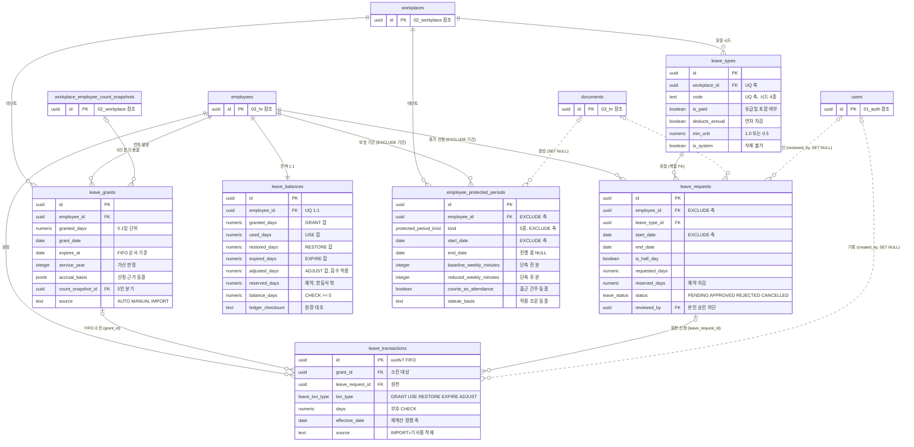

# 05_leave — 휴가·연차

> **대상**: insadesk — 휴가 도메인 **6테이블**(leave_types · leave_grants · leave_requests · leave_transactions · leave_balances · **employee_protected_periods**)
> **작성일**: 2026-08-03
> **개정일**: 2026-08-09 — 후속 반영 — **자동 발생 멱등 축 신설**(부분 UQ (employee_id, grant_date) WHERE source = 'AUTO' · REQ-GLB-14) · RLS 요약 미러를 확정 정책과 동기화(leave_types 본인 축 · employee_protected_periods #162~#164)
> **개정일**: 2026-08-09 — 커버리지 감사 반영 — **employee_protected_periods 신설**(테이블 59 · 출근 간주 기간 5종 저장 · 5 → **6테이블**) · leave_balances 항등식을 원장 5종 전체로 재정의(restored_days·adjusted_days 신설 · 13 → **15컬럼**) · expires_at NOT NULL 전환 · leave_transactions.grant_id 조건부 CHECK와 서술 통일 · 반차 정합 CHECK · leave_type_id 복합 FK 전환 · 예약 정합 검증 트리거 신설
> **개정일**: 2026-08-08 — leave_grants.expires_at 산정 규칙(REQ-LEV-02) 링크·NULL 금지·퇴사 시 정산 이관 명시 · leave_transactions EXPIRE 행의 발생 단위 연결과 보상 미정산분 판별 계약 등재(신규 컬럼 없음)
> **원천**: docs_ref2/schema_p0.md 테이블 — leave(5) · docs_ref2/requirements_p0.md REQ-LEV · REQ-WRK-03·16 · REQ-GLB-11. **employee_protected_periods는 원천에 없는 신설 테이블**이며 근거는 REQ-LEV-04(§60⑥ 출근 간주 기간)가 요구를 서술하고도 저장 구조를 갖지 못했다는 점이다 — 원천 5 + 신설 1 = **6테이블**

**발생(leave_grants) → 원장(leave_transactions, append-only) → 요약(leave_balances, 역정규화) 3단 분리**가 이 도메인의 골격이다. **원장이 진실 원천**이고 잔액은 언제든 원장에서 재계산 가능해야 한다.

**연차 발생은 5인 이상에서만 성립한다.** 근기법 §60은 5인 미만 사업장에 적용되지 않으므로(SIZE_POLICY LB-60) leave_grants가 count_snapshot_id로 판정 근거를 동결하고, 스냅샷이 없으면 발생 자체를 차단한다.

**적용 대상이 아닌 것(403)과 전제가 미충족인 것(422)을 구분한다.** 5인 미만은 leave.not_applicable/403(정상 상태)이고 스냅샷 부재는 leave.employee_count_snapshot_required/422(조치 가능)다.

**출근 간주 기간은 휴가가 아니라 별도 축이다.** 업무상 부상·질병 휴업 · 출산전후휴가 · 육아휴직 · 육아기 근로시간 단축 · 임신기 근로시간 단축은 근로기준법 §60⑥이 **소정근로일수와 출근일수 양쪽에 산입**하도록 정한 기간이며, 신청·승인·잔액 차감을 거치는 leave_requests로는 표현되지 않는다. employee_protected_periods가 그 축을 담고 연차 산정(REQ-LEV-04)과 배치 차단(REQ-ATT-15)이 함께 읽는다.

---

## 테이블 목록

| # | 테이블 | 보관 내용 | PK 타입 |
|---|--------|----------|---------|
| 32 | leave_types | 사업장별 휴가 유형 — 유급 여부·연차 차감·증빙·최소 단위 | uuid |
| 33 | leave_grants | 연차 발생 단위 — 일수·발생일·만료·산정 근거 동결 | uuid |
| 34 | leave_requests | 휴가 신청 — 기간·반차·예약 차감·승인 이력 | uuid |
| 35 | leave_transactions | 연차 원장(FIFO · append-only) — 발생·사용·복원·소멸·조정 | uuid(uuidv7) |
| 36 | leave_balances | 연차 잔액 요약(역정규화) — 원장 대조 체크섬 | uuid |
| **59** | **employee_protected_periods** | **출근 간주·보호 기간** — 유형 5종·기간·단축 근로시간·시행일 분기 | uuid |

**6테이블이다** — 32 · 33 · 34 · 35 · 36 · 59. 59는 도메인 번호가 아니라 **전역 테이블 통번호의 신설분**이며, 휴가 도메인에 속하되 근태(배치 차단)와 급여(출근율 → 연차 발생)가 함께 읽는다.

---

## 테이블 명세

### 32. leave_types — 사업장별 휴가 유형

기능ID **LEV-02** · 요구사항 REQ-LEV-08 · REQ-WRK-03(사업장 생성 시 시드).

| 컬럼명 | 타입 | NULL | 키 | 설명 |
|--------|------|:--:|----|------|
| id | uuid | N | PK · UQ* | 식별자. **(id, workplace_id) UQ** — leave_requests 복합 FK의 대상 키 |
| workplace_id | uuid | N | FK · UQ* | 테넌트 스코프. (workplace_id, code) UQ와 (id, workplace_id) UQ 두 조합의 축이다 |
| code | text | N | UQ* | (workplace_id, code) UQ. 시드 4종 — ANNUAL · ANNUAL_HALF · SICK · UNPAID |
| name | text | N | | 표시 명칭 |
| is_paid | boolean | N | | **유급이면 근로일·유급일에 포함되고 무급이면 공제 후보다** |
| deducts_annual | boolean | N | | 연차 차감 여부 |
| requires_evidence | boolean | N | | 증빙 필수 여부 |
| min_unit | numeric(3,1) | N | | v1은 1.0 또는 0.5(반차). **시간 단위는 범위 밖이다** |
| is_system | boolean | N | | 시드 기본유형. 삭제 불가 |
| is_active | boolean | N | | 활성 여부 |
| display_order | integer | N | | 표시 순서. **v1은 시드 4종의 고정 순서를 담을 뿐 조작 표면이 없다**(휴가 유형 관리 LEV-05는 v1에 두지 않는다) |
| created_at | timestamptz | N | | DEFAULT now() |
| updated_at | timestamptz | N | | DEFAULT now() + set_updated_at 트리거 |

- **13컬럼이다.**
- 제약: PK(id) · UNIQUE(workplace_id, code) · **UNIQUE(id, workplace_id)** — 대상 키 · FK workplace_id.
- 인덱스: leave_types_pkey · UNIQUE(workplace_id, code) · UNIQUE(id, workplace_id).
- 트리거: set_updated_at().
- **(id, workplace_id) UQ는 조회 성능이 아니라 복합 FK를 성립시키기 위한 것이다.** PostgreSQL은 FK 대상이 PK 또는 UNIQUE여야 하므로 이 조합에 UQ가 없으면 leave_requests가 테넌트 축을 FK에 끼워 넣을 수 없다.
- **is_paid는 가변이므로 판정 결과를 소비처가 복사한다** — 근태 일 집계가 leave_is_paid_snapshot으로 동결한다([04_attendance.md](./04_attendance.md)). 유형 정의를 나중에 고쳐도 마감된 날의 유급 판정이 뒤집히지 않는다.
- **DELETE가 없다** — 정리는 is_active = false다. 과거 신청이 leave_type_id로 참조한다.
- **전역 lookup으로 축소하지 않았다.** LEV-05(휴가 유형 관리)가 v1 제외라 전역화를 검토했으나 REQ-WRK-03이 사업장 생성 시 휴가 유형 시드를 명시하므로 workplace 스코프를 유지한다. v1의 쓰기는 시드뿐이다.
- legacy의 name 키를 **code로 정규화**했다 — 표시 명칭이 키를 겸하면 명칭 변경이 참조를 깨뜨린다.

### 33. leave_grants — 연차 발생 단위

기능ID **LEV-01** · 요구사항 REQ-LEV-02·03·04·05.

| 컬럼명 | 타입 | NULL | 키 | 설명 |
|--------|------|:--:|----|------|
| id | uuid | N | PK | 식별자 |
| workplace_id | uuid | N | FK | 테넌트 스코프 |
| employee_id | uuid | N | FK | 대상 직원 |
| user_id | uuid | Y | | 비정규화. FK가 아니다 |
| granted_days | numeric(6,1) | N | | **0.1일 단위**. CHECK > 0 |
| grant_date | date | N | | 발생일 |
| expires_at | date | **N** | | 사용기간 만료일. **FIFO 소진 순서와 소멸(EXPIRE) 배치의 유일한 기준**이라 NULL을 허용하지 않는다. 산정 규칙은 REQ-LEV-02가 정본이다([../03_requirements/06_leave.md](../03_requirements/06_leave.md)) |
| service_year | integer | Y | | 계속근로 연차. 1년차·3년차 가산 판정 축 |
| reason | text | Y | | 발생 사유. **관리자 수동 부여(source = 'MANUAL')는 필수**이며 CHECK가 강제한다 — 자동 산정분의 근거는 accrual_basis가 담는다 |
| accrual_basis | jsonb | Y | | **산정 근거 동결** — {rule, attendance_days, scheduled_days, rate_numerator, rate_denominator, proration} |
| count_snapshot_id | uuid | Y | FK → workplace_employee_count_snapshots.id | **5인 분기 동결.** 5인 미만 기간은 법정 연차 미발생 |
| source | text | N | | CHECK IN ('AUTO','MANUAL','IMPORT') |
| retention_until | date | Y | | 보존 만료일. **기산일은 퇴직일 + 3년**이며 기산 규칙 등재 전까지 NULL을 유지하고 파기 대상으로 삼지 않는다 |
| created_at | timestamptz | N | | DEFAULT now() |
| updated_at | timestamptz | N | | DEFAULT now() + set_updated_at 트리거 |

- **15컬럼이다.**
- 제약: PK(id) · CHECK granted_days > 0 · CHECK source 3값 · **CHECK source <> 'MANUAL' OR (reason IS NOT NULL AND btrim(reason) <> '')** · FK workplace_id · FK employee_id · FK count_snapshot_id.
- 인덱스 **5종**: leave_grants_pkey · **부분 UQ (employee_id, grant_date) WHERE source = 'AUTO'** — 자동 발생 멱등 · (employee_id, grant_date) — 발생 이력 조회(전 source) · **(employee_id, expires_at)** — FIFO 소진·소멸 배치 · 부분 (user_id) WHERE user_id IS NOT NULL.
- 트리거 **3종**: guard_leave_grant_snapshot() — 스냅샷 부재 시 발생 차단 · guard_employee_workplace_match() · set_updated_at().
- **expires_at을 NOT NULL로 둔 것이 이 테이블의 핵심 변경이다** — 연 단위 발생분은 발생일 + 1년, 1년 미만 월 단위 발생분은 입사일 + 1년이며(REQ-LEV-02), 임포트 이관분도 적재 시점에 같은 규칙으로 산정해 채운다.
- **nullable로 두면 서술만으로 강제되고 그 행은 소멸 배치에서 통째로 빠진다.** 부분 인덱스의 WHERE expires_at IS NOT NULL 조건이 NULL 행을 제외하므로 **영구히 소멸하지 않는 연차**가 생기고, 그것이 연차미사용수당의 미사용 일수(잔여 + 소멸 미정산분 — REQ-LEV-12)를 동시에 오염시킨다. 컬럼이 NOT NULL이 되었으므로 인덱스도 전체 인덱스로 바꾼다.
- **퇴사 시 잔여 발생분은 소멸(EXPIRE)이 아니라 퇴직 정산으로 넘어간다** — 만료일이 남았는데 소멸시키면 연차미사용수당 대상이 사라진다.
- **INSERT·UPDATE는 서버 시스템 컨텍스트 전용이다** — accrueAndExpireLeave 배치(00:40)와 관리자 수동 부여 서비스만 쓴다.

#### 자동 발생의 멱등 축 — (직원, 발생일)

**정기작업 accrueAndExpireLeave는 재실행되며, 재실행이 연차를 두 번 발생시키면 안 된다**(REQ-GLB-14). 배치 실패 후 재시도·중복 기동·같은 날 두 번 실행이 전부 같은 결과로 수렴해야 한다.

| 축 | 값 | 근거 |
|----|----|------|
| 대상 | employee_id | 발생은 직원 단위다 |
| 시점 | grant_date | **발생일은 산식이 결정론적으로 산출한다** — 입사일 기산의 월 응당일(①③) 또는 근속 연 응당일(②④)이라 같은 발생 사건이 두 날짜를 갖지 않는다 |
| 범위 | WHERE source = 'AUTO' | 관리자 수동 부여(MANUAL)와 이관 적재(IMPORT)는 같은 날 여러 건이 정상이다 |

- **네 산식이 같은 날 겹치지 않는 것이 이 축의 성립 근거다.** ①의 월 단위 발생은 최대 11개월차까지이고 ②④의 연 단위 발생은 근속 1주년 이후이므로, 한 직원에게 같은 날 두 건의 자동 발생이 생기는 경로가 없다. ③의 월 단위 발생도 응당일이 하나다.
- **배치는 이 제약을 충돌 무시(ON CONFLICT DO NOTHING)의 대상 축으로 쓴다** — 이미 발생한 건은 조용히 건너뛰므로 에러가 표면화되지 않는다. 발생 경로는 배치와 서버 서비스뿐이라 클라이언트 표면이 없고, 서버 수동 경로가 이 축을 위반하면 common.conflict/409다.
- **재산정은 새 AUTO 행이 아니다.** 출근율 재판정으로 일수가 달라지면 원장에 ADJUST를 쌓거나 MANUAL 부여로 처리한다 — 같은 발생일에 AUTO 행을 덧쓰면 어느 것이 법정 발생분인지 알 수 없게 된다.

#### 출근율 80% 판정은 정수 비교다

accrual_basis가 판정 입력을 남긴다.

```
출근일수 × 5  >=  소정근로일수 × 4      -- 80%를 분수로 바꿔 정수 비교
```

- **비율을 부동소수점으로 계산해 0.8과 비교하면 경계에서 판정이 뒤집힌다.** 그래서 분자·분모를 그대로 남기고 곱셈으로 비교한다.
- accrual_basis에 rule · attendance_days · scheduled_days · rate_numerator · rate_denominator · proration을 남겨 산정을 재현한다 — 이력만으로는 왜 그 일수가 나왔는지 설명할 수 없다.

#### 규모 분기와 차단

| 상황 | 처리 | 에러 |
|------|------|------|
| 스냅샷 부재 | 발생 차단 | leave.employee_count_snapshot_required/422 |
| 5인 미만(applies_five = false) | 미적용 | leave.not_applicable/403 |

- **403과 422를 구분하는 것이 규약이다**(REQ-GLB-19). 5인 미만은 조치할 것이 없는 정상 상태이고 스냅샷 부재는 산정 후 재시도 가능한 전제 미충족이다.
- 연차 사용촉진(LEV-07)은 v1에 두지 않는다. **v1은 촉진 미지원이므로 미사용 연차를 항상 보상 대상으로 계산하고 그 사실을 결과에 표기한다.** 도입 시 promotion_status · promotion_notified_at 컬럼을 추가한다.

### 34. leave_requests — 휴가 신청

기능ID **LEV-02·03** · 요구사항 REQ-LEV-08·09·10.

| 컬럼명 | 타입 | NULL | 키 | 설명 |
|--------|------|:--:|----|------|
| id | uuid | N | PK · UQ* | 식별자. **(id, workplace_id) UQ** — attendance_daily_summaries 복합 FK의 대상 키 |
| workplace_id | uuid | N | FK* · UQ* | 테넌트 스코프. leave_types 복합 FK의 축을 겸한다 |
| employee_id | uuid | N | FK | 신청 대상 직원 |
| user_id | uuid | Y | | 비정규화. FK가 아니다 |
| leave_type_id | uuid | N | FK* | 휴가 유형. **(leave_type_id, workplace_id) → leave_types(id, workplace_id) 복합 FK** |
| start_date | date | N | | 시작일 |
| end_date | date | N | | 종료일. CHECK >= start_date |
| is_half_day | boolean | N | | 반차 여부 |
| half_day_period | text | Y | | CHECK IN ('AM','PM') |
| requested_days | numeric(6,1) | N | | 신청 일수. CHECK > 0 |
| reserved_days | numeric(6,1) | N | | **예약 차감 일수**(확정 차감이 아니다). 반려·취소 시 복원한다 |
| reason | text | Y | | 사유 |
| evidence_document_id | uuid | Y | FK → documents.id (**SET NULL**) | 증빙 문서 |
| status | leave_status | N | | DEFAULT PENDING |
| reviewed_by | uuid | Y | FK → users.id (**SET NULL**) | 승인·반려자 |
| reviewed_at | timestamptz | Y | | 처리 시각 |
| review_note | text | Y | | 승인·반려 사유 |
| created_at | timestamptz | N | | DEFAULT now() |
| updated_at | timestamptz | N | | DEFAULT now() + set_updated_at 트리거 |

- **19컬럼이다.**
- 제약: PK(id) · **UNIQUE(id, workplace_id)** — 대상 키 · CHECK end_date >= start_date · CHECK requested_days > 0 · CHECK half_day_period 2값 · **CHECK is_half_day = false OR (requested_days = 0.5 AND half_day_period IS NOT NULL AND start_date = end_date)** · **CHECK is_half_day = true OR half_day_period IS NULL** · **EXCLUDE USING gist (employee_id WITH =, daterange(start_date, end_date + 1) WITH &&) WHERE status IN ('PENDING','APPROVED')** → leave.request_overlap/409 · FK workplace_id · FK employee_id · **복합 FK (leave_type_id, workplace_id) → leave_types(id, workplace_id)** · FK evidence_document_id SET NULL · FK reviewed_by SET NULL.
- 인덱스: leave_requests_pkey · UNIQUE(id, workplace_id) · (workplace_id, status, start_date) — 승인 대기 목록 · 부분 (user_id, start_date DESC) WHERE user_id IS NOT NULL · EXCLUDE 부수 gist 인덱스.
- 트리거 **6종**: guard_self_approval() · guard_request_status_transition() · **guard_locked_period()** · **guard_employee_workplace_match()** · **check_leave_reservation_balance()**(DEFERRABLE CONSTRAINT TRIGGER) · set_updated_at().
- **본인 요청 본인 승인을 차단한다** → leave.self_approval_forbidden/403.
- **반차 정합을 CHECK 두 개가 함께 강제한다.** v1의 최소 단위는 1일과 0.5일뿐이므로(REQ-LEV-08) 반차 신청은 반드시 0.5일·단일 일자·오전/오후 지정을 갖고, 반차가 아니면 오전/오후 지정을 갖지 않는다. 이 결속이 없으면 "반차인데 3일"이나 "반차인데 시간대 미지정" 같은 행이 통과해 차감 일수와 근태 판정이 어긋난다.
- **leave_type_id를 복합 FK로 둔 이유가 테넌트 오염 차단이다.** 단일 컬럼 FK는 FK 검사가 RLS를 우회하므로 타 사업장 유형의 id를 알면 참조가 성립한다. workplace_id를 FK에 끼워 넣으면 그 조합이 존재하지 않아 거부된다 — contract_signatures가 같은 방식으로 교차 사업장 서명을 막는다.
- **guard_locked_period()가 마감 기간의 신청·변경을 차단한다** → leave.period_closed/409. 승인은 근태 일 집계에 ON_LEAVE를 반영하므로(REQ-LEV-10), 마감된 기간에 휴가가 들어오면 마감된 판정 결과가 근거를 잃는다.

#### 상태 전이와 예약 차감

| 전이 | 조건 |
|------|------|
| PENDING → APPROVED · REJECTED | 관리자(비신청자) |
| PENDING → CANCELLED | 본인 |
| APPROVED → CANCELLED | **관리자(비신청자)가 마감 미도래 · 차감 복원 조건 충족 시에만** |
| REJECTED · CANCELLED | 종결 · 불변 |

- 마감 기간과 충돌하면 leave.period_closed/409다 — 판정은 guard_locked_period()가 한다.
- **reserved_days가 없으면 동시 신청으로 잔액이 음수가 된다.** 신청 시점에 예약 차감하고 승인 시 확정 차감(원장 USE 행)으로 넘긴다. 반려·취소는 예약을 복원한다.
- **예약 복원 누락은 감지 경로가 있어야 한다.** 예약은 원장 행이 아니라 ledger_checksum의 대조 범위 밖이므로, check_leave_reservation_balance()가 **leave_balances.reserved_days = Σ 본 테이블의 PENDING reserved_days** 불변식을 트랜잭션 종료 시점에 검증한다. 이 장치가 없으면 잔액이 실제보다 적게 보이는 상태가 감지 없이 영구 누적된다.
- **동시성**: 신청·승인은 leave_balances 행을 FOR UPDATE로 잡아 직렬화한다(REQ-GLB-15).
- EXCLUDE가 PENDING·APPROVED 상태의 기간 겹침을 막는다 — 같은 날에 두 건이 승인되면 차감이 두 배가 된다.

### 35. leave_transactions — 연차 원장 (FIFO · append-only)

기능ID **LEV-01·04** · 요구사항 REQ-LEV-06·07.

| 컬럼명 | 타입 | NULL | 키 | 설명 |
|--------|------|:--:|----|------|
| id | uuid | N | PK | 식별자. **uuidv7()** — 시간정렬이 FIFO 재구성에 직결된다 |
| workplace_id | uuid | N | FK | 테넌트 스코프 |
| employee_id | uuid | N | FK | 대상 직원 |
| user_id | uuid | Y | | 비정규화. FK가 아니다 |
| grant_id | uuid | Y | FK → leave_grants.id | **소진·복원·소멸이 대상으로 삼은 발생 단위**(FIFO 연결). **USE · RESTORE · EXPIRE는 필수**이며 CHECK가 강제한다. GRANT는 자기 발생분이라 채우지 않고 ADJUST만 NULL을 허용한다 |
| leave_request_id | uuid | Y | FK → leave_requests.id | 원천 신청 |
| txn_type | leave_txn_type | N | | GRANT · USE · RESTORE · EXPIRE · ADJUST |
| days | numeric(6,1) | N | | **+발생 / −사용**. CHECK <> 0 |
| effective_date | date | N | | 효력일 |
| memo | text | Y | | 메모 |
| source | text | N | | CHECK IN ('AUTO','MANUAL','IMPORT'). **IMPORT = WRK-16 기 사용 연차 적재분** |
| created_by | uuid | Y | FK → users.id (**SET NULL**) | 기록자 |
| retention_until | date | Y | | 보존 만료일. **기산일은 퇴직일 + 3년**이며 기산 규칙 등재 전까지 NULL을 유지하고 파기 대상으로 삼지 않는다 |
| created_at | timestamptz | N | | DEFAULT now() |

- **14컬럼이다.** updated_at을 갖지 않는다 — append-only다.
- 제약: PK(id) · CHECK days <> 0 · **CHECK (txn_type IN ('GRANT','RESTORE','ADJUST') AND days > 0) OR (txn_type IN ('USE','EXPIRE') AND days < 0) OR (txn_type = 'ADJUST')** · **CHECK txn_type NOT IN ('USE','RESTORE','EXPIRE') OR grant_id IS NOT NULL** · CHECK source 3값 · FK workplace_id · FK employee_id · FK grant_id · FK leave_request_id · FK created_by SET NULL.
- 인덱스: leave_transactions_pkey · **(employee_id, effective_date, id)** — 원장 재계산 순서 고정 · 부분 (grant_id) WHERE grant_id IS NOT NULL · 부분 (user_id) WHERE user_id IS NOT NULL.
- 트리거 **2종**: prevent_mutation() · guard_employee_workplace_match().
- **정렬 인덱스가 (employee_id, effective_date, id)인 것이 재현성의 근거다.** uuidv7이 시간정렬이므로 같은 효력일 안에서도 기록 순서가 결정론적으로 복원된다.
- **기 사용 연차 적재는 txn_type = 'ADJUST' · source = 'IMPORT'다**(WRK-16). 자동 산정분과 구분해 근거·행위자를 감사 보존한다 — **이 경로가 없으면 잔액이 0부터 시작해 연차 계산이 처음부터 틀린다.**
- ADJUST는 부호 CHECK의 예외다 — 감액 조정이 필요할 수 있어 양·음 양방향을 허용한다.
- **EXPIRE 행은 grant_id를 채워 소멸된 발생 단위를 남긴다 — CHECK가 그것을 강제한다.** 연차미사용수당의 미사용 일수가 "정산 기준일 잔여 + 촉진 미이행 소멸분 중 보상 미정산분"이므로(REQ-LEV-12), 어떤 발생분이 소멸했는지가 원장에 남지 않으면 보상 대상을 재구성할 수 없다. RESTORE도 같은 이유로 대상 발생 단위를 요구한다 — 어느 발생분으로 되돌렸는지가 없으면 FIFO 재구성이 깨진다.
- **정산 사실을 원장에 플래그로 두지 않는다.** append-only 원장에 사후 표시를 남기려면 UPDATE 경로를 열어야 하는데 그것이 원장의 진실 원천 지위를 무너뜨린다. 대신 **보상 정산의 기록을 확정 급여 쪽에 둔다** — payroll_employee_result_items의 연차미사용수당 라인이 정산 일수와 **정산 대상 EXPIRE 행 ID 배열**을 함께 보존하며([06_payroll.md](./06_payroll.md)), 미정산분 판별은 정산 기준일 이전 EXPIRE 행 집합에서 그 배열의 합집합을 뺀 차집합이다.
- **"급여 확정이 급여월당 1회뿐"이라는 사실만으로는 이중 정산을 막지 못한다.** 그것은 같은 월의 중복 확정만 배제할 뿐, 후속 급여월이나 퇴직 정산 실행이 앞서 정산된 EXPIRE 행을 다시 집계하는 경로는 배제하지 않는다 — 대조 축이 급여 라인에 있어야 성립한다.

### 36. leave_balances — 연차 잔액 요약 (역정규화)

기능ID **LEV-04** · 요구사항 REQ-LEV-06.

| 컬럼명 | 타입 | NULL | 키 | 설명 |
|--------|------|:--:|----|------|
| id | uuid | N | PK | 식별자 |
| workplace_id | uuid | N | FK | 테넌트 스코프 |
| employee_id | uuid | N | FK · **UQ** | 1:1 |
| user_id | uuid | Y | | 비정규화. FK가 아니다 |
| granted_days | numeric(7,1) | N | | 누적 발생 — 원장 GRANT 합. CHECK >= 0 |
| used_days | numeric(7,1) | N | | 누적 사용 — 원장 USE의 절댓값 합. CHECK >= 0 |
| **restored_days** | numeric(7,1) | N | | **누적 복원 — 원장 RESTORE 합.** DEFAULT 0 · CHECK >= 0 |
| expired_days | numeric(7,1) | N | | 소멸 — 원장 EXPIRE의 절댓값 합. CHECK >= 0 |
| **adjusted_days** | numeric(7,1) | N | | **누적 조정 — 원장 ADJUST 합.** DEFAULT 0 · **부호를 그대로 담는다**(감액 조정이 있어 음수를 허용한다) |
| reserved_days | numeric(7,1) | N | | 예약 차감(PENDING 신청분). CHECK >= 0 |
| balance_days | numeric(7,1) | N | | 잔여. **CHECK >= 0** — 음수 잔액 방지 |
| ledger_checksum | text | Y | | **원장 재계산 대조값** — (employee_id, effective_date, id) 순서로 정렬한 원장 행의 (txn_type, days, effective_date, id) 튜플 열을 해시한 값이다. 불일치 시 조회 API가 경고 + 관리자 재계산 액션을 노출한다 |
| recomputed_at | timestamptz | N | | 최종 재계산 시각 |
| created_at | timestamptz | N | | DEFAULT now() |
| updated_at | timestamptz | N | | DEFAULT now() + set_updated_at 트리거 |

- **15컬럼이다.**
- 제약: PK(id) · UNIQUE(employee_id) · **CHECK balance_days = granted_days − used_days − expired_days + restored_days + adjusted_days** · **CHECK balance_days >= 0** · **CHECK balance_days >= reserved_days** · CHECK granted_days · used_days · restored_days · expired_days · reserved_days >= 0 · FK workplace_id · FK employee_id.
- 인덱스: leave_balances_pkey · UNIQUE(employee_id) · (workplace_id).
- 트리거 **3종**: **check_leave_reservation_balance()**(DEFERRABLE CONSTRAINT TRIGGER) · guard_employee_workplace_match() · set_updated_at().
- **원장이 정본이고 본 테이블은 O(1) 조회용 캐시다** — 불일치가 발견되면 원장에서 재계산한다. ledger_checksum이 그 불일치를 조회 시점에 감지하는 장치다.

#### 항등식이 원장 5종을 전부 담아야 성립한다

원장 유형은 **GRANT · USE · RESTORE · EXPIRE · ADJUST 5종**인데 요약 컬럼이 셋(발생·사용·소멸)뿐이면 항등식이 성립할 수 없다.

```
balance_days = granted_days − used_days − expired_days + restored_days + adjusted_days
```

- **RESTORE를 used_days에서 빼는 방식으로 우회하면 "누적 사용"이라는 컬럼 의미가 깨진다** — 사용 내역 조회가 실제 사용량보다 적은 값을 보여주고, ADJUST를 granted_days에 섞으면 "누적 발생"이 법정 발생 일수와 달라져 연차 발생 이력이 왜곡된다.
- 감액 조정이 있으므로 **adjusted_days만 음수를 허용**한다. 원장의 부호 CHECK에서 ADJUST가 예외인 것과 같은 이유다.
- 다섯 컬럼이 원장 5종과 1:1로 대응하므로 재계산은 유형별 합산 한 번으로 끝나고, ledger_checksum이 그 합산의 입력 집합이 바뀌지 않았음을 보증한다.
- **CHECK 넷이 함께 성립해야 잔액이 의미를 갖는다** — 항등식 · 음수 금지 · 예약분이 잔액을 초과하지 않을 것 · 조정을 뺀 누적값이 음수가 아닐 것.
- **예약분(reserved_days)은 원장 행이 아니라 항등식에 들어가지 않는다.** 그래서 ledger_checksum이 검증하지 못하며, check_leave_reservation_balance()가 leave_requests의 PENDING 합과 대조하는 별도 장치를 맡는다.

### 59. employee_protected_periods — 출근 간주·보호 기간 (신설)

기능ID **LEV-01** · **ATT-09** · 요구사항 **REQ-LEV-04** · REQ-LEV-03 · REQ-ATT-15.

**근로기준법 §60⑥의 출근 간주 기간을 담는 유일한 저장 구조다.** 이 축이 없으면 출산전후휴가·육아휴직 기간이 결근으로 잡혀 출근율 80% 판정이 뒤집히고, 연차가 발생하지 않아야 할 사람에게 발생하거나 발생해야 할 사람에게 발생하지 않는다.

| 컬럼명 | 타입 | NULL | 키 | 설명 |
|--------|------|:--:|----|------|
| id | uuid | N | PK | 식별자 |
| workplace_id | uuid | N | FK | 테넌트 스코프 |
| employee_id | uuid | N | FK | 대상 직원 |
| user_id | uuid | Y | | 비정규화(본인 조회 가속). **FK가 아니다** |
| kind | protected_period_kind | N | | **5종** — OCCUPATIONAL_INJURY_LEAVE(업무상 부상·질병 휴업) · MATERNITY_LEAVE(출산전후휴가 등 §74①~③) · PARENTAL_LEAVE(육아휴직) · CHILDCARE_REDUCED_HOURS(육아기 근로시간 단축) · PREGNANCY_REDUCED_HOURS(임신기 근로시간 단축 §74⑦) |
| start_date | date | N | | 시작일(KST) |
| end_date | date | Y | | 종료일(KST). CHECK >= start_date. **진행 중이면 NULL** |
| baseline_weekly_minutes | integer | Y | | **단축 전 주 소정근로시간(분).** 단축 2종만 갖는다 |
| reduced_weekly_minutes | integer | Y | | **단축 후 주 소정근로시간(분).** 단축 2종만 갖는다. 단축분 = baseline − reduced이며 그 분이 출근 간주 대상이다 |
| counts_as_attendance | boolean | N | | DEFAULT true. **출근 간주 적용 여부 동결.** 단축 2종이 시행일 이전 구간이면 false다 |
| statute_basis | text | N | | 적용 조문 코드 — LB-60-6-1 ~ LB-60-6-5. **시행일 경계로 조문 적용이 갈리므로 판정 결과를 동결한다** |
| evidence_document_id | uuid | Y | FK → documents.id (**SET NULL**) | 증빙 문서(진단서·출산 증빙·육아휴직 확인서 등) |
| created_by | uuid | Y | FK → users.id (**SET NULL**) | 등록자 |
| created_at | timestamptz | N | | DEFAULT now() |
| updated_at | timestamptz | N | | DEFAULT now() + set_updated_at 트리거 |

- **15컬럼이다.**
- 제약: PK(id) · CHECK end_date IS NULL OR end_date >= start_date · **CHECK (kind IN ('CHILDCARE_REDUCED_HOURS','PREGNANCY_REDUCED_HOURS')) = (reduced_weekly_minutes IS NOT NULL)** — 단축 2종만 분 값을 갖는다 · **CHECK reduced_weekly_minutes IS NULL OR (reduced_weekly_minutes >= 0 AND baseline_weekly_minutes > reduced_weekly_minutes)** · **EXCLUDE USING gist (employee_id WITH =, kind WITH =, daterange(start_date, coalesce(end_date,'infinity'),'[)') WITH &&)** — 동일 직원·동일 유형 기간 겹침 차단 · FK workplace_id · FK employee_id · FK evidence_document_id SET NULL · FK created_by SET NULL.
- 인덱스 **5종**: employee_protected_periods_pkey · (employee_id, start_date) · 부분 (workplace_id, kind) WHERE end_date IS NULL — 진행 중 구간 조회(배치 차단 판정) · 부분 (user_id) WHERE user_id IS NOT NULL — 본인 조회 · EXCLUDE 부수 gist 인덱스.
- 트리거 **3종**: **guard_protected_period_effective_date()** · guard_employee_workplace_match() · set_updated_at().
- **DELETE가 없다** — 정리는 end_date 확정이다. 오등록의 정정은 기간을 좁히는 UPDATE이며, 확정된 과거 구간은 연차 발생의 근거라 지우지 않는다.
- **INSERT·UPDATE는 관리자 또는 서버 시스템 컨텍스트다.** 본인 SELECT는 멤버십을 보지 않는다 — 출산전후휴가·육아휴직 기간은 본인의 근로 사실 기록이고 연차 발생의 근거이므로 퇴사 후에도 조회된다(CMP-07 축).

#### 유형 5종과 출근 간주 규칙

**다섯 기간은 소정근로일수와 출근일수 양쪽에 포함한다**(REQ-LEV-04). 결근으로 보지 않는 것이 아니라 **출근한 것으로 세는 것**이며, 둘은 출근율 = 출근일수 ÷ 소정근로일수의 분자·분모를 함께 바꾸므로 결과가 다르다.

| kind | 근거 | 저장 형태 |
|------|------|----------|
| OCCUPATIONAL_INJURY_LEAVE | §60⑥ ① 업무상 부상·질병 휴업기간 | 일 단위 기간 |
| MATERNITY_LEAVE | §60⑥ ② 출산전후휴가 등(§74①~③) | 일 단위 기간 |
| PARENTAL_LEAVE | §60⑥ ③ 육아휴직 | 일 단위 기간 |
| **CHILDCARE_REDUCED_HOURS** | §60⑥ ④ 육아기 근로시간 단축으로 단축된 근로시간 | 기간 + **단축 전·후 주 소정근로 분** |
| **PREGNANCY_REDUCED_HOURS** | §60⑥ ⑤ 임신기 근로시간 단축으로 단축된 근로시간(§74⑦) | 기간 + **단축 전·후 주 소정근로 분** |

- **④·⑤는 일 단위 휴가로 표현되지 않는다.** 근로는 제공하되 시간이 줄어든 상태이므로 출근 간주 대상은 날이 아니라 **줄어든 분**이다. baseline_weekly_minutes와 reduced_weekly_minutes 두 컬럼이 그 차이를 계산 가능하게 만든다 — 한쪽만 두면 단축분을 복원할 수 없다.
- **④·⑤는 법률 제20520호 신설이라 시행일 2025-10-23 이후 기간에만 적용한다**(REQ-LEV-04). guard_protected_period_effective_date()가 시행일 이전 구간에 counts_as_attendance = true를 두는 것을 차단하며, 기간이 시행일을 걸치면 **행을 두 구간으로 나눠 등록**한다 — 한 행 안에서 적용·미적용이 갈리면 출근율 산입이 통째로 틀린다.
- statute_basis는 kind에서 파생될 것처럼 보이지만 그렇지 않다 — **④·⑤는 같은 kind라도 시행일 경계에 따라 §60⑥이 적용되기도 하고 아니기도 하므로**, 판정 시점에 어느 조문을 적용했는지를 값으로 남긴다.

#### 두 도메인이 함께 읽는다

| 소비처 | 읽는 것 | 근거 |
|--------|--------|------|
| 연차 발생(LEV-01) | 기간 · counts_as_attendance · 단축 분 | 출근율과 개근 판정의 산입(REQ-LEV-03 · REQ-LEV-04) |
| 근태 일 집계(ATT-04) | 진행 중 기간 | day_status를 ON_LEAVE로 두어 결근 판정에서 제외한다 — attendance_daily_summaries.protected_period_id가 그 근거를 동결한다([04_attendance.md](./04_attendance.md)) |
| 스케줄 편성(ATT-09) | PREGNANCY_REDUCED_HOURS 진행 구간 | 임신 중 근로자 연장근로 금지의 배치 차단 판정 입력(REQ-ATT-15 ④) — guard_minor_pregnancy_assignment()가 쓴다 |

- **휴가 신청(leave_requests)과 별개 축인 것이 요점이다.** 출산전후휴가·육아휴직은 연차 잔액을 차감하지 않고 예약 차감도 걸지 않으므로, 신청·승인·차감을 전제로 설계된 leave_requests에 얹으면 잔액 항등식이 깨진다.
- 그래서 **leave_types에 이 다섯을 유형으로 추가하지 않는다.** 시드는 ANNUAL · ANNUAL_HALF · SICK · UNPAID 4종 그대로다.

---

## RLS 정책 — 도메인 요약

정책 표현식 전수의 정본은 [08_rls_policies.md](./08_rls_policies.md)다.

| 테이블 | SELECT | INSERT | UPDATE | DELETE |
|--------|--------|--------|--------|--------|
| leave_types | 사업장 멤버 · **본인 신청·발생이 참조하는 유형**(퇴사 후 포함) | OWNER·MANAGER(v1은 시드만) | OWNER·MANAGER | — |
| leave_grants | 관리자 · 본인 | 서버(시스템 컨텍스트) | 서버(시스템 컨텍스트) | — |
| leave_requests | 관리자 · 본인 | ACTIVE 멤버십 본인 | STAFF는 본인 PENDING→CANCELLED · 승인·반려는 관리자 | — |
| leave_transactions | 관리자 · 본인 | 서버(시스템 컨텍스트) | — | — |
| leave_balances | 관리자 · 본인 | 서버(시스템 컨텍스트) | 서버(시스템 컨텍스트) | — |
| **employee_protected_periods** | 관리자 · 본인(user_id = current_user_id()) | 관리자 · 서버 | 관리자 · 서버 | — |

정책 번호는 leave_types #86~#88 · leave_grants #89~#91 · leave_requests #92~#94 · leave_transactions #95~#96 · leave_balances #97~#99 · **employee_protected_periods #162~#164**다.

- **본인 SELECT가 멤버십을 보지 않는다** — 보호 기간은 본인의 근로 사실 기록이며 연차 발생의 근거라 퇴사 후에도 조회된다(CMP-07 축). DELETE 정책을 두지 않으므로 정리는 end_date 확정이다.
- **leave_types의 SELECT가 본인 축을 갖는 것이 이 도메인의 비대칭 해소다** — 신청·발생·원장·잔액이 전부 본인 축을 갖는데 유형만 멤버십을 요구하면 퇴사자에게 유형 명칭·유급 여부가 0행이 되어 소유권 인가가 반쪽만 성립한다. 본인의 신청·발생이 참조하는 유형에 한해 멤버십 없이 보인다.

---

## ERD



---

## 관계

| 관계 | cardinality | ON DELETE | 의미 |
|------|:-----------:|:---------:|------|
| workplaces → leave_types | 1 : N | RESTRICT | 사업장 생성 시 시드된다 |
| workplaces → leave_grants · leave_requests · leave_transactions · leave_balances | 1 : N | RESTRICT | 테넌트 스코프 |
| employees → leave_grants | 1 : N | RESTRICT | 연차 발생 단위 |
| employees → leave_requests | 1 : N | RESTRICT | 휴가 신청 |
| employees → leave_transactions | 1 : N | RESTRICT | 원장. 진실 원천이라 삭제 경로가 없다 |
| employees → leave_balances | 1 : 1 | RESTRICT | UQ(employee_id)가 1:1을 강제한다 |
| leave_types → leave_requests | 1 : N | RESTRICT | 참조된 유형은 지워지지 않는다. **복합 FK (leave_type_id, workplace_id)** |
| workplaces → employee_protected_periods | 1 : N | RESTRICT | 테넌트 스코프 |
| employees → employee_protected_periods | 1 : N | RESTRICT | 보호 기간. EXCLUDE가 동일 유형 기간 겹침을 막는다 |
| employee_protected_periods → attendance_daily_summaries | 0..1 : N | RESTRICT | 출근 간주 기간의 ON_LEAVE 판정 근거([04_attendance.md](./04_attendance.md)) |
| documents → employee_protected_periods (evidence_document_id) | 0..1 : N | **SET NULL** | 증빙. 약한 참조 |
| users → employee_protected_periods (created_by) | 0..1 : N | **SET NULL** | 행위자 |
| leave_grants → leave_transactions | 0..1 : N | RESTRICT | FIFO 소진 연결. ADJUST·EXPIRE는 NULL 가능 |
| leave_requests → leave_transactions | 0..1 : N | RESTRICT | 원천 신청 |
| leave_requests → attendance_daily_summaries | 0..1 : N | RESTRICT | ON_LEAVE 판정 근거([04_attendance.md](./04_attendance.md)) |
| workplace_employee_count_snapshots → leave_grants | 0..1 : N | RESTRICT | 5인 분기 동결 |
| documents → leave_requests (evidence_document_id) | 0..1 : N | **SET NULL** | 증빙. 약한 참조 |
| users → leave_requests (reviewed_by) · leave_transactions (created_by) | 0..1 : N | **SET NULL** | 행위자 |

---

## 특이사항

**원장이 정본이고 잔액은 캐시다.** 이 분리가 없으면 잔액 오류를 발견해도 되돌릴 근거가 없다.

- leave_transactions는 append-only이며 prevent_mutation()이 UPDATE·DELETE를 차단한다.
- leave_balances는 네 CHECK(항등식 · 음수 금지 · 예약 상한 · 누적값 비음수)로 자기 정합을 지키고, ledger_checksum이 원장과의 정합을 조회 시점에 감지한다.
- **요약 컬럼은 원장 유형과 1:1이어야 한다.** 유형이 5종인데 컬럼이 셋이면 항등식이 성립할 수 없고, 억지로 맞추려 RESTORE를 사용에서 빼거나 ADJUST를 발생에 섞는 순간 컬럼 의미가 무너진다.
- 재계산 순서는 (employee_id, effective_date, id)로 고정한다 — id가 uuidv7이라 같은 날 안에서도 순서가 유일하게 결정된다.
- **grant_id를 USE·RESTORE·EXPIRE에 필수로 강제한다.** FIFO 재구성과 연차미사용수당 대상 복원이 그 연결에 전적으로 의존하므로, nullable로 두고 서술로만 요구하면 NULL 행 하나가 산정을 조용히 축소시킨다.

**예약 차감(reserved_days)이 동시성 방어의 핵심이다.** 신청 시점에 잔액을 예약하지 않으면 두 건이 동시에 승인 대기 상태로 들어가 합산이 잔액을 넘긴다.

- leave_balances 행 FOR UPDATE + balance_days >= reserved_days CHECK + EXCLUDE 기간 겹침 차단 + **check_leave_reservation_balance()**가 4중 방어다.
- **CHECK는 예약의 상한만 본다.** 반려·취소가 예약을 복원하지 않아도 balance_days >= reserved_days는 계속 성립하므로, 유령 예약은 잔액을 조용히 갉아먹으며 감지되지 않는다. 신청 테이블의 PENDING 합과 대조하는 트리거가 그 구멍을 막는다.
- **멱등성은 같은 요청의 중복만 막고 서로 다른 요청의 경합은 막지 못한다** — 그래서 잠금을 따로 건다.

**5인 미만은 연차를 발생시키지 않는다.** 근기법 §60이 5인 미만에 적용되지 않기 때문이며(SIZE_POLICY LB-60), 판정 근거는 상시근로자 스냅샷 하나뿐이다.

- count_snapshot_id가 발생 시점 판정을 동결하므로, 이후 규모가 5인 이상으로 바뀌어도 과거 미발생 사실이 소급 변경되지 않는다.
- 규모가 바뀐 뒤의 발생은 새 스냅샷을 근거로 새 grant 행이 담는다.

**연차 사용촉진(LEV-07)을 v1에 두지 않는다.** 촉진 절차를 이행하지 않으면 미사용 연차의 보상 의무가 남으므로, **v1은 미사용 연차를 항상 보상 대상으로 계산하고 그 사실을 급여 결과의 notes에 표기한다**(안전한 방향의 기본값이다).

**시간 단위 휴가는 범위 밖이다.** min_unit이 1.0 또는 0.5만 갖는 것이 그 표현이며, 시간 단위를 도입하면 근태 버킷 분해와 유급일 산정이 함께 바뀐다.

- 반차 정합 CHECK 두 개가 그 경계를 물리적으로 굳힌다 — 반차는 0.5일·단일 일자·오전/오후 지정을 함께 갖고, 반차가 아니면 오전/오후 지정을 갖지 않는다.

**출근 간주 기간을 휴가 유형으로 표현하지 않는다.** 출산전후휴가·육아휴직 등 다섯 기간은 연차 잔액을 차감하지 않고 예약도 걸지 않으므로, 차감을 전제로 설계된 leave_requests·leave_balances 축에 얹으면 잔액 항등식이 깨진다. employee_protected_periods가 별도 축으로 담고 근태·연차 양쪽이 읽는다.

- **육아기·임신기 근로시간 단축은 유형 추가만으로 해소되지 않는다** — 출근 간주 대상이 날이 아니라 줄어든 분이라 기간과 함께 단축 전·후 주 소정근로 분을 저장해야 한다.
- **시행일 2025-10-23 경계를 행 분할로 처리한다.** 한 행 안에서 적용·미적용이 갈리면 출근율 산입이 통째로 틀리므로 기간을 나눠 등록하고, 적용 결과를 counts_as_attendance와 statute_basis에 동결한다.

**통상근로자 주 소정근로시간은 이 도메인이 보유하지 않는다.** 단시간 비례 산정(REQ-LEV-05)의 분모는 사업장·직원 어느 컬럼도 아니고 **기준값 조회 축**이며, accrual_basis의 rate_numerator·rate_denominator는 그 조회 결과를 동결할 뿐 값의 출처가 아니다. 기준값 카테고리 등재 전까지 이 산정의 입력 정본은 미정이다.

**보존 기산일이 확정되기 전까지 retention_until은 NULL을 유지한다.** leave_grants·leave_transactions의 기산 규칙은 퇴직일 + 3년이며, 법정 보존 기산일 표에 등재되기 전에는 파기 배치 대상으로 삼지 않는다([07_constraints_integrity.md](./07_constraints_integrity.md)).

---

## 관련 문서

- 폴더 정본·접근 모델·타입 규약 → [README.md](./README.md)
- 전역 ERD·관계 요약 → [erd.md](./erd.md)
- 제약·EXCLUDE·불변식 CHECK 전수 → [07_constraints_integrity.md](./07_constraints_integrity.md)
- RLS 정책 전수 → [08_rls_policies.md](./08_rls_policies.md)
- 함수·트리거 전수 → [09_functions_triggers.md](./09_functions_triggers.md)
- 마이그레이션 배치(V0050__leave.sql) → [10_migrations_seed.md](./10_migrations_seed.md)
- 상시근로자 스냅샷 → [02_workplace.md](./02_workplace.md)
- 근태 일 집계 연계 → [04_attendance.md](./04_attendance.md)
- 연차수당 계산 → [06_payroll.md](./06_payroll.md)
- 임포트 적재 경로 → [17_infra.md](./17_infra.md)
- 기능 명세 → [../02_features/05_leave.md](../02_features/05_leave.md)
- 요구사항 → [../03_requirements/06_leave.md](../03_requirements/06_leave.md)
- API 표면 → [../06_api/07_leave.md](../06_api/07_leave.md)
