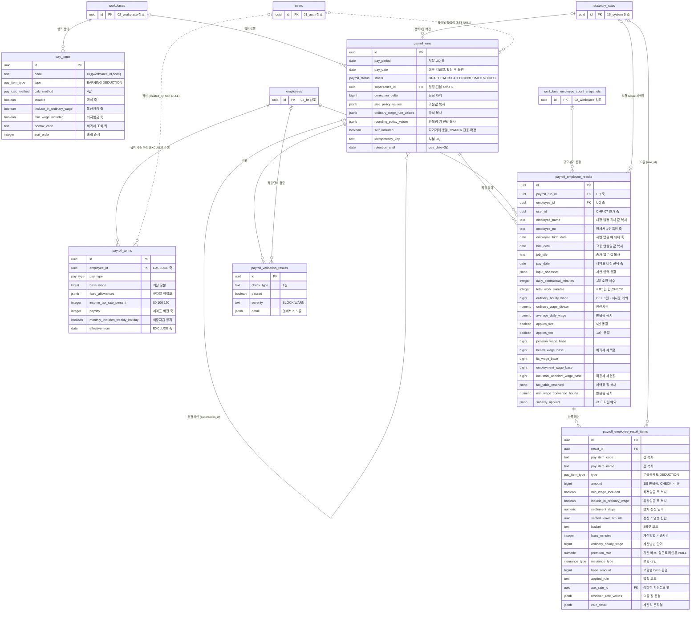

# 06_payroll — 급여

> **대상**: insadesk — 급여 도메인 6테이블(pay_items · payroll_terms · payroll_runs · payroll_employee_results · payroll_employee_result_items · payroll_validation_results)
> **작성일**: 2026-08-03
> **개정일**: 2026-09-10 — **ordinary_monthly_wage 의 반올림 키를 등재**한다(**올림 1원** · 채번 정본 [../03_requirements/01_global_rules.md](../03_requirements/01_global_rules.md) §1.1 10 → **11종** · §1.2 #18). bigint 라 반올림이 일어나는데 키가 없어 **구현이 정확 변환만 허용했고, divisor 를 곱해 소수가 생기는 시급제·일급제가 한 명이라도 있으면 실행 생성이 실패**하고 있었다. **이 열은 중간 반올림 재사용 예외가 아니다** — 저장값이 판정으로 돌아오지 않으므로 아래 예외 표에 자리가 없다. 함께 **rounding_policy_values 의 키 수를 9 → 11로 정정**한다(2026-09-09 의 9 → 10 개정이 훑지 못한 자리 · 컬럼 표와 mermaid 2자리). **테이블 6종 · 컬럼 · 제약 · 인덱스는 전건 불변**
> **개정일**: 2026-09-09 — **비과세 자격 요건 판정의 저장 축을 채번**한다(정본 [../03_requirements/07_payroll.md](../03_requirements/07_payroll.md)). ① **pay_items에 넷째 산입 축**(include_in_monthly_fixed_pay · DEFAULT true) — 월정액급여는 기존 3축의 어떤 조합으로도 유도되지 않는다. 16 → **17컬럼** ② **라인에도 동결**한다(payroll_employee_result_items 29 → **30컬럼**) — 어느 라인이 산입됐는지가 남지 않으면 금액만 있고 근거가 재현되지 않는다 ③ **check_type에 NONTAX_ELIGIBILITY 신설**(7 → **8값**) — **차단이 아닌 첫 값**이라 severity = WARN 전용이며, **enum이 아니라 text + CHECK라 enum 33종 132값은 불변**이다. **테이블 6종 · 정책 · 인덱스는 전건 불변**
> **개정일**: 2026-09-09 — **일수 3열의 타입과 계약이 갈리는 것을 등재**한다 — 열은 numeric(5,1)인데 단위 정본 · 명세서 계약 · 출근율 판정 **세 자리가 일관되게 정수를 지시**하고 소수를 요구하는 근거는 어디에도 없다(반일 축은 휴가 전용이다). **생산자는 정수 계수만 넣는다**를 계약으로 적고 **열 폭을 계약으로 읽지 않는다**를 함께 등재했다 — 열 좁힘 여부는 미결이다. **컬럼 60 · 제약 · 인덱스 · 트리거는 전건 불변**
> **개정일**: 2026-09-08 — 항목 라인의 **비과세 항목코드 미동결을 미결로 등재**한다(급여 레인 실측) — 라인이 nontax_code를 갖지 않아 **연 한도 비과세의 연 누계가 pay_items 카탈로그를 다시 읽고**, 카탈로그가 바뀌면 확정된 과거 결과의 누계 대상이 소급해 달라진다. **§1.4 결과 동결이 막으려는 형태**이며 열 추가가 필요한 자리라 **컬럼 수를 바꾸지 않고 등재만** 한다. 테이블 수·컬럼 수·제약은 전건 불변
> **개정일**: 2026-09-07 — 표 안의 SQL 이어붙임 연산자를 **이스케이프**한다(표 셀 열 수 검사 발견 · 1행). 마크다운 표에서 이스케이프하지 않은 세로줄은 **칸 구분자로 파싱되어** advisory lock 키 식이 중간에서 잘리고 **뒤 칸이 통째로 렌더에서 사라졌다.** 인라인 백틱을 쓸 수 없으므로(작성 규약) 이스케이프로 처리한다. **내용·잠금 지점 수는 전건 불변**
> **개정일**: 2026-09-06 — 백엔드 스택 전환(D-21 · ADR-25~29) 반영 — jsonb 수치 문자열 직렬화 근거 2곳의 표현을 JS number·ORM 레이어 → **부동소수점(double)·데이터 접근 계층**으로. 컬럼·제약·동결 규칙은 전건 불변
> **개정일**: 2026-08-09 — 통합 후속 3건 — 연차미사용수당 라인에 정산 대조 축 신설(settlement_days · settled_leave_txn_ids · 항목 라인 27 → **29컬럼**) · 명세서 ①호 동결의 생년월일 대체 축 보완(employee_birth_date · 직원별 결과 59 → **60컬럼**) · payroll_employee_result_items PK를 **uuid v4로 유지** 확정(근거 서술)
> **개정일**: 2026-08-09 — 커버리지 감사 반영 — 재계산 교체 경로 신설(서버 한정 DELETE 예외) · 계산 입력 스냅샷과 임금대장 법정 기재 4종 동결(payroll_employee_results 53 → **59컬럼**) · 항목 라인 3축 값 복사와 보조 기준값 축 추가(24 → **27컬럼**) · rate_version_snapshot 삭제(payroll_runs 33 → **32컬럼**) · premium_rate = **가산 배수** 확정과 실근로 라인 분리 · 무급공제 = **DEDUCTION** 확정 · 중간 반올림 예외 1 → **2건** 정정 · 검증 결과 유일성 제약 신설 · 세액표 버전 선택 축을 직원별 pay_date로 확정
> **개정일**: 2026-08-08 — 자녀 수 동결 컬럼 주석을 조회 3축 → **차감 축 입력값**으로 정정(2축 조회 확정 반영)
> **개정일**: 2026-08-08 — 지급일 보정을 플랫폼 단일 규칙으로 일원화 — payroll_terms.payday_holiday_policy 컬럼 삭제(16 → **15컬럼**) · payroll_runs.pay_date 설명을 단일 보정 규칙 적용 결과 동결로 정정
> **개정일**: 2026-08-03 — 재포함 범위·장기요양 base·divisor 209 확인 완료 반영
> **개정일**: 2026-08-03 — 자기포함 급여 확정을 OWNER 전용으로 상향(self_included 확정 시 판정·동결) · pay_items에 STATUTORY 항목의 통상임금 산입 금지 CHECK 추가(REQ-PAY-01 · REQ-PAY-08 순환 차단)
> **원천**: docs_ref2/schema_p0.md 테이블 — payroll(6) · docs_ref2/requirements_p0.md REQ-PAY · REQ-GLB-10 §1.4 · REQ-GLB-13·15

**헤더(payroll_runs) → 직원결과(payroll_employee_results) → 항목라인(payroll_employee_result_items) 3계층**이다. 확정 후 금액은 법적으로 불변이며 정정은 supersedes_id 정정본으로만 한다.

**값 동결 원칙(REQ-GLB-10)**: 기준값 행 ID는 **추적용 FK**이고, 실제 적용된 **값 자체를 같은 행에 복사**한다. ID만 걸어두면 기준값이 정정될 때 과거 명세서 재출력이 통째로 틀어진다.

**급여 계산 임금의 단일 정본은 payroll_terms다.** employment_terms의 base_wage는 근로조건 기록용이며 계산 입력이 아니다([03_hr.md](./03_hr.md)).

**동결 대상은 산출물만이 아니라 계산 입력과 법정 기재사항까지다.** 급여 기준·근로조건은 이력 테이블에 남아 사후 변경되므로 payroll_employee_results가 계산에 실제 사용한 값을 스냅샷으로 복사하고, 임금대장 법정 기재사항(성명·사번·고용 연월일·종사 업무)도 같은 행에 복사한다 — 참조만 남기면 마지막 기입일 기산 3년 보존 대상인 과거 임금대장의 기재사항이 인사 변경과 함께 소급 변형된다(REQ-PAY-31 · REQ-GLB-10).

**미확정 실행의 재계산은 라인 교체다.** 확정 결과는 어떤 경로로도 지워지지 않지만 CALCULATED 상태의 항목 라인과 검증 결과는 재계산 때마다 서버가 지우고 다시 넣는다(REQ-PAY-28). 교체 경로가 없으면 재계산이 라인을 누적시켜 합계 검증이 반드시 깨진다.

---

## 테이블 목록

| # | 테이블 | 보관 내용 | PK 타입 |
|---|--------|----------|---------|
| 37 | pay_items | 급여 항목 정의 — 과세·통상임금·최저임금·월정액급여 **4축 분리**·비과세 코드 | uuid |
| 38 | payroll_terms | 직원별 급여 기준 이력 — 임금·수당·지급일·주휴 포함 여부 | uuid |
| 39 | payroll_runs | 급여 실행 헤더 — 대표 지급일·정정 체인·정책 버전 동결·자기포함 | uuid |
| 40 | payroll_employee_results | 직원별 결과 + 값 동결 — 8버킷·통상시급·보험 base 5종·세액표 조회·**계산 입력 스냅샷·법정 기재 4종** | uuid |
| 41 | payroll_employee_result_items | 항목 라인 + 값 동결 — 계산방법·요율 값 복사·**4축 산입 여부** | uuid |
| 42 | payroll_validation_results | 검증 결과 — 최저임금·세액표·보험·기준값·스냅샷 | uuid |

---

## 테이블 명세

### 37. pay_items — 급여 항목 정의

기능ID **PAY-01·13** · 요구사항 REQ-PAY-01·02.

| 컬럼명 | 타입 | NULL | 키 | 설명 |
|--------|------|:--:|----|------|
| id | uuid | N | PK | 식별자 |
| workplace_id | uuid | N | FK · UQ* | 테넌트 스코프 |
| code | text | N | UQ* | (workplace_id, code) UQ |
| name | text | N | | 표시 명칭 |
| type | pay_item_type | N | | EARNING · DEDUCTION |
| calc_method | pay_calc_method | N | | FIXED · RATE · FORMULA · STATUTORY |
| taxable | boolean | N | | 소득세 과세 여부 |
| include_in_ordinary_wage | boolean | N | | 통상임금 산입 여부. **calc_method = STATUTORY인 항목은 켤 수 없다** — 통상시급이 법정수당의 입력이므로 산출물이 다시 산입되면 순환 계산이 된다(REQ-PAY-01 · REQ-PAY-08). CHECK가 이중 차단한다 |
| min_wage_included | boolean | N | | 최저임금 산입 여부 |
| **include_in_monthly_fixed_pay** | **boolean** | **N** | | **월정액급여 산입 여부 — DEFAULT true.** 소득세법 시행령 §17②의 축이며 **통상임금·최저임금 축과 겹치지 않는다**(제외 대상 셋이 기존 3축 어디에도 잡히지 않는다 — 정본 [../03_requirements/07_payroll.md](../03_requirements/07_payroll.md) 비과세 자격 요건 절). 기본이 true인 것은 §17②이 "급여 총액 − 제외" 형태이기 때문이다 |
| nontax_code | text | Y | | 비과세 항목코드. NONTAX_LIMIT · INSURANCE_WAGE_BASE_SCOPE 조회 키 |
| nontax_limit | bigint | Y | | 사업장 내부 한도. **공식 한도를 초과할 수 없다**(서버 검증 — common.validation_failed/400). 공식 한도가 NONTAX_LIMIT 기준값의 **기준일 조회 결과**라 CHECK가 참조할 수 없어 DB 제약으로 표현하지 않는다([07_constraints_integrity.md](./07_constraints_integrity.md) 한계 등재) |
| is_system | boolean | N | | 시드 기본항목 표식. **DELETE가 없으므로 삭제 금지가 아니라 개명·산입 축 변경·비활성화를 막는 축**이다 — 서버가 코드로 찾는 법정수당(STATUTORY) 항목의 정의가 사업장에서 바뀌면 계산이 항목을 잃는다(REQ-PAY-01 · REQ-GLB-06). **그 "코드"의 집합을 정한 자리가 아직 없다 — 미결**([10_migrations_seed.md](./10_migrations_seed.md) 사업장 시드 절) |
| is_active | boolean | N | | 활성 여부 |
| sort_order | integer | N | | **집계·출력 순서 고정**(REQ-GLB-06: (sort_order, code)) |
| created_at | timestamptz | N | | DEFAULT now() |
| updated_at | timestamptz | N | | DEFAULT now() + set_updated_at 트리거 |

- **17컬럼이다.** 16 + 월정액급여 산입 축 1(include_in_monthly_fixed_pay)이다.
- 제약: PK(id) · UNIQUE(workplace_id, code) · **CHECK NOT (calc_method = 'STATUTORY' AND include_in_ordinary_wage)** — 통상임금 순환 산입 차단 · FK workplace_id.
- 인덱스: pay_items_pkey · UNIQUE(workplace_id, code) · (workplace_id, is_active, sort_order).
- 트리거: set_updated_at().
- **DELETE가 없다** — 확정 결과가 코드 값을 복사해 갖고 있어도 정의 행은 참조 무결성과 감사를 위해 남긴다.

#### 산입 축을 하나의 불린으로 겸용하지 않는다

**taxable · min_wage_included · include_in_ordinary_wage · include_in_monthly_fixed_pay · 4대보험 보수 포함 여부는 서로 다른 축이다.**

| 축 | 결정처 |
|----|--------|
| 과세 여부 | pay_items.taxable |
| 최저임금 산입 | pay_items.min_wage_included + MIN_WAGE_SCOPE 기준값 |
| 통상임금 산입 | pay_items.include_in_ordinary_wage + ORDINARY_WAGE_RULE 기준값 |
| 보험 보수 포함 | **항목이 아니라 INSURANCE_WAGE_BASE_SCOPE 기준값이 보험별로 결정한다** |

- 하나로 겸용하면 최저임금 검증과 보험료가 **동시에** 틀어진다. 특히 건강보험은 일부 비과세를 보수에 다시 포함하므로 항목 단위 불린으로 표현되지 않는다.
- 건강보험 보수 재포함 범위는 **확인 완료**됐다 — 소득세법 §12(3) 차목·파목·거목 3계열 한정(정본 [../01_overview/05_priorities_roadmap.md](../01_overview/05_priorities_roadmap.md) #3).

#### STATUTORY 항목은 통상임금에 산입하지 않는다

**calc_method = STATUTORY인 항목(주휴·연장·야간·휴일·연차미사용수당 등 서버 산출 법정수당)은 include_in_ordinary_wage를 켤 수 없다**(REQ-PAY-01 · REQ-PAY-08).

```
통상시급 → 법정수당 산출 → (산입 허용 시) 통상임금 → 통상시급 …   ← 순환
```

- **통상시급이 법정수당의 입력이므로 그 산출물이 다시 통상임금에 산입되면 계산이 수렴하지 않는다.** 순환을 끊는 유일한 지점이 이 제약이다.
- **저장 시 서비스 검증(common.validation_failed/400) + DB CHECK 이중 차단**이 계약이다. 애플리케이션 검증만으로는 직접 INSERT·데이터 보정 경로가 남는다. HTTP 상태는 에러 정본([../09_glossary/02_error_codes.md](../09_glossary/02_error_codes.md))이 배정한 400을 따른다.
- FIXED·RATE·FORMULA 항목은 제한이 없다 — 고정수당·정률수당은 통상임금 산입 여부가 항목 성격에 따라 갈리며 그 판단은 ORDINARY_WAGE_RULE 기준값이 담는다.

### 38. payroll_terms — 직원별 급여 기준 이력

기능ID **PAY-01** · 요구사항 REQ-PAY-04·05·15.

**급여 계산 임금의 단일 정본이다.**

| 컬럼명 | 타입 | NULL | 키 | 설명 |
|--------|------|:--:|----|------|
| id | uuid | N | PK | 식별자 |
| employee_id | uuid | N | FK | 대상 직원 |
| workplace_id | uuid | N | FK | 테넌트 스코프 |
| pay_type | pay_type | N | | HOURLY · MONTHLY · DAILY |
| base_wage | bigint | N | | 기본급. CHECK >= 0 |
| fixed_allowances | jsonb | N | | DEFAULT []. [{code, amount}] — **amount는 문자열 직렬화** |
| nontax_items | jsonb | N | | DEFAULT []. [{code, amount}] |
| income_tax_rate_percent | integer | N | | CHECK IN (80,100,120). DEFAULT 100 |
| payday | integer | N | | CHECK 1~31. **없으면 간이세액표 버전을 고를 수 없어 계산이 불가능하다** → payroll.missing_payroll_terms/422 |
| **payday_month** | **text** | **N** | | **지급 시기 축 — CHECK IN ('SAME_MONTH','NEXT_MONTH') · DEFAULT 'NEXT_MONTH'.** 귀속 급여월을 기준으로 **그 달에 지급하는가 다음 달에 지급하는가**다. payday와 함께 읽어야 지급일이 정해진다 — 숫자 하나만으로는 **어느 달의 10일인지가 어디에도 없다** |
| monthly_includes_weekly_holiday | boolean | N | | 월급제의 주휴 포함 여부 명시. **이중 지급·누락 방지**(REQ-PAY-15) |
| effective_from | date | N | | 유효 시작일 |
| effective_to | date | Y | | 유효 종료일. CHECK > effective_from |
| created_by | uuid | Y | FK → users.id (**SET NULL**) | 작성자 |
| created_at | timestamptz | N | | DEFAULT now() |
| updated_at | timestamptz | N | | DEFAULT now() + set_updated_at 트리거 |

- **16컬럼이다.** 15 + 지급 시기 1(payday_month)이다.

#### payday_month는 정책 선택이 아니라 사실이다

**삭제된 payday_holiday_policy와 혼동하지 않는다.** 2026-08-08에 지운 것은 **지급일이 영업일이 아닐 때 어떻게 보정할지**이며, 그것은 사업장이 고를 일이 아니라 플랫폼 단일 규칙이어야 해서 지웠다(REQ-PAY-04). **이 열은 보정 규칙이 아니라 그 사업장이 실제로 언제 지급하는가의 사실**이다 — 법령이 정할 수 없고 플랫폼이 단일값으로 정할 수도 없다.

- **이 축이 없으면 간이세액표 버전이 한 달 어긋난다.** 소득세 원천징수는 **지급할 때**를 기준으로 하고 간이세액표도 **지급하는 달**의 표를 쓰는데, 지급일을 숫자로만 받으면 서버가 귀속월로 가정할 수밖에 없다. **익월 지급 사업장은 그 가정에서 전건이 한 달 전 표로 계산된다** — 연말·연초 경계에서 표 개정이 걸리면 세액이 실제로 갈린다.
- **기본값을 NEXT_MONTH로 둔다** — 실무 다수가 익월 지급이다. 기본값이 있어도 **계산이 그것을 조용히 쓰지 않는다**: 지급일 축은 payday와 payday_month **둘이 함께** 결정하며, 값이 비면 payday 부재와 같은 취급으로 계산을 차단한다.
- **열을 늘리지 않고 payday에 부호나 오프셋을 싣지 않는다.** 1~31 범위 안에 달 축을 인코딩하면 CHECK가 그것을 검증하지 못하고 화면·API가 같은 숫자를 다르게 해석한다.
- **세액표 조회 축의 정본은 지급월이지 귀속월이 아니다**(REQ-GLB-08 기준일 축 — 지급일). payroll_employee_results.pay_date가 이미 그 축을 동결하므로 **이 열이 바뀌어도 확정분은 흔들리지 않는다.**
- 제약: PK(id) · CHECK base_wage >= 0 · CHECK income_tax_rate_percent 3값 · CHECK payday 1~31 · CHECK effective_to > effective_from · **EXCLUDE USING gist (employee_id WITH =, daterange(effective_from, coalesce(effective_to,'infinity'),'[)') WITH &&)** → payroll.payroll_terms_overlap/409 · FK employee_id · FK workplace_id · FK created_by SET NULL.
- 인덱스: payroll_terms_pkey · EXCLUDE 부수 gist 인덱스 · (workplace_id, employee_id, effective_from DESC).
- 트리거: set_updated_at().
- **payday가 NOT NULL인 이유는 간이세액표가 지급일 기준이기 때문이다.** 귀속월이 아니라 지급일이 세액표 버전을 결정하므로 payday 없이는 조회 축이 성립하지 않는다.
- **payday는 직원별 축이므로 세액표 버전 선택도 직원별이다.** 같은 실행 안에서도 직원마다 지급일이 다를 수 있으므로 조회 축은 실행 헤더의 pay_date가 아니라 **payroll_employee_results.pay_date**다. 헤더의 pay_date는 목록·대장 표기용 대표값이며 계산 입력이 아니다(REQ-PAY-04 · REQ-PAY-24).
- **지급일 보정 정책 컬럼을 두지 않는다.** 지정 지급일이 영업일이 아닐 때의 보정은 사업장 선택지가 아니라 플랫폼 단일 규칙(직전 영업일 · 말일 처리)이며 서버가 적용한다(REQ-PAY-04). 선택 컬럼을 두면 익영업일 지급이 열려 확정 지급일과 간이세액표 버전이 함께 틀어진다.
- **monthly_includes_weekly_holiday를 명시 컬럼으로 둔다** — 월급에 주휴가 포함되었는지가 관행으로 갈리며, 추정하면 주휴수당이 이중 지급되거나 누락된다.

### 39. payroll_runs — 급여 실행 헤더

기능ID **PAY-02·08·09** · 요구사항 REQ-PAY-06·27·28·29·31.

| 컬럼명 | 타입 | NULL | 키 | 설명 |
|--------|------|:--:|----|------|
| id | uuid | N | PK | 식별자 |
| workplace_id | uuid | N | FK | 테넌트 스코프 |
| pay_period | date | N | | 귀속월(해당월 1일) |
| pay_date | date | N | | **대표 지급일**(payday + 플랫폼 단일 보정 규칙 — 직전 영업일 · 말일 — 적용 결과 동결). 목록·임금대장 표기와 보존 기산일의 축이며 **간이세액표 버전 선택 축이 아니다** — 지급일은 직원별이므로 조회 축은 payroll_employee_results.pay_date다(REQ-PAY-24) |
| status | payroll_status | N | | DEFAULT DRAFT |
| supersedes_id | uuid | Y | FK → payroll_runs.id | 정정 대상 원본(self-FK) |
| version | integer | N | | DEFAULT 1. **정정 회차** — 원본 1, supersedes 체인의 n번째 정정본이 n+1이다. 명세서 정정본(payslips.version)과 회차를 맞춰 근로자에게 "몇 번째 정정본인가"를 같은 수로 보인다(REQ-PAY-29 · [11_payslip.md](./11_payslip.md)) |
| correction_reason | text | Y | | 정정 시 필수 |
| void_reason | text | Y | | VOIDED 시 필수 |
| correction_delta | bigint | Y | | 정정 차액(원). 원본 net 합 대비 |
| source | text | N | | CHECK IN ('REGULAR','IMPORT'). DEFAULT REGULAR |
| total_gross | bigint | Y | | 실행 합계 캐시. 정본은 항목 라인 합산이며 **CONFIRMED 전이 시 산하 결과 합과 대조해 불일치를 차단한다** |
| total_deduction | bigint | Y | | 동일 |
| total_net | bigint | Y | | 동일 |
| size_policy_rate_id | uuid | Y | FK → statutory_rates.id | **SIZE_POLICY 버전 동결(추적)** |
| size_policy_values | jsonb | Y | | **적용 조문값 전량 복사(재현)** — LB-53 · LB-55-1 · LB-56 · LB-60 등 |
| ordinary_wage_rule_rate_id | uuid | Y | FK → statutory_rates.id | **통상임금 규칙 버전**(2024-12-19 전원합의체 장래효) |
| ordinary_wage_rule_values | jsonb | Y | | 규칙 값 복사 |
| rounding_policy_rate_id | uuid | Y | FK → statutory_rates.id | **반올림 규칙 버전** |
| rounding_policy_values | jsonb | Y | | **반올림 키 전량 값 복사** — 종수의 정본은 [../03_requirements/01_global_rules.md](../03_requirements/01_global_rules.md) §1.1이며 여기서 다시 세지 않는다 |
| self_included | boolean | N | | DEFAULT false. **확정자가 대상자에 포함된 자기거래**(REQ-PAY-27). **확정 시점에 판정해 동결**하며 이후 불변이다 — true인 런은 **OWNER만 확정할 수 있고** 감사 기록이 필수다 |
| min_wage_override_by | uuid | Y | FK → users.id (**SET NULL**) | 최저임금 미달 강행 확정자 |
| min_wage_override_reason | text | Y | | 강행 사유(감사) |
| idempotency_key | text | Y | | 확정 멱등키 |
| calculated_at | timestamptz | Y | | 계산 완료 시각 |
| confirmed_at | timestamptz | Y | | 확정 시각 |
| confirmed_by | uuid | Y | FK → users.id (**SET NULL**) | 확정자 |
| retention_until | date | Y | | **임금대장 = 마지막 기입일(pay_date) + 3년** |
| retention_basis | text | Y | | 'LAST_ENTRY_PLUS_3Y' |
| created_by | uuid | Y | FK → users.id (**SET NULL**) | 생성자 |
| created_at | timestamptz | N | | DEFAULT now() |
| updated_at | timestamptz | N | | DEFAULT now() + set_updated_at 트리거 |

- **32컬럼이다.**
- 제약: PK(id) · CHECK source 2값 · **CHECK supersedes_id IS NULL OR correction_reason IS NOT NULL** — 정정본은 사유 없이 존재할 수 없다(REQ-PAY-29) · FK workplace_id · FK supersedes_id(self) · FK size_policy_rate_id · FK ordinary_wage_rule_rate_id · FK rounding_policy_rate_id · FK min_wage_override_by SET NULL · FK confirmed_by SET NULL · FK created_by SET NULL.
- 인덱스 **4종**: payroll_runs_pkey · **부분 UQ (workplace_id, pay_period, source) WHERE status <> 'VOIDED'** — 그 급여월·유입경로에 무효화되지 않은 실행 1건 → payroll.already_confirmed/409. **정정본도 이 판정에 참여한다**(V0737) — 종전 술어는 supersedes_id IS NULL 을 함께 걸어 정정본을 세지 않았고, 원본을 무효화하고 정정본을 확정한 급여월에서 두 행이 모두 술어 밖으로 나가 **같은 달에 새 원본을 확정할 수 있었다** · 부분 UQ (supersedes_id) WHERE supersedes_id IS NOT NULL AND status <> 'VOIDED' — 원본당 활성 정정본 1건 · 부분 UQ (workplace_id, idempotency_key) WHERE idempotency_key IS NOT NULL → payroll.confirmation_conflict/409 · (workplace_id, pay_period, status).
- 트리거: guard_payroll_status_transition() · set_updated_at().
- **VOID·정정본 발행은 OWNER 전용이다** → payroll.void_forbidden/403.

#### 상태 전이 가드

guard_payroll_status_transition()이 강제한다.

| 전이 | 허용 |
|------|:----:|
| DRAFT → CALCULATED | 허용 |
| CALCULATED → CALCULATED | 허용(재계산) |
| CALCULATED → CONFIRMED | 허용 |
| CONFIRMED → VOIDED | 허용(OWNER) |
| **CONFIRMED → CALCULATED** | **금지** |
| 그 외 | 차단 |

- CONFIRMED 후 pay_date · pay_period · 동결 컬럼 전부가 불변이 된다.
- VOIDED 전이 시 void_reason을 NOT NULL로 강제한다.
- CONFIRMED 전이 시 pay_date · size_policy_\* · ordinary_wage_rule_\* · rounding_policy_\* 와 **retention_until · retention_basis**를 NOT NULL로 강제한다 — **동결값 없이 확정되면 그 급여는 재현 불가능한 채로 법정 임금대장이 되고, 기산일 없이 확정되면 보존 관리 대상에서 누락된다**(REQ-GLB-10 · REQ-GLB-18).
- CONFIRMED 전이 시 **헤더 캐시 3종(total_gross · total_deduction · total_net)을 산하 payroll_employee_results 합과 대조**해 불일치를 차단한다 — 캐시가 정본과 갈린 채 확정되면 목록·임금대장 요약이 라인 합과 다른 금액을 보인다.
- **CONFIRMED 전이 시 self_included를 판정해 동결한다** — 확정 실행자(confirmed_by)가 이 런의 대상 직원 중 하나의 employees.user_id와 일치하면 true다. 판정을 확정 이후로 미루면 employees.user_id 변경으로 결과가 흔들린다.
- **판정 축은 employees.user_id이며 payroll_employee_results.user_id 사본이 아니다.** 결과 행의 user_id는 계정 연계 전 NULL일 수 있어(비정규화 가속 컬럼) 그 값으로 판정하면 미연계 직원이 대상일 때 자기포함이 false로 새어 나간다. 확정 후 sync_employee_user_id()가 계정을 연결해 자기포함이 성립하는 경우는 **감사 경보 대상**이며 확정 결과를 소급 변경하지 않는다(REQ-PAY-27).

#### 자기포함 확정 — OWNER 전용

**자기포함(self_included = true) 런은 OWNER만 확정할 수 있다.** MANAGER의 확정 시도는 권한 거부다.

| 축 | 컬럼 | 역할 |
|----|------|------|
| 판정 결과 | **self_included** | 확정 시 산출·동결. 이후 불변 |
| 행위자 | **confirmed_by** | 확정자 |
| 시각 | **confirmed_at** | 확정 시각 |
| 행위 시점 역할 | audit_logs.actor_role | **payroll_runs에 중복 저장하지 않는다** — 같은 사실의 정본을 둘로 만들지 않는다 |

- **증적 컬럼을 새로 만들지 않는다.** 원천이 이미 self_included를 두었고 확정 행위자·시각이 별도 컬럼이므로 세 컬럼이 "자기포함 런을 누가 언제 확정했는가"를 완결한다. 확정 당시 역할은 audit_logs.actor_role이 동결하며, confirmed_by가 SET NULL이 된 뒤에도 감사 로그가 사실을 보존한다.
- **차단이 아니라 등급 제한인 이유**는 소상공인 사업장에서 OWNER 본인이 급여 대상인 것이 정상이기 때문이다. 확정 자체를 막으면 1인 사업장이 급여를 확정할 수 없다.
- **본인 요청 본인 승인**(근태 수정·휴가)은 대안 경로가 있으므로 전면 차단한다 — 두 규칙은 축이 다르다([09_functions_triggers.md](./09_functions_triggers.md)).
- 권한 거부는 **기존 코드 auth.workplace_forbidden/403**을 쓴다. 새 에러 코드를 만들지 않는다.

#### 확정 동시성

| 축 | 수단 |
|----|------|
| 동일 사업장·기간 동시 확정 | pg_advisory_xact_lock(hashtextextended('payroll:'\|\|workplace_id\|\|':'\|\|pay_period, 0)) |
| 근태 마감 변경 차단 | 대상 마감 행 FOR SHARE |
| 중복 확정 | 부분 UQ 3종(원본 · 정정본 · 멱등키) |
| 확정 중 입력 변경 | 해당 기간 근태·인사·휴가 수정을 잠금으로 차단(REQ-GLB-15 ②③) |

- **멱등키는 같은 요청의 중복만 막고 서로 다른 요청의 경합은 막지 못한다.** 그래서 advisory lock과 부분 UQ를 함께 건다.
- **입력 변경 차단은 축이 둘이다** — 근태 원본·일집계·수정요청은 근태 마감 가드가, 인사(근로조건·급여 기준)와 휴가는 **급여 전용 잠금 가드**가 맡는다. 한 함수가 세 축을 모두 맡는다고 적으면 실제로는 부착되지 않은 축이 생긴다. 가드 명칭과 부착 전수의 정본은 [09_functions_triggers.md](./09_functions_triggers.md)다.

#### 급여대장 전용 테이블을 두지 않는다

법정 기재사항 **10항목이 전부 확정 결과에 동결**되므로 파생 산출이 재현 가능하다. 인사 테이블을 조인해 채우는 항목을 남기지 않는 것이 조건이다 — 성명·사번·고용 연월일·종사 업무를 employees에서 읽어 오면 개명·직무 변경이 3년 보존 대상인 과거 대장을 소급 변형한다.

| # | 근기법 §48① · 시행령 §27 기재사항 | 동결 위치 |
|:-:|--------------------------------|----------|
| ① | 성명 | payroll_employee_results.employee_name |
| ② | 근로자 식별정보 | payroll_employee_results.employee_no · employee_birth_date. **주민번호는 대장에 싣지 않는다** — 사번 대체가 원칙이고 사번이 없으면 생년월일이 특정 축을 맡는다 |
| ③ | 고용 연월일 | payroll_employee_results.hire_date |
| ④ | 종사하는 업무 | payroll_employee_results.job_title |
| ⑤ | 임금 및 가족수당의 계산기초 사항 | payroll_employee_results.input_snapshot · ordinary_hourly_wage · ordinary_wage_divisor · daily_contractual_minutes · applied_tax_dependents |
| ⑥ | 근로일수 | payroll_employee_results.worked_days |
| ⑦ | 근로시간수 | payroll_employee_results.total_work_minutes |
| ⑧ | 연장·야간·휴일 근로 시간수 | payroll_employee_results 버킷 3~8 컬럼 |
| ⑨ | 기본급과 항목별 금액 | payroll_employee_results.base_pay · payroll_employee_result_items(EARNING) |
| ⑩ | 공제 항목별 금액 | payroll_employee_result_items(DEDUCTION) |

검산: 결과 행 8 + 항목 라인 2 = **10항목**.

- 보존은 본 헤더의 retention_until(마지막 기입일 = pay_date + 3년)이 담당하며 CONFIRMED 전이가 NOT NULL을 강제한다.
- 생성자·생성시각·필터 조건은 export_jobs(export_type = 'PAYROLL_LEDGER')와 audit_logs가 기록한다([17_infra.md](./17_infra.md) · [15_system.md](./15_system.md)).
- **5인 미만은 근로시간수·연장/야간/휴일 시간수 기재를 생략할 수 있으므로** 출력 계층이 applies_five로 분기한다.

### 40. payroll_employee_results — 직원별 결과 + 값 동결

기능ID **PAY-02~06·10·11** · 요구사항 REQ-PAY-08·09·21·24·26 · REQ-GLB-10 §1.4.

| 컬럼명 | 타입 | NULL | 키 | 설명 |
|--------|------|:--:|----|------|
| id | uuid | N | PK | 식별자 |
| payroll_run_id | uuid | N | FK · UQ* | 소속 실행. (payroll_run_id, employee_id) UQ |
| workplace_id | uuid | N | FK | 테넌트 스코프 |
| employee_id | uuid | N | FK · UQ* | 대상 직원 |
| user_id | uuid | Y | | 비정규화 — **퇴사·폐쇄 후 본인 조회의 인가 축**(CMP-07). FK가 아니다 |
| employee_name | text | N | | **성명 값 복사**(임금대장 법정 기재 ①). 개명이 과거 대장을 바꾸지 않게 한다 |
| employee_no | text | Y | | **사번 값 복사**(임금대장 법정 기재 ② · 명세서 ①호의 근로자 특정 축) |
| employee_birth_date | date | Y | | **생년월일 값 복사** — 명세서 ①호는 성명 + (생년월일 **또는** 사번)이므로 **사번이 없는 사업장의 대체 축**이다. 사번이 있으면 채우지 않는다 |
| hire_date | date | Y | | **고용 연월일 값 복사**(임금대장 법정 기재 ③) |
| job_title | text | Y | | **종사하는 업무 값 복사**(법정 기재 ④) |
| pay_date | date | N | | **확정 지급일 동결**(명세서 법정 기재 ②). **간이세액표 버전 선택 축** — 지급일은 직원별이므로 헤더가 아니라 이 값이 조회 기준이다(REQ-PAY-24) |
| regular_minutes | integer | N | | 버킷1 — 소정 |
| night_minutes | integer | N | | 버킷2 — 야간 |
| overtime_minutes | integer | N | | 버킷3 — 연장 |
| overtime_night_minutes | integer | N | | 버킷4 — 연장야간 |
| holiday_minutes | integer | N | | 버킷5 — 휴일 8시간 이내 |
| holiday_night_minutes | integer | N | | 버킷6 — 휴일야간 8시간 이내 |
| holiday_overtime_minutes | integer | N | | 버킷7 — 휴일 8시간 초과 |
| holiday_overtime_night_minutes | integer | N | | 버킷8 — 휴일 8시간 초과 야간 |
| total_work_minutes | integer | N | | raw 실근로분. **CHECK = 8버킷 합** |
| worked_days | numeric(5,1) | Y | | **출근일수**(법정 기재 ⑤). **생산자는 정수 계수만 넣는다** — 아래 각주 |
| paid_days | numeric(5,1) | Y | | 유급일수 — 출근일수와 구분한다. 상동 |
| absent_days | numeric(5,1) | Y | | 결근일수(무급 공제 근거). 상동 |
| input_snapshot | jsonb | N | | **계산 입력 동결** — 적용 급여 기준·근로조건의 행 ID와 값 복사. DEFAULT {}. 구간이 나뉘면 구간 배열로 담는다(REQ-PAY-13) |
| daily_contractual_minutes | integer | Y | | **1일 소정근로시간(분) 동결** — 결근 공제의 1일 통상임금과 연차 환산이 쓰는 제수. 요일별 편차가 있어도 **평균값 하나로 통일**한다 |
| base_pay | bigint | N | | 기본급(원) |
| gross_pay | bigint | N | | **지급 총액(원) — 무급공제 반영 전 EARNING 라인 합**이다 |
| total_deduction | bigint | N | | **공제 총액(원) — 무급공제 · 4대보험 · 소득세 · 지방소득세를 포함한 DEDUCTION 라인 합**이다 |
| net_pay | bigint | N | | 실지급액(원) = gross_pay − total_deduction |
| ordinary_hourly_wage | bigint | Y | | 통상시급(CEIL 1원 후 저장·재사용 — **허용된 중간 반올림 2건 중 ①**. REQ-GLB-05) |
| ordinary_monthly_wage | bigint | Y | | 통상임금 월액(**ordinary_monthly_wage 올림 1원** — §1.1 · §1.2 #18). **소수가 생기는 것은 divisor 를 곱하는 시급제·일급제뿐**이고 월급제는 입력 항목의 정수 합이라 키가 걸리지 않는다. **저장값은 표시·동결용이고 판정에 재사용되지 않아 아래 중간 반올림 예외가 아니다** — 정확값은 input_snapshot 이 문자열로 담는다 |
| ordinary_wage_divisor | numeric(12,6) | Y | | **월 소정근로 환산시간. 없으면 통상시급 재계산이 불가능하다**(REQ-PAY-08) |
| average_daily_wage | numeric(18,4) | Y | | **평균임금 일액 — 반올림 금지 · NUMERIC 유지.** 이 컬럼이 평균임금의 정본이며 severance_assessments는 판정 시점의 사본을 갖는다([12_compliance.md](./12_compliance.md)) |
| avg_wage_basis | jsonb | Y | | **산정 창의 시작·끝** · 3개월 임금총액 · 총일수(역일) · 참조 run ID 배열. **창을 담는 이유는 [12_compliance.md](./12_compliance.md) calc_basis와 같다** — "이전 3개월"의 정본이 아직 없어 규칙 확정 시 되돌릴 대상을 특정할 수단이 필요하다 |
| applies_five | boolean | Y | | 5인 분기 동결 |
| applies_ten | boolean | Y | | 10인 분기 동결 |
| count_snapshot_id | uuid | Y | FK → workplace_employee_count_snapshots.id | 적용 스냅샷(추적) |
| pension_wage_base | bigint | Y | | **국민연금 기준소득월액** |
| health_wage_base | bigint | Y | | **건강보험 보수월액 — 일부 비과세를 다시 포함하므로 별도 산출** |
| ltc_wage_base | bigint | Y | | 장기요양 base. **보수월액이 아니라 원단위 절사를 마친 월 건강보험료(원)다** — 산식이 보수월액이 아닌 건강보험료를 base로 삼기 때문이며 컬럼명의 base는 그 뜻이다(REQ-PAY-23) |
| employment_wage_base | bigint | Y | | 고용보험 base(당월 실제 지급 보수) |
| industrial_accident_wage_base | bigint | Y | | 산재 base — **근로자 미공제라 공제 라인이 없다.** 여기 보존하지 않으면 사업주 부담분 재현이 불가능하다 |
| insurance_base_scope_rate_id | uuid | Y | FK → statutory_rates.id | INSURANCE_WAGE_BASE_SCOPE **대표 행**(추적). 매핑은 (보험종류 × 비과세 항목코드)로 다수 행이므로 **적용 행 전체는 insurance_base_detail.refs가 담는다** |
| insurance_base_detail | jsonb | Y | | **보험별 base 산출 근거 값 복사** — 포함/제외 비과세 코드와 금액 · **적용 기준값 행 전체 목록(refs)** |
| insurance_eligibility | jsonb | Y | | 보험별 가입 판정 + **제외 근거**(REQ-PAY-21) |
| employer_insurance_total | bigint | Y | | 사업주 부담 합(산재 포함) |
| tax_base_amount | bigint | Y | | **간이세액표 조회 월 급여액** — 비과세와 학자금을 제외한 월 급여액이며 소득공제 후 과세표준이 아니다(REQ-PAY-24) |
| applied_tax_dependents | integer | Y | | 조회 2축 동결 |
| applied_children_under_20_count | integer | Y | | 차감 축 입력값 동결(2축 조회 + 자녀 차감 — REQ-PAY-24) |
| applied_income_tax_rate_percent | integer | Y | | 80% · 100% · 120% 동결 |
| tax_table_rate_id | uuid | Y | FK → statutory_rates.id | 세액표 버전(추적) |
| tax_table_resolved | jsonb | Y | | **조회 결과 값 복사** — {version, wage_from, wage_to, base_tax, child_deduction, deducted_tax} |
| min_wage_converted_hourly | numeric(18,4) | Y | | **최저임금 환산시급 — 반올림 금지** |
| min_wage_reference | numeric(18,4) | Y | | 적용 최저임금 값 복사 |
| min_wage_passed | boolean | Y | | 검증 통과 여부 |
| weekly_holiday_detail | jsonb | Y | | 주휴 발생·**미발생 사유**(결근·15시간 미만). 주휴일 요일 축은 employment_terms.weekly_holiday_dow가 정본이다([03_hr.md](./03_hr.md)) |
| subsidy_applied | jsonb | Y | | 두루누리 등 지원 적용 여부. **v1 미지원이나 필드를 미리 둔다**(§1.4 값 동결 예약) |
| notes | jsonb | Y | | 결과 고지 — 5인 미만 가산 미적용·연차 촉진 미지원·개산 표기 |
| created_at | timestamptz | N | | DEFAULT now() |
| updated_at | timestamptz | N | | DEFAULT now() + set_updated_at 트리거 |

- **60컬럼이다.** 53 + 법정 기재 5(employee_name · employee_no · employee_birth_date · hire_date · job_title) + 계산 입력 2(input_snapshot · daily_contractual_minutes) = 60.
- 제약: PK(id) · UNIQUE(payroll_run_id, employee_id) · **CHECK total_work_minutes = 8버킷 합** · **CHECK net_pay = gross_pay − total_deduction** · **CHECK employee_no IS NOT NULL OR employee_birth_date IS NOT NULL** — 명세서 ①호의 근로자 특정 축이 비는 것을 막는다 · FK payroll_run_id · FK workplace_id · FK employee_id · FK count_snapshot_id · FK insurance_base_scope_rate_id · FK tax_table_rate_id.
- 인덱스: payroll_employee_results_pkey · UNIQUE(payroll_run_id, employee_id) · **부분 (user_id, payroll_run_id) WHERE user_id IS NOT NULL** — 본인 급여 이력 · (workplace_id, employee_id).
- 트리거: **guard_confirmed_result()** · guard_employee_workplace_match() · set_updated_at().
- **SELECT의 본인 축은 user_id = current_user_id()이며 멤버십·사업장 상태를 보지 않는다** — 퇴사·폐쇄·구독 만료 후에도 본인 급여이력을 조회한다(REQ-PAY-32 · CMP-07).
- **일수 3열(worked_days · paid_days · absent_days)의 열 타입은 numeric(5,1)이지만 계약은 정수 일이다.** 소수 자리를 요구하는 근거가 문서에 없고 — 반일 축은 휴가(numeric(6,1) · 반차 0.5)에만 있으며 근태·급여로 확장한 문장이 없다 — 오히려 **세 자리가 일관되게 정수를 지시한다**: 단위 정본이 출근일수를 integer로 세고([../09_glossary/05_units_and_time.md](../09_glossary/05_units_and_time.md)), 명세서 계약이 workDays를 **정수 일 JSON number**로 못박으며([../06_api/09_payslip.md](../06_api/09_payslip.md) — 문자열 십진 규약은 연차 일수 전용이다), 출근율 판정이 정수 비교다([../03_requirements/01_global_rules.md](../03_requirements/01_global_rules.md)). **생산자는 정수 계수만 넣는다**(2026-09-09 실측).
- **열이 넓은 것을 계약이 넓다는 뜻으로 읽지 않는다.** 열 폭은 여유이고 계약은 정수이며, 열을 보고 0.5를 넣으면 **명세서 응답이 정수 계약을 깨뜨린다** — 어긋남이 드러나는 자리가 저장이 아니라 교부라 늦게 발견된다. 열 타입을 좁히는 것은 적용된 마이그레이션을 고치는 일이 아니라 다음 미사용 번호의 보정이므로 **여기서는 계약을 적어 두고 좁힘 여부는 미결로 남긴다.**

#### 확정 불변 가드

guard_confirmed_result()가 소속 run이 CONFIRMED이면 **모든 컬럼**(금액 + 동결값)의 변경·삭제를 차단한다.

- 예외는 user_id·updated_at 동기화뿐이다 — sync_employee_user_id()가 나중에 계정을 연결할 수 있어야 본인 열람 경로가 열린다.
- 정정은 원본 VOID + supersedes_id 정정본 발행으로만 한다(REQ-GLB-13).

#### 계산 입력을 결과에 동결한다

**산출물만 동결하면 재현이 성립하지 않는다.** 급여 기준(payroll_terms)과 근로조건(employment_terms)은 이력 테이블이고 관리자 UPDATE가 열려 있으므로, 확정 뒤에 그 행이 바뀌면 "같은 입력 → 같은 출력"을 검증할 입력 자체가 사라진다(REQ-GLB-01 · 골든 케이스 G-11).

input_snapshot의 필수 키는 아래와 같다. **구간이 나뉘면 segments 배열이 둘 이상이 되고 항목 최종 금액은 구간 합에서 1회만 반올림된다**(REQ-PAY-13).

| 키 | 담는 값 |
|----|--------|
| segments[].payroll_terms_id · employment_terms_id | 적용 행 ID(추적) |
| segments[].effective_from · effective_to · calendar_days | 구간과 재직 역일수(월급제 일할의 분자 — REQ-PAY-10) |
| segments[].pay_type · base_wage | 급여형태와 기본임금(REQ-PAY-10·11·12) |
| segments[].payday · monthly_includes_weekly_holiday | 지급일 원본값과 주휴 포함 여부(REQ-PAY-04·15) |
| segments[].weekly_contractual_minutes · work_days · weekly_holiday_dow | 주 소정근로시간 · 소정근로일 집합 · 주휴일(divisor · 주휴 · 개근 판정의 입력) |
| segments[].fixed_allowances · nontax_items | 고정수당·비과세 항목의 코드와 금액 |
| probation | 수습 감액 3요건 판정 결과와 적용 임금률(REQ-PAY-26) |

- **수치는 문자열로 직렬화한다** — jsonb에서 부동소수점(double)으로 역직렬화되면 부동소수점 금지 원칙이 데이터 접근 계층에서 깨진다([README.md](./README.md)).
- **daily_contractual_minutes를 별도 컬럼으로 뽑은 이유는 그 값이 입력 사본이 아니라 도출 결과이기 때문이다.** 요일별 소정근로시간이 있으면 그 합을 소정근로일수로 나눈 평균, 없으면 주 소정근로시간 ÷ 주 소정근로일수이며, 결근한 요일에 따라 공제액이 달라지지 않도록 **평균값 하나로 통일**한다. 제수를 저장하지 않으면 결근 공제와 연차 환산이 재계산되지 않는다.
- **급여 기준 행에 확정 불변 가드를 걸지 않는다.** 이력 테이블은 이후 기간의 새 행을 계속 받아야 하고, 과거 행 UPDATE를 막아도 계산에 쓴 값이 무엇이었는지는 여전히 조회 시점의 함수다. 스냅샷이 근본 해법이다.

#### 보험 base를 5종으로 분리하는 이유

| base | 분리 근거 |
|------|----------|
| pension_wage_base | 국민연금 기준소득월액. 상·하한이 7/1 경계로 바뀐다 |
| health_wage_base | **일부 비과세를 보수에 다시 포함**하므로 과세표준과 다르다 |
| ltc_wage_base | 장기요양은 건강보험료를 기준으로 하므로 별도 값이다 |
| employment_wage_base | 고용보험은 당월 실제 지급 보수 기준이다 |
| industrial_accident_wage_base | **근로자 미공제**라 공제 라인이 없다. 저장하지 않으면 사업주 부담분을 재현할 수 없다 |

- 하나의 base로 합치면 보험료가 전부 틀린다. insurance_base_detail이 각 base의 산출 근거(포함/제외 항목과 금액)를 값 복사로 남긴다.
- 장기요양 base는 **원단위 절사를 마친 월 건강보험료로 확인 완료**됐다(정본 #5 — 산출 후 10원 미만 절사). 다섯 컬럼 중 이 하나만 보수월액이 아닌 **보험료 금액**이며, 나머지 넷과 단위 축이 다르다.
- **INSURANCE_WAGE_BASE_SCOPE는 (보험종류 × 비과세 항목코드)로 다수 행이므로 단일 FK가 적용 집합을 대표하지 못한다.** insurance_base_scope_rate_id는 조회 진입점(대표 행)일 뿐이고, 실제 적용된 행 전체는 insurance_base_detail.refs가 {rate_id, insurance_type, nontax_code, included, effective_from} 배열로 담는다. 값 복사와 행 추적을 함께 남기는 원칙은 같고 **표현만 배열로 확장**한 것이다.

#### 반올림 금지 컬럼

| 컬럼 | 타입 | 금지 이유 |
|------|------|----------|
| average_daily_wage | numeric(18,4) | 절사하면 퇴직금이 과소, 절상하면 과다 산정된다 |
| min_wage_converted_hourly | numeric(18,4) | 절사하면 과다경고, 절상하면 미달을 놓친다 |
| min_wage_reference | numeric(18,4) | 비교 대상 값이라 같은 정밀도가 필요하다 |
| ordinary_wage_divisor | numeric(12,6) | 환산시간이 반올림되면 통상시급 재계산이 어긋난다 |

**반올림한 몫을 중간 변수로 저장해 재사용하는 것은 원칙적으로 금지**이며, 허용된 예외 중 **이 테이블에 컬럼 자리를 갖는 것이 아래 둘**이다 — **전수와 건수의 정본은 [../03_requirements/01_global_rules.md](../03_requirements/01_global_rules.md) REQ-GLB-05이며 여기서 다시 세지 않는다.**

| # | 예외 | 컬럼 | 재사용 근거 |
|:-:|------|------|-----------|
| ① | 통상시급 CEIL 1원 | ordinary_hourly_wage | 가산수당 단가로 반복 사용되므로 값을 고정해야 라인별 금액이 재현된다 |
| ② | 원단위 절사를 마친 월 건강보험료 | ltc_wage_base | 장기요양보험료의 base가 절사 후 건강보험료라는 **법정공제 단수 특례**다(§1.2 #12) |

- **예외를 1건으로 적으면 장기요양 산식 자체를 구현할 수 없다.** 두 컬럼 외의 중간 반올림 재사용은 새 예외이므로 정본([../03_requirements/01_global_rules.md](../03_requirements/01_global_rules.md) REQ-GLB-05)에 등재되지 않는 한 금지다.
- **반올림해 저장하는 것과 재사용하는 것은 다른 축이다.** ordinary_monthly_wage 도 올림 1원으로 저장되지만 **저장값이 판정으로 돌아오지 않아** 이 표에 자리가 없다 — 판정(통상시급 · 최저임금 분자)은 정확값에서 유도하고 정확값은 input_snapshot 이 담는다(§1.2 #18). **저장된 bigint 마다 예외를 세면 예외가 무의미해지고, 재사용을 세지 않으면 예외가 막으려던 것을 놓친다.**
- divisor의 209 관행은 **확인 완료**됐다 — 주 40시간은 고시 공인 209를 기준값으로 시드하고 그 외는 산식 소수를 쓴다(정본 #6).

### 41. payroll_employee_result_items — 항목 라인 + 값 동결

기능ID **PAY-03·04·05·13** · **SLP-02** · 요구사항 REQ-PAY-19·22·24 · REQ-GLB-10.

명세서 **계산방법 표기 의무**(근기법 시행령 §27의2)와 급여대장·합계검증을 떠받치는 정규화 라인이다.

| 컬럼명 | 타입 | NULL | 키 | 설명 |
|--------|------|:--:|----|------|
| id | uuid | N | PK | 식별자 |
| result_id | uuid | N | FK → payroll_employee_results.id | 소속 결과 |
| workplace_id | uuid | N | FK | 테넌트 스코프 |
| user_id | uuid | Y | | 비정규화(본인 명세서 라인). FK가 아니다 |
| pay_item_code | text | N | | **코드 값 복사**(항목 정의 변경과 무관) |
| pay_item_name | text | N | | 명칭 값 복사 |
| type | pay_item_type | N | | EARNING · DEDUCTION. **무급공제(결근·지각·조퇴·무급휴가)는 DEDUCTION이다** — EARNING 음수 표기를 쓰지 않는다 |
| amount | bigint | N | | 원. 항목 최종 금액에서 1회 반올림된 값. **CHECK >= 0** — 부호로 방향을 표현하지 않고 type이 표현한다 |
| taxable | boolean | N | | **과세 축** 값 복사(계산 시점) |
| min_wage_included | boolean | N | | **최저임금 산입 축** 값 복사. 환산시급 분자를 라인에서 재구성하는 근거다(REQ-PAY-26) |
| include_in_ordinary_wage | boolean | N | | **통상임금 산입 축** 값 복사. 통상임금 월액의 구성을 재현한다(REQ-PAY-08) |
| **include_in_monthly_fixed_pay** | **boolean** | **N** | | **월정액급여 산입 축** 값 복사. 비과세 자격 요건 판정의 입력을 재현한다(REQ-PAY-02) |
| nontax_amount | bigint | Y | | 비과세 인정액 |
| taxable_converted_amount | bigint | Y | | **한도 초과 과세 전환액** max(0, 지급액 − 공식 한도) |
| settlement_days | numeric(6,1) | Y | | **연차미사용수당 정산 일수**(0.1일 단위). 잔여 일수와 보상 미정산 소멸분의 합이며 라인 금액의 기준 수량이다(REQ-LEV-12) |
| settled_leave_txn_ids | uuid[] | Y | | **정산 대상 소멸 행의 식별자 집합** — leave_transactions의 EXPIRE 행 ID 배열. 미정산분 차집합 산출의 유일한 대조 축이다 |
| bucket | text | Y | | CHECK IN 8버킷 코드 — 가산수당 라인의 근거 버킷 |
| base_minutes | integer | Y | | **기준시간**(명세서 계산방법) |
| ordinary_hourly_wage | bigint | Y | | **단가**(계산방법) |
| premium_rate | numeric(5,3) | Y | | **가산 배수**(0.5 · 1.0 등) — 실근로분 1.0을 포함하지 않는 **할증분만**이다. 실근로 라인은 이 컬럼이 NULL이다. **5인 미만은 가산 라인 자체를 만들지 않는다** |
| insurance_type | insurance_type | Y | | 보험 공제 라인 식별 |
| base_amount | bigint | Y | | **해당 보험의 적용 보수월액 — 보험별로 각각 동결.** 상·하한 적용 후 값이다 |
| applied_rule | text | Y | | 적용 법칙 코드(예: LB-56-OT · SI-PENSION) |
| rate_id | uuid | Y | FK → statutory_rates.id | **주 기준값 행**(요율 · 가산율 · 비과세 한도)의 ID(추적용) |
| aux_rate_id | uuid | Y | FK → statutory_rates.id | **보조 기준값 행** — 보험 라인의 WAGE_BASE_LIMIT, 장기요양 라인의 환산 분모 HEALTH_RATE. 한 라인이 참조하는 기준값 행은 최대 2개다 |
| rate_version | text | Y | | 버전 문자열 |
| resolved_rate_values | jsonb | N | | **요율·세액 값 자체 동결(재현용).** DEFAULT {}. 수치는 문자열 직렬화. 라인 유형별 필수 키는 아래 표가 정한다 |
| calc_detail | jsonb | Y | | 명세서 계산식 문자열(기준시간 × 단가 × 배수) |
| sort_order | integer | N | | 출력 순서 고정 |
| created_at | timestamptz | N | | DEFAULT now() |

- **30컬럼이다.** 24 + 산입 축 **3**(min_wage_included · include_in_ordinary_wage · **include_in_monthly_fixed_pay**) + 보조 기준값 1(aux_rate_id) + 연차 정산 대조 2(settlement_days · settled_leave_txn_ids) = 29. updated_at을 갖지 않는다 — 확정분은 append-only다.
- **비과세 항목코드가 이 라인에 동결되지 않는다 — 미결이다**(2026-09-08 급여 레인 실측). 라인은 금액과 요율은 동결하나 **nontax_code를 갖지 않아**, **연 한도 비과세의 연 누계가 pay_items 카탈로그를 다시 읽는다** — 카탈로그의 항목코드가 나중에 바뀌면 **확정된 과거 결과의 누계 대상이 소급해 달라진다.** 이는 §1.4 결과 동결(REQ-GLB-10)이 막으려는 형태 그대로이며, **동결 대상 전수에 이 축이 들어가야 하는지부터 정본이 정한다**([../03_requirements/01_global_rules.md](../03_requirements/01_global_rules.md) §1.4). **열 추가가 필요한 자리라 여기서 컬럼 수를 바꾸지 않고 미결로만 등재한다** — 정하면 마이그레이션과 컬럼 명세가 같은 변경 단위에서 함께 움직인다.
- **2026-09-09 진척 — 갈림은 좁아졌고 동결은 그대로다.** 급여 기준 쓰기 표면이 고정수당의 항목 코드가 **활성 카탈로그에 실재하는지**와 **비과세 코드가 카탈로그와 같은지**를 대조하게 됐다([07_constraints_integrity.md](./07_constraints_integrity.md) 한계 등재). **좁힌 것은 "들어올 때 다른 코드"이고 남은 것은 "들어온 뒤 바뀌는 코드"다** — 쓰기 시점 대조는 확정 이후의 카탈로그 개명을 막지 못하므로 **이 미결의 근거는 그대로 선다.** 두 축을 한 사실로 읽으면 동결이 이미 해결된 것으로 오독된다.
- 제약: PK(id) · CHECK bucket 8값 · **CHECK amount >= 0** · **CHECK settlement_days IS NULL OR settlement_days > 0** · FK result_id · FK workplace_id · FK rate_id · FK aux_rate_id.
- 인덱스: payroll_employee_result_items_pkey · **(result_id, sort_order, pay_item_code)** — 정렬 고정 · 부분 (user_id) WHERE user_id IS NOT NULL · (workplace_id, pay_item_code) · **GIN (settled_leave_txn_ids) WHERE settled_leave_txn_ids IS NOT NULL** — 미정산 소멸분 차집합 조회.
- 트리거: **guard_confirmed_result_item()** · **check_payroll_result_balance()** DEFERRABLE CONSTRAINT TRIGGER.
- **코드·명칭·산입 축·과세 여부를 값 복사하는 이유는 항목 정의가 나중에 바뀌기 때문이다.** FK만 걸면 항목명을 고친 순간 과거 명세서의 표기가 바뀌고, min_wage_included를 고친 순간 과거 확정분의 최저임금 판정 근거가 소급 변형된다.
- **PK는 gen_random_uuid(v4)를 유지한다.** append-only 성격만 보면 uuidv7 후보로 보이지만 채택 기준은 append 여부가 아니라 **시간순 대량 삽입인가**이며, 본 테이블은 셋 다 어긋난다 — ① 삽입이 급여 실행 단위 배치라 시간축을 따라 흐르는 스트림이 아니고(사업장당 월 1회 · 직원 수 × 항목 수) ② 읽기 경로가 (result_id, sort_order, pay_item_code)라 PK 범위 스캔이 없어 시간정렬 이득이 없으며 ③ **재계산이 DELETE + INSERT로 라인을 교체**하므로 단조 증가 키가 줄이려던 페이지 단편화가 교체 자체에서 다시 발생한다. 덧붙여 uuidv7은 값에 실행 시각을 담아 **확정 데이터가 계산 시각에 의존하는 표면**을 만든다 — 결정론 원칙(REQ-GLB-01)이 굳이 열 필요 없는 문이다.

#### 산입 축을 라인에 모두 복사한다

pay_items가 분리한 **4축**(과세 · 최저임금 산입 · 통상임금 산입 · **월정액급여 산입**) 중 **하나만 복사하면 나머지는 재현되지 않는다.** 월정액급여 축은 **비과세 자격 요건(생산직 야간·연장)의 판정 입력**이라 **어느 라인이 산입됐는지가 남지 않으면 금액만 있고 그것이 왜 그 값인지는 재현되지 않는다.**

| 축 | 라인 컬럼 | 재현 대상 |
|----|----------|----------|
| 과세 | taxable | 과세표준(tax_base_amount)의 구성 |
| 최저임금 산입 | **min_wage_included** | 환산시급 분자 — **무급공제 반영 전 EARNING 라인 중 산입 대상의 합**(REQ-PAY-26) |
| 통상임금 산입 | **include_in_ordinary_wage** | 통상임금 월액(ordinary_monthly_wage)의 구성 |

- 보험 보수 포함 여부는 **항목 축이 아니라 기준값 축**이므로 라인 불린으로 표현하지 않는다 — 그 재현은 payroll_employee_results.insurance_base_detail이 담당한다.
- 최저임금 환산시급의 분자를 라인에서 재구성할 수 있어야 REQ-PAY-26의 "산입/제외 항목 표시"가 확정 후에도 성립한다. **분모는 ordinary_wage_divisor가 이미 동결한다.**

#### resolved_rate_values 필수 키

라인 유형마다 재현에 필요한 값이 다르다. **필수 키가 비면 그 라인은 재현 불가이므로 확정 전 점검이 REFERENCE_VALUE 검증으로 잡는다.**

| 라인 유형 | 필수 키 |
|-----------|--------|
| 4대보험 공제(국민연금 · 건강 · 고용) | base · rate · employee_share · employer_share · rounding · **limit_min · limit_max · limit_applied**(WAGE_BASE_LIMIT 적용 결과 — 상·하한에 걸렸는지가 값으로 남는다) |
| 장기요양 공제 | base(원단위 절사 후 건강보험료) · ltc_rate · **health_rate**(환산 분모) · employee_share · employer_share · rounding |
| 가산수당 | premium_rate · ordinary_hourly_wage · base_minutes · **size_policy_key**(LB-56 적용 여부) |
| 비과세 항목 | **official_limit**(NONTAX_LIMIT 공식 월 한도) · **limit_unit**(근로자 1인당 · 자녀 1인당) · nontax_amount · taxable_converted_amount |
| 소득세 · 지방소득세 | 결과 행의 tax_table_resolved가 담당하며 라인은 rounding만 갖는다 |

- **상·하한을 값으로 남기지 않으면 "왜 이 보수월액이 쓰였는가"에 답할 수 없다** — 상한에 걸린 고소득자와 하한에 걸린 저소득자의 base가 실제 보수와 다르기 때문이다(REQ-PAY-22).
- **장기요양의 health_rate가 없으면 환산 자체를 재현할 수 없다** — LTC_RATE는 보수월액 대비 고시 요율이라 건강보험료율로 나눠야 축이 맞는다(REQ-PAY-23).
- 비과세 라인의 official_limit·limit_unit을 남기는 이유는 보육수당 한도의 적용 단위가 **자녀 1인당**으로 바뀐 전례가 있기 때문이다(REQ-PAY-02).

#### 실근로 라인과 가산 라인을 분리한다

**premium_rate는 총 배수가 아니라 할증분이다.** 총 배수를 담으면 5인 미만에서 가산율 0이 실근로분까지 0으로 만들어 임금체불이 된다(REQ-PAY-20).

**기본급이 담는 실근로분의 범위가 급여형태마다 다르므로 라인 구성도 다르다.** 형태별 구성의 정본은 [../03_requirements/07_payroll.md](../03_requirements/07_payroll.md) 급여형태별 라인 구성 절이며 아래는 저장 형태로 옮긴 것이다.

| 버킷 | 월급제 · 일급제 | 시급제 | 5인 미만 |
|------|---------------|--------|---------|
| 1 소정 | 라인 없음(기본급 포함) | 라인 없음(기본급 포함) | 좌동 |
| 2 야간(소정 시간대) | 가산 라인 0.5 | 가산 라인 0.5 | **라인 없음** |
| 3~6 연장 · 연장야간 · 휴일 · 휴일야간 | 실근로 라인 + 가산 라인(0.5 또는 1.0) | **가산 라인만** | 월급·일급제는 **실근로 라인만** · 시급제는 **라인 없음** |
| 7·8 휴일 8시간 초과 | 실근로 라인 + 가산 라인 1.0(야간이면 0.5 추가) | **가산 라인만** | 좌동 |

- **실근로 라인은 premium_rate가 NULL이고 금액이 base_minutes ÷ 60 × ordinary_hourly_wage**이며, 가산 라인은 premium_rate가 할증분이고 금액이 base_minutes ÷ 60 × ordinary_hourly_wage × premium_rate다. 두 라인은 같은 bucket 값을 공유하고 pay_item_code로 구분된다.
- **시급제만 소정 외 실근로 라인을 만들지 않는다** — 기본급이 8버킷 raw 실근로분 전부 × 시급이라 그 시간대의 1.0배가 이미 기본급에 들어 있고, 실근로 라인을 더하면 같은 시간을 두 번 지급한다(REQ-PAY-11).
- **일급제는 월급제와 같다** — 일급 × 근무일수는 소정근로일의 대가이며 연장 시간에 비례하지 않으므로 소정 외 실근로분이 기본급에 없다.
- **5인 미만 시급제의 연장 버킷은 라인이 하나도 없는 것이 정상**이다. 기본급이 1.0배를 담고 있으므로 미지급이 아니며, 이 사실을 결과 고지(notes)가 남긴다.
- **버킷 7·8에 연장 가산을 더하지 않는다** — 휴일근로시간은 주 40시간 산정에 들어가지 않으므로 총 배수가 2.5가 아니라 2.0이다(REQ-PAY-18).
- **5인 미만은 premium_rate를 0으로 채우는 것이 아니라 가산 라인을 만들지 않는다.** 0 값 라인은 명세서에 "0원 수당"으로 표기되어 근로자에게 지급 누락으로 읽힌다. 가산 미적용 사실은 payroll_employee_results.notes와 헤더의 size_policy_values가 남긴다.

#### 무급공제는 DEDUCTION이다

**결근·지각·조퇴·무급휴가 공제는 DEDUCTION 라인이며 EARNING 음수로 표기하지 않는다.** 그래야 amount에 부호 CHECK를 걸 수 있고 명세서의 지급란·공제란이 근기법 시행령 §27의2 서식과 맞는다.

그 결과 합계와 과세 축의 정의가 아래로 고정된다.

```
gross_pay       = Σ EARNING amount                       (무급공제 반영 전)
total_deduction = Σ DEDUCTION amount                     (무급공제 + 법정공제)
net_pay         = gross_pay − total_deduction

지급 확정액      = Σ EARNING amount − Σ 무급공제 amount    (과세·보험 base의 입력)
tax_base_amount = 지급 확정액 중 taxable 항목 − 비과세 인정액
보험별 base      = 지급 확정액에 INSURANCE_WAGE_BASE_SCOPE를 보험마다 적용한 값
```

- **과세표준과 보험 base의 입력은 gross_pay가 아니라 지급 확정액이다.** 무급공제를 반영하기 전 금액에 세금과 보험료를 매기면 근로자가 받지도 않은 임금에 부담이 붙는다([../04_architecture/06_payroll_engine.md](../04_architecture/06_payroll_engine.md) ③ → ④).
- **최저임금 환산시급의 분자는 반대로 무급공제 반영 전이다** — 분모가 실근로시간이 아니라 소정근로시간이므로 분자도 결근을 반영하지 않아야 축이 맞는다(REQ-PAY-26). 두 축이 다르므로 무급공제를 별도 라인으로 두어야 양쪽을 모두 재구성할 수 있다.
- **지각·조퇴를 결근으로 환산해 공제하지 않는다** — (지각분 + 조퇴분) ÷ 60 × 통상시급이며 절사 1원이다(REQ-PAY-14).

#### 연차미사용수당의 정산 대조 축

**정산 사실을 원장이 아니라 급여 라인에 남긴다.** leave_transactions는 append-only라 사후 표시를 두려면 UPDATE 경로를 열어야 하고 그것이 원장의 진실 원천 지위를 무너뜨린다(REQ-LEV-12).

| 컬럼 | 역할 |
|------|------|
| settlement_days | 정산 일수 = 기준일의 잔여 일수 + **보상 미정산 소멸분**. 라인 금액 = settlement_days × 1일 통상임금(earning_item 올림 1원) |
| settled_leave_txn_ids | 이번 정산이 소비한 **EXPIRE 행 ID 집합** |

- **미정산분 = 기준일 이전 EXPIRE 행 집합 − 확정된 연차미사용수당 라인들의 settled_leave_txn_ids 합집합**이다. 이 대조 축이 없으면 후속 급여월이나 퇴직 정산이 이미 정산된 소멸분을 다시 집계한다.
- **"급여 확정이 급여월당 1회"라는 사실은 이중 정산을 막지 못한다** — 그것은 같은 월의 중복 확정만 배제할 뿐 다른 실행이 같은 소멸분을 재집계하는 경로는 열어 둔다.
- **uuid[]에는 FK를 걸 수 없다.** 참조 무결성은 leave_transactions에 DELETE 경로가 없다는 사실(append-only · 앱 롤 DELETE grant 없음)이 대신 보증하며, 집합 연산과 GIN 인덱스를 얻는 대가로 받아들이는 한계다 — 한계 등재는 [07_constraints_integrity.md](./07_constraints_integrity.md)가 맡는다.
- **1일 통상임금의 제수인 1일 소정근로시간은 결과 행이 동결한다**(daily_contractual_minutes) — 라인이 다시 갖지 않는다.

#### 미확정 실행의 라인 교체

**재계산은 라인을 지우고 다시 넣는다.** append-only 봉인은 확정분에 한정되며, 미확정 실행에는 서버 한정 DELETE 경로를 연다(REQ-PAY-28).

| 축 | 계약 |
|----|------|
| 대상 | payroll_employee_result_items · payroll_validation_results |
| 조건 | 소속 payroll_runs.status가 **DRAFT 또는 CALCULATED**일 때만. CONFIRMED·VOIDED 실행의 라인은 삭제되지 않는다 |
| 주체 | **서버 컨텍스트 한정**이며 사용자 역할로는 열리지 않는다 |
| 가드 | guard_confirmed_result_item()이 확정분 DELETE를 계속 차단한다 — 상태 조건이 가드와 정책 두 층에서 겹쳐 걸린다 |
| 순서 | 같은 트랜잭션에서 DELETE → INSERT → 결과 행 UPDATE. check_payroll_result_balance()가 DEFERRABLE이라 중간 불일치를 허용한다 |

- **이 경로가 없으면 재계산이 라인을 누적시켜 합계 검증이 반드시 실패한다.** 상태 전이 표가 CALCULATED → CALCULATED 재계산을 허용하는 이상 물리 경로가 함께 있어야 한다.
- 정책 문안과 앱 롤 grant의 정본은 [08_rls_policies.md](./08_rls_policies.md)다 — 본 문서는 계약만 고정한다.

#### 합계 검증 트리거

check_payroll_result_balance()가 DEFERRABLE CONSTRAINT TRIGGER로 트랜잭션 종료 시 검증한다.

```
results.gross_pay       = Σ(EARNING amount)
results.total_deduction = Σ(DEDUCTION amount)
results.net_pay         = gross_pay − total_deduction
```

- **source = 'IMPORT'인 run은 면제한다** — 개시잔액 적재는 헤더만 가질 수 있다.
- employer_insurance_total과 산재 base는 근로자 공제가 아니므로 검증에서 제외한다.
- DEFERRABLE이라 결과 행과 라인 행을 한 트랜잭션 안에서 순서 무관하게 넣을 수 있고, **재계산의 DELETE → INSERT 중간 상태도 허용된다.**
- **실행 헤더 캐시(total_gross · total_deduction · total_net)는 이 트리거가 아니라 확정 전이 가드가 검증한다** — 라인 트리거는 결과 행 하나의 범위만 알고 실행 전체의 합은 모르기 때문이다.

### 42. payroll_validation_results — 검증 결과

기능ID **PAY-06** · 요구사항 REQ-PAY-26·27.

| 컬럼명 | 타입 | NULL | 키 | 설명 |
|--------|------|:--:|----|------|
| id | uuid | N | PK | 식별자 |
| payroll_run_id | uuid | N | FK | 대상 실행 |
| workplace_id | uuid | N | FK | 테넌트 스코프 |
| employee_id | uuid | Y | FK | NULL = run 전체 검증 |
| check_type | text | N | | CHECK IN ('MIN_WAGE','TAX_TABLE','INSURANCE','REFERENCE_VALUE','SNAPSHOT','ATTENDANCE_CLOSING','PAYROLL_TERMS','**NONTAX_ELIGIBILITY**') — **8값**. **enum이 아니라 text + CHECK다** — 값을 늘려도 enum 33종 132값에 들어가지 않는다 |
| passed | boolean | N | | 통과 여부 |
| severity | text | N | | CHECK IN ('BLOCK','WARN') |
| detail | jsonb | Y | | 미달금액·적용 기준값·산입/제외 항목. **명세서에는 노출하지 않는다** |
| created_at | timestamptz | N | | DEFAULT now() |

- **9컬럼이다.** updated_at을 갖지 않는다 — 해소는 갱신이 아니라 재계산 시 교체다.
- 제약: PK(id) · CHECK check_type **8값** · CHECK severity 2값 · **UNIQUE NULLS NOT DISTINCT (payroll_run_id, employee_id, check_type)** · FK payroll_run_id · FK workplace_id · FK employee_id.
- 인덱스: payroll_validation_results_pkey · UNIQUE NULLS NOT DISTINCT (payroll_run_id, employee_id, check_type) · (payroll_run_id, passed) · (workplace_id, check_type).
- 트리거: 없다.
- **STAFF에게 노출하지 않는다** — 내부 경고이며 직원 화면에 최저임금 미달 판정을 그대로 띄우면 확정 전 정보가 새어 나간다.

#### check_type이 차단 코드 4종을 덮는다

확정 전 점검이 "검증 무오류"를 판정하려면 **계산 차단 사유 전건이 이 테이블로 표현**되어야 한다(REQ-PAY-06 · REQ-PAY-27).

| check_type | 대응 차단 코드 |
|------------|--------------|
| ATTENDANCE_CLOSING | payroll.attendance_not_closed/409 |
| PAYROLL_TERMS | payroll.missing_payroll_terms/422(근로조건·보험 정보 부재 흡수분 포함) |
| REFERENCE_VALUE | payroll.missing_reference_value/422(확인자 미기입 포함) |
| SNAPSHOT | payroll.employee_count_snapshot_required/422 |
| MIN_WAGE | payroll.below_minimum_wage/422 |
| TAX_TABLE · INSURANCE | 세액표 구간 부재 · 보험 가입 판정 불능 — 차단 코드는 REFERENCE_VALUE 계열로 되돌린다 |
| **NONTAX_ELIGIBILITY** | **대응 차단 코드 없음 — severity = WARN 전용이다.** 비과세 자격 요건의 미충족·판정불가는 **계산을 완주시키는 처분**이라 차단 축이 아니다 |

- 이전 5값은 근태 미마감과 급여 기준 부재를 담을 자리가 없어 **차단은 되는데 그 사유가 실행에 기록되지 않았다.** 확정 화면이 "무엇을 채우면 진행되는가"를 보여주려면 사유가 행으로 남아야 한다.
- **ATTENDANCE_CLOSING만 BLOCK 행을 갖지 않는다**(2026-09-10 정합). 근태 마감은 (사업장, 급여월) 하나에 걸리는 **실행 단위 전제**라 계산 실행이 그것을 먼저 판정하고, **미마감이면 실행 자체가 서지 않아** 그 실행에 행을 넣을 자리가 없다([../06_api/08_payroll.md](../06_api/08_payroll.md) #9). 계산이 끝난 뒤 마감이 풀린 경우는 **확정 선점검(#16)이 실시간 판정으로 blockers에 낸다**(employeeId 널 항목). 위 대응은 유지되고 이 축의 행은 **통과 행으로만** 쌓인다 — 나머지 차단 3종은 직원별이라 그대로 BLOCK 행이 된다.
- **NONTAX_ELIGIBILITY는 차단이 아닌 첫 값이다**(2026-09-09 채번). 앞의 일곱은 전부 차단 사유인데 이것은 **계산이 완주한 뒤의 처분**이며, 그래서 **severity = WARN으로만 쓴다.** 라인 동결값에만 남기면 **화면이 그 처분을 보여줄 축이 없어** 사업주가 신고 시점에 확인할 자리가 사라진다 — 검증 결과는 확정 흐름이 보는 것이므로 여기가 그 자리다.
- **직원당 1건으로 접는다.** 유일 축이 (실행, 직원, 검사)라 **요건 셋을 세 행으로 나누지 않고** 한 행의 detail에 어느 요건이 왜 그렇게 판정됐는지를 담는다 — 나누려면 검사 축을 셋으로 늘려야 하고 그러면 같은 사실이 세 행에 흩어진다.
- **enum이 아니라 text + CHECK라 값을 늘려도 enum 33종 132값이 움직이지 않는다**(2026-09-09 카탈로그 실측). 이 표의 다른 상태 축과 달리 명명 타입을 쓰지 않은 것이 여기서 값을 얻는 자리다.

#### 유일성과 교체

**(payroll_run_id, employee_id, check_type)에 UNIQUE NULLS NOT DISTINCT를 건다.** employee_id가 NULL인 실행 단위 검증도 같은 축에서 유일해야 하는데, PostgreSQL의 기본 UNIQUE는 NULL을 서로 다른 값으로 보아 중복을 허용한다 — PostgreSQL 15부터의 NULLS NOT DISTINCT가 그 구멍을 막는다.

- **재계산 시 해당 실행의 검증 결과를 지우고 다시 넣는다**(서버 한정 DELETE — 라인 교체와 같은 계약). 해소된 BLOCK 행이 남으면 확정 전 점검이 영구 차단된다.
- **미리보기는 이 테이블에 적재되지 않는다.** payroll_runs 행이 없어 payroll_run_id를 채울 수 없으며, 미리보기 경고의 유일한 출처는 응답 본문이다([../06_api/08_payroll.md](../06_api/08_payroll.md) · REQ-PAY-30). WARN은 미확정 실행(DRAFT·CALCULATED)에서 확정을 막지 않는 경고를 뜻한다.

---

## RLS 정책 — 도메인 요약

정책 표현식 전수의 정본은 [08_rls_policies.md](./08_rls_policies.md)다.

| 테이블 | SELECT | INSERT | UPDATE | DELETE |
|--------|--------|--------|--------|--------|
| pay_items | 사업장 멤버 | OWNER·MANAGER | OWNER·MANAGER | — |
| payroll_terms | 관리자 · 본인 | OWNER·MANAGER | OWNER·MANAGER | — |
| payroll_runs | 관리자 · STAFF는 자기 결과 경유 | 서버(급여 서비스) | 서버. VOID·정정본과 **자기포함 런의 확정**은 OWNER 전용 | — |
| payroll_employee_results | 관리자 · **user_id = current_user_id()(멤버십·사업장 상태 무관)** | 서버 | 서버(확정분은 가드 차단) | — |
| payroll_employee_result_items | 관리자 · user_id = current_user_id() | 서버 | — | **서버(미확정 run 한정)** |
| payroll_validation_results | **관리자만** | 서버 | — | **서버(미확정 run 한정)** |

- **DELETE 열의 두 칸이 급여 도메인의 유일한 삭제 경로다.** 전 도메인 기본은 삭제 봉인이나, 재계산이 라인을 교체하지 못하면 상태 전이표의 CALCULATED → CALCULATED가 성립하지 않는다. 조건은 소속 실행이 DRAFT·CALCULATED일 때로 좁히고 주체는 서버 컨텍스트로 한정한다(REQ-PAY-28).

---

## ERD



---

## 관계

| 관계 | cardinality | ON DELETE | 의미 |
|------|:-----------:|:---------:|------|
| workplaces → pay_items · payroll_runs | 1 : N | RESTRICT | 테넌트 스코프 |
| employees → payroll_terms | 1 : N | RESTRICT | 급여 기준 이력. EXCLUDE가 기간 겹침을 막는다 |
| payroll_runs → payroll_runs (supersedes_id) | 0..1 : 1 | RESTRICT | **정정 체인 self-FK.** 부분 UQ가 원본당 활성 정정본 1건을 강제한다 |
| payroll_runs → payroll_employee_results | 1 : N | RESTRICT | 직원 결과. 임금대장 실체다 |
| employees → payroll_employee_results | 1 : N | RESTRICT | 대상 직원 |
| payroll_employee_results → payroll_employee_result_items | 1 : N | RESTRICT | 항목 라인. 합계 검증 대상 |
| payroll_runs → payroll_validation_results | 1 : N | RESTRICT | 검증 결과 |
| workplace_employee_count_snapshots → payroll_employee_results | 0..1 : N | RESTRICT | 규모 분기 동결 |
| statutory_rates → payroll_runs (정책 3종) · payroll_employee_results (보험 scope 대표 · 세액표) · payroll_employee_result_items (**rate_id 주 · aux_rate_id 보조**) | 0..1 : N | RESTRICT | **추적용 FK.** 값 자체는 같은 행에 복사한다. 다수 행을 참조하는 보험 base scope는 jsonb 배열(refs)이 목록을 담는다 |
| users → payroll_runs (confirmed_by · created_by · min_wage_override_by) · payroll_terms (created_by) | 0..1 : N | **SET NULL** | 행위자 |

---

## 특이사항

**기준값은 FK와 값 복사를 함께 건다.** ID만 걸면 그 행이 정정될 때 과거 명세서 재출력이 통째로 틀어지고, 값만 복사하면 어느 버전을 썼는지 추적할 수 없다.

- 헤더가 정책 3종(SIZE_POLICY · ORDINARY_WAGE_RULE · ROUNDING_POLICY)의 ID + 값을 동결하고, 결과가 보험 scope·세액표 조회 결과와 **계산 입력**을 동결하며, 라인이 요율 값과 **상·하한 적용 결과**를 동결한다.
- **참조 기준값의 전체 맵을 헤더에 따로 두지 않는다.** 라인의 rate_id·aux_rate_id·rate_version과 결과의 insurance_base_detail.refs·tax_table_rate_id가 이미 같은 사실을 담으므로, 헤더에 전체 맵을 중복하면 같은 사실의 정본이 둘이 되고 둘이 어긋날 때 어느 쪽이 참인지 판정할 수 없다.
- **jsonb 안의 수치는 문자열로 직렬화한다** — 부동소수점(double)으로 역직렬화되면 부동소수점 금지 원칙이 데이터 접근 계층에서 조용히 깨진다([README.md](./README.md) 타입 매핑 규약).

**명세서 ①호 동결용 별도 컬럼·테이블을 두지 않는다.** 근로자 특정정보(성명 + 생년월일 또는 사번)는 임금대장 법정 기재를 위해 이미 payroll_employee_results에 값 복사되며, CHECK가 사번·생년월일 중 최소 하나를 강제하므로 명세서가 행에서 목록·상세·재발급 표기를 다시 조립해도 인사 정정에 흔들리지 않는다(REQ-SLP-04 ①호 · REQ-PAY-31).

- **임금대장과 명세서가 같은 동결 축을 공유하는 것이 설계다** — 같은 사실의 정본을 둘로 만들지 않으며, 명세서 전용 신원 스냅샷을 따로 두면 두 값이 갈릴 때 어느 쪽이 교부된 문서와 일치하는지 판정할 수 없다.
- 발행된 PDF 자체는 파일 해시로 잠기므로 동결이 필요한 것은 **행에서 다시 조립되는 경로**뿐이고, 그 경로가 읽는 행이 바로 이 컬럼들이다.

**payroll_previews를 만들지 않는다.** REQ-PAY-30이 "미리보기 결과는 잠금·명세서·급여대장에 사용하지 않는다"로 물리 분리를 요구한다.

- **저장하지 않으면 오용 경로 자체가 없어진다** — 저장하면 그 규율을 코드로만 지켜야 한다. 서버가 동기 계산해 응답한다.
- 대량 사업장에서 비동기 미리보기가 필요해지면 export_jobs 패턴으로 신설한다.

**자기포함 확정은 OWNER로 제한한다 — MANAGER의 자기포함 확정은 차단하고(auth.workplace_forbidden/403), OWNER 본인의 자기포함 확정은 허용하되 표시·동결·감사로 남긴다.** 소상공인 사업장에서는 OWNER 본인이 급여 대상인 것이 정상이라 확정 자체를 전면 금지할 수 없기 때문이며, 상위 확인자가 없는 OWNER의 자기거래는 감사 기록이 유일한 통제다(REQ-PAY-27).

- self_included = true이면 **확정을 OWNER로 제한하고** audit_logs에 사유와 함께 남긴다(REQ-PAY-27). 판정은 확정 시점에 동결한다.
- 반면 **본인 요청 본인 승인**(근태 수정·휴가)은 대안 경로가 있으므로 차단한다 — 두 규칙은 축이 다르다.

**최저임금 미달 강행 확정은 감사로 통제한다.** min_wage_override_by와 min_wage_override_reason이 강행자와 사유를 남기고, guard_audit_reason_required()가 audit_logs의 reason을 NOT NULL로 강제한다.

**5인 미만에서도 실근로분은 지급된다.** SIZE_POLICY LB-56이 미적용이면 **가산 라인을 만들지 않을 뿐** 실근로 라인(base_minutes ÷ 60 × ordinary_hourly_wage)은 그대로 남는다 — 가산 미적용을 근로시간 미지급으로 오해하면 임금 체불이 된다.

- **premium_rate에 0을 채워 총 배수를 표현하는 방식을 쓰지 않는다.** 총 배수 의미로 쓰면 5인 미만에서 금액이 0으로 계산되고, 0 값 라인이 명세서에 남으면 근로자가 지급 누락으로 읽는다.

**간이세액표 실데이터는 미확보 상태다.** income_tax_table_entries가 비어 있으면 급여 계산이 payroll.missing_reference_value/422로 차단된다 — **임의 기본값·직전 연도 값 대체·0 처리를 금지한다**([15_system.md](./15_system.md)).

- **세액표 구간이 겹치면 조회가 2행을 반환해 소득세가 비결정적이 된다.** 부모 statutory_rates가 (category, key, 기간) EXCLUDE로 막는 위험이 자식 테이블의 금액 구간에 그대로 남아 있으므로, (rate_id, dependents_count, 급여액 구간)에 같은 성격의 겹침 차단이 필요하다. 제약 문안의 정본은 [15_system.md](./15_system.md)다.
- **조회 축은 소득공제 후 과세표준이 아니라 비과세·학자금을 제외한 월 급여액이다.** 두 개념을 섞으면 구간을 한 칸씩 잘못 잡는다(REQ-PAY-24).

---

## 관련 문서

- 폴더 정본·타입 매핑·반올림 규약 → [README.md](./README.md)
- 전역 ERD·관계 요약 → [erd.md](./erd.md)
- 제약·EXCLUDE·합계 불변식 전수 → [07_constraints_integrity.md](./07_constraints_integrity.md)
- RLS 정책 전수(CMP-07 소유권 인가) → [08_rls_policies.md](./08_rls_policies.md)
- 함수·트리거 전수(guard_confirmed_result · check_payroll_result_balance) → [09_functions_triggers.md](./09_functions_triggers.md)
- 마이그레이션 배치(V0060__payroll.sql) → [10_migrations_seed.md](./10_migrations_seed.md)
- 근태 마감 입력 → [04_attendance.md](./04_attendance.md)
- 명세서 발행 → [11_payslip.md](./11_payslip.md)
- 퇴직급여 판정 → [12_compliance.md](./12_compliance.md)
- 법정 기준값·간이세액표 → [15_system.md](./15_system.md)
- 급여대장 내보내기 → [17_infra.md](./17_infra.md)
- 기능 명세 → [../02_features/06_payroll.md](../02_features/06_payroll.md) · [../02_features/08_tax.md](../02_features/08_tax.md)
- 요구사항 → [../03_requirements/07_payroll.md](../03_requirements/07_payroll.md) · [../03_requirements/01_global_rules.md](../03_requirements/01_global_rules.md)
- API 표면 → [../06_api/08_payroll.md](../06_api/08_payroll.md)
