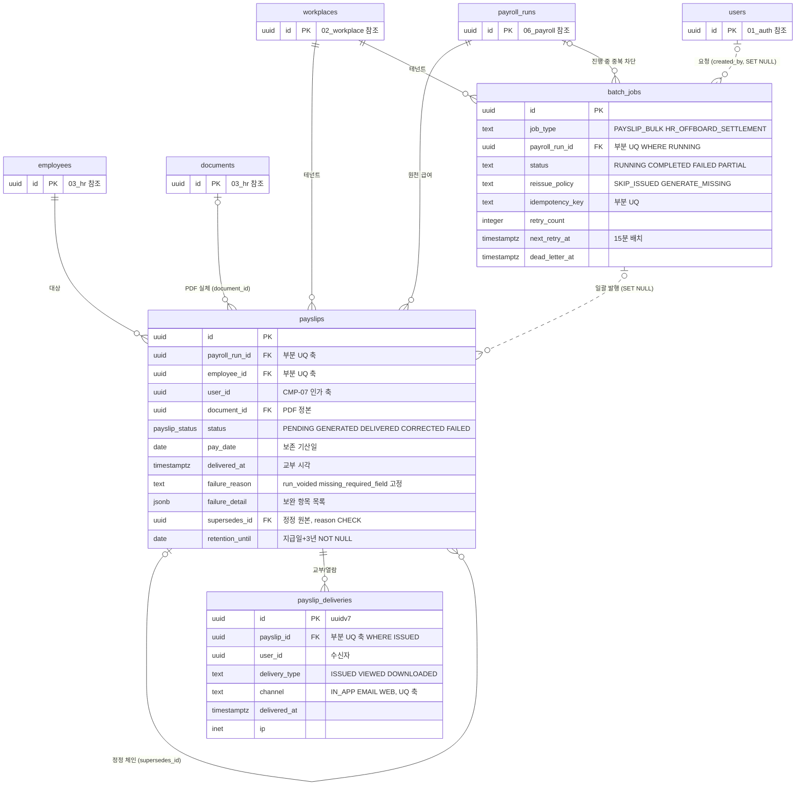

# 11_payslip — 명세서·일괄 작업

> **대상**: insadesk — 명세서 도메인 3테이블(payslips · payslip_deliveries · batch_jobs)
> **작성일**: 2026-08-03
> **개정일**: 2026-09-08 — 둘을 등재한다. ① **DOWNLOADED는 토큰 주체가 명세서 소유자일 때만 기록한다**(REQ-SLP-15 개정) — 관리자 다운로드는 audit_logs의 document.download_sensitive가 담으며, **가드의 user_id 강제는 결함이 아니라 §48② 교부 증적 원장의 축을 지키는 장치**다. ② **GENERATED 전이의 보존기한 대조가 어느 층도 맡지 않는 상태였다** — 서비스가 맡고 한계 등재에 올렸다(35 → **36항**). 컬럼·제약·테이블 수는 전건 불변
> **개정일**: 2026-08-08 — 교부 유일성 축을 (payslip_id) → **(payslip_id, channel)**로 확대(채널별 교부 성립 1회 · 대체 교부 경로 기록 가능) · payslips 보존 2열을 지급일 파생 + 발행 시 대조로 재정의(정본·사본 역전 해소) · failure_detail 신설(20 → **21컬럼**) · 정정본 INSERT 가드와 correction_reason CHECK 등재 · batch_jobs 조건부 CHECK 등재 · run VOID 연쇄의 부착 함수 확정
> **개정일**: 2026-08-08 — payslips 보존 2열을 documents 정본의 발행 시점 동결 사본으로 규정(갱신 주체 명시) · 명세서 자동 생성 발화 조건을 원본 급여 실행 확정으로 한정
> **개정일**: 2026-08-03 — batch_jobs job_type 축약 표기 정정(HR_OFFBOARD → **HR_OFFBOARD_SETTLEMENT**)
> **원천**: docs_ref2/schema_p0.md 테이블 — payslip(3) · docs_ref2/requirements_p0.md REQ-SLP · REQ-HRM-13 · REQ-CMP-07

**명세서 교부는 법정 의무이며 접근 차단 자체가 위반 소지다.** 명세서는 지급일 + 3년 보존·교부 대상이므로 payslips의 SELECT는 workplace_members를 조인하지 않는다 — 멤버십 LEFT·REMOVED, 사업장 CLOSED, 구독 EXPIRED 어느 경우에도 본인 접근이 끊기지 않는다(REQ-SLP-09 · CMP-07).

**교부(ISSUED·DELIVERED)와 열람(VIEWED)은 별개 이벤트다.** 교부 사실은 payslips의 상태·시각이 담고 열람은 payslip_deliveries에만 남는다 — 직원이 열지 않았다고 교부 의무가 미이행이 되지 않고, 열었다고 상태가 바뀌지도 않는다.

**교부는 채널마다 따로 성립한다.** 사내 전산망·앱 게시는 근로자가 열람할 수 있는 상태로 입력된 때, 이메일은 발송된 때가 교부다 — 성립 시점이 채널별로 다르므로 교부 이벤트의 유일성 축도 명세서 단위가 아니라 **(명세서, 채널) 단위**다. 앱 미설치·미로그인 직원에게 나가는 대체 교부 경로의 발송 사실이 기록되는 자리가 바로 이 확대된 축이며, 명세서당 1행으로 묶으면 대체 경로의 교부 사실을 남길 자리가 사라진다(REQ-SLP-13).

**PDF 실체·경로·해시는 documents가 일원 보유한다.** payslips는 pdf_path를 두지 않고 document_id로만 참조한다([03_hr.md](./03_hr.md)).

---

## 테이블 목록

| # | 테이블 | 보관 내용 | PK 타입 |
|---|--------|----------|---------|
| 43 | payslips | 임금명세서 — 상태·지급일·정정 체인·보존기한 | uuid |
| 44 | payslip_deliveries | 교부·열람 이력(append-only) — 채널·기기·IP | uuid(uuidv7) |
| 45 | batch_jobs | 일괄 발행·재시도 작업 — 멱등키·재시도·데드레터 | uuid |

---

## 테이블 명세

### 43. payslips — 임금명세서

기능ID **SLP-01·02·04·07** · 요구사항 REQ-SLP-01·02·03·10·15·16.

| 컬럼명 | 타입 | NULL | 키 | 설명 |
|--------|------|:--:|----|------|
| id | uuid | N | PK | 식별자 |
| workplace_id | uuid | N | FK | 테넌트 스코프 |
| payroll_run_id | uuid | N | FK | 원천 급여 실행 |
| employee_id | uuid | N | FK | 대상 직원 |
| user_id | uuid | Y | | 비정규화 — **CMP-07 인가 축**. FK가 아니다. 계정 미연계 직원의 발행분은 NULL로 생성되고 sync_employee_user_id()가 연결 시점에 채운다 |
| document_id | uuid | Y | FK → documents.id | **PDF 실체·경로·해시는 documents가 정본이다. pdf_path를 두지 않는다** |
| status | payslip_status | N | | DEFAULT PENDING |
| pay_date | date | N | | 지급일 — **보존 기산일** |
| issued_at | timestamptz | Y | | 발행(생성 완료) 시각 |
| delivered_at | timestamptz | Y | | **교부 시각**(전자 게시 완료 = 열람 가능 상태로 입력된 때) |
| failure_reason | text | Y | | 실패 사유 코드. **run_voided · missing_required_field는 재큐잉 불가·고정** |
| failure_detail | jsonb | Y | | **보완해야 할 항목 목록**. 필수 기재사항 누락 시 누락 호와 필드를 배열로 담는다(REQ-SLP-06) |
| batch_job_id | uuid | Y | FK → batch_jobs.id (**SET NULL**) | 일괄 작업. 단건은 NULL |
| supersedes_id | uuid | Y | FK → payslips.id | 정정 대상 원본(self-FK) |
| version | integer | N | | DEFAULT 1 |
| correction_reason | text | Y | | 정정 시 필수 |
| idempotency_key | text | Y | | 생성 멱등키 |
| retention_until | date | N | | **지급일 + 3년.** NOT NULL이다. **INSERT 시점에 pay_date에서 파생**한다 — 복사가 아니라 산식이다 |
| retention_basis | text | N | | 'PAY_DATE_PLUS_3Y'. NOT NULL이다. 파생 근거 코드다 |
| created_at | timestamptz | N | | DEFAULT now() |
| updated_at | timestamptz | N | | DEFAULT now() + set_updated_at 트리거 |

- **21컬럼이다.**
- 제약: PK(id) · **CHECK (supersedes_id IS NULL OR correction_reason IS NOT NULL)** — 정정본은 사유 없이 존재할 수 없다 · FK workplace_id · FK payroll_run_id · FK employee_id · FK document_id · FK batch_job_id SET NULL · FK supersedes_id(self).
- 인덱스 **5종**: payslips_pkey · **부분 UQ (payroll_run_id, employee_id) WHERE supersedes_id IS NULL** — 원본 1건 → payslip.already_issued/409 · 부분 UQ (supersedes_id) WHERE supersedes_id IS NOT NULL AND status <> 'CORRECTED' — 원본당 활성 정정본 1건 · **부분 (user_id, issued_at DESC) WHERE user_id IS NOT NULL** — 본인 명세서 목록 · 부분 (batch_job_id) WHERE batch_job_id IS NOT NULL · (retention_until).
- 트리거: guard_payslip_transition() · **guard_payslip_correction_insert()** · set_updated_at().
- **retention_until·retention_basis가 NOT NULL인 유일한 테이블 계열이다**(location_usage_records와 함께). 지급일이 확정된 시점에 기산일이 결정되므로 미확정 상태가 존재하지 않는다.
- **GENERATED 전이의 보존기한 대조는 서비스가 맡는다**(payslip.generation_failed/422 · 한계 등재 [07_constraints_integrity.md](./07_constraints_integrity.md)). guard_payslip_transition()은 document_id의 존재만 보며, **대조 대상이 다른 테이블의 열이라 트리거가 읽으려면 정의자 권한을 그 테이블까지 넓혀야 하고 그 확장이 검사 하나의 값보다 비싸다.**
- **보존기한은 pay_date에서 파생하고 documents와 대조한다.** payslips는 행이 PENDING으로 생기는 시점에 document_id가 아직 없으므로 문서에서 값을 가져올 수 없다 — 그래서 두 컬럼은 사본이 아니라 **pay_date + 3년 산식의 결과**이며, 문서가 붙는 GENERATED 전이에서 documents.retention_until과 **일치를 검증**한다. 불일치는 발행을 중단시킨다.
- **명세서 보존의 물리 컬럼은 payslips이고 documents는 파일 실체 축의 같은 값을 갖는다.** 두 값이 같은 산식(지급일 + 3년)에서 나오므로 정본·사본 관계가 아니라 **대조 관계**다 — 어느 한쪽이 비면 발행이 성립하지 않는다. 보존 목록 조회(CMP-04)는 유형별 물리 컬럼을 각각 읽으며 명세서 축의 조회 대상은 payslips다([12_compliance.md](./12_compliance.md)).
- **자동 생성 트리거는 원본 급여 실행의 확정에서만 발화한다** — payroll_runs.supersedes_id가 비어 있는 실행이 CONFIRMED로 전이한 트랜잭션이 대상이며, 정정 실행의 확정은 명세서를 자동 생성하지 않는다(정정본은 REQ-SLP-16 경로). 부분 UQ (payroll_run_id, employee_id) WHERE supersedes_id IS NULL은 payslips의 supersedes_id를 조건으로 하므로 **정정 실행이 만든 자동 생성분을 막지 못한다** — 발화 조건 자체를 원본 실행으로 한정하는 것이 유일한 차단 지점이다.
- **검증 대기 사업장의 발행 차단은 DB가 강제하지 않는다.** is_workplace_writable()이 PENDING_VERIFICATION을 쓰기 가능으로 판정하므로 정책·가드 어느 층도 이 차단을 표현하지 않으며, 서비스 레이어가 발행 진입에서 판정해 workplace.verification_pending/409를 낸다. **어느 층도 맡지 않는 항목이므로 한계 등재 대상**이다([07_constraints_integrity.md](./07_constraints_integrity.md) 제약으로 표현할 수 없는 것).
- **원본 실행 VOID의 연쇄는 propagate_run_void_to_payslips()가 수행한다** — payroll_runs가 VOIDED로 전이한 AFTER UPDATE에서 산하 PENDING·FAILED 명세서를 FAILED(failure_reason = 'run_voided')로 고정한다. 서비스 코드가 이 정리를 빠뜨리면 무효 급여의 명세서가 재큐잉되므로 트랜잭션 부수효과가 아니라 트리거로 둔다.

#### 인가 — 본인 소유권 단일 축

```
SELECT USING:  user_id = (select current_user_id())
            OR is_workplace_admin(workplace_id, current_user_id())
            OR has_system_permission('support:act', current_user_id())   -- 메타만
```

- **workplace_members를 조인하지 않는다.** 조인하면 멤버십이 LEFT·REMOVED가 되거나 사업장이 CLOSED가 되는 순간 본인 명세서 접근이 끊긴다.
- 시스템 관리자는 **메타만** 본다 — PDF 원문은 별도 권한 + 사유 + 감사를 거친다.
- **플랫폼 축은 등급이 아니라 권한 키로 판정한다.** 등급 판정(is_system_admin)만 걸면 VIEWER까지 전 사업장 명세서 메타가 열리므로, 고객지원 목적을 표현하는 기존 키 support:act(SUPPORT 이상)를 요구한다 — 새 권한 키를 채번하지 않는다(REQ-SLP-10 · REQ-SYS-05).
- 명세서 PDF 실체는 이 정책과 무관하다 — documents의 SELECT에 플랫폼 축이 없어 원문 경로가 애초에 열리지 않는다([03_hr.md](./03_hr.md)).
- **미존재·타인 명세서는 404로 행 존재를 은닉한다**(403이 아니다) → payslip.not_found/404. 403은 "있지만 권한이 없다"를 알려주므로 타인의 급여 존재 사실이 새어 나간다.
- 정정본 발행은 **OWNER 전용**이며 그 강제층은 정책이 아니라 **guard_payslip_correction_insert()**다 → payslip.correct_forbidden/403. 정정본은 UPDATE가 아니라 INSERT로 생기므로 상태 전이 가드가 닿지 않고, INSERT 정책은 서버 컨텍스트 단일 축이라 역할을 판별하지 못한다 — supersedes_id가 채워진 INSERT에 한해 요청자가 해당 사업장 OWNER인지, correction_reason이 비지 않았는지, 대상 원본이 GENERATED·DELIVERED인지를 가드가 재검증한다.

#### 상태 전이 가드

guard_payslip_transition()이 강제한다.

| 전이 | 조건 |
|------|------|
| PENDING → GENERATED | document_id NOT NULL 강제 |
| PENDING → FAILED | 실패 기록 |
| GENERATED → DELIVERED | 교부 |
| GENERATED → CORRECTED | 정정 |
| DELIVERED → CORRECTED | 정정 |
| FAILED → PENDING | 재큐잉. **failure_reason = 'run_voided' · 'missing_required_field'는 제외·고정** |

- **CORRECTED 체인은 GENERATED·DELIVERED에 한한다** — 생성되지도 않은 명세서를 정정할 수 없다.
- run VOID 시 산하 PENDING·FAILED는 FAILED(run_voided)로 고정하고 원본 PDF·해시는 보존한다. 무효화된 급여의 명세서를 재생성하면 존재하지 않는 임금을 교부하게 된다. 이 고정을 수행하는 주체는 propagate_run_void_to_payslips()다.
- **재큐잉 제외 축이 둘인 이유는 재시도로 해소되지 않는 실패를 가르기 위해서다.** 필수 기재사항 누락은 데이터가 보완되기 전까지 몇 번을 다시 돌려도 같은 지점에서 실패하므로, retryPayslipAndPush가 15분마다 같은 건을 무한 재시도하지 않도록 고정한다. 해소 경로는 배치가 아니라 **관리자의 보완 후 재생성**이며 그때 failure_detail이 보완 대상을 지목한다.
- **재발급은 새 행을 만들지 않는다** — 버전 개념은 정정본 체인이 담당하고 재발급은 payslip_deliveries의 DOWNLOADED 행으로 남는다. **다만 그 행은 본인 다운로드만 담는다**(REQ-SLP-15) — guard_payslip_delivery_insert()가 user_id를 명세서 소유자로 강제하므로 **관리자 다운로드를 여기 넣으면 행위자가 뒤바뀐다.** 관리자 축은 audit_logs의 document.download_sensitive가 담는다.

### 44. payslip_deliveries — 교부·열람 이력 (append-only)

기능ID **SLP-03·06** · 요구사항 REQ-SLP-07·08·13.

| 컬럼명 | 타입 | NULL | 키 | 설명 |
|--------|------|:--:|----|------|
| id | uuid | N | PK | 식별자. **uuidv7()** |
| payslip_id | uuid | N | FK | 대상 명세서 |
| workplace_id | uuid | N | FK | 테넌트 스코프 |
| user_id | uuid | Y | | 수신자(비정규화). FK가 아니다 |
| delivery_type | text | N | | CHECK IN ('ISSUED','VIEWED','DOWNLOADED') |
| channel | text | Y | | CHECK IN ('IN_APP','EMAIL','WEB'). **ISSUED 행은 NOT NULL이다** — 교부 성립 시점이 채널마다 다르므로 채널 없는 교부는 성립하지 않는다. 앱 미설치자 대체 교부 경로의 발송 사실도 이 축으로 기록한다 |
| delivered_at | timestamptz | N | | 이벤트 시각 |
| ip | inet | Y | | 접속 IP |
| user_agent | text | Y | | 클라이언트 |
| device | text | Y | | 기기 식별 |
| created_at | timestamptz | N | | DEFAULT now() |

- **11컬럼이다.** updated_at을 갖지 않는다.
- 제약: PK(id) · CHECK delivery_type 3값 · CHECK channel 3값 · **CHECK (delivery_type <> 'ISSUED' OR channel IS NOT NULL)** · FK payslip_id · FK workplace_id.
- 인덱스: payslip_deliveries_pkey · **부분 UQ (payslip_id, channel) WHERE delivery_type = 'ISSUED'** — **채널별 교부 1회 멱등** · (payslip_id, created_at DESC) · (user_id, created_at DESC).
- 트리거: prevent_mutation() · **guard_payslip_delivery_insert()**.
- **유일성 축이 (payslip_id, channel)인 것이 대체 교부 경로를 성립시킨다.** 명세서당 1행으로 묶으면 인앱 게시로 ISSUED가 소진돼 이메일 발송 사실을 남길 자리가 없어지고, 재발송 멱등은 채널 안에서만 필요하므로 축을 넓혀도 중복 교부는 여전히 막힌다(REQ-SLP-07 · REQ-SLP-13).
- **INSERT는 대상 명세서의 소유권과 테넌트를 함께 검증한다.** 정책의 user_id = current_user_id() 조건만으로는 payslip_id·workplace_id를 요청자가 임의로 채우는 것을 막지 못한다 — guard_payslip_delivery_insert()가 payslip_id로 명세서 행을 읽어 **user_id 일치와 workplace_id 일치를 재검증**하며, 불일치는 거부한다. 이 가드가 없으면 append-only 법정 증거 원장에 타 사업장 행이 들어가고 **FK 성공 여부가 명세서 존재 신호가 되어 404 은닉이 뚫린다**(REQ-SLP-08).
- **VIEWED·DOWNLOADED INSERT는 사업장 CLOSED여도 허용한다** — guard_workplace_readonly()의 두 예외 중 하나다. 폐쇄 후에도 본인 열람은 가능해야 하고 그 기록은 남아야 한다.
- **VIEWED는 payslips.status를 바꾸지 않는다.** 교부는 열람 가능 상태로 입력한 시점에 완료되며, 직원이 열지 않았다는 이유로 교부 의무가 미이행이 되지 않는다.

### 45. batch_jobs — 일괄 발행·재시도 작업

기능ID **SLP-05** · **HRM-04** · 요구사항 REQ-SLP-11·12.

| 컬럼명 | 타입 | NULL | 키 | 설명 |
|--------|------|:--:|----|------|
| id | uuid | N | PK | 식별자 |
| workplace_id | uuid | N | FK | 테넌트 스코프 |
| job_type | text | N | | CHECK IN ('PAYSLIP_BULK','HR_OFFBOARD_SETTLEMENT') |
| pay_period | date | Y | | 대상 급여월. **표시용 파생 값**이며 PAYSLIP_BULK는 payroll_run_id에서, HR_OFFBOARD_SETTLEMENT는 값이 없다 |
| payroll_run_id | uuid | Y | FK → payroll_runs.id | 진행 중 중복 차단 근거. **PAYSLIP_BULK는 NOT NULL이다** |
| total_count | integer | N | | DEFAULT 0 |
| success_count | integer | N | | DEFAULT 0 |
| failed_count | integer | N | | DEFAULT 0 |
| status | text | N | | CHECK IN ('RUNNING','COMPLETED','FAILED','PARTIAL') |
| reissue_policy | text | Y | | CHECK IN ('SKIP_ISSUED','GENERATE_MISSING') |
| errors | jsonb | N | | DEFAULT [] |
| payload | jsonb | N | | DEFAULT {}. 오프보딩은 employee_id · resignation_date · last_work_date · tasks |
| idempotency_key | text | Y | UQ* | (workplace_id, idempotency_key) 부분 UQ. 접두 예 payslip.bulk 다음에 run_id |
| retry_count | integer | N | | DEFAULT 0 |
| next_retry_at | timestamptz | Y | | retryPayslipAndPush 15분 배치 대상 |
| dead_letter_at | timestamptz | Y | | 최대 재시도 초과. status는 FAILED를 유지한다 |
| created_by | uuid | Y | FK → users.id (**SET NULL**) | 요청자 |
| created_at | timestamptz | N | | DEFAULT now() |
| updated_at | timestamptz | N | | DEFAULT now() + set_updated_at 트리거 |

- **19컬럼이다.**
- 제약: PK(id) · CHECK job_type 2값 · CHECK status 4값 · CHECK reissue_policy 2값 · **CHECK (job_type <> 'PAYSLIP_BULK' OR payroll_run_id IS NOT NULL)** · FK workplace_id · FK payroll_run_id · FK created_by SET NULL.
- 인덱스: batch_jobs_pkey · 부분 UQ (workplace_id, idempotency_key) WHERE idempotency_key IS NOT NULL → payslip.bulk_conflict/409 · **부분 UQ (payroll_run_id) WHERE status = 'RUNNING' AND job_type = 'PAYSLIP_BULK'** → payslip.bulk_in_progress/409 · 부분 (status, next_retry_at) WHERE status IN ('FAILED','PARTIAL').
- 트리거: set_updated_at().
- **재시도는 실패 건만 대상으로 한다.** 이미 교부된 명세서의 교부 이력을 중복 생성하지 않으며, payslip_deliveries의 채널별 ISSUED 부분 UQ가 백스톱이다.
- **payroll_run_id 조건부 NOT NULL이 없으면 진행 중 중복 차단이 무력해진다** — 부분 UQ의 축이 NULL이면 행마다 서로 구별되어 같은 급여 실행에 RUNNING 작업이 여러 개 생긴다. CHECK가 그 구멍을 막는다(REQ-SLP-11).
- **status를 enum이 아니라 text + CHECK로 둔다** — 작업 상태 값 집합이 job_type마다 다르고 운영 중 변동이 잦다.

---

## RLS 정책 — 도메인 요약

정책 표현식 전수의 정본은 [08_rls_policies.md](./08_rls_policies.md)다.

| 테이블 | SELECT | INSERT | UPDATE | DELETE |
|--------|--------|--------|--------|--------|
| payslips | **user_id = current_user_id()(멤버십 무관)** · 사업장 관리자 · **플랫폼 support:act 권한(메타만)** | 서버(명세서 서비스). **정정본 INSERT는 OWNER 전용 — 가드가 판정** | 서버 | — |
| payslip_deliveries | 관리자 · user_id = current_user_id()(멤버십 무관) | 서버 + **본인 열람 기록(CLOSED에서도 허용) — 대상 명세서 소유권·테넌트를 가드가 재검증** | — | — |
| batch_jobs | 사업장 관리자 | 서버 | 서버 | — |

---

## ERD



---

## 관계

| 관계 | cardinality | ON DELETE | 의미 |
|------|:-----------:|:---------:|------|
| workplaces → payslips · batch_jobs | 1 : N | RESTRICT | 테넌트 스코프 |
| payroll_runs → payslips | 1 : N | RESTRICT | 원천 급여. 명세서가 있는 실행은 지워지지 않는다 |
| employees → payslips | 1 : N | RESTRICT | 대상 직원 |
| documents → payslips (document_id) | 0..1 : N | RESTRICT | PDF 실체. 참조된 문서는 삭제 불가 |
| payslips → payslips (supersedes_id) | 0..1 : 1 | RESTRICT | **정정 체인 self-FK.** 부분 UQ가 원본당 활성 정정본 1건을 강제한다 |
| payslips → payslip_deliveries | 1 : N | RESTRICT | 교부·열람 이력. 법정 증거라 삭제 경로가 없다 |
| batch_jobs → payslips (batch_job_id) | 0..1 : N | **SET NULL** | 일괄 작업. 작업 메타가 정리돼도 명세서는 남는다 |
| payroll_runs → batch_jobs | 0..1 : N | RESTRICT | 진행 중 중복 차단 근거 |
| users → batch_jobs (created_by) | 0..1 : N | **SET NULL** | 행위자 |

---

## 특이사항

**RLS 정책 하나가 법정 의무를 지탱한다.** payslips의 SELECT가 user_id 소유권 단일 축인 것이 CMP-07의 구현이며, 멤버십 조인을 넣는 순간 퇴사자·폐쇄 사업장 직원의 명세서 접근이 끊긴다.

- 같은 이유로 payslip_deliveries·payroll_employee_results·payroll_employee_result_items·contracts도 소유권 축을 갖는다.
- **비정규화 user_id가 그 축을 물리적으로 가능하게 한다** — employees를 조인하면 employees 자신의 정책이 다시 평가되고, 그 정책이 다시 멤버십을 볼 위험이 생긴다.

**교부와 열람의 분리가 상태 오염을 막는다.** VIEWED가 payslips.status를 DELIVERED로 바꾸면 "교부했는데 직원이 안 봤다"와 "교부하지 않았다"를 구분할 수 없게 된다.

- 채널별 교부 1회 멱등은 payslip_deliveries의 (payslip_id, channel) 부분 UQ가 강제한다 — 같은 채널의 재발송 시도가 교부 이력을 중복 생성하지 않으면서, 다른 채널의 교부 사실은 각각 남는다.
- 재발급은 DOWNLOADED 행으로 남고 새 명세서 행을 만들지 않는다. **DOWNLOADED는 토큰 주체가 명세서 소유자일 때만 기록한다** — 이 원장은 **§48② 교부 이행의 법정 증적**이고 관리자의 업무상 다운로드는 운영 감사 축(audit_logs)이라, 섞으면 **원장이 무엇을 증명하는지가 흐려진다.** **가드의 user_id 강제는 결함이 아니라 그 축을 지키는 장치다.**

**명세서는 자기 컬럼에 금액·시간을 복제하지 않는다.** 법정 기재사항 6개 호는 전부 확정 급여 결과와 항목 라인이 값 복사로 보유하며(pay_date · gross_pay · worked_days · 8버킷 · 항목별 금액 · 공제 라인), 확정 불변 가드가 그 값을 얼린다([06_payroll.md](./06_payroll.md)).

- **①호 근로자 특정정보만 급여 결과 쪽 동결 축이 필요하다** — 나머지 5호와 달리 성명·생년월일·사번은 employees 현재값이라 인사 정정이 과거 명세서 표기를 바꾼다. 동결 컬럼의 신설처는 급여 결과이며 명세서는 그 값을 읽는다(REQ-SLP-04).
- PDF는 발행 시점에 확정돼 documents.file_hash로 무결성이 잠기므로 **이미 교부된 문서 자체는 바뀌지 않는다.** 동결 축이 필요한 것은 목록·상세 화면과 재발급 표기처럼 **행에서 다시 조립되는 경로**다.

**batch_jobs가 명세서 전용이 아니다.** job_type이 PAYSLIP_BULK와 HR_OFFBOARD_SETTLEMENT 2종이며, 퇴사 정산도 같은 멱등·재시도·데드레터 구조를 쓴다.

- 도메인별로 작업 테이블을 나누면 재시도 배치가 여러 벌이 된다.
- payload가 job_type별 입력을 담고 CHECK가 값 집합을 고정한다.

**PDF 경로를 payslips에 두지 않는다.** legacy는 pdf_path·pdf_hash를 명세서 행이 직접 가졌으나, 같은 실체를 두 테이블이 기술하면 무결성 검증 기준이 둘이 된다. documents.file_hash가 유일한 정본이다(REQ-SLP-02).

**보존기한만은 두 테이블이 함께 갖는다 — 그러나 정본·사본이 아니다.** 파일 실체는 documents가 독점하되 보존기한은 **지급일 + 3년이라는 하나의 산식**에서 양쪽이 각자 파생하며, GENERATED 전이에서 두 값의 일치를 검증한다.

- 근거는 생성 순서다 — payslips 행은 PDF보다 먼저(PENDING) 생기므로 문서에서 값을 받아올 수 없고, 그 시점에 이미 pay_date가 확정돼 있어 파생이 가능하다.
- **정본을 documents로만 두면 파생 쪽이 NOT NULL인 역전이 생긴다.** 두 값이 같은 산식의 결과라는 관계로 두면 어느 쪽도 상대의 사본이 아니며, 대조 실패가 곧 발행 중단이라 괴리가 남지 않는다.
- 보존 목록 조회(CMP-04)는 유형별 물리 컬럼을 각각 읽는다 — 명세서는 payslips, 근로계약서는 contracts, 임금대장은 payroll_runs, 근로자명부는 employees이며 documents는 문서 실체 축을 담당한다.

---

## 관련 문서

- 폴더 정본·접근 모델 → [README.md](./README.md)
- 전역 ERD·관계 요약 → [erd.md](./erd.md)
- 제약·부분 UNIQUE 전수 → [07_constraints_integrity.md](./07_constraints_integrity.md)
- RLS 정책 전수(본인 소유권 인가) → [08_rls_policies.md](./08_rls_policies.md)
- 함수·트리거 전수 → [09_functions_triggers.md](./09_functions_triggers.md)
- 마이그레이션 배치(V0070__payslip.sql) → [10_migrations_seed.md](./10_migrations_seed.md)
- 급여 실행·결과 → [06_payroll.md](./06_payroll.md)
- 문서함(PDF 실체) → [03_hr.md](./03_hr.md)
- 알림 발송 → [13_notification.md](./13_notification.md)
- 기능 명세 → [../02_features/07_payslip.md](../02_features/07_payslip.md)
- 요구사항 → [../03_requirements/08_payslip.md](../03_requirements/08_payslip.md)
- API 표면 → [../06_api/09_payslip.md](../06_api/09_payslip.md)
