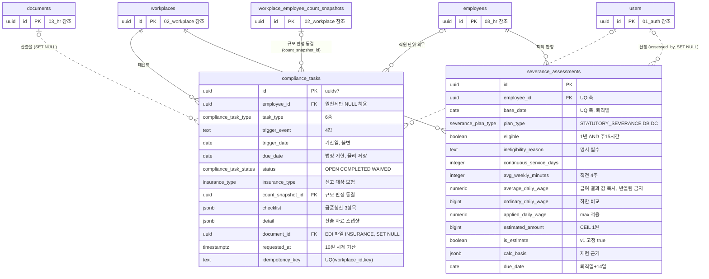

# 12_compliance — 법정 준수·퇴직급여

> **대상**: insadesk — 법정 준수 도메인 2테이블(compliance_tasks · severance_assessments) · **전량 신설**
> **작성일**: 2026-08-03
> **개정일**: 2026-09-10 — **임박·경과 파생 절에 임계의 출처를 적는다** — 이 절이 "due_date 비교로 파생한다"까지만 규정해 **무엇과 비교하는지가 어디에도 없던** 자리이며(코드 상수로만 있었다), 사용자 확정 2026-09-10으로 **남은 일수 3일 이하**가 정해졌다. 값은 기준값 테이블의 FILING_DEADLINE / due_soon_window가 갖고 부재는 차단이다. 파생 계약의 정본은 [../06_api/11_compliance.md](../06_api/11_compliance.md) #8 · key 열거는 [15_system.md](./15_system.md) · 흡수 근거는 [../03_requirements/01_global_rules.md](../03_requirements/01_global_rules.md) §1.3다. **테이블 2종 · 컬럼 20 · 인덱스 4종 · task_type 6값 · trigger_event 4값 · 제약은 전건 불변**
> **개정일**: 2026-09-10 — **취득·상실 신고 기한을 보험별로 가른다** — 종전의 "취득·상실 모두 다음달 15일" 단정이 **건강보험에 대해 틀린 값**이었다(국민건강보험법 §8② · §10②는 그 날부터 **14일**이고 국민연금·고용보험·산재보험만 다음 달 15일이다 — 조문 출처 정본 [../03_requirements/18_official_references.md](../03_requirements/18_official_references.md)). **과제 하나의 due_date는 적용 보험 중 가장 이른 기한**이고 **적용 보험은 employee_insurance_infos가 정하되 적용정보가 없으면 넷 전부**로 본다. 보험별 기한은 **행의 detail이 스냅샷으로 담는다** — due_date 한 값만으로는 왜 그 날인지가 남지 않는다. 기한 기준값 key도 **보험별 8종**으로 갈렸다(정본 [15_system.md](./15_system.md)). **2026-08-03 확정 시드의 insurance_loss 행이 같은 오류이며 정정 수렴 대상**이다. **테이블 2종 · 컬럼 20 · 인덱스 4종 · task_type 6값 · trigger_event 4값 · 제약은 전건 불변**
> **개정일**: 2026-09-10 — **HIRE 행의 생성 지점 미결을 닫는다**(2026-09-09 등재분) — 입사 확정([../06_api/05_hr.md](../06_api/05_hr.md) #11)이 취득 과제를 여는 부수효과를 갖는다. **표면을 새로 채번하지 않았다**(갈래가 하나라 #11의 부수효과로 닫힌다 — API 표면 수 불변). 함께 **확정 급여 부재의 처분을 진입점별로 가른다** — 판정 실행 표면(#26)은 차단이고 **퇴사 확정 부수효과는 표기**(calc_basis에 사유 · 금액 열 비움 · **0원 미생성**)다. 종전이 이 판정을 트리거에 두었으나 **행만 보아서는 어느 진입점이 넣었는지 알 수 없어 트리거가 할 수 없는 판정**이며, 가드 트리거 집계에 이 항목은 없다. **컬럼 · 제약 · 인덱스 · enum은 전건 불변**
> **개정일**: 2026-09-09 — ordinary_daily_wage의 **반올림 키가 확정**됐다(올림 1원 · §1.1 9 → 10종 · §1.2 #15 · REQ-GLB-05 예외 ④). 함께 **앞선 회차의 등재 근거를 실측으로 정정**한다 — 그 열은 "정수로 잘못 반올림되고 있던" 것이 아니라 **키가 없어 구현이 비워 두고 있던** 것이었다. 산정 창도 **「퇴직일 이전 3개월(역일)」로 확정**됐다. **테이블 2종 · 컬럼 20 · 제약 · 인덱스는 전건 불변**
> **개정일**: 2026-09-09 — severance_assessments 재현 근거에 **산정 창의 경계 2키(window_from · window_to)를 등재**한다 — 분자·분모만 담으면 그 둘을 만든 창이 재현되지 않고, **"이전 3개월"의 정본이 아직 없어** 규칙 확정 시 어느 판정이 어느 창으로 계산됐는지 가려낼 수단이 필요하다. **jsonb 키 추가라 컬럼 20 · 제약 · 인덱스는 불변**이다. 함께 **ordinary_daily_wage의 반올림 키 부재를 미결로 등재**한다 — bigint라 반올림이 일어나는데 §1.1 9종에 자리가 없고, **방향 후보 둘이 반대여서 하한 비교를 뒤집는다.** 채번은 전역 규칙이 한다
> **개정일**: 2026-09-09 — 미결 둘과 계약 하나를 등재한다. ① **INSURANCE_ACQUISITION 과제의 생성 지점이 어느 표면에도 없다** — 이 문서의 파생 표는 입사 확정(HIRE)이 만든다고 단정하는데 API 문서군은 6종 중 5종만 세고, 시드에도 그 기한 키가 없어 **생성이 차단되는 것이 현재의 정상 동작**이다. ② **checklist 원소의 키를 { item, done }으로 명시**한다 — jsonb라 열 정의가 키를 강제하지 못하는데 키를 정하는 자리가 API 예시 하나뿐이었고, 그 비대칭이 구현에서 다른 키를 읽는 형태로 드러났다. **테이블 2종 · 컬럼 20 · 인덱스 4종 · task_type 6값 · trigger_event 4값 · 제약은 전건 불변**
> **개정일**: 2026-08-08 — 이직확인서 과제의 생성 시점을 **요청 접수 시점**으로 확정(퇴사 확정 트랜잭션 4건 → **3건**) · 원천세 기한 파생의 입력 축 2종 명시(사업장 납부 주기 · FILING_DEADLINE 기준값) · count_snapshot_id 신설(19 → **20컬럼**) · employee_id 조건부 CHECK 등재 · 산출물 문서 분류를 INSURANCE로 확정 · severance_assessments.average_daily_wage를 **payroll_employee_results 정본의 판정 시점 동결 사본**으로 명시
> **개정일**: 2026-08-08 — 원천세 과제의 생성 주체(급여 확정 부수효과)와 반기납부 기한 분기 등재 · 보존 기한 과제 유형을 두지 않음을 명문화 · severance_plan_type 값 표기 정정
> **원천**: docs_ref2/schema_p0.md 테이블 — compliance(2 · 전량 신설) · docs_ref2/requirements_p0.md REQ-TAX-01~04 · REQ-PAY-33·34·35

**법정 의무는 전부 "기산일 + 법정 기한 + 산출 자료 + 완료 여부"라는 동일 구조다.** TAX-01(취득·상실 신고자료) · TAX-02(이직확인서) · TAX-11(신고 기한 캘린더) · PAY-19(금품청산 14일) · PAY-11(퇴직금 지급 기한)을 도메인별 테이블로 흩으면 캘린더가 5개 테이블을 UNION해야 하고 감지 배치도 5벌이 된다. compliance_tasks 하나로 통합한다.

**퇴직급여는 퇴직금 전용이 아니라 추상이다.** REQ-PAY-34가 퇴직금·DB·DC를 함께 요구하므로 severance_plan_type으로 구분하고, 개산액은 결정론적 재현이 필요하므로 jsonb가 아니라 명시 컬럼으로 둔다.

**기산일이 곧 생성 시점이다.** 과제 행은 trigger_date와 due_date를 불변으로 들고 있으므로, 기산 사건이 아직 일어나지 않은 시점에 행을 미리 만들면 기한이 사실과 다른 값으로 굳고 사후 보정 경로도 없다. 그래서 **이직확인서 과제는 퇴사 확정이 아니라 근로자의 발급 요청을 접수한 시점에 생긴다** — 10일 시계의 기산일이 요청 접수일이기 때문이다(REQ-TAX-02).

**자동 신고는 하지 않고 자료 산출까지만 지원한다.** 신고·납부의 최종 책임은 사업주에게 있으며 그 사실을 결과에 고지한다.

---

## 테이블 목록

| # | 테이블 | 보관 내용 | PK 타입 |
|---|--------|----------|---------|
| 46 | compliance_tasks | 법정 의무 기한 작업 — 기산일·법정 기한·체크리스트·산출 자료 | uuid(uuidv7) |
| 47 | severance_assessments | 퇴직급여 판정·개산 — 대상 판정·평균임금·개산액·재현 근거 | uuid |

둘 다 legacy에 대응 테이블이 없는 **신설**이다.

---

## 테이블 명세

### 46. compliance_tasks — 법정 의무 기한 작업 (신설)

기능ID **TAX-01·02·11** · **PAY-19** · 요구사항 REQ-TAX-01·02·03·04 · REQ-PAY-35.

| 컬럼명 | 타입 | NULL | 키 | 설명 |
|--------|------|:--:|----|------|
| id | uuid | N | PK | 식별자. **uuidv7()** |
| workplace_id | uuid | N | FK | 테넌트 스코프 |
| employee_id | uuid | Y | FK | **NULL은 원천세 신고에만 허용**한다 — 나머지 5종은 직원 단위 의무다 |
| task_type | compliance_task_type | N | | 6종 — 취득·상실 신고 · 이직확인서 · 금품청산 · 퇴직급여 지급 · 원천세 신고 |
| trigger_event | text | N | | CHECK IN ('HIRE','RESIGNATION','SEPARATION_REQUEST','PAYROLL_CONFIRM') |
| trigger_date | date | N | | **기산일**(퇴직일·요청 접수일·취득일 등) |
| due_date | date | N | | **법정 기한 — 결정론적으로 파생해 물리 저장한다.** 취득·상실신고 = **적용 보험 중 가장 이른 기한**(건강보험 14일 · 그 밖 다음달 15일) · 이직확인서 = 요청일 + 10일 · 금품청산·퇴직급여 = 퇴직일 + 14일 |
| count_snapshot_id | uuid | Y | FK → workplace_employee_count_snapshots.id | **적용 규모 판정 동결**. 캘린더 개인화의 근거를 행이 보유한다(REQ-TAX-03) |
| status | compliance_task_status | N | | OPEN · COMPLETED · WAIVED. **임박·경과는 상태가 아니라 due_date 비교로 파생한다** |
| insurance_type | insurance_type | Y | | 취득·상실 신고 대상 보험. **한 사건에 과제 하나이고 보험별로 행을 나누지 않으므로 대체로 비어 있다** — 특정 보험 한 종에 한정된 신고 건에만 채운다. **보험별 기한은 이 열이 아니라 detail이 담는다** |
| checklist | jsonb | N | | DEFAULT []. **원소는 { item, done }**이며 금품청산의 item은 WAGE · SEVERANCE · UNUSED_LEAVE_ALLOWANCE 3값이다. 다른 유형은 빈 배열 |
| detail | jsonb | Y | | 산출 자료 스냅샷. 취득·상실신고는 취득일·상실일·보수월액·사업장관리번호와 **보험별 법정 기한**(insurance.{보험}.dueDate — {보험}은 enum 값 표기이고 due_date가 가장 이른 한 값뿐이라 근거가 남지 않는다), 이직확인서는 이직사유코드·피보험단위기간·평균임금일액 |
| document_id | uuid | Y | FK → documents.id (**SET NULL**) | 산출물(EDI 업로드용 파일). **documents.category = 'INSURANCE'로 등재한다** — 신고자료·이직확인서가 같은 분류를 쓴다 |
| requested_at | timestamptz | Y | | 이직확인서 요청 접수 시각(10일 시계 기준) |
| completed_at | timestamptz | Y | | 완료 시각 |
| completed_by | uuid | Y | FK → users.id (**SET NULL**) | 완료 처리자 |
| waived_reason | text | Y | | WAIVED 시 필수 |
| idempotency_key | text | N | | 배치 멱등. 예 insurance_loss 다음에 employee_id와 last_work_date |
| created_at | timestamptz | N | | DEFAULT now() |
| updated_at | timestamptz | N | | DEFAULT now() + set_updated_at 트리거 |

- **20컬럼이다.**
- 제약: PK(id) · **UNIQUE(workplace_id, idempotency_key)** — 멱등(REQ-GLB-14) · CHECK trigger_event 4값 · **CHECK (task_type = 'WITHHOLDING_FILING' OR employee_id IS NOT NULL)** — 직원 단위 의무에 대상자 없는 행을 만들지 않는다 · FK workplace_id · FK employee_id · FK document_id SET NULL · FK completed_by SET NULL · FK count_snapshot_id.
- 인덱스 **4종**: compliance_tasks_pkey · UNIQUE(workplace_id, idempotency_key) · (workplace_id, status, due_date) — 캘린더 조회 · **부분 (due_date) WHERE status = 'OPEN'** — checkComplianceDeadlines 08:30 배치 · (employee_id, task_type).
- 트리거: trigger_date · due_date · task_type 불변 강제 · 완료 전이 시 completed_at NOT NULL · set_updated_at().

#### 임박·경과를 상태로 저장하지 않는다

status는 OPEN · COMPLETED · WAIVED 3값뿐이고 임박(DUE_SOON)·경과(OVERDUE)는 **due_date 비교로 파생**한다.

- **비교의 임계는 기준값이 갖는다** — FILING_DEADLINE / due_soon_window(제품 파라미터 — 남은 일수 3일 이하 · 사용자 확정 2026-09-10)이며 **코드에 상수로 두지 않고** 부재는 payroll.missing_reference_value/422로 차단한다. 파생 계약의 정본은 [../06_api/11_compliance.md](../06_api/11_compliance.md) #8 · key 열거는 [15_system.md](./15_system.md)다.
- **배치가 상태를 쓰면 재실행 결정성이 깨진다** — 어제 실행한 배치와 오늘 실행한 배치가 같은 행을 다른 상태로 만든다.
- **감지 배치는 실행 시각이 아니라 기준일 파라미터로 동작한다**(REQ-TAX-04). 같은 기준일로 재실행하면 같은 결과를 낸다.
- 멱등키 UNIQUE가 배치 재실행 시 중복 생성을 막는다.

#### 6종 task_type과 기한 파생

| task_type | 기산일 | 법정 기한 | 생성 시점(trigger_event) |
|-----------|--------|----------|------------------------|
| INSURANCE_ACQUISITION | 취득일 | **적용 보험 중 가장 이른 기한** — 건강보험 적용이면 취득일부터 14일 · 그 밖은 다음달 15일 | 입사 확정(HIRE) |
| INSURANCE_LOSS | last_work_date | **적용 보험 중 가장 이른 기한** — 건강보험 적용이면 상실일부터 14일 · 그 밖은 다음달 15일 | 퇴사 확정(RESIGNATION) |
| SEPARATION_CERTIFICATE | 요청 접수일(requested_at) | 요청일 + 10일 | **발급 요청 접수(SEPARATION_REQUEST)** |
| WAGE_SETTLEMENT | 퇴직일 | 퇴직일 + 14일(근기법 §36) | 퇴사 확정(RESIGNATION) |
| SEVERANCE_PAYMENT | 퇴직일 | 퇴직일 + 14일(근퇴법 §9) | 퇴사 확정(RESIGNATION) |
| WITHHOLDING_FILING(월별 납부) | 급여 확정(pay_date) | 다음달 10일 | 급여 확정(PAYROLL_CONFIRM) |
| **WITHHOLDING_FILING(반기 납부 특례)** | 급여 확정(pay_date) | **귀속 반기의 다음 달 10일 — 상반기분 7월 10일 · 하반기분 1월 10일** | 급여 확정(PAYROLL_CONFIRM) |

- **표는 7행이지만 task_type은 6종이다** — 원천세만 납부 주기에 따라 기한 파생이 둘로 갈린다.
- **생성 시점 열이 trigger_event 4값과 1:1로 대응한다** — 기산 사건이 곧 생성 사건이므로 둘이 어긋나는 행은 존재하지 않는다. 이직확인서만 퇴사와 다른 사건에서 열리며, 그래서 이 유형 하나가 SEPARATION_REQUEST를 쓴다.
- **HIRE 행에는 그 행을 만드는 표면이 없었다 — 2026-09-10 닫혔다.** 입사 확정 트랜잭션([../06_api/05_hr.md](../06_api/05_hr.md) #11)이 취득 과제를 여는 부수효과를 갖는다. **기산일은 입사일이고 멱등키 축도 입사일**이다 — 근로관계 하나에 취득신고 의무가 하나이며 신고자료 생성 표면([../06_api/10_tax.md](../06_api/10_tax.md) #1)도 같은 축으로 같은 행을 찾는다. **표면을 새로 채번하지 않았다** — 퇴사 쪽이 서버 내부 표면(#35)을 가진 것과 달리 취득은 갈래가 하나뿐이라 #11의 부수효과로 충분하고, **표면을 늘리면 API 표면 수가 움직이는데 만드는 일은 같다.**
- **기한 기준값 부재는 여전히 그 과제만 막는다.** 값이 없으면 취득 과제가 만들어지지 않고 입사 확정은 완주하며, 그 사실이 #11 응답의 pendingLinkages에 이름으로 남는다. **임의 기한을 세우지 않는 것이 정상 동작**이다.
- **취득·상실 기한이 보험별로 갈린다**(2026-09-10 조문 본문 확인 — 정본 [../03_requirements/18_official_references.md](../03_requirements/18_official_references.md)). **건강보험만 그 날부터 14일**(국민건강보험법 §8② · §10②)이고 국민연금(법 §21① · 시행규칙 §6①) · 고용보험(법 §15 · 시행령 §7①) · 산재보험(고용산재보험료징수법 §16조의10③)은 다음 달 15일이다. **과제 하나의 due_date는 적용 보험 중 가장 이른 기한**이며, 가장 이른 것을 고르는 이유는 **하나라도 늦으면 그 보험의 신고가 지연되기 때문**이다.
  - **적용 보험은 인사 적용정보(employee_insurance_infos)가 정한다.** 적용정보가 아직 없으면 **넷 전부를 적용 대상으로 본다** — 가장 이른 기한이 서므로 안전한 쪽이고, 과제가 열린 뒤 적용정보가 들어와도 **기한은 소급 변경되지 않는다**(trigger_date · due_date 불변 가드).
  - **과제 행의 detail이 보험별 기한을 담는다** — 키는 보험별 항목값과 같은 축인 **insurance.{보험}.dueDate**이고 {보험} 자리는 **enum 값 표기**다(insurance.NATIONAL_PENSION.dueDate · insurance.HEALTH.dueDate · insurance.EMPLOYMENT.dueDate · insurance.INDUSTRIAL_ACCIDENT.dueDate). due_date는 가장 이른 한 값뿐이라 **왜 그 날인지가 행에 남지 않으므로**, 어느 보험이 어느 날까지인지를 스냅샷으로 함께 적어 화면이 "건강보험 때문에 14일"임을 설명할 수 있게 한다.
  - **같은 보험을 두 표기로 쓴다 — 축이 다르기 때문이다.** 기준값 조회 키는 key 합성 규약을 따라 **lower_snake**(insurance_loss:pension)이고 detail의 jsonb 키는 **enum 값**(insurance.NATIONAL_PENSION.dueDate)이다. 전자는 statutory_rates의 key 열이고 후자는 보험별 항목값이 이미 쓰는 축이라 **각자 자기 축의 표기를 따르는 것이 맞다** — 한쪽으로 맞추면 그 축의 다른 키들과 어긋난다. **연금만 두 표기의 어간이 다르므로**(pension ↔ NATIONAL_PENSION) 옮겨 적을 때 확인한다.
  - **부분 파생을 하지 않는다.** 적용 보험의 기한 키 중 **하나라도 조회가 비면 그 과제를 만들지 않는다** — 해소된 것만 모아 가장 이른 날을 세우면 **없는 기한이 있는 기한들 사이에서 조용히 빠지고** 과제가 실제보다 늦은 마감을 갖는다. 무엇이 없었는지는 차단 응답의 details가 (category, key)로 낸다.
  - **장기요양은 기한 축이 아니다.** 건강보험 자격에 실려 신고되므로 별도 기한 행을 갖지 않는다 — insurance_type enum은 5값이지만 **신고 기한 축의 보험은 넷**이다. 적용정보에 장기요양이 있으면 **건강보험 축으로 접어 읽는다**(장기요양만 적용된 상태는 성립하지 않으므로 접기가 축을 늘리지 않는다). 넷에 넣으면 **있지도 않은 기한 행을 요구해 과제가 통째로 차단된다.**
  - **종전의 「취득·상실 모두 다음달 15일」 단정이 건강보험에 대해 틀린 값이었다.** 2026-08-03 확정 시드의 insurance_loss 행도 같은 오류이며(출처가 조문 없는 2차 표기 "4대보험 관계 법령"이었다) **정정 수렴 대상**이다. 키가 보험별 8종으로 갈린 것이 그 수렴의 자리다([15_system.md](./15_system.md) key 합성 규약).
- **기한 기준값 키가 보험별 8종이다** — insurance_acquisition:{pension · health · employment · industrial_accident} · insurance_loss:{동일 4종}이며 단일 키 둘은 폐지다. 키 채번의 정본은 [15_system.md](./15_system.md)이고 **값 등재는 확인 절차 후**다. 아래 두 축 규칙을 그대로 적용하면 **적용 보험 중 하나라도 기한 값이 없으면 그 과제를 만들지 않는다** — 임의 기한을 세우지 않는다.
- **due_date를 물리 저장하는 이유는 조회 성능이 아니라 결정성이다.** 조회 시점에 계산하면 기한 규칙이 바뀔 때 과거 과제의 기한이 소급 변경된다.
- **원천세 과제(WITHHOLDING_FILING)의 생성 주체는 급여 확정 트랜잭션의 부수효과다**(REQ-TAX-03). 확정마다 만들어지되 멱등키가 같은 신고 단위의 중복 생성을 막는다.
- **원천세 기한 파생의 입력은 두 축이다.** ① 사업장의 납부 주기 설정 — workplaces.withholding_payment_cycle(MONTHLY · SEMI_ANNUAL)이 월별 납부와 반기납부 특례를 가른다. ② 기한 정책값 — statutory_rates의 FILING_DEADLINE category가 유형별 기한 규칙(익월 10일 · 다음달 15일 · 반기 경계월)을 effective date와 함께 보유한다. **두 축 중 하나라도 없으면 due_date를 만들 수 없으므로 과제를 만들지 않고 payroll.missing_reference_value/422로 부재를 드러낸다** — 임의 기본 기한을 세우지 않는다.
- 두 컬럼·카테고리는 각각 [02_workplace.md](./02_workplace.md)와 [15_system.md](./15_system.md)가 명세 정본이다.
- **납부 주기는 사업장 설정이고 과제 행은 파생 결과를 물리 저장한다.** 설정이 바뀌어도 이미 만들어진 과제의 기한은 소급 변경되지 않는다 — trigger_date·due_date 불변 가드가 그것을 강제한다.
- **규모 판정은 과제 행이 동결한다.** count_snapshot_id가 "왜 이 기한이 이 사업장에 걸리는가"의 근거이며, 이후 규모가 바뀌어도 과거 과제의 개인화 근거가 유지된다. 스냅샷이 없으면 규모 분기가 필요한 기한 항목을 만들지 않는다.
- **자동 신고는 하지 않는다** — 산출 자료 생성까지만 지원하고 EDI 업로드는 사업주가 수행한다.
- **보존 기한 과제 유형을 두지 않는다.** 법정 서류 보존 관리(CMP-04)는 **유형별 물리 보유처 4곳**(contracts · payroll_runs · employees · payslips)의 retention_until 조회·목록 제시 전용이며 compliance_tasks에 대응 task_type도 기산 이벤트도 만들지 않는다(REQ-CMP-10). documents는 그중 **파일 실체를 가진 유형에만** 붙으므로 원장이 아니다 — 임금대장·근로자명부는 내보내기 전까지 문서 행이 없다. 보존은 기한 이행 행위가 아니라 상태이므로 완료·면제 전이의 대상이 아니다.

### 47. severance_assessments — 퇴직급여 판정·개산 (신설)

기능ID **PAY-11** · 요구사항 REQ-PAY-33·34.

| 컬럼명 | 타입 | NULL | 키 | 설명 |
|--------|------|:--:|----|------|
| id | uuid | N | PK | 식별자 |
| workplace_id | uuid | N | FK | 테넌트 스코프 |
| employee_id | uuid | N | FK · UQ* | 대상 직원. (employee_id, base_date) UQ |
| base_date | date | N | UQ* | 퇴직일(산정사유 발생일) |
| plan_type | severance_plan_type | N | | STATUTORY_SEVERANCE · DB · DC |
| eligible | boolean | N | | 대상 판정 = 계속근로 1년 이상 **AND** 4주 평균 주 15시간 이상 |
| ineligibility_reason | text | Y | | 비대상 사유. **명시 필수** |
| continuous_service_days | integer | N | | 재직일수(hire_date 기산) |
| avg_weekly_minutes | integer | Y | | 퇴직일 직전 4주 소정근로 주 평균(분) |
| average_daily_wage | numeric(18,4) | Y | | 평균임금 일액 — **반올림 금지**. **정본은 payroll_employee_results이고 이 컬럼은 판정 시점에 값 복사한 동결 사본**이다 |
| ordinary_daily_wage | bigint | Y | | 1일 통상임금(하한 비교용) — 통상시급 × 1일 소정근로분 ÷ 60에 **ordinary_daily_wage 올림 1원**(§1.1 · §1.2 #15) |
| applied_daily_wage | numeric(18,4) | Y | | max(평균임금, 통상임금) — **통상임금이 크면 통상임금이 하한이다** |
| estimated_amount | bigint | Y | | applied_daily_wage × 30 × (재직일수 ÷ 365). 최종 1회 CEIL 1원 |
| is_estimate | boolean | N | | DEFAULT true. **개산임을 결과에 명시하고 사업주 확인을 요구한다** |
| calc_basis | jsonb | N | | 재현 근거 — {**window_from, window_to**, three_month_total, calendar_days, source_run_ids, rounding_policy_rate_id} |
| due_date | date | Y | | **퇴직일 + 14일**(근퇴법 §9) |
| assessed_at | timestamptz | N | | 산정 시각 |
| assessed_by | uuid | Y | FK → users.id (**SET NULL**) | 산정자 |
| created_at | timestamptz | N | | DEFAULT now() |
| updated_at | timestamptz | N | | DEFAULT now() + set_updated_at 트리거 |

- **20컬럼이다.**
- 제약: PK(id) · UNIQUE(employee_id, base_date) · FK workplace_id · FK employee_id · FK assessed_by SET NULL.
- 인덱스: severance_assessments_pkey · UNIQUE(employee_id, base_date) · 부분 (workplace_id, due_date) WHERE eligible · (workplace_id, eligible).
- 트리거: set_updated_at().
- **확정 급여 부재의 처분은 진입점이 정한다 — 데이터베이스가 정하지 않는다**(2026-09-10 정정). 종전 서술이 이 판정을 트리거에 두었으나 **트리거는 그 판정을 할 수 없다** — 판정 실행 표면([../06_api/08_payroll.md](../06_api/08_payroll.md) #26)은 차단이고(사용자가 급여 확정을 먼저 하면 되는 자리다) **퇴사 확정 부수효과는 차단이 아니라 사유 표기**인데, 행만 보아서는 어느 진입점이 넣은 것인지 알 수 없기 때문이다. **한 조건에 두 처분이 있으면 그것은 서비스 계층 판정**이며 가드 트리거 집계에 이 항목은 없다([09_functions_triggers.md](./09_functions_triggers.md)).
- **SELECT의 본인 축은 is_self_employee(employee_id)이며 멤버십을 보지 않는다** — 급여이력 범주다.
- **5인 미만을 포함한 전 사업장의 의무다**(SIZE_POLICY SEV-ALL = 적용). 규모로 분기하지 않는다.
- 정밀 평균임금 산정(상여 안분)은 v1 범위 밖이므로 **is_estimate = true로 고정**한다.

#### 개산액을 명시 컬럼으로 두는 이유

REQ-PAY-34가 결정론적 재현을 요구하므로 jsonb 한 덩어리가 아니라 각 중간값을 자기 컬럼에 둔다.

| 컬럼 | 재현 역할 |
|------|----------|
| average_daily_wage | 평균임금 일액. 반올림하면 금액이 어긋난다. **급여 결과에서 값 복사한 사본**이라 원천이 정정돼도 이 판정의 재현이 흔들리지 않는다 |
| ordinary_daily_wage | 하한 비교 대상 |
| applied_daily_wage | 둘 중 큰 값. **어느 쪽이 적용됐는지가 값으로 남는다** |
| continuous_service_days | 재직일수 |
| estimated_amount | 최종 개산액 |
| calc_basis | **산정 창의 시작·끝** · 3개월 임금총액 · 역일 수 · 참조 run ID · 반올림 정책 버전 |

- jsonb에만 담으면 스키마 검증이 없어 필드 누락이 조용히 통과한다.
- **통상임금이 평균임금보다 큰 경우가 실제로 발생한다**(결근·무급휴직이 있던 3개월). 하한 비교 없이 평균임금만 쓰면 과소 산정이 된다.
- **경계 달의 안분 여부도 재현 대상이다**(§1.2 #20). 시작 경계 달은 역일로 안분하고 **퇴직월은 확정 급여가 이미 재직분만 담아 안분하지 않는데**, 그 판정이 창 경계와 확정 급여의 귀속 기간에서 나오므로 **창을 동결해 두면 어느 달이 안분됐는지도 함께 재현된다.**
- **산정 창의 경계를 calc_basis가 담는다**(2026-09-09 신설 키 2). 분자(임금총액)와 분모(역일 수)만 담으면 **그 둘을 만든 창이 무엇이었는지 재현되지 않는다.** 창 규칙은 **「퇴직일 이전 3개월(역일)」로 확정**됐고(달 정렬이 아니라 달력 역산 — [../03_requirements/07_payroll.md](../03_requirements/07_payroll.md) REQ-PAY-09), **기산점이 퇴직일 당일인지 전날인지만 확인이 남았다** — 그 하루가 분모를 바꾸므로 **창을 동결해 두면 확인 후 어느 판정이 어느 경계로 계산됐는지 가려낼 수 있다.** **jsonb 키 추가라 컬럼 수는 바뀌지 않는다.**
- **ordinary_daily_wage의 반올림 키가 확정됐다 — 올림 1원**(2026-09-09 · §1.1 반올림 키 9 → **10종** · §1.2 **#15**). **절사하면 하한이 낮아져 퇴직금이 과소 산정**되고, 통상시급이 올림인데 일액이 절사면 **같은 값의 두 표현이 반대로 굳는다.** 이 열의 재사용(바로 위 하한 비교)이 **REQ-GLB-05 예외 ④**다.
- **키가 없던 동안 구현은 이 열을 비워 두었다**(2026-09-09 실측). 임의 반올림을 만들지 않고 정확값을 calc_basis에 문자열로 남긴 것이며 **미확인 기준값을 임의로 채우지 않는다는 REQ-GLB-09의 태도와 같은 형태**다. **키가 정해졌으므로 이제 채운다** — 앞선 회차가 이 자리를 "키 없는 반올림이 실제로 일어나고 있다"고 등재했으나 **실체는 "키가 없어 열을 채우지 못한다"였다.**
- **해소 방향 둘 중 하나는 이 컬럼을 없앤다.** 넷째 반올림 예외를 만드는 대신 **중간 단가를 정수 컬럼이 아니라 calc_basis에 십진 문자열로 담으면 반올림 자체가 일어나지 않아 키가 필요 없어진다** — 이 저장소는 이미 **"jsonb의 동결 수치는 문자열로 직렬화한다"**를 계약으로 갖고 average_daily_wage도 numeric 비반올림이므로, 그렇게 두면 **하한 비교가 numeric 대 numeric으로 축이 맞는다**(지금은 numeric 대 정수라 반올림 방향이 비교를 뒤집는다). **열을 없애는 변경이라 마이그레이션과 컬럼 명세가 같은 변경 단위에서 움직여야 하므로 여기서 정하지 않고 선택지만 좁혀 둔다** — 판단 근거의 정본은 [../03_requirements/07_payroll.md](../03_requirements/07_payroll.md) 미확인 항목이다.

---

## RLS 정책 — 도메인 요약

정책 표현식 전수의 정본은 [08_rls_policies.md](./08_rls_policies.md)다.

| 테이블 | SELECT | INSERT | UPDATE | DELETE |
|--------|--------|--------|--------|--------|
| compliance_tasks | 사업장 관리자 | 서버(입사·퇴사 트랜잭션 · 요청 접수 표면 · 급여 확정 부수효과 · 신고자료 생성 표면) | 서버 | — |
| severance_assessments | 관리자 · **is_self_employee(employee_id)(멤버십 무관)** | 서버 | 서버 | — |

**compliance_tasks에 STAFF 축을 두지 않는 것이 재검토 후에도 유지된 판단이다.** 이직확인서만은 근로자 요청에서 시작하므로 본인 조회 축을 열 근거가 있어 보이지만, 셋을 근거로 열지 않는다.

- **소유권 축이 균질하지 않다** — 원천세 과제는 employee_id가 NULL인 사업장 단위 행이라 같은 테이블에 소유자 없는 행이 섞인다. 소유권 정책은 축이 모든 행에 존재할 때만 안전하게 성립한다.
- **소비 표면이 없다** — v1의 STAFF 화면·API 어디에도 기한 과제 조회가 없다. 정책만 열면 소비처 없는 개방이 되고, 개방된 축은 이후 화면이 생길 때 재검토 없이 그대로 쓰인다.
- **근로자의 확인 경로가 따로 있다** — 이직확인서 처리 여부는 고용보험 측에서 확인하며, 제품이 담당하는 것은 사업주가 10일을 넘기지 않게 하는 것이다. 발급 사실 통지가 필요하면 알림 축으로 처리한다.

---

## ERD

---

## 관계

| 관계 | cardinality | ON DELETE | 의미 |
|------|:-----------:|:---------:|------|
| workplaces → compliance_tasks · severance_assessments | 1 : N | RESTRICT | 테넌트 스코프 |
| employees → compliance_tasks | 0..1 : N | RESTRICT | NULL이면 사업장 단위 의무다 |
| employees → severance_assessments | 1 : N | RESTRICT | 퇴직 판정. UQ(employee_id, base_date) |
| documents → compliance_tasks (document_id) | 0..1 : N | **SET NULL** | 산출물. 약한 참조 |
| workplace_employee_count_snapshots → compliance_tasks (count_snapshot_id) | 0..1 : N | RESTRICT | 규모 판정 동결. 개인화 근거가 참조하는 스냅샷은 지워지지 않는다 |
| users → compliance_tasks (completed_by) · severance_assessments (assessed_by) | 0..1 : N | **SET NULL** | 행위자 |

---

## 특이사항

**5개 기능이 한 테이블을 공유하는 것이 설계다.** 기산일 + 법정 기한 + 산출 자료 + 완료 여부라는 구조가 동일하므로 캘린더(TAX-11)가 단일 테이블을 조회하고 감지 배치도 1벌로 끝난다.

- task_type이 6값이고 detail·checklist가 유형별 데이터를 담는다.
- **jsonb라 열 정의가 키를 강제하지 못하므로 키 이름을 여기 적는다**(2026-09-09). 이 문서가 항목 값 3종만 적고 키 이름을 비워 둔 동안 **키를 정하는 자리는 [../06_api/11_compliance.md](../06_api/11_compliance.md)의 응답 예시 하나뿐**이었고, 그 비대칭이 구현에서 다른 키를 읽는 형태로 드러났다. **어느 층도 강제하지 않는 계약은 두 자리에 같은 말로 적어 둔다** — CHECK로 표현하기 부적절한 jsonb 구조의 한계 등재와 같은 축이다([07_constraints_integrity.md](./07_constraints_integrity.md)).
- 도메인별로 나누면 UNION 쿼리와 중복 배치가 생기고, 유형이 늘 때마다 캘린더와 배치를 함께 고쳐야 한다.

**퇴사 확정이 이 도메인의 주 진입점이다.** employees의 RESIGNED 전이 트랜잭션이 compliance_tasks **3건**(보험 상실 · 금품청산 · 퇴직급여)과 severance_assessments 1건을 함께 만든다([03_hr.md](./03_hr.md)).

- 각 과제의 멱등키가 재실행 중복을 막는다.
- **다른 진입점은 한 번에 1건씩 연다** — 입사 확정이 보험 취득, 발급 요청 접수가 이직확인서, 급여 확정이 원천세다. **퇴사만 한 트랜잭션에서 셋을 연다.**
- **이직확인서 과제는 이 트랜잭션이 만들지 않는다.** trigger_event가 SEPARATION_REQUEST이고 기산일이 요청 접수일이라, 퇴사 시점에 행을 만들면 아직 시작되지 않은 10일 시계에 임의의 기한이 굳는다 — trigger_date·due_date가 불변이므로 요청이 실제로 들어와도 고칠 수 없다.
- 퇴사 확정이 이직확인서 축에서 하는 일은 **발급 대기 상태를 안내하고 산출 입력(이직사유 코드·피보험단위기간·평균임금)을 준비**하는 것까지다. 과제 행의 생성 지점은 발급 요청 접수 표면이다([../06_api/10_tax.md](../06_api/10_tax.md)).

**퇴직급여는 규모 무관 의무다.** 근로자퇴직급여보장법은 상시근로자 수와 무관하게 적용되므로(SIZE_POLICY SEV-ALL), applies_five 분기를 걸지 않는다.

- 대상 판정은 계속근로 1년 이상 **AND** 4주 평균 주 15시간 이상 두 조건의 논리곱이다.
- 비대상이면 ineligibility_reason을 반드시 남긴다 — 사유 없는 비대상 판정은 분쟁에서 근거가 없다.

**개산임을 결과에 명시한다.** is_estimate가 기본 true이고 v1에서는 고정이다. 상여 안분 등 정밀 평균임금 산정이 범위 밖이므로 사업주 확인을 요구하는 것이 안전한 방향이다.

**확정 급여가 없으면 평균임금이 서지 않는다.** 평균임금은 퇴직 전 3개월 임금총액에서 나오므로 확정된 급여 결과가 없으면 계산 입력 자체가 없다. **다만 처분은 진입점마다 다르다**(2026-09-10 실형 반영).

| 진입점 | 확정 급여 부재의 처분 |
|--------|--------------------|
| 판정 실행 표면([../06_api/08_payroll.md](../06_api/08_payroll.md) #26) | **차단** → payroll.severance_source_missing/409. 사용자가 급여 확정을 먼저 하면 되는 자리다 |
| 퇴사 확정 부수효과([../06_api/05_hr.md](../06_api/05_hr.md) #35) | **표기** — 판정 행은 남기고 calc_basis에 사유(amountOmittedReason)를 적으며 **금액 열은 비운다** |

- **퇴사 쪽에서 차단하면 급여를 한 번도 돌리지 않은 사업장은 퇴사 처리를 할 수 없다.** 기준값 한 행이 없어 퇴사 확정 전체가 되돌아가는 것과 같은 형태이며, 이 도메인이 **한 갈래의 차단이 나머지를 되돌리지 않는다**를 계약으로 갖는 이유다.
- **0원을 채우지 않는 것이 계약이다.** 금액 열을 0으로 채우면 그것이 사업주에게 지급액으로 읽힌다 — **결과가 없는 상태와 결과가 0인 상태는 다르다.**

- **평균임금 일액의 정본은 payroll_employee_results이고 본 테이블은 판정 시점의 동결 사본을 든다.** 산식을 다시 계산하지 않고 확정 결과의 값을 그대로 복사하므로 같은 값이 두 곳에서 따로 산출돼 갈리는 경로가 없다([06_payroll.md](./06_payroll.md)).
- 사본을 두는 이유는 재현이다 — calc_basis의 source_run_ids가 어느 확정 결과에서 가져왔는지를 남기고, 원천 실행이 나중에 무효화·정정돼도 이미 내린 퇴직급여 판정의 근거는 그대로 보존된다.

---

## 관련 문서

- 폴더 정본·접근 모델 → [README.md](./README.md)
- 전역 ERD·관계 요약 → [erd.md](./erd.md)
- 제약·enum 전수 → [07_constraints_integrity.md](./07_constraints_integrity.md)
- RLS 정책 전수 → [08_rls_policies.md](./08_rls_policies.md)
- 함수·트리거 전수 → [09_functions_triggers.md](./09_functions_triggers.md)
- 마이그레이션 배치(V0075__compliance.sql) → [10_migrations_seed.md](./10_migrations_seed.md)
- 직원 퇴사 확정 → [03_hr.md](./03_hr.md)
- 급여 결과(평균임금 원천) → [06_payroll.md](./06_payroll.md)
- 상시근로자 스냅샷 → [02_workplace.md](./02_workplace.md)
- 기능 명세 → [../02_features/08_tax.md](../02_features/08_tax.md) · [../02_features/09_compliance.md](../02_features/09_compliance.md)
- 요구사항 → [../03_requirements/09_tax.md](../03_requirements/09_tax.md) · [../03_requirements/10_compliance.md](../03_requirements/10_compliance.md)
- API 표면 → [../06_api/10_tax.md](../06_api/10_tax.md) · [../06_api/11_compliance.md](../06_api/11_compliance.md)
