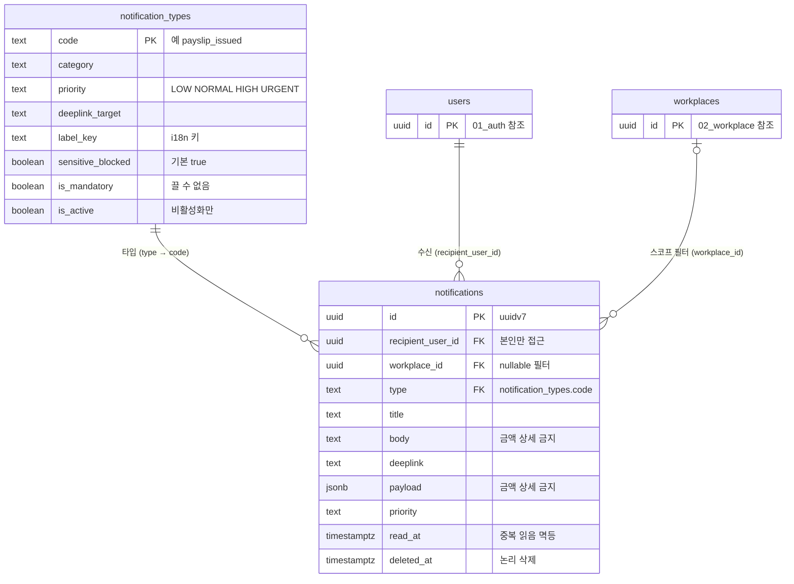

# 13_notification — 알림

> **대상**: insadesk — 알림 도메인 2테이블(notification_types · notifications)
> **작성일**: 2026-08-03
> **개정일**: 2026-09-12 — **개별 알림 딥링크의 레거시 접두를 전건 걷는다** — payslip_issued(PayslipIssueService)와 payroll_confirmed(PayrollConfirmService)가 각각 "/me/payslips/{id}" · "/me/payroll-history"를 싣고 있었다. 같은 날의 앞 개정이 형식 정본을 "웹 URL 형식"으로 확정하고 이 둘을 급여·명세서 도메인 담당으로 남겨 둔 자리이며, **"/payslips/{id}" · "/payroll-history"로 정정**했다(app_front DEEPLINK_ROUTES의 정본 매핑과 일치 — 하위 호환 행이 옛 알림을 계속 살리므로 이미 발송된 알림은 영향받지 않는다). **두 유형은 카탈로그 폴백만으로는 열리지 않는다** — 수신자가 직원 본인이라 실제 소비 채널이 app이고 app 알림 상세 시트는 개별 알림의 딥링크만 읽는다. "개별 알림이 값을 싣는다" 9 → **11종**이고 남은 레거시 발행 지점은 **없다**. 발행 지점마다 회귀 단언을 붙였다(PayslipIntegrationTest · PayrollIntegrationTest). **시드 24종 · 필수 5종 · 카탈로그 값 · 13그룹은 전건 불변**
> **개정일**: 2026-09-12 — **deeplink_target · label_key 24종 전수 채번**(M-7 · L-5 감사 보정 — 값 정본 공백을 이 개정이 메운다). 시드(V0500)가 두 컬럼을 "정본이 문서군에 없다"며 의도적으로 NULL로 남겼고 그 상태로 실제 알림 256건 중 35건만 이동 가능했다 — **딥링크 경로의 정본을 "웹 URL 형식"으로 확정**(app_front가 2026-08-21에 이미 그 축으로 쓰고 있었으나 이 문서에는 닿지 않았다)하고 **label_key 값 집합 13그룹**을 web_front가 쓰던 축을 승격해 정한다. 값은 아래 "딥링크 대상 · 표시 그룹" 절. 보정은 다음 미사용 마이그레이션 번호가 싣는다(V0500은 적용 완료라 고치지 않는다). **같은 절에서 개별 알림 3종(contract_sent · contract_signed · hr_info_change_requested)의 딥링크 값도 정정한다** — 실제 web_front 라우트와 어긋나 있던 것(존재하지 않는 "/workplaces/{id}/…" 접두 · 레거시 "/me/…")을 바로잡았다. 테이블·컬럼·시드 24종·필수 5종은 전건 불변
> **개정일**: 2026-09-07 — **알림 타입 2종 채번**(V0717) — **contract_sent**(HRM · HIGH · **필수**) · **contract_signed**(HRM · NORMAL). 시드 22 → **24종** · 필수 4 → **5종**. [../06_api/05_hr.md](../06_api/05_hr.md) 연동 표가 #22 · #25에 notifications INSERT를 이미 계약했는데 카탈로그에 코드가 없었고, **type이 FK라 코드가 없으면 그 알림을 보낼 방법 자체가 없다**(notification.unknown_type/400). **contract_sent를 필수로 두는 근거는 법정 교부**다 — 근로기준법 §17② 교부는 발송이 성립해야 이행이므로 채널이 막히면 **증적은 있고 이행은 없는 상태**가 된다. **법정 교부 축이 payslip_issued 하나에서 둘이 된다.** 테이블 수·정책·컬럼은 전건 불변
> **개정일**: 2026-09-07 — **notifications.dedupe_key를 컬럼 명세에 등재**한다(2026-09-07 실측 — 열은 V0080부터 존재하는데 명세 표에 없었다). 13 → **14컬럼**이며 부분 UNIQUE **(recipient_user_id, dedupe_key) WHERE dedupe_key IS NOT NULL**을 인덱스 열거와 특이사항에 함께 등재한다. **부분 UNIQUE 28에 이미 포함된 인덱스라 수치는 바뀌지 않는다**(정본 [07_constraints_integrity.md](./07_constraints_integrity.md) #24). 누락 원인은 원본 마이그레이션 주석이 테이블을 "13컬럼 + dedupe_key"로 적어 **본문 계수에서 제외한 표기**를 명세가 승계한 것이다
> **개정일**: 2026-08-08 — DB 커버리지 감사 반영 — 비활성 타입 생성 차단 가드 등재 · 재시도 큐 소관을 Redis로 확정 · 미읽음 배지·목록 인덱스를 조회 축과 정합 · deleted_at을 서버 전용 컬럼으로 정정(알림 삭제는 v1 제외) · priority·sensitive_blocked 정합의 강제 위치 명시
> **개정일**: 2026-08-08 — 타인 알림 접근 응답을 존재 은닉(404)으로 정정 · forbidden/403의 용도를 본인 알림 불허 조작으로 한정
> **개정일**: 2026-08-03 — workplace_suspended 신설로 시드 21 → **22종** · 필수 알림 3 → **4종**(REQ-NTF-05)
> **원천**: docs_ref2/schema_p0.md 테이블 — notification(2) · docs_ref2/requirements_p0.md REQ-NTF-01~06 · REQ-HRM-05

**알림 타입은 enum이 아니라 lookup이다.** 타입은 운영 중 자주 늘어나므로 값 추가마다 ALTER TYPE 마이그레이션이 필요한 enum 대신 전역 lookup 테이블을 둔다.

**알림 생성 실패가 원 이벤트를 롤백하지 않는다.** 급여 확정이 알림 발송 실패로 되돌아가서는 안 되므로 알림 INSERT는 별도 트랜잭션이며, 실패분은 **Redis 재시도 큐**가 담는다 — 관계형 테이블을 두지 않는다. 큐 항목은 성공하면 사라지고 보존·감사 대상이 아니며 알림 본체는 성공 시점에 notifications 행으로 남으므로, 큐를 업무 데이터 정본으로 삼을 이유가 없다(같은 근거로 세션·refresh token도 Redis다 — [../04_architecture/10_realtime_files.md](../04_architecture/10_realtime_files.md) · [../04_architecture/02_authn_session.md](../04_architecture/02_authn_session.md)).

**알림 본문에 급여·개인정보 상세를 담지 않는다.** 잠금화면 미리보기에 금액이 노출되므로 sensitive_blocked가 기본 true이며 payload에도 금액 상세를 금지한다.

---

## 테이블 목록

| # | 테이블 | 보관 내용 | PK 타입 |
|---|--------|----------|---------|
| 48 | notification_types | 알림 타입 lookup(전역) — 우선순위·딥링크·필수 여부·민감 차단 | text(code) |
| 49 | notifications | 인앱 알림 — 수신자·제목·본문·딥링크·읽음·논리 삭제 | uuid(uuidv7) |

---

## 테이블 명세

### 48. notification_types — 알림 타입 lookup (전역)

기능ID **NTF-04** · 요구사항 REQ-NTF-05·06.

| 컬럼명 | 타입 | NULL | 키 | 설명 |
|--------|------|:--:|----|------|
| code | text | N | PK | 타입 코드. 예 payslip_issued |
| category | text | Y | | **발화 도메인 분류**(WRK · AUT · ATT · LEV · PAY · SLP · CMP · SUB · SYS). 카탈로그 운영과 시드 검산의 축이며 사용자 표면에 노출하지 않는다 |
| priority | text | N | | CHECK IN ('LOW','NORMAL','HIGH','URGENT') |
| deeplink_target | text | Y | | 딥링크 대상 |
| label_key | text | Y | | i18n 표시 문구 키 |
| sensitive_blocked | boolean | N | | DEFAULT true — **급여·개인정보 상세 포함을 금지한다** |
| is_mandatory | boolean | N | | **끌 수 없는 필수 알림 5종**(법정 교부 **2종** — 명세서 발행 · 근로계약 발송 · 보안 · 계정 정지 · 사업장 정지) |
| is_active | boolean | N | | 미사용 타입은 **삭제하지 않고 비활성화한다**. **false인 타입으로는 알림을 만들 수 없다** — guard_notification_type_active()가 차단한다 |
| description | text | Y | | 운영 설명. **어느 사용자 표면도 읽지 않는다** — 카탈로그가 서버 고정이라 관리 화면이 없고, 값은 시드·운영 문서의 주석 역할만 한다 |
| created_at | timestamptz | N | | DEFAULT now() |
| updated_at | timestamptz | N | | DEFAULT now() + set_updated_at 트리거 |

- **11컬럼이다.**
- 제약: PK(code) · CHECK priority 4값.
- 인덱스: notification_types_pkey · **부분 (code) WHERE is_active** — 카탈로그 활성 목록 조회.
- 트리거: set_updated_at().
- 전역 마스터라 workplace_id를 갖지 않는다. SELECT는 공개(서버 API 경유)이고 쓰기는 서버 시스템 컨텍스트다.
- **DELETE가 없다** — 발송된 알림이 code를 FK로 참조한다.
- **비활성 타입 차단은 FK가 아니라 가드가 맡는다**(2026-08-08 감사 발견 11). FK는 code의 존재만 검사하고 is_active를 보지 않으므로, 그것만으로는 REQ-NTF-05의 "미정의·**비활성** 타입 생성은 notification.unknown_type/400"이 절반만 강제된다. guard_notification_type_active()가 notifications INSERT 시 참조 타입의 is_active를 재검증한다(정본 [09_functions_triggers.md](./09_functions_triggers.md)).

#### v1 시드 24종

invite_received · invite_accepted · invite_rejected · invite_cancelled · invite_expired · role_changed · member_removed · **account_suspended(필수)** · **workplace_suspended(필수)** · hr_info_change_requested · attendance_anomaly · attendance_change_requested · attendance_approved · attendance_rejected · leave_requested · leave_approved · leave_rejected · payroll_confirmed · **payslip_issued(필수)** · **contract_sent(필수)** · **contract_signed** · compliance_deadline · subscription_notice · **system_notice(필수)**

검산: 초대 5 + 멤버·계정 3 + 사업장 1 + 인사 1 + 근태 4 + 휴가 3 + 급여 1 + 명세서 1 + **근로계약 2** + 준수 1 + 구독 1 + 시스템 1 = **24**.

- **필수 알림 5종**(account_suspended · **workplace_suspended** · payslip_issued · **contract_sent** · system_notice)은 is_mandatory = true이며 사용자가 끌 수 없다 — 법정 교부·보안·계정 정지·사업장 정지는 수신 거부 대상이 아니다. 거부 시도는 notification.mandatory_pref/409다.
- **workplace_suspended는 계정 정지(account_suspended)와 코드를 겸용하지 않는다.** 대상 축이 계정이 아니라 사업장이며, 검증 대기 기한 경과에 따른 자동 정지(REQ-WRK-08)와 플랫폼 제재 정지(REQ-SYS-05) 두 경로를 **OWNER에게** 통보한다 — 사업장이 멈추면 근태·급여가 함께 멈추므로 사용자가 반드시 알아야 한다(REQ-NTF-05).

| 필수 타입 | priority | deeplink 대상 | 수신자 |
|-----------|:--------:|--------------|--------|
| account_suspended | URGENT | 계정 상태 안내(/account) | 대상 계정 본인 |
| **workplace_suspended** | **URGENT** | **사업장 설정·검증 상태(/settings/workplace)** | **사업장 OWNER** |
| payslip_issued | HIGH | 본인 명세서 상세(/payslips) | 대상 직원 본인 |
| **contract_sent** | **HIGH** | **본인 계약 상세(서명 화면)(/contracts)** | **대상 직원 본인** |
| system_notice | NORMAL | 공지 상세(/home — 특정 레코드가 없어 보편 착지) | 전체 또는 지정 대상 |

**경로 값의 정본은 아래 "딥링크 대상 · 표시 그룹" 절이다** — 이 표는 필수 5종만 다루고 나머지 19종은 그 절의 전수 표에 있다.

- **근로계약 2종을 채번한 근거는 표면이 이미 요구하던 알림이라는 것이다**(V0717). [../06_api/05_hr.md](../06_api/05_hr.md) 연동 표가 #22(계약 발송) · #25(서명)에 notifications INSERT를 계약해 두었는데 카탈로그에 코드가 없었다. **type은 FK이고 카탈로그에 없는 값은 notification.unknown_type/400으로 막히므로 코드가 없으면 그 알림을 보낼 방법 자체가 없다.** 감사 액션 3종(V0715)과 같은 형태의 결손이며 원인도 같다 — **표면의 정본과 코드 집합의 정본이 서로를 코드로 가리키지 않았다.** [../06_api/01_conventions.md](../06_api/01_conventions.md)의 연동 테이블 감사 표기 규약이 이 부류를 막는 장치이며, 그 규약을 알림 축까지 넓히면 같은 결손이 재현되지 않는다.
- **contract_sent를 필수로 두는 근거는 법정 교부다.** 근로기준법 §17② 교부는 **발송이 성립해야 이행**이므로, 알림 채널이 막혀 있으면 상태 전이와 교부 이력만 남고 실제 통지가 나가지 않아 **증적은 있고 이행은 없는 상태**가 된다. 기존 필수 4종의 근거가 법정 교부·보안·계정 정지·사업장 정지이고 근로계약 교부가 그중 **법정 교부** 축이라 — 명세서 교부(payslip_issued)와 같은 근거이며 **법정 교부 축이 하나에서 둘이 된다.** 게다가 이 알림은 수신자에게 **행동(서명)을 요구**한다.
- **contract_signed는 필수가 아니다** — 관리자 수신 진행 통지라 초대 수락 통지(invite_accepted)와 같은 부류다.
- **계약 축의 통지 채널은 인앱 알림 하나이고 메일 축을 열지 않는다.** 관리자 세션에서 직원의 recovery_email을 읽을 수 없는 것은 결함이 아니라 설계이며(profiles SELECT 축이 본인·플랫폼 조회 권한 둘뿐이다 — 정본 [08_rls_policies.md](./08_rls_policies.md)), **개인정보 보호의 축을 통지 편의로 열지 않는다.** 연동 표가 요구하는 채널도 notifications 하나다.
- 알림 설정(NTF-06)은 v1 제외이므로 v1에서는 어차피 전부 끌 수 없다. is_mandatory는 도입 시점을 위한 분류다.
- workplace_suspended는 workplace_id가 채워지는 사업장 스코프 알림이다 — 계정 단위 알림(workplace_id NULL)과 목록 필터에서 갈린다.

#### 딥링크 대상 · 표시 그룹 (deeplink_target · label_key)

두 컬럼 다 v1 시드(V0500)에서 24행 전량 NULL로 남았다 — 당시 값 정본이 문서군에 없어 의도적으로 비운 상태였다(V0500 주석). 2026-09-12 감사(M-7 · L-5)에서 실제 알림 256건 중 35건만 이동 가능하고 표시 그룹 배지가 전부 기본값("알림")으로 뜨는 결함으로 드러나 이 절이 값을 채번한다. **실측 근거** — web_front NotificationTypeCatalogItem의 labelKey가 그때까지 필수 필드였는데, 카탈로그 24행 전량이 그 값을 응답에서 생략했다(서버가 null 필드를 생략하는 계약). 계약을 완화하는 것과 별개로 값 자체가 없는 한 표시도 폴백도 성립하지 않았다.

**딥링크 경로의 정본은 "웹 URL 형식"이다** — 2026-08-21 리드 확정. app_front core/navigation/linking.ts가 그 결정의 주석("경로 형식의 정본은 웹 URL 형식이다")과 매핑 표를 이미 실었으나 이 문서에는 닿지 않았다 — 이 절이 그 공백을 메운다. 알림 payload는 **웹·앱 공용**이라 서버가 경로 문자열 하나만 내보내고 각 클라이언트가 자기 라우트로 매핑한다 — 채널별로 경로를 갈라 내보내면 알림 생성 지점마다 수신자의 접속 채널을 알아야 한다. 형식은 web_front 라우트 경로 그대로("/attendance" · "/payslips")이며 **"/me/…" 접두는 정본이 아니다**(app_front가 그 접두를 하위 호환으로만 받는다 — 앱 착수기에 쓰던 형식). **contract_sent · contract_signed · hr_info_change_requested의 개별 딥링크는 이 채번과 함께 정본 형식으로 정정했다**(각각 ContractService · MyContractService · HrChangeRequestService). **payslip_issued · payroll_confirmed도 같은 채번에서 정정했다**(2026-09-12 · PayslipIssueService · PayrollConfirmService) — 남은 레거시 "/me/…" 발행 지점은 **없다.**

**카탈로그 값(deeplink_target)은 자리표시자가 없는 정적 경로만 담는다.** 개별 알림의 딥링크(notifications.deeplink)가 있으면 그것이 **항상 우선**이고, 카탈로그 값은 그 값이 비어 있을 때만 쓰는 폴백이다(REQ-NTF-05 · 클라이언트는 중괄호가 남은 템플릿으로 이동하지 않는다 — 식별자를 채울 수 있는 것은 그 알림을 만든 서버뿐이다). **폴백은 web_front 알림 벨(NotificationBell의 resolveDeeplink)만 소비한다 — app_front 알림 상세 시트(NotificationDetailSheet)는 개별 알림의 deeplink만 보고 카탈로그 폴백을 읽지 않는다.** 그래서 이 절의 24행 채번은 **web 쪽 폴백 경로는 전량 고치지만, app 쪽은 개별 발행 지점이 값을 실어야만 고쳐진다** — 아래 발행 지점 절이 그 경계를 다룬다.

**자기서비스 유형(수신자 본인)의 경로는 web_front에 대응 화면이 없다.** 관리자 웹은 자기서비스 화면을 두지 않고 직원 자기서비스는 app_front 전용이다(app_front CLAUDE.md "본인 소유권 축"). 그 유형의 값은 app_front 라우팅 표(DEEPLINK_ROUTES)와 맞추는 것이 우선이며, web에서 클릭하면 404로 떨어지는 것은 이 경계의 귀결이지 결함이 아니다(예: OWNER가 본인 급여 확정 알림을 관리자 웹에서 여는 경우).

**표시 그룹(label_key)은 category와 다른 축이다.** category(WRK·AUT·ATT·LEV·PAY·SLP·HRM·CMP·SUB·SYS)는 "카탈로그 운영과 시드 검산의 축"이라 사용자 표면에 노출하지 않는 반면(위 컬럼 설명), label_key는 알림 벨 배지가 그대로 노출하는 **표시 축**이다. web_front NotificationBell이 이미 쓰던 notification.group.* 값 집합을 정본으로 승격하고 근로계약 2종의 빈자리(contract)만 새로 더한다 — 나머지 12개 키는 그대로다. **멤버·계정을 하나로 세는 위 검산식과 달리 label_key는 둘을 가른다** — role_changed·member_removed(직위 변화)와 account_suspended(로그인 가능 여부)는 뜻이 다른 알림이라 배지도 갈라야 한 눈에 구분된다.

| 그룹 키 | 표시 | 속하는 타입 | 수 |
|---|---|---|:--:|
| notification.group.invite | 초대 | invite_received · invite_accepted · invite_rejected · invite_cancelled · invite_expired | 5 |
| notification.group.member | 멤버 | role_changed · member_removed | 2 |
| notification.group.account | 계정 | account_suspended | 1 |
| notification.group.workplace | 사업장 | workplace_suspended | 1 |
| notification.group.hr | 인사 | hr_info_change_requested | 1 |
| notification.group.attendance | 근태 | attendance_anomaly · attendance_change_requested · attendance_approved · attendance_rejected | 4 |
| notification.group.leave | 휴가 | leave_requested · leave_approved · leave_rejected | 3 |
| notification.group.payroll | 급여 | payroll_confirmed | 1 |
| notification.group.payslip | 명세서 | payslip_issued | 1 |
| **notification.group.contract** | **근로계약** | **contract_sent · contract_signed** | **2** |
| notification.group.deadline | 기한 | compliance_deadline | 1 |
| notification.group.subscription | 구독 | subscription_notice | 1 |
| notification.group.notice | 공지 | system_notice | 1 |

검산: 5 + 2 + 1 + 1 + 1 + 4 + 3 + 1 + 1 + 2 + 1 + 1 + 1 = **24**. **13그룹**이다.

카탈로그 24행의 deeplink_target 값이다. 표기는 **자리표시자 없는 정적 경로**다.

| code | deeplink_target | label_key | 실제로 여는 클라이언트 |
|---|---|---|---|
| invite_received | /workplaces | notification.group.invite | web(ADM-WORKPLACE-SELECT) — 멤버십 무관 계정 화면이라 수락 전에도 열린다 |
| invite_accepted | /members | notification.group.invite | web(ADM-MEMBERS) — 관리자 수신 |
| invite_rejected | /members | notification.group.invite | web(ADM-MEMBERS) — 관리자 수신 |
| invite_cancelled | /workplaces | notification.group.invite | web(ADM-WORKPLACE-SELECT) |
| invite_expired | /workplaces | notification.group.invite | web(ADM-WORKPLACE-SELECT) |
| role_changed | /members | notification.group.member | web(ADM-MEMBERS) |
| member_removed | /workplaces | notification.group.member | web(ADM-WORKPLACE-SELECT) — 그 사업장 멤버가 아니게 된 뒤라 계정 단위 화면으로 보낸다 |
| account_suspended | /account | notification.group.account | web(ADM-ACCOUNT) · **개별 알림도 값을 싣는다**(SystemUserSanctionService) |
| workplace_suspended | /settings/workplace | notification.group.workplace | web(ADM-WORKPLACE-SETTINGS) — OWNER 수신, 관리 전용이라 app은 의도적으로 미매핑 |
| hr_info_change_requested | /employees | notification.group.hr | web(ADM-EMPLOYEE-LIST) — **개별 알림이 직원 상세 식별자를 싣는다**(HrChangeRequestService — 값을 "/employees/{id}"로 정정. 이전 값 "/workplaces/{id}/employees/{id}"는 그런 라우트가 없어 404였다) |
| attendance_anomaly | /attendance | notification.group.attendance | app · **개별 알림도 값을 싣는다**(AttendanceNotifier) |
| attendance_change_requested | /attendance/approvals | notification.group.attendance | web(ADM-ATTENDANCE-APPROVAL) — 관리자 수신 |
| attendance_approved | /attendance | notification.group.attendance | app · 개별 알림도 값을 싣는다 |
| attendance_rejected | /attendance | notification.group.attendance | app · 개별 알림도 값을 싣는다 |
| leave_requested | /leave/approvals | notification.group.leave | web(ADM-LEAVE-APPROVAL) — 관리자 수신 |
| leave_approved | /leave | notification.group.leave | app · **개별 알림도 값을 싣는다**(LeaveNotifier) |
| leave_rejected | /leave | notification.group.leave | app · 개별 알림도 값을 싣는다 |
| payroll_confirmed | /payroll-history | notification.group.payroll | app · **개별 알림도 값을 싣는다**(PayrollConfirmService — "/payroll-history"로 정정. 이전 값 "/me/payroll-history"는 레거시였다). **자리표시자가 없어 카탈로그 값과 같다** — 그래도 개별 값을 싣는 이유는 app이 폴백을 읽지 않기 때문이다 |
| payslip_issued | /payslips | notification.group.payslip | app · **개별 알림이 값을 싣는다**(PayslipIssueService — "/payslips/{id}"로 정정. 이전 값 "/me/payslips/{id}"는 레거시였다) |
| contract_sent | /contracts | notification.group.contract | app · **개별 알림이 값을 싣는다**(ContractService — "/contracts/{id}"로 정정. 이전 값 "/me/contracts/{id}"는 레거시였다) |
| contract_signed | /contracts | notification.group.contract | web(ADM-CONTRACTS) — 관리자 수신 · **개별 알림이 값을 싣는다**(MyContractService — "/contracts?contractId={id}"로 정정. ADM-CONTRACTS의 상세 선택은 경로가 아니라 쿼리 키 contractId가 소유한다. 이전 값 "/workplaces/{id}/contracts/{id}"는 그런 라우트가 없어 404였다) |
| compliance_deadline | /tax/deadlines | notification.group.deadline | web(ADM-DEADLINE-CALENDAR) — 관리자 수신 |
| subscription_notice | /settings/subscription | notification.group.subscription | web(ADM-SUBSCRIPTION) — OWNER 수신 |
| system_notice | /home | notification.group.notice | web(ADM-HOME) — v1은 발행 경로가 없어 보편 착지로 둔다(아래 비고) |

- **member_removed·invite_received 계열의 목적지가 /workplaces인 이유는 대상자가 그 시점에 그 사업장 멤버가 아니어서다** — invite_received는 아직 수락 전이고 member_removed는 이미 제외된 뒤다. 사업장 스코프 화면으로 보내면 멤버십 판정에 걸려 다시 튕긴다.
- **system_notice는 특정 레코드가 없는 유일한 필수 유형이다.** v1에 발행 경로 자체가 없어(위 필수 타입 절) 이동 자체를 검증하지 못했고, 값은 안전한 보편 착지(ADM-HOME)로 둔다.
- **compliance_deadline · leave_requested · attendance_change_requested의 목적지는 web_front 실제 라우트(tax/deadlines · leave/approvals · attendance/approvals)와 정확히 일치한다** — 관리자 수신 유형이라 web이 실제 소비 채널이다. app_front는 이 경로들을 의도적으로 매핑하지 않는다(관리 기능은 web 전용이라는 기존 경계 — app_front core/navigation/linking.ts 주석).
- **"개별 알림이 값을 싣는다"로 표시한 11종**(account_suspended · attendance_anomaly · attendance_approved · attendance_rejected · leave_approved · leave_rejected · hr_info_change_requested · contract_sent · contract_signed · **payroll_confirmed** · **payslip_issued**)은 이 채번과 함께 발행 지점(AttendanceNotifier · LeaveNotifier · SystemUserSanctionService · HrChangeRequestService · MyContractService · ContractService · **PayrollConfirmService** · **PayslipIssueService**)이 카탈로그 값과 정합하는 경로를 개별 알림에도 싣도록 고쳤다(뒤 셋은 이미 개별 값이 있었지만 실제 web 라우트와 어긋나 있어 값 자체를 정정했다) — **app이 카탈로그 폴백을 읽지 않으므로 자기서비스 유형이 app에서도 실제로 열리려면 개별 값이 필수였고, admin 수신 2종(contract_signed·hr_info_change_requested)도 web 라우트와 맞는 값이어야 실제로 열렸다.** 관리자 수신 유형 중 폴백만 둔 것(예 leave_requested)은 관리 기능은 web 전용이라는 기존 경계와 같은 이유로 app에서 열리지 않는 것이 설계다.
- **결번된 것** — invite_accepted(SQL 정의자 함수 handle_invite_accept · V0003)를 제외한 나머지 관리자 수신 유형은 개별 값을 싣지 않는다. web 카탈로그 폴백만으로 충분하다고 판단했다 — 이 판단이 틀렸다고 밝혀지면(관리자도 app에서 승인 처리를 기대한다면) 다음 채번은 app_front DEEPLINK_ROUTES에 해당 경로를 추가하는 것부터 시작한다(지금은 의도적 미매핑).

### 49. notifications — 인앱 알림

기능ID **NTF-01·03** · 요구사항 REQ-NTF-01·02·03·04 · REQ-HRM-05.

| 컬럼명 | 타입 | NULL | 키 | 설명 |
|--------|------|:--:|----|------|
| id | uuid | N | PK | 식별자. **uuidv7()** — 고volume |
| recipient_user_id | uuid | N | FK → users.id | 수신자 |
| workplace_id | uuid | Y | FK | nullable — 사업장 스코프 필터 |
| type | text | N | FK → notification_types.code | 미정의·비활성 타입은 notification.unknown_type/400 |
| title | text | N | | 제목 |
| body | text | Y | | 본문. **급여·개인정보 상세 금지** |
| deeplink | text | Y | | 딥링크 경로 |
| payload | jsonb | N | | DEFAULT {}. **금액 상세 금지** |
| priority | text | N | | CHECK IN ('LOW','NORMAL','HIGH','URGENT'). **타입 카탈로그 값의 복사이며 생성 시점의 중요도를 고정한다** |
| read_at | timestamptz | Y | | 읽음 시각. 중복 읽음은 멱등 성공이다. **사용자가 조작할 수 있는 유일한 컬럼이다** |
| deleted_at | timestamptz | Y | | 논리 삭제. 미읽음 카운트에서 제외한다. **v1에는 사용자 삭제 표면이 없어 서버 정리 경로만 이 컬럼을 세팅한다** |
| dedupe_key | text | Y | UQ* | **중복 발송 억제 축**. 값이 있으면 (recipient_user_id, dedupe_key)로 유일하다. NULL이면 억제 대상이 아니다 |
| created_at | timestamptz | N | | DEFAULT now() |
| updated_at | timestamptz | N | | DEFAULT now() + set_updated_at 트리거 |

- **14컬럼이다.**
- 제약: PK(id) · CHECK priority 4값 · FK recipient_user_id · FK workplace_id · FK type → notification_types.code.
- 인덱스: notifications_pkey · **부분 (recipient_user_id, workplace_id, type, created_at DESC) WHERE read_at IS NULL AND deleted_at IS NULL** — 미읽음 배지(**타입·사업장별 카운트가 REQ-NTF-04의 조회 축이다**) · **부분 (recipient_user_id, workplace_id, created_at DESC) WHERE deleted_at IS NULL** — 사업장 필터 목록 · **부분 UNIQUE (recipient_user_id, dedupe_key) WHERE dedupe_key IS NOT NULL** — 경보성 알림의 중복 발송 억제.
- 트리거: **guard_notification_user_columns()**(사용자 UPDATE를 read_at으로 제한 · deleted_at은 서버 전용) · **guard_notification_type_active()**(비활성 타입 INSERT 차단) · set_updated_at().
- **인덱스 두 종이 조회 축과 어긋나 있던 것을 정정한다**(감사 발견 17). 배지 인덱스에 type·workplace_id가 없으면 타입별·사업장별 카운트가 인덱스를 타지 못하고, 목록 인덱스에 deleted_at 조건이 없으면 삭제분이 쌓일수록 목록 조회가 그만큼 더 읽는다.
- **사용자 조작 컬럼을 read_at 하나로 좁힌다**(감사 발견 19). 알림 삭제(NTF-05)를 v1에 두지 않으므로 사용자에게 deleted_at 조작을 열어 둘 근거가 없다 — v1에 없는 기능의 조작 경로를 가드가 미리 열지 않는다.
- **SELECT·UPDATE는 recipient_user_id = current_user_id()만이다** — **타인 알림은 조회·조작을 가리지 않고 notification.not_found/404**로 응답해 행 존재 자체를 숨긴다. 403으로 답하면 그 알림이 존재한다는 사실이 새어 나간다(REQ-NTF-03).
- **notification.forbidden/403은 본인 알림에 대한 불허 조작 전용이다** — 필수 알림 해제·삭제 시도 등이며, 타인 알림에는 쓰지 않는다.
- **DELETE가 없다** — 삭제는 deleted_at 논리 삭제다.
- **알림 생성 실패가 원 이벤트를 롤백하지 않는다** — 알림 INSERT는 별도 트랜잭션이며 실패는 **Redis 재시도 큐**로 넘어간다(테이블을 두지 않는다).
- **dedupe_key가 경보성 알림의 중복 발송을 DB에서 막는다**(REQ-TAX-04 배치 멱등의 산출물 축). 정기작업이 같은 기준일로 다시 돌아도 같은 수신자에게 같은 알림이 두 번 쌓이지 않는다 — **배치의 멱등이 알림까지 이어지는 자리이며 억제 판정을 서비스 조회에 맡기지 않는다.** 유일성 축이 (수신자, dedupe_key)라 **사업장 축을 타지 않는다** — 계정 단위 알림(workplace_id NULL)도 같은 규칙으로 억제된다.
- **값이 없으면 억제하지 않는다.** 부분 UNIQUE가 NULL 행을 대상에서 빼므로 일반 알림은 같은 내용이라도 여러 건 쌓인다 — 억제는 **키를 붙인 발신자가 선언하는 것**이지 기본 동작이 아니다.
- **이 열이 명세 표에 없었다**(2026-09-07 실측). 원본 마이그레이션 V0080의 주석이 테이블을 "13컬럼 + dedupe_key"로 적어 **본문에서 셀 때 제외한 흔적**이 그대로 명세로 내려왔다. **컬럼을 본문 계수 밖에 두는 표기를 만들지 않는다** — 세지 않은 열은 명세에도 오르지 않는다.
- **본문·payload의 민감정보 금지와 priority 복사 정합은 서비스가 강제한다.** sensitive_blocked = true인 타입의 본문에 금액이 들어갔는지는 값의 의미 판정이라 CHECK로 표현되지 않으며, priority가 카탈로그 값과 다른지도 생성 시점의 서비스 책임이다 — 두 항목은 제약으로 표현하지 않는 것의 등재 대상이다([07_constraints_integrity.md](./07_constraints_integrity.md) 한계 절).

---

## RLS 정책 — 도메인 요약

정책 표현식 전수의 정본은 [08_rls_policies.md](./08_rls_policies.md)다.

| 테이블 | SELECT | INSERT | UPDATE | DELETE |
|--------|--------|--------|--------|--------|
| notification_types | 공개(서버 API 경유) | 서버(시스템 컨텍스트) | 서버(시스템 컨텍스트) | — |
| notifications | recipient_user_id = current_user_id() | 서버 단일 경로 | recipient_user_id = current_user_id()(**read_at만** · deleted_at은 서버) | — |

---

## ERD

---

## 관계

| 관계 | cardinality | ON DELETE | 의미 |
|------|:-----------:|:---------:|------|
| notification_types → notifications | 1 : N | RESTRICT | 참조된 타입은 삭제하지 않고 비활성화만 한다 |
| users → notifications | 1 : N | RESTRICT | 수신함. 계정 비식별화 후에도 행은 남는다 |
| workplaces → notifications | 0..1 : N | RESTRICT | 사업장 스코프 필터. NULL이면 계정 단위 알림이다 |

---

## 특이사항

**STAFF 인적사항 변경 요청은 별도 테이블을 두지 않는다.** hr_info_change_requested 타입 알림이 저장을 담당하고 관리자가 알림에서 진입해 직접 수정한다(REQ-HRM-05).

- 요청 상태 관리·승인 워크플로가 v1 범위에 없으므로 전용 테이블이 담을 상태가 없다.
- 알림 payload가 요청 내용을 담고 관리자 조치는 audit_logs가 기록한다.

**푸시 알림(NTF-02)과 알림 설정(NTF-06)은 v1에 두지 않는다.** device_tokens · push_send_logs · notification_prefs · user_notification_settings를 만들지 않는다.

- 도입 시 전부 독립 테이블 신설이라 기존 스키마 변경이 없다.
- **필수 알림은 어차피 끌 수 없으므로** v1의 전역 수신은 기능 손실이 아니다.

**workplace_id가 nullable인 것이 의도다.** 계정 정지·구독 만료 같은 계정 단위 알림은 사업장에 속하지 않는다. 사업장 스코프 필터 인덱스가 NULL 행을 자연스럽게 제외한다.

**미읽음 배지 인덱스가 부분 인덱스인 이유는 선택도다.** 읽은 알림과 삭제된 알림이 누적될수록 전체 인덱스는 커지지만 배지 조회는 미읽음만 본다 — 부분 인덱스가 그 부분집합만 담아 크기를 일정하게 유지한다.

---

## 관련 문서

- 폴더 정본·접근 모델 → [README.md](./README.md)
- 전역 ERD·관계 요약 → [erd.md](./erd.md)
- 제약·CHECK 전수 → [07_constraints_integrity.md](./07_constraints_integrity.md)
- RLS 정책 전수 → [08_rls_policies.md](./08_rls_policies.md)
- 함수·트리거 전수 → [09_functions_triggers.md](./09_functions_triggers.md)
- 마이그레이션 배치(V0080__notification.sql) → [10_migrations_seed.md](./10_migrations_seed.md)
- 명세서 발행 알림 → [11_payslip.md](./11_payslip.md)
- 법정 기한 알림 → [12_compliance.md](./12_compliance.md)
- 기능 명세 → [../02_features/10_notification.md](../02_features/10_notification.md)
- 요구사항 → [../03_requirements/11_notification.md](../03_requirements/11_notification.md)
- API 표면 → [../06_api/12_notification.md](../06_api/12_notification.md)
