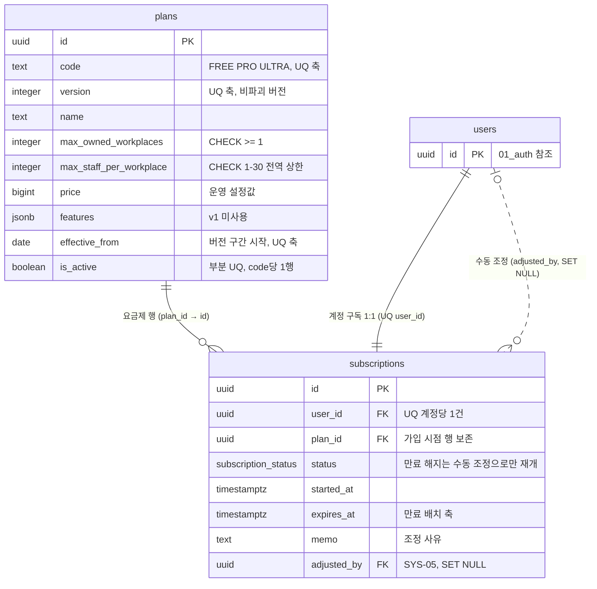

# 14_subscription — 구독·요금제

> **대상**: insadesk — 구독 도메인 2테이블(plans · subscriptions)
> **작성일**: 2026-08-03
> **개정일**: 2026-08-08 — DB 커버리지 감사 반영 — plans 유일성 **2건 신설**(UNIQUE(code, effective_from) · 부분 UQ (code) WHERE is_active) · guard_plan_immutable() 등재(system.plan_in_use/409) · 구독 미설정 계정의 FREE 판정 규칙 명문화 · 사업장 등록 한도의 DB 백스톱 등재 · 미인증 노출 범위의 강제 위치 명시
> **개정일**: 2026-08-08 — 요금제 버전 관리를 (code, version) 복합 유일 + effective_from 구간으로 재설계(plans PK text → uuid · 12 → **13컬럼** · subscriptions.plan_code → **plan_id**) · 관리자 수동 조정 전이(EXPIRED · CANCELLED → ACTIVE · TRIAL)를 상태 전이 가드에 등재
> **원천**: docs_ref2/schema_p0.md 테이블 — subscription(2) · docs_ref2/requirements_p0.md REQ-SUB-01~09 · REQ-SYS-09

**구독은 계정 단위이지 사업장 단위가 아니다.** 한 사업주가 여러 사업장을 소유하므로 한도(소유 사업장 수 · 사업장당 인원)를 계정에 건다. 미설정 계정은 FREE로 간주한다.

**요금제 변경은 비파괴다.** 참조된 요금제 행은 수정·삭제하지 않고 **같은 code의 새 version 행을 발효일과 함께 추가**한다 — subscriptions.plan_id가 가입 시점 행을 가리키므로 가입 시점 한도가 그대로 보존된다. **등급 코드 집합은 FREE · PRO · ULTRA 3종 고정**이며 버전이 늘어도 등급은 늘지 않는다.

**구독 만료는 법정 보존 데이터의 조회·교부를 차단하지 않는다.** EXPIRED는 신규 사업장 등록과 유료 기능만 막고 기존 급여·명세서 접근은 그대로 둔다(REQ-SUB-09).

---

## 테이블 목록

| # | 테이블 | 보관 내용 | PK 타입 |
|---|--------|----------|---------|
| 50 | plans | 요금제 마스터(전역) — 등급별 버전 행. 한도·가격·발효일·활성 | uuid |
| 51 | subscriptions | 계정 구독 — 요금제·상태·기간·수동 조정 이력 | uuid |

---

## 테이블 명세

### 50. plans — 요금제 마스터 (전역)

기능ID **SUB-01** · 요구사항 REQ-SUB-01·02.

| 컬럼명 | 타입 | NULL | 키 | 설명 |
|--------|------|:--:|----|------|
| id | uuid | N | PK | 식별자. **구독이 참조하는 축** |
| code | text | N | **UQ\*** | FREE · PRO · ULTRA. CHECK 3값 — **등급 집합은 고정이다** |
| version | integer | N | **UQ\*** | 같은 등급의 버전. CHECK >= 1 |
| name | text | N | | 표시 명칭 |
| max_owned_workplaces | integer | N | | 소유 사업장 한도. CHECK >= 1 |
| max_staff_per_workplace | integer | N | | **CHECK BETWEEN 1 AND 30 — 어떤 등급도 30을 초과할 수 없다**(상품 전역 상한) |
| price | bigint | N | | 가격(원) |
| features | jsonb | N | | DEFAULT {}. 기능 플래그. **v1은 값을 넣지도 읽지도 않는다** — 등급 차이는 한도 2축뿐이며 REQ-SUB-01이 계약한 생성 컬럼이라 빈 객체로만 존재한다(v1.1 확장 지점) |
| effective_from | date | N | | 발효일. **같은 code 안에서 버전 구간의 시작이다**. **UQ\*** — (code, effective_from) 유일 |
| display_order | integer | N | | 표시 순서 |
| is_active | boolean | N | | 활성 여부. **부분 UQ (code) WHERE is_active — 같은 code의 활성 행은 정확히 1개다** |
| created_at | timestamptz | N | | DEFAULT now() |
| updated_at | timestamptz | N | | DEFAULT now() + set_updated_at 트리거 |

- **13컬럼이다.**
- 제약: PK(id) · **UNIQUE(code, version)** · **UNIQUE(code, effective_from)** · CHECK code 3값 · CHECK version >= 1 · CHECK max_owned_workplaces >= 1 · **CHECK max_staff_per_workplace BETWEEN 1 AND 30**.
- 인덱스: plans_pkey · UNIQUE(code, version) · UNIQUE(code, effective_from) · **부분 UQ (code) WHERE is_active** · (code, effective_from DESC).
- 트리거: **guard_plan_immutable()**(신설) · set_updated_at().
- **유일성 2건이 신설이다**(2026-08-08 감사 발견 3). 부분 UQ (code) WHERE is_active가 **활성 행 정확히 1개**를 강제하고, UNIQUE(code, effective_from)가 같은 등급의 같은 발효일 2행을 막는다. 같은 요구를 terms_documents는 부분 UQ (kind) WHERE is_active로 이미 강제하고 있었다.
- **버전 구간 겹침은 개념적으로 성립하지 않는다.** plans에는 종료일 컬럼이 없고 구간이 [effective_from, 같은 code의 다음 effective_from)으로 파생되므로, 시작일이 유일하면 구간도 유일하다. statutory_rates가 EXCLUDE를 쓰는 이유는 그 테이블이 effective_to를 명시 컬럼으로 갖기 때문이며 축이 다르다.
- **guard_plan_immutable()이 참조된 요금제의 파괴적 변경을 막는다**(감사 발견 4 · system.plan_in_use/409). code·version·effective_from·max_owned_workplaces·max_staff_per_workplace·price의 UPDATE를 차단하고 **name·display_order·is_active만 연다** — 한도를 직접 고치면 기존 가입자의 한도가 소급 변경되고 그 순간 이미 한도를 넘긴 사업장이 생긴다. 같은 형태의 가드가 statutory_rates에 이미 있다(guard_statutory_rate_immutable).
- **시드 3종**: FREE(사업장 1 · 멤버 5) · PRO(3 · 15) · ULTRA(5 · 30) — 각 등급의 version 1 행이며 셋 다 is_active = true다. **가격은 운영 설정값이며 미확인 상태로 시드하지 않는다.**
- 전역 마스터라 workplace_id를 갖지 않는다. SELECT는 공개이고 쓰기는 settings:update 권한이다.
- **공개 SELECT가 노출 범위까지 열어 주지는 않는다**(감사 발견 7). REQ-SUB-01은 미인증 응답을 is_active 행의 code · name · 한도 2축 · price · display_order로 한정하는데, RLS는 컬럼을 좁히지 못하고 정책 술어도 행 전체를 연다. **is_active 필터와 응답 필드 한정은 서버 API가 강제하며** 이 항목은 제약으로 표현하지 않는 것의 등재 대상이다([07_constraints_integrity.md](./07_constraints_integrity.md) 한계 절).
- **DELETE가 없다** — 구독이 행 ID를 FK로 참조한다.

#### 비파괴 변경 원칙

참조된 요금제 행은 수정·삭제하지 않고 **같은 code의 새 version 행 + 발효일 등록**으로 바꾼다. 파괴적 변경 시도는 system.plan_in_use/409다.

- 한도를 직접 고치면 기존 가입자의 한도가 소급 변경되고, 그 순간 이미 한도를 넘긴 사업장이 생긴다.
- subscriptions.plan_id가 가입 시점 행을 가리키므로 새 버전을 만들어도 기존 가입자는 영향받지 않는다.
- **code를 새로 만들지 않는 이유는 등급 3종 고정 기준 때문이다**(FREE · PRO · ULTRA — 정본 [../README.md](../README.md) 고정 기준). code를 늘리는 방식이면 화면·한도 서술이 가리키는 등급 집합이 버전마다 불어난다.
- 같은 code에서 **유효 구간이 겹치는 버전을 등록할 수 없다** — UNIQUE(code, effective_from)가 시작일 중복을 막고 구간은 다음 발효일까지로 파생되므로 겹침이 성립하지 않는다(REQ-SUB-02).
- **절대 상한 30명은 등급과 무관한 상품 전역 제약이다** — 소상공인(상시 근로자 1~30인) 대상 제품의 경계이며 CHECK가 그것을 DB에서 강제한다.

### 51. subscriptions — 계정 구독

기능ID **SUB-02·03·04·05** · 요구사항 REQ-SUB-03·05·06·08·09.

| 컬럼명 | 타입 | NULL | 키 | 설명 |
|--------|------|:--:|----|------|
| id | uuid | N | PK | 식별자 |
| user_id | uuid | N | FK → users.id · **UQ** | **계정 단위**(사업장 단위가 아니다). 미설정 계정은 FREE로 간주한다 |
| plan_id | uuid | N | FK → plans.id | 가입 요금제 **행**(code + version). 가입 시점 한도를 보존한다 |
| status | subscription_status | N | | TRIAL · ACTIVE · PAST_DUE · EXPIRED · CANCELLED |
| started_at | timestamptz | N | | 시작 시각 |
| expires_at | timestamptz | Y | | 만료 시각 |
| memo | text | Y | | 수동 조정 사유 |
| adjusted_by | uuid | Y | FK → users.id (**SET NULL**) | 시스템 관리자 수동 조정자(SYS-05) |
| adjusted_at | timestamptz | Y | | 조정 시각 |
| created_at | timestamptz | N | | DEFAULT now() |
| updated_at | timestamptz | N | | DEFAULT now() + set_updated_at 트리거 |

- **11컬럼이다.**
- 제약: PK(id) · **UNIQUE(user_id)** — 계정당 1건 · FK user_id · FK plan_id · FK adjusted_by SET NULL.
- 인덱스: subscriptions_pkey · UNIQUE(user_id) · 부분 (status, expires_at) WHERE status IN ('TRIAL','ACTIVE','PAST_DUE') — checkSubscriptionExpiry 00:10 배치.
- 트리거: guard_subscription_transition() · set_updated_at().
- SELECT는 본인 + 시스템 관리자(subscription:view)다. 조정은 subscription:update 권한 + **사유 필수**다.

#### 구독 미설정 계정의 요금제 판정

**구독 행이 없는 계정은 code = 'FREE' AND is_active인 plans 행을 적용한다**(REQ-SUB-03의 FREE 간주). 판정 규칙을 여기서 고정하는 이유는 한도 가드가 참조할 행을 스스로 골라야 하기 때문이다(2026-08-08 감사 발견 5).

| 상황 | 적용 요금제 행 |
|------|--------------|
| subscriptions 행 있음 | plan_id가 가리키는 행 — **가입 시점 한도를 그대로 보존한다** |
| subscriptions 행 없음 | code = 'FREE' AND is_active인 행 — **부분 UQ가 그 행의 유일성을 보장한다** |
| status = EXPIRED · CANCELLED | plan_id 행의 한도를 그대로 쓰되 신규 사업장 등록·한도 소비 행위를 차단한다(REQ-SUB-09) |

- **부분 UQ (code) WHERE is_active가 없으면 이 판정이 비결정적이 된다** — 활성 FREE 행이 둘이면 어느 한도를 적용할지 결정할 수 없고, 그 순간 guard_member_cap()의 판정도 갈린다.
- v1 사용자의 대다수가 구독 미설정이므로 이 경로가 기본 경로다.

#### 상태 전이 가드

guard_subscription_transition()이 강제한다.

| 현재 | 허용 전이 | 조건 |
|------|----------|------|
| TRIAL | ACTIVE · EXPIRED | — |
| ACTIVE | PAST_DUE · CANCELLED · EXPIRED | — |
| PAST_DUE | ACTIVE · EXPIRED | — |
| **EXPIRED · CANCELLED** | **ACTIVE · TRIAL** | **관리자 수동 조정 전용** — subscription:update 권한 · memo(사유) 필수 · audit_logs 기록. 자동 경로(배치·서비스 일반 로직)로는 전이하지 않는다 |

- **EXPIRED·CANCELLED를 종단으로 두지 않는 이유는 v1의 유료 전환·재개 경로가 관리자 수동 조정 하나뿐이기 때문이다**(REQ-SYS-09). subscriptions는 UNIQUE(user_id)에 DELETE 정책도 없어, 종단으로 막으면 한 번 만료·해지된 계정은 FREE 재등록조차 불가능해진다.
- 수동 조정 전이만 예외이므로 **가드는 상태 쌍만이 아니라 조정 컨텍스트(adjusted_by · memo 존재)를 함께 본다** — 조건을 갖추지 않은 전이는 그대로 거부한다.

#### 만료가 차단하는 것과 차단하지 않는 것

| 대상 | EXPIRED에서 |
|------|:----------:|
| 신규 사업장 등록 | 차단 |
| 유료 기능 | 차단 |
| **기존 급여·명세서 조회·교부** | **차단하지 않는다** |
| 기존 사업장·멤버 | 자동 삭제하지 않는다 |

- **법정 보존 데이터의 접근을 구독 상태로 막으면 그 자체가 위반 소지다**(REQ-SUB-09 · CMP-07). payslips의 SELECT가 멤버십·구독 상태를 보지 않는 것이 이 규칙의 구현이다.
- 등급 강등으로 사용량이 한도를 초과해도 기존 사업장·멤버를 자동 삭제하지 않는다 — 초과 상태는 신규 생성만 막고 기존 데이터는 유지한다.

---

## RLS 정책 — 도메인 요약

정책 표현식 전수의 정본은 [08_rls_policies.md](./08_rls_policies.md)다.

| 테이블 | SELECT | INSERT | UPDATE | DELETE |
|--------|--------|--------|--------|--------|
| plans | 공개(**is_active 필터·응답 필드 한정은 서버 API**) | 서버(settings:update) | 서버(settings:update) + **guard_plan_immutable()** | — |
| subscriptions | 본인 + 시스템 관리자(subscription:view) | 서버(구독 서비스) | 서버. 조정은 subscription:update + 사유 필수 | — |

---

## ERD

---

## 관계

| 관계 | cardinality | ON DELETE | 의미 |
|------|:-----------:|:---------:|------|
| plans → subscriptions (plan_id) | 1 : N | RESTRICT | 참조된 요금제 행은 삭제하지 않고 새 버전 행을 추가한다 |
| users → subscriptions (user_id) | 1 : 1 | RESTRICT | UQ(user_id)가 계정당 1건을 강제한다 |
| users → subscriptions (adjusted_by) | 0..1 : N | **SET NULL** | 행위자. 조정 사실은 memo와 audit_logs에 남는다 |

---

## 특이사항

**subscription_requests를 만들지 않는다.** REQ-SYS-09가 "PG 자동 결제와 업그레이드 요청 워크플로(SUB-06·07)는 v1 제외이므로 문의 CTA + 관리자 수동 조정 경로로 처리한다"로 확정했고 features_p0에 SUB-06·07이 없다.

- v1의 유료 전환은 subscriptions 직접 조정 + audit_logs(reason 필수)다.
- adjusted_by · adjusted_at · memo 3컬럼이 그 경로의 감사 근거다.
- 도입 시 subscription_requests를 신설한다 — 독립 테이블이라 기존 스키마 변경이 없다.

**한도 강제 지점이 DB와 서비스 양쪽에 있다.** plans의 CHECK가 상품 상한 30을 막고, workplace_members의 guard_member_cap()이 사업장 인원을 막으며, 사업장 등록은 **guard_workplace_cap()**(신설)이 owned_workplace_count(uid)를 재검증해 막는다.

| 한도 축 | 서비스 1차 | DB 백스톱 |
|--------|-----------|----------|
| 사업장당 활성 멤버 수 | 초대 발송·수락 시점 검증 + 사업장 advisory lock | guard_member_cap() · plans CHECK 1~30 |
| 소유 사업장 수 | 등록 시점 검증 + 등록자 users 행 FOR UPDATE | **guard_workplace_cap()** |

- **사업장 등록 축에만 DB 백스톱이 없던 것을 정정한다**(감사 발견 6). 두 축 모두 동시 요청이 검사를 함께 통과하면 한도를 넘기는 구조인데, 인원 축은 트리거가 받치고 등록 축은 서비스 재검증뿐이었다.
- **owned_workplace_count는 CLOSED를 제외한다** — 폐쇄가 한도를 되돌려주지 않으면 OWNER는 사업장을 정리하고도 새로 만들 수 없고, OWNER 탈퇴 데드락이 생긴다([09_functions_triggers.md](./09_functions_triggers.md)).
- 서버가 advisory lock으로 1차 직렬화하고 트리거가 동시성 우회 백스톱이다.

**계정 단위 구독이 사업장 단위 데이터와 만나는 지점은 한도뿐이다.** 사업장 자체는 구독을 참조하지 않으며, 소유자 계정의 구독이 그 사업장의 한도를 결정한다 — 소유자가 바뀌면(양도, v1 제외) 한도 근거도 함께 옮겨간다.

**요금제 가격은 미확인 상태로 시드하지 않는다.** price 컬럼은 NOT NULL이지만 운영 설정값이며, 확정 전 임의 값을 넣으면 그 값이 화면에 노출된다.

---

## 관련 문서

- 폴더 정본·접근 모델 → [README.md](./README.md)
- 전역 ERD·관계 요약 → [erd.md](./erd.md)
- 제약·CHECK 전수 → [07_constraints_integrity.md](./07_constraints_integrity.md)
- RLS 정책 전수 → [08_rls_policies.md](./08_rls_policies.md)
- 함수·트리거 전수(owned_workplace_count · active_member_count) → [09_functions_triggers.md](./09_functions_triggers.md)
- 마이그레이션 배치(V0090__subscription.sql) → [10_migrations_seed.md](./10_migrations_seed.md)
- 사업장 멤버 한도 → [02_workplace.md](./02_workplace.md)
- 플랫폼 관리자 권한 → [15_system.md](./15_system.md)
- 기능 명세 → [../02_features/11_subscription.md](../02_features/11_subscription.md)
- 요구사항 → [../03_requirements/12_subscription.md](../03_requirements/12_subscription.md)
- API 표면 → [../06_api/13_subscription.md](../06_api/13_subscription.md)
