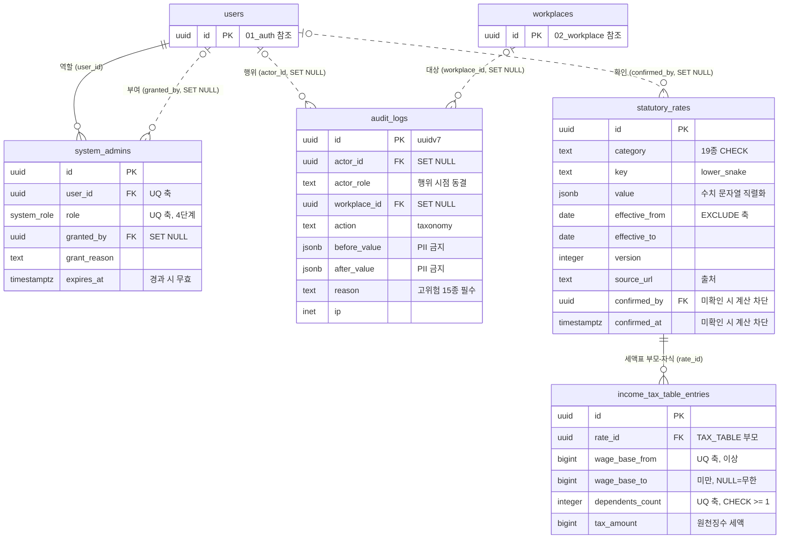

# 15_system — 시스템 관리·법정 기준값

> **대상**: insadesk — 시스템 도메인 4테이블(system_admins · audit_logs · statutory_rates · income_tax_table_entries)
> **작성일**: 2026-08-03
> **개정일**: 2026-09-16 — action 코드 **2종 추가 채번**(list.export · list.export_sensitive) — 목록 공통 내보내기(DSH-06 · [../06_api/04_workplace.md](../06_api/04_workplace.md) #35 · #36 · [../06_api/14_system.md](../06_api/14_system.md) #36)가 **파일을 만드는 순간** 한 행을 남기는데 민감 목록과 그 밖을 **코드로 가른다** — 사유 강제와 개방이 둘 다 action 값으로 판정되기 때문이다. 사유 필수 **16 → 17항목 · 27 → 28코드**(⑰ 민감 목록 내보내기) · 개방 **34 → 35종**(데이터 축 4 → **5**) · 전수 **59 → 61종**. 강제 지점은 **V0740**이고 함수 본문 교체 · ALTER POLICY 라 함수 수 · 정책 수는 움직이지 않는다. 기록 구조 절을 함께 등재한다
> **개정일**: 2026-09-10 — action 코드 **1종 추가 채번**(contract.cancel) — [../06_api/05_hr.md](../06_api/05_hr.md) #23(근로계약 취소)이 reason을 필수로 받아 놓고 **어디에도 남기지 않았다**(contracts에 사유 열이 없고 상태만 CANCELLED로 바뀌며 감사 기록도 없었다 · REQ-GLB-17 위반). **계약 도메인의 action 코드가 집합에 하나도 없던 것**이 그 형태다. **사유 비필수 · 사업장 개방**이라 인사 축 5 → **6** · 개방 33 → **34종** · 전수 58 → **59종**이고 강제 지점은 **V0736**(ALTER POLICY 1건 · 정책 173 불변)이다. **사유 필수 16항목 27코드 · 그 밖의 축 7 · 권한 키 27종 · 카테고리 19종 · enum 33종 132값은 전건 불변** — 사유는 표면이 강제하며 가드 배열에 넣으면 정본이 둘이 된다
> **개정일**: 2026-09-10 — **FILING_DEADLINE key 열거에 due_soon_window를 더한다**(제품 파라미터 — 기한 임박 구간 3일 · 사용자 확정 2026-09-10). dueState 파생의 임계가 **정한 자리 없이 코드 상수로만 있던** 것을 기준값으로 옮긴 자리이며, **이 키만 사건에서 기한을 세우지 않고 기한에서 구간을 되짚는다**(rule days_before_due). 검증 대기 자동 정지 기한과 같은 흡수 선례라 **카테고리 19종 · key 합성 규약(콜론 합성 3종) · action 코드 58 · 권한 키 27종 · enum 33종 132값은 전건 불변**이고 **시드 행 수만 늘어난다**. 흡수 근거는 [../03_requirements/01_global_rules.md](../03_requirements/01_global_rules.md) §1.3 · 파생 계약은 [../06_api/11_compliance.md](../06_api/11_compliance.md) #8이다
> **개정일**: 2026-09-10 — **FILING_DEADLINE의 4대보험 key를 보험별 2축으로 가른다** — 단일 키 insurance_acquisition · insurance_loss **2종을 폐지**하고 insurance_acquisition:{pension · health · employment · industrial_accident} · insurance_loss:{동일 4종} **8키**로 수렴한다(정정 수렴 대상 — 2026-08-03 확정 시드의 insurance_loss 행). 근거는 조문 본문이다 — **건강보험만 취득·상실일부터 14일**(국민건강보험법 §8② · §10②)이고 나머지 셋이 다음 달 15일이라 **단일 키는 넷 중 하나에 대해 틀린 값**이었다. **key 합성 규약에 이미 맞는 형태이므로 규약을 고치지 않는다** — 콜론 합성 3종 · **카테고리 19종 · action 코드 58 · 권한 키 27종 · enum 33종 132값은 전건 불변**이고 **시드 행 수만 늘어난다**. 조문 출처의 정본은 [../03_requirements/18_official_references.md](../03_requirements/18_official_references.md) · 기한 파생은 [12_compliance.md](./12_compliance.md)다
> **개정일**: 2026-09-10 — action 코드 **1종 추가 채번**(scheduled_job.rerun) — [../06_api/14_system.md](../06_api/14_system.md)가 표면 **#34**(정기작업 재실행)를 채번하면서 생긴 자리이고, 그 문서가 "이 도메인의 모든 변이 표면이 audit_logs 대상"이라고 계약하므로 **코드가 없으면 그 기록을 남길 방법 자체가 없다**. **사유 비필수 · 사업장 미개방**이라 그 밖의 축 6 → **7** · 전수 57 → **58종**이다. **사유 필수 27코드 16항목 · 사업장 개방 33종 · 권한 키 27종 · 카테고리 19종 · enum 33종 132값은 전건 불변**이며 **마이그레이션이 따라오지 않는다** — 트리거 판정 배열도 정책 IN 목록도 이 코드를 담지 않는 것이 맞는 상태다
> **개정일**: 2026-09-10 — 인용 갱신 — ROUNDING_POLICY 조회 키 10 → **11종**(시급제·일급제 월 통상임금 ordinary_monthly_wage 신설 · 채번 정본 [../03_requirements/01_global_rules.md](../03_requirements/01_global_rules.md) §1.1). **시드 행이 하나 늘어난다.** **카테고리 19종 · key 합성 규약 · action 코드 · 권한 키 27종은 전건 불변**
> **개정일**: 2026-09-10 — **account.reset_password_assisted의 기록 구조를 등재**한다 — 코드는 채번돼 있었으나 **무엇을 남기는지가 규정되지 않았고**, [../06_api/14_system.md](../06_api/14_system.md) #10의 대행 방식이 확정되면서(복구 이메일 대리 등록) 남길 것이 정해졌다. **본인 확인 수단(3값)의 정본이 이 절이다** — enum도 컬럼도 아닌 **after_value jsonb 안의 값**이라 SIZE_POLICY value 구조와 같은 형태로 키를 고정한다. **사유 필수 축은 움직이지 않는다** — 확인 수단은 「어떻게 확인했나」이고 사유는 「왜」라서 다른 축이며, #10은 사유 비필수를 유지한다. **action 코드 57 · 사유 필수 코드 27 · 항목 16 · 개방 33 · enum 33종 132값은 전건 불변**
> **개정일**: 2026-09-09 — 인용 갱신 — ROUNDING_POLICY 조회 키 9 → **10종**(1일 통상임금 ordinary_daily_wage 신설 · 채번 정본 [../03_requirements/01_global_rules.md](../03_requirements/01_global_rules.md) §1.1). **시드 행이 하나 늘어난다.** **카테고리 19종 · action 코드 · 권한 키 27종은 전건 불변**
> **개정일**: 2026-09-09 — 상호참조 갱신 — compliance_task.waive 의 발생 표면이 06_api/11_compliance.md #9 → **#15**(면제 전용 POST)로 바뀌었다. **action 코드 51종 · 개방 33종 · 사유 필수 15항목 26코드 · 권한 키 27종은 전건 불변**이다 — 표면이 갈렸을 뿐 남기는 판단이 바뀌지 않았다
> **개정일**: 2026-09-07 — reason 필수 액션 표가 **같은 문서의 action 코드 집합 절과 갈라져 있었다**(발견·정정) — 코드 집합 절은 ⑯ 계정 구독 수동 조정을 담았는데 **이 표와 검산은 ⑮에서 멈춰 있었다.** ⑯ 행과 구독 축 1을 더해 검산을 **16**으로 맞췄고, **한 문서가 같은 집합을 두 자리에서 센다**는 사실을 절에 등재했다. 판정 대상 코드 수를 다시 세던 문장과 사유 필수 총수를 재인용하던 문장에서도 수치를 걷었다 — **세는 자리는 코드 집합 절 하나다.** 집합 자체는 불변이다
> **개정일**: 2026-09-07 — **강제 지점 반영 완료**(V0712) — 직전 개정이 채번한 action 코드 3종의 강제 지점 둘을 마이그레이션이 채웠다. guard_audit_reason_required()의 판정 배열이 ⑦을 **사업장 폐쇄**로 넓혀 workplace.close를 흡수하고(코드 **26** · **항목 15는 불변**), audit_logs_select의 action IN 목록이 사업장·멤버 축을 **7**로 넓혀 workplace.close · business_unit.declare를 흡수했다(개방 **27종**). **account.delete는 어느 강제 지점에도 들어가지 않는다** — 사유 필수가 아니고 사업장에 열지도 않는 계정 축이라 그 밖의 축에만 등재된다. **workplace.close_forced는 사유 필수에만 있고 개방에는 없다.** 코드 집합 수치는 전건 불변이며 이 개정은 상태 갱신이다
> **개정일**: 2026-09-08 — action 코드 **2종 추가 채번**(leave_request.cancel · leave_grant.recompute) — [../06_api/07_leave.md](../06_api/07_leave.md) 연동 표가 #5·#12 를 audit_logs 대상으로 이미 선언했는데 대응 코드가 없던 자리다. 근태·휴가 축 10 → **12** · 개방 31 → **33종** · 전수 55 → **57종**. **사유 필수 16항목 27코드는 불변**이며 강제 지점은 **V0722**
> **개정일**: 2026-09-07 — action 코드 **4종 추가 채번**과 **사유 필수 항목 15 → 16** — [../06_api/14_system.md](../06_api/14_system.md)가 "이 도메인의 모든 변이 표면이 audit_logs 대상"이라고 계약하는데 변이 표면 17 중 넷에 붙일 코드가 없었다. **subscription.adjust**(#18 · 사유 필수 — REQ-SYS-09가 "사유가 필수"라고 못박고 RBAC 표도 같은 요구를 적는데 **이 절의 열거만 빠뜨리고 있었다** · 흡수할 항목이 없어 ⑯ 신설) · **account.reset_password_assisted**(#10) · **plan.create**(#15) · **plan.update**(#16) 셋은 사유 비필수·비개방이라 그 밖의 축 3 → **6**. 사유 필수 코드 26 → **27** · 항목 15 → **16** · 전수 51 → **55종** · **개방 31은 불변**. 강제 지점은 **V0719**
> **개정일**: 2026-09-07 — action 코드 **1종 추가 채번**(compliance_task.waive) — [../06_api/11_compliance.md](../06_api/11_compliance.md) 연동 표가 #9(기한 과제 면제)를 audit_logs 대상으로 이미 선언했는데 대응 코드가 없던 자리다. 데이터 축 3 → **4** · 개방 30 → **31종** · 전수 50 → **51종**. **사유 필수 15항목 26코드는 불변**(면제 사유는 compliance_tasks.waived_reason 이 강제한다) · 강제 지점은 **V0718**
> **개정일**: 2026-09-07 — action 코드 **3종 추가 채번**(attendance_record.approve · attendance_record.reject · attendance_change_request.proxy_submit) — [../06_api/06_attendance.md](../06_api/06_attendance.md) 연동 표가 #5·#6·#11에 audit_logs INSERT를 요구하는데 **본 절에 코드가 없어 그 기록을 남길 방법 자체가 없던 자리**다. 셋 다 사업장 관리자 개방 축이며 **사유 필수가 아니다**(대리 제출의 사유는 attendance_change_requests.reason이 NOT NULL로 강제한다). 사업장 개방 27 → **30종** · 근태·휴가 축 7 → **10** · 전수 47 → **50종**. **사유 필수 15항목 · 26코드는 불변**이며 강제 지점(RLS 정책 IN 목록)은 **V0715**가 채운다
> **개정일**: 2026-09-07 — action 코드 **3종 채번**(account.delete 본인 탈퇴 · business_unit.declare 사업 단위 선언 · workplace.close 자발 폐쇄) · ⑦을 강제 폐쇄 → **사업장 폐쇄**로 넓혀 자발 폐쇄를 흡수(**사유 필수 항목 15는 불변** · 코드 25 → **26**) · 사업장 개방 25 → **27** · 그 밖의 축 2 → **3** · 전수 44 → **47종**. **강제 지점(트리거 배열 · RLS 정책 IN 목록)은 마이그레이션이 따라와야 성립한다**
> **개정일**: 2026-09-07 — **SIZE_POLICY value 구조 등재**(label · article · applies_below_threshold — 참·거짓도 문자열. 값 키가 규정되지 않은 공백에서 적재 데이터와 구현의 키 이름이 어긋나 임계값 미만 적용 여부가 전 조문에서 거짓으로 읽히는 결함이 실측됐다)
> **개정일**: 2026-09-07 — action 코드 집합에 **플랫폼 운영 축 2종 신설 등재**(terms_document.create · terms_document.activate — SYS-11 변이 표면이 감사 대상인데 대응 코드가 두 부분집합 어디에도 없었다) · 코드 집합 전수 검산 42 → **44종**(사유 필수 25 · 사업장 개방 25 불변)
> **개정일**: 2026-08-20 — FILING_DEADLINE key 예시에 **insurance_acquisition**(§1.3 신고 유형 열거 "취득신고"와의 키 공백 해소 — 기한 값 등재는 확인 절차 후, REQ-TAX-01 생성 계약 대응)과 verification_suspend(§1.3 2026-08-20 흡수 개정 반영) 추가
> **개정일**: 2026-08-09 — D-9 후속 정합 — statutory_rates category 17 → **19종**(STANDARD_WORK_HOURS · FILING_DEADLINE 신설) · **key 합성 규약 등재**(다축 카테고리 11종의 콜론 구분) · 사유 필수 15종을 REQ-GLB-17 문언과 대조해 **15종 유지 판정**(일반 급여 확정 비귀속 · 기준값 적용 예외는 ⑧에 귀속) · analytics 2키를 **v1 예약** 표기로 정리
> **개정일**: 2026-08-08 — DB 커버리지 감사 반영 — system_admins 부분 인덱스 술어의 now() 제거(**인덱스 생성 불가 정정**) · audit_logs **action 코드 집합 정본 등재**(사유 필수 15종 매핑 · 사업장 관리자 개방 집합) · 헬퍼 정의자 롤 전제 정합(GD1) · 기준값 공개 SELECT의 확인 메타 노출 한정 명시
> **개정일**: 2026-08-08 — ERD 주석의 사유 필수 액션 표기 13 → **15종** 잔여 정합(본문 확정과 일치시킴)
> **개정일**: 2026-08-08 — 사유 필수 액션 13 → **15종**(민감 문서 다운로드 · 원좌표 파기 실행) · 권한 키 27종이 채번 정본과 같은 집합임을 명시
> **개정일**: 2026-08-03 — 초기 SUPER_ADMIN을 시드에서 기동 부트스트랩으로 이관 · 권한 키 26 → **27종**(system_admin:view) · 사유 필수 액션 11 → **13종**(자기포함 확정 · 부트스트랩)
> **원천**: docs_ref2/schema_p0.md 테이블 — system(4) · docs_ref2/requirements_p0.md REQ-SYS-01~16 · REQ-GLB-08·09·17 · REQ-PAY-24

**플랫폼 역할은 사업장 RBAC와 완전 별개다.** system_admins의 4단계(VIEWER · SUPPORT · ADMIN · SUPER_ADMIN)는 사업장 OWNER·MANAGER·STAFF와 축이 다르며, 사업장 OWNER라도 플랫폼 권한 없이는 감사 로그에 접근할 수 없다.

**statutory_rates가 비어 있으면 급여 계산이 아예 불가능하다.** 요율·세액표·한도·정책값의 유일한 조회처이며, confirmed_at·confirmed_by가 비면 미확인으로 간주해 계산을 차단한다.

**간이세액표는 부모(버전·출처·확인자)와 자식(행 데이터)으로 분리한다.** (과세표준 구간 × 부양가족 수) 수천 행을 jsonb 한 행에 담으면 조회마다 거대 문서를 로드한다.

---

## 테이블 목록

| # | 테이블 | 보관 내용 | PK 타입 |
|---|--------|----------|---------|
| 52 | system_admins | 플랫폼 관리자 역할 — 4단계·부여 사유·만료 | uuid |
| 53 | audit_logs | 감사 로그(INSERT 전용) — 행위자·역할 동결·액션·사유 | uuid(uuidv7) |
| 54 | statutory_rates | 법정 기준값(전역 · effective-dated) — **19 category** | uuid |
| 55 | income_tax_table_entries | 근로소득 간이세액표 항목 — 구간 × 부양가족 수 | uuid |

---

## 테이블 명세

### 52. system_admins — 플랫폼 관리자 역할

기능ID **SYS-01** · 요구사항 REQ-SYS-01·02·03.

| 컬럼명 | 타입 | NULL | 키 | 설명 |
|--------|------|:--:|----|------|
| id | uuid | N | PK | 식별자 |
| user_id | uuid | N | FK → users.id · UQ* | 대상 계정. (user_id, role) UQ — **복수 역할 가능** |
| role | system_role | N | UQ* | VIEWER(1) · SUPPORT(2) · ADMIN(3) · SUPER_ADMIN(4) |
| granted_by | uuid | Y | FK → users.id (**SET NULL**) | 부여자 |
| grant_reason | text | Y | | **부여 시점 사유의 동결 사본**. 감사 정본은 audit_logs.reason(액션 system_admin.grant_role)이며, 이 컬럼은 행위자 계정이 사라져도(SET NULL) 부여 근거가 행에 남게 하는 축이다 — actor_role을 동결하는 것과 같은 이유다 |
| expires_at | timestamptz | Y | | NULL = 무기한. **경과한 역할은 무효다** |
| created_at | timestamptz | N | | DEFAULT now() |
| updated_at | timestamptz | N | | DEFAULT now() + set_updated_at 트리거 |

- **8컬럼이다.**
- 제약: PK(id) · UNIQUE(user_id, role) · FK user_id · FK granted_by SET NULL.
- 인덱스: system_admins_pkey · UNIQUE(user_id, role) · **(user_id, role, expires_at)** — 만료 판정 포함 커버링 조회.
- 트리거: guard_last_super_admin() · set_updated_at().
- **부분 인덱스 술어에서 now()를 제거한 것이 정정이다**(2026-08-08 감사 발견 2). PostgreSQL은 부분 인덱스 술어에 IMMUTABLE 표현식만 허용하고 now()는 STABLE이므로 그 형태의 인덱스는 **생성 자체가 거부되어 마이그레이션이 실패한다.** 만료 판정은 인덱스가 아니라 조회 술어와 is_system_admin() 헬퍼가 수행하며(헬퍼는 만료 역할을 이미 제외한다 — [08_rls_policies.md](./08_rls_policies.md) 헬퍼 절), 인덱스는 그 판정에 필요한 컬럼을 함께 담아 조회를 커버한다.
- **본 테이블의 정책은 헬퍼가 자기 자신을 평가하는 유일한 지점이다.** SELECT 정책이 has_system_permission()을 호출하고 그 헬퍼가 다시 본 테이블을 읽으므로, 헬퍼 정의자 롤 insadesk_helper(BYPASSRLS · NOLOGIN)로 그 순환을 끊는다(GD1) — **앱 롤 insadesk_app의 우회는 여전히 불가능하다**. 롤 정의의 정본은 [08_rls_policies.md](./08_rls_policies.md)다.
- **초기 SUPER_ADMIN은 시드가 아니라 서버 기동 부트스트랩이 만든다** — 마이그레이션에 자격증명을 담지 않기 위해서다. system_admins가 0건일 때만 환경변수(username · password 해시)로 users·profiles·system_admins를 원자 생성하며 절차 정본은 [10_migrations_seed.md](./10_migrations_seed.md)다. 이후 임명·회수는 v1에 화면이 없고(SYS-02 이월) audit_logs가 감사를 담당한다.

#### 권한 화이트리스트

has_permission(role, perm)이 정적 집합으로 판정한다. **리터럴 와일드카드가 없고 미정의 키는 기본 거부**다.

| 역할 | 권한 |
|------|------|
| VIEWER | workplace:view/search · user:view/search · subscription:view/search · plan:view · statutory:view · **analytics:view(v1 예약)** |
| SUPPORT | VIEWER + support:act · user:reset_password · verification:view/search |
| ADMIN | SUPPORT + user:suspend/unsuspend · workplace:suspend/unsuspend/close · subscription:update · settings:update · **audit:view/export** · **analytics:export(v1 예약)** |
| SUPER_ADMIN | ADMIN + admin:manage · admin:grant_role · user:delete · **system_admin:view** |

권한 키 검산: VIEWER 9 + SUPPORT 추가 4 + ADMIN 추가 10 + SUPER_ADMIN 추가 4 = **27종**.

- **27종은 채번 정본 REQ-SYS-02와 같은 집합이다** — verification:view/search(사업장 상세의 검증 이력 요약) · analytics:export(통계 내보내기) · system_admin:view(관리자 목록 조회)를 포함한다. 화이트리스트는 이 27종뿐이며 **미정의 키는 기본 거부**다.

- **analytics 2키(analytics:view · analytics:export)는 v1 예약이다.** 통계·분석 표면(SYS-10)이 영구 제외이고, v1에 든 DSH 두 기능(DSH-03 인건비 추이 · DSH-06 리포트 내보내기)은 사업장 표면이거나 **목록의 조회 권한 키를 그대로 따르므로**(시스템 목록 내보내기 — [../06_api/14_system.md](../06_api/14_system.md) #36) **v1에는 이 키를 소비하는 표면도 정책도 없다.** 목록 반출에 analytics:export를 걸지 않는 이유는 그 키가 통계 산출물의 반출 축이기 때문이다 — 화면에서 이미 보는 목록을 파일로 옮기는 것은 그 목록의 조회 권한으로 판정한다. 화이트리스트에 남겨 두는 이유는 두 가지다 — ① 조회(view)와 반출(export)을 분리해 부여하는 규약을 도입 시점이 아니라 지금 고정해 두고, ② 27종 집합을 채번 정본과 동일하게 유지한다. **v1 구현은 이 두 키에 대한 판정을 요구하지 않으며 has_permission()은 정의된 대로 참을 반환하되 소비 지점이 없다.**

- **system_admin:view는 SUPER_ADMIN 전용이다.** 관리자 목록 조회(GET /v1/system/admins)가 SUPER_ADMIN 권한이므로([../06_api/14_system.md](../06_api/14_system.md) 표면 #2) 그 목록의 원장인 본 테이블의 SELECT 정책(#142)도 같은 등급을 요구한다. 본인 권한 조회(표면 #1)는 VIEWER 이상이며 이 키를 쓰지 않는다 — 자기 역할 확인은 목록 열람이 아니다.

- **audit:view/export는 VIEWER에 포함되지 않는다.** 사업장 OWNER라도 플랫폼 권한 없이는 접근할 수 없다.
- 권한 자체가 없는 경우는 auth.platform_forbidden/403, 역할 권한이 부족한 경우는 system.permission_denied/403으로 구분한다.
- **와일드카드를 두지 않는 이유는 새 권한 키가 자동으로 열리는 것을 막기 위해서다** — 권한을 추가하면 어느 역할에 줄지 명시적으로 결정해야 한다.

#### 마지막 SUPER_ADMIN 보호

guard_last_super_admin()이 두 경로를 함께 막는다 → system.last_super_admin/409.

- 마지막 SUPER_ADMIN 역할의 회수·삭제 차단.
- **해당 계정의 users.status → SUSPENDED·DELETED 전이 차단**([01_auth.md](./01_auth.md)).
- 한쪽만 막으면 계정 정지로 플랫폼이 관리 불능 상태가 된다 — 역할은 남아 있는데 그 역할을 쓸 계정이 정지된다.

### 53. audit_logs — 감사 로그 (INSERT 전용)

기능ID **SYS-07** · 요구사항 REQ-SYS-10·11 · REQ-GLB-17.

| 컬럼명 | 타입 | NULL | 키 | 설명 |
|--------|------|:--:|----|------|
| id | uuid | N | PK | 식별자. **uuidv7()** |
| actor_id | uuid | Y | FK → users.id (**SET NULL**) | 행위자. 시스템 자동은 NULL |
| actor_role | text | Y | | **행위 시점 역할 동결**(사후 역할 변경과 무관) |
| workplace_id | uuid | Y | FK (**SET NULL**) | 대상 사업장. 사업장 삭제와 무관하게 보존한다 |
| action | text | N | | 액션 taxonomy. **값 집합의 정본은 본 문서의 action 코드 집합 절이다** — {대상}.{동작} lower_snake |
| target_type | text | Y | | 대상 유형 |
| target_id | text | Y | | 대상 식별자 |
| before_value | jsonb | Y | | 이전 값. **PII 원문 금지** — 마스킹값·참조 ID·변경 분류만 |
| after_value | jsonb | Y | | 이후 값. 동일 규율 |
| reason | text | Y | | **고위험 액션은 NOT NULL 강제** |
| ip | inet | Y | | 요청 IP |
| user_agent | text | Y | | 클라이언트 |
| created_at | timestamptz | N | | DEFAULT now() |

- **13컬럼이다.** updated_at을 갖지 않는다 — INSERT 전용이다.
- 제약: PK(id) · FK actor_id SET NULL · FK workplace_id SET NULL.
- 인덱스 **4종**: audit_logs_pkey · (created_at DESC) · 부분 (workplace_id, created_at DESC) WHERE workplace_id IS NOT NULL · (action, created_at DESC) · (actor_id, created_at DESC).
- 트리거: prevent_mutation() · **guard_audit_reason_required()**.
- **정정은 새 로그 추가다** — UPDATE·DELETE가 차단되므로 잘못된 기록을 지울 수 없다.
- **actor_role을 동결하는 이유는 사후 역할 변경이다.** 행위 시점 역할을 남기지 않으면 "그때 이 사람이 무슨 권한으로 했는가"에 답할 수 없다.

#### action 코드 집합 (정본)

**action은 자유 문자열이 아니라 본 절이 정본인 코드 집합이다**(2026-08-08 감사 발견 9). 사유 필수 판정과 사업장 관리자 개방 판정이 모두 이 값을 비교하므로, 집합이 없으면 guard_audit_reason_required()가 무엇을 판정할지 결정할 수 없고 오타 하나로 사유 강제가 조용히 우회된다.

표기는 **{대상}.{동작}** lower_snake다({domain}.{snake_case} 규약 — [../09_glossary/04_id_conventions.md](../09_glossary/04_id_conventions.md)). 신설 코드는 본 절에 먼저 등재하고 쓴다.

| 사유 필수 # | 액션 | action 코드 |
|:-:|------|------------|
| ① | 계정·사업장 **제재** | account.suspend · account.unsuspend · account.delete_forced · workplace.suspend · workplace.unsuspend |
| ② | **역할 변경** | system_admin.grant_role · system_admin.revoke_role |
| ③ | **PII 복호화** | employee_personal_info.decrypt |
| ④ | 급여 **VOID·정정** | payroll_run.void · payroll_run.correct |
| ⑤ | **기준값 변경** | statutory_rate.create · statutory_rate.update |
| ⑥ | **감사 내보내기** | audit_log.export |
| ⑦ | **사업장 폐쇄** | workplace.close · workplace.close_forced |
| ⑧ | 최저임금 미달 강행 확정 | payroll_run.confirm_min_wage_override |
| ⑨ | 상시근로자 스냅샷 확정·정정 | employee_count_snapshot.confirm · employee_count_snapshot.correct |
| ⑩ | 임포트 확정 | import_job.commit |
| ⑪ | 근태 마감·재오픈·무효화 | attendance_closing.lock · attendance_closing.reopen · attendance_closing.cancel |
| ⑫ | **자기포함 급여 확정** | payroll_run.confirm_self_included |
| ⑬ | **초기 SUPER_ADMIN 부트스트랩** | system_admin.bootstrap |
| ⑭ | **민감 문서 다운로드** | document.download_sensitive |
| ⑮ | **원좌표 파기 실행** | attendance_record.purge_coords |
| ⑯ | **계정 구독 수동 조정** | subscription.adjust |
| ⑰ | **민감 목록 내보내기** | list.export_sensitive |

코드 수 검산: 5 + 2 + 1 + 2 + 2 + 1 + **2** + 1 + 2 + 1 + 3 + 1 + 1 + 1 + 1 + 1 + **1** = **28종**이며 사유 필수 액션 **17항목**에 대응한다(한 항목이 여러 코드를 갖는다).

- **account.delete_forced를 ①에 넣는 것이 이 개정의 판단이다.** REQ-SYS-07이 강제 삭제를 제재·복구와 같은 액션 묶음으로 계약했고 되돌릴 수 없는 조치이므로 사유 없이 남길 근거가 없다. 이 귀속은 [../03_requirements/13_system.md](../03_requirements/13_system.md)가 확인할 항목으로 함께 등재한다.
- **⑯은 신설이 아니라 누락 보정이다.** REQ-SYS-09가 계정 구독 수동 조정에 **"사유가 필수"**라고 못박고 [../10_security/07_platform_rbac.md](../10_security/07_platform_rbac.md) 위험 행위 통제 표도 같은 요구를 적는데, **이 절의 열거만 그것을 빠뜨리고 있었다.** 두 정본이 이미 요구하는 것을 열거가 담지 못한 형태이며, **그래서 항목 수가 15에서 16으로 움직인다** — ⑦처럼 기존 항목에 흡수할 자리가 없다(제재도 기준값도 아니다).
- **⑰은 ⑭(민감 문서 다운로드)에 흡수하지 않고 항목을 늘린다.** ⑭은 **이미 만들어져 문서함에 등재된 한 건**을 내려받는 행위이고 ⑰은 **목록 조건에 맞는 전 행을 그 순간 한 파일로 모으는** 행위라 대상의 단위가 다르다 — 한 항목으로 묶으면 감사에서 "한 사람의 서류를 받았는가 · 전 직원의 연락처를 모았는가"가 갈리지 않는다. 민감 여부는 **파일이 담는 값**으로 판정한다(개인 식별 · 연락 · 임금 · 신고 정보가 한 파일에 모이면 민감). 판정 주체는 목록을 소유한 모듈의 선언이고 정본은 [../06_api/04_workplace.md](../06_api/04_workplace.md) #35다.
- **사유 필수 코드 수는 같은 항목의 표기 분해**일 뿐이라 항목 수와 따로 움직인다.
- **⑦을 강제 폐쇄에서 사업장 폐쇄로 넓힌 것이 2026-09-07 개정의 판단이다.** 자발 폐쇄(workplace.close)도 되돌릴 수 없는 전이이고 사업장 운영이 즉시 멈추므로 사유를 요구하는 근거가 강제 폐쇄와 같다. **새 항목을 만들지 않고 기존 항목에 코드를 더한다** — 항목이 16이 되면 전 문서의 15종 인용이 함께 움직여야 하는데, 두 코드가 같은 사유로 같은 요구를 받는 이상 나눌 근거가 없다. ① 제재가 5코드, ⑪ 근태 마감이 3코드를 갖는 것과 같은 형태다.
- 사유 필수가 아닌 액션도 같은 표기를 따른다 — 예 workplace.update · employee.create · payslip.issue.

##### 그 밖의 축 (사유 비필수 · 사업장 미개방)

사유 필수도 사업장 관리자 개방도 아닌 코드다. **두 부분집합 어디에도 들지 않으므로 여기 등재하지 않으면 그 코드는 정본에 없는 상태로 남는다** — 구현이 쓰는데 문서가 모르는 값이 생기고, 그 값이 오타여도 아무 검사가 잡지 못한다.

| 액션 | action 코드 | 표면 |
|------|------------|------|
| 약관·개인정보·위치정보 문서 등록 | terms_document.create | [../06_api/14_system.md](../06_api/14_system.md) #31 |
| 같은 문서의 활성화 | terms_document.activate | 같은 문서 #32 |
| **본인 탈퇴** | **account.delete** | [../06_api/03_auth.md](../06_api/03_auth.md) |
| **보조 비밀번호 재설정** | **account.reset_password_assisted** | [../06_api/14_system.md](../06_api/14_system.md) #10 |
| 요금제 등록 | **plan.create** | 같은 문서 #15 |
| 같은 요금제의 수정 | **plan.update** | 같은 문서 #16 |
| **정기작업 재실행** | **scheduled_job.rerun** | 같은 문서 #34 |

검산: **7종**.

- **사유 필수에 넣지 않는다.** 문서 등록·활성화는 제재가 아니라 정상 운영이고, 개정마다 사유를 요구하면 형식적 입력만 쌓여 사유 필수 목록이 담은 고위험 사건의 변별력이 흐려진다. **기록 대상과 사유 필수 대상은 다른 집합이다.**
- **보조 비밀번호 재설정은 감사 대상이되 사유 필수가 아니다.** 위 RBAC 표가 이 행위에 사유를 요구하지 않고 **대상 계정에 보안 이벤트가 별도로 남는다** — 지원 업무의 정상 경로라 사유를 요구하면 형식적 입력만 쌓인다. 사업장 관리자에게도 열지 않는다(계정 축이다). **본인 확인 수단은 필수이되 사유가 아니다** — 사유는 「왜」이고 확인 수단은 「어떻게 확인했나」라 축이 다르며, 확인 수단은 reason이 아니라 after_value에 담긴다(아래 기록 구조 절).
- **요금제 등록·수정도 사유 필수가 아니다.** settings:update 하나가 요금제·기준값·약관·규모 정책·정기작업 재실행을 함께 열지만 **그중 사유 필수는 기준값 변경뿐**이다 — 전 사업장의 급여를 동시에 바꾸는 조치라 축이 다르다(RBAC 표가 그 구분을 갖는다).
- **사업장 관리자에게 열지 않는다.** 약관 문서는 플랫폼 마스터 데이터의 변경 이력이라 workplace_id가 비어 있어 그 축의 정책이 평가할 값 자체가 없고, 본인 탈퇴는 계정 축이라 사업장 이력이 아니다.
- **본인 탈퇴와 강제 삭제를 같은 코드로 두지 않는다.** account.delete_forced는 되돌릴 수 없는 운영 조치라 사유 필수이고, account.delete는 본인 의사에 의한 정상 경로다 — 한 코드로 묶으면 감사에서 "누가 왜 지웠는가"가 구분되지 않는다.
- **정기작업 재실행도 사유 필수가 아니다.** 작업이 실행 시각이 아니라 **기준일로 동작해 같은 기준일의 재실행이 같은 결과를 낸다**는 것이 정기작업의 멱등 계약이라, 되돌릴 수 없는 조치도 상태를 뒤집는 처분도 아니다. 남길 것은 「왜 다시 돌렸나」가 아니라 **「무엇이 언제 어떤 결과로 돌았나」**이며 그것은 실행 이력(scheduled_job_runs)과 전후값이 담는다. **사업장 관리자에게도 열지 않는다** — 전 사업장을 순회하는 플랫폼 축이라 workplace_id 가 비어 있어 그 축의 정책이 평가할 값 자체가 없다.
- **그래서 이 채번에는 마이그레이션이 따라오지 않는다.** 앞선 채번들이 트리거 판정 배열이나 정책 IN 목록을 함께 넓혀야 했던 것은 그 코드가 사유 필수이거나 개방 대상이었기 때문이고, **두 부분집합 어디에도 들지 않는 코드는 강제 지점을 갖지 않는 것이 정상 상태**다.
- **삭제 표면이 없으므로 폐기 코드도 없다.** 이미 동의에 참조된 버전은 비활성화만 하며, 비활성화는 활성화의 부수효과라 별도 코드를 두지 않는다 — 종류별 활성본을 바꾸는 행위가 하나이므로 기록도 하나다.

전수 검산: 사유 필수 **28** + 사업장 개방 **35** − 교집합 **9**(근태 마감 3 · 스냅샷 2 · 임포트 1 · 급여 VOID·정정 2 · **자발 폐쇄 1**) + 그 밖의 축 **7** = **61종**.

#### 사업장 관리자 SELECT 개방

SELECT는 시스템 관리자(audit:view) 전용에 더해 **사업장 OWNER·MANAGER가 자기 사업장 행 중 도메인 이력 액션만** 볼 수 있다. **그 집합을 여기서 화이트리스트로 고정한다**(감사 발견 10) — 정책 표현식이 값 집합 없이 서술되면 개방 범위가 구현마다 갈린다.

| 축 | 열리는 action 코드 |
|----|------------------|
| 사업장·멤버 | workplace.update · **workplace.close** · **business_unit.declare** · workplace_member.role_change · workplace_member.remove · workplace_invitation.send · workplace_invitation.cancel |
| 인사 | **contract.cancel** · employee.create · employee.update · employee.resign · employment_term.create · employment_term.update |
| 근태·휴가 | attendance_closing.lock · attendance_closing.reopen · attendance_closing.cancel · **attendance_record.approve** · **attendance_record.reject** · attendance_change_request.approve · attendance_change_request.reject · **attendance_change_request.proxy_submit** · leave_request.approve · leave_request.reject · **leave_request.cancel** · **leave_grant.recompute** |
| 급여·명세서 | payroll_run.confirm · payroll_run.void · payroll_run.correct · payslip.issue · payslip.correct |
| 데이터 | import_job.commit · employee_count_snapshot.confirm · employee_count_snapshot.correct · **compliance_task.waive** · **list.export** |

검산: 사업장·멤버 **7** + 인사 **6** + 근태·휴가 **12** + 급여·명세서 5 + 데이터 **5** = **35종**.

- **강제 지점은 audit_logs_select 정책의 action IN 목록이며 V0712가 그 자리를 채웠다**(정본 [08_rls_policies.md](./08_rls_policies.md) #146). 화이트리스트를 여기서 고정하고 정책이 따라오지 않으면 개방 범위가 문서와 갈린다. 이후 채번은 같은 자리를 넓힌다 — 근태 3종 V0715 · compliance_task.waive V0718 · 휴가 2종 V0722 · **contract.cancel V0736** · **list.export V0740**이다.
- **list.export를 여는 근거는 자기 사업장의 반출 이력이라는 점이다.** 그 사업장의 OWNER·MANAGER가 한 행위이고 workplace_id로 격리되며, 전후값이 **조건의 모양**(목록 · 필터 · 정렬 · 열 · 행 수)뿐이라 PII 원문을 담지 않는다 — 개방의 전제 셋을 만족한다. **민감 목록(list.export_sensitive)은 열지 않는다** — 개인정보 접근 축은 자기 사업장 행이어도 열지 않는 규칙(REQ-SYS-11)이 그대로 걸린다. 시스템 표면의 기록은 workplace_id가 비어 개방 술어에 닿지 않는다.
- **contract.cancel은 사유를 담을 자리가 여기밖에 없어 생긴 채번이다.** 06_api/05_hr.md #23이 reason을 필수로 받는데 **contracts에 취소 사유 열이 없고 상태만 CANCELLED로 바뀌어**, 되돌릴 수 없는 작업의 사유가 검증만 되고 소멸했다(REQ-GLB-17 위반 · 2026-09-10 실측). 앞의 채번들이 「연동 표는 기록을 요구하는데 코드가 없던」 형태인 것과 달리 **이것은 계약 도메인의 코드가 집합에 하나도 없던 형태**다. 전후값이 상태 문자열뿐이라 개방의 전제 셋(그 사업장 관리자의 행위 · workplace_id 격리 · PII 원문 없음)을 만족한다.
- **사유 필수로 두지 않는다.** 사유는 표면이 @NotBlank로 필수로 받으므로 감사 배열에서 다시 강제하면 정본이 둘이 된다 — compliance_task.waive · 근태 대리 제출과 같은 근거다. **다만 저장처가 다르다** — 그 둘은 사유를 담는 열이 따로 있고 이것은 audit_logs가 유일한 저장처라, **기록은 필수이되 강제 지점이 표면 하나**인 첫 자리다.
- **휴가 2종도 같은 형태의 채번이다.** 06_api/07_leave.md 연동 표가 **#5(MANAGER 승인 취소)와 #12(연차 재계산)를 audit_logs 대상으로 이미 선언**했는데 대응 코드가 없었다. 둘 다 사유 필수가 아니다 — 그 문서가 "넷 다 사유 필수가 아니다"를 명시하고 휴가 축은 사유 필수 목록에 없다. **승인 취소는 되돌리는 행위이고 재계산은 원장을 다시 쓰는 행위라 개방 축의 전제(그 사업장 관리자의 행위 · workplace_id 격리 · PII 원문 없음)를 만족한다.**
- **compliance_task.waive 도 같은 형태의 채번이다.** 06_api/11_compliance.md 연동 표가 기한 과제 면제를 audit_logs 대상으로 이미 선언했는데 대응 코드가 없었다(그때의 표면 번호는 #9이고 **2026-09-09에 #15로 갈렸다** — 코드는 그대로다). **사유 필수로 두지 않는다** — 면제 사유는 compliance_tasks.waived_reason이 표면 계약으로 필수이므로(WAIVED 전이에 누락이면 400) 감사 배열에서 다시 강제하면 정본이 둘이 된다. 근태 대리 제출과 같은 근거다.
- **근태 3종은 06_api/06_attendance.md가 요구하던 기록의 채번이다.** 그 문서의 연동 표가 #5·#6(체크인 판정 승인·반려)과 #11(대리 제출)에 audit_logs INSERT를 요구하는데 **본 절에 그 코드가 없었다** — action은 자유 문자열이 아니므로 코드가 없으면 그 기록을 남길 방법 자체가 없다. 개방의 전제 셋(그 사업장 관리자의 행위 · workplace_id 격리 · PII 원문 없음)을 모두 만족하므로 근태·휴가 축에 함께 연다.
- **셋 다 사유 필수로 두지 않는다.** 대리 제출은 REQ-ATT-16이 사유 입력을 필수로 요구하나 **그 사유는 attendance_change_requests.reason이 NOT NULL로 강제한다** — 같은 사유를 감사 배열에서 다시 강제하면 정본이 둘이 되고, 도메인 행에 사유가 있는데 감사 행의 사유가 비어 기록이 거부되는 형태가 생긴다. 체크인 판정 승인·반려는 정상 업무라 사유를 요구하면 형식적 입력만 쌓인다. **사유 필수 15항목 · 26코드는 불변이다.**
- **자발 폐쇄와 사업 단위 선언을 여는 근거는 사업장 자신의 이력이라는 점이다.** 둘 다 그 사업장의 OWNER·MANAGER가 한 행위이고 workplace_id로 격리되며 PII 원문을 담지 않는다 — 개방의 전제 셋을 모두 만족한다. **강제 폐쇄(workplace.close_forced)는 여전히 열지 않는다**: 같은 결과 상태를 만들더라도 그것은 플랫폼이 사업장에 가한 제재이고, 제재 축을 대상자에게 여는 것은 개방의 전제와 다른 판단이다.

- **열리지 않는 축이 개방의 요점이다** — employee_personal_info.decrypt · document.download_sensitive · **list.export_sensitive** · audit_log.export · system_admin.* · account.*(자발 탈퇴 account.delete 포함) · workplace.suspend·close_forced는 **플랫폼 축이거나 개인정보 접근 축이라 사업장 관리자에게 열지 않는다.** 자기 사업장 행이어도 마찬가지다.
- legacy는 이 경로를 차단하고 도메인별 이력 테이블로 대체했으나, v1에서 employee_change_logs를 폐기했으므로 workplace 스코프 정책을 명시적으로 연다([03_hr.md](./03_hr.md)).
- **PII 원문이 없고 workplace_id로 격리되므로 안전하다** — before_value·after_value 규율이 이 개방의 전제다.

#### reason 필수 액션

guard_audit_reason_required()가 아래 액션의 reason을 NOT NULL·공백 불가로 강제한다. **판정 대상 action 코드는 위 action 코드 집합 절이 세는 집합 그대로**이며, **강제 지점은 함수 본문의 판정 배열이고 V0712가 그 자리를 채웠다**(정본 [09_functions_triggers.md](./09_functions_triggers.md)).

| # | 액션 |
|:-:|------|
| ① | 계정·사업장 **제재** |
| ② | **역할 변경** |
| ③ | **PII 복호화** |
| ④ | 급여 **VOID·정정** |
| ⑤ | **기준값 변경** |
| ⑥ | **감사 내보내기** |
| ⑦ | **사업장 폐쇄**(자발 · 강제) |
| ⑧ | 최저임금 미달 강행 확정 |
| ⑨ | 상시근로자 스냅샷 확정·정정 |
| ⑩ | 임포트 확정 |
| ⑪ | 근태 마감·재오픈·무효화 |
| ⑫ | **자기포함 급여 확정**(self_included = true) |
| ⑬ | **초기 SUPER_ADMIN 부트스트랩** |
| ⑭ | **민감 문서 다운로드** |
| ⑮ | **원좌표 파기 실행** |
| ⑯ | **계정 구독 수동 조정**(등급·한도 — REQ-SYS-09) |
| ⑰ | **민감 목록 내보내기**(DSH-06) |

검산: 계정/사업장 축 3(①⑦⑨) + 권한 축 3(②③⑬) + 급여 축 4(④⑧⑤⑫) + 데이터 축 3(⑥⑩⑪) + 개인정보 축 **3**(⑭⑮⑰) + 구독 축 1(⑯) = **17**.

- **이 표가 위 action 코드 집합 절과 갈라져 있었다**(2026-09-07 발견·정정) — 코드 집합 절은 ⑯을 담았는데 **같은 문서의 이 항목 표와 검산은 ⑮에서 멈춰 있었다.** 한 문서가 같은 집합을 두 자리에서 세면 갱신이 한 자리만 닿는다(작성 규약 [../CLAUDE.md](../CLAUDE.md) 열거의 정합). **항목을 더하거나 뺄 때 두 표와 두 검산을 함께 움직인다.**

- **⑫가 필요한 이유는 self_included가 판정만 남기고 판단 근거를 남기지 않기 때문이다.** OWNER 본인이 대상인 것은 소상공인 사업장에서 정상이므로 차단하지 않는 대신, 왜 단독 확정했는지를 사유로 남긴다([06_payroll.md](./06_payroll.md)).
- **⑬은 행위자가 없는 유일한 사유 필수 액션이다.** actor_id가 NULL(시스템 자동)이고 actor_role은 부트스트랩 표식이며, 어느 환경에서 언제 최초 관리자가 만들어졌는지가 감사의 출발점이 된다([10_migrations_seed.md](./10_migrations_seed.md)).

- **⑭·⑮는 보안 문서가 이미 사유 필수로 계약한 행위다** — 민감 문서 다운로드는 4요건(재인증 · 사유 · 감사 · 1회성 응답 — REQ-HRM-24)의 일부이고, 원좌표 파기는 법정 파기 이행의 증적이다. 목록에 없으면 "트리거가 사유 없는 기록을 거부한다"는 우회 불가 계약이 두 행위에서 성립하지 않는다([../10_security/04_pii_protection.md](../10_security/04_pii_protection.md)).
- 사유 없는 고위험 조치는 사후 감사에서 근거가 없다. DB가 강제하면 애플리케이션 우회 경로가 사라진다.

##### REQ-GLB-17 대조 — 항목을 늘리지 않는 판정

전역 규칙 REQ-GLB-17이 사유 필수로 든 5항목을 위 표에 대조한다. **다섯이 전부 기존 항목에 귀속되므로 이 대조로는 항목이 늘지 않는다** — 값은 위 표가 갖는다.

| REQ-GLB-17 항목 | 본 표 귀속 | 판정 |
|----------------|-----------|------|
| 급여 확정 | **비귀속** | **일반 확정은 사유 필수가 아니다** — 아래 근거 |
| 급여 VOID·정정 | ④ | 일치 |
| 근태 마감·재오픈·무효화 | ⑪ | 일치 |
| 상시근로자 스냅샷 확정·정정 | ⑨ | 일치 |
| 최저임금 미달 강행 확정 | ⑧ | 일치 |
| 기준값 적용 예외 | **⑧에 귀속** | v1에서 그 실체가 최저임금 미달 강행 하나다 |

- **일반 급여 확정을 사유 필수로 두지 않는 근거는 셋이다.** ① 매월 반복되는 정상 업무라 사유를 강제하면 형식적 입력만 쌓여 고위험 사건의 감사 신호가 희석된다. ② 사유 필수 액션의 채번 정본인 REQ-SYS-10이 급여 축에서 **VOID·정정만** 사유 필수로 열거한다. ③ 확정 자체의 **기록은 이미 필수**다(payroll_run.confirm은 audit_logs INSERT 대상이며 사유만 선택이다) — 기록 대상과 사유 필수 대상은 다른 집합이다.
- **사유가 필요한 급여 확정은 예외 2종이다** — 자기포함 확정(⑫)과 최저임금 미달 강행 확정(⑧). REQ-GLB-17의 "급여 확정"은 이 두 예외를 가리키는 것으로 읽는다.
- **기준값 적용 예외에 별도 항목을 만들지 않는다.** 기준값이 막는 판정을 관리자 확인으로 넘기는 v1의 유일한 경로가 최저임금 미달 강행이고(payroll_runs.min_wage_override_by가 그 행위자 축이다), ⑤ 기준값 변경은 등록·수정 축이라 별개다. 새 예외 경로가 생기면 그때 항목을 늘린다.
- **01_global_rules.md §REQ-GLB-17의 문언 정정을 요청한다** — "급여 확정·VOID·정정"을 "급여 VOID·정정 · 급여 확정 예외 2종(자기포함 · 최저임금 미달 강행)"으로, "기준값 적용 예외"에 그 실체가 최저임금 미달 강행임을 병기한다.

#### account.reset_password_assisted 기록 구조

**이 코드가 무엇을 남기는지를 여기서 고정한다.** 코드는 V0719가 채번했으나 기록 구조는 규정되지 않은 채였고, 그 공백의 원인은 표면의 대행 방식이 정해지지 않은 것이었다 — 방식이 정해지면서 남길 것이 정해진다([../06_api/14_system.md](../06_api/14_system.md) #10).

| 필드 | 값 |
|------|----|
| action | account.reset_password_assisted |
| actor_id · actor_role | 지원 담당 계정과 **행위 시점 플랫폼 역할**(SUPPORT 이상) |
| workplace_id | **NULL**. 계정 축이라 대상 사업장이 없다 |
| target_type · target_id | user · 대상 계정 id |
| before_value | recovery_email 키 하나이며 값은 문자열 **"none"**이다. 대행의 전제가 미등록이라는 사실을 남긴다 |
| after_value | 아래 키 표 |
| reason | **선택**. 지원 담당이 남기는 자유 텍스트이며 비어 있어도 기록이 성립한다 |

after_value의 키를 고정한다.

| 키 | 필수 | 담는 것 |
|----|:--:|--------|
| verification_method | 필수 | 본인 확인 수단. **아래 3값 중 하나** |
| recovery_email | 필수 | 등록한 복구 이메일의 **마스킹 값**. 원문을 담지 않는다 |
| reset_link_sent | 필수 | 재설정 링크 발송 여부. **참·거짓도 문자열**("true" · "false") |

본인 확인 수단은 **3값**이다.

| 값 | 뜻 |
|----|----|
| PHONE_CALL | 유선 통화로 확인한다 |
| IN_PERSON | 대면으로 확인한다 |
| WORKPLACE_ADMIN | 그 계정이 속한 사업장의 OWNER · MANAGER 확인을 거친다 |

- **enum으로 만들지 않고 컬럼으로도 만들지 않는다.** audit_logs는 전 도메인 공용 표이고 이 값을 쓰는 action 코드는 하나뿐이라, 열을 늘리면 **한 표면의 입력이 전 표면의 스키마가 된다.** before_value · after_value가 이미 그 자리이며 **enum 33종 132값은 불변**이다.
- **그래서 강제는 DB가 아니라 요청 검증이 한다** — 화이트리스트 밖 값은 common.validation_failed/400이다. 판정 3층에서 열거값 검증은 형식 층의 몫이고, jsonb 내부 값에 CHECK를 걸면 audit_logs INSERT 전체가 한 코드의 구조를 알아야 한다.
- **참·거짓을 문자열로 담는 것은 SIZE_POLICY value 구조와 같은 축이다.** 적재 경로가 둘이면 표기도 둘이 되고, 그때 한쪽만 읽으면 조용히 거짓으로 읽힌다.
- **자유 텍스트를 확인 수단으로 두지 않는다.** 사후 감사에서 "어떻게 확인했는가"를 세려면 값이 비교 가능해야 하고, 문장으로 받으면 같은 절차가 매번 다른 문자열로 남아 **집계도 대조도 성립하지 않는다.**
- **before_value의 키를 비우지 않는다.** 키를 빼면 **기록이 빠진 것과 등록돼 있지 않았던 것이 같은 모양**이 되어, 사후에 "이 대행이 미등록 계정을 대상으로 했는가"에 답할 수 없다.
- **마스킹 값만 담는 것은 before/after 규율 그대로다.** 이메일 주소는 PII이며 이 표는 원문을 담지 않는다.
- **사유 필수 목록에 넣지 않는다.** 확인 수단이 필수인 것과 reason이 필수인 것은 다른 축이며, guard_audit_reason_required()의 판정 배열은 이 코드 때문에 움직이지 않는다.

#### scheduled_job.rerun 기록 구조

**전값이 없다.** 재실행은 상태 전이가 아니라 실행이라 「직전에 무엇이었나」가 이 행위의 대상이 아니고, 남길 것은 **이번 실행이 무엇을 몇 건 다뤘는가**다 — 회차가 그것이 첫 실행인지 재개인지를 함께 말한다. 이 축을 적어 두지 않으면 다음 사람이 before_value 가 빈 것을 누락으로 읽는다(같은 이유로 보조 재설정은 반대로 **키를 비우지 않는다** — 그쪽은 미등록이라는 전제 자체가 기록 대상이다).

| 필드 | 값 |
|------|----|
| action | scheduled_job.rerun |
| actor_id · actor_role | 플랫폼 운영자 계정과 **행위 시점 플랫폼 역할**(ADMIN 이상) |
| workplace_id | **NULL**. 전 사업장을 순회하므로 대상 사업장이 없다 |
| target_type · target_id | scheduled_job_run · **실행 이력 행 id** |
| before_value | **NULL** — 위 문단이 근거다 |
| after_value | jobName · baseDate · status · attempt · targetCount · successCount · failCount |
| reason | **선택**. 비어 있어도 기록이 성립한다 |

- **수치는 문자열로 담는다** — jsonb 안의 수치를 JSON 수치로 담으면 왕복에서 부동소수점으로 내려앉는다. 개수도 예외로 두지 않는 이유는 표기가 둘이면 읽는 쪽이 둘 다 알아야 하기 때문이며 SIZE_POLICY value 구조와 같은 축이다.
- **아직 닫히지 않은 실행의 집계 키는 담지 않는다.** 0 으로 채우면 **대상 0건과 미집계가 같은 모양**이 되고, 그 구분이 이 표 전체의 존재 이유다(REQ-NFR-16).
- **실패 사유 요약을 담지 않는다.** 그것은 scheduled_job_runs.error_summary 의 자리이고, 감사 전후값이 같은 사실의 두 번째 정본이 되지 않게 한다.

#### list.export · list.export_sensitive 기록 구조

**기록 시점은 토큰 발급이 아니라 파일이 만들어진 다운로드다** — 발급만 하고 내려받지 않은 토큰은 아무것도 반출하지 않았다. 파일을 만든 뒤 **전송보다 먼저** 한 행을 남기며, 기록이 실패하면 파일을 내보내지 않는다(다운로드 스트리밍 공통 규약 · [../06_api/04_workplace.md](../06_api/04_workplace.md) #36).

| 필드 | 값 |
|------|----|
| action | 목록이 민감으로 선언됐으면 list.export_sensitive · 아니면 list.export |
| actor_id · actor_role | 내려받은 계정과 **파일을 만드는 순간 다시 판정한 역할**(사업장 역할 또는 플랫폼 역할) |
| workplace_id | 사업장 표면은 경로의 사업장 · **시스템 표면은 NULL** |
| target_type · target_id | list_export · **목록 식별자**(예 employees) |
| before_value | **NULL**. 반출은 상태 전이가 아니다 |
| after_value | listType · surface · filters · searched · sort · order · columns · rowCount |
| reason | list.export_sensitive는 **필수**(⑰) · list.export는 선택 |

- **검색어 원문을 담지 않는다.** 이름 검색어가 곧 개인 식별 값이고 list.export는 사업장 관리자에게 열리는 행이다 — 좁혀졌다는 사실만 **searched**("true" · "false")로 남긴다. **filters는 담는다** — 값이 상태 · 유형 같은 분류값이거나 참조 식별자라 PII 원문이 아니고, 무엇의 파일인지를 사후에 답하는 축이다.
- **rowCount · searched도 문자열이다** — jsonb 안의 수치 · 참거짓을 JSON 원시값으로 담지 않는 규약(보조 재설정 · 정기작업 재실행 기록 구조와 같은 축)이다.
- **sort · order가 NULL이면 목록의 기본 정렬**이다. 키를 빼지 않는다 — 빠진 키는 기록 누락과 구분되지 않는다.
- **파일 해시를 담지 않는다.** 파일은 보존하지 않는 일회성 산출물이라 대조할 원본이 없다 — 보존 대상은 산출물이 아니라 이 반출 기록이다.

### 54. statutory_rates — 법정 기준값 (전역 · effective-dated)

기능ID **SYS-08** · **CMP-02** · 요구사항 REQ-SYS-12·13·14 · REQ-GLB-08·09 §1.3.

**이 테이블이 비어 있으면 급여 계산이 아예 불가능하다.**

| 컬럼명 | 타입 | NULL | 키 | 설명 |
|--------|------|:--:|----|------|
| id | uuid | N | PK | 식별자 |
| category | text | N | | **19종 CHECK** |
| key | text | N | | lower_snake 세부 키. **조회 축이 둘 이상인 카테고리는 축을 콜론으로 이어 붙인 합성 키**이며 축 순서와 표기를 고정한다 |
| value | jsonb | N | | 요율·금액·정책값. **수치는 문자열 직렬화**(부동소수점 역직렬화 차단) |
| effective_from | date | N | | 시행일 |
| effective_to | date | Y | | 종료일. CHECK > effective_from |
| version | integer | N | | 버전 |
| source_url | text | Y | | 출처 URL. **확인 절차의 근거 링크다** |
| source_name | text | Y | | 법령·고시명. **URL이 바뀌거나 만료돼도 근거를 지목할 수 있게 하는 축**이며 source_url과 함께 채운다 |
| confirmed_by | uuid | Y | FK → users.id (**SET NULL**) | **확인자** |
| confirmed_at | timestamptz | Y | | **확인 시각** |
| created_at | timestamptz | N | | DEFAULT now() |
| updated_at | timestamptz | N | | DEFAULT now() + set_updated_at 트리거 |

- **13컬럼이다.**
- 제약: PK(id) · CHECK category **19값** · CHECK effective_to > effective_from · **EXCLUDE USING gist (category WITH =, key WITH =, daterange(effective_from, coalesce(effective_to,'infinity'),'[)') WITH &&)** → system.statutory_rate_overlap/409 · FK confirmed_by SET NULL.
- 인덱스: statutory_rates_pkey · EXCLUDE 부수 gist 인덱스 · (category, key, effective_from DESC) — 귀속 기준일 조회.
- 트리거: set_updated_at().
- 전역 마스터라 workplace_id를 갖지 않는다.
- **조회 술어는 date 컬럼 직접 비교다** — effective_from <= 기준일 AND (effective_to IS NULL OR 기준일 < effective_to). 컬럼에 캐스팅을 씌우면 인덱스를 못 탄다.

#### category 19종 (§1.3 계산 엔진 조회 계약)

| # | category | 조회 키 | 귀속 기준일 |
|:-:|----------|--------|-----------|
| 1 | MIN_WAGE | 기준일(수습 감액률 포함) | 귀속 근로일 |
| 2 | MIN_WAGE_SCOPE | 기준일 + 항목 유형 | 귀속 근로일 |
| 3 | PENSION_RATE | 기준일(**근로자·사업주 부담분 분리 저장**) | 귀속월 |
| 4 | HEALTH_RATE | 기준일(부담분 분리) | 귀속월 |
| 5 | LTC_RATE | 기준일(부담분 분리) | 귀속월 |
| 6 | EMPLOYMENT_RATE | 기준일(부담분 분리) | 귀속월 |
| 7 | INDUSTRIAL_ACCIDENT_RATE | 기준일 + 업종코드 | 귀속월 |
| 8 | WAGE_BASE_LIMIT | 기준일 + 보험종류 | 귀속월 — **국민연금 상·하한은 매년 7/1 경계라 같은 연도에 2행이 필요하다. 연 단위 등록을 금지한다** |
| 9 | INSURANCE_WAGE_BASE_SCOPE | 기준일 + 보험종류 + 비과세 항목코드 | 귀속월 — **보험별 보수 포함/제외 매핑** |
| 10 | TAX_TABLE | **지급일** + 과세표준 구간 + 부양가족 수(**2축** — 8~20세 자녀 수는 조회 축이 아니라 조회 후 차감 축) | **지급일** |
| 11 | NONTAX_LIMIT | 기준일 + 비과세 항목코드 | 귀속월 |
| 12 | PREMIUM_RATE | 기준일 + 가산유형 | 귀속 근로일 |
| 13 | HOLIDAY_CALENDAR | 연도 | 귀속 근로일 |
| 14 | ROUNDING_POLICY | 기준일 + key(11종) | 귀속월 |
| 15 | SIZE_POLICY | 기준일 + 조문키 + 임계값(5·10) | 귀속 근로일 |
| 16 | ORDINARY_WAGE_RULE | 기준일 | 귀속월 |
| 17 | WORK_HOUR_LIMIT | 기준일 + 대상(성인·연소자·임신중) | 귀속 근로일 |
| 18 | **STANDARD_WORK_HOURS**(신설) | 기준일 + 키 | 귀속 근로일 — **단시간 비례 산정(REQ-LEV-05)의 분모인 통상근로자 주 소정근로시간**. 직원 컬럼이 아니라 기준값 축이며, 이 값이 없으면 구현이 40시간을 상수로 박는다 |
| 19 | **FILING_DEADLINE**(신설) | 기준일 + 신고 유형(**4대보험은 + 보험 종류** · 원천세는 + 납부 주기) | **사건 발생일** — 유형별 신고·납부 기한 규칙(익월 10일 · 다음달 15일 · 반기 경계월 · **건강보험 취득·상실 14일** · 금품청산 14일 · 이직확인서 10일). 기한 파생의 두 입력 중 하나다(다른 하나는 workplaces.withholding_payment_cycle — [12_compliance.md](./12_compliance.md)) |

검산: 최저임금 축 2 + 보험 요율 축 5 + 보험 base 축 2 + 세무 축 2 + 근로시간·가산 축 **4** + 정책 축 3 + **신고 축 1** = **19**.

- **기준값 선택 단위는 연도가 아니라 귀속 기준일이다.** 간이세액표는 지급일, 국민연금 상하한은 7월 경계다.
- **신설 2종의 기준일 축은 둘 다 일 단위다.** STANDARD_WORK_HOURS는 귀속 근로일이고(법정 기준시간이 바뀌면 그날의 근로를 그날의 법령이 규율한다), FILING_DEADLINE의 사건 발생일은 유형마다 실체가 다르다 — 원천세는 지급일, 금품청산은 퇴직일, 이직확인서는 요청 접수일, 4대보험은 취득·상실일이다. 배정 집계에서는 **일 단위 축이므로 귀속 근로일 계열로 센다**(정본 [../09_glossary/05_units_and_time.md](../09_glossary/05_units_and_time.md)).
- **신설 2종도 확인 전 시드 금지 대상이다.** STANDARD_WORK_HOURS는 근로기준법 §50의 주 40시간을, FILING_DEADLINE은 소득세법·고용보험법·근로기준법의 유형별 기한을 출처로 등록하며 source_url·confirmed_by 없이는 계산·과제 생성이 차단된다(payroll.missing_reference_value/422).

#### key 합성 규약

**key는 lower_snake이고 축 구분자는 콜론 하나다.** 조회 축이 둘 이상인 카테고리는 축을 콜론으로 이어 붙이며 **축 순서와 표기를 여기서 고정한다**.

| category | key 형식 | 예 |
|----------|---------|-----|
| MIN_WAGE_SCOPE | {항목 유형} | meal · vehicle |
| INDUSTRIAL_ACCIDENT_RATE | {업종코드} | 40101 |
| WAGE_BASE_LIMIT | {보험종류} | national_pension |
| **INSURANCE_WAGE_BASE_SCOPE** | **{보험종류}:{비과세 항목코드}** | health:foreign_service |
| NONTAX_LIMIT | {비과세 항목코드} | meal |
| PREMIUM_RATE | {가산유형} | overtime · night · holiday_within_8h · holiday_over_8h |
| ROUNDING_POLICY | {반올림 키 11종} | ordinary_hourly_wage |
| **SIZE_POLICY** | **{조문키}:{임계값}** | lb_56:5 |
| WORK_HOUR_LIMIT | {대상} | adult · minor · pregnant |
| **STANDARD_WORK_HOURS** | {키} | weekly_standard_minutes |
| **FILING_DEADLINE** | **{신고 유형}** 또는 **{신고 유형}:{보험 종류 또는 납부 주기}** | wage_settlement · separation_certificate · **insurance_acquisition:{pension · health · employment · industrial_accident}** · **insurance_loss:{pension · health · employment · industrial_accident}** · withholding:monthly · withholding:semi_annual · verification_suspend · **due_soon_window** |
| 단일 축 8종(MIN_WAGE · 요율 4종 · TAX_TABLE · HOLIDAY_CALENDAR · ORDINARY_WAGE_RULE) | default 또는 연도 | default · 2026 |

검산: key 축을 갖는 카테고리 11 + 단일 축 8 = **19**이며 그중 **콜론 합성은 3종**(INSURANCE_WAGE_BASE_SCOPE · SIZE_POLICY · FILING_DEADLINE의 4대보험·원천세)이다.

- **합성 규약이 없으면 EXCLUDE가 무력해진다** — 같은 논리 키가 health:meal과 HEALTH_MEAL로 두 번 등록되면 (category, key, 기간) 겹침 판정이 서로 다른 key로 인식해 통과하고, 조회는 어느 쪽을 골랐는지에 따라 다른 값을 낸다.
- **표기는 전부 lower_snake로 정규화한다** — 대문자·하이픈·언더스코어 혼용을 허용하지 않는다. 조문키 lb_56처럼 법령 약칭도 같은 규약을 따른다.
- FILING_DEADLINE만 유형에 따라 축 수가 갈린다 — **원천세는 납부 주기(MONTHLY · SEMI_ANNUAL)가, 4대보험 취득·상실은 보험 종류가 기한을 가르므로 2축이고**, 금품청산·이직확인서·검증 대기 정지·기한 임박 구간은 유형 하나로 기한이 결정된다.
- **due_soon_window는 이 카테고리에서 방향이 반대인 유일한 키다** — 나머지는 사건에서 기한을 세우고(rule days_after_event · next_month_day · semi_annual_next_month_day) 이 키는 **기한에서 구간을 되짚는다**(rule days_before_due · 사건 축이 기한 자체). 그래도 같은 카테고리에 두는 것은 기한을 읽는 자리를 하나로 남기기 위한 것이며, 신고가 아닌 기한 규칙을 담는 흡수 선례가 verification_suspend다(정본 [../03_requirements/01_global_rules.md](../03_requirements/01_global_rules.md) §1.3).
- **4대보험 취득·상실이 2축인 이유는 보험마다 조문이 다르기 때문이다**(2026-09-10 조문 본문 확인 — 정본 [../03_requirements/18_official_references.md](../03_requirements/18_official_references.md)). **건강보험만 그 날부터 14일**(국민건강보험법 §8② · §10②)이고 국민연금 · 고용보험 · 산재보험은 다음 달 15일이다. 종전의 단일 키 insurance_acquisition · insurance_loss는 **넷을 한 값으로 단정하는 형태였고 건강보험에 대해 틀린 값**이었으므로 **폐지하고 보험별 8키로 수렴**한다 — 2026-08-03 확정 시드의 insurance_loss 행이 그 형태이며 **정정 수렴 대상**이다.
- **키를 보험별로 나누는 것이 값 하나를 고르는 것보다 낫다.** 가장 이른 기한만 시드하면 그 값이 왜 그 값인지가 사라지고, 적용 보험이 셋뿐인 직원에게도 건강보험 기한이 걸린다. **키가 보험을 말하고 과제 파생이 가장 이른 값을 고른다**(정본 [12_compliance.md](./12_compliance.md)).

#### SIZE_POLICY 조문키 17종

근기법 시행령 [별표 1]은 **5인 미만에 적용되는 조문만 열거하는 화이트리스트**다. 목록에 없으면 미적용이며, **블랙리스트로 오해하면 분기가 통째로 뒤집힌다.**

| 조문키 | 내용 | 5인 미만 |
|--------|------|:--------:|
| LB-53 | 연장 주 12시간 한도 | 미적용 |
| LB-55-1 | 주휴일 | 적용 |
| LB-55-2 | 공휴일 유급 | 미적용 |
| LB-56 | 가산수당 | **미적용 — 가산만 0이고 실근로분 1.0은 지급한다** |
| LB-60 | 연차유급휴가 | 미적용 |
| LB-54 | 휴게 | 적용 |
| LB-36 | 금품청산 | 적용 |
| LB-43 | 임금지급 4원칙 | 적용 |
| LB-48-1 | 임금대장 | 적용 |
| LB-48-2 | 명세서 교부 | 적용 |
| LB-41-42 | 명부·서류보존 | 적용 |
| **LB-64-74** | **제5장 여성과 소년** | **규모 무관 적용** |
| LB-26 | 해고예고 | 적용 |
| LB-93 | 취업규칙 | **10인 이상 의무 — applies_ten이 필요한 이유** |
| MW-ALL | 최저임금 | 적용 |
| SI-ALL | 4대보험 | 적용 |
| SEV-ALL | 퇴직금 | 적용 |

검산: 근로시간·휴일 축 6(LB-53 · LB-55-1 · LB-55-2 · LB-56 · LB-60 · LB-54) + 임금·기록 축 5(LB-36 · LB-43 · LB-48-1 · LB-48-2 · LB-41-42) + 보호·해고 축 2(LB-64-74 · LB-26) + 규칙 축 1(LB-93) + 전역 축 3(MW-ALL · SI-ALL · SEV-ALL) = **17**.

#### SIZE_POLICY value 구조

**값 키를 여기서 고정한다.** 조회 키(카테고리 · 합성 키 · 기준일)는 규정돼 있었으나 **value jsonb 안의 키 이름은 어디에도 규정되지 않았고**, 그 공백에서 적재된 데이터와 구현이 서로 다른 이름을 쓰는 결함이 실제로 나왔다(2026-09-07 실측). 적재된 값이 정본이며 아래가 그 표기다.

| 키 | 필수 | 담는 것 |
|----|:--:|--------|
| label | 필수 | 화면 표시 명칭(주휴일 · 가산수당 · 금품청산) |
| article | 필수 | 법령 조항 표기(근로기준법 §55①). **표시명만으로는 어느 조문인지 지목되지 않는다** |
| applies_below_threshold | 필수 | 임계값 미만 사업장에 그 조문이 적용되는지. **참·거짓도 문자열**("true" · "false") |
| note | 선택 | 확인 이력·해석 근거의 비고 |
| break_rule 등 조문별 키 | 선택 | 그 조문만 갖는 세부 규칙(LB-54 휴게 구간) |

- **참·거짓을 문자열로 담는 것은 수치를 문자열로 담는 규약과 같은 축이다.** 읽는 쪽은 문자열과 참 리터럴을 모두 받아들인다 — 적재 경로가 둘이면 표기도 둘이 되고, 그때 한쪽만 읽으면 조용히 미적용이 된다.
- **부재는 미적용이다.** 화이트리스트에서 "적혀 있지 않다"는 곧 적용되지 않는다는 뜻이며, 참으로 기울이면 등록 실수가 법 적용을 넓히는 방향으로 작동한다.
- **이 오독은 값이 비는 형태가 아니라 거짓으로 읽히는 형태다.** 키 이름이 어긋나면 전 조문이 미적용으로 읽히는데 화면은 정상으로 보이고, 그 결과 주휴일 · 금품청산 · 임금명세서 교부 · 퇴직금이 5인 미만에서 통째로 빠진다.
- API 표면의 필드는 이 키들과 1:1이다 — clauseTitle ↔ label · article ↔ article · appliedUnderThreshold ↔ applies_below_threshold([../06_api/14_system.md](../06_api/14_system.md) #27~#29).

#### 미확인 차단

- **변경은 신 버전 행 INSERT다.** 기존 행 UPDATE를 금지한다 — 이미 급여 결과가 그 행을 참조한다.
- **confirmed_at·confirmed_by가 비어 있으면 미확인으로 간주해 계산을 차단한다**(REQ-GLB-09). 운영 배포 게이트는 필수 (category, key)의 source_url·confirmed_at·confirmed_by가 모두 채워지지 않으면 실패해야 한다.
- **미확인 차단은 CHECK가 아니라 계산 엔진의 판정이다**(2026-08-08 감사 발견 22). 두 컬럼을 NOT NULL로 두면 확인 전 행을 등록조차 못 해 준비 단계가 막히므로 nullable을 유지하고, 차단은 조회 시점에 수행한다 — 이 항목은 제약으로 표현하지 않는 것의 등재 대상이다([07_constraints_integrity.md](./07_constraints_integrity.md) 한계 절).
- 누락 시 payroll.missing_reference_value/422다. **임의 기본값·직전 연도 값 대체·0 처리를 금지한다.**
- **2025·2026년 실측 요율을 문서·코드·테스트 기대값에 박지 않는다.** legacy 시드는 이관하지 않는다([10_migrations_seed.md](./10_migrations_seed.md)).

### 55. income_tax_table_entries — 근로소득 간이세액표 항목 (신설)

기능ID **PAY-05** · **SYS-08** · 요구사항 REQ-PAY-24.

| 컬럼명 | 타입 | NULL | 키 | 설명 |
|--------|------|:--:|----|------|
| id | uuid | N | PK | 식별자 |
| rate_id | uuid | N | FK → statutory_rates.id · UQ* | category = 'TAX_TABLE' 부모 행(버전·시행일·출처·확인자) |
| wage_base_from | bigint | N | UQ* | 월 과세표준 하한(이상) |
| wage_base_to | bigint | Y | | 상한(미만). NULL = 무한 |
| dependents_count | integer | N | UQ* | 공제대상 부양가족 수(본인 포함). CHECK >= 1 |
| tax_amount | bigint | N | | 원천징수 세액(원) |
| created_at | timestamptz | N | | DEFAULT now() |

- **7컬럼이다.** updated_at을 갖지 않는다 — 정정은 새 rate_id 버전 전체 재적재다.
- 제약: PK(id) · **UNIQUE(rate_id, dependents_count, wage_base_from)** · CHECK dependents_count >= 1 · **CHECK wage_base_to IS NULL OR wage_base_to > wage_base_from** · FK rate_id.
- 인덱스: income_tax_table_entries_pkey · UNIQUE(rate_id, dependents_count, wage_base_from) · (rate_id, dependents_count, wage_base_from DESC) — 구간 조회.
- 트리거: 없다.
- **UPDATE·DELETE가 없다** — 정정은 새 rate_id 버전을 만들어 전체 재적재한다.
- **8~20세 자녀 수 추가공제 규칙은 부모 statutory_rates.value에 둔다** — 자녀 수는 구간 축이 아니라 세액 차감 축이다. 계산 결과 전체는 payroll_employee_results.tax_table_resolved에 값 복사한다.
- **간이세액표 실데이터는 미확보 상태이며 확보·확인 전까지 시드하지 않는다** — 미시드 상태에서 급여 계산은 payroll.missing_reference_value/422로 차단된다.

#### 부모·자식 분리 근거

간이세액표는 (과세표준 구간 × 부양가족 수) 수천 행이다.

| 축 | 담는 곳 |
|----|--------|
| 버전 · 시행일 · 출처 · 확인자 | statutory_rates(category = 'TAX_TABLE') |
| 구간별 세액 행 데이터 | income_tax_table_entries |

- statutory_rates.value jsonb 한 행에 담으면 조회마다 거대 문서를 로드하게 된다.
- REQ는 statutory_rates로만 관리한다고 서술하나 저장 형태를 명시하지 않았다 — jsonb 단일 행은 조회 비용이 실사용에서 무너지므로 자식 테이블로 분리한다.

---

## RLS 정책 — 도메인 요약

정책 표현식 전수의 정본은 [08_rls_policies.md](./08_rls_policies.md)다.

| 테이블 | SELECT | INSERT | UPDATE | DELETE |
|--------|--------|--------|--------|--------|
| system_admins | 시스템 관리자(system_admin:view) | 서버(SUPER_ADMIN 경유) | 서버(SUPER_ADMIN 경유) | 서버(SUPER_ADMIN 경유) |
| audit_logs | 시스템 관리자(audit:view) + **사업장 OWNER·MANAGER의 자기 사업장 도메인 이력 액션** | 서버 | — | — |
| statutory_rates | **공개**(서버 API 경유) — **확인 메타(source_url · source_name · confirmed_by · confirmed_at) 노출은 statutory:view 권한자로 서버가 한정한다** | 서버(settings:update + audit reason 필수) | 서버(settings:update) | — |
| income_tax_table_entries | 공개(서버 API 경유) | 서버(settings:update) | — | — |

**system_admins만 DELETE 정책을 갖는다** — 역할 회수가 상태 전이가 아니라 행 삭제이며, guard_last_super_admin()이 마지막 SUPER_ADMIN을 보호한다.

**기준값 SELECT가 공개인 것과 REQ-SYS-12의 statutory:view는 축이 다르다**(2026-08-08 감사 발견 16). 값 자체는 법령 공개 정보이고 계산 엔진이 서버 API로 조회하므로 행 가시성을 열어 두되, **미확인 여부를 드러내는 확인 메타는 운영 정보라 권한자에게만 반환한다** — 정책은 행을, 서버는 컬럼을 담당한다.

---

## ERD

---

## 관계

| 관계 | cardinality | ON DELETE | 의미 |
|------|:-----------:|:---------:|------|
| users → system_admins (user_id) | 1 : N | RESTRICT | 복수 역할 가능. UQ(user_id, role) |
| users → system_admins (granted_by) | 0..1 : N | **SET NULL** | 부여자 |
| users → audit_logs (actor_id) | 0..1 : N | **SET NULL** | **행위자 계정이 사라져도 감사 사실은 남는다** |
| workplaces → audit_logs (workplace_id) | 0..1 : N | **SET NULL** | **사업장 삭제와 무관하게 감사 로그를 보존한다** |
| statutory_rates → income_tax_table_entries | 1 : N | RESTRICT | 세액표 부모-자식. 참조된 버전은 삭제 불가 |
| statutory_rates → payroll_runs · payroll_employee_results · payroll_employee_result_items · workplace_employee_count_snapshots | 1 : N | RESTRICT | 기준값 추적. **값 자체는 참조 측이 복사해 갖는다** |
| users → statutory_rates (confirmed_by) | 0..1 : N | **SET NULL** | 확인자 |

---

## 특이사항

**감사 로그가 도메인 이력 테이블을 겸한다.** v1에서 employee_change_logs를 폐기했으므로 사업장 관리자에게 workplace 스코프 SELECT를 여는 것이 그 대체다.

- 안전한 이유는 두 가지다 — before_value·after_value에 **PII 원문이 없고**, workplace_id로 행이 격리된다.
- 그 대가로 before/after 규율(마스킹값·참조 ID·변경 분류만)이 감사 로그 기록자 전원에게 강제된다.

**system_admin_role_events를 만들지 않는다.** SYS-02(역할 임명 UI)가 v1 제외다. 초기 SUPER_ADMIN은 서버 기동 부트스트랩이 만들고([10_migrations_seed.md](./10_migrations_seed.md)) 이후 임명·회수 감사는 audit_logs(reason 필수)가 담당한다.

**announcements를 만들지 않는다.** SYS-09(공지)가 v1 제외다. 도입 시 신설한다.

**기준값 미확인이 계산을 차단하는 것이 안전한 방향이다.** 틀린 요율로 계산된 급여는 되돌리기가 어렵고 법적 책임이 따르지만, 계산이 차단되면 사업주가 기준값을 확인하고 재시도할 수 있다.

- confirmed_at·confirmed_by가 그 게이트다.
- **미확인 항목 목록과 건수의 정본은 [../01_overview/05_priorities_roadmap.md](../01_overview/05_priorities_roadmap.md) 미확인 절이다** — 본 문서는 목록을 다시 세지 않는다. 본 테이블에 직접 걸리는 것은 **INSURANCE_WAGE_BASE_SCOPE · WAGE_BASE_LIMIT · ROUNDING_POLICY의 divisor 키 · SIZE_POLICY의 LB-54 키**이며, 확인 전까지 해당 (category, key) 행을 시드하지 않는다. 막히는 시드 지점 전수는 [10_migrations_seed.md](./10_migrations_seed.md)가 정리한다.

**EXCLUDE가 기준값 중복 시행 기간을 막는다.** (category, key, 기간)이 겹치면 조회가 2행을 반환하고 계산이 비결정적이 된다 — 어느 행을 골랐는지에 따라 결과가 달라진다.

---

## 관련 문서

- 폴더 정본·접근 모델·단위 규약 → [README.md](./README.md)
- 전역 ERD·관계 요약 → [erd.md](./erd.md)
- 제약·EXCLUDE·CHECK 전수 → [07_constraints_integrity.md](./07_constraints_integrity.md)
- RLS 정책 전수(플랫폼 RBAC) → [08_rls_policies.md](./08_rls_policies.md)
- 함수·트리거 전수(has_permission · guard_audit_reason_required) → [09_functions_triggers.md](./09_functions_triggers.md)
- 마이그레이션 배치(V0100__system_admin.sql) · 시드 정책 → [10_migrations_seed.md](./10_migrations_seed.md)
- 급여 계산 소비 지점 → [06_payroll.md](./06_payroll.md)
- 상시근로자 산정 정책 소비 → [02_workplace.md](./02_workplace.md)
- 감사 내보내기 → [17_infra.md](./17_infra.md)
- 기능 명세 → [../02_features/12_system.md](../02_features/12_system.md)
- 요구사항 → [../03_requirements/13_system.md](../03_requirements/13_system.md) · [../03_requirements/01_global_rules.md](../03_requirements/01_global_rules.md)
- API 표면 → [../06_api/14_system.md](../06_api/14_system.md)
