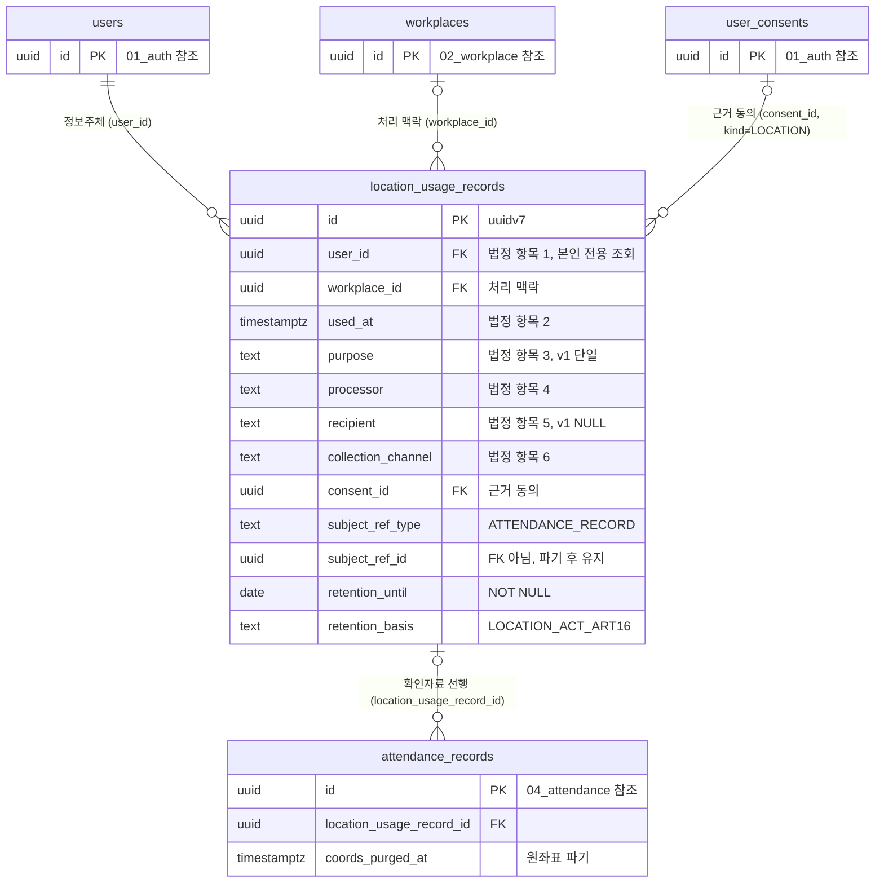

# 16_privacy — 위치정보

> **대상**: insadesk — 개인정보·위치정보 도메인 1테이블(location_usage_records) · **신설**
> **작성일**: 2026-08-03
> **개정일**: 2026-08-08 — DB 커버리지 감사 반영 — 위치정보 동의 게이트의 2차 방어(guard_location_consent_required) 등재 · 확인자료 선행 기록의 조건부 CHECK 계약 등재 · consent_id의 kind 재검증 · subject_ref_type CHECK 신설 · 필수 동의 철회 차단의 강제 위치 명시 · 파기 미실행 감지 축 등재
> **개정일**: 2026-08-08 — 원좌표 파기 시점을 근태 마감 확정으로 확정하고 실행 주체를 마감 트랜잭션 후속 처리로 명시(전용 배치 없음) · 파기 실행이 사유 필수 액션임을 등재
> **개정일**: 2026-08-03 — 원좌표 파기 대상을 실제 6컬럼명으로 정정(in_lat · in_lng · out_lat · out_lng · in_accuracy_m · out_accuracy_m)
> **원천**: docs_ref2/schema_p0.md 테이블 — privacy(1 · 신설) · docs_ref2/requirements_p0.md REQ-PRV-04·05(위치정보법 §16②)

**확인자료 행에 좌표를 두지 않는다.** 원좌표는 목적 달성 시 파기하고 확인자료는 법정 보존기간까지 유지해야 하므로, 같은 행에 두면 파기가 물리적으로 불가능해진다.

**기록은 부수 처리가 아니라 위치정보 처리의 필수 선행 단계다.** 서버는 확인자료 INSERT가 성공한 뒤에만 attendance_records에 좌표를 기록하며, 기록에 실패하면 해당 위치정보 처리를 중단한다.

동의 자체는 계정 도메인의 user_consents(kind = LOCATION)가 담는다([01_auth.md](./01_auth.md)). 본 도메인은 **이용·제공 사실의 확인자료**만 담는다.

---

## 테이블 목록

| # | 테이블 | 보관 내용 | PK 타입 |
|---|--------|----------|---------|
| 56 | location_usage_records | 위치정보 이용·제공 사실 확인자료 — 법정 6항목·근거 동의·보존 | uuid(uuidv7) |

legacy에 대응 테이블이 없는 **신설**이다.

---

## 테이블 명세

### 56. location_usage_records — 위치정보 이용·제공 사실 확인자료 (신설)

기능ID **PRV-01** · 요구사항 REQ-PRV-04·05(위치정보법 §16②).

| 컬럼명 | 타입 | NULL | 키 | 설명 |
|--------|------|:--:|----|------|
| id | uuid | N | PK | 식별자. **uuidv7()** — 고volume append |
| user_id | uuid | N | FK → users.id | **정보주체** |
| workplace_id | uuid | Y | FK | 처리 맥락 |
| used_at | timestamptz | N | | **이용·제공 일시**(법정 항목 ②) |
| purpose | text | N | | **이용·제공 목적**(③). CHECK IN ('COMMUTE_GEOFENCE_VERIFICATION') — v1 단일 목적 |
| processor | text | N | | **이용·제공 주체**(④). DEFAULT 'insadesk' |
| recipient | text | Y | | **제공받은 자**(⑤). 없으면 NULL — **v1은 제3자 제공이 없다** |
| collection_channel | text | N | | **수집 경로**(⑥). CHECK IN ('MOBILE_APP_GPS') |
| consent_id | uuid | Y | FK → user_consents.id | 근거 동의. **kind = 'LOCATION'이고 revoked_at IS NULL인 행이어야 하며 guard_location_usage_consent()가 재검증한다** |
| subject_ref_type | text | Y | | **CHECK IN ('ATTENDANCE_RECORD')** — v1 단일 값 |
| subject_ref_id | uuid | Y | | attendance_records.id — **원좌표 파기 후에도 참조는 유지한다** |
| retention_until | date | N | | 법정 보존 만료일. NOT NULL이다 |
| retention_basis | text | N | | 'LOCATION_ACT_ART16'. NOT NULL이다 |
| created_at | timestamptz | N | | DEFAULT now() |

- **14컬럼이다.** updated_at을 갖지 않는다 — append-only다.
- 제약: PK(id) · CHECK purpose 1값 · CHECK collection_channel 1값 · **CHECK subject_ref_type 1값** · FK user_id · FK workplace_id · FK consent_id.
- 인덱스: location_usage_records_pkey · **(user_id, used_at DESC)** — 정보주체 본인 조회 경로(기간 필터·페이지네이션 · REQ-PRV-05) · (workplace_id, used_at DESC) · (retention_until).
- 트리거: prevent_mutation() · **guard_location_usage_consent()**(신설) — consent_id가 같은 user_id의 kind = 'LOCATION' 동의이고 기록 시점에 철회되지 않았는지 INSERT 시 재검증한다.
- **subject_ref_type에 CHECK를 두는 것이 정정이다**(2026-08-08 감사 발견 역방향 점검). purpose·collection_channel이 v1 단일 값을 CHECK로 고정하는데 이 컬럼만 자유 문자열이라 값 규율이 비대칭이었다.
- **consent_id의 종류 재검증이 신설이다**(감사 발견 20). FK는 동의 행의 존재만 보므로 다른 kind의 동의를 근거로 넣어도 통과하고, 그 상태는 위치정보법 §18의 별도 동의를 받았다는 증거가 되지 못한다.
- **subject_ref_id는 FK가 아니다** — 원좌표가 파기되고 근태 원본이 정리돼도 확인자료의 참조 문자열은 남아야 하므로 참조 무결성으로 묶지 않는다.

#### 법정 6항목 매핑

위치정보법 §16②이 요구하는 항목을 컬럼으로 고정한다.

| 법정 항목 | 컬럼 |
|----------|------|
| ① 정보주체 | user_id |
| ② 이용·제공 일시 | used_at |
| ③ 이용·제공 목적 | purpose |
| ④ 이용·제공 주체 | processor |
| ⑤ 제공받은 자 | recipient(v1은 NULL) |
| ⑥ 수집 경로 | collection_channel |

검산: 주체 축 2(① ④) + 시각 축 1(②) + 목적·경로 축 2(③ ⑥) + 제공 축 1(⑤) = **6항목**.

- **jsonb 한 덩어리가 아니라 명시 컬럼으로 두는 이유는 법정 요구 항목이기 때문이다.** 스키마 검증이 없으면 필드 누락이 조용히 통과하고, 그 상태가 감사에서 드러난다.
- v1은 목적과 수집 경로가 각각 단일 값이라 CHECK가 1값이다 — 값이 늘면 CHECK를 넓히되 과거 행의 값은 그대로 유지된다.

#### 인가 — 정보주체 본인 전용

```
SELECT USING:  user_id = (select current_user_id())
```

- **관리자·사업장 관리자에게 열지 않는다.** 확인자료는 정보주체가 자기 위치정보 처리 내역을 확인하기 위한 자료이며, 사업주가 직원의 위치 이용 이력을 조회할 근거가 없다.
- INSERT는 서버 전용(체크인 트랜잭션의 선행 단계)이고 UPDATE·DELETE는 prevent_mutation()이 차단한다 — **사용자·관리자 조작으로 삭제·수정할 수 없다.**
- **정책이 여는 것은 조회뿐이고 기록의 성립 조건은 트리거가 본다** — guard_location_usage_consent()가 근거 동의를, guard_location_consent_required()가 그 뒤의 좌표 기록을 각각 막는다.
- 서버 감사 경로만 예외로 읽는다.

#### 보존정책 분리

| 대상 | 정책 | 물리 컬럼 |
|------|------|----------|
| 위치정보 **원좌표** | **목적 달성 시 파기** — 목적 달성 시점은 **해당 귀속월 근태 마감(LOCKED) 확정 시점**이다(REQ-PRV-05) | attendance_records.coords_purged_at |
| 위치정보 **확인자료** | 법정 보존기간까지 유지 | location_usage_records.retention_until(NOT NULL) |

- **파기 실행은 근태 마감 확정 트랜잭션의 자동 후속 처리다** — v1에 전용 정기작업을 두지 않는다(정기작업 8건 불변). 실행은 attendance_records의 in_lat · in_lng · out_lat · out_lng · in_accuracy_m · out_accuracy_m 6컬럼을 NULL로 만들고 coords_purged_at을 세팅하되 **본 테이블은 건드리지 않는다.**
- 파기 실행은 audit_logs에 남기며 **사유 필수 액션**이다(action 코드 attendance_record.purge_coords — [15_system.md](./15_system.md)).
- **미실행을 감지하는 축은 이미 있다**(2026-08-08 감사 발견 21). attendance_records의 부분 (work_date) WHERE coords_purged_at IS NULL AND (in_lat IS NOT NULL OR out_lat IS NOT NULL) 인덱스가 잔여 좌표를 좁혀 주므로, **마감된 급여월에 잔여 행이 0인지를 운영 점검 항목으로 둔다** — CHECK는 파기했다고 표시한 행의 완결성만 보고 파기하지 않은 상태는 보지 않는다.
- 자동 강제를 트리거로 두지 않는 이유는 실행 주체가 마감 트랜잭션이기 때문이다 — 같은 트랜잭션 안에서 부수 처리를 트리거가 다시 검사하면 실행 순서가 스키마 제약이 된다.
- **동의 철회(user_consents.revoked_at) 시 이후 GPS 체크인은 차단되지만 이미 수집된 확인자료는 법정 보존기간까지 유지한다.** 철회가 과거 처리 사실의 기록을 지우지 않는다.

---

## RLS 정책 — 도메인 요약

정책 표현식 전수의 정본은 [08_rls_policies.md](./08_rls_policies.md)다.

| 테이블 | SELECT | INSERT | UPDATE | DELETE |
|--------|--------|--------|--------|--------|
| location_usage_records | **본인(user_id = current_user_id())** + 서버 감사 | 서버 전용(체크인 선행 단계) | — | — |

**관리자 SELECT 정책이 없는 것이 설계다** — 사업장 관리자도 시스템 관리자도 정책 대상이 아니다.

---

## ERD



---

## 관계

| 관계 | cardinality | ON DELETE | 의미 |
|------|:-----------:|:---------:|------|
| users → location_usage_records | 1 : N | RESTRICT | 정보주체. 확인자료는 계정 정리와 무관하게 보존기간까지 남는다 |
| workplaces → location_usage_records | 0..1 : N | RESTRICT | 처리 맥락 |
| user_consents → location_usage_records (consent_id) | 0..1 : N | RESTRICT | 근거 동의. 철회 후에도 참조는 유지된다 |
| location_usage_records → attendance_records | 0..1 : N | RESTRICT | **확인자료가 선행이고 근태 원본이 후행이다** |

---

## 특이사항

**좌표와 확인자료를 같은 행에 두지 않는 것이 이 테이블의 존재 이유다.** 두 데이터의 보존 정책이 정반대이기 때문이다.

- 원좌표는 목적 달성 시 파기 대상이고 확인자료는 법정 보존 대상이다.
- 같은 행에 두면 파기하려면 행을 지워야 하고, 보존하려면 좌표를 남겨야 한다 — 둘 중 하나는 반드시 위반이 된다.
- 컬럼만 NULL로 만드는 방식은 attendance_records 안에서 이미 쓰고 있다. 확인자료를 별도 테이블로 뺀 것은 **파기 실행이 확인자료를 실수로 건드릴 물리적 경로 자체를 없애기 위해서다.**

**기록이 선행이지 후행이 아니다.** 체크인 트랜잭션의 순서는 ① 확인자료 INSERT → ② 좌표 기록이며, ①이 실패하면 ②를 하지 않는다.

- 반대 순서면 좌표를 처리한 뒤 기록에 실패하는 경우가 생기고, 그것은 기록 없는 위치정보 처리다.
- attendance_records.location_usage_record_id가 그 선행 관계를 참조로 고정하되, **nullable FK는 존재를 강제하지 못한다**(2026-08-08 감사 발견 14). MANUAL·IMPORT 근태에는 위치 처리가 없어 NULL이 정상이므로, 강제는 **조건부 CHECK**여야 한다.

| 계약 | 표현 |
|------|------|
| GPS 소스에는 확인자료가 반드시 선행한다 | **CHECK source <> 'GPS' OR location_usage_record_id IS NOT NULL** |
| 좌표가 있으면 확인자료가 있다 | 위 CHECK가 함께 커버한다 — GPS가 아닌 경로는 좌표를 싣지 않는다 |

- 이 CHECK의 물리 위치는 attendance_records이며 등재 정본은 [04_attendance.md](./04_attendance.md)와 [07_constraints_integrity.md](./07_constraints_integrity.md)다. 본 절은 위치정보 처리 계약의 근거를 고정한다.

**동의 게이트는 서비스와 트리거 두 층이 함께 막는다**(감사 발견 13). 체크인 INSERT 정책은 본인·멤버십·사업장 쓰기 가능만 보고 동의 유무를 보지 않으므로, **guard_location_consent_required()**가 attendance_records INSERT 시 kind = 'LOCATION'이고 revoked_at IS NULL인 동의를 재검증한다 → privacy.location_consent_required/403.

- 동의 없는 위치 처리는 그 자체가 위치정보법 위반이므로 서비스 단독 강제로 두지 않는다.
- **철회 이후의 체크인도 같은 조건에서 막힌다** — 가드가 보는 것은 동의 이력의 존재가 아니라 **철회되지 않은 동의의 존재**다.

**필수 동의는 철회 대상이 아니다.** 철회를 여는 조건은 kind = 'LOCATION' 하나이며 그것을 강제하는 곳은 user_consents의 guard_consent_mutation()이다([01_auth.md](./01_auth.md)) — 필수 2종(TERMS · PRIVACY)의 철회는 탈퇴 경로가 담당한다(REQ-PRV-03).

**정보주체 본인 조회 경로가 인덱스로 보장된다.** REQ-PRV-05가 기간 필터·페이지네이션 조회를 요구하므로 (user_id, used_at DESC) 인덱스가 그 축이다.

**v1은 제3자 제공이 없다.** recipient가 항상 NULL이며, 제공이 생기면 별도 동의와 고지가 선행해야 하므로 컬럼만 두고 값을 만들지 않는다.

**위치기반서비스사업 신고 등 사업자 의무는 데이터 모델의 대상이 아니다** — 본 테이블은 개별 처리 사실의 확인자료만 담는다.

---

## 관련 문서

- 폴더 정본·접근 모델 → [README.md](./README.md)
- 전역 ERD·관계 요약 → [erd.md](./erd.md)
- 제약·CHECK 전수 → [07_constraints_integrity.md](./07_constraints_integrity.md)
- RLS 정책 전수(정보주체 본인 전용) → [08_rls_policies.md](./08_rls_policies.md)
- 함수·트리거 전수(prevent_mutation) → [09_functions_triggers.md](./09_functions_triggers.md)
- 마이그레이션 배치(V0110__privacy.sql) → [10_migrations_seed.md](./10_migrations_seed.md)
- 위치정보 동의(kind = LOCATION) → [01_auth.md](./01_auth.md)
- 근태 원본·원좌표 파기 → [04_attendance.md](./04_attendance.md)
- 기능 명세 → [../02_features/13_privacy.md](../02_features/13_privacy.md)
- 요구사항 → [../03_requirements/14_privacy.md](../03_requirements/14_privacy.md)
- API 표면 → [../06_api/15_privacy.md](../06_api/15_privacy.md)
