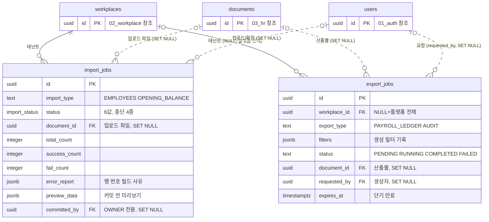

# 17_infra — 임포트·내보내기·배치 실행 이력·멱등 기록

> **대상**: insadesk — 인프라 도메인 4테이블(import_jobs · export_jobs · scheduled_job_runs · idempotency_records)
> **작성일**: 2026-08-03
> **개정일**: 2026-09-16 — 인용 정리 — **멱등 필수 표면 수("10표면")를 네 자리에서 걷고 정본 링크로 바꾼다** — 근태 · 휴가 일괄 승인·반려 4표면이 더해져 14가 되며 네 자리가 한꺼번에 틀렸다. 값은 [../06_api/01_conventions.md](../06_api/01_conventions.md)가 갖는다. 테이블 명세 · 제약은 움직이지 않는다
> **개정일**: 2026-09-09 — export_jobs 에러 규격에 **export.forbidden의 v1 미발생을 등재**한다(정본 [../06_api/14_system.md](../06_api/14_system.md)가 2026-09-07에 근거까지 적어 둔 것을 이 미러가 따라오지 못했다). 함께 **export_type의 PAYROLL_LEDGER를 쓰는 경로가 없음을 미결로 등재**한다 — **임금대장은 이 테이블이 아니라 documents로 등재**되므로 이 표의 네 에러 중 어느 것도 임금대장 경로에서 발생하지 않는다. **테이블 수 · 컬럼 · 제약 · 인덱스는 전건 불변**
> **개정일**: 2026-09-07 — **V0713** 적용 반영 — idempotency_records의 응답 보관 축 정정. response_body **jsonb → text**(재생은 바이트가 같아야 하는데 jsonb는 정규화한다 · 빈 본문을 담지 못한다) · **response_content_type 신설**로 10 → **11컬럼**. **테이블 61 · 정책 172 · PK 61 · CHECK 3항은 불변**이다(열 타입 변경과 열 1종 신설)
> **개정일**: 2026-09-07 — **idempotency_records 신설**(V0711) — 인프라 3테이블 → **4테이블** · 업무 테이블 60 → **61**. 멱등키 계약 넷(같은 키·같은 본문의 응답 재생 · 같은 키·다른 본문의 거부 · 24시간 보존 · 실패 미기록)을 담을 자리가 스키마에 없었다 — 도메인 4테이블의 idempotency_key 열은 각 도메인의 자연 중복 방지이고 요청 지문도 응답도 보존 기준도 담지 못하며, 멱등 필수 10표면 중 **여섯**은 그 열조차 없다. 정책 3종 신설로 RLS 정책 169 → **172** · 부분 UNIQUE 27 → **28** · PK 60 → **61**. **DELETE 정책 4는 불변**이며 그것이 부분 UNIQUE가 DISCARDED를 빼는 이유다
> **개정일**: 2026-09-10 — scheduled_job_runs 의 **쓰기 유발 경로가 둘**임을 등재한다 — 시각 트리거와 **담당자의 명시 재실행**([../06_api/14_system.md](../06_api/14_system.md) **#34**)이다. **접근 요약·정책·컬럼·제약은 전건 불변**이다 — 재실행도 서버 전용 컨텍스트를 지나 같은 정책으로 쓰며, 요청 경로가 그 컨텍스트를 켜는 명시적 진입점을 지날 뿐이다. **dead letter 재개의 조작 주체가 문장으로만 있고 표면이 없던 자리**가 닫힌다
> **개정일**: 2026-08-20 — scheduled_job_runs 접근 요약의 SELECT 축에 서버(시스템 컨텍스트) 결합 — 배치가 자기 실행 행을 닫기 위한 최소 개방(정본 [08_rls_policies.md](./08_rls_policies.md) #167 · 보정 V0701)
> **개정일**: 2026-08-08 — **scheduled_job_runs 신설**(테이블 **60** · 정기작업 8건의 실행 이력·마지막 성공 시각·dead letter)
> **개정일**: 2026-08-08 — DB 커버리지 감사 반영 — 임포트 한도 재검증의 판정 축 정정(활성 멤버 → **활성 직원**)과 DB 백스톱 부재 명시 · 명세서 자동 생성 제외의 강제 위치 명시
> **원천**: docs_ref2/schema_p0.md 테이블 — infra(2) · docs_ref2/requirements_p0.md REQ-WRK-32~35 · REQ-SYS-11 · REQ-PAY-31

**데이터 온보딩과 리포트 내보내기가 이 도메인의 두 축이다.** 둘 다 비동기 작업 메타를 담고 실체 파일은 documents가 보유한다.

**임포트 적재분은 급여 계산·연차 산정의 기산 기준으로만 쓰고 명세서 자동 생성 대상에서 제외한다.** 개시잔액은 과거 사실의 이관이지 이 시스템이 계산한 결과가 아니다.

**기 사용 연차 적재 경로가 없으면 잔액이 0부터 시작해 연차 계산이 처음부터 틀린다.** leave_transactions(txn_type = 'ADJUST' · source = 'IMPORT')가 그 경로다.

---

## 테이블 목록

| # | 테이블 | 보관 내용 | PK 타입 |
|---|--------|----------|---------|
| 57 | import_jobs | 데이터 온보딩 임포트 — 검증·미리보기·커밋·오류 리포트 | uuid |
| 58 | export_jobs | 리포트·감사 내보내기 — 필터 조건·산출물·만료 | uuid |
| 60 | scheduled_job_runs | 정기작업 실행 이력 — 기준일·상태·건수·재시도·dead letter | uuid(uuidv7) |
| 61 | idempotency_records | 멱등 기록 — 요청 지문·최초 응답·상태. Idempotency-Key 필수 표면의 재시도 판정 | uuid |

---

## 테이블 명세

### 57. import_jobs — 데이터 온보딩 임포트

기능ID **WRK-16** · 요구사항 REQ-WRK-32·33·34·35.

| 컬럼명 | 타입 | NULL | 키 | 설명 |
|--------|------|:--:|----|------|
| id | uuid | N | PK | 식별자 |
| workplace_id | uuid | N | FK | 테넌트 스코프 |
| import_type | text | N | | CHECK IN ('EMPLOYEES','OPENING_BALANCE') |
| status | import_status | N | | UPLOADED → VALIDATED → {COMMITTED, PARTIALLY_COMMITTED, CANCELLED} · UPLOADED → FAILED |
| document_id | uuid | Y | FK → documents.id (**SET NULL**) | 업로드 파일 메타 |
| total_count | integer | N | | DEFAULT 0 |
| success_count | integer | N | | DEFAULT 0 |
| fail_count | integer | N | | DEFAULT 0 |
| error_report | jsonb | Y | | 행 번호·필드·사유(import.validation_failed/422) |
| preview_data | jsonb | Y | | VALIDATED 단계 미리보기(커밋 전) |
| committed_at | timestamptz | Y | | 확정 시각 |
| committed_by | uuid | Y | FK → users.id (**SET NULL**) | **확정은 OWNER 전용이다** |
| created_by | uuid | Y | FK → users.id (**SET NULL**) | 업로더 |
| created_at | timestamptz | N | | DEFAULT now() |
| updated_at | timestamptz | N | | DEFAULT now() + set_updated_at 트리거 |

- **15컬럼이다.**
- 제약: PK(id) · CHECK import_type 2값 · FK workplace_id · FK document_id SET NULL · FK committed_by SET NULL · FK created_by SET NULL.
- 인덱스: import_jobs_pkey · (workplace_id, created_at DESC) · (workplace_id, status).
- 트리거: guard_import_transition() · set_updated_at().
- **COMMITTED · PARTIALLY_COMMITTED · CANCELLED · FAILED는 종단이다** — 재시도는 새 작업이다. 종결 작업을 되돌리면 이미 적재된 행과 상태가 어긋난다.
- 확정은 audit_logs(reason 필수) 대상이다.
- **legacy의 PREVIEW·ROLLED_BACK 값을 폐기하고 requirements_p0 상태머신으로 교체했다** — 상태 집합이 요구사항과 다르면 화면·API가 표현할 수 없는 상태가 생긴다.

#### 적재 규칙

| 규칙 | 내용 |
|------|------|
| 표시 | 적재분은 source = 'IMPORT'로 표시한다 |
| 사용 범위 | **급여 계산·연차 산정의 기산 기준으로만** 쓴다 |
| 제외 | **명세서 자동 생성 대상에서 제외한다** |
| 기 사용 연차 | leave_transactions(txn_type = 'ADJUST' · source = 'IMPORT')로 적재한다 |
| 민감정보 | **임포트 즉시 암호화**한다 |
| 합계 검증 | source = 'IMPORT'인 payroll_runs는 check_payroll_result_balance 면제 |

- 개시잔액은 헤더만 가질 수 있으므로 합계 검증에서 면제한다([06_payroll.md](./06_payroll.md)).
- **제외 규칙의 강제 위치는 명세서 생성 트리거 조건이다** — payroll_runs.source = 'IMPORT'인 실행은 확정되어도 명세서 생성 작업을 등록하지 않는다. 합계 검증 면제는 트리거가 강제하지만 이 제외는 서버 판정이므로 한계 등재 대상이다. 강제되지 않으면 **계산 근거 없는 명세서가 법정 교부물로 나간다**.

#### 중복 검출 2축

| 축 | 판정 | 에러 |
|----|------|------|
| ① 파일 내 행간 중복 | blind index 비교 | import.duplicate_employee/409 |
| ② 기존 DB 중복 | 활성 직원·주민번호 blind index | hr.duplicate_active_employee/409 · hr.resident_no_duplicate/409 |

- **두 축을 분리해 검출하는 이유는 사용자가 고칠 대상이 다르기 때문이다** — ①은 파일을 고치고 ②는 기존 데이터를 확인해야 한다.
- 둘 다 복호화 없이 blind index로 판정한다([03_hr.md](./03_hr.md)).

#### 인원 한도 재검증의 판정 축

**임포트가 만드는 것은 employees이지 workplace_members가 아니다.** 확정 직전 재검증(REQ-WRK-35)의 판정 축을 활성 멤버 수로 잡으면 임포트로 아무리 많은 직원을 적재해도 수치가 늘지 않아 한도가 실효되지 않는다.

| 축 | 내용 |
|----|------|
| 판정 대상 | **활성 직원 수 + 커밋 예정 행 수**가 plan.max_staff_per_workplace를 넘는지 |
| 판정 시점 | 미리보기(경고)와 확정 직전(차단) **양쪽**. 미리보기 이후 초대 수락으로 인원이 찰 수 있다 |
| 초과 응답 | subscription.staff_limit_exceeded/402 |

- **DB 백스톱이 없다.** guard_member_cap()은 workplace_members에만 부착되고 active_member_count(wid)는 멤버십을 세므로 임포트 커밋 경로에서 발동하지 않는다 — 강제는 확정 트랜잭션의 서버 판정 단독이며, 어느 층도 맡지 않는 항목이 되지 않도록 한계 등재 대상이다.
- **멤버십과 직원 수가 갈리는 것은 정상이다** — 계정 없는 직원(임포트 적재분·초대 미수락자)이 존재하므로 두 수치는 같지 않다. 한도의 실질 대상은 인건비를 계산하는 직원이지 로그인 계정이 아니다.

### 58. export_jobs — 리포트·감사 내보내기

기능ID **SYS-07** · **PAY-09** · 요구사항 REQ-SYS-11 · REQ-PAY-31.

| 컬럼명 | 타입 | NULL | 키 | 설명 |
|--------|------|:--:|----|------|
| id | uuid | N | PK | 식별자 |
| workplace_id | uuid | Y | FK | NULL = 플랫폼 전체 내보내기 |
| export_type | text | N | | CHECK IN ('PAYROLL_LEDGER','AUDIT') |
| filters | jsonb | Y | | **급여대장 생성 시 필터 조건 기록**(REQ-PAY-31) |
| status | text | N | | CHECK IN ('PENDING','RUNNING','COMPLETED','FAILED') |
| document_id | uuid | Y | FK → documents.id (**SET NULL**) | 산출물 메타 |
| requested_by | uuid | Y | FK → users.id (**SET NULL**) | **생성자** |
| expires_at | timestamptz | Y | | 1회용 토큰·산출물 만료(단기) |
| created_at | timestamptz | N | | DEFAULT now() |
| updated_at | timestamptz | N | | DEFAULT now() + set_updated_at 트리거 |

- **10컬럼이다.**
- 제약: PK(id) · CHECK export_type 2값 · CHECK status 4값 · FK workplace_id · FK document_id SET NULL · FK requested_by SET NULL.
- 인덱스: export_jobs_pkey · (requested_by, created_at DESC) · (workplace_id, export_type, created_at DESC) · 부분 (expires_at) WHERE status = 'COMPLETED'.
- 트리거: set_updated_at().
- **내보내기 다운로드 이력 자체를 별도 audit_logs로 남긴다**(reason 필수) — 감사 자료를 누가 언제 내려받았는지가 다시 감사 대상이다.

#### 에러 규격

| 상황 | 에러 |
|------|------|
| 권한·필터 범위 위반 | export.forbidden/403 — **v1 발생 지점 없음**(아래) |
| 미완료 조회 | export.not_ready/409 |
| 토큰 만료 | export.expired/410 |
| 생성 실패 | export.failed/500 |

- 410(Gone)을 쓰는 이유는 만료가 **한때 존재했으나 이제 없음**을 뜻하기 때문이다 — 404와 구분한다.
- **export.forbidden은 v1에서 발생하지 않는다**(정본 [../06_api/14_system.md](../06_api/14_system.md)). **V0120의 주석은 이 등재보다 앞선 상태로 파일에 동결돼 있으므로 근거로 삼지 않는다** — 적용된 마이그레이션은 체크섬 때문에 고칠 수 없어 **주석이 적용 시점의 이해를 담은 채 남는다**([10_migrations_seed.md](./10_migrations_seed.md) 주석 절). **계약의 정본은 이 문서군이고 주석은 이력이다.** 이 코드가 가리키는 것은 **필터 범위 위반**인데 v1에는 audit:view 보유자의 조회 범위를 좁히는 축이 없다 — 권한 미충족은 system.permission_denied/403이다. **폐기하지 않고 미발생으로 두는 이유는 범위 축이 생기면 그때 쓸 자리이기 때문**이다.
- **export_type의 PAYROLL_LEDGER 값을 v1에서 쓰는 경로가 없다 — 미결이다**(2026-09-09 실측). **임금대장은 이 테이블을 거치지 않고 documents로 등재**되며([../06_api/08_payroll.md](../06_api/08_payroll.md) #20~#22 · 다운로드 토큰 만료도 payslip.download_token_expired다), 그래서 이 표의 네 에러 중 **어느 것도 임금대장 경로에서 발생하지 않는다.** CHECK 2값을 줄이는 것은 마이그레이션이라 여기서 고치지 않고 **값이 남는 이유를 등재**한다 — 대량 산출을 비동기로 돌릴 표면이 생기면 그때 쓸 자리다.

#### 급여대장 생성 메타를 겸한다

PAY-09 급여대장은 별도 테이블을 두지 않으므로 생성자·생성시각·필터 조건을 본 테이블이 기록한다.

- 법정 기재사항은 payroll_employee_results와 payroll_employee_result_items에 전부 존재하고, 보존은 payroll_runs.retention_until(마지막 기입일 + 3년)이 담당한다.
- filters가 "어느 범위를 뽑았는가"를 남기므로 같은 대장을 재생성해 대조할 수 있다.

### 60. scheduled_job_runs — 정기작업 실행 이력 (신설)

정기작업 **8건**(expireInvitations · autoUnsuspendAccounts · checkSubscriptionExpiry · rollupAttendanceDaily · accrueAndExpireLeave · recomputeEmployeeCountSnapshot · checkComplianceDeadlines · retryPayslipAndPush) · 요구사항 **REQ-NFR-16** · **REQ-TEC-09**.

**정기작업이 남겨야 할 것을 담을 자리가 어디에도 없었다.** batch_jobs는 job_type이 2값이고 workplace_id NOT NULL이라 플랫폼 배치를 담지 못한다.

| 컬럼명 | 타입 | NULL | 키 | 설명 |
|--------|------|:--:|----|------|
| id | uuid | N | PK | 식별자. **uuidv7()** — 실행 이력은 시간순 대량 삽입이다 |
| job_name | text | N | UQ* | 작업 이름. CHECK IN 정기작업 8종 |
| base_date | date | N | UQ* | **기준일 파라미터**(KST). 실행 시각이 아니라 이 값이 대상을 정한다 |
| status | text | N | UQ* | CHECK IN ('RUNNING','SUCCEEDED','FAILED','SKIPPED'). **SKIPPED = 분산락 미획득**이며 오류가 아니다 |
| started_at | timestamptz | N | | 시작 시각 |
| finished_at | timestamptz | Y | | 종료 시각. CHECK >= started_at |
| target_count | integer | Y | | 대상 수 |
| success_count | integer | Y | | 성공 수 |
| fail_count | integer | Y | | 실패 수 |
| attempt | integer | N | | 재시도 회차. DEFAULT 1 · CHECK >= 1 · **상한 5**(REQ-TEC-09) |
| next_retry_at | timestamptz | Y | | 지수 백오프 다음 시각(1 → 2 → 4 → 8 → 16분) |
| dead_letter_at | timestamptz | Y | | **재시도 상한 초과 시각.** 값이 있으면 **시각 트리거의** 재시도 대상에서 제외하고 재개는 담당자의 명시 조작이다([../06_api/14_system.md](../06_api/14_system.md) #34가 그 조작이며 이 열을 보지 않는다) |
| error_summary | text | Y | | 실패 사유 요약. **원문 예외·스택 트레이스·개인정보를 담지 않는다** |
| created_at | timestamptz | N | | DEFAULT now() |
| updated_at | timestamptz | N | | DEFAULT now() + set_updated_at 트리거 |

- **15컬럼이다.**
- 제약: PK(id) · CHECK job_name 8값 · CHECK status 4값 · CHECK attempt >= 1 · CHECK finished_at IS NULL OR finished_at >= started_at · **부분 UNIQUE (job_name, base_date) WHERE status IN ('RUNNING','SUCCEEDED')**.
- 인덱스: scheduled_job_runs_pkey · 부분 UQ · (job_name, started_at DESC) — **마지막 성공 시각 조회** · 부분 (next_retry_at) WHERE status = 'FAILED' AND dead_letter_at IS NULL — 재시도 대상.
- 트리거: set_updated_at().
- **workplace_id를 갖지 않는다** — 정기작업은 전 사업장을 순회하므로 특정 테넌트에 매이지 않는다. 사업장 스코프는 작업 내부의 명시 필터가 강제한다.
- **부분 UQ가 기준일 멱등의 물리적 근거다** — 같은 (작업, 기준일)의 성공 실행은 1건이며 진행 중 실행도 1건이다. 실패 행은 재시도 회차만큼 쌓인다.
- **"돌지 않음"과 "돌았으나 대상 0건"을 구분하는 것이 이 테이블의 존재 이유다**(REQ-NFR-16) — 전자는 행이 없고 후자는 status = SUCCEEDED이며 target_count = 0이다. 행이 없는 상태를 성공으로 오독하면 멈춘 배치가 드러나지 않는다.
- **dead letter는 조용한 성공 처리를 막는다** — 상한 초과분은 실패 상태를 유지한 채 관측 채널로 운영 통보하며, 알림 테이블은 수신자 사용자 축이라 운영자 집단을 담지 못한다(REQ-NTF-05).
- **행을 만드는 경로가 둘이다** — 시각 트리거와 운영 재실행([../06_api/14_system.md](../06_api/14_system.md) #34)이다. **정책과 컬럼은 갈리지 않는다**: 둘 다 서버 전용 컨텍스트 안에서 쓰며 재실행이 남기는 것도 같은 모양의 행이다. **행에 그 구분을 담는 열을 두지 않는다** — 누가 왜 다시 돌렸는지는 audit_logs(scheduled_job.rerun)의 축이고, 이 표의 축은 무엇이 언제 어떤 결과로 돌았는가다.
- **DELETE가 없다.** 오래된 실행 이력의 정리는 v1에 두지 않으며, 도입 시 보존 기간을 정해 파기 배치의 대상으로 등재한다.

### 61. idempotency_records — 멱등 기록 (신설)

멱등키 계약(**Idempotency-Key 필수 표면** — 목록과 개수의 정본은 [../06_api/01_conventions.md](../06_api/01_conventions.md) 멱등 절이며 여기서 세지 않는다).

**계약이 요구하는 넷을 담을 자리가 스키마에 없었다** — ① 같은 키·같은 본문은 최초 응답을 그대로 재생한다 ② 같은 키·다른 본문은 거부한다 ③ 기록은 24시간 보존한다 ④ 실패 응답은 기록하지 않는다.

| 컬럼명 | 타입 | NULL | 키 | 설명 |
|--------|------|:--:|----|------|
| id | uuid | N | PK | 식별자 |
| scope_type | text | N | UQ* | CHECK IN ('WORKPLACE','USER'). **스코프 축을 고르는 값이며 scope_id의 해석을 정한다** |
| scope_id | uuid | N | UQ* | 사업장 id 또는 사용자 id. **FK를 두지 않는다** — 가리키는 테이블이 scope_type에 따라 갈린다 |
| idempotency_key | text | N | UQ* | 클라이언트가 생성한 키. CHECK 길이 1~255 |
| fingerprint | text | N | | 요청 본문 해시. **②를 판정하는 유일한 축이다** |
| status | text | N | UQ* | CHECK IN ('STARTED','COMPLETED','DISCARDED') · DEFAULT 'STARTED' |
| response_status | integer | Y | | ①의 재생 대상. STARTED·DISCARDED에는 없다 |
| response_body | text | Y | | 최초 응답 본문 **원문**. **jsonb가 아니다** — 아래 절 |
| created_at | timestamptz | N | | DEFAULT now(). ③의 보존 기준 축이다 |
| completed_at | timestamptz | Y | | 완료 시각 |
| response_content_type | text | Y | | 최초 응답의 Content-Type. 재생 시 그대로 다시 쓴다 |

- **11컬럼이다.**
- 제약: PK(id) · CHECK scope_type 2값 · CHECK idempotency_key 길이 1~255 · CHECK status 3값. **FK가 없다.**
- 인덱스: idempotency_records_pkey · **부분 UNIQUE (scope_type, scope_id, idempotency_key) WHERE status <> 'DISCARDED'** · (created_at) — 보존 기준 조회 축.
- 트리거: 없음. **updated_at 컬럼을 두지 않으므로 set_updated_at도 붙지 않는다** — 상태 전이 시각은 completed_at이 담고, 기록의 수명은 created_at 하나로 판정한다.
- **24시간이 지난 기록은 애플리케이션이 없는 것으로 본다** — 그보다 오래된 재시도는 새 요청이다.
- **재생은 상태 · Content-Type · 본문 셋이 모두 첫 응답과 같아야 성립한다.** 세 열이 함께 있는 이유다.

#### 축이 둘인 이유

**사업장 스코프가 없는 표면이 있다.** 멱등 필수 표면 중 감사 로그 내보내기는 플랫폼 운영 표면이라 workplace_id를 갖지 않는다. 축을 하나로 뭉치면 그 표면이 키를 걸 자리를 잃는다.

| scope_type | scope_id | 대상 |
|------------|----------|------|
| WORKPLACE | 사업장 id | 임포트 확정 · 근태 마감 · 급여 확정·정정 · 명세서 일괄 발행·정정 · 신고자료 2 · 상시근로자 산정 **9표면** |
| USER | 사용자 id | 감사 로그 내보내기 **1표면** |

#### 응답 본문을 jsonb가 아니라 text로 담는다 (V0713 정정)

**jsonb는 정규화한다** — 키 순서 · 공백 · 중복 키 · 수치 표기가 저장 시점에 바뀐다. 계약이 요구하는 것은 "최초 응답을 **그대로** 재생한다"인데 정규화된 본문은 최초 응답과 바이트가 같지 않아, 클라이언트가 두 응답을 비교하면 다르게 보인다.

- **빈 본문도 담지 못한다** — 빈 문자열은 유효한 JSON이 아니라 삽입 자체가 실패한다. 응답 버퍼가 없는 경로(상태만 기록하는 경우)가 그 자리다.
- **조회 편의를 위해 jsonb를 고른 것이 원인이다.** 이 테이블은 조회 대상이 아니라 **재생 대상**이라 질의 가능성이 이득이 아니고 정규화라는 대가만 남는다.
- Content-Type을 담을 자리도 없었다 — 같은 보정이 response_content_type을 신설한다.

#### 부분 UNIQUE가 DISCARDED를 빼는 이유

④에 따라 실패한 요청은 기록을 남기지 않아야 하는데, **물리 삭제 표면을 만들지 않는다는 규약**이 있으므로 상태 전이로 둔다. 그러면 같은 키의 재시도가 유니크 제약에 막힌다 — 부분 유니크가 그 둘을 동시에 만족시킨다. **기록은 남고 재시도는 열린다.**

- **DELETE 정책을 두지 않는 근거가 같다.** 삭제 없이 재시도가 열리므로 삭제 표면 자체가 필요 없다. **DELETE 정책 4는 이 테이블로 늘어나지 않는다.**
- **시스템 컨텍스트 축도 두지 않는다.** 멱등 표면은 전부 사용자 요청 경로이고 정기작업이 부르는 자리가 없다 — **배치가 읽지 않는 것은 배치에 열지 않는다.**

---

## RLS 정책 — 도메인 요약

정책 표현식 전수의 정본은 [08_rls_policies.md](./08_rls_policies.md)다.

| 테이블 | SELECT | INSERT | UPDATE | DELETE |
|--------|--------|--------|--------|--------|
| import_jobs | 사업장 관리자 | OWNER·MANAGER | OWNER·MANAGER(**VALIDATED→COMMITTED는 OWNER 전용**) | — |
| export_jobs | 요청자 + 사업장 관리자(PAYROLL_LEDGER) + 시스템 관리자(audit:view) | 서버 | 서버 | — |
| scheduled_job_runs | 시스템 관리자(audit:view) + 서버 | 서버 | 서버 | — |
| idempotency_records | 사업장 멤버(WORKPLACE 축) + 본인(USER 축) | 같음 | 같음 | — |

- **scheduled_job_runs에 사업장 축을 두지 않는 것이 설계다** — 운영 감사 자료이며 사업장 사용자에게 열 근거가 없다. 사용자의 업무가 멈추는 사건은 이 원장이 아니라 인앱 필수 알림이 전달한다.
- **idempotency_records의 세 정책은 같은 표현식을 공유한다** — WORKPLACE 축은 사업장 멤버, USER 축은 본인이며 UPDATE는 USING과 WITH CHECK 양쪽에 같은 조건을 둔다. 상태를 STARTED에서 COMPLETED·DISCARDED로 옮기는 것이 UPDATE의 전부라 축이 갈릴 이유가 없다.

---

## ERD

---

## 관계

| 관계 | cardinality | ON DELETE | 의미 |
|------|:-----------:|:---------:|------|
| (없음) → scheduled_job_runs | — | — | **FK를 갖지 않는다.** 플랫폼 운영 원장이며 workplace_id도 행위자 FK도 없다 — 실행 주체가 사용자가 아니라 스케줄러다 |
| (없음) → idempotency_records | — | — | **FK를 갖지 않는다.** scope_id가 가리키는 테이블이 scope_type에 따라 갈리므로 참조 무결성을 열 하나로 표현할 수 없다 — 대신 RLS가 두 축을 각각 평가한다 |
| workplaces → import_jobs | 1 : N | RESTRICT | 테넌트 스코프 |
| workplaces → export_jobs | 0..1 : N | RESTRICT | NULL이면 플랫폼 전체 내보내기다 |
| documents → import_jobs (document_id) · export_jobs (document_id) | 0..1 : N | **SET NULL** | 파일 메타. 약한 참조라 정리 후에도 작업 이력이 남는다 |
| users → import_jobs (created_by · committed_by) · export_jobs (requested_by) | 0..1 : N | **SET NULL** | 행위자 |

---

## 특이사항

**export_jobs는 폐기했다가 되돌린 테이블이다.** 대시보드 계열로 보고 폐기 후보에 올렸으나 REQ-SYS-11의 감사 로그 CSV 내보내기와 export.* 에러코드 4종이 카탈로그에 존재해 채택으로 되돌렸다.

- 판단 기준은 "요구사항이 요구하는가"였다 — 요구사항이 정본이다.

**payroll_monthly_stats를 만들지 않는다.** DSH 대시보드 4종이 전부 v1 제외이므로 통계는 payroll_employee_results 직접 집계로 대체한다.

- 도입 시 RLS 일반 테이블로 신설한다 — **Materialized View는 RLS가 적용되지 않아 쓰지 않는다.**

**임포트 확정만 OWNER 전용이다.** 업로드·검증은 MANAGER도 할 수 있으나 VALIDATED → COMMITTED 전이는 OWNER만 한다.

- 근거: 커밋은 직원 인사 레코드와 개시잔액을 실제로 만드는 비가역 조작이며, 잘못 커밋하면 새 작업으로 되돌릴 수 없다(종단 상태).
- guard_import_transition()이 표에 없는 전이를 거부하고, audit_logs가 reason과 함께 기록한다.

**개시잔액 임포트가 급여 계산의 예외를 만든다.** source = 'IMPORT'인 payroll_runs는 check_payroll_result_balance()에서 면제되는데, 개시잔액은 헤더 금액만 있고 항목 라인이 없을 수 있기 때문이다.

- 그 대신 명세서 자동 생성 대상에서 제외해 계산 근거 없는 명세서가 교부되는 것을 막는다.

**민감정보는 임포트 즉시 암호화한다.** 평문 상태로 임시 저장하는 단계를 두지 않는다 — preview_data에도 마스킹값만 담는다([03_hr.md](./03_hr.md)).

**멱등 기록에 전용 테이블을 두기까지 세 대안을 버렸다.** 버린 근거를 남긴다 — 같은 자리를 다시 논하지 않기 위해서다.

| 대안 | 버린 근거 |
|------|----------|
| Redis 보관 | 부수효과를 만든 트랜잭션과 **다른 저장소**라 커밋된 부수효과에 기록이 빠지는 창이 생기고, 그 창의 재시도가 부수효과를 한 번 더 일으킨다 |
| 도메인 행 재활용 | 지문과 응답을 담을 열이 없고, 멱등 필수 표면의 **대부분**은 행 자체가 없다 — 예 임포트 확정 · 근태 마감 · 상시근로자 산정 · 감사 내보내기 · **일괄 승인·반려**(기존 행 여럿을 전이시킬 뿐 요청 단위 행이 생기지 않는다) |
| 표면별 위임 | 같은 계약이 **열 곳에 복제된다.** 한 곳이 어긋나도 드러날 자리가 없다 |

- 기존 멱등키 열 4종(payroll_runs · batch_jobs · compliance_tasks · payslips)은 **각 도메인의 자연 중복 방지**이며 폐기하지 않는다. 두 축은 대상이 다르다 — 열은 도메인 행의 중복을, 이 테이블은 요청의 재시도를 막는다.

**멱등 기록을 업무 스키마 밖에 두지 않는 이유는 격리다.** 적용 이력 테이블은 업무 스키마 밖(ops)에 두지만 이 테이블은 public에 둔다 — response_body가 업무 데이터이고 scope_id가 사업장 활동 시각을 드러내므로, RLS를 걸 축이 없는 스키마에 두면 앱 롤이 전량을 읽는다.

---

## 관련 문서

- 폴더 정본·접근 모델 → [README.md](./README.md)
- 전역 ERD·관계 요약 → [erd.md](./erd.md)
- 제약·enum 전수 → [07_constraints_integrity.md](./07_constraints_integrity.md)
- RLS 정책 전수 → [08_rls_policies.md](./08_rls_policies.md)
- 함수·트리거 전수(guard_import_transition) → [09_functions_triggers.md](./09_functions_triggers.md)
- 마이그레이션 배치(V0120__infra.sql) → [10_migrations_seed.md](./10_migrations_seed.md)
- 직원 인사 레코드·민감정보 → [03_hr.md](./03_hr.md)
- 연차 원장 적재 → [05_leave.md](./05_leave.md)
- 급여대장 근거 → [06_payroll.md](./06_payroll.md)
- 감사 로그 → [15_system.md](./15_system.md)
- 멱등키 계약 정본 → [../06_api/01_conventions.md](../06_api/01_conventions.md)
- 기능 명세 → [../02_features/02_workplace.md](../02_features/02_workplace.md) · [../02_features/12_system.md](../02_features/12_system.md)
- 요구사항 → [../03_requirements/03_workplace.md](../03_requirements/03_workplace.md) · [../03_requirements/13_system.md](../03_requirements/13_system.md)
- API 표면 → [../06_api/04_workplace.md](../06_api/04_workplace.md) · [../06_api/14_system.md](../06_api/14_system.md)
