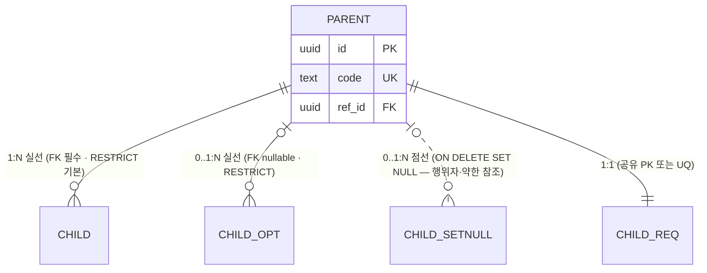
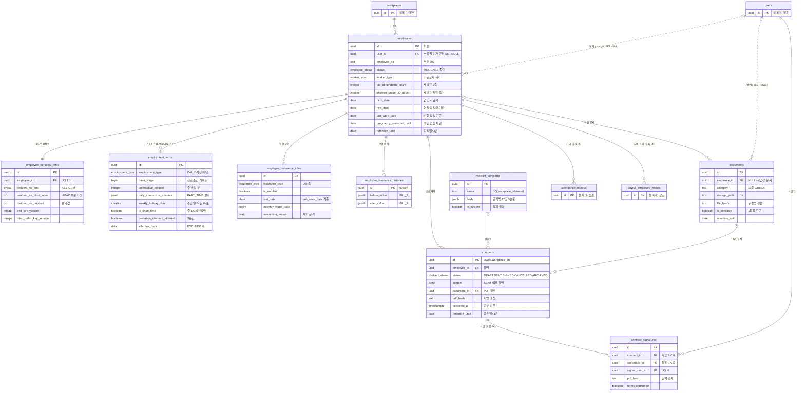

# erd — 전역 개체·관계 다이어그램

> **대상**: insadesk — 전체 데이터베이스 ERD(업무 테이블 **61종**) · 표기 규약 · 관계 요약
> **작성일**: 2026-08-03
> **개정일**: 2026-09-10 — 인용 갱신 — payroll_runs.rounding_policy_values 주석의 반올림 키 수를 **9키 → 전량 복사**로 바꾼다. **종수를 다이어그램 주석이 세지 않게 하는 것이 요지**다 — 2026-09-09 의 9 → 10 개정도 2026-09-10 의 10 → **11종** 개정도 이 자리에 닿지 않았고, **종수를 박아 두면 키가 늘 때마다 조용히 틀린다.** 종수의 정본은 [../03_requirements/01_global_rules.md](../03_requirements/01_global_rules.md) §1.1 이다. **테이블 61종 · 블록 구성 · 관계는 전건 불변**
> **개정일**: 2026-09-07 — **V0711** 적용 반영 — 테이블 60 → **61종**(idempotency_records 블록 ⑤) · 블록 ⑤ 12 → **13테이블** · workplace_id 미보유 16 → **17**(부류 6 → **7** — 다형 스코프 신설). 보유 44 · NOT NULL 39 · nullable 5는 불변이다. **관계선을 갖지 않는 두 번째 테이블이다** — scope_id가 가리키는 테이블이 scope_type에 따라 갈려 FK로 표현되지 않는다
> **개정일**: 2026-08-08 — DB 커버리지 감사 통합 반영 — 테이블 58 → **60**(employee_protected_periods 블록 ③ · scheduled_job_runs 블록 ⑤) · workplace_id 미보유 15 → **16** · SET NULL 46 → **48** · 특수 정책에 재산정·재계산 교체 DELETE 3종 등재 · 소유권 척추 14 → **15지점**
> **개정일**: 2026-08-08 — 자녀 수 컬럼 주석을 세액표 조회 축 → **차감 축**으로 정정(2축 조회 확정 반영)
> **개정일**: 2026-08-08 — audit_logs 주석의 사유 필수 액션 13 → **15종**(정본 15_system.md 확정 반영)
> **개정일**: 2026-08-08 — 요금제 버전 관리 재설계 반영(plans PK uuid · code+version 유일 · subscriptions.plan_id) · severance_plan_type 값 표기를 정본 STATUTORY_SEVERANCE로 정정 · contracts 상태 주석에 CANCELLED 보완
> **개정일**: 2026-08-03 — M5 SET NULL 약참조 44 → **46**(행위자 34 → **36**)
> **개정일**: 2026-08-03 — workplace_id 스코프 집계 정정(미보유 12 → **15** · 보유 43 = NOT NULL 38 + nullable 5) · attendance_records reviewed_by 반영 · employment_terms weekly_holiday_dow 반영
> **원천**: docs_ref2/schema_p0.md — 전 테이블 명세의 키·FK·ON DELETE 서술 · 본 폴더 도메인 파일(01~06 · 11~17)

전체 스키마의 개체·관계를 담은 조감도다. 개별 테이블의 컬럼 전체 명세는 도메인 파일에 있고, **본 문서는 관계와 핵심 컬럼만 싣는다.**

**테넌트 척추는 workplaces다.** 계정 도메인(users · profiles 계열)과 전역 마스터 5종(plans · statutory_rates · notification_types · terms_documents · income_tax_table_entries)을 뺀 모든 업무 테이블이 workplace_id NOT NULL로 이 행에 매달린다.

**소유권 척추는 employees.user_id다.** 명세서·급여 결과·근로계약의 본인 열람은 멤버십이 아니라 이 컬럼을 근원으로 판정하며(CMP-07), 고volume 조회 테이블은 조인을 피하려 user_id를 비정규화로 들고 있다 — 그 컬럼들은 **FK가 아니다.**

business_units만 workplaces 위에 놓이는 상위 그룹 축이고, location_usage_records만 근태 원본보다 **선행 생성**된다.

---

## 표기 규약 (범례)

- 엔티티명은 실제 테이블명(snake_case)이다. **스키마 접두가 필요한 경우 mermaid 제약상 점 대신 언더스코어로 표기한다**(예: auth.users → auth_users). 본 스키마는 전부 public이라 접두가 없다.
- 박스에는 PK·FK·UK와 핵심 비즈니스 컬럼만 싣는다. 전체 컬럼은 도메인 파일이 담는다.
- **실선** = 일반 FK(RESTRICT · CASCADE) / **점선** = ON DELETE SET NULL(행위자·약한 참조).
- 한 쌍 사이에 선이 둘 이상이면 참조 컬럼이 둘 이상이라는 뜻이다(예: users → workplaces는 created_by와 closed_by 2선).
- **복합 PK 테이블은 하나다** — employee_count_snapshot_days(snapshot_id, count_date).
- **비정규화 user_id는 관계선으로 그리지 않는다.** FK가 아니며, 그리면 계정과 업무 원장이 직접 묶인 것처럼 오독된다.
- 행위자 컬럼(created_by · updated_by · changed_by · reviewed_by · confirmed_by · closed_by · requested_by · assessed_by 등)은 **블록별로 한 선으로 축약**한다 — 48개를 다 그리면 다이어그램이 읽히지 않는다.
- 테이블이 61개라 한 블록에 담으면 읽히지 않으므로 **5블록으로 나눈다**. 블록을 잇는 관계는 상대 테이블을 축약 엔티티로 표기한다.

---

## 전역 ERD ① — 계정·사업장 축 (16테이블 · 번호 1~16)

users · profiles · terms_documents · user_consents · account_status_events · security_events · password_reset_tokens · workplaces · business_units · workplace_members · workplace_invitations · workplace_change_logs · membership_role_events · business_verification_logs · workplace_employee_count_snapshots · employee_count_snapshot_days

```mermaid
erDiagram
    users ||--|| profiles : "1:1 공유 PK"
    users ||--o{ user_consents : "동의"
    users ||--o{ account_status_events : "상태 감사"
    users ||--o{ security_events : "보안 이벤트"
    users ||--o{ password_reset_tokens : "토큰 (CASCADE)"
    terms_documents ||--o{ user_consents : "동의 대상"
    users ||--o{ workplace_members : "소속"
    users ||--o{ business_units : "선언 (owner_user_id)"
    business_units |o--o{ workplaces : "합산 그룹"
    workplaces ||--o{ workplace_members : "멤버"
    workplaces ||--o{ workplace_invitations : "초대"
    workplaces ||--o{ workplace_change_logs : "변경 이력"
    workplaces ||--o{ membership_role_events : "역할 이력"
    workplaces ||--o{ workplace_employee_count_snapshots : "상시근로자 스냅샷"
    business_units |o--o{ workplace_employee_count_snapshots : "합산 근거"
    workplace_employee_count_snapshots ||--o{ employee_count_snapshot_days : "일자 시계열 (CASCADE)"
    workplaces ||--o{ employee_count_snapshot_days : "스코프"
    workplaces |o..o{ business_verification_logs : "검증 (SET NULL)"
    users |o..o{ workplaces : "등록·폐쇄 (SET NULL)"
    users |o..o{ terms_documents : "등록 (SET NULL)"
    statutory_rates |o--o{ workplace_employee_count_snapshots : "SIZE_POLICY"
    workplaces ||--o{ employees : "직원 (블록 ②)"
    statutory_rates {
        uuid id PK "블록 ⑤ 참조"
    }
    employees {
        uuid id PK "블록 ② 참조"
    }
    users {
        uuid id PK
        text username UK "변경 불가"
        account_status status "인증 정본"
        timestamptz deleted_at
    }
    profiles {
        uuid id PK "= users.id"
        text name "2-50자"
        text phone "부분 UQ WHERE status<>DELETED"
        account_status status "RLS 평가 대상"
    }
    terms_documents {
        uuid id PK
        consent_kind kind "TERMS PRIVACY LOCATION"
        text version "UQ(kind,version)"
        boolean is_active "부분 UQ"
    }
    user_consents {
        uuid id PK "uuidv7"
        consent_kind kind "UQ 축"
        text document_version "값 복사"
        timestamptz agreed_at "법적 증거"
        timestamptz revoked_at "1회 전이"
    }
    account_status_events {
        uuid id PK "uuidv7"
        account_status before_status
        account_status after_status
    }
    security_events {
        uuid id PK "uuidv7"
        text kind "5값 CHECK"
    }
    password_reset_tokens {
        uuid id PK
        text token_hash UK "해시만"
        timestamptz used_at "1회용"
    }
    workplaces {
        uuid id PK "테넌트 루트"
        text business_no "UQ(business_no,site_label)"
        text site_label "기본 본점"
        uuid business_unit_id FK "CMP-08"
        numeric lat "지오펜스"
        numeric lng "지오펜스"
        integer geofence_radius_m "50-500"
        workplace_status status "CLOSED 종단"
        jsonb attendance_policy
        date retention_until
    }
    business_units {
        uuid id PK
        boolean is_integrated "합산 선언"
        jsonb independence_checklist "4항목"
        date effective_from "EXCLUDE 축"
    }
    workplace_members {
        uuid id PK
        workplace_role role "부분 UQ OWNER ACTIVE"
        member_status status "LEFT 재활성 REMOVED 종단"
        timestamptz last_selected_at
    }
    workplace_invitations {
        uuid id PK
        text token_hash UK "해시만"
        workplace_role role "MANAGER STAFF만"
        invitation_status status "PENDING 외 종단"
        timestamptz expires_at "7일"
    }
    workplace_change_logs {
        uuid id PK "uuidv7"
        text field
        date effective_from "소급 금지 근거"
    }
    membership_role_events {
        uuid id PK "uuidv7"
        workplace_role before_role
        workplace_role after_role
    }
    business_verification_logs {
        uuid id PK "uuidv7"
        text business_no
        text result "CLOSED만 차단"
    }
    workplace_employee_count_snapshots {
        uuid id PK
        date base_date "UQ 축"
        text scope "WORKPLACE BUSINESS_UNIT"
        integer total_worker_days "연인원"
        integer operating_days "가동일수"
        integer under_five_days "제2항 U"
        boolean applies_five "5인 판정"
        boolean applies_ten "10인 판정"
    }
    employee_count_snapshot_days {
        uuid snapshot_id PK "복합 PK CASCADE"
        date count_date PK "복합 PK"
        integer worker_count "EMPLOYEE만"
    }
```

---

## 전역 ERD ② — 인사·계약·문서 축 (9테이블 · 번호 17~25)

employees · employee_personal_infos · employment_terms · employee_insurance_infos · employee_insurance_histories · contract_templates · contracts · contract_signatures · documents

---

## 전역 ERD ③ — 근태·휴가 축 (12테이블 · 번호 26~36 · 59)

attendance_records · attendance_breaks · attendance_daily_summaries · attendance_change_requests · attendance_period_closings · work_schedules · leave_types · leave_grants · leave_requests · leave_transactions · leave_balances · **employee_protected_periods**

```mermaid
erDiagram
    employees ||--o{ attendance_records : "근태 원본"
    attendance_records ||--o{ attendance_breaks : "휴게 (EXCLUDE 구간)"
    employees ||--o{ attendance_daily_summaries : "일 집계"
    employees ||--o{ attendance_change_requests : "수정 요청"
    attendance_records |o..o{ attendance_change_requests : "원본 (SET NULL)"
    employees ||--o{ work_schedules : "스케줄"
    workplaces ||--o{ attendance_period_closings : "월 마감"
    workplaces ||--o{ leave_types : "유형 시드"
    employees ||--o{ leave_grants : "연차 발생"
    employees ||--o{ leave_requests : "휴가 신청 (EXCLUDE 기간)"
    employees ||--o{ leave_transactions : "원장"
    employees ||--|| leave_balances : "잔액 1:1"
    employees ||--o{ employee_protected_periods : "출근 간주 기간"
    employee_protected_periods |o--o{ attendance_daily_summaries : "ON_LEAVE 근거 동결"
    leave_types ||--o{ leave_requests : "유형"
    leave_grants |o--o{ leave_transactions : "FIFO 소진"
    leave_requests |o--o{ leave_transactions : "원천 신청"
    leave_requests |o--o{ attendance_daily_summaries : "ON_LEAVE 근거"
    workplace_employee_count_snapshots |o--o{ attendance_daily_summaries : "5인 분기 동결"
    workplace_employee_count_snapshots |o--o{ attendance_period_closings : "마감 스냅샷"
    workplace_employee_count_snapshots |o--o{ leave_grants : "5인 분기 동결"
    location_usage_records |o--o{ attendance_records : "확인자료 선행 (location_usage_record_id)"
    documents |o..o{ attendance_change_requests : "증빙 (SET NULL)"
    documents |o..o{ leave_requests : "증빙 (SET NULL)"
    employees {
        uuid id PK "블록 ② 참조"
    }
    workplaces {
        uuid id PK "블록 ① 참조"
    }
    workplace_employee_count_snapshots {
        uuid id PK "블록 ① 참조"
    }
    location_usage_records {
        uuid id PK "블록 ⑤ 참조"
    }
    documents {
        uuid id PK "블록 ② 참조"
    }
    attendance_records {
        uuid id PK "uuidv7"
        date work_date "KST 출근일 기준"
        timestamptz clock_in_at "서버 시각"
        timestamptz device_captured_at "기기 시각"
        numeric in_lat "파기 대상"
        numeric in_lng "파기 대상"
        boolean geofence_in_verified "파기 후 보존"
        integer applied_geofence_radius_m "반경 동결"
        timestamptz coords_purged_at "파기 시각"
        attendance_status status "부분 UQ WHERE OPEN"
        jsonb risk_flags "탐지만"
        text client_event_id "오프라인 멱등"
        uuid reviewed_by FK "PENDING 승인/반려"
    }
    attendance_breaks {
        uuid id PK "uuidv7"
        timestamptz break_start "EXCLUDE 축"
        timestamptz break_end
        boolean is_auto "자동 차감분"
    }
    attendance_daily_summaries {
        uuid id PK
        date work_date "UQ 축"
        integer total_work_minutes "= 8버킷 합 CHECK"
        integer regular_minutes "버킷1"
        integer overtime_minutes "버킷3"
        integer holiday_overtime_night_minutes "버킷8"
        integer break_shortfall_minutes "0 초과면 마감 차단"
        attendance_day_status day_status "8값"
        boolean premium_eligible "5인 분기 동결"
    }
    attendance_change_requests {
        uuid id PK
        uuid requested_by FK "대리 작성 SET NULL"
        date work_date "부분 UQ WHERE PENDING"
        jsonb before_snapshot "원본 동결"
        attendance_change_request_status status "종결 3종 불변"
        uuid reviewed_by FK "본인 승인 차단"
    }
    attendance_period_closings {
        uuid id PK
        date pay_period "UQ 축 마감 멱등"
        attendance_closing_status status "LOCKED REOPENED CANCELLED"
        jsonb blocking_checks "6조건 증빙"
        text reopen_reason "재오픈 필수"
    }
    work_schedules {
        uuid id PK
        text pattern_type "WEEKLY SINGLE"
        integer day_of_week "0-6"
        boolean ends_next_day "자정 경과"
        integer grace_minutes "지각 허용오차"
    }
    leave_types {
        uuid id PK
        text code "UQ 축 시드 4종"
        boolean is_paid
        boolean deducts_annual
        numeric min_unit "1.0 또는 0.5"
    }
    leave_grants {
        uuid id PK
        numeric granted_days "0.1일 단위"
        date expires_at "FIFO 순서"
        jsonb accrual_basis "산정 근거 동결"
        text source "AUTO MANUAL IMPORT"
    }
    leave_requests {
        uuid id PK
        date start_date "EXCLUDE 축"
        date end_date
        numeric requested_days
        numeric reserved_days "예약 차감"
        leave_status status "종결 불변"
    }
    leave_transactions {
        uuid id PK "uuidv7 FIFO"
        leave_txn_type txn_type "5값"
        numeric days "부호 CHECK"
        date effective_date "재계산 정렬 축"
        text source "IMPORT=기사용 적재"
    }
    leave_balances {
        uuid id PK
        uuid employee_id FK "UQ 1:1"
        numeric balance_days "CHECK >= 0"
        text ledger_checksum "원장 대조"
    }
    employee_protected_periods {
        uuid id PK
        protected_period_kind kind "5종 60조6항"
        date start_date "EXCLUDE 축"
        date end_date "진행 중 NULL"
        integer baseline_weekly_minutes "단축 전"
        integer reduced_weekly_minutes "단축 후"
        boolean counts_as_attendance "출근 간주 동결"
        text statute_basis "적용 조문 동결"
    }
```

---

## 전역 ERD ④ — 급여·명세서·법정 준수 축 (11테이블 · 번호 37~47)

pay_items · payroll_terms · payroll_runs · payroll_employee_results · payroll_employee_result_items · payroll_validation_results · payslips · payslip_deliveries · batch_jobs · compliance_tasks · severance_assessments

```mermaid
erDiagram
    workplaces ||--o{ pay_items : "항목 정의"
    employees ||--o{ payroll_terms : "급여 기준 (EXCLUDE 기간)"
    workplaces ||--o{ payroll_runs : "급여 실행"
    payroll_runs |o--o{ payroll_runs : "정정 체인 (supersedes_id)"
    payroll_runs ||--o{ payroll_employee_results : "직원 결과"
    employees ||--o{ payroll_employee_results : "대상"
    payroll_employee_results ||--o{ payroll_employee_result_items : "항목 라인"
    payroll_runs ||--o{ payroll_validation_results : "검증"
    payroll_runs ||--o{ payslips : "명세서"
    employees ||--o{ payslips : "대상"
    documents |o--o{ payslips : "PDF 실체"
    payslips |o--o{ payslips : "정정 체인 (supersedes_id)"
    payslips ||--o{ payslip_deliveries : "교부·열람"
    batch_jobs |o..o{ payslips : "일괄 발행 (SET NULL)"
    payroll_runs |o--o{ batch_jobs : "중복 차단"
    workplaces ||--o{ compliance_tasks : "법정 의무"
    employees |o--o{ compliance_tasks : "직원 단위"
    employees ||--o{ severance_assessments : "퇴직 판정"
    documents |o..o{ compliance_tasks : "산출물 (SET NULL)"
    workplace_employee_count_snapshots |o--o{ payroll_employee_results : "규모 분기 동결"
    statutory_rates |o--o{ payroll_runs : "정책 3종 버전"
    statutory_rates |o--o{ payroll_employee_results : "보험 scope 세액표"
    statutory_rates |o--o{ payroll_employee_result_items : "요율"
    workplaces {
        uuid id PK "블록 ① 참조"
    }
    employees {
        uuid id PK "블록 ② 참조"
    }
    documents {
        uuid id PK "블록 ② 참조"
    }
    workplace_employee_count_snapshots {
        uuid id PK "블록 ① 참조"
    }
    statutory_rates {
        uuid id PK "블록 ⑤ 참조"
    }
    pay_items {
        uuid id PK
        text code "UQ(workplace_id,code)"
        pay_item_type type "EARNING DEDUCTION"
        boolean taxable "과세 축"
        boolean include_in_ordinary_wage "통상임금 축"
        boolean min_wage_included "최저임금 축"
        integer sort_order "출력 순서"
    }
    payroll_terms {
        uuid id PK
        bigint base_wage "계산 정본"
        integer income_tax_rate_percent "80 100 120"
        integer payday "세액표 버전 축"
        boolean monthly_includes_weekly_holiday "이중지급 방지"
        date effective_from "EXCLUDE 축"
    }
    payroll_runs {
        uuid id PK
        date pay_period "부분 UQ 축"
        date pay_date "세액표 기준 확정 후 불변"
        payroll_status status "CONFIRMED 후 불변"
        uuid supersedes_id FK "정정 원본"
        bigint correction_delta "정정 차액"
        jsonb size_policy_values "조문값 복사"
        jsonb rounding_policy_values "반올림 키 전량 복사"
        boolean self_included "자기거래 동결, OWNER 전용 확정"
        date retention_until "pay_date+3년"
    }
    payroll_employee_results {
        uuid id PK
        uuid user_id "CMP-07 인가 축"
        date pay_date "명세서 법정 기재"
        integer total_work_minutes "= 8버킷 합"
        bigint ordinary_hourly_wage "CEIL 1원"
        numeric ordinary_wage_divisor "환산시간"
        numeric average_daily_wage "반올림 금지"
        boolean applies_five "5인 동결"
        boolean applies_ten "10인 동결"
        bigint health_wage_base "비과세 재포함"
        bigint industrial_accident_wage_base "미공제 재현용"
        jsonb tax_table_resolved "세액표 값 복사"
        numeric min_wage_converted_hourly "반올림 금지"
    }
    payroll_employee_result_items {
        uuid id PK
        text pay_item_code "값 복사"
        bigint amount "1회 반올림"
        text bucket "8버킷 코드"
        integer base_minutes "계산방법 기준시간"
        numeric premium_rate "5인미만 0"
        insurance_type insurance_type "보험 라인"
        bigint base_amount "보험별 base 동결"
        jsonb resolved_rate_values "요율 값 동결"
        jsonb calc_detail "계산식"
    }
    payroll_validation_results {
        uuid id PK
        text check_type "8값"
        text severity "BLOCK WARN"
        jsonb detail "명세서 비노출"
    }
    payslips {
        uuid id PK
        uuid user_id "CMP-07 인가 축"
        uuid document_id FK "PDF 정본"
        payslip_status status "5값"
        date pay_date "보존 기산일"
        timestamptz delivered_at "교부 시각"
        text failure_reason "run_voided 고정"
        date retention_until "지급일+3년, documents 동결 사본"
    }
    payslip_deliveries {
        uuid id PK "uuidv7"
        text delivery_type "부분 UQ WHERE ISSUED"
        text channel "IN_APP EMAIL WEB"
        timestamptz delivered_at
    }
    batch_jobs {
        uuid id PK
        text job_type "PAYSLIP_BULK HR_OFFBOARD_SETTLEMENT"
        text status "부분 UQ WHERE RUNNING"
        text idempotency_key "부분 UQ"
        timestamptz next_retry_at "15분 배치"
        timestamptz dead_letter_at
    }
    compliance_tasks {
        uuid id PK "uuidv7"
        compliance_task_type task_type "6종"
        date trigger_date "기산일 불변"
        date due_date "법정 기한 물리 저장"
        compliance_task_status status "3값"
        jsonb checklist
        text idempotency_key "UQ"
    }
    severance_assessments {
        uuid id PK
        date base_date "UQ 축 퇴직일"
        severance_plan_type plan_type "STATUTORY_SEVERANCE DB DC"
        boolean eligible "1년 AND 주15시간"
        numeric average_daily_wage "반올림 금지"
        numeric applied_daily_wage "max 적용"
        bigint estimated_amount "CEIL 1원"
        boolean is_estimate "v1 고정 true"
        date due_date "퇴직일+14일"
    }
```

---

## 전역 ERD ⑤ — 전역 마스터·플랫폼·인프라 축 (13테이블 · 번호 48~58 · 60~61)

notification_types · notifications · plans · subscriptions · system_admins · audit_logs · statutory_rates · income_tax_table_entries · location_usage_records · import_jobs · export_jobs · **scheduled_job_runs** · **idempotency_records**

```mermaid
erDiagram
    notification_types ||--o{ notifications : "타입 (code)"
    users ||--o{ notifications : "수신"
    workplaces |o--o{ notifications : "스코프 필터"
    plans ||--o{ subscriptions : "요금제 행 (plan_id)"
    users ||--|| subscriptions : "계정 구독 1:1"
    users ||--o{ system_admins : "플랫폼 역할"
    users |o..o{ audit_logs : "행위 (SET NULL)"
    workplaces |o..o{ audit_logs : "대상 (SET NULL)"
    statutory_rates ||--o{ income_tax_table_entries : "세액표 부모-자식"
    users ||--o{ location_usage_records : "정보주체"
    workplaces |o--o{ location_usage_records : "처리 맥락"
    user_consents |o--o{ location_usage_records : "근거 동의"
    workplaces ||--o{ import_jobs : "임포트"
    workplaces |o--o{ export_jobs : "내보내기"
    documents |o..o{ import_jobs : "업로드 파일 (SET NULL)"
    documents |o..o{ export_jobs : "산출물 (SET NULL)"
    users |o..o{ system_admins : "부여 (SET NULL)"
    users |o..o{ statutory_rates : "확인 (SET NULL)"
    users {
        uuid id PK "블록 ① 참조"
    }
    workplaces {
        uuid id PK "블록 ① 참조"
    }
    user_consents {
        uuid id PK "블록 ① 참조"
    }
    documents {
        uuid id PK "블록 ② 참조"
    }
    notification_types {
        text code PK "예 payslip_issued"
        text priority "4값"
        boolean sensitive_blocked "기본 true"
        boolean is_mandatory "끌 수 없음"
        boolean is_active "비활성화만"
    }
    notifications {
        uuid id PK "uuidv7"
        uuid recipient_user_id FK "본인만 접근"
        text type FK "notification_types.code"
        text body "금액 상세 금지"
        jsonb payload "금액 상세 금지"
        timestamptz read_at "멱등"
        timestamptz deleted_at "논리 삭제"
    }
    plans {
        uuid id PK
        text code "FREE PRO ULTRA, UQ 축"
        integer version "UQ 축 비파괴 버전"
        integer max_owned_workplaces "CHECK >= 1"
        integer max_staff_per_workplace "CHECK 1-30"
        bigint price "운영 설정값"
        date effective_from "버전 구간 시작"
    }
    subscriptions {
        uuid id PK
        uuid user_id FK "UQ 계정당 1건"
        uuid plan_id FK "가입 시점 행 보존"
        subscription_status status "만료 해지는 수동 조정 재개"
        timestamptz expires_at "만료 배치 축"
        uuid adjusted_by FK "SYS-05 SET NULL"
    }
    system_admins {
        uuid id PK
        uuid user_id FK "UQ 축"
        system_role role "UQ 축 4단계"
        timestamptz expires_at "경과 시 무효"
    }
    audit_logs {
        uuid id PK "uuidv7"
        uuid actor_id FK "SET NULL"
        text actor_role "행위 시점 동결"
        uuid workplace_id FK "SET NULL"
        text action "taxonomy"
        jsonb before_value "PII 금지"
        text reason "고위험 15종 필수"
    }
    statutory_rates {
        uuid id PK
        text category "19종 CHECK"
        text key "lower_snake"
        jsonb value "수치 문자열 직렬화"
        date effective_from "EXCLUDE 축"
        uuid confirmed_by FK "미확인 시 계산 차단"
        timestamptz confirmed_at "미확인 시 계산 차단"
    }
    income_tax_table_entries {
        uuid id PK
        uuid rate_id FK "TAX_TABLE 부모"
        bigint wage_base_from "UQ 축"
        integer dependents_count "UQ 축 CHECK >= 1"
        bigint tax_amount "원천징수 세액"
    }
    location_usage_records {
        uuid id PK "uuidv7"
        uuid user_id FK "본인 전용 조회"
        timestamptz used_at "법정 항목 2"
        text purpose "법정 항목 3"
        text processor "법정 항목 4"
        text recipient "법정 항목 5 v1 NULL"
        text collection_channel "법정 항목 6"
        uuid subject_ref_id "FK 아님 파기 후 유지"
        date retention_until "NOT NULL"
    }
    import_jobs {
        uuid id PK
        text import_type "EMPLOYEES OPENING_BALANCE"
        import_status status "종단 4종"
        jsonb error_report
        uuid committed_by FK "OWNER 전용 SET NULL"
    }
    export_jobs {
        uuid id PK
        text export_type "PAYROLL_LEDGER AUDIT"
        jsonb filters "생성 필터 기록"
        text status "4값"
        timestamptz expires_at "단기 만료"
    }
    scheduled_job_runs {
        uuid id PK "uuidv7"
        text job_name "정기작업 8종"
        date base_date "기준일 멱등 축"
        text status "RUNNING SUCCEEDED FAILED SKIPPED"
        timestamptz started_at "마지막 성공 시각 조회 축"
        integer attempt "재시도 회차"
        timestamptz next_retry_at "지수 백오프"
        timestamptz dead_letter_at "상한 초과"
    }
    idempotency_records {
        uuid id PK
        text scope_type "WORKPLACE USER"
        uuid scope_id "FK 아님, 해석은 scope_type이 정한다"
        text idempotency_key "클라이언트 생성"
        text fingerprint "요청 본문 해시"
        text status "STARTED COMPLETED DISCARDED"
        integer response_status "재생 대상"
        timestamptz created_at "24시간 보존 기준 축"
    }
```

- **scheduled_job_runs는 관계선을 갖지 않는다** — workplace_id도 FK도 없는 플랫폼 운영 원장이며, 정기작업이 전 사업장을 순회하므로 특정 테넌트에 매이지 않는다.
- **idempotency_records도 관계선을 갖지 않는다** — 근거가 다르다. workplace_id 대신 **scope_type · scope_id 2열**로 스코프를 담는데, scope_id가 가리키는 테이블이 scope_type에 따라 workplaces와 users로 갈려 **FK 한 열로 표현되지 않는다**. 축이 둘인 이유는 사업장 스코프가 없는 표면(감사 로그 내보내기)이 있다는 것이다([17_infra.md](./17_infra.md)).

블록 검산: 16 + 9 + 12 + 11 + 13 = **61**.

---

## 관계 요약

### 테넌트 척추 (workplaces → 업무 자원)

| 대상 | cardinality | ON DELETE |
|------|:-----------:|:---------:|
| workplace_members · workplace_invitations · workplace_change_logs · membership_role_events · workplace_employee_count_snapshots · employee_count_snapshot_days | 1 : N | RESTRICT |
| employees · employee_personal_infos · employment_terms · employee_insurance_infos · employee_insurance_histories · contract_templates · contracts · contract_signatures · documents | 1 : N | RESTRICT |
| attendance_records · attendance_breaks · attendance_daily_summaries · attendance_change_requests · attendance_period_closings · work_schedules | 1 : N | RESTRICT |
| leave_types · leave_grants · leave_requests · leave_transactions · leave_balances | 1 : N | RESTRICT |
| pay_items · payroll_terms · payroll_runs · payroll_employee_results · payroll_employee_result_items · payroll_validation_results | 1 : N | RESTRICT |
| payslips · payslip_deliveries · batch_jobs · compliance_tasks · severance_assessments · import_jobs | 1 : N | RESTRICT |
| notifications · export_jobs · location_usage_records · business_verification_logs · audit_logs | 0..1 : N | RESTRICT 또는 **SET NULL** |

- **workplace_id 컬럼 자체를 갖지 않는 테이블은 17개다** — 계정 도메인 7(users · profiles · terms_documents · user_consents · account_status_events · security_events · password_reset_tokens) + 전역 마스터 4(plans · statutory_rates · notification_types · income_tax_table_entries) + 테넌트 루트 자신 1(workplaces) + 상위 그룹 1(business_units) + 계정 단위 자원 2(subscriptions · system_admins) + **플랫폼 운영 원장 1**(scheduled_job_runs) + **다형 스코프 1**(idempotency_records). 검산: 7 + 4 + 1 + 1 + 2 + 1 + 1 = **17**. 부류 전수의 정본은 [README.md](./README.md) 접근 모델 절이다.
- **workplace_id 보유는 44개**이며 NOT NULL **39** · nullable **5**로 갈린다. 검산: 17 + 39 + 5 = **61**.
- nullable 5개는 business_verification_logs(등록 전 검증) · notifications(계정 단위 알림) · audit_logs(플랫폼 액션) · location_usage_records(처리 맥락) · export_jobs(플랫폼 전체 내보내기)다 — **사업장 스코프가 선택인 횡단 원장**이라 NULL 행이 테넌트 술어로 걸러지지 않는다.

### 소유권 척추 (employees → 본인 열람 자원)

| 대상 | 인가 컬럼 | 특징 |
|------|----------|------|
| payslips · payslip_deliveries | user_id(비정규화) | **멤버십·사업장 상태·구독 상태를 보지 않는다** |
| payroll_employee_results · payroll_employee_result_items | user_id(비정규화) | 〃 |
| attendance_records · attendance_breaks · attendance_daily_summaries · attendance_change_requests | user_id(비정규화) | 읽기는 멤버십 무관, 쓰기는 ACTIVE 멤버십 필요 |
| leave_grants · leave_requests · leave_transactions · leave_balances | user_id(비정규화) | 〃 |
| documents | user_id(비정규화) | 명세서 카테고리는 소유권으로 허용 |
| contracts · employment_terms · employee_insurance_infos · employee_personal_infos · severance_assessments · work_schedules | is_self_employee(employee_id) | 조인 없이 헬퍼가 판정 |
| **employee_protected_periods** | user_id(비정규화) | 출산전후휴가·육아휴직 기간은 본인의 근로 사실 기록이고 연차 발생의 근거라 퇴사 후에도 조회된다 |
| contract_signatures | signer_user_id(FK) | 서명 증적이라 FK다 |

- **비정규화 user_id는 FK가 아니다.** FK로 걸면 계정 삭제 시 CASCADE·SET NULL이 업무 원장을 건드린다. 동기화는 sync_employee_user_id() 트리거가 담당한다(13컬럼).

### SET NULL 약참조 (48컬럼)

행위자 37 + 약한 참조 11 = **48**. 전수와 근거는 [07_constraints_integrity.md](./07_constraints_integrity.md)의 FK ON DELETE 정책 절이 정본이다.

| 유형 | 존속시키는 것 |
|------|--------------|
| 행위자 계열(created_by · changed_by · reviewed_by · confirmed_by · closed_by · requested_by · assessed_by · uploaded_by · adjusted_by · granted_by · committed_by · actor_id 등 36) | **행위 사실**. 계정이 사라져도 감사 기록은 남는다 |
| employees.user_id | 인사 레코드(계정 연계 전·후 모두 유효) |
| business_verification_logs.workplace_id · audit_logs.workplace_id | **검증·감사 사실**(사업장 삭제로 은폐 불가) |
| attendance_change_requests.attendance_record_id | 수정 요청 이력 |
| evidence_document_id(근태·휴가) · document_id(compliance_tasks · import_jobs · export_jobs) | 본체 작업·요청(파일만 끊긴다) |
| payslips.batch_job_id | 명세서(작업 메타가 정리돼도 남는다) |

### 특수 정책

| FK | 정책 | 이유 |
|----|------|------|
| password_reset_tokens.user_id → users | **CASCADE** | 휘발성 토큰. 법정 보존·감사 대상이 아니다 |
| employee_count_snapshot_days.snapshot_id → workplace_employee_count_snapshots | **CASCADE** | 부모와 생명주기가 같은 파생 시계열 |
| contract_signatures (contract_id, workplace_id) → contracts (id, workplace_id) | **복합 FK** | 교차 사업장 서명 차단 |
| payroll_runs.supersedes_id → payroll_runs | **self-FK** | 정정 체인. 부분 UQ가 원본당 활성 정정본 1건을 강제한다 |
| payslips.supersedes_id → payslips | **self-FK** | 〃 |
| location_usage_records.subject_ref_id | **FK 없음** | 원좌표 파기 후에도 참조 문자열이 남아야 한다 |
| 비정규화 user_id(13컬럼) | **FK 없음** | 계정 삭제가 업무 원장을 건드리지 않게 한다 |
| employee_count_snapshot_days | **서버 한정 DELETE** | 미확정 스냅샷의 재산정이 자식 시계열 교체를 요구한다. 부모는 갱신되므로 CASCADE가 발동하지 않고 명시 DELETE가 그 자리를 맡는다 |
| payroll_employee_result_items · payroll_validation_results | **서버 한정 DELETE**(미확정 실행) | 재계산이 라인과 검증 결과를 교체한다. 덧쌓으면 합계 불변식이 반드시 깨진다 |

### 자원 간 관계

| 관계 | 의미 |
|------|------|
| workplaces → workplace_members | 멤버십. 역할이 여기 있고 workplaces에는 없다 |
| business_units → workplaces | 합산 그룹. **사업자등록번호 그룹과 별개 축**이다 |
| workplace_employee_count_snapshots → employee_count_snapshot_days | 판정 근거와 시계열. 제2항 보정이 시계열을 요구한다 |
| employees → employment_terms · payroll_terms | 근로조건과 급여 기준. **계산 정본은 후자**다 |
| attendance_records → attendance_daily_summaries | 원본 → 일 집계. 롤업 배치가 잇는다(직접 FK 없음) |
| attendance_period_closings → payroll_runs | 마감 → 확정. 잠금과 advisory lock이 잇는다(직접 FK 없음) |
| payroll_runs → payroll_employee_results → payroll_employee_result_items | 급여 3계층. 합계 불변식이 세 층을 묶는다 |
| payroll_runs → payslips → payslip_deliveries | 급여 → 명세서 → 교부·열람 |
| leave_grants → leave_transactions → leave_balances | 발생 → 원장 → 요약. **원장이 진실 원천**이다 |
| location_usage_records → attendance_records | **확인자료가 선행, 근태 원본이 후행** |
| statutory_rates → income_tax_table_entries | 세액표 부모-자식. 부모는 버전·출처·확인자, 자식은 행 데이터 |
| statutory_rates → payroll_runs · results · items | 기준값 **추적**. 값 자체는 참조 측이 복사해 갖는다 |

---

## 도메인별 상세 ERD

각 도메인 파일이 자기 테이블의 컬럼 전체와 부분 ERD를 갖는다.

| 도메인 | 파일 | 테이블 수 | 번호 |
|--------|------|:---------:|------|
| 인증·계정 | [01_auth.md](./01_auth.md) | 7 | 1~7 |
| 사업장·멤버·상시근로자 | [02_workplace.md](./02_workplace.md) | 9 | 8~16 |
| 인사·근로계약·문서함 | [03_hr.md](./03_hr.md) | 9 | 17~25 |
| 근태 | [04_attendance.md](./04_attendance.md) | 6 | 26~31 |
| 휴가·연차 | [05_leave.md](./05_leave.md) | 6 | 32~36 · 59 |
| 급여 | [06_payroll.md](./06_payroll.md) | 6 | 37~42 |
| 명세서·일괄 작업 | [11_payslip.md](./11_payslip.md) | 3 | 43~45 |
| 법정 준수·퇴직급여 | [12_compliance.md](./12_compliance.md) | 2 | 46~47 |
| 알림 | [13_notification.md](./13_notification.md) | 2 | 48~49 |
| 구독·요금제 | [14_subscription.md](./14_subscription.md) | 2 | 50~51 |
| 시스템 관리·법정 기준값 | [15_system.md](./15_system.md) | 4 | 52~55 |
| 위치정보 | [16_privacy.md](./16_privacy.md) | 1 | 56 |
| 임포트·내보내기·배치 실행 이력·멱등 기록 | [17_infra.md](./17_infra.md) | 4 | 57~58 · 60~61 |

검산: 7 + 9 + 9 + 6 + 6 + 6 + 3 + 2 + 2 + 2 + 4 + 1 + 4 = **61**.

---

## 관련 문서

- 폴더 정본·접근 모델·타입 규약 → [README.md](./README.md)
- FK ON DELETE 전수·복합 FK 논증 → [07_constraints_integrity.md](./07_constraints_integrity.md)
- RLS 정책 전수 → [08_rls_policies.md](./08_rls_policies.md)
- 함수·트리거 전수 → [09_functions_triggers.md](./09_functions_triggers.md)
- 마이그레이션 배치 → [10_migrations_seed.md](./10_migrations_seed.md)
- 시스템 조감도 → [../04_architecture/01_system_architecture.md](../04_architecture/01_system_architecture.md)
