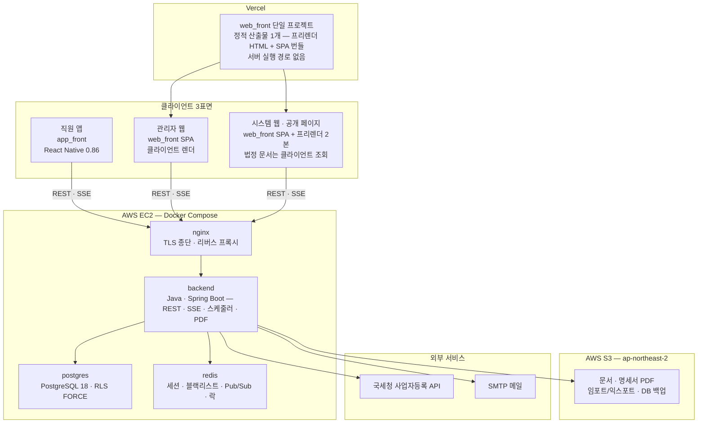

# 08_tech_stack — 기술 스택

> **대상**: insadesk 재구축 v1 — 계층별 기술 구성·버전·배포 대상의 정본
> **작성일**: 2026-08-03
> **개정일**: 2026-09-10 — [07_design_tokens.md](./07_design_tokens.md) **신설** 반영. 파일 목차에 07 행을 더하고, 고정 기준의 도입 문장을 **정본인 값은 버전 표기 하나**에서 **버전 표기와 디자인 토큰 둘**로 고치며 표에 디자인 토큰 행을 더한다 — 행만 더하고 문장을 두면 **폴더가 무엇의 정본인지를 세는 문장이 그날로 틀린다**
> **개정일**: 2026-09-06 — 백엔드 스택 전환(D-21 · ADR-25~29) 반영. 스택 표기를 **React · Vite · React Router · Spring Boot · PostgreSQL 18 · React Native**로 치환 · 파일 목차의 03 · 05 설명 재작성 · 핵심 스택 표의 백엔드 API 행을 **Java 25 · Spring Boot 4.1.1 · Spring Data JPA + MyBatis · Flyway**로, 패키지·CI/CD 행을 **표면별 분기(Gradle · npm 11)** 로 · 조감도 노드 nestjs → **backend** · 고정 기준의 버전 고정 정책·스택 표기·저장소 행 개정(스키마 정본 루트 **db_migration/** 등재) · 실측 기준 시점 2026-08-08 → **2026-09-06**(백엔드 축은 버전 대조 미수행 명시)
> **개정일**: 2026-08-08 — 웹 프레임워크 전환(D-20 · ADR-24)과 v1 범위 정합 반영. 스택 표기를 **React · Vite · React Router · NestJS · PostgreSQL 18 · React Native**로 치환 · 조감도에서 미들웨어·RSC 셸·SSG/ISR·FCM·SMS 노드 제거 · 핵심 스택 표 웹 행 재작성 · 백엔드 인프라 모듈 10 → **9** · 실측 기준 시점 2026-08-03 → **2026-08-08**
> **원천**: docs_ref2/features.md(3행 스택 선언 · 웹 세션/앱 토큰 · SSE + Redis Pub/Sub) · docs_ref2/requirements_p0.md(REQ-GLB-01 결정론 · REQ-GLB-02 부동소수점 금지) · docs_ref2/schema_p0.md(타입 매핑·역직렬화 규약) · 확정 결정 D-01~**D-21**([../01_overview/06_design_decisions.md](../01_overview/06_design_decisions.md)) · 기술결정 ADR-24 · **ADR-25~29**([../04_architecture/09_decision_records.md](../04_architecture/09_decision_records.md)) · 2026-08-08 시점 각 패키지 최신 안정판 실측(웹·앱·인프라 축)

insadesk가 채택하는 기술을 계층별로 고정한다. 저장소는 백엔드 backend/ · 웹 web_front/ · 앱 app_front/ **3개**이며(D-06) 스키마 정본은 저장소 루트 db_migration/이다(D-21 · ADR-27). 각 계층이 무엇을 쓰고 어디에 배포되는지를 본 폴더가 정한다.

**정확한 버전 표기의 정본은 본 폴더다.** 다른 문서는 [../README.md](../README.md) 고정 기준의 스택 표기(React · Vite · React Router · Spring Boot · PostgreSQL 18 · React Native)만 인용하고 버전을 쓰지 않는다. 선정 근거는 [06_decisions_rationale.md](./06_decisions_rationale.md)에 두고, 기술결정 번호(ADR)의 채번·논증 정본은 [../04_architecture/09_decision_records.md](../04_architecture/09_decision_records.md)다.

렌더링 모드·SEO 전략(D-20)의 정본은 [../04_architecture/05_rendering_seo.md](../04_architecture/05_rendering_seo.md)이며, 본 폴더는 그 전략을 실행하는 **스택 관점**만 담는다.

## 파일 목차

| 파일 | 내용 |
|------|------|
| [01_frontend_web.md](./01_frontend_web.md) | Vite 8.2 · React Router 8.3(프리렌더) · React 19.2 · TypeScript 6.0 · Tailwind CSS 4.3 · TanStack Query 5 · Zod 4 + react-hook-form 7 · @date-fns/tz · 산출물 구성 · 라우트 보호 · Vercel 배포 규약 · 성능·품질 규약 |
| [02_mobile_app.md](./02_mobile_app.md) | React Native 0.86 CLI bare(Expo 관리 워크플로 미채택) · react-navigation 7 · NativeWind 4 · expo-secure-store · 위치·지오펜스(백그라운드 위치 미요청) · 명세서 PDF 수신 · 전자서명 캔버스 · 푸시·오프라인 기록 미채택 |
| [03_backend.md](./03_backend.md) | Java 25 · Spring Boot 4.1.1 · 패키지 3축(common · core 9 · modules 13 — 검산 22) · Spring Data JPA(쓰기) + MyBatis(읽기 전용) · Flyway · DataSource 프록시 RLS 주입 · 십진 연산 · 인증(웹 세션 + 앱 토큰) · Bean Validation · springdoc OpenAPI · 스케줄러 · SSE · PDF · 발송 경로 2종 · 미지정 구현 영역 지정 |
| [04_data_infra.md](./04_data_infra.md) | PostgreSQL 18.4(uuidv7 · btree_gist · RLS FORCE) · Redis 8.10 · AWS EC2 Docker Compose 컨테이너 4종 · S3 서울 리전 · 백업 · Vercel |
| [05_tooling_devops.md](./05_tooling_devops.md) | 패키지 관리 표면별 분기(backend Gradle · web_front·app_front npm 11) · 코드 품질(backend 컴파일러 옵션·ArchUnit·컴파일 시점 정적 분석 / 프런트 TypeScript·ESLint 10·9·Prettier) · 정적 분석 규칙 4종 · 테스트(JUnit 5 + AssertJ + Testcontainers · Vitest · Jest + RNTL · Playwright) · GitHub Actions CI/CD · 환경변수 계층 · 로컬 docker compose |
| [06_decisions_rationale.md](./06_decisions_rationale.md) | 카테고리 6종별 결정·근거 표 — 버린 대안의 실패 시나리오 |
| [07_design_tokens.md](./07_design_tokens.md) | 세 소비처(web_front · app_front · backend PDF 템플릿) 공유 디자인 토큰 **값 단일 출처** — 원시 팔레트(중립 12 · 브랜드 9 · 상태 4축 5단 · 차트 범주 2) · 시맨틱 쌍 56종(라이트/다크 · 차트 2 포함) · 사이드바 컨셉 축 · 대비 검산 53쌍 · 타이포 7단 · 가중치 3단 · 표 밀도 3단 · 간격 4px 격자 · 반경 5단 · 그림자 2단 · 모션 · z-index 4층 · 브레이크포인트 7단 · 레이아웃 상수 · 폐기·개명 대응표 |

## 핵심 스택 한눈에

| 계층 | 스택 | 배포 |
|------|------|------|
| 직원 앱 | **React Native 0.86**(CLI bare) · TypeScript · NativeWind 4 · TanStack Query 5 | App Store · Google Play(app_front) |
| 웹 — 공개 페이지·관리자 웹·시스템 웹 | **Vite 8.2** · **React Router 8.3** · **React 19.2** · Tailwind CSS 4.3 · TanStack Query 5 · Zod 4 | **Vercel 1프로젝트**(web_front) — app.{domain} · 정적 산출물 1개(공개 2본 프리렌더 + SPA)(D-20) |
| 백엔드 API | **Java 25** · **Spring Boot 4.1.1** · Spring Data JPA + MyBatis · Flyway · Bean Validation | AWS EC2 Docker Compose(backend) — api.{domain}(D-03) |
| 데이터베이스 | **PostgreSQL 18**(18.4) — uuidv7 · btree_gist · RLS ENABLE + FORCE | EC2 Docker 컨테이너 postgres |
| 세션·실시간·락 | **Redis 8.10** — 세션 스토어 · JWT 블랙리스트 · SSE Pub/Sub · 분산락 | EC2 Docker 컨테이너 redis |
| 리버스 프록시·TLS | **nginx 1.30**(1.30.4 이상) + Let's Encrypt | EC2 Docker 컨테이너 nginx |
| 파일·백업 | **AWS S3** ap-northeast-2(서울) — 문서·PDF·임포트/익스포트·DB 백업 | 관리형 서비스(국내 리전 고정) |
| 패키지·CI/CD | **Gradle**(backend) · **npm 11**(web_front · app_front — Node.js 24 LTS 동봉) · **GitHub Actions** | 저장소 3개 독립 패키지(D-06) |

UI 컴포넌트 라이브러리·차트 라이브러리·전역 클라이언트 상태 라이브러리를 채택하지 않는다. 근거와 대체 수단은 [01_frontend_web.md](./01_frontend_web.md)에 둔다.

## 시스템 개요

클라이언트는 Vercel을 경유하지 않고 api.{domain}을 직접 호출한다(D-03). 웹 프록시 계층을 두지 않으므로 Vercel은 **정적 파일 배달만** 담당한다. 외부 의존은 국세청 사업자 진위확인 API와 SMTP 둘이다 — 푸시(FCM)와 문자 발송은 v1 범위 밖이다.

## 고정 기준

수치·범위·ID 규약의 정본은 [../README.md](../README.md)이며 본 폴더는 그 값을 인용만 한다. 어긋나면 [../README.md](../README.md)가 우선한다.

**본 폴더가 정본인 값은 버전 표기와 디자인 토큰 둘이다.**

| 항목 | 기준 |
|------|------|
| 버전 표기 형식 | **표시명 Major.Minor**(정확 버전 또는 캐럿 범위) — 예: **Vite 8.2**(8.2.1) |
| 디자인 토큰 | 색 · 타이포 · 간격 · 반경 · 그림자 · 모션 · 층위 · 브레이크포인트 · 레이아웃 상수의 **값 단일 출처는 [07_design_tokens.md](./07_design_tokens.md)**다. 웹 · 앱 · PDF 템플릿은 정의 형식이 달라 정의를 세 벌 갖되 값을 그 표에서만 가져온다. 소비처가 표에 없는 값을 만들지 않는다 |
| 실측 기준 시점 | **2026-09-06**. 웹·앱·인프라 축은 2026-08-08 실측을 승계하며 각 패키지 배포처의 최신 안정판(stable)이고 프리릴리스·베타·평가판은 채택하지 않는다. **백엔드 축은 2026-09-06 전환에서 버전 대조를 하지 않았다** — 확정 버전은 **Java 25 · Spring Boot 4.1.1** 둘뿐이고 나머지는 Spring Boot 관리 버전 또는 구현 착수 시점 최신 안정판 고정으로 등재한다. **이 실측은 레지스트리 버전 대조까지이며 동작 검증을 뜻하지 않는다** — 상호 호환 확인은 착수 첫 커밋의 설치·기동 스파이크가 담당한다 |
| 미확정 버전 표기 | 실측으로 확정하지 못한 항목은 추정 버전을 쓰지 않고 **구현 착수 시점 최신 안정판 고정**으로 등재한다 |
| 버전 고정 정책 | 프레임워크 축(Vite · React Router · React · React Native · **Spring Boot**)은 정확 버전 고정이다. 백엔드의 나머지 라이브러리는 **Spring Boot 관리 버전**을 따르고 관리 대상 밖만 명시 고정하며, 프런트의 그 외는 캐럿 범위다. 락 파일(web_front · app_front)과 의존성 잠금 파일(backend)을 저장소에 커밋한다 |
| 스택 표기 | 다른 문서는 React · Vite · React Router · **Spring Boot** · PostgreSQL 18 · React Native로만 쓴다. **Next.js를 전제하는 서술을 두지 않고**(D-20) **NestJS · Prisma · Node 런타임을 백엔드 계약으로 서술하지 않는다**(D-21). Node.js · npm · Vitest는 web_front · app_front 축에서만 쓴다. 버전 병기는 본 폴더에서만 한다 |
| 저장소 | backend/ · web_front/ · app_front/ **3개**(D-06). 스키마 정본 루트 db_migration/은 빌드·배포 단위가 아니라 **네 번째 패키지가 아니다**(ADR-27). 공유 코드용 네 번째 패키지를 만들지 않는다 |

## 관련 문서

- 전역 고정 기준·표기 규약 → [../README.md](../README.md)
- 확정 의사결정 정본(D-NN) → [../01_overview/06_design_decisions.md](../01_overview/06_design_decisions.md)
- 기술결정 ADR 정본 → [../04_architecture/09_decision_records.md](../04_architecture/09_decision_records.md)
- 시스템 구조·계층 책임 → [../04_architecture/01_system_architecture.md](../04_architecture/01_system_architecture.md)
- 렌더링·SEO 전략 정본 → [../04_architecture/05_rendering_seo.md](../04_architecture/05_rendering_seo.md)
- 배포 토폴로지 정본 → [../04_architecture/08_deployment_topology.md](../04_architecture/08_deployment_topology.md)
- 데이터베이스 명세 정본 → [../05_database/README.md](../05_database/README.md)
