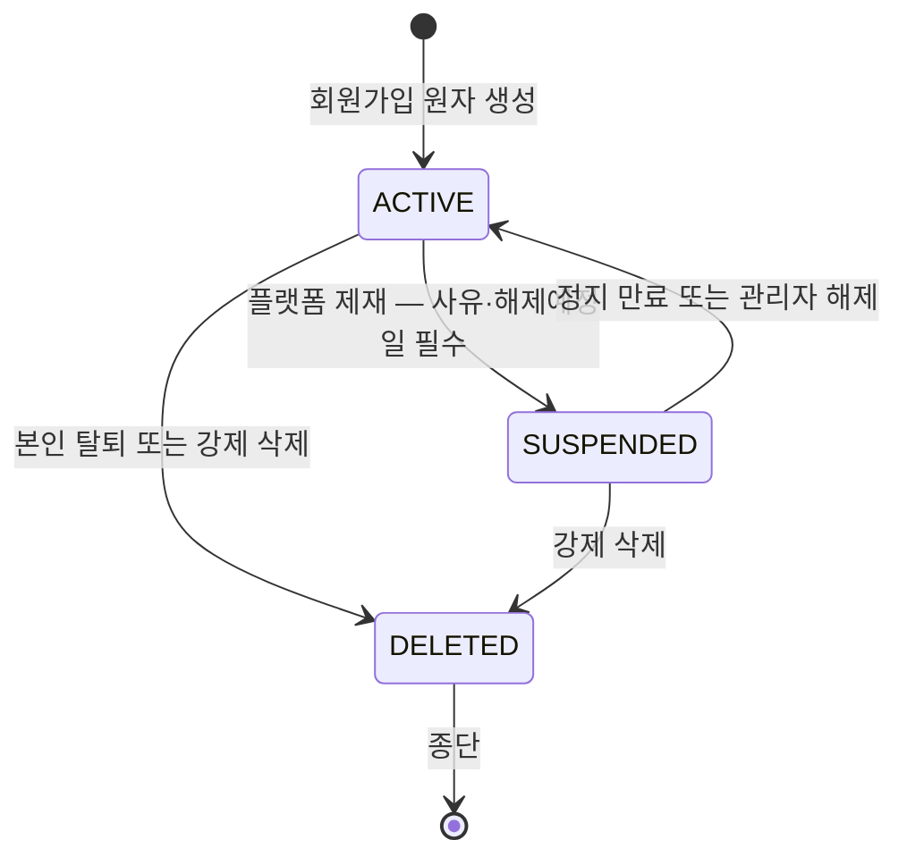
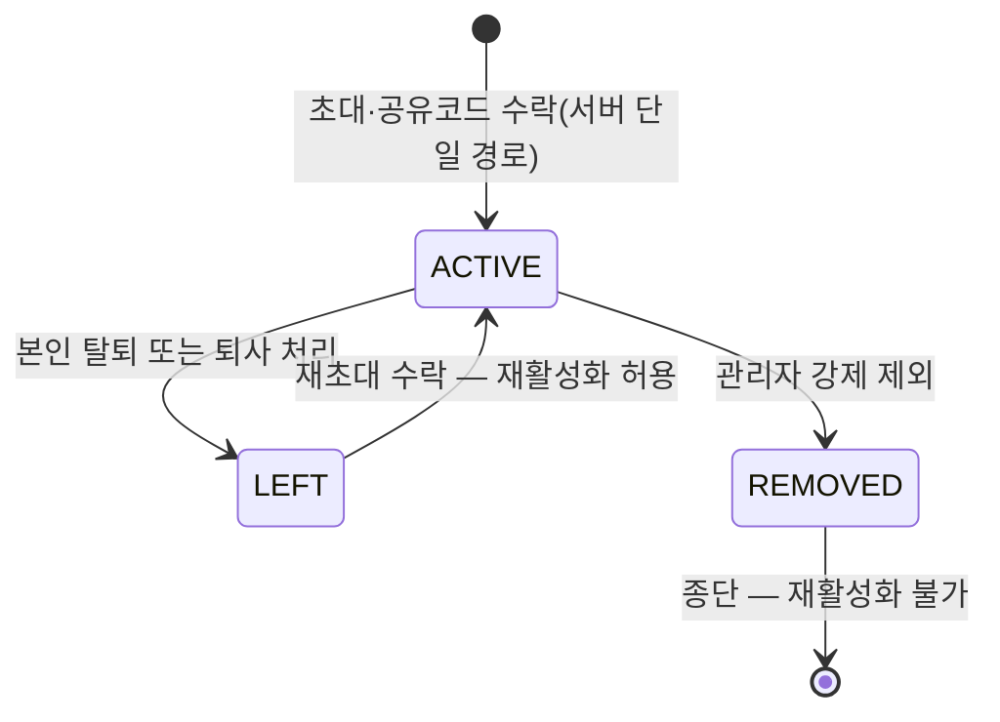
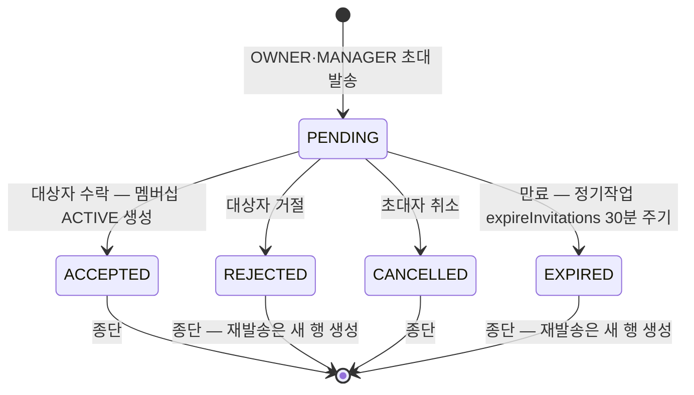
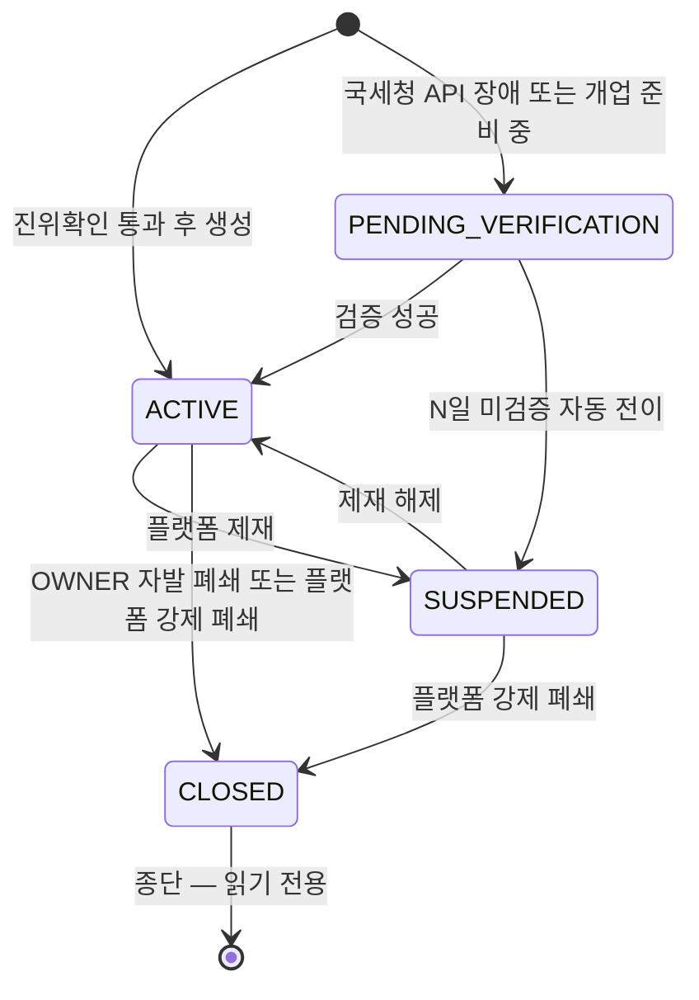
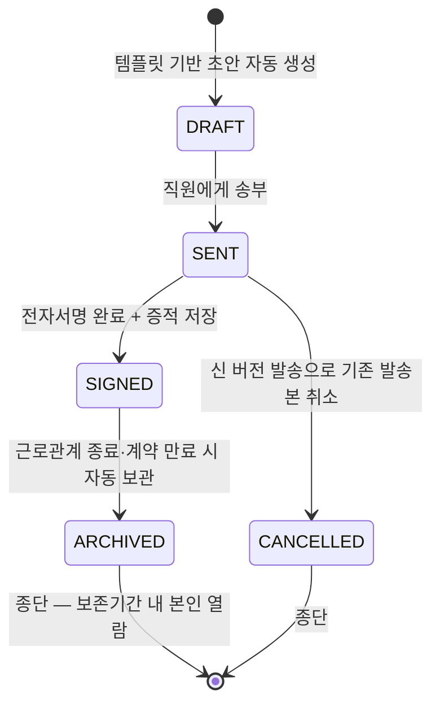
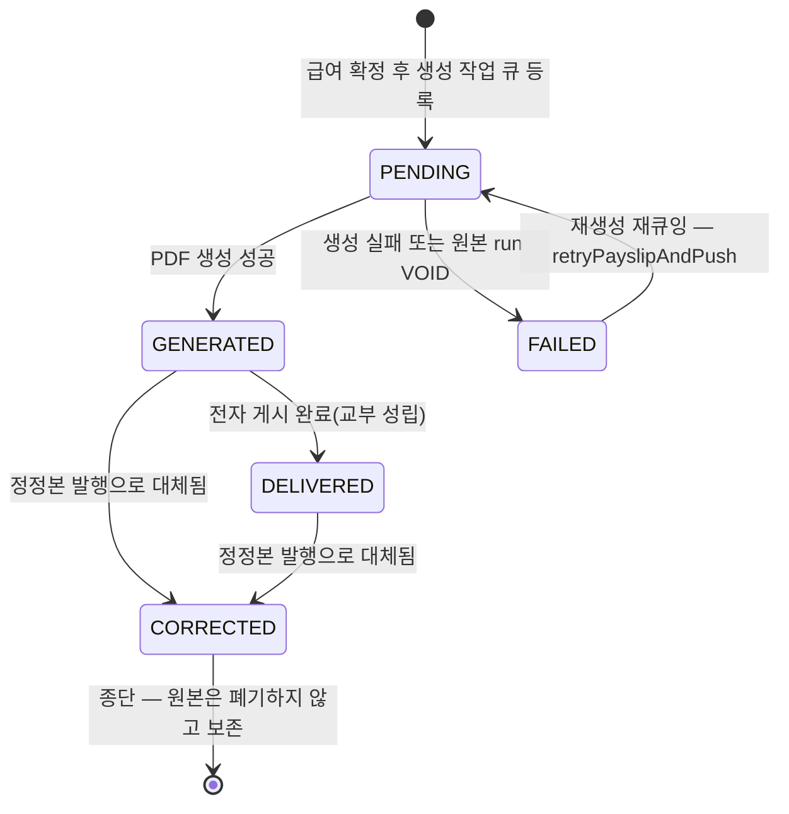
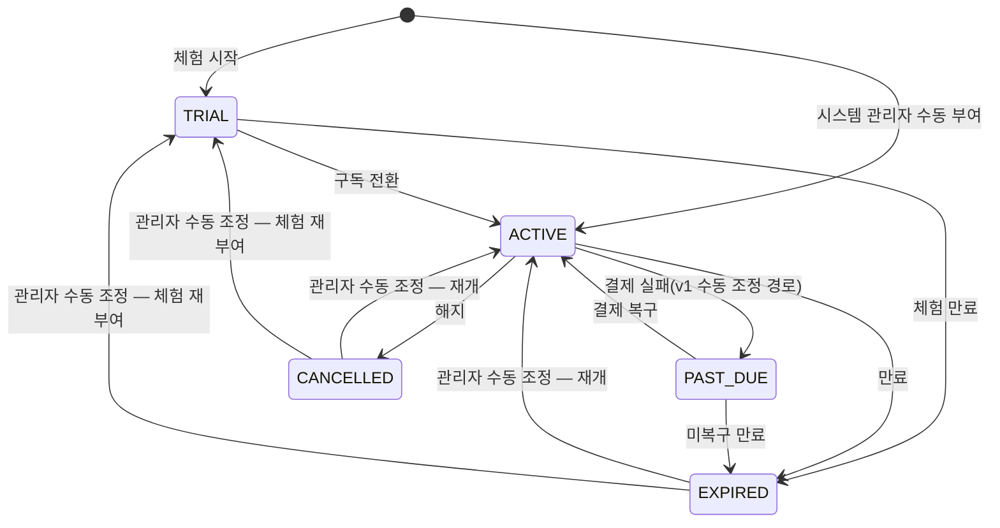
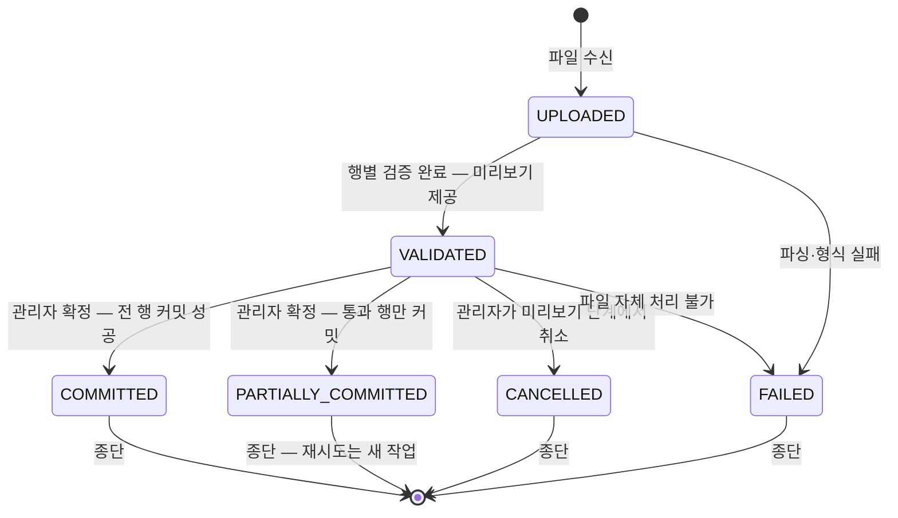
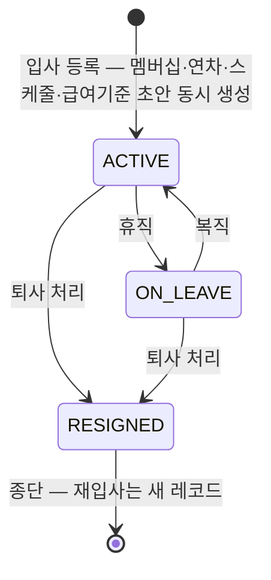

# Enum·상태 머신 사전 (03_enums_state_machines)

> **대상**: insadesk enum **33종 · 값 132** 전수와 상태 머신 **9종**의 전이 조건·가드
> **작성일**: 2026-08-03
> **개정일**: 2026-09-08 — 재발급 이력 등재처를 **행위자에 따라 갈라 서술**한다(REQ-SLP-15 개정 · 정본 [../03_requirements/08_payslip.md](../03_requirements/08_payslip.md)) — **본인 다운로드만 payslip_deliveries의 DOWNLOADED**이고 관리자 다운로드는 **audit_logs의 document.download_sensitive**다. payslip_deliveries는 **근로기준법 §48② 교부 이행의 법정 증적**이라 운영 감사 축을 섞지 않는다 — **이력이 사라지는 것이 아니라 옮겨 적히는 것**이다. 채번 없음
> **개정일**: 2026-08-08 — DB 커버리지 감사 반영 — **protected_period_kind 5값 신설**(enum 32 → **33종** · 값 127 → **132**) · 상태 머신 6종의 가드 주체 명기(멤버십 기본 거부 · 초대 서버 전용 만료 · 사업장 잔존 멤버십 · 계약 교부 조건 · 직원 입사 확정·OWNER 보유 · 명세서 재큐잉 고정) · 마감 유일성 축 정정
> **개정일**: 2026-08-08 — 멤버십 ACTIVE → LEFT 전이에 사업장 폐쇄 트랜잭션의 일괄 종료 경로와 마지막 OWNER 차단의 폐쇄 예외 등재(REQ-WRK-36)
> **개정일**: 2026-08-08 — 구독 상태 머신에 관리자 수동 조정 전이(EXPIRED·CANCELLED → ACTIVE·TRIAL) 등재 · 직원 재직 상태에 입사 미확정 초안(hire_date NULL) 각주 · 요금제 다버전 계약 정합. enum·상태 머신 수 불변(**32종 · 값 127 · 9종**)
> **원천**: docs_ref2/schema_p0.md enum 목록 절(legacy 23 + 신설 9) · docs_ref2/requirements_p0.md 상태 머신 절 9종과 각 도메인 REQ 본문

상태·분류는 PostgreSQL 네이티브 enum으로 정의해 전 도메인이 공유한다. **enum 값은 삭제하지 않고 비활성 처리**한다 — PostgreSQL은 라벨 삭제를 지원하지 않으며, 과거 행의 타입 정합을 위해 값을 남긴다.

상태 전이는 **서비스 레이어 1차 검증과 DB 가드(제약·트리거) 2차 방어가 함께 강제**한다. 아래 전이 표에 없는 전이는 모두 거부한다. 거부 시 반환하는 코드의 정본은 [02_error_codes.md](./02_error_codes.md)다.

enum 타입 이름은 snake_case, 값은 SCREAMING_SNAKE다([04_id_conventions.md](./04_id_conventions.md)). 본 문서가 **값 집합과 전이의 정본**이고, [../05_database/07_constraints_integrity.md](../05_database/07_constraints_integrity.md)는 같은 33종을 DB 타입 강제·제약 관점에서 다시 싣는 미러다.

## enum 33종 전수

| # | enum | 값 수 | 값 | 주 사용 위치 |
|---|------|:---:|----|-------------|
| 1 | account_status | 3 | ACTIVE · SUSPENDED · DELETED | users · profiles. DELETED 종단 |
| 2 | workplace_role | 3 | OWNER · MANAGER · STAFF | workplace_members · workplace_invitations |
| 3 | workplace_status | 4 | PENDING_VERIFICATION · ACTIVE · SUSPENDED · CLOSED | workplaces. CLOSED 종단·읽기전용 |
| 4 | member_status | 5 | INVITED · ACTIVE · LEFT · REMOVED · SUSPENDED | workplace_members. **LEFT(자발)→ACTIVE 재활성화 허용 · REMOVED(강제)→종단**. INVITED·SUSPENDED는 v1 미사용 예약값 |
| 5 | invitation_status | 5 | PENDING · ACCEPTED · REJECTED · CANCELLED · EXPIRED | workplace_invitations. PENDING 외 전부 종단 |
| 6 | system_role | 4 | VIEWER · SUPPORT · ADMIN · SUPER_ADMIN | system_admins |
| 7 | subscription_status | 5 | TRIAL · ACTIVE · PAST_DUE · EXPIRED · CANCELLED | subscriptions |
| 8 | tax_unit_type | 2 | GENERAL · BUSINESS_UNIT | workplaces. v1 기본 GENERAL |
| 9 | site_role | 2 | PRIMARY · SUB | workplaces. 동일 사업자번호 그룹 내 주·종 |
| 10 | **consent_kind**(신설) | 3 | TERMS · PRIVACY · LOCATION | terms_documents · user_consents. **위치정보는 별도 kind**(위치정보법 §18) |
| 11 | employment_type | 4 | REGULAR · CONTRACT · PART_TIME · DAILY | employment_terms · contract_templates |
| 12 | pay_type | 3 | HOURLY · MONTHLY · DAILY | employment_terms · payroll_terms |
| 13 | **employee_status**(신설 · text CHECK 승격) | 3 | ACTIVE · ON_LEAVE · RESIGNED | employees. RESIGNED 종단(재입사 = 새 레코드) |
| 14 | **worker_type**(신설) | 4 | EMPLOYEE · REPRESENTATIVE · COHABITING_RELATIVE · DOMESTIC_WORKER | employees. 비근로자는 상시근로자 산정·법정수당·연차·4대보험에서 제외(REQ-HRM-28) |
| 15 | gender | 3 | MALE · FEMALE · OTHER | employees |
| 16 | **insurance_type**(신설 · text CHECK 승격) | 5 | NATIONAL_PENSION · HEALTH · LONG_TERM_CARE · EMPLOYMENT · INDUSTRIAL_ACCIDENT | employee_insurance_infos · employee_insurance_histories · compliance_tasks(취득·상실 신고 대상) · 급여 공제 라인(payroll_employee_result_items.insurance_type) |
| 17 | contract_status | 5 | DRAFT · SENT · SIGNED · ARCHIVED · CANCELLED | contracts |
| 18 | attendance_status | 4 | OPEN · COMPLETED · PENDING · CANCELLED | attendance_records. PENDING = 정확도 미달 승인 대기 — **출구 전이는 승인 → COMPLETED · 반려 → CANCELLED 둘뿐**(MANAGER · REQ-ATT-04) |
| 19 | attendance_source | 3 | GPS · MANUAL · IMPORT | attendance_records. **QR은 v1 제외**(ATT-11) |
| 20 | attendance_day_status | 8 | NORMAL · LATE · EARLY_LEAVE · ABSENT · MISSING_CLOCKOUT · ON_LEAVE · HOLIDAY · WEEKLY_HOLIDAY | attendance_daily_summaries |
| 21 | attendance_change_request_status | 4 | PENDING · APPROVED · REJECTED · CANCELLED | attendance_change_requests. 종결 3종 불변 |
| 22 | attendance_closing_status | 3 | LOCKED · REOPENED · CANCELLED | attendance_period_closings |
| 23 | leave_status | 4 | PENDING · APPROVED · REJECTED · CANCELLED | leave_requests. APPROVED→CANCELLED는 관리자 조건부 허용 |
| 24 | **leave_txn_type**(신설 · text CHECK 승격) | 5 | GRANT · USE · RESTORE · EXPIRE · ADJUST | leave_transactions |
| 25 | payroll_status | 4 | DRAFT · CALCULATED · CONFIRMED · VOIDED | payroll_runs. CONFIRMED→VOIDED 외 되돌리기 금지 |
| 26 | payslip_status | 5 | PENDING · GENERATED · FAILED · DELIVERED · CORRECTED | payslips |
| 27 | pay_item_type | 2 | EARNING · DEDUCTION | pay_items · payroll_employee_result_items |
| 28 | pay_calc_method | 4 | FIXED · RATE · FORMULA · STATUTORY | pay_items |
| 29 | **import_status**(신설) | 6 | UPLOADED · VALIDATED · COMMITTED · PARTIALLY_COMMITTED · CANCELLED · FAILED | import_jobs. legacy PREVIEW·ROLLED_BACK 폐기 |
| 30 | **compliance_task_type**(신설) | 6 | INSURANCE_ACQUISITION · INSURANCE_LOSS · SEPARATION_CERTIFICATE · WAGE_SETTLEMENT · SEVERANCE_PAYMENT · WITHHOLDING_FILING | compliance_tasks(TAX-01 · TAX-02 · TAX-11 · PAY-19) |
| 31 | **compliance_task_status**(신설) | 3 | OPEN · COMPLETED · WAIVED | compliance_tasks. **임박·경과는 due_date에서 파생**(상태 저장 금지 — 배치 재실행 결정성) |
| 32 | **severance_plan_type**(신설) | 3 | STATUTORY_SEVERANCE · DB · DC | severance_assessments. 퇴직급여 추상(REQ-PAY-34) |
| 33 | **protected_period_kind**(신설) | 5 | OCCUPATIONAL_INJURY_LEAVE · MATERNITY_LEAVE · PARENTAL_LEAVE · CHILDCARE_REDUCED_HOURS · PREGNANCY_REDUCED_HOURS | employee_protected_periods. **근로기준법 §60⑥ 출근 간주 5유형**이며 값 집합이 법 조문에 고정된다(REQ-LEV-04) |

값 수 검산: (3 + 3 + 4 + 5 + 5 + 4 + 5 + 2 + 2 + 3 = 36) + (4 + 3 + 3 + 4 + 3 + 5 + 5 + 4 + 3 + 8 = 42) + (4 + 3 + 4 + 5 + 4 + 5 + 2 + 4 + 6 + 6 = 43) + (3 + 3 + 5 = 11) = **132**.

신설 10종 검산: consent_kind · employee_status · worker_type · insurance_type · leave_txn_type · import_status · compliance_task_type · compliance_task_status · severance_plan_type · **protected_period_kind** = **10**. legacy 승계 23 + 신설 10 = **33**.

- 신설 10종 중 **4종은 legacy의 text CHECK를 enum으로 승격**한 것이고(employee_status · insurance_type · leave_txn_type · import_status), 6종은 v1 신규 개념이다(consent_kind · worker_type · compliance_task_type · compliance_task_status · severance_plan_type · protected_period_kind).
- **v1 미사용 예약값이 4개** 있다 — member_status의 INVITED·SUSPENDED(멤버 정지 경로가 없다) · tax_unit_type의 BUSINESS_UNIT(사업자단위과세는 v1 제외) · attendance_source의 값 집합에는 QR이 아예 없다(ATT-11 v1 제외라 값을 만들지 않았다). 예약값은 값 목록에 살아 있으므로 132에 포함한다.
- **enum으로 굳히지 않는 축**은 별도다 — notification_types.code · plans의 (code, version) · statutory_rates의 (category, key) · leave_types.code는 lookup 테이블이고, 작업 상태(batch_jobs · export_jobs)와 delivery_type · channel · priority · source는 text + CHECK다. 값 집합이 테이블마다 다르고 운영 중 변동이 잦아 ALTER TYPE 비용을 지지 않는다.

## 상태 머신

원천이 상태 머신 절로 확정한 **9종**이다. 각 표의 전이만 허용하고 나머지는 전부 거부한다.

### 1. 계정 (users.status)

계정은 사업장과 무관한 전역 도메인이며 상태는 account_status 3값이다. **DELETED는 종단**이라 어떤 경로로도 되살아나지 않는다 — 탈퇴·강제 삭제 모두 논리 삭제이고 법정 보존 대상 데이터는 삭제하지 않는다(REQ-AUT-21).

SUSPENDED는 두 경로로 풀린다. suspended_until이 지난 계정은 **로그인 시점 판정**에서 즉시 ACTIVE로 복귀하고, 로그인하지 않는 계정은 정기작업 autoUnsuspendAccounts(매일 00:05 KST)가 일괄 점검한다. 두 경로를 모두 두는 이유는 배치만 두면 해제 예정일 직후 로그인이 부당하게 막히고, 로그인 판정만 두면 권한 캐시가 정리되지 않기 때문이다.

| 전이 | 조건·트리거 | 가드·차단 |
|------|------------|----------|
| ACTIVE → SUSPENDED | ADMIN 이상이 사유·해제 예정일을 입력(REQ-SYS-07) | 마지막 SUPER_ADMIN 보유 계정은 차단 — system.last_super_admin/409. 전이 즉시 세션·refresh token 전체 폐기 |
| SUSPENDED → ACTIVE | suspended_until 경과 후 로그인 판정 또는 정기작업 autoUnsuspendAccounts(REQ-AUT-18) | 권한 캐시를 함께 무효화한다 |
| ACTIVE → DELETED | 본인 탈퇴(재인증 선행) 또는 SUPER_ADMIN 강제 삭제(REQ-AUT-20 · REQ-SYS-07) | OWNER로 소유한 사업장이 있으면 차단 — auth.owner_must_transfer/409. 마지막 SUPER_ADMIN은 차단 — system.last_super_admin/409 |
| SUSPENDED → DELETED | 강제 삭제 | 위와 동일 가드 |
| DELETED → 임의 상태 | — | **불가(종단).** 로그인·비밀번호 재설정·초대 수락을 전면 차단 — auth.account_deleted/403 |

- SUSPENDED 상태에서는 모든 권한 헬퍼가 거부를 반환한다. 인증 유효 중 상태가 바뀌어도 다음 요청의 서버 검증과 2단 방어가 차단한다.
- 상태 변경은 account_status_events와 audit_logs에 전후 상태·사유·처리자를 남긴다(REQ-AUT-19).

### 2. 멤버십 (workplace_members.status)

멤버십은 사용자와 사업장을 잇는 소속 관계이며 상태는 member_status 5값 중 **v1이 3값만 쓴다**. 초대 수락은 중간 상태 없이 곧바로 ACTIVE를 생성한다 — 초대 자체의 상태는 invitation_status가 담당하므로 INVITED를 멤버십에 두면 진실이 둘이 된다.

**LEFT와 REMOVED의 차이가 재활성화 가능 여부를 가른다.** 자발적 이탈(LEFT)은 재초대 수락으로 되돌아올 수 있지만, 관리자가 강제 제외한 이력(REMOVED)은 되돌아올 수 없다 — 제외에는 사유가 있었고 그 판단을 초대 한 번으로 덮지 않는다.

| 전이 | 조건·트리거 | 가드·차단 |
|------|------------|----------|
| 신규 → ACTIVE | 초대 수락 또는 공유 코드 수락(REQ-WRK-16) | 활성 멤버 한도를 **수락 시점에 재검증** — subscription.staff_limit_exceeded/402. 사업장이 SUSPENDED·CLOSED면 차단 — workplace.closed/409. 동시 수락은 사업장 행 잠금으로 직렬화 |
| ACTIVE → LEFT | 본인 계정 탈퇴 · 퇴사 처리 연동(REQ-WRK-28 · REQ-HRM-12 — 자진·계약만료) · **사업장 폐쇄 트랜잭션의 일괄 종료**(REQ-WRK-36) | 마지막 ACTIVE OWNER는 차단 — workplace.last_owner/409 · workplace.owner_singleton/409. **단, 폐쇄 트랜잭션 안에서의 종료 전이는 예외로 허용**한다 — 0명이 허용되는 유일한 조건은 사업장 CLOSED다(정본 [../05_database/02_workplace.md](../05_database/02_workplace.md)) |
| ACTIVE → REMOVED | OWNER·MANAGER의 강제 제외. 사유·적용일 필수(REQ-WRK-26) | 마지막 OWNER 차단 · 급여 확정 진행 중 대상자 차단(workplace.payroll_in_progress/409) · 미처리 승인의 필수 승인자 차단(workplace.pending_approver/409) · 필수 인원 미달 차단(workplace.employee_required/409) |
| LEFT → ACTIVE | 재초대 수락(REQ-WRK-17) | 한도 재검증을 다시 통과해야 한다 |
| REMOVED → ACTIVE | — | **불가.** 재초대 수락 시도는 workplace.member_state_conflict/409 |
| 표에 없는 전이 | — | **불가(기본 거부).** SUSPENDED → ACTIVE가 그 대상이며, 예약값이라 발생하지 않는다는 사실이 차단 근거를 대신하지 않는다 — 멤버십 전이 가드가 사업장 가드와 같은 기본 거부 규율을 갖는다 |

- **LEFT·REMOVED 이후에도 본인 귀속 법정문서 열람권은 유지**된다. 인가는 멤버십이 아니라 본인 소유권으로 판정하기 때문이다(REQ-SLP-09).
- 역할 변경은 상태 전이가 아니라 workplace_role 컬럼 변경이며 membership_role_events에 별도 기록한다. **사업장당 ACTIVE OWNER는 항상 정확히 1명**이라는 불변식이 역할 축을 지킨다(REQ-WRK-22).

### 3. 초대 (workplace_invitations.status)

초대는 PENDING 하나에서 나머지 4값 중 하나로 한 번 이동하면 끝난다 — **PENDING 외 전부 종단**이다. 재발송은 상태를 되돌리는 것이 아니라 **새 행을 만들고 직전 토큰을 즉시 무효화**하는 처리이며, 그래야 무효화 시점이 행 단위로 감사에 남는다.

수락은 클라이언트 직접 갱신을 금지하고 **서버 단일 경로**로만 처리한다. 인원 한도는 발송 시점 검증만으로 부족해 수락 시점에 다시 본다 — 대기 중 다른 초대가 수락되어 한도가 찰 수 있기 때문이다.

| 전이 | 조건·트리거 | 가드·차단 |
|------|------------|----------|
| 신규 → PENDING | 역할·고용 시작 예정일·메시지를 지정한 초대 생성(REQ-WRK-12 · REQ-WRK-13) | MANAGER는 STAFF만 초대 — workplace.invite_role_forbidden/403. 이미 ACTIVE 멤버면 workplace.already_member/409. **동일 사업장·동일 대상의 PENDING 초대는 중복 생성하지 않는다**(멱등). 발송 시점 한도 초과는 subscription.staff_limit_exceeded/402 |
| PENDING → ACCEPTED | 유효 토큰 수락. 서버 단일 트랜잭션(REQ-WRK-16) | 만료 토큰은 invitation.expired/410, 무효 토큰·공유 코드는 invitation.invalid_token/422. 사업장 SUSPENDED·CLOSED면 workplace.closed/409. REMOVED·SUSPENDED 이력은 workplace.member_state_conflict/409. 한도 재검증 후 subscription.staff_limit_exceeded/402 |
| PENDING → REJECTED | 대상자 거절(REQ-WRK-18) | 이미 응답한 초대는 invitation.already_responded/409 |
| PENDING → CANCELLED | 초대자 취소(REQ-WRK-18) | 동일 |
| PENDING → EXPIRED | expires_at(기본 7일) 경과 후 정기작업 expireInvitations(30분 주기) 처리 | 배치는 멱등하다. **전이 주체가 초대자도 대상자도 아니므로 서버 전용 축을 별도로 갖는다** — 그 축이 없으면 만료 배치가 행 갱신 정책에 막힌다 |
| 종단 4값 → 임의 상태 | — | **불가.** 재발송은 새 PENDING 행 생성 + 직전 토큰 무효화이며, 직전 토큰 수락 시도는 invitation.invalid_token/422 |

- **토큰은 해시로만 저장**한다(REQ-WRK-13). 미가입자용 공유 코드는 1회용이며 수락 시 대상 phone·username 일치 검증을 필수로 한다.
- 모든 전이는 알림을 발송한다 — invite_received · invite_accepted · invite_rejected · invite_cancelled · invite_expired.

### 4. 사업장 (workplaces.status)

사업장은 진위확인 결과에 따라 두 시작점을 갖는다. 국세청 API 진위확인을 통과하면 ACTIVE로 바로 생성되고, **API 장애이거나 개업 준비 중(사업자등록 신청 전)이면 PENDING_VERIFICATION**으로 생성한다. 외부 API 가용성에 법정 의무 이행이 종속되지 않게 하려는 설계다.

**PENDING_VERIFICATION은 반쪽 차단**이다 — 근태·인사 입력은 허용하되 급여 확정·명세서 발행만 막는다. 근태를 막으면 실제 근무가 기록되지 않아 나중에 임금 산정 자체가 불가능해지고, 급여를 허용하면 검증되지 않은 사업자 명의로 임금대장이 생긴다. **폐업 사업자는 신규 등록 자체를 차단**하지만 **휴업은 경고 후 등록을 허용**한다 — 휴업 중에도 근로관계·휴업수당·퇴직금 의무가 존속하기 때문이다.

| 전이 | 조건·트리거 | 가드·차단 |
|------|------------|----------|
| 신규 → ACTIVE | 진위확인 통과 후 단일 트랜잭션 생성 + OWNER 멤버십·기본 정책 시드(REQ-WRK-03) | 폐업 사업자는 workplace.business_invalid/422. (business_no, site_label) 완전 중복은 workplace.duplicate_site/409. 소유 한도 초과는 subscription.workplace_limit_exceeded/402 |
| 신규 → PENDING_VERIFICATION | 국세청 API 장애·timeout·호출량 초과(workplace.business_api_unavailable/503) 또는 개업 준비 중 선택(REQ-WRK-08) | PENDING 상태에서 급여 확정·명세서 발행 시도는 workplace.verification_pending/409 |
| PENDING_VERIFICATION → ACTIVE | 재검증 성공 | 검증 결과는 business_verification_logs에 기록한다 |
| PENDING_VERIFICATION → SUSPENDED | N일(정책값) 내 미검증 시 자동 전이 + OWNER 알림 | 자동 전이도 감사 로그를 남긴다 |
| ACTIVE·SUSPENDED 상호 전이 | ADMIN 이상이 사유를 필수 입력해 제재·해제(REQ-SYS-05) | SUSPENDED 사업장으로의 컨텍스트 전환은 workplace.unavailable/409, 초대 수락은 workplace.closed/409 |
| ACTIVE → CLOSED (OWNER 자발) | 미완 급여·미발행 명세서·미처리 승인 없음 + 법정 보존 안내 확인 + 비밀번호 재인증(REQ-WRK-36) | 미완 항목은 workplace.close_blocked/409(details 배열). 보존 안내 미확인은 workplace.retention_ack_required/422. 재인증 미충족은 auth.reauth_required/401. **전이 완료 시점에 ACTIVE 멤버십이 남아 있으면 지연 가드가 거부한다** — 멤버십 종료는 폐쇄의 구성 동작이며 같은 트랜잭션 컨텍스트가 그 전이를 연다 |
| ACTIVE·SUSPENDED → CLOSED (플랫폼 강제) | ADMIN 이상이 사유를 입력해 강제 폐쇄(REQ-SYS-05) | **OWNER 자발 폐쇄와 별개 경로**다 — OWNER 재인증 없이 사유만으로 수행한다 |
| CLOSED → 임의 상태 | — | **불가(종단).** 신규 업무 생성 차단 + 읽기 전용. 법정 보존 데이터는 유지하고 **본인 귀속 법정문서 열람은 계속 가능**하다(REQ-SLP-09) |

### 5. 근로계약 (contracts.status)

근로계약은 작성(DRAFT) → 송부(SENT) → 전자서명(SIGNED) → 보관(ARCHIVED)의 단선 흐름이며, 서명 전 수정만 CANCELLED로 갈라진다. **서명본은 고치지 않는다** — 조건이 바뀌면 기존 발송본을 CANCELLED로 두고 새 버전을 발송한다.

**서버 보관만으로는 교부 의무가 이행되지 않는다.** SIGNED 전이는 서명 완료를 뜻할 뿐이고, 근로기준법 §17②의 교부는 등록된 이메일 또는 앱으로 **발송**해야 성립한다(REQ-HRM-22). 보존기간은 **근로관계 종료일 + 3년**이며 재직 중 만료되지 않도록 종료 시점에 확정·연장한다.

| 전이 | 조건·트리거 | 가드·차단 |
|------|------------|----------|
| 신규 → DRAFT | 고용형태별 contract_templates에 인사·근로조건을 채워 초안 생성(REQ-HRM-19) | — |
| DRAFT → SENT | 법정 명시사항 5종 검증 통과 후 송부(REQ-HRM-20) | 필수 항목 누락은 hr.contract_missing_field/422 — **단시간 근로일별 근로시간 포함**. 금액·시간·날짜가 employment_terms와 불일치하면 경고한다 |
| SENT → SIGNED | 직원 앱에서 **본인만** 열람·서명. 서명 시각·IP·user agent·서명 이미지 해시·계약 PDF 해시를 contract_signatures에 저장(REQ-HRM-21) | 상태상 서명 불가이거나 본인 계약이 아니면 hr.contract_not_signable/409. 서명 전 주요 근로조건 확인 체크를 요구한다 |
| SENT → CANCELLED | 서명 전 조건 수정 — 새 버전을 발송하면 기존 발송본을 취소한다 | 원본을 수정하지 않는다 |
| SIGNED → ARCHIVED | 퇴사 처리 또는 계약 만료 배치가 자동 전이(REQ-HRM-13) | 전이 시점에 retention_until을 **종료일 + 3년**으로 확정·연장한다 |
| ARCHIVED·CANCELLED → 임의 상태 | — | **불가(종단).** ARCHIVED 서명본은 보존기간 내 본인 read-only 열람 대상이다 |

### 6. 명세서 (payslips.status)

명세서는 급여 확정 후 큐에 등록되어 PENDING에서 시작한다. **PDF 생성 실패는 급여 확정을 롤백하지 않는다** — 명세서 생성 실패로 확정 급여가 되돌아가면 임금대장·회계가 함께 흔들린다. 실패는 FAILED로 남기고 정기작업 retryPayslipAndPush(15분 주기)가 재큐잉한다.

**교부(DELIVERED)와 열람(VIEWED)은 별개 이벤트**다. 교부는 전자 게시가 완료된 시점(근로자가 열람할 수 있는 상태가 된 때)이고, 실제 열람은 payslip_deliveries에만 기록되며 payslips.status를 바꾸지 않는다. 이 구분이 무너지면 "직원이 안 봤으니 교부가 아니다"라는 오판이 생겨 미교부 과태료 위험을 낳는다.

| 전이 | 조건·트리거 | 가드·차단 |
|------|------------|----------|
| 신규 → PENDING | 급여 확정(CONFIRMED) 후 직원별 생성 작업 등록. **원본 최초 생성만 자동 트리거**한다(REQ-SLP-01) | run이 CONFIRMED가 아니면 payslip.run_not_confirmed/409. 사업장 PENDING_VERIFICATION이면 workplace.verification_pending/409. (payroll_run_id, employee_id) WHERE supersedes_id IS NULL 부분 유니크 + 멱등키로 중복 생성을 막는다 |
| PENDING → GENERATED | PDF 렌더링 성공. 확정 시점 데이터와 기준값 버전을 스냅샷 보관(REQ-SLP-02) | 법정 필수 기재사항 누락은 payslip.missing_required_field/422 — 누락 상태로는 교부하지 않는다 |
| PENDING → FAILED | PDF 생성 실패(payslip.generation_failed/422) 또는 **원본 run VOID**(REQ-SLP-03 · REQ-SLP-16) | failure_reason을 기록한다 |
| FAILED → PENDING | 관리자 재생성 또는 정기작업 retryPayslipAndPush 재큐잉 | **failure_reason = run_voided는 재큐잉 불가·고정**이다. 정정본은 새 run 확정 후 정정본 API로만 발행한다 |
| GENERATED → DELIVERED | 전자 게시 완료. payslip_deliveries에 ISSUED 행 기록(REQ-SLP-07) | 직원이 알림 수신을 거부해도 법정 교부와 목록 생성은 생략하지 않는다 — 거부 시도는 notification.mandatory_pref/409 |
| GENERATED·DELIVERED → CORRECTED | 정정본 발행. supersedes_id로 원본과 연결(REQ-SLP-16) | **OWNER 전용** — MANAGER 시도는 payslip.correct_forbidden/403. **CORRECTED 체인은 GENERATED·DELIVERED에 한한다** — PENDING·FAILED는 정정 대상이 아니다 |
| CORRECTED → 임의 상태 | — | **불가(종단).** 원본은 폐기하지 않고 보존하며 직원 화면에 최신본 + 원본 이력을 함께 표시한다 |

- **재발급은 상태 전이가 아니다.** 동일 원본의 재교부이며 payslips 행을 새로 만들지 않는다. 이력은 **본인 다운로드가 payslip_deliveries의 DOWNLOADED 행**으로, **관리자 다운로드가 audit_logs**로 남는다(REQ-SLP-15). 버전 개념은 재발급이 아니라 정정본 체인이 담당한다.

### 7. 구독 (subscriptions.status)

구독은 **계정 단위**(user_id UNIQUE)이며 사업장 단위가 아니다. 미설정 계정은 FREE로 간주한다. v1은 PG 자동 결제가 없으므로 **PAST_DUE는 실질적으로 수동 조정 경로에서만** 쓰이고, 유료 전환은 시스템 관리자의 수동 조정으로 처리한다(REQ-SYS-09).

**EXPIRED는 신규 사업장 등록과 유료 기능만 막고 법정 보존 데이터의 조회·교부는 막지 않는다.** 구독 만료를 이유로 명세서 열람을 끊으면 사업주가 법정 의무를 이행할 수 없게 된다.

| 전이 | 조건·트리거 | 가드·차단 |
|------|------------|----------|
| 신규 → TRIAL·ACTIVE | 체험 시작 또는 ADMIN 이상의 수동 부여. **사유 필수**(REQ-SUB-03 · REQ-SYS-09) | 요금제 미존재는 subscription.plan_not_found/404. 조정 시 대상 계정의 한도 초과 여부를 미리 계산해 표시한다 |
| TRIAL → ACTIVE | 구독 전환 | — |
| TRIAL·ACTIVE·PAST_DUE → EXPIRED | 정기작업 checkSubscriptionExpiry(매일 00:10 KST)가 체험 종료·만료일·수동 부여 종료일을 점검(REQ-SUB-08) | 배치는 멱등해야 하며 분산락으로 중복 실행을 막는다 |
| ACTIVE → PAST_DUE → ACTIVE | 결제 실패·복구. **v1은 PG 결제가 없어 수동 조정만** | — |
| ACTIVE → CANCELLED | 해지 | — |
| EXPIRED·CANCELLED → **ACTIVE·TRIAL** | **플랫폼 관리자 수동 조정 전용**(REQ-SYS-09). subscription:update 권한 · **reason 필수** · 감사 기록을 조건으로만 성립한다 | 이 셋을 갖추지 않은 전이는 거부한다. 배치·사용자 요청 경로에서는 발생하지 않는다 |
| EXPIRED·CANCELLED → PAST_DUE·그 밖의 상태 | — | **불가.** 자동 전이 축에서 EXPIRED·CANCELLED는 종단이며, 위 수동 조정만 예외다. EXPIRED 상태의 기능 실행은 subscription.expired/402 |

- **한도 축소로 기존 사용량이 초과되어도 기존 ACTIVE 사업장을 자동 폐쇄하지 않는다** — 신규 등록·초대만 차단한다(REQ-SUB-07 · REQ-WRK-31).
- 만료 예정·만료·한도 초과는 OWNER와 시스템 관리자에게 subscription_notice로 알린다.
- **요금제 등급 코드는 FREE · PRO · ULTRA 3종 고정**이며, 요금제 변경은 같은 code의 **새 버전 + 유효 시작일**로 관리한다. 구독 행은 등급 문자열이 아니라 **적용된 요금제 행**을 참조하므로 과거 구독에 적용된 한도가 그대로 추적된다 — 등급 집합 자체는 늘리지 않는다(정본 [../05_database/14_subscription.md](../05_database/14_subscription.md)).
- **만료·해지 계정의 복구 경로는 상태 전이 하나뿐이다.** subscriptions는 계정당 1행(user_id UNIQUE)이고 삭제 경로가 없으므로 재개를 행 교체로 처리할 수 없다 — 관리자 수동 조정 전이를 막으면 그 계정은 FREE 재등록조차 불가능해진다.

### 8. 데이터 임포트 (import_jobs.status)

임포트는 업로드(UPLOADED) → 행별 검증(VALIDATED) → 관리자 확정(COMMITTED)의 흐름이며, **VALIDATED 단계까지 어떤 데이터도 커밋하지 않는다** — 이 단계가 전체 롤백이 가능한 마지막 지점이다. 확정은 OWNER 전용 액션이며 감사 로그를 남긴다.

부분 실패는 실패가 아니라 **별도 종단 상태**(PARTIALLY_COMMITTED)다. 통과 행을 커밋하고 실패 행 리포트를 남기며, 재시도는 기존 작업을 되돌리는 것이 아니라 **새 작업**으로 만든다. legacy의 PREVIEW·ROLLED_BACK 값은 폐기했다.

| 전이 | 조건·트리거 | 가드·차단 |
|------|------------|----------|
| 신규 → UPLOADED | OWNER·MANAGER가 CSV·Excel 템플릿 업로드. import_type ∈ {EMPLOYEES, OPENING_BALANCE}(REQ-WRK-32) | 허용 크기 초과는 common.payload_too_large/413 |
| UPLOADED → VALIDATED | 서버 행별 검증 통과. 오류 행·한도 초과 경고를 포함한 미리보기 반환 | 행 검증 실패는 import.validation_failed/422(행 번호·필드·사유). 파일 내 행간 중복은 import.duplicate_employee/409, 기존 DB 중복은 hr.duplicate_active_employee/409 · hr.resident_no_duplicate/409 |
| UPLOADED·VALIDATED → FAILED | 파싱·형식 실패 또는 파일 자체 처리 불가 | — |
| VALIDATED → COMMITTED | **OWNER 전용** 확정. 전 행 커밋 성공(REQ-WRK-33) | 확정 직전 활성 멤버 수를 재검증 — subscription.staff_limit_exceeded/402. 민감정보는 임포트 즉시 암호화한다 |
| VALIDATED → PARTIALLY_COMMITTED | 확정 중 일부 행 실패. 통과 행만 커밋하고 실패 상세 리포트를 제공 — **정상 종료(200)이며 오류가 아니다**. 후속은 실패 행 리포트 수정 후 새 업로드 | 확정 트랜잭션이 원자 단계에서 실패해 커밋분이 무효화된 경우만 import.rollback_required/409(재실행 필요) |
| VALIDATED → CANCELLED | 관리자가 미리보기 단계에서 취소 | — |
| 종단 4값 → 임의 상태 | — | **불가.** 재시도는 새 import_jobs 행을 만든다 |

- 적재 데이터는 **source = IMPORT로 표시**하고 급여 계산·연차 산정의 기산 기준으로만 쓰며 **명세서 자동 생성 대상에서 제외**한다(REQ-WRK-34).

### 9. 직원 재직 (employees.status)

직원 재직 상태는 employee_status 3값이며 휴직(ON_LEAVE)은 복직으로 되돌아오지만 **퇴사(RESIGNED)는 종단**이다. 재입사는 상태를 되돌리는 것이 아니라 **새 employees 레코드**를 만든다 — 고용기간마다 연차 기산일·근속·퇴직금 산정이 달라지므로 한 행에 두 고용기간을 담으면 계산이 재현되지 않는다.

퇴사 확정은 부수효과가 넓다 — 4대보험 상실 신고자료 · 마지막 급여 · 미사용 연차수당 정산 · 퇴직금 판정 · 금품청산 14일 시계 · 이직확인서 10일 시계를 함께 트리거하고, 근로계약을 SIGNED → ARCHIVED로 자동 보관 전이한다.

| 전이 | 조건·트리거 | 가드·차단 |
|------|------------|----------|
| 신규 → ACTIVE | 입사 등록. 단일 트랜잭션으로 멤버십 ACTIVE · 기본 연차 잔액 · 근태 스케줄 초안 · 급여 기준 초안 생성(REQ-HRM-10) | 동일 사업장·동일 사용자 ACTIVE 중복은 hr.duplicate_active_employee/409. 기존 ACTIVE 직원과 hire_date가 다르면 hr.hire_date_conflict/409. 주민등록번호 중복은 hr.resident_no_duplicate/409 |
| ACTIVE ↔ ON_LEAVE | 휴직·복직 | 휴직 기간의 출근 간주 여부는 연차 산정 규칙이 별도로 판단한다(REQ-LEV-04) |
| ACTIVE·ON_LEAVE → RESIGNED | 퇴사일·사유·최종 근무일·4대보험 상실일 입력(REQ-HRM-12) | 미완 급여 확정·미처리 승인·OWNER 역할 보유는 hr.resignation_blocked/409(details 배열). **퇴사일은 입사일보다 빠를 수 없다** |
| RESIGNED → ACTIVE | — | **불가.** 재입사는 새 employees 레코드 — hr.rehire_requires_new_employee/409 |

- **RESIGNED 이후에도 본인 귀속 법정문서 열람권은 유지**된다(REQ-HRM-15 · REQ-SLP-09). 멤버십은 LEFT로 전이해 업무 접근만 끊는다.
- **초안(입사 미확정)은 enum 값이 아니라 파생 판정이다.** 초대 수락이 만드는 직원 행은 status = ACTIVE이되 **hire_date가 NULL**이며, 이 상태를 초안으로 읽는다. 입사 확정이 hire_date를 기록하는 시점에 재직이 확정되고, 목록 표시와 중복 차단 분기도 상태값이 아니라 **hire_date 유무 축**으로 판정한다(REQ-HRM-01 · REQ-WRK-16). employee_status에 초안 값을 신설하지 않는다.

## 상태 머신을 따로 두지 않는 상태 enum

아래 5종은 상태값을 갖지만 위 9종에 들지 않는다. **전이 규칙이 없는 것이 아니라 정의처가 도메인 요구사항**이며, 본 문서는 값 집합만 정본으로 갖는다.

| enum | 전이 규칙 정의처 | 요지 |
|------|-----------------|------|
| payroll_status | [../03_requirements/07_payroll.md](../03_requirements/07_payroll.md) REQ-PAY-28 | DRAFT → CALCULATED → CONFIRMED · CALCULATED → CALCULATED(재계산) · CONFIRMED → VOIDED(+ 정정본 신규). **CONFIRMED를 CALCULATED로 되돌리지 않는다** |
| attendance_closing_status | [../03_requirements/05_attendance.md](../03_requirements/05_attendance.md) REQ-ATT-19 | LOCKED → REOPENED(급여 미확정 기간·OWNER·사유 필수) → LOCKED(재마감) · LOCKED → CANCELLED(오입력 마감의 재사용 불가 종결). 모든 전이에 감사 로그 필수 |
| attendance_change_request_status | [../03_requirements/05_attendance.md](../03_requirements/05_attendance.md) REQ-ATT-16 · REQ-ATT-17 | PENDING → APPROVED·REJECTED·CANCELLED. **종결 3종은 불변**이며 동일 직원·동일 일자 PENDING은 1건만 허용한다 |
| leave_status | [../03_requirements/06_leave.md](../03_requirements/06_leave.md) REQ-LEV-10 | PENDING → APPROVED·REJECTED·CANCELLED · APPROVED → CANCELLED(관리자가 마감 미충돌·차감 복원 조건에서) |
| attendance_status | [../03_requirements/05_attendance.md](../03_requirements/05_attendance.md) REQ-ATT-01 · REQ-ATT-04 | OPEN(출근 기록, 미퇴근) → COMPLETED(퇴근 기록) 또는 PENDING(정확도 미달 승인 대기) · **PENDING → COMPLETED(MANAGER 승인) · PENDING → CANCELLED(반려 — 사유 필수)** · CANCELLED(무효화). 상태 자체보다 risk_flags와 일 집계 판정이 계약의 중심이다 |

**attendance_day_status·leave_txn_type·insurance_type·worker_type·pay_item_type 등 나머지 enum은 분류값**이며 전이 개념이 없다. 분류값을 상태처럼 다루지 않는다.

## 관련 문서

- 에러 코드 전수(전이 가드가 반환하는 코드) → [02_error_codes.md](./02_error_codes.md)
- 도메인 용어 정의 → [01_domain_terms.md](./01_domain_terms.md)
- ID·표기 규약(enum 타입·값 표기) → [04_id_conventions.md](./04_id_conventions.md)
- enum 타입 강제·CHECK·제약 미러 → [../05_database/07_constraints_integrity.md](../05_database/07_constraints_integrity.md)
- 상태를 보유하는 테이블 명세 → [../05_database/README.md](../05_database/README.md)
- 정기작업 스케줄(expireInvitations · autoUnsuspendAccounts · checkSubscriptionExpiry · retryPayslipAndPush) → [../02_features/15_scheduled_jobs.md](../02_features/15_scheduled_jobs.md)
