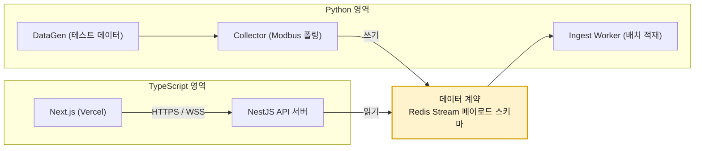
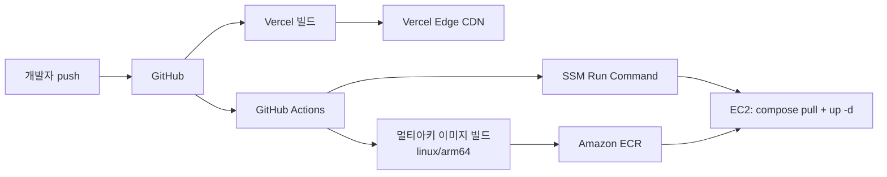

# 기술 스택 설계서

> 프로젝트: PLC 대용량 시계열 + 업무 데이터 분리 처리 웹 시스템
> 목적: PostgreSQL(OLTP) / ClickHouse(OLAP) / Redis(중간 계층) 폴리글랏 구조의 부하·성능 특성 학습
> 작성일: 2026-09-09

---

## 1. 전제 조건과 설계 목표

| 구분 | 내용 |
|---|---|
| 데이터 원천 | 현장 PLC(Modbus TCP). 현 시점 실장비 접속 불가 → **시뮬레이터 + 테스트 데이터 생성기**로 대체 |
| 데이터 성격 A | 업무 데이터. 낮은 볼륨, 높은 정합성, 잦은 갱신 → 관계형 |
| 데이터 성격 B | PLC 태그 데이터. 초당 수천~수십만 포인트, 추가 전용(append-only), 시간 범위 집계 → 컬럼형 |
| 중간 계층 | Redis. 단순 캐시가 아니라 **수집 버퍼 + 캐시 + 실시간 팬아웃**의 3중 역할 |
| 프론트엔드 배포 | Vercel |
| 백엔드·DB 배포 | Docker Compose → AWS EC2 단일 호스트(초기) |
| 최우선 목표 | 처리량·지연·자원 사용량을 **측정 가능한 형태**로 만들고 병목을 재현하는 것 |
| 비목표 | 상용 MES/SCADA 수준의 기능 완성도, 고가용성 클러스터 구성(로드맵 후반으로 유예) |

설계 원칙 4가지:

1. **쓰기 경로와 읽기 경로를 물리적으로 분리한다.** 수집이 폭주해도 조회 API가 죽지 않아야 한다.
2. **경계는 데이터 계약으로만 결합한다.** 서비스 간 통신은 Redis Stream 페이로드 스키마 하나로 고정하고, 언어·런타임 선택은 각 서비스의 자유로 둔다.
3. **모든 구간에 계측점을 심는다.** 측정할 수 없는 구조는 학습 대상이 아니다.
4. **단일 호스트에서 시작해 병목이 실측될 때만 쪼갠다.** 처음부터 분산하면 무엇이 병목인지 배울 수 없다.

---

## 2. 최종 스택 요약

| 레이어 | 선택 | 버전 기준 | 핵심 선정 이유 |
|---|---|---|---|
| 프론트엔드 | Next.js (App Router) + TypeScript | 15.x | Vercel 1급 지원, Route Handler를 BFF로 활용 가능 |
| 차트 | uPlot (주력) + Apache ECharts (보조) | uPlot 1.6 / ECharts 5.5 | 10만 포인트 이상 시계열을 60fps로 그리는 유일한 실용 조합 |
| 서버 상태 | TanStack Query | 5.x | 브라우저 캐시 ↔ Redis 캐시의 2단 캐시 구조를 실습하기 좋음 |
| API 서버 | **NestJS + Fastify 어댑터** | Nest 11.x / Node 22 LTS | 프론트와 타입 공유, 모듈·DI 구조가 학습 문서화에 유리 |
| 데이터 평면 | **Python 3.13 + asyncio** | - | pymodbus·numpy 생태계. 수집/적재/생성기 3종 담당 |
| OLTP | PostgreSQL | 18.x | 업무 데이터의 정합성·제약조건·트랜잭션 |
| 커넥션 풀 | PgBouncer | 1.23 | transaction 모드로 커넥션 폭발 차단 |
| OLAP | ClickHouse | 25.8 LTS 이상 | 단일 노드 100만 rows/s급 삽입, 10~30배 압축, 시계열 집계 |
| 스트림·캐시 | Redis (인스턴스 2개 분리) | 8.x | Streams(버퍼) / String·Hash(캐시) / Pub-Sub(팬아웃) |
| 산업 프로토콜 | pymodbus (클라이언트 + 서버 시뮬레이터) | 3.9+ | Modbus TCP 서버 시뮬레이터를 라이브러리 내장으로 제공 |
| 리버스 프록시 | Caddy | 2.8 | Let's Encrypt 자동 발급·갱신. 학습 단계에서 ALB보다 저렴·단순 |
| 부하 생성 | k6 | v1.x | 낮은 자원으로 고RPS, 시나리오 표현력, CI 통합 |
| 메트릭 | Prometheus + Grafana | 3.x / 12.x | 각 DB 공식 exporter 존재 |
| 트레이싱 | OpenTelemetry + Tempo | - | E2E 지연 분해(Phase 4) |
| 컨테이너 | Docker + Docker Compose v2 | - | 단일 호스트 오케스트레이션으로 충분 |
| 클라우드 | AWS EC2 + EBS gp3 + Route 53 | - | DB 튜닝 파라미터를 직접 만질 수 있는 IaaS |

---

## 3. 백엔드 언어 결정: NestJS vs Python

### 3.1 두 축의 요구가 서로 다르다

이 시스템의 백엔드는 성격이 전혀 다른 두 덩어리로 나뉜다.

| 축 | 요구사항 | 유리한 런타임 |
|---|---|---|
| **제어 평면** (REST/WebSocket API, 인증, 업무 CRUD) | 타입 안전성, 프론트와의 계약 공유, 미들웨어 생태계, IO 바운드 동시성 | NestJS |
| **데이터 평면** (Modbus 폴링, 배치 적재, 테스트 데이터 생성) | Modbus 라이브러리 성숙도, 수치 연산 벡터화, 배열 직렬화 성능 | Python |

### 3.2 비교표

| 평가 항목 | NestJS (Node 22) | Python 3.13 (FastAPI/asyncio) | 우위 |
|---|---|---|---|
| 프론트와 타입 공유 | 동일 TypeScript. zod 스키마 또는 DTO를 패키지로 공유 | OpenAPI 코드젠 경유 필요 | NestJS |
| HTTP 처리량(단순 JSON) | Fastify 어댑터 기준 약 3~5만 RPS | uvicorn 기준 약 1~2만 RPS | NestJS |
| 구조·DI·모듈화 | 프레임워크가 강제. 문서화·리팩터링에 유리 | 컨벤션 의존 | NestJS |
| Modbus 라이브러리 | modbus-serial. 클라이언트 위주, 서버 시뮬레이터 기능 빈약 | pymodbus. 비동기 클라이언트 + **서버 시뮬레이터 내장** | Python |
| 테스트 데이터 생성 | 루프 기반. 수십만 포인트/초 생성 시 CPU 부담 | numpy 벡터 연산으로 한 번에 배열 생성 | Python |
| ClickHouse 드라이버 | 공식 clickhouse-js (HTTP) | 공식 clickhouse-connect. Arrow/Parquet 직삽입 지원 | Python |
| CPU 바운드 병렬성 | worker_threads. 단일 스레드 이벤트 루프가 기본 | GIL 존재. 단 3.13 free-threaded 빌드 실험 가능 | 무승부 |
| 학습 곡선 | 데코레이터·DI 개념 필요 | 낮음 | Python |
| 컨테이너 이미지 크기 | 약 150~250 MB | 약 120~200 MB | 무승부 |

### 3.3 결론: 하이브리드 채택



**결정: 제어 평면은 NestJS, 데이터 평면은 Python.**

근거:

1. 두 영역은 HTTP로 직접 호출하지 않는다. **Redis Stream과 DB만 공유**하므로 언어 결합도가 0에 가깝다. 폴리글랏의 대표적 비용인 "런타임 간 RPC 계약 관리"가 발생하지 않는다.
2. Modbus 시뮬레이터를 직접 띄워야 하는 프로젝트다. pymodbus는 클라이언트와 서버를 한 라이브러리로 제공하므로 시뮬레이터-수집기 쌍을 동일 코드베이스에서 관리할 수 있다.
3. 부하 테스트에서 데이터 생성기가 병목이 되면 측정 자체가 무의미해진다. numpy로 초당 수백만 포인트를 배열 단위로 만들어내는 쪽이 안전하다.
4. 프론트가 Next.js로 확정된 이상, API 응답 타입을 TypeScript로 공유하면 계약 불일치 버그가 사라진다.

**감수해야 할 비용**과 완화책:

| 비용 | 완화책 |
|---|---|
| 런타임 2종 관리 | Docker 멀티 스테이지 빌드로 각각 독립. 로컬 개발은 Compose 하나로 통합 |
| 린터·포매터·CI 파이프라인 이원화 | Biome(TS) + ruff(Python), GitHub Actions 잡을 매트릭스로 분리 |
| 팀 온보딩 부담 | 경계를 문서 1장(데이터 계약)으로 고정. 신규 인원은 한쪽만 봐도 작업 가능 |
| 스키마 정의 중복 | Stream 페이로드는 MessagePack + 스키마 문서로 단일 정의, 양쪽에서 코드 생성 |

### 3.4 단일 언어로 줄이고 싶다면

| 대안 | 구성 | 언제 선택하나 | 잃는 것 |
|---|---|---|---|
| Python 단일 | FastAPI가 API까지 담당 | 혼자 학습하고 TypeScript 경험이 적을 때 | 프론트 타입 공유, API 처리량 |
| NestJS 단일 | modbus-serial + Node 워커로 수집까지 | TypeScript만 쓰고 싶고 Modbus 시뮬레이터를 별도 도구(예: ModbusPal, diagslave)로 대체할 때 | numpy 기반 대량 데이터 생성 편의성 |

Phase 0(로컬 단일 노드 검증)까지는 Python 단일로 시작하고, Phase 2에서 API만 NestJS로 분리해도 좋다. 데이터 계약을 먼저 고정해두면 이 전환 비용이 거의 없다.

---

## 4. 프론트엔드

### 4.1 Next.js vs React + Vite

| 항목 | Next.js (App Router) | React + Vite |
|---|---|---|
| Vercel 배포 | 제로 설정. 프리뷰 배포·이미지 최적화·에지 캐시 자동 | 정적 SPA로 배포 가능. 기능은 제한적 |
| BFF 계층 | Route Handler로 토큰 은닉·CORS 우회 가능 | 없음. 브라우저가 EC2 API를 직접 호출 |
| SSR/RSC | 지원 | 없음 |
| 실시간 대시보드 적합성 | 차트는 어차피 클라이언트 컴포넌트 → SSR 이점 제한적 | 동등 |
| 빌드·개발 서버 속도 | 보통 | 매우 빠름 |
| 번들 크기 | 상대적으로 큼 | 작음 |
| 학습 가치 | RSC·캐싱 계층 이해 필요 | 낮음 |

**선택: Next.js.** 결정적 이유는 SSR이 아니라 **Route Handler를 BFF로 쓸 수 있다는 점**이다. 리프레시 토큰을 브라우저에 노출하지 않고, 목록 조회 같은 저빈도 요청은 Vercel 에지에서 짧게 캐싱해 EC2 부하를 줄일 수 있다. 다만 **고빈도 실시간 데이터는 반드시 브라우저 → EC2 직결**로 처리한다(5.3절 참고).

### 4.2 시각화 라이브러리

| 라이브러리 | 1만 포인트 | 10만 포인트 | 특징 | 용도 |
|---|---|---|---|---|
| Recharts | 무난 | 사실상 불가 | SVG 기반, DOM 노드 폭증 | 소형 KPI 카드 |
| Chart.js | 양호 | 버벅임 | Canvas | 일반 차트 |
| Apache ECharts | 양호 | large 모드로 가능 | dataZoom, 브러시, 풍부한 인터랙션 | 분석 화면 |
| **uPlot** | 즉시 | **부드러움** | 초경량 Canvas(약 45KB), 시계열 특화 | 실시간 트렌드 차트 |

**선택: uPlot 주력 + ECharts 보조.** PLC 트렌드 화면은 한 태그당 수만 포인트를 그리므로 uPlot이 사실상 유일한 선택지다. 단, 서버에서 이미 다운샘플링(ClickHouse 롤업 테이블)해서 내려주는 것이 우선이고 uPlot은 그 다음 방어선이다.

### 4.3 기타 프론트엔드 구성

| 영역 | 선택 | 이유 |
|---|---|---|
| 서버 상태 | TanStack Query | staleTime/gcTime을 Redis TTL과 맞춰 2단 캐시 실험 가능 |
| 클라이언트 상태 | Zustand | 실시간 태그 값 스토어. Redux 대비 보일러플레이트 최소 |
| 실시간 채널 | 네이티브 WebSocket + 재연결 래퍼 | Socket.IO는 프로토콜 오버헤드가 있어 고빈도 푸시에 불리 |
| 스타일 | Tailwind CSS + shadcn/ui | 대시보드 레이아웃을 빠르게 |
| 폼·검증 | React Hook Form + zod | zod 스키마를 NestJS DTO와 공유 |
| 타입 공유 | pnpm workspace의 packages/shared | API 응답 타입 단일 출처 |

---

## 5. 데이터 저장소

### 5.1 PostgreSQL — 업무 데이터의 단일 진실 원천

| 항목 | 내용 |
|---|---|
| 버전 | 18.x |
| 담당 데이터 | 사용자·권한, 사이트/라인/설비 마스터, **태그 마스터**, Modbus 접속 설정, 작업지시, 알람 규칙, 알람 이벤트, 감사 로그 |
| 핵심 확장 | pg_stat_statements(쿼리 통계), pg_partman(알람 이벤트 월 파티션), auto_explain(느린 쿼리 계획 로깅) |
| 커넥션 관리 | PgBouncer transaction 모드. 애플리케이션 풀 크기와 실제 PG 커넥션을 분리 |
| 마이그레이션 | Prisma Migrate 또는 node-pg-migrate. 스키마 소유권은 NestJS 쪽에 둔다 |
| 왜 여기에 시계열을 넣지 않나 | 행 기반 저장이라 1억 행 이상에서 범위 집계 스캔 비용이 급격히 증가. autovacuum·WAL 증폭 부담도 크다 |

**핵심 설계 포인트:** 태그 마스터를 PostgreSQL이 소유하고, ClickHouse는 이를 Dictionary로 당겨 쓴다. 두 DB 간 조인 문제를 구조적으로 해결하는 지점이다(architecture.md 12절).

### 5.2 ClickHouse — 시계열 저장·집계 엔진

시계열 저장소 후보 비교:

| 항목 | ClickHouse | TimescaleDB | InfluxDB 3 | PostgreSQL 단독 |
|---|---|---|---|---|
| 단일 노드 삽입 처리량 | 100만+ rows/s | 10만~50만 rows/s | 수십만 rows/s | 1만~5만 rows/s |
| 압축률(실측 통상) | 10~30배 | 5~15배 | 10~20배 | 1~3배 |
| 대규모 범위 집계 | 최상 | 중상 | 상 | 하 |
| SQL | 방언(표준에 근접) | 완전 PostgreSQL 호환 | SQL + InfluxQL | 표준 |
| UPDATE/DELETE | 비동기 mutation. 사실상 비권장 | 완전 지원 | 제한적 | 완전 지원 |
| 사전 집계 | Materialized View + AggregatingMergeTree | 연속 집계(continuous aggregate) | 다운샘플링 태스크 | 수동 |
| 운영 복잡도 | 중 | 낮음(PG 확장) | 중 | 낮음 |
| 학습 가치 | 컬럼형·머지트리·코덱·MV 전반 | PG 심화 | 시계열 DB 특화 | 낮음 |

**선택: ClickHouse.** TimescaleDB는 "PostgreSQL 하나만 배우게 되어" 이 프로젝트의 학습 목표(이종 DB 분리 운용)와 어긋난다. 삽입 처리량 한계에 도달하는 지점을 실측하려는 목적에도 ClickHouse가 헤드룸이 넓어 유리하다.

주요 활용 기능:

| 기능 | 용도 |
|---|---|
| MergeTree + PARTITION BY 일자 | 원시 태그 데이터. 파티션 단위 TTL 삭제 |
| CODEC(Delta, ZSTD) / CODEC(Gorilla) | 타임스탬프·측정값 압축. 압축률 실험 대상 |
| AggregatingMergeTree + Materialized View | 1초 → 1분 → 1시간 → 1일 롤업 캐스케이드 |
| Dictionary (PostgreSQL 소스) | 태그·설비 메타데이터 조인 |
| async_insert | 소규모 다중 클라이언트 삽입 시 파트 폭증 방지 |
| system.query_log, system.parts, system.asynchronous_metrics | 성능 분석의 1차 데이터 |

### 5.3 Redis — 서버와 DB 사이의 3중 계층

Redis를 "그냥 캐시"로 두지 않고 역할별로 분해한다.

| 역할 | 자료구조 | 왜 Redis인가 |
|---|---|---|
| 수집 버퍼 | Stream + Consumer Group | 수집 속도와 적재 속도를 분리(백프레셔 흡수) |
| 최신값 저장소 | Hash | "현재 값" 조회에 ClickHouse를 때리면 안 된다. 마이크로초 응답 |
| 조회 캐시 | String(압축 JSON) | 동일 시간 범위 반복 조회를 흡수. cache-aside |
| 실시간 팬아웃 | Pub/Sub | WebSocket 다중 인스턴스 브로드캐스트 |
| 마스터 캐시 | Hash | 태그 메타를 수집기가 매 포인트마다 PG에서 읽지 않도록 |
| 레이트 리밋 | String + Lua | Vercel은 고정 IP가 없어 IP 화이트리스트 불가 → 토큰 기반 제한 필수 |
| 분산 락 | SET NX PX | 캐시 스탬피드 방지, 롤업 잡 단일 실행 보장 |
| 세션·리프레시 토큰 | String(TTL) | 즉시 무효화 가능한 토큰 저장소 |

**중요한 구조적 결정: Redis 인스턴스를 2개로 분리한다.**

| 인스턴스 | 용도 | maxmemory-policy | 이유 |
|---|---|---|---|
| redis-stream | Stream 버퍼, DLQ | **noeviction** | 수집 데이터는 절대 evict되면 안 된다. 메모리가 차면 XADD가 실패해야 하고, 그 실패를 백프레셔 신호로 쓴다 |
| redis-cache | 조회 캐시, 세션, 최신값, 락 | **allkeys-lru** | 캐시는 밀려나도 무방 |

한 인스턴스에 섞으면 정책 충돌이 발생한다. allkeys-lru로 두면 메모리 압박 시 **수집 스트림이 조용히 삭제되어 데이터가 유실**되고, noeviction으로 두면 캐시 증가만으로 수집이 멈춘다. 이 함정을 직접 재현해보는 것도 학습 항목이다.

Redis Streams vs 메시지 브로커:

| 항목 | Redis Streams | Kafka | RabbitMQ |
|---|---|---|---|
| 도입 비용 | 이미 캐시로 쓰므로 0 | 별도 클러스터 + ZK/KRaft | 중 |
| 단일 노드 처리량 | 수십만 msg/s | 수백만 msg/s | 수만 msg/s |
| 보존 | 메모리 기반, MAXLEN 트리밍 | 디스크, 장기 보존 | 소비 후 삭제 |
| 재처리 | 트림 범위 내에서만 | 오프셋 자유 이동 | 어려움 |
| ClickHouse 네이티브 연동 | 없음(워커 필요) | Kafka 엔진 내장 | RabbitMQ 엔진 내장 |
| EC2 단일 호스트 적합성 | 높음 | 낮음(메모리 과다) | 중 |

**선택: Redis Streams.** "Redis를 서버와 DB 사이에 끼워넣는다"는 요구사항에 정확히 부합하고, 단일 EC2에 Kafka까지 올리면 메모리가 남지 않는다. 다만 **Kafka 전환 경로를 열어둔다** — Ingest Worker의 소스 인터페이스를 추상화해두면 나중에 ClickHouse Kafka 엔진으로 워커 자체를 제거하는 실험이 가능하다.

---

## 6. 산업 프로토콜 계층

| 구성요소 | 선택 | 설명 |
|---|---|---|
| Modbus 클라이언트 | pymodbus 3.9+ AsyncModbusTcpClient | 설비당 1커넥션, 스캔 그룹별 폴링 루프 |
| Modbus 서버 시뮬레이터 | pymodbus StartAsyncTcpServer | 설비 1대 = 포트 1개. 데이터 블록을 DataGen이 주기적으로 갱신 |
| 대안 시뮬레이터 | diagslave, ModbusPal | 언어 무관 검증용 보조 |

Modbus 매핑에서 다뤄야 할 항목(태그 마스터에 저장):

| 필드 | 값 예시 | 설명 |
|---|---|---|
| function_code | 3, 4, 1, 2 | Holding / Input Register, Coil / Discrete Input |
| address | 0 기반 정수 | 레지스터 시작 주소 |
| data_type | UINT16, INT16, UINT32, INT32, FLOAT32, FLOAT64, BOOL | 디코딩 규칙 |
| word_order | ABCD, CDAB, BADC, DCBA | 32비트 이상 값의 워드/바이트 순서. 실무 최대 함정 |
| scale, offset | 0.1, -40 | 공학 단위 변환식: eng = raw × scale + offset |
| deadband | 0.5 | 변화량이 이보다 작으면 전송 생략(대역폭 최적화 실험용) |
| scan_rate_ms | 100, 1000 | 폴링 주기. 같은 주기끼리 스캔 그룹으로 묶음 |

프로토콜 제약 중 성능에 직결되는 것: **FC03 한 요청당 최대 125 레지스터.** 태그 주소가 흩어져 있으면 요청 수가 폭증하므로, 연속 주소 블록으로 병합하는 로직(register block coalescing)이 수집기의 핵심 최적화 지점이다.

---

## 7. 테스트 데이터 생성기

실데이터가 없으므로 생성기의 품질이 곧 실험의 품질이다. 두 가지 주입 경로를 모두 구현한다.

| 경로 | 흐름 | 목적 |
|---|---|---|
| A. 현실 재현 | DataGen → Modbus 시뮬레이터 레지스터 갱신 → Collector 폴링 → Stream | Modbus 계층 포함 E2E 지연 측정 |
| B. 고부하 주입 | DataGen → Stream 직접 XADD (또는 API의 bulk ingest 엔드포인트) | Modbus 병목을 우회하고 DB 한계만 측정 |

신호 프로파일:

| 프로파일 | 생성 규칙 | 모사 대상 | 압축 특성 |
|---|---|---|---|
| SINE | A·sin(2πt/T) + B + 노이즈 | 온도, 압력의 주기 변동 | 중간 |
| RANDOM_WALK | v(t) = v(t−1) + N(0, σ) | 유량, 탱크 레벨 | 낮음(압축 안 됨) |
| RAMP | 선형 증가 후 리셋 | 누적 카운터 | 매우 높음(Delta 코덱) |
| STEP | 구간별 상수 | 설정값, 운전 모드 | 매우 높음 |
| BINARY | 베르누이 토글 | 가동/정지, 알람 비트 | 매우 높음 |
| COUNTER | 단조 증가, UInt32 랩어라운드 | 생산 수량 | 매우 높음 |
| SPIKE | 기저값 + 확률적 이상치 | 알람 트리거 유발 | 중간 |
| DROPOUT | 확률적 결측 + 품질 코드 BAD | 통신 장애 | - |

프로파일별 압축률 차이를 실측하는 것 자체가 ClickHouse 코덱 학습의 핵심이다. RANDOM_WALK만으로 채운 데이터셋과 STEP 위주 데이터셋의 디스크 사용량 차이는 5배 이상 벌어진다.

생성기 요구사항:

- **시드 고정**으로 재현 가능한 데이터셋 생성
- **시간 압축 모드(backfill)**: 과거 30일치를 수 분 내에 생성해 대용량 조회 성능 테스트용 데이터 확보
- **numpy 벡터 생성**: 태그 N개 × 시점 M개를 2차원 배열로 한 번에 만들고 컬럼 단위로 직렬화
- 생성 데이터에는 항상 품질 코드 SIMULATED(9)를 표기해 실데이터와 구분

---

## 8. 부하 테스트 도구

| 도구 | 실행 계층 | 강점 | 약점 | 본 프로젝트 역할 |
|---|---|---|---|---|
| **k6** | HTTP/WS | 낮은 자원으로 고RPS, JS 시나리오, Prometheus 리모트 라이트 | 복잡한 상태 유지 시 코드 증가 | **주력.** API 조회·쓰기 부하 |
| Locust | HTTP | Python 재사용, 분산 모드 | 워커 자원 소모 큼 | 보조 |
| clickhouse-benchmark | ClickHouse 네이티브 | HTTP 계층 제외한 순수 DB 성능 | API 경로 미포함 | DB 단독 상한 측정 |
| pgbench | PostgreSQL 네이티브 | 동일 | 동일 | 동일 |
| redis-benchmark | Redis 네이티브 | 동일 | 동일 | 동일 |
| 자체 ingest-bench | Python | Stream 주입 처리량 측정 | 직접 구현 | 수집 경로 상한 측정 |

**측정 원칙: 부하 생성기는 대상 호스트에서 실행하지 않는다.** 같은 EC2에서 k6를 돌리면 CPU 경합으로 측정값이 왜곡된다. 별도 t3.medium 인스턴스 또는 로컬 머신에서 실행한다.

테스트 시나리오 유형:

| 시나리오 | 부하 패턴 | 확인 대상 |
|---|---|---|
| Baseline | 고정 저부하 10분 | 정상 상태 p50/p95, 자원 사용률 기준선 |
| Ramp-up | 0 → 목표까지 선형 증가 | 성능이 꺾이는 변곡점 |
| Spike | 순간 10배 급증 후 복귀 | Redis 버퍼 흡수력, 복구 시간 |
| Soak | 목표 부하 2~6시간 | 메모리 누수, ClickHouse 파트 누적, 디스크 증가율 |
| Breakpoint | 실패할 때까지 증가 | 시스템 상한과 최초 실패 지점 |
| Failure injection | 컨테이너 강제 중단 | 백프레셔·재시도·DLQ 동작 |

---

## 9. 관측성

| 대상 | 수집 방식 | 핵심 메트릭 |
|---|---|---|
| NestJS API | prom-client 미들웨어 | RPS, 응답시간 p50/p95/p99, 5xx율, 이벤트 루프 지연 |
| Collector | prometheus_client 커스텀 | 폴링 소요시간, 타임아웃율, 초당 포인트, 스캔 주기 지연 |
| Ingest Worker | prometheus_client 커스텀 | 배치 크기, 삽입 지연, XACK 지연, **컨슈머 랙**, 재시도·DLQ 건수 |
| Redis | redis_exporter | 메모리, ops/s, 스트림 길이, 캐시 히트율, evicted_keys |
| PostgreSQL | postgres_exporter + pg_stat_statements | TPS, 버퍼 히트율, 락 대기, 느린 쿼리 Top-N, 커넥션 수 |
| ClickHouse | 내장 Prometheus 엔드포인트(9363) + system 테이블 | 초당 삽입 행수, 활성 파트 수, 머지 큐, 쿼리 시간, 압축률 |
| 호스트 | node_exporter + cAdvisor | CPU, 메모리, 디스크 IOPS/처리량, 네트워크 |
| E2E 추적 | OpenTelemetry → Tempo | 요청 1건의 구간별 지연 분해 |

**가장 중요한 단일 지표: 컨슈머 랙(Stream 길이 − 처리 완료 오프셋).** 이 값이 지속 증가하면 적재가 수집을 따라가지 못한다는 뜻이며, 모든 부하 테스트의 판정 기준이 된다.

관측 스택을 대상 호스트에 함께 올리면 부하 테스트 결과가 왜곡된다. Phase 3 이후에는 Grafana Cloud 무료 티어 또는 별도 t3.small로 분리한다.

---

## 10. 인프라: Docker + AWS EC2 + Vercel

### 10.1 배포 경계

| 구성요소 | 배포처 | 이유 |
|---|---|---|
| Next.js 프론트엔드 | Vercel | 자동 배포, 에지 CDN, 프리뷰 환경 |
| NestJS API, Collector, Ingest Worker, DataGen | EC2 / Docker | DB와 같은 호스트에 두어 네트워크 지연 최소화 |
| PostgreSQL, ClickHouse, Redis ×2 | EC2 / Docker | 튜닝 파라미터를 직접 제어. RDS는 파라미터 제약 |
| Modbus 시뮬레이터 | EC2 / Docker | Collector와 동일 네트워크 |
| Prometheus, Grafana | EC2 / Docker (Phase 3부터 분리) | - |
| k6 부하 생성기 | 별도 인스턴스 또는 로컬 | 측정 왜곡 방지 |

### 10.2 EC2 인스턴스 사양

| 단계 | 인스턴스 | vCPU / RAM | 데이터 EBS | 월 예상 비용(서울, 온디맨드) | 감당 가능한 부하 |
|---|---|---|---|---|---|
| Phase 0~1 개발 | t3.large | 2 / 8 GB | gp3 100 GB | 약 $70 | 수백 pps |
| **Phase 2~4 기본(권장)** | **m7g.xlarge (Graviton)** | 4 / 16 GB | gp3 200 GB, 6000 IOPS | 약 $165 | 1만~3만 pps |
| Phase 5 고부하 버스트 | c7g.2xlarge 스팟 | 8 / 16 GB | gp3 500 GB, 12000 IOPS | 시간당 약 $0.13(스팟) | 10만+ pps |
| 이상적(참고) | i4g.xlarge (로컬 NVMe) | 4 / 32 GB | 인스턴스 스토어 937 GB | 약 $290 | ClickHouse에 최적. 종료 시 데이터 소멸 주의 |

- **Graviton(arm64) 권장.** PostgreSQL·ClickHouse·Redis·Node·Python 모두 공식 arm64 이미지를 제공하며, 동급 x86 대비 약 20% 저렴하다. 단 Compose 파일에 platform을 명시하고 멀티아키 이미지 여부를 사전 확인해야 한다.
- **EBS는 gp3를 쓰되 IOPS와 처리량을 별도 프로비저닝**한다. gp2는 용량에 IOPS가 종속되어 튜닝 실험이 불가능하다. 기본 3000 IOPS / 125 MB/s로는 ClickHouse 머지와 PostgreSQL WAL이 경합하면 부족하다.
- 비용 절감: 부하 테스트할 때만 인스턴스를 기동한다. 하루 4시간 사용 시 요금은 약 1/6로 떨어진다. EBS 요금은 정지 상태에서도 계속 발생한다.

### 10.3 스토리지 레이아웃

| 마운트 | 볼륨 | 용도 | 비고 |
|---|---|---|---|
| / | 루트 gp3 30 GB | OS, Docker 이미지 | 인스턴스 교체 시 폐기 |
| /data/clickhouse | 데이터 gp3 | ClickHouse 데이터·로그 | 가장 큰 소비자 |
| /data/postgres | 데이터 gp3 | PGDATA | WAL 분리도 실험 가능 |
| /data/redis | 데이터 gp3 | AOF/RDB | redis-cache는 영속화 끄기 |
| /data/backup | 별도 또는 S3 | 스냅샷·덤프 | S3 동기화 권장 |

데이터 볼륨을 루트와 분리하는 이유: 인스턴스를 교체하거나 타입을 바꿀 때 볼륨만 재연결하면 데이터가 보존되고, EBS 스냅샷으로 실험 전 상태를 저장해 두었다가 되돌릴 수 있다. 부하 테스트를 반복하려면 이 롤백 능력이 필수적이다.

### 10.4 네트워크·보안 그룹

| 포트 | 프로토콜 | 소스 | 용도 |
|---|---|---|---|
| 443 | TCP | 0.0.0.0/0 | HTTPS API, WSS |
| 80 | TCP | 0.0.0.0/0 | Let's Encrypt 챌린지 및 443 리다이렉트 |
| 22 | TCP | **닫음** | SSM Session Manager로 대체 |
| 5432, 8123, 9000, 6379, 6380, 9090, 3000 | TCP | **외부 노출 금지** | Docker 내부 네트워크 전용. 접근은 SSM 포트 포워딩 |

- **Vercel은 고정 아웃바운드 IP가 없다**(Enterprise Secure Compute 제외). 따라서 IP 화이트리스트로 API를 보호할 수 없고, JWT 인증 + Origin 검증 + Redis 레이트 리밋이 실질적 방어선이 된다.
- **Vercel 서버리스 함수에서 EC2의 DB에 직접 접속하지 않는다.** 함수 인스턴스가 스케일아웃할 때 커넥션이 폭발한다. 모든 데이터 접근은 NestJS API를 경유한다.
- 도메인을 정렬하면 쿠키 처리가 쉬워진다: 프론트를 app.example.com, API를 api.example.com에 두면 eTLD+1이 같아 SameSite=Lax 쿠키가 동작하고 CSRF 방어가 단순해진다. 도메인이 완전히 다르면 SameSite=None + Secure가 강제되어 방어 난이도가 올라간다.

### 10.5 TLS 종단: Caddy vs ALB

| 항목 | Caddy on EC2 | Application Load Balancer |
|---|---|---|
| 월 비용 | $0 | 약 $18 + LCU 요금 |
| 인증서 | Let's Encrypt 자동 발급·갱신 | ACM 무료, 자동 갱신 |
| WebSocket | 지원 | 지원(유휴 타임아웃 조정 필요) |
| 다중 인스턴스 분산 | 불가 | 가능 |
| 설정 난이도 | Caddyfile 몇 줄 | 타겟 그룹·리스너·헬스체크 |

**선택: Caddy.** 단일 EC2 구조에서 ALB는 비용만 늘린다. 수평 확장 실험 단계(Phase 5)에 도달하면 ALB로 교체한다.

### 10.6 배포 파이프라인

| 단계 | 프론트엔드 | 백엔드 |
|---|---|---|
| Phase 0~2 | GitHub 연동 Vercel 자동 배포 | EC2에서 git pull 후 docker compose up -d --build |
| Phase 3+ | 동일 + 프리뷰 환경 분리 | GitHub Actions → ECR 푸시 → SSM Run Command로 무중단 배포 |

Phase 3 이후 파이프라인:



### 10.7 비용 요약 (서울 리전, 월 기준, 대략치)

| 항목 | 사양 | 상시 가동 | 하루 4시간 가동 |
|---|---|---|---|
| EC2 m7g.xlarge | 4 vCPU / 16 GB | 약 $165 | 약 $28 |
| EBS gp3 200 GB + 6000 IOPS | - | 약 $28 | 약 $28 (정지 중에도 과금) |
| 퍼블릭 IPv4 주소 | 1개 | 약 $4 | 약 $4 |
| 데이터 전송 아웃 | 50 GB | 약 $6 | 약 $2 |
| Route 53 호스팅 존 | 1개 | $0.5 | $0.5 |
| Vercel | Hobby | $0 | $0 |
| **합계** | | **약 $203** | **약 $62** |

실제 요금은 리전·시점·사용 패턴에 따라 달라지므로 착수 전 AWS 요금 계산기로 재확인한다. 학습 목적이라면 **부하 테스트 세션 단위로 기동/정지하는 운영 습관** 자체를 파이프라인에 넣는 것을 권한다.

---

## 11. 개발 도구

| 영역 | TypeScript 측 | Python 측 |
|---|---|---|
| 패키지 관리 | pnpm (workspace 모노레포) | uv |
| 린트·포맷 | Biome | ruff |
| 타입 검사 | tsc strict | mypy strict |
| 테스트 | Vitest, Supertest | pytest, pytest-asyncio |
| 통합 테스트 환경 | Testcontainers for Node | testcontainers-python |
| 마이그레이션 | Prisma Migrate (PostgreSQL) | ClickHouse는 SQL 파일 순번 관리 |
| 공통 | pre-commit 훅, Taskfile, .env.example, GitHub Actions 매트릭스 잡 | |

모노레포 구조 제안:

```text
db_study/
├─ apps/
│  ├─ web/            Next.js (Vercel 배포)
│  ├─ api/            NestJS
│  ├─ collector/      Python, Modbus 폴링
│  ├─ ingest/         Python, Stream → ClickHouse
│  ├─ datagen/        Python, 테스트 데이터 생성
│  └─ modbus-sim/     Python, pymodbus 서버
├─ packages/
│  └─ shared/         zod 스키마, API 타입, Stream 페이로드 정의
├─ infra/
│  ├─ compose/        docker-compose.yml, 환경별 오버라이드
│  ├─ clickhouse/     DDL, 설정, Dictionary 정의
│  ├─ postgres/       초기화 SQL, postgresql.conf
│  ├─ redis/          redis-stream.conf, redis-cache.conf
│  ├─ caddy/          Caddyfile
│  └─ observability/  prometheus.yml, Grafana 대시보드 JSON
├─ loadtest/          k6 시나리오
└─ docs/              tech_stack.md, architecture.md, data_flow.md
```

---

## 12. 버전 고정표

| 구성요소 | 고정 버전 기준 | 비고 |
|---|---|---|
| Node.js | 22 LTS | NestJS 11 요구사항 충족 |
| NestJS | 11.x | Fastify 어댑터 사용 |
| Next.js | 15.x | App Router |
| Python | 3.13 | 3.14는 라이브러리 호환 확인 후 |
| PostgreSQL | 18-alpine | |
| ClickHouse | 25.8 LTS 이상 | LTS 트랙 고정 권장 |
| Redis | 8-alpine | Valkey 8.x로 대체 가능 |
| PgBouncer | 1.23 | |
| pymodbus | 3.9+ | 3.x에서 API가 크게 바뀌었으므로 메이저 고정 필수 |
| clickhouse-connect | 0.8+ | |
| Caddy | 2.8 | |
| Prometheus / Grafana | 3.x / 12.x | |
| k6 | v1.x | |

**모든 이미지는 태그를 명시하고 latest를 쓰지 않는다.** 성능 실험은 버전이 바뀌면 재현되지 않는다. 착수 시점에 각 프로젝트의 공식 릴리스 노트로 최신 안정 버전을 재확인하고 위 표를 갱신한 뒤 고정한다.

---

## 13. 채택하지 않은 기술과 이유

| 기술 | 검토 결과 | 사유 |
|---|---|---|
| Kafka | 보류 | 단일 EC2 16GB에서 메모리 과다. Redis Streams로 요구사항 충족. Phase 5 확장 옵션으로 유지 |
| TimescaleDB | 미채택 | 이종 DB 분리 운용이라는 학습 목표와 상충 |
| InfluxDB | 미채택 | SQL 학습 전이성이 낮고 ClickHouse 대비 집계 성능 열위 |
| Amazon RDS / Aurora | 미채택 | 파라미터 튜닝 제약. DB 내부 동작 학습이 목적이므로 직접 운영 |
| Kubernetes (EKS) | 미채택 | 단일 호스트에 오케스트레이션 계층은 과잉. 비용 대비 학습 효율 낮음 |
| ALB | Phase 5로 유예 | 단일 인스턴스에서는 Caddy로 충분 |
| gRPC 서비스 간 통신 | 불필요 | 서비스 경계가 Redis Stream이므로 RPC 자체가 없음 |
| Socket.IO | 미채택 | 고빈도 푸시에 프로토콜 오버헤드. 네이티브 WebSocket 사용 |
| Recharts | 보조 용도만 | 10만 포인트 시계열 렌더링 불가 |
| OPC UA | 범위 외 | 현장 요구는 Modbus. 추후 확장 시 수집기 어댑터 추가로 대응 |

---

## 14. 학습 로드맵

| Phase | 목표 | 산출물 | 성공 판정 기준 |
|---|---|---|---|
| **0. 로컬 골격** | Compose로 5개 저장소 컨테이너 기동, 스키마 생성 | docker-compose.yml, DDL | 모든 컨테이너 healthy, 수동 INSERT/SELECT 성공 |
| **1. 수집 파이프라인** | Modbus 시뮬레이터 → Collector → Stream → Ingest → ClickHouse 연결 | collector, ingest, modbus-sim | 250 pps 무손실 적재, 컨슈머 랙 0 유지 |
| **2. API + 프론트** | NestJS 조회/CRUD API, Next.js 대시보드, WebSocket 실시간 | api, web | 실시간 트렌드 차트 동작, Vercel 배포 완료 |
| **3. Redis 최적화** | cache-aside, 최신값 Hash, 스탬피드 방지, 캐시 히트율 계측 | 캐시 계층, Grafana 대시보드 | 반복 조회 히트율 80% 이상, p95 지연 절반 이하 |
| **4. 부하·성능 측정** | k6 시나리오 5종, 병목 식별과 튜닝 | loadtest, 성능 리포트 | Baseline·Ramp·Spike·Soak·Breakpoint 전부 실행, 변곡점 수치화 |
| **5. 장애·확장 실험** | 컨테이너 강제 중단, DLQ 복구, 롤업 MV, Kafka 전환 실험 | 장애 시나리오 문서 | ClickHouse 5분 중단 후 무손실 복구 확인 |

각 Phase 종료 시 **측정값을 문서에 기록**한다. 숫자 없는 Phase 완료는 인정하지 않는 것을 규칙으로 삼는다.

---

## 관련 문서

- architecture.md — 시스템 구조, 스키마 설계, 배포 토폴로지, 용량 산정
- data_flow.md — 데이터 흐름 시나리오별 상세, 지연 예산, 데이터 계약
