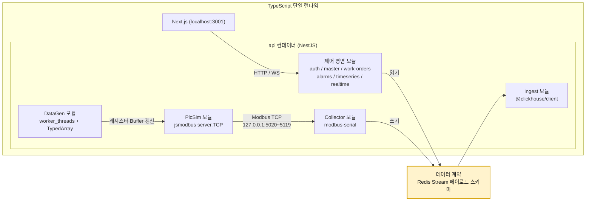
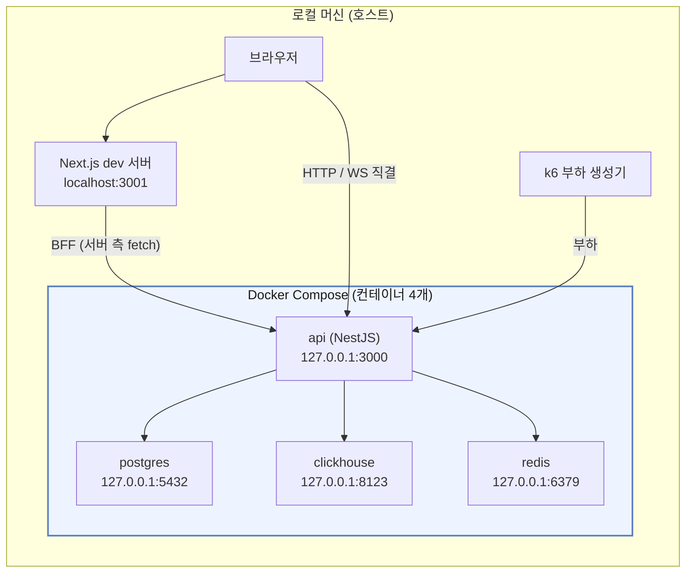

# 기술 스택 설계서

> 프로젝트: PLC 대용량 시계열 + 업무 데이터 분리 처리 웹 시스템
> 목적: PostgreSQL(OLTP) / ClickHouse(OLAP) / Redis(중간 계층) **폴리글랏 퍼시스턴스** 구조의 부하·성능 특성 학습
> 작성일: 2026-09-09
> 개정일: 2026-09-12 (로컬 전용 전환: 배포 구성 제거, Docker Compose 컨테이너 4개 + 호스트 Next.js)

---

## 1. 전제 조건과 설계 목표

| 구분 | 내용 |
|---|---|
| 데이터 원천 | 현장 PLC(Modbus TCP). 현 시점 실장비 접속 불가 → **시뮬레이터 + 테스트 데이터 생성기**로 대체 |
| 데이터 성격 A | 업무 데이터. 낮은 볼륨, 높은 정합성, 잦은 갱신 → 관계형 |
| 데이터 성격 B | PLC 태그 데이터. 초당 수천~수십만 포인트, 추가 전용(append-only), 시간 범위 집계 → 컬럼형 |
| 중간 계층 | Redis. 단순 캐시가 아니라 **수집 버퍼 + 캐시 + 실시간 팬아웃**의 3중 역할 |
| 실행 환경 | 개발자 **로컬 머신 1대**. Docker Compose 컨테이너 4개(**애플리케이션 1개(api) + 저장소 3개(postgres, clickhouse, redis)**) + 호스트에서 `pnpm dev`로 띄우는 Next.js |
| 프로토콜 | http / ws. TLS 없음. 호스트 publish는 전부 `127.0.0.1` 바인드 |
| 최우선 목표 | 처리량·지연·자원 사용량을 **측정 가능한 형태**로 만들고 병목을 재현하는 것 |
| 비목표 | 상용 MES/SCADA 수준의 기능 완성도, 고가용성 클러스터 구성(로드맵 후반으로 유예) |

설계 원칙 4가지:

1. **쓰기 경로와 읽기 경로를 분리한다.** 수집 파이프라인과 조회 API는 **모듈 경계와 Redis Stream 큐**로 분리하고, CPU 바운드 작업은 worker_threads로 격리한다. 프로세스·컨테이너 분리는 이벤트 루프 지연이 실측될 때 확장 로드맵 1단계(APP_ROLE 분리)로 수행한다. 이 원칙이 깨지면 수집 폭주가 이벤트 루프를 점유해 대시보드 응답이 느려진다.
2. **경계는 데이터 계약으로만 결합한다.** 모듈 간 통신은 Redis Stream 페이로드 스키마 하나로 고정하고, 모듈은 서로의 내부 구현을 알지 못한다. 이 덕분에 모듈을 별도 프로세스·컨테이너로 떼어낼 때 코드 변경이 없다.
3. **모든 구간에 계측점을 심는다.** 측정할 수 없는 구조는 학습 대상이 아니다.
4. **단일 호스트에서 시작해 병목이 실측될 때만 쪼갠다.** 처음부터 분산하면 무엇이 병목인지 배울 수 없다.

---

## 2. 최종 스택 요약

| 레이어 | 선택 | 버전 기준 | 핵심 선정 이유 |
|---|---|---|---|
| 프론트엔드 | Next.js (App Router) + TypeScript | 15.x | Route Handler를 BFF로 활용 가능, API와 타입을 그대로 공유 |
| 차트 | uPlot (주력) + Apache ECharts (보조) | uPlot 1.6 / ECharts 5.5 | 10만 포인트 이상 시계열을 60fps로 그리는 유일한 실용 조합 |
| 서버 상태 | TanStack Query | 5.x | 브라우저 캐시 ↔ Redis 캐시의 2단 캐시 구조를 실습하기 좋음 |
| API 서버 | **NestJS + Fastify 어댑터** | Nest 11.x / Node 22 LTS(22.15+) | 프론트와 타입 공유, 모듈·DI 구조가 학습 문서화에 유리 |
| 데이터 평면 | **NestJS 모듈 (api 컨테이너 내부, 동일 프로세스)** | - | Collector·PlcSim·Ingest·DataGen·Alarm을 모듈로 흡수. 모듈 경계는 Redis Stream |
| OLTP | PostgreSQL | 18.x | 업무 데이터의 정합성·제약조건·트랜잭션 |
| 커넥션 관리 | api in-process 풀 (pg Pool, max 20) | - | 단일 프로세스라 별도 풀러 불필요. PostgreSQL max_connections 100에 여유 |
| OLAP | ClickHouse | 25.8 LTS 이상 | 단일 노드 100만 rows/s급 삽입, 10~30배 압축, 시계열 집계 |
| 스트림·캐시 | Redis (**단일 인스턴스, volatile-lru**) | 8.x | Streams(버퍼) / String·Hash(캐시) / Pub-Sub(팬아웃). TTL 키만 evict |
| 산업 프로토콜 | modbus-serial(클라이언트) + jsmodbus(서버 시뮬레이터) | 8.x / 4.x | Modbus TCP 클라이언트와 PlcSim 서버를 모두 Node로 확보 |
| Node 데이터 평면 라이브러리 | @clickhouse/client, ioredis, modbus-serial, jsmodbus, msgpackr, piscina, prom-client | 1.x / 5.x / 8.x / 4.x / 1.x / 5.x / 15.x | 적재·스트림·프로토콜·직렬화·워커 풀·계측의 핵심 의존성 |
| 부하 생성 | k6 | v1.x | 낮은 자원으로 고RPS, 시나리오 표현력 |
| 메트릭 | Prometheus + Grafana (**`observability` 프로파일**) | 3.x / 12.x | 스크레이프 대상은 api의 `/metrics` 하나. 기본 기동에는 포함하지 않음 |
| 트레이싱 | OpenTelemetry + Tempo (**`observability` 프로파일**) | - | E2E 지연 분해(Phase 4 선택) |
| 컨테이너 | Docker + Docker Compose v2 | - | 로컬 머신 1대에 컨테이너 4개(api + 저장소 3). 버전 고정과 일괄 기동·정지가 목적 |

---

## 3. 백엔드 언어 결정: NestJS 단일 런타임

### 3.1 두 축의 요구가 서로 다르다

이 시스템의 백엔드는 성격이 전혀 다른 두 덩어리로 나뉜다. 런타임을 하나로 합치더라도 이 2축 구분은 **모듈 경계를 나누는 기준**으로 그대로 살아 있다.

| 축 | 요구사항 | NestJS 단일에서의 대응 |
|---|---|---|
| **제어 평면** (REST/WebSocket API, 인증, 업무 CRUD) | 타입 안전성, 프론트와의 계약 공유, 미들웨어 생태계, IO 바운드 동시성 | Fastify 어댑터 + DI·모듈 구조. IO 바운드는 이벤트 루프로 충분 |
| **데이터 평면** (Modbus 폴링, 배치 적재, 테스트 데이터 생성) | Modbus 라이브러리 성숙도, 수치 연산 벡터화, 배열 직렬화 성능 | modbus-serial / jsmodbus + worker_threads(piscina) + TypedArray 벡터 + msgpackr. 제어 평면과는 Redis Stream 큐로 격리 |

### 3.2 검토한 비교: NestJS vs Python

| 평가 항목 | NestJS (Node 22) | Python 3.13 (FastAPI/asyncio) | 우위 |
|---|---|---|---|
| 프론트와 타입 공유 | 동일 TypeScript. zod 스키마 또는 DTO를 패키지로 공유 | OpenAPI 코드젠 경유 필요 | NestJS |
| HTTP 처리량(단순 JSON) | Fastify 어댑터 기준 약 3~5만 RPS | uvicorn 기준 약 1~2만 RPS | NestJS |
| 구조·DI·모듈화 | 프레임워크가 강제. 문서화·리팩터링에 유리 | 컨벤션 의존 | NestJS |
| Modbus 라이브러리 | modbus-serial(클라이언트) + jsmodbus(서버). 라이브러리 2개 조합 | pymodbus. 비동기 클라이언트 + **서버 시뮬레이터 내장** | Python |
| 테스트 데이터 생성 | 루프 기반. 수십만 포인트/초 생성 시 CPU 부담 | numpy 벡터 연산으로 한 번에 배열 생성 | Python |
| ClickHouse 드라이버 | 공식 @clickhouse/client (HTTP 전용) | 공식 clickhouse-connect. Arrow/Parquet 직삽입 지원 | Python |
| CPU 바운드 병렬성 | worker_threads. 단일 스레드 이벤트 루프가 기본 | GIL 존재. 단 3.13 free-threaded 빌드 실험 가능 | 무승부 |
| 학습 곡선 | 데코레이터·DI 개념 필요 | 낮음 | Python |
| 컨테이너 이미지 크기 | 약 150~250 MB | 약 120~200 MB | 무승부 |

이 표에서 Python이 우위인 행 중 데이터 평면에 영향을 주는 3개(Modbus 라이브러리, 테스트 데이터 생성, ClickHouse 드라이버)와 무승부였던 CPU 바운드 병렬성 항목이 **"감수하는 것"의 목록**이 된다. 3.3의 감수 비용 표가 이 4개에 완화책을 짝지어 서술한다. 학습 곡선은 프론트엔드가 이미 TypeScript이므로 실질적 추가 비용이 아니다.

### 3.3 결론: NestJS 단일 런타임



**결정: 백엔드 전체를 NestJS로 통일한다.**

근거:

1. **메모리 예산**: 로컬 Docker에 떼어 줄 수 있는 메모리는 8~12 GB뿐이고, 그 안에서 ClickHouse에 최대한을 주는 것이 이 프로젝트의 목적이다. 데이터 평면을 별도 런타임으로 두면 컨테이너가 늘어나 그만큼 ClickHouse 몫을 잠식한다. 애플리케이션은 하나여야 한다.
2. **프론트엔드·백엔드·Stream 페이로드 스키마를 단일 TypeScript로 정의**한다. `packages/shared`의 zod 스키마 하나가 API DTO이자 Stream 계약이 되므로 계약 불일치 버그가 구조적으로 사라진다.
3. **이미지 1개, 툴체인 1개**. 린터·타입 검사·테스트가 한 번에 끝나고, 실행도 `docker compose up -d --build` 한 번이다.
4. **데이터 계약을 고정해 두었으므로** 나중에 데이터 평면을 별도 프로세스·언어로 떼어내도 계약은 불변이다. 단일 런타임 선택이 되돌릴 수 없는 결정이 아니다.

**감수해야 할 비용**과 완화책:

| 비용 | 완화책 |
|---|---|
| Node 단일 스레드 이벤트 루프의 CPU 한계 | CPU 바운드 작업(데이터 생성, 대량 MessagePack 인코딩, LTTB 다운샘플)을 worker_threads(piscina, 워커 2개)로 오프로드. 이벤트 루프 지연을 1급 메트릭으로 계측 |
| Modbus 서버 시뮬레이터 부재 | jsmodbus `server.TCP`로 직접 구현. holding/input 레지스터 Buffer를 런타임에 갱신하는 방식이라 기능 요구가 단순하다 |
| numpy 부재 | Float64Array/Uint32Array 벡터 생성 + 워커 병렬. **Phase 0에서 생성기 처리량을 먼저 실측**해 목표 부하의 3배를 내지 못하면 3.4로 전환 |
| Arrow·Parquet 직삽입 부재 | `JSONCompactEachRow` + zstd(Node 22.15+) 또는 gzip 요청 압축. 삽입 처리량 손실은 배치 크기 조정으로 흡수 |

### 3.4 Python 데이터 평면으로 분리하고 싶다면

데이터 계약이 Redis Stream 페이로드 하나로 고정되어 있으므로 역방향 전환 비용은 낮다. 다음 조건 중 하나가 실측되면 검토한다.

| 조건 | 판정 근거 | 절차 |
|---|---|---|
| 생성기가 목표 pps의 3배를 내지 못함 | Phase 0 DataGen 단독 처리량 측정값 | 데이터 계약 고정 → Python 생성기가 같은 Stream에 XADD(모드 B) |
| jsmodbus 시뮬레이터의 기능이 부족함 | 다중 유닛 ID, 예외 응답, 지연 주입 등 실험 항목을 표현 못 함 | PlcSim만 pymodbus 프로세스로 분리. Collector는 접속 대상 주소만 바꾸면 됨 |
| 적재 경로가 Arrow 직삽입을 요구함 | JSONCompactEachRow 삽입이 ClickHouse 상한에 못 미침이 실측됨 | Ingest만 clickhouse-connect 워커로 분리. 같은 컨슈머 그룹을 소비 |

어느 경우에도 **제어 평면(API·인증·CRUD·WebSocket)은 NestJS에 남는다.** 분리 대상은 데이터 평면 모듈뿐이다.

---

## 4. 프론트엔드

### 4.1 Next.js vs React + Vite

| 항목 | Next.js (App Router) | React + Vite |
|---|---|---|
| 서버 런타임 | Node 서버로 동작(`next dev` / `next start`). 서버 측 코드를 둘 수 있다 | 정적 SPA. 서버 측 코드 없음 |
| BFF 계층 | Route Handler로 리프레시 토큰 은닉·요청 오리진 통합 | 없음. 브라우저가 api를 직접 호출 |
| SSR/RSC | 지원 | 없음 |
| 실시간 대시보드 적합성 | 차트는 어차피 클라이언트 컴포넌트 → SSR 이점 제한적 | 동등 |
| 빌드·개발 서버 속도 | 보통 | 매우 빠름 |
| 번들 크기 | 상대적으로 큼 | 작음 |
| 학습 가치 | RSC·캐싱 계층 이해 필요 | 낮음 |

**선택: Next.js.** 결정적 이유는 SSR이 아니라 **Route Handler를 BFF로 쓸 수 있다는 점**이다. 로컬 실행이어도 Next.js는 Node 서버로 돌아가므로 이 근거는 그대로 성립한다.

| BFF를 두는 이유 | 근거 |
|---|---|
| **리프레시 토큰을 서버에서만 다룬다** | httpOnly 쿠키를 브라우저 JS에 노출하지 않는다. 가장 중요한 이유 |
| 요청 오리진이 하나로 모인다 | 쿠키·CORS 처리가 단순해진다 |
| 저빈도 조회 응답을 짧게 흡수한다 | Next.js 서버 측 fetch 캐시 `revalidate` 30초 |

다만 **고빈도 실시간 데이터(최신값 폴링·시계열 조회·WebSocket)는 브라우저 → api 직결**로 처리한다(경로별 구분은 data_flow.md 7.2절). 이유는 단순하다. 고빈도 요청에 중계 1홉을 더할 이유가 없다. WebSocket도 BFF가 중계할 필요가 없다.

### 4.2 시각화 라이브러리

| 라이브러리 | 1만 포인트 | 10만 포인트 | 특징 | 용도 |
|---|---|---|---|---|
| Recharts | 무난 | 사실상 불가 | SVG 기반, DOM 노드 폭증 | 소형 KPI 카드 |
| Chart.js | 양호 | 버벅임 | Canvas | 일반 차트 |
| Apache ECharts | 양호 | large 모드로 가능 | dataZoom, 브러시, 풍부한 인터랙션 | 분석 화면 |
| **uPlot** | 즉시 | **부드러움** | 초경량 Canvas(약 45KB), 시계열 특화 | 실시간 트렌드 차트 |

**선택: uPlot 주력 + ECharts 보조.** PLC 트렌드 화면은 한 태그당 수만 포인트를 그리므로 uPlot이 사실상 유일한 선택지다. 단, 서버에서 이미 다운샘플링(ClickHouse 롤업 테이블)해서 내려주는 것이 우선이고 uPlot은 그 다음 방어선이다.

### 4.3 기타 프론트엔드 구성

| 영역 | 선택 | 이유 |
|---|---|---|
| 서버 상태 | TanStack Query | staleTime/gcTime을 Redis TTL과 맞춰 2단 캐시 실험 가능 |
| 클라이언트 상태 | Zustand | 실시간 태그 값 스토어. Redux 대비 보일러플레이트 최소 |
| 실시간 채널 | 네이티브 WebSocket + 재연결 래퍼 | Socket.IO는 프로토콜 오버헤드가 있어 고빈도 푸시에 불리 |
| 스타일 | Tailwind CSS + shadcn/ui | 대시보드 레이아웃을 빠르게 |
| 폼·검증 | React Hook Form + zod | zod 스키마를 NestJS DTO와 공유 |
| 타입 공유 | pnpm workspace의 packages/shared | API 응답 타입 단일 출처 |

---

## 5. 데이터 저장소

### 5.1 PostgreSQL — 업무 데이터의 단일 진실 원천

| 항목 | 내용 |
|---|---|
| 버전 | 18.x |
| 담당 데이터 | 사용자·권한, 사이트/라인/설비 마스터, **태그 마스터**, Modbus 접속 설정, 작업지시, 알람 규칙, 알람 이벤트, 감사 로그 |
| 핵심 확장 | pg_stat_statements(쿼리 통계), pg_partman(알람 이벤트 월 파티션), auto_explain(느린 쿼리 계획 로깅) |
| 커넥션 관리 | api의 in-process 풀(pg Pool, max 20). 별도 커넥션 풀러를 두지 않으므로 prepared statement를 자유롭게 쓸 수 있다 |
| max_connections | 100. 접속자는 api 풀(≤20) + ClickHouse Dictionary 소스(≤2) + 호스트에서 붙는 psql·DBeaver뿐 |
| 마이그레이션 | Prisma Migrate 또는 node-pg-migrate. 스키마 소유권은 NestJS 쪽에 둔다 |
| 왜 여기에 시계열을 넣지 않나 | 행 기반 저장이라 1억 행 이상에서 범위 집계 스캔 비용이 급격히 증가. autovacuum·WAL 증폭 부담도 크다 |

**커넥션 폭발이 왜 문제가 되지 않는가:** 커넥션 폭발은 다중 프로세스가 각자 풀을 들고 DB에 직접 붙을 때 생긴다. 이 구조에서는 **api 프로세스 하나만** PostgreSQL에 접속하고, 웹(Next.js)은 DB에 직접 붙지 않고 반드시 api를 경유하므로 발생 조건이 성립하지 않는다. api를 다중 인스턴스로 띄우는 시점(architecture.md 19절 확장 로드맵 2단계)에 PgBouncer 도입을 다시 검토한다.

**핵심 설계 포인트:** 태그 마스터를 PostgreSQL이 소유하고, ClickHouse는 이를 Dictionary로 당겨 쓴다. 두 DB 간 조인 문제를 구조적으로 해결하는 지점이다(architecture.md 12절).

### 5.2 ClickHouse — 시계열 저장·집계 엔진

시계열 저장소 후보 비교:

| 항목 | ClickHouse | TimescaleDB | InfluxDB 3 | PostgreSQL 단독 |
|---|---|---|---|---|
| 단일 노드 삽입 처리량 | 100만+ rows/s | 10만~50만 rows/s | 수십만 rows/s | 1만~5만 rows/s |
| 압축률(실측 통상) | 10~30배 | 5~15배 | 10~20배 | 1~3배 |
| 대규모 범위 집계 | 최상 | 중상 | 상 | 하 |
| SQL | 방언(표준에 근접) | 완전 PostgreSQL 호환 | SQL + InfluxQL | 표준 |
| UPDATE/DELETE | 비동기 mutation. 사실상 비권장 | 완전 지원 | 제한적 | 완전 지원 |
| 사전 집계 | Materialized View + AggregatingMergeTree | 연속 집계(continuous aggregate) | 다운샘플링 태스크 | 수동 |
| 운영 복잡도 | 중 | 낮음(PG 확장) | 중 | 낮음 |
| 학습 가치 | 컬럼형·머지트리·코덱·MV 전반 | PG 심화 | 시계열 DB 특화 | 낮음 |

**선택: ClickHouse.** TimescaleDB는 "PostgreSQL 하나만 배우게 되어" 이 프로젝트의 학습 목표(이종 DB 분리 운용)와 어긋난다. 삽입 처리량 한계에 도달하는 지점을 실측하려는 목적에도 ClickHouse가 헤드룸이 넓어 유리하다.

주요 활용 기능:

| 기능 | 용도 |
|---|---|
| MergeTree + PARTITION BY 일자 | 원시 태그 데이터. 파티션 단위 TTL 삭제 |
| CODEC(Delta, ZSTD) / CODEC(Gorilla) | 타임스탬프·측정값 압축. 압축률 실험 대상 |
| AggregatingMergeTree + Materialized View | 1초 → 1분 → 1시간 → 1일 롤업 캐스케이드 |
| Dictionary (PostgreSQL 소스) | 태그·설비 메타데이터 조인 |
| async_insert | 소규모 다중 클라이언트 삽입 시 파트 폭증 방지 |
| system.query_log, system.parts, system.asynchronous_metrics | 성능 분석의 1차 데이터 |

접속 프로토콜: api(@clickhouse/client)는 **HTTP 8123만** 사용한다. 네이티브 9000은 `clickhouse-client` CLI와 `clickhouse-benchmark` 전용이며, 삽입 포맷은 `JSONCompactEachRow` + zstd/gzip 요청 압축을 기본으로 한다.

### 5.3 Redis — 서버와 DB 사이의 3중 계층

Redis를 "그냥 캐시"로 두지 않고 역할별로 분해한다.

| 역할 | 자료구조 | 왜 Redis인가 |
|---|---|---|
| 수집 버퍼 | Stream + Consumer Group | 수집 속도와 적재 속도를 분리(백프레셔 흡수) |
| 최신값 저장소 | Hash | "현재 값" 조회에 ClickHouse를 때리면 안 된다. 마이크로초 응답 |
| 조회 캐시 | String(압축 JSON) | 동일 시간 범위 반복 조회를 흡수. cache-aside |
| 실시간 팬아웃 | Pub/Sub | WebSocket 게이트웨이 브로드캐스트. 역할 분리 후에도 코드 변경 없음 |
| 마스터 캐시 | Hash | 태그 메타를 수집 모듈이 매 포인트마다 PG에서 읽지 않도록 |
| 레이트 리밋 | String + Lua | 모든 요청이 `127.0.0.1`에서 오므로 IP 기반 제한이 무의미 → 사용자·토큰 기준 제한 필수 |
| 분산 락 | SET NX PX | 캐시 스탬피드 방지, 롤업 잡 단일 실행 보장 |
| 세션·리프레시 토큰 | String(TTL) | 즉시 무효화 가능한 토큰 저장소 |

**중요한 구조적 결정: Redis는 단일 인스턴스로 두고 maxmemory-policy를 volatile-lru로 한다.**

| 항목 | 값 |
|---|---|
| 서비스명 | `redis` (redis:8-alpine), 컨테이너 6379 → 호스트 `127.0.0.1:6379`(redis-cli 접속용) |
| maxmemory | 2.0 GB (컨테이너 메모리 상한 2.5 GB) |
| maxmemory-policy | **volatile-lru** |
| 영속화 | appendonly yes (fsync everysec). Stream 내구성 우선, 캐시 키까지 AOF에 쓰이는 비용은 감수 |

정책이 하나뿐인데도 두 종류의 데이터를 안전하게 담을 수 있는 이유는 **TTL 유무로 evict 대상을 가르기 때문**이다.

| 키 계열 | 예시 | TTL | 메모리 압박 시 |
|---|---|---|---|
| **Stream 계열** | `stream:*`, DLQ, `alarm:state:*`, `rt:latest:*` | 없음 | **절대 evict되지 않음** |
| **캐시 계열** | `cache:*`, `sess:*`, `lock:*`, `rl:*`, `auth:refresh:*` | 필수 | LRU로 밀려남 |

- TTL 키를 전부 밀어내고도 메모리가 부족하면 쓰기 명령이 OOM 오류를 반환하고 XADD가 실패한다. 즉 **Stream에는 noeviction과 동일한 안전성을 주면서 캐시는 유연하게 관리**한다. 단, 정상 구성에서는 Stream MAXLEN(약 1.4 GB)이 maxmemory보다 먼저 걸리므로 1차 백프레셔 신호는 Collector 모듈의 스트림 길이 검사(180000 초과 시 스풀 전환)가 만들고, OOM은 캐시가 함께 팽창했을 때의 2차 안전망이다(architecture.md 9.3절).
- 반대 방향의 함정(allkeys-lru로 두어 수집 스트림이 조용히 삭제되는 것)도 volatile-lru에서는 발생하지 않는다. TTL 없는 키는 후보에 들어가지 않기 때문이다.
- 메모리 산정: Stream MAXLEN 200000 × 7 KB ≈ 1.4 GB + 캐시·세션·최신값 약 0.4 GB + 여유(단편화·버퍼) 0.2 GB = maxmemory 2.0 GB. 정상 구성에서 1.4 + 0.4 = 1.8 GB < 2.0 GB이므로 축출은 일어나지 않는다.
- 개발 프로파일(10.2절)에서는 maxmemory 1.0 GB, MAXLEN 50000(약 0.35 GB), 캐시 0.3 GB, 스풀 전환 임계 45000으로 함께 줄인다.

**단일 인스턴스가 여는 새 학습 포인트:** 스트림이 적체되면 Stream 계열 키가 메모리를 잠식하고, 그만큼 캐시 계열 키가 LRU로 먼저 밀려나 **캐시 히트율이 떨어지는 현상**을 maxmemory를 1.6 GB로 낮춘 실험으로 한 인스턴스 안에서 재현할 수 있다. 인스턴스 분리(stream=noeviction / cache=allkeys-lru)는 이 현상이 실측된 뒤에 수행하는 확장 로드맵 3단계다(architecture.md 19절). "같은 Redis라도 역할에 따라 실패 전략이 정반대"라는 명제는 이제 **키 계열별 전략 차이**로 유지된다.

**같은 프로세스 안에 Producer와 Consumer가 있는데 왜 Redis Stream을 경유하는가.** 런타임이 하나로 합쳐지면서 "언어 간 결합도 0"이라는 기존 명분은 사라졌다. 남는 이유는 네 가지다.

1. **백프레셔 흡수.** 수집 속도와 적재 속도를 분리한다. ClickHouse 머지가 밀려도 Collector의 폴링 주기는 흔들리지 않는다.
2. **at-least-once 재시도와 DLQ 보장.** Consumer Group의 PEL과 XAUTOCLAIM이 있어야 프로세스가 죽었다 살아나도 미처리 엔트리를 회수할 수 있다. 인메모리 큐로는 재기동 시 전부 유실된다.
3. **이벤트 루프 격리.** Collector의 폴링 루프와 Ingest의 대량 배치 삽입이 직접 호출로 엮이면 한쪽 지연이 다른 쪽에 즉시 전파된다. 큐를 사이에 두면 각자의 주기로 동작한다.
4. **재처리·역할 분리 대비.** `APP_ROLE`로 모듈을 별도 컨테이너로 떼어낼 때(확장 로드맵 1단계) 코드를 한 줄도 고치지 않는다. loopback 1홉 비용으로 확장 경로를 사 두는 셈이다.

**컨슈머 다중화는 프로세스가 아니라 컨슈머 이름으로 한다.** Ingest 모듈은 동일 프로세스 안에서 컨슈머 N개(`ingest-{pid}-{n}`)를 띄우고 각자 독립적인 XREADGROUP 루프를 돌린다. 디코딩·MessagePack 해제 같은 CPU 바운드 단계만 piscina 워커로 넘긴다. 프로세스가 재시작되면 이전 consumer 이름에 남은 PEL을 XAUTOCLAIM(idle > 60초)으로 회수한다. 역할 분리 이후에는 같은 컨슈머 그룹에 워커 컨테이너를 증설하는 방식으로 확장하며, 이때도 컨슈머 그룹 설계는 그대로다.

Redis Streams vs 메시지 브로커:

| 항목 | Redis Streams | Kafka | RabbitMQ |
|---|---|---|---|
| 도입 비용 | 이미 캐시로 쓰므로 0 | 별도 클러스터 + ZK/KRaft | 중 |
| 단일 노드 처리량 | 수십만 msg/s | 수백만 msg/s | 수만 msg/s |
| 보존 | 메모리 기반, MAXLEN 트리밍 | 디스크, 장기 보존 | 소비 후 삭제 |
| 재처리 | 트림 범위 내에서만 | 오프셋 자유 이동 | 어려움 |
| ClickHouse 네이티브 연동 | 없음(워커 필요) | Kafka 엔진 내장 | RabbitMQ 엔진 내장 |
| 로컬 단일 머신 적합성 | 높음 | 낮음(메모리 과다) | 중 |

**선택: Redis Streams.** "Redis를 서버와 DB 사이에 끼워넣는다"는 요구사항에 정확히 부합하고, 로컬 Docker 메모리 예산(12 GB)에 Kafka까지 올리면 정작 측정하려는 ClickHouse 몫이 남지 않는다. 다만 **Kafka 전환 경로를 열어둔다** — Ingest 모듈의 소스 인터페이스를 추상화해두면 나중에 ClickHouse Kafka 엔진으로 워커 자체를 제거하는 실험이 가능하다.

---

## 6. 산업 프로토콜 계층

| 구성요소 | 선택 | 설명 |
|---|---|---|
| Modbus 클라이언트 | modbus-serial 8.x (`CollectorModule`) | 설비당 1커넥션, 스캔 그룹별 폴링 루프 |
| Modbus 서버 시뮬레이터 | jsmodbus 4.x `server.TCP` (`PlcSimModule`) | 설비 1대 = 포트 1개. holding/input 레지스터 Buffer를 DataGen이 주기적으로 갱신 |
| 시뮬레이터 바인딩 | 컨테이너 내부 loopback `127.0.0.1:5020~5119` | 외부 노출 없음. Compose `ports`에 기재하지 않으며 Collector는 localhost로 접속 |
| 대안 시뮬레이터 | diagslave, ModbusPal | 언어 무관 검증용 보조. jsmodbus 구현과 응답을 교차 검증할 때 사용 |

Modbus 매핑에서 다뤄야 할 항목(태그 마스터에 저장):

| 필드 | 값 예시 | 설명 |
|---|---|---|
| function_code | 3, 4, 1, 2 | Holding / Input Register, Coil / Discrete Input |
| address | 0 기반 정수 | 레지스터 시작 주소 |
| data_type | UINT16, INT16, UINT32, INT32, FLOAT32, FLOAT64, BOOL | 디코딩 규칙 |
| word_order | ABCD, CDAB, BADC, DCBA | 32비트 이상 값의 워드/바이트 순서. 실무 최대 함정 |
| scale, offset | 0.1, -40 | 공학 단위 변환식: eng = raw × scale + offset |
| deadband | 0.5 | 변화량이 이보다 작으면 전송 생략(대역폭 최적화 실험용) |
| scan_rate_ms | 100, 1000 | 폴링 주기. 같은 주기끼리 스캔 그룹으로 묶음 |

프로토콜 제약 중 성능에 직결되는 것: **FC03 한 요청당 최대 125 레지스터.** 태그 주소가 흩어져 있으면 요청 수가 폭증하므로, 연속 주소 블록으로 병합하는 로직(register block coalescing)이 수집 모듈의 핵심 최적화 지점이다.

---

## 7. 테스트 데이터 생성기

실데이터가 없으므로 생성기의 품질이 곧 실험의 품질이다. `DataGenModule`이 세 가지 주입 경로를 모두 담당한다.

| 경로 | 흐름 | 목적 | 실행 위치 |
|---|---|---|---|
| A. 현실 재현 | DataGen 모듈 → PlcSim 레지스터 Buffer 갱신 → Collector 폴링 → Stream | Modbus 계층 포함 E2E 지연 측정 | api 컨테이너 내부(loopback) |
| B. 고부하 주입 | DataGen 모듈 → Stream 직접 XADD | Modbus 병목을 우회하고 적재·DB 한계만 측정 | api 컨테이너, 또는 같은 머신의 `APP_ROLE=datagen` 컨테이너 |
| C. API 경유 주입 | DataGen 모듈 → api bulk ingest 엔드포인트 → Stream | HTTP 계층을 포함한 수집 상한 측정 | 같은 머신의 `APP_ROLE=datagen` 컨테이너 |

**경로 A는 런타임이 하나로 합쳐진 뒤에도 그대로 유지된다.** PlcSim 모듈이 컨테이너 내부 loopback(127.0.0.1:5020~5119)에 실제 Modbus TCP 서버로 떠 있고 Collector가 그 서버에 소켓으로 접속하므로, 요청 인코딩·레지스터 블록 병합·응답 디코딩까지 **Modbus 계층을 온전히 포함한 E2E 지연 측정**이 가능하다. 같은 프로세스라는 이유로 Modbus 구간을 생략하지 않는다.

신호 프로파일:

| 프로파일 | 생성 규칙 | 모사 대상 | 압축 특성 |
|---|---|---|---|
| SINE | A·sin(2πt/T) + B + 노이즈 | 온도, 압력의 주기 변동 | 중간 |
| RANDOM_WALK | v(t) = v(t−1) + N(0, σ) | 유량, 탱크 레벨 | 낮음(압축 안 됨) |
| RAMP | 선형 증가 후 리셋 | 누적 카운터 | 매우 높음(Delta 코덱) |
| STEP | 구간별 상수 | 설정값, 운전 모드 | 매우 높음 |
| BINARY | 베르누이 토글 | 가동/정지, 알람 비트 | 매우 높음 |
| COUNTER | 단조 증가, UInt32 랩어라운드 | 생산 수량 | 매우 높음 |
| SPIKE | 기저값 + 확률적 이상치 | 알람 트리거 유발 | 중간 |
| DROPOUT | 확률적 결측 + 품질 코드 BAD | 통신 장애 | - |

프로파일별 압축률 차이를 실측하는 것 자체가 ClickHouse 코덱 학습의 핵심이다. RANDOM_WALK만으로 채운 데이터셋과 STEP 위주 데이터셋의 디스크 사용량 차이는 5배 이상 벌어진다.

생성기 요구사항:

- **시드 고정**으로 재현 가능한 데이터셋 생성
- **시간 압축 모드(backfill)**: 과거 30일치를 수 분 내에 생성해 대용량 조회 성능 테스트용 데이터 확보
- **TypedArray 벡터 생성**: 태그 N개 × 시점 M개를 `Float64Array`/`Uint32Array`에 한 번에 채우고 msgpackr로 컬럼 단위 직렬화한다. numpy가 없으므로 벡터화 이득은 **TypedArray + worker_threads(piscina) 병렬화**로 확보한다. 워커는 기본 2개.
- **생성기 처리량을 Phase 0에서 먼저 실측한다.** 생성기가 병목이면 측정 자체가 무의미하므로, 목표 부하(1만 pps)의 3배를 낼 수 있는지가 선행 검증 항목이다. 미달이면 동일 이미지를 같은 머신의 별도 컨테이너에서 `APP_ROLE=datagen`으로 띄워 모드 B·C로 주입한다. 다만 같은 머신인 이상 생성기와 대상이 CPU를 나눠 쓰므로, 생성기 CPU 사용률을 함께 기록해야 한다(10.6절).
- 생성 데이터에는 항상 품질 코드 SIMULATED(9)를 표기해 실데이터와 구분

---

## 8. 부하 테스트 도구

| 도구 | 실행 계층 | 강점 | 약점 | 본 프로젝트 역할 |
|---|---|---|---|---|
| **k6** | HTTP/WS | 낮은 자원으로 고RPS, JS 시나리오, Prometheus 리모트 라이트 | 복잡한 상태 유지 시 코드 증가 | **주력.** API 조회·쓰기 부하 |
| clickhouse-benchmark | ClickHouse 네이티브(9000) | HTTP 계층 제외한 순수 DB 성능 | API 경로 미포함 | DB 단독 상한 측정 |
| pgbench | PostgreSQL 네이티브 | 동일 | 동일 | 동일 |
| redis-benchmark | Redis 네이티브 | 동일 | 동일 | 동일 |
| DataGenModule 모드 B/C | Node(`APP_ROLE=datagen`) | 실제 페이로드·신호 프로파일을 그대로 주입. 애플리케이션 코드 재사용 | 생성기가 대상과 같은 CPU를 쓴다 | 수집 경로 상한 측정 |

**측정 원칙: 부하 생성기는 대상 호스트에서 실행하지 않는다 — 이 원칙은 로컬에서 지킬 수 없다.** 원칙을 지우지 않고 지킬 수 없음을 명시한다. k6도, `APP_ROLE=datagen` 주입기도 대상과 같은 머신의 같은 CPU를 쓰므로 측정값에 생성기 부하가 섞인다. 완화책은 두 가지다. **생성기 자신의 CPU 사용률을 매 실행마다 함께 기록하고**, 생성기가 포화되지 않는 구간 — 목표 RPS의 3배 여유가 확인된 범위 — 에서만 수치를 신뢰한다. 이 한계와 나머지 제약은 10.6절에 모아 두었다.

테스트 시나리오 유형:

| 시나리오 | 부하 패턴 | 확인 대상 |
|---|---|---|
| Baseline | 고정 저부하 10분 | 정상 상태 p50/p95, 자원 사용률 기준선 |
| Ramp-up | 0 → 목표까지 선형 증가 | 성능이 꺾이는 변곡점 |
| Spike | 순간 10배 급증 후 복귀 | Redis 버퍼 흡수력, 복구 시간 |
| Soak | 목표 부하 2~6시간 | 메모리 누수, ClickHouse 파트 누적, 디스크 증가율 |
| Breakpoint | 실패할 때까지 증가 | 시스템 상한과 최초 실패 지점 |
| Failure injection | 저장소 컨테이너 강제 중단(`docker stop redis` 등) + api 재기동 | 백프레셔·스풀 전환·재시도·DLQ 동작, XAUTOCLAIM 회수 |

---

## 9. 관측성

스크레이프 대상은 **api 컨테이너의 `/metrics` 하나**다. `MetricsModule`(prom-client)이 앱 메트릭과 저장소 메트릭을 15초 주기로 수집해 단일 엔드포인트로 통합 노출한다. exporter 컨테이너를 두지 않는 이유는 로컬 Docker 메모리 예산과, 관측 도구가 측정 대상의 CPU·메모리를 덜 잡아먹게 하려는 것이다.

| 대상 | 수집 방식 | 핵심 메트릭 |
|---|---|---|
| api — 제어 평면 | prom-client 미들웨어 → `/metrics` | RPS, 응답시간 p50/p95/p99, 5xx율, **이벤트 루프 지연**, 힙 사용량 |
| api — Collector 모듈 | 커스텀 계측 → `/metrics` | 폴링 소요시간, 타임아웃율, 초당 포인트, 스캔 주기 지연 |
| api — Ingest 모듈 | 커스텀 계측 → `/metrics` | 배치 크기, 삽입 지연, XACK 지연, **컨슈머 랙**, 재시도·DLQ 건수 |
| api — Alarm 모듈 | 커스텀 계측 → `/metrics` | 초당 판정 건수, 규칙별 활성 알람 수, 디바운스 상태 전이 수, PostgreSQL 이벤트 기록 지연 |
| Redis | MetricsModule이 `INFO`를 주기 수집 → `/metrics` | 메모리, ops/s, 스트림 길이, 캐시 히트율, evicted_keys. 키 계열별 메모리는 `MEMORY USAGE` 샘플링 |
| PostgreSQL | MetricsModule이 pg_stat_database / pg_stat_statements 조회 | TPS, 버퍼 히트율, 락 대기, 느린 쿼리 Top-N, 커넥션 수 |
| ClickHouse | MetricsModule이 system.metrics / system.events / system.parts 조회 | 초당 삽입 행수, 활성 파트 수, 머지 큐, 쿼리 시간, 압축률 |
| 호스트·디스크 | 호스트 OS 도구 (macOS 활성 상태 보기·`iostat`, Linux `iostat`) | CPU, 메모리 압박, 디스크 I/O |
| 컨테이너별 자원 | `docker stats` + Compose 리소스 제한값 | 컨테이너 메모리·CPU 사용률 |
| E2E 추적 | OpenTelemetry → Tempo (Phase 4 선택, `observability` 프로파일) | 요청 1건의 구간별 지연 분해 |

ClickHouse 내장 Prometheus 엔드포인트(9363)는 호스트에서 직접 스크레이프할 수도 있다(`127.0.0.1:9363`). 다만 메트릭 창구를 하나로 유지하는 편이 대시보드 구성이 단순하므로 MetricsModule 통합 노출을 기본으로 둔다.

**가장 중요한 단일 지표: 컨슈머 랙(Stream 길이 − 처리 완료 오프셋).** 이 값이 지속 증가하면 적재가 수집을 따라가지 못한다는 뜻이며, 모든 부하 테스트의 판정 기준이 된다.

**관측 스택은 같은 머신에 둘 수밖에 없고, 그래서 한계가 있다.** Prometheus + Grafana를 Compose `observability` 프로파일로 분리해 기본 기동에서 빼고, 필요할 때만 `docker compose --profile observability up -d`로 띄운다. 그래도 측정 대상과 측정 도구가 같은 CPU를 나눠 쓴다는 사실은 변하지 않는다. **프로파일을 켠 채로 얻은 수치는 절대값이 아니라 상대 비교용으로만 쓴다.** 정밀 측정 세션에서는 프로파일을 끄고 `/metrics`를 낮은 주기로 직접 덤프한다(10.6절).

---

## 10. 로컬 실행 환경

### 10.1 실행 구성

| 구성요소 | 실행 방식 | 이유 |
|---|---|---|
| Next.js 웹 | **호스트 프로세스** `pnpm dev` (http://localhost:3001) | HMR을 쓰려면 컨테이너보다 호스트가 낫다. 필요하면 5번째 컨테이너로 넣을 수 있으나 기본은 호스트 |
| api (NestJS: 제어 평면 + Collector + PlcSim + Ingest + Alarm + DataGen + Metrics) | Docker 컨테이너 | 저장소와 같은 Docker 네트워크에 두어 서비스명 DNS로 접속 |
| PostgreSQL, ClickHouse, Redis | Docker 컨테이너 | 튜닝 파라미터를 직접 제어하고 버전을 고정. 호스트 직접 설치는 재현성이 떨어진다 |
| Prometheus, Grafana | Docker 컨테이너, `observability` 프로파일 | 기본 기동에 포함하지 않는다(10.6절) |
| k6 부하 생성기 | 호스트 프로세스 | 같은 머신에서 실행할 수밖에 없다(10.6절) |



부하 생성기와 측정 대상이 같은 사각형 안에 있다는 점이 이 그림의 핵심이다. 이 구조가 만드는 측정 한계는 10.6절에 정리했다.

Compose 서비스는 4개다.

| 서비스 | 이미지 | 호스트 publish | 재시작 정책 | 역할 |
|---|---|---|---|---|
| api | 로컬 빌드 (node:22-alpine, 멀티스테이지) | 127.0.0.1:3000 | unless-stopped | REST + WebSocket + Collector + PlcSim + Ingest + Alarm + DataGen + Metrics |
| postgres | postgres:18-alpine | 127.0.0.1:5432 | unless-stopped | OLTP |
| clickhouse | clickhouse/clickhouse-server:25.8 | 127.0.0.1:8123, 127.0.0.1:9000, 127.0.0.1:9363 | unless-stopped | OLAP |
| redis | redis:8-alpine | 127.0.0.1:6379 | unless-stopped | Stream 버퍼 + 캐시 + Pub/Sub + 세션 |

- 네트워크는 Docker **기본 브리지 1개**로 둔다. 서비스명 DNS(`postgres`, `clickhouse`, `redis`)는 그대로 쓴다. 이중 네트워크 분리는 공인 IP를 가진 호스트를 전제한 구성이라 로컬에서는 의미가 없다.
- 데이터 평면은 컨테이너가 아니라 모듈이므로 `APP_ROLE` 환경변수로 기동 범위를 조절한다. 기본값은 `all`이며, 역할 분리 실험 시 `api|worker|collector|datagen`으로 나눠 기동한다.
- PlcSim의 5020~5119는 컨테이너 내부 loopback 그대로다. 호스트로 publish하지 않는다.

### 10.2 머신 요구사항과 메모리 프로파일

기준은 **Docker에 할당한 메모리**다. macOS·Windows는 Docker Desktop의 VM 메모리 설정값, Linux는 호스트 RAM에서 직접 차감된다. **머신 RAM이 전부 Docker로 가지 않는다** — OS, 브라우저, IDE, 그리고 호스트에서 도는 Next.js 개발 서버와 k6가 따로 먹는다.

**부하 실험 프로파일 (Docker 12 GB 할당, 머신 RAM 32 GB 권장) — 이 문서의 기본값**

| 컨테이너 | 메모리 상한 | CPU 가중 | 내부 설정 |
|---|---|---|---|
| clickhouse | 5.0 GB | 2.0 | max_server_memory_usage_to_ram_ratio 0.8 |
| postgres | 2.0 GB | 1.0 | shared_buffers 512MB, effective_cache_size 1536MB |
| redis | 2.5 GB | 0.5 | maxmemory 2.0GB, volatile-lru, appendonly yes |
| api | 2.0 GB | 1.5 | NODE_OPTIONS=--max-old-space-size=1536, UV_THREADPOOL_SIZE 8, piscina 워커 2개 |
| **합계** | **11.5 GB** | | Docker VM 여유 약 0.5 GB. 오버커밋 없음 |

**개발 프로파일 (Docker 8 GB 할당, 머신 RAM 16 GB) — 기능 검증용**

| 컨테이너 | 메모리 상한 | 내부 설정 |
|---|---|---|
| clickhouse | 3.0 GB | 동일 |
| postgres | 1.5 GB | shared_buffers 256MB, effective_cache_size 768MB |
| redis | 1.5 GB | maxmemory 1.0GB, Stream MAXLEN 50000, 스풀 전환 임계 45000 |
| api | 1.5 GB | piscina 워커 1개 |
| **합계** | **7.5 GB** | 여유 약 0.5 GB. 용량 티어 S 전용 |

CPU 가중은 상대 배분이므로 두 프로파일이 같다. **개발 프로파일의 목적은 파이프라인 연결 확인이지 성능 측정이 아니다.** 성능 수치는 부하 실험 프로파일에서만 기록한다.

디스크는 ClickHouse 파트가 압도적인 소비자다. 용량 산정표(architecture.md)의 권장 여유 디스크를 확보하고, 부하 실험 전에 `docker system df`로 남은 공간을 확인한다.

### 10.3 볼륨과 데이터 롤백

| 볼륨 | 마운트 | 용도 |
|---|---|---|
| `pgdata` | postgres:/var/lib/postgresql/data | PGDATA |
| `chdata` | clickhouse:/var/lib/clickhouse | 파트·머지 |
| `redisdata` | redis:/data | AOF(fsync everysec). 재기동 시 미소비 Stream 엔트리 보존이 목적 |
| `spooldata` | api:/app/spool | 백프레셔 시 로컬 디스크 스풀(`.msgpack.spool`, 길이 접두 프레이밍) |

**bind mount가 아니라 named volume을 쓴다.** macOS·Windows의 Docker Desktop에서 bind mount는 호스트 파일 공유 계층(VirtioFS)을 거치므로 DB의 랜덤 I/O가 눈에 띄게 느려진다. named volume은 VM 내부 파일시스템에 있어 이 계층을 타지 않는다. Linux에서는 차이가 작지만 구성을 하나로 유지한다. 부작용으로 호스트에서 파일을 직접 들여다볼 수 없으므로, 스풀 확인은 `docker compose exec api ls -l /app/spool`로 한다.

**실험 롤백 능력은 반드시 유지한다.** 부하 테스트를 반복하려면 실험 전 상태로 되돌릴 수 있어야 하고, 이것이 없으면 같은 조건의 재측정이 불가능하다. Taskfile에 `task snapshot` / `task restore`로 넣는다: 컨테이너를 정지한 뒤 `docker run --rm -v <volume>:/from -v $PWD/snapshots:/to alpine tar czf /to/<name>.tgz -C /from .` 로 볼륨을 통째로 묶고, 복원은 역방향으로 푼다.

백업 정책:

| 대상 | 방식 |
|---|---|
| PostgreSQL | `pg_dump`를 로컬 `snapshots/`에. 스키마·시드 보존이 목적 |
| ClickHouse 원시 데이터 | 백업하지 않는다. 생성기로 재생성한다 |
| Redis | 백업하지 않는다. Stream은 재생 가능한 버퍼, 캐시·세션은 휘발, 최신값은 ClickHouse에서 재구성 |
| 전체 볼륨 | 실험 전 `task snapshot` |

### 10.4 포트와 네트워크

| 서비스 | 주소 | 용도 |
|---|---|---|
| 웹 (Next.js) | http://localhost:3001 | `next dev -p 3001`. 호스트 프로세스 |
| api | 127.0.0.1:3000 | REST + WebSocket + `/metrics` |
| postgres | 127.0.0.1:5432 | psql·DBeaver 직접 접속 |
| clickhouse | 127.0.0.1:8123(HTTP), 127.0.0.1:9000(네이티브 CLI), 127.0.0.1:9363(메트릭) | api는 8123만 사용 |
| redis | 127.0.0.1:6379 | redis-cli 직접 접속 |
| prometheus / grafana | 127.0.0.1:9090 / 127.0.0.1:3002 | `observability` 프로파일에서만 |

- **호스트 publish는 전부 `127.0.0.1:` 로 바인드한다.** `0.0.0.0` 바인드는 같은 네트워크에 있는 다른 기기에 DB를 그대로 여는 것과 같다.
- 저장소 포트를 호스트에 여는 이유가 바뀌었다. 공개 호스트에서는 금지 사항이었지만, 로컬에서는 psql·clickhouse-client·redis-cli·DBeaver로 직접 붙어 상태를 확인하는 것이 학습에 필요하다. `127.0.0.1` 바인드가 그 안전장치다.
- 호스트에 이미 같은 포트를 쓰는 서비스가 있으면 **호스트 쪽 포트만** 바꾼다. 컨테이너 내부 포트와 서비스명 DNS는 그대로 둔다.

프로토콜·CORS·쿠키:

| 항목 | 설정 |
|---|---|
| 프로토콜 | http / ws. TLS 없음 |
| CORS 허용 오리진 | `http://localhost:3001` 하나. 포트가 다르면 오리진도 다르므로 CORS는 로컬에서도 필요하다 |
| 쿠키 SameSite | `localhost:3001`과 `localhost:3000`은 포트가 달라도 same-site다(SameSite는 포트를 보지 않는다). `SameSite=Lax`가 그대로 동작해 CSRF 방어가 단순하다 |
| 쿠키 Secure | 끈다. `httpOnly`는 유지한다 |
| 보안 헤더 | @fastify/helmet 유지. `X-Content-Type-Options`, `Referrer-Policy` 등은 그대로 두고 HSTS만 비활성(TLS 전제이므로) |
| 레이트 리밋 | 유지. 모든 요청이 `127.0.0.1`에서 오므로 IP 기반 제한은 무의미하고, 사용자·토큰 기준 Redis INCR 제한을 쓴다 |
| WebSocket Origin 검증 | 유지. CORS 허용 목록과 같은 규칙으로 핸드셰이크 Origin을 검증한다 |
| 인증 토큰 | 변경 없음. 액세스 JWT 15분 Bearer, 리프레시 불투명 토큰 14일 httpOnly 쿠키 + Redis |

CORS·보안 헤더·레이트 리밋·Origin 검증은 전부 NestJS가 처리한다. 앞단에 프록시를 두지 않으므로 이 방어선을 대신할 계층이 없다.

### 10.5 실행 절차

1. **기동** — `docker compose up -d`. 저장소 3종에 healthcheck를 정의하고 api는 `depends_on: condition: service_healthy`를 걸어 두었으므로, 저장소가 준비된 뒤에 api가 뜬다.
2. **스키마·시드** — `task migrate`(Prisma Migrate + ClickHouse DDL 순번 파일) → `task seed`(사이트/라인/설비/태그 마스터).
3. **웹** — 호스트에서 `pnpm dev`. Next.js 개발 서버가 3001로 뜬다.
4. **확인** — `docker compose ps`로 4개 모두 healthy, `curl 127.0.0.1:3000/api/v1/health`, 브라우저에서 http://localhost:3001. Phase 0의 "모든 컨테이너 healthy" 판정이 이 단계다.
5. **관측(선택)** — `docker compose --profile observability up -d`.

정지는 `docker compose down`이다. 볼륨은 유지된다. **`docker compose down -v`는 데이터를 전부 지우므로 `task snapshot` 이후에만 쓴다.**

### 10.6 로컬 환경의 측정 한계

측정 가능성이 이 프로젝트의 최우선 목표다. 그러므로 **측정할 수 없게 된 것을 적어 두는 것도 설계의 일부다.**

| 항목 | 로컬에서 불가능한 이유 | 대응 |
|---|---|---|
| 부하 생성기 격리 | k6가 대상과 같은 CPU를 쓴다 | 생성기 CPU 사용률을 함께 기록하고, 생성기가 포화되지 않는 구간(목표 RPS의 3배 여유가 확인된 범위)에서만 수치를 신뢰 |
| 관측 스택 격리 | Prometheus·Grafana가 같은 머신에서 돈다 | 정밀 측정 세션에서는 `observability` 프로파일을 끄고 `/metrics`를 낮은 주기로 직접 덤프 |
| 디스크 IOPS 튜닝 | 로컬 NVMe는 IOPS를 프로비저닝할 수 없다 | 디스크는 상수로 두고 배치 크기·머지 설정만 변수로 둔다 |
| 네트워크 지연 | 전 구간이 loopback·Docker 브리지다 | E2E 지연이 낙관적으로 나온다. 실제 망 지연은 별도로 가산해 해석한다 |
| 수평 확장 효과 | 인스턴스를 늘려도 같은 CPU를 나눠 쓴다 | 확장 실험의 목표는 처리량 향상이 아니라 **동작 검증**(Pub/Sub 팬아웃, 컨슈머 랙 회수) |
| 메모리 총량 | 머신 RAM이 고정이라 키울 수 없다 | 용량 티어 M+ 이상은 머신 사양에 종속. 목표치는 부하 실험 프로파일 기준으로만 잡는다 |

---

## 11. 개발 도구

| 영역 | 선택 |
|---|---|
| 패키지 관리 | pnpm (workspace 모노레포) |
| 린트·포맷 | Biome |
| 타입 검사 | tsc strict |
| 테스트 | Vitest, Supertest |
| 통합 테스트 환경 | Testcontainers for Node |
| 마이그레이션 | Prisma Migrate (PostgreSQL). ClickHouse는 SQL 파일 순번 관리 |
| 품질 게이트 | pre-commit 훅에서 Biome → tsc strict → Vitest. 배포가 없으므로 CI는 선택 사항이며, 둔다면 같은 명령을 그대로 돌린다 |
| 공통 | Taskfile(`task migrate` / `seed` / `snapshot` / `restore`), .env.example |

모노레포 구조 제안:

```text
db_study/
├─ apps/
│  ├─ web/            Next.js (호스트 pnpm dev, 로컬 3001)
│  └─ api/            NestJS 단일 애플리케이션
│     └─ src/modules/
│        ├─ auth, master, work-orders, alarms, timeseries, realtime   (제어 평면)
│        ├─ collector, plc-sim, ingest, datagen                       (데이터 평면)
│        └─ metrics                                                   (관측)
├─ packages/
│  └─ shared/         zod 스키마, API 타입, Stream 페이로드 정의(msgpackr)
├─ infra/
│  ├─ compose/        docker-compose.yml (observability 프로파일 포함)
│  ├─ clickhouse/     DDL, 설정, Dictionary 정의
│  ├─ postgres/       초기화 SQL, postgresql.conf
│  ├─ redis/          redis.conf (volatile-lru)
│  └─ observability/  prometheus.yml, Grafana 대시보드 JSON (observability 프로파일 전용)
├─ loadtest/          k6 시나리오
├─ snapshots/         볼륨 tar 스냅샷, pg_dump 산출물 (Git 제외)
└─ docs/              tech_stack.md, architecture.md, data_flow.md
```

---

## 12. 버전 고정표

| 구성요소 | 고정 버전 기준 | 비고 |
|---|---|---|
| Node.js | 22 LTS (22.15+) | NestJS 11 요구사항 충족. zstd 압축 사용 시 22.15 이상 |
| NestJS | 11.x | Fastify 어댑터 사용 |
| Next.js | 15.x | App Router |
| PostgreSQL | 18-alpine | |
| ClickHouse | 25.8 LTS 이상 | LTS 트랙 고정 권장 |
| Redis | 8-alpine | Valkey 8.x로 대체 가능 |
| @clickhouse/client | 1.x | JSONCompactEachRow 삽입, zstd/gzip 압축 |
| ioredis | 5.x | Streams·Pub/Sub·Lua |
| pg + Prisma | pg 8.x / Prisma 6.x | in-process 풀 + 마이그레이션 |
| modbus-serial | 8.x | Modbus TCP 클라이언트 |
| jsmodbus | 4.x | Modbus TCP 서버 시뮬레이터 |
| msgpackr | 1.x | Stream 페이로드 직렬화 |
| piscina | 5.x | worker_threads 풀 |
| prom-client | 15.x | `/metrics` 통합 노출 |
| k6 | v1.x | |
| Prometheus / Grafana | 3.x / 12.x | `observability` 프로파일에서만 기동 |

**모든 이미지는 태그를 명시하고 latest를 쓰지 않는다.** 성능 실험은 버전이 바뀌면 재현되지 않는다. 착수 시점에 각 프로젝트의 공식 릴리스 노트로 최신 안정 버전을 재확인하고 위 표를 갱신한 뒤 고정한다.

---

## 13. 채택하지 않은 기술과 이유

| 기술 | 검토 결과 | 사유 |
|---|---|---|
| Python 데이터 평면 (pymodbus, numpy) | 미채택 | 로컬 Docker 메모리 예산. 런타임을 하나 더 띄우면 ClickHouse 몫이 줄어든다. NestJS 모듈로 흡수하되 데이터 계약을 고정해 두어 필요 시 분리 가능(3.4절) |
| PgBouncer | 유예 | 단일 api 프로세스는 in-process 풀로 충분. api 다중 인스턴스 실험 시 도입 |
| Redis 인스턴스 2개 분리 | 유예 | 컨테이너를 늘리면 메모리 예산을 잠식한다. volatile-lru 단일 인스턴스로 동일한 안전성 확보. 확장 로드맵 3단계 |
| 관측 스택 상시 기동 | 미채택 | Prometheus·Grafana가 측정 대상과 같은 CPU를 쓴다. `observability` 프로파일로 분리해 필요할 때만 기동(10.6절) |
| Kafka | 보류 | 로컬 Docker 메모리 예산(12 GB)에서 과다. Redis Streams로 요구사항 충족하며, 전환 실험은 확장 로드맵 마지막 단계로 유지 |
| TimescaleDB | 미채택 | 이종 DB 분리 운용이라는 학습 목표와 상충 |
| InfluxDB | 미채택 | SQL 학습 전이성이 낮고 ClickHouse 대비 집계 성능 열위 |
| 관리형 DB 서비스 | 미채택 | 파라미터 튜닝 제약. DB 내부 동작 학습이 목적이므로 컨테이너로 직접 운영 |
| Kubernetes | 미채택 | 단일 머신에 오케스트레이션 계층은 과잉. Compose로 충분 |
| gRPC 모듈 간 통신 | 불필요 | 백엔드가 단일 애플리케이션이고 모듈 경계가 Redis Stream이므로 RPC 자체가 없음 |
| Socket.IO | 미채택 | 고빈도 푸시에 프로토콜 오버헤드. 네이티브 WebSocket 사용 |
| Recharts | 보조 용도만 | 10만 포인트 시계열 렌더링 불가 |
| OPC UA | 범위 외 | 현장 요구는 Modbus. 추후 확장 시 수집 모듈 어댑터 추가로 대응 |

---

## 14. 학습 로드맵

| Phase | 목표 | 산출물 | 성공 판정 기준 |
|---|---|---|---|
| **0. 로컬 골격** | Compose로 저장소 컨테이너 3개(postgres, clickhouse, redis) + api 기동, 스키마 생성 | docker-compose.yml, DDL | 모든 컨테이너 healthy, 수동 INSERT/SELECT 성공, **DataGen 모듈 단독 실행으로 목표 부하(1만 pps)의 3배 생성 실측** |
| **1. 수집 파이프라인** | api의 PlcSim → Collector → Stream → Ingest → ClickHouse 연결 | collector·plc-sim·ingest 모듈 | 250 pps 무손실 적재, 컨슈머 랙 0 유지 |
| **2. API + 프론트** | NestJS 조회/CRUD API, Next.js 대시보드, WebSocket 실시간 | api 제어 평면 모듈, web | 실시간 트렌드 차트 동작, `pnpm dev` 웹에서 api 연동 확인 |
| **3. Redis 최적화** | cache-aside, 최신값 Hash, 스탬피드 방지, 캐시 히트율 계측 | 캐시 계층, Grafana 대시보드(`observability` 프로파일) | 반복 조회 히트율 80% 이상, p95 지연 절반 이하 |
| **4. 부하·성능 측정** | k6 시나리오 5종, 병목 식별과 튜닝 | loadtest, 성능 리포트 | Baseline·Ramp·Spike·Soak·Breakpoint 전부 실행, 변곡점 수치화. 생성기·관측 도구가 같은 머신의 CPU를 쓰므로 수치는 10.6절 한계를 명시한 채 기록 |
| **5. 장애·확장 실험** | 컨테이너·모듈 강제 중단, DLQ 복구, 롤업 MV, Kafka 전환 실험 | 장애 시나리오 문서 | ClickHouse 5분 중단 후 무손실 복구 확인 |

Phase 0의 생성기 실측을 앞에 둔 이유는 명확하다. **생성기가 병목이면 이후 모든 측정이 무의미**해지므로, 부하를 만들 능력부터 증명한 뒤 파이프라인을 붙인다.

각 Phase 종료 시 **측정값을 문서에 기록**한다. 숫자 없는 Phase 완료는 인정하지 않는 것을 규칙으로 삼는다.

---

## 관련 문서

- architecture.md — 시스템 구조, 스키마 설계, 로컬 실행 구성, 용량 산정
- data_flow.md — 데이터 흐름 시나리오별 상세, 지연 예산, 데이터 계약
